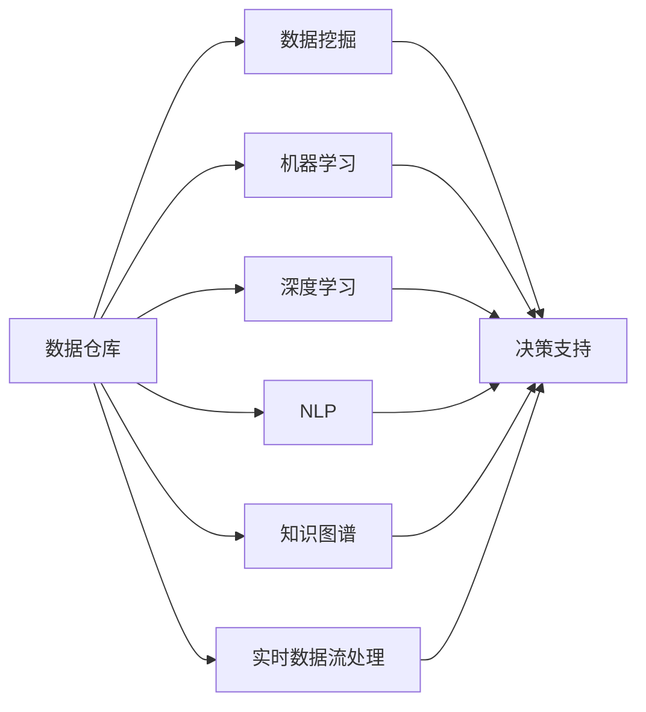
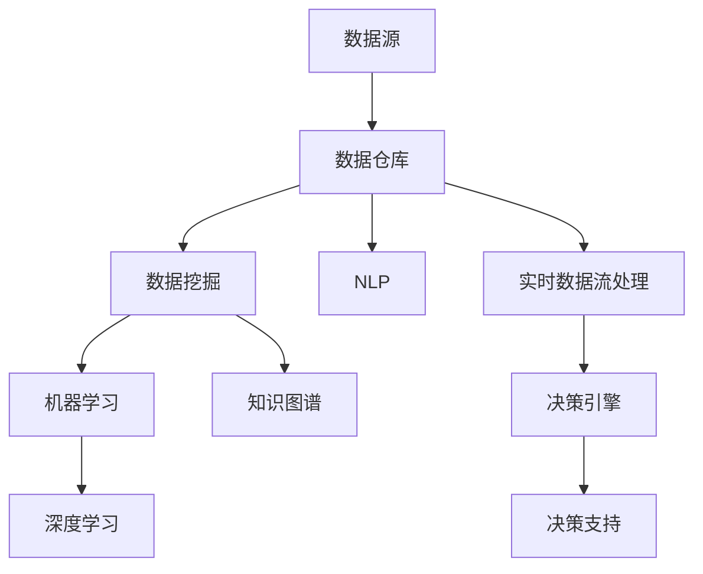

                 

# 决策支持系统的AI革命：从数据到洞见

## 1. 背景介绍

### 1.1 问题由来

在当前快速变化的市场环境中，企业需要做出快速、准确的决策来保持竞争力。然而，传统的数据分析方法存在以下局限性：

- **数据孤岛**：不同部门之间的数据无法共享，形成信息孤岛。
- **数据量庞大**：随着业务的发展，数据量呈指数级增长，导致分析难度增大。
- **分析复杂**：涉及多维数据，需要复杂的统计分析手段。
- **实时性不足**：缺乏实时的数据更新和分析能力。

这些问题导致企业无法迅速从大量数据中提炼出有价值的洞见，从而影响了决策的准确性和及时性。决策支持系统（DSS）作为一种辅助企业决策的工具，旨在通过集成先进的人工智能（AI）技术，帮助企业快速、高效地从数据中获取洞见，从而优化决策过程。

### 1.2 问题核心关键点

DSS的核心目标是通过AI技术将海量、复杂的数据转化为易于理解和利用的洞见，以支持企业的战略决策。其关键点包括：

- **数据融合**：将分散在各个部门的数据集进行整合和标准化，形成一个完整的数据视图。
- **智能分析**：通过机器学习、深度学习等AI技术对数据进行多角度、多维度的分析，挖掘出隐藏的洞见。
- **实时处理**：构建实时数据流处理系统，使分析过程能够及时响应业务需求。
- **可视化和交互**：使用数据可视化工具，将分析结果直观展示给决策者，并支持交互式探索。

### 1.3 问题研究意义

研究DSS的AI革命，对于提高企业决策效率、优化决策质量具有重要意义：

- **加速决策过程**：通过自动化数据分析，缩短决策周期，快速响应市场变化。
- **提升决策准确性**：利用先进AI技术，挖掘数据中的深层次洞见，降低人为错误。
- **优化资源配置**：帮助企业识别最优的资源分配方案，提高资源利用率。
- **支持创新发展**：通过洞见驱动的决策，促进企业创新，保持市场竞争力。
- **增强风险管理**：通过预测分析，提前识别潜在风险，采取预防措施。

## 2. 核心概念与联系

### 2.1 核心概念概述

DSS的AI革命涉及多个核心概念，这些概念之间相互关联，共同构成了DSS的技术架构：

- **数据仓库（Data Warehouse, DW）**：用于集中存储和管理企业历史数据，是DSS的基础。
- **数据挖掘（Data Mining）**：通过智能算法从数据中发现模式和关联，为决策提供支持。
- **机器学习（Machine Learning, ML）**：利用训练好的模型进行预测和分类，增强决策的准确性。
- **深度学习（Deep Learning, DL）**：处理复杂非线性关系，提升数据分析的深度和精度。
- **自然语言处理（Natural Language Processing, NLP）**：理解、分析和生成自然语言，支持文本数据处理。
- **知识图谱（Knowledge Graph）**：将结构化数据与非结构化知识结合，形成知识体系。
- **实时数据流处理（Stream Processing）**：处理实时数据，支持实时决策。

这些概念通过数据分析、智能分析和知识推理等技术手段，帮助企业从数据中提炼洞见，从而支持更科学的决策。

### 2.2 概念间的关系

这些核心概念之间的关系可以用以下Mermaid流程图来展示：



这个流程图展示了各个核心概念在DSS中的作用及其相互关系：

1. **数据仓库**：提供原始数据存储和处理能力。
2. **数据挖掘**：从数据中发现模式和关联，为决策提供初步支持。
3. **机器学习**：利用训练好的模型进行预测和分类，提升决策准确性。
4. **深度学习**：处理复杂非线性关系，提升数据分析的深度和精度。
5. **自然语言处理**：支持文本数据的理解、分析和生成。
6. **知识图谱**：将结构化数据与非结构化知识结合，形成知识体系。
7. **实时数据流处理**：处理实时数据，支持实时决策。

这些概念共同构成了DSS的技术基础，使得企业能够从数据中提炼出有价值的洞见，优化决策过程。

### 2.3 核心概念的整体架构

最终，这些概念通过DSS的核心组件——决策支持平台，形成一个完整的系统架构。以下是一个综合的流程图：



这个综合流程图展示了DSS从数据源到决策支持的完整过程：

1. **数据源**：原始数据来源，如数据库、API接口等。
2. **数据仓库**：集中存储和管理数据。
3. **数据挖掘**：从数据中发现模式和关联。
4. **机器学习**：利用模型进行预测和分类。
5. **深度学习**：处理复杂非线性关系。
6. **自然语言处理**：支持文本数据处理。
7. **知识图谱**：将结构化数据与非结构化知识结合。
8. **实时数据流处理**：处理实时数据。
9. **决策引擎**：根据分析结果，生成决策建议。
10. **决策支持**：将决策建议呈现给决策者。

## 3. 核心算法原理 & 具体操作步骤

### 3.1 算法原理概述

DSS的AI革命主要依赖于AI技术的算法原理，包括数据挖掘、机器学习和深度学习等。其核心原理可以总结如下：

1. **数据预处理**：清洗、转换、归一化数据，使其符合模型要求。
2. **特征工程**：提取、选择、构造特征，提高模型的解释性和泛化能力。
3. **模型训练**：使用训练数据集训练模型，使其能够进行预测和分类。
4. **模型评估**：使用测试数据集评估模型的性能，优化模型参数。
5. **模型部署**：将训练好的模型部署到生产环境，进行实时预测和决策。

### 3.2 算法步骤详解

以下是对DSS中常用算法步骤的详细讲解：

**Step 1: 数据准备**

1. **数据收集**：从各个数据源收集数据，包括结构化数据和非结构化数据。
2. **数据清洗**：去除重复、错误、不完整的数据，确保数据质量。
3. **数据转换**：将数据转换为标准格式，如CSV、JSON等。
4. **数据归一化**：将数据进行归一化处理，使模型能够更好地处理数据。

**Step 2: 特征工程**

1. **特征提取**：从原始数据中提取特征，如时间戳、地理位置、文本特征等。
2. **特征选择**：选择对预测结果有重要影响的特征。
3. **特征构造**：构造新的特征，如时间窗口、滑动窗口、特征组合等。
4. **特征降维**：通过降维技术，减少特征数量，提高模型效率。

**Step 3: 模型训练**

1. **模型选择**：根据任务类型选择合适的模型，如线性回归、决策树、随机森林、支持向量机、神经网络等。
2. **模型调参**：调整模型的超参数，如学习率、正则化参数等，优化模型性能。
3. **模型训练**：使用训练数据集训练模型，最小化损失函数，更新模型参数。
4. **模型验证**：使用验证数据集评估模型性能，避免过拟合。

**Step 4: 模型评估**

1. **模型评估指标**：选择合适的评估指标，如准确率、召回率、F1分数、ROC曲线等。
2. **交叉验证**：使用交叉验证方法，确保模型性能的稳定性和泛化能力。
3. **模型优化**：根据评估结果，优化模型结构或参数。

**Step 5: 模型部署**

1. **模型保存**：将训练好的模型保存为文件或数据库。
2. **模型加载**：在生产环境中部署模型，确保模型性能的一致性。
3. **模型接口**：开发模型API接口，方便应用系统调用。
4. **实时处理**：构建实时数据流处理系统，实现实时决策。

### 3.3 算法优缺点

DSS的AI革命具有以下优点：

1. **自动化**：自动化数据分析和决策支持，提高工作效率。
2. **智能性**：利用AI技术，挖掘数据中的深层次洞见，提升决策准确性。
3. **实时性**：实时数据流处理，支持快速决策。
4. **可扩展性**：可以处理大规模数据，支持多维数据分析。
5. **易用性**：提供可视化工具，使得非技术背景的决策者也能理解和使用。

同时，也存在以下缺点：

1. **数据质量依赖**：数据质量直接影响模型的性能和决策的准确性。
2. **模型复杂性**：模型的选择和调参需要专业知识，增加了实施难度。
3. **计算资源需求高**：处理大规模数据和复杂模型需要高性能计算资源。
4. **解释性不足**：部分AI模型，如深度学习模型，缺乏可解释性，难以理解其内部机制。
5. **安全风险**：数据和模型需要保护，避免数据泄露和模型篡改。

### 3.4 算法应用领域

DSS的AI革命已经广泛应用于多个领域，包括：

- **金融风控**：使用数据挖掘和机器学习模型，进行信用评估、风险预测和欺诈检测。
- **供应链管理**：利用深度学习和大数据技术，优化库存管理、物流调度和供应商评估。
- **市场营销**：通过自然语言处理和知识图谱技术，分析用户行为和市场需求，制定营销策略。
- **人力资源管理**：使用机器学习和大数据技术，优化招聘流程、员工评估和培训计划。
- **医疗健康**：应用数据挖掘和预测模型，进行疾病预测、诊断和治疗方案推荐。
- **智能制造**：利用实时数据流处理和智能分析，优化生产流程和设备维护。
- **智慧城市**：通过实时数据分析和决策支持，优化交通、能源和公共安全管理。

## 4. 数学模型和公式 & 详细讲解 & 举例说明

### 4.1 数学模型构建

DSS中常用的数学模型包括线性回归、逻辑回归、决策树、随机森林、支持向量机、神经网络等。以下以线性回归为例，介绍其数学模型构建：

假设输入数据集为 $X=\{x_1,x_2,...,x_n\}$，其中 $x_i=(x_{i1},x_{i2},...,x_{in})$，目标变量为 $y=\{y_1,y_2,...,y_n\}$，线性回归模型的目标是最小化预测值与真实值之间的平方误差，即：

$$
\min_{\theta} \sum_{i=1}^n (y_i - \theta \cdot x_i)^2
$$

其中 $\theta$ 为模型参数，包含截距和特征系数。

### 4.2 公式推导过程

根据线性回归的目标函数，我们可以得到模型参数的求解公式为：

$$
\theta = (X^TX)^{-1}X^Ty
$$

其中 $X^TX$ 为数据矩阵的转置与自身的乘积，$X^Ty$ 为数据矩阵的转置与目标向量的乘积。

在实际应用中，为了提高模型的泛化能力，我们还需要加入正则化项，如L1正则和L2正则。L1正则通过引入稀疏性，避免特征之间的多重共线性，L2正则通过引入权重衰减，防止过拟合。

### 4.3 案例分析与讲解

假设我们有一组销售数据，包括时间、广告费用和销售额。我们可以使用线性回归模型预测销售额与广告费用之间的关系。

首先，收集历史销售数据，并将其转换为模型可接受的格式。然后，使用训练数据集训练模型，通过交叉验证方法评估模型性能。最后，在测试数据集上使用训练好的模型进行预测，并根据预测结果优化广告策略。

## 5. 项目实践：代码实例和详细解释说明

### 5.1 开发环境搭建

要实现DSS的AI革命，我们需要搭建一个包含多个组件的开发环境，包括数据源、数据仓库、数据挖掘、机器学习、深度学习、自然语言处理、知识图谱和实时数据流处理等。以下是一个简单的搭建流程：

1. **数据源**：使用AWS S3、阿里云对象存储等云存储服务，收集和存储原始数据。
2. **数据仓库**：使用Amazon Redshift、阿里云Elastic Compute Service等数据库，集中存储和管理数据。
3. **数据挖掘**：使用Scikit-learn、TensorFlow等开源库，进行数据挖掘和特征工程。
4. **机器学习**：使用Scikit-learn、TensorFlow、PyTorch等库，训练和优化模型。
5. **深度学习**：使用TensorFlow、PyTorch等库，构建深度学习模型。
6. **自然语言处理**：使用NLTK、spaCy等库，进行文本数据处理和分析。
7. **知识图谱**：使用GATE、OntoGraph等工具，构建和查询知识图谱。
8. **实时数据流处理**：使用Apache Kafka、Apache Flink等库，构建实时数据流处理系统。

### 5.2 源代码详细实现

以下是一个使用Scikit-learn库进行线性回归模型训练的示例代码：

```python
from sklearn.linear_model import LinearRegression
from sklearn.model_selection import train_test_split
from sklearn.metrics import mean_squared_error
from sklearn.preprocessing import StandardScaler

# 加载数据
data = pd.read_csv('sales_data.csv')

# 数据预处理
X = data[['ad_cost']]
y = data['sales']
X_train, X_test, y_train, y_test = train_test_split(X, y, test_size=0.2, random_state=42)

# 标准化数据
scaler = StandardScaler()
X_train = scaler.fit_transform(X_train)
X_test = scaler.transform(X_test)

# 模型训练
model = LinearRegression()
model.fit(X_train, y_train)

# 模型评估
y_pred = model.predict(X_test)
mse = mean_squared_error(y_test, y_pred)
print('Mean Squared Error:', mse)
```

### 5.3 代码解读与分析

上述代码实现了线性回归模型的训练和评估。具体步骤如下：

1. **数据加载**：使用Pandas库加载原始数据集。
2. **数据预处理**：将数据集分为特征变量和目标变量，并使用train_test_split方法进行训练集和测试集的划分。
3. **数据标准化**：使用StandardScaler标准化数据，确保模型能够更好地处理数据。
4. **模型训练**：使用LinearRegression模型训练数据，最小化预测值与真实值之间的平方误差。
5. **模型评估**：使用均方误差（Mean Squared Error）评估模型性能。

在实际应用中，我们还需要根据具体任务和数据特点进行优化和调整，如引入正则化项、使用更复杂的模型等。

### 5.4 运行结果展示

假设在测试集上评估模型的性能，得到均方误差为10，则表示模型预测结果与真实值之间的平均误差为10，模型性能较好。

## 6. 实际应用场景

### 6.1 智能客服系统

智能客服系统利用DSS的AI革命，通过自然语言处理和知识图谱技术，实现自动应答和问题解决。企业可以收集历史客服对话记录，训练机器学习模型，进行意图识别和实体抽取，构建知识图谱，为系统提供丰富的知识库支持。通过这些技术，智能客服系统能够理解客户需求，提供准确的回答和解决方案，提升客户满意度。

### 6.2 金融风险管理

金融行业利用DSS的AI革命，通过数据挖掘和机器学习模型，进行信用评估、风险预测和欺诈检测。金融机构可以收集客户的历史交易数据，构建数据仓库，使用机器学习模型进行预测和分类，评估客户的信用风险和欺诈风险。通过这些技术，金融机构能够及时识别风险，采取预防措施，保障金融安全。

### 6.3 供应链管理

供应链管理利用DSS的AI革命，通过实时数据流处理和智能分析，优化库存管理、物流调度和供应商评估。企业可以构建实时数据流处理系统，实时监控供应链数据，使用机器学习模型进行需求预测和库存优化。通过这些技术，企业能够提高供应链的效率和透明度，降低运营成本。

### 6.4 市场营销

市场营销利用DSS的AI革命，通过自然语言处理和知识图谱技术，分析用户行为和市场需求，制定营销策略。企业可以收集社交媒体和搜索引擎数据，构建知识图谱，使用机器学习模型进行情感分析和趋势预测。通过这些技术，企业能够精准定位目标客户，制定个性化的营销策略，提升营销效果。

## 7. 工具和资源推荐

### 7.1 学习资源推荐

为了帮助开发者系统掌握DSS的AI革命，以下是一些优质的学习资源：

1. **《数据科学与人工智能》课程**：由斯坦福大学开设，涵盖数据科学和人工智能的基础知识和前沿技术，适合初学者和进阶者。
2. **Kaggle**：提供海量数据集和竞赛平台，帮助开发者实践和提升技能。
3. **Coursera**：提供多门深度学习、机器学习和自然语言处理课程，涵盖从入门到进阶的内容。
4. **ArXiv**：学术论文预印本平台，获取最新研究成果和前沿论文。
5. **Github**：开源项目平台，查找和贡献高质量的代码和项目。

### 7.2 开发工具推荐

为了高效实现DSS的AI革命，以下是一些推荐的开发工具：

1. **Scikit-learn**：Python数据挖掘和机器学习库，提供了丰富的模型和算法。
2. **TensorFlow**：开源深度学习框架，支持分布式计算和GPU加速。
3. **PyTorch**：开源深度学习框架，支持动态计算图和自动微分。
4. **NLTK**：自然语言处理库，提供文本处理和分析工具。
5. **GATE**：文本处理和信息检索工具，支持知识图谱构建和查询。
6. **Apache Kafka**：实时数据流处理库，支持数据采集和处理。
7. **Apache Flink**：实时数据流处理框架，支持分布式计算和状态管理。

### 7.3 相关论文推荐

以下是一些经典和前沿的DSS论文，推荐阅读：

1. **《基于数据挖掘的客户细分方法研究》**：研究数据挖掘在客户细分中的应用，提出多种数据挖掘技术。
2. **《深度学习在金融风险预测中的应用》**：探讨深度学习在金融风险预测中的优势和应用。
3. **《自然语言处理技术在智能客服中的应用》**：介绍自然语言处理技术在智能客服中的实现和效果。
4. **《知识图谱在智能制造中的应用》**：探讨知识图谱在智能制造中的数据整合和应用。
5. **《实时数据流处理系统设计》**：介绍实时数据流处理系统的设计思路和实现方法。

## 8. 总结：未来发展趋势与挑战

### 8.1 研究成果总结

DSS的AI革命在多个领域得到了广泛应用，显著提升了企业决策的效率和质量。通过数据挖掘、机器学习、深度学习等技术，企业能够从海量数据中提炼出有价值的洞见，优化决策过程。DSS技术的发展为企业的数字化转型和智能化升级提供了强大的支持。

### 8.2 未来发展趋势

展望未来，DSS的AI革命将呈现以下发展趋势：

1. **智能化程度提升**：利用更先进的AI技术，提高决策支持的智能化水平。
2. **实时性增强**：构建实时数据流处理系统，支持更快速、更准确的决策。
3. **跨领域融合**：与其他人工智能技术，如自然语言处理、知识图谱、计算机视觉等进行更深入的融合，形成更全面的智能系统。
4. **自适应学习**：引入自适应学习机制，使系统能够不断学习新知识，保持性能的持续提升。
5. **可解释性增强**：提升模型的可解释性，帮助决策者理解模型的推理过程。

### 8.3 面临的挑战

尽管DSS的AI革命已经取得了显著成果，但在其应用过程中仍面临以下挑战：

1. **数据隐私和安全**：数据泄露和隐私保护是DSS应用的重要挑战，需要采取数据脱敏和加密等措施。
2. **模型鲁棒性**：模型在面对异常数据和噪声时，容易发生误判，需要引入鲁棒性更强的算法。
3. **计算资源需求**：处理大规模数据和复杂模型需要高性能计算资源，如何优化资源使用是一个重要问题。
4. **可解释性不足**：部分AI模型缺乏可解释性，难以理解其内部机制，需要更多的可解释性研究。
5. **业务融合度低**：DSS技术与业务流程的融合度较低，需要更多的定制化开发。

### 8.4 研究展望

针对这些挑战，未来的研究可以从以下几个方面进行探索：

1. **数据隐私保护**：研究数据脱敏和加密技术，保护数据隐私。
2. **鲁棒性增强**：开发鲁棒性更强的算法，提高模型的稳定性。
3. **资源优化**：优化计算资源使用，提高模型的可部署性。
4. **可解释性提升**：研究可解释性模型和工具，增强模型的透明性。
5. **业务融合**：结合业务流程，进行定制化开发和应用。

总之，DSS的AI革命将带来更高效的决策支持，提升企业的竞争力和市场反应速度。但同时也需要在数据隐私、模型鲁棒性、计算资源、可解释性和业务融合等方面不断探索和改进，才能实现更广泛的应用和更深远的社会影响。

## 9. 附录：常见问题与解答

**Q1: 什么是数据挖掘和机器学习？**

A: 数据挖掘是从数据中发现模式、规律和关联的过程，通常使用统计学、模式识别和机器学习等技术。机器学习则是利用算法和模型，从数据中学习和预测的过程，包括监督学习、无监督学习和半监督学习等。

**Q2: 如何使用数据挖掘和机器学习进行风险预测？**

A: 风险预测通常使用监督学习模型，如逻辑回归、决策树、随机森林、支持向量机等。首先，收集历史数据，将其分为特征变量和目标变量。然后，使用训练数据集训练模型，通过交叉验证评估模型性能。最后，在测试数据集上使用训练好的模型进行预测，并根据预测结果评估风险。

**Q3: 什么是知识图谱？**

A: 知识图谱是一种用于存储和查询知识库的工具，通常由节点和边组成。节点代表实体，边代表实体之间的关系。通过知识图谱，可以更好地理解数据之间的关联和语义关系。

**Q4: 如何进行知识图谱的构建和查询？**

A: 知识图谱的构建通常使用GATE、OntoGraph等工具，通过自然语言处理和数据挖掘技术，从文本数据中抽取实体和关系，构建知识图谱。知识图谱的查询可以使用SPARQL等查询语言，通过节点和边之间的关联进行检索和分析。

**Q5: 什么是实时数据流处理？**

A: 实时数据流处理是指对实时产生的数据进行采集、处理和分析的过程。通常使用Apache Kafka、Apache Flink等工具，支持分布式计算和状态管理。实时数据流处理可以及时响应业务需求，提供实时决策支持。

---

作者：禅与计算机程序设计艺术 / Zen and the Art of Computer Programming

