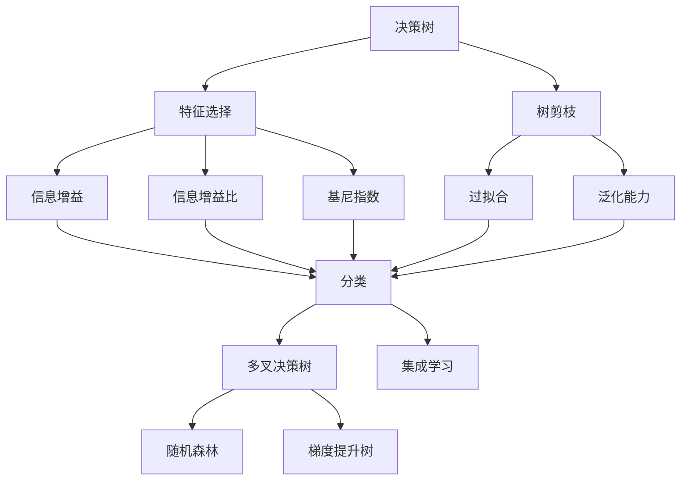
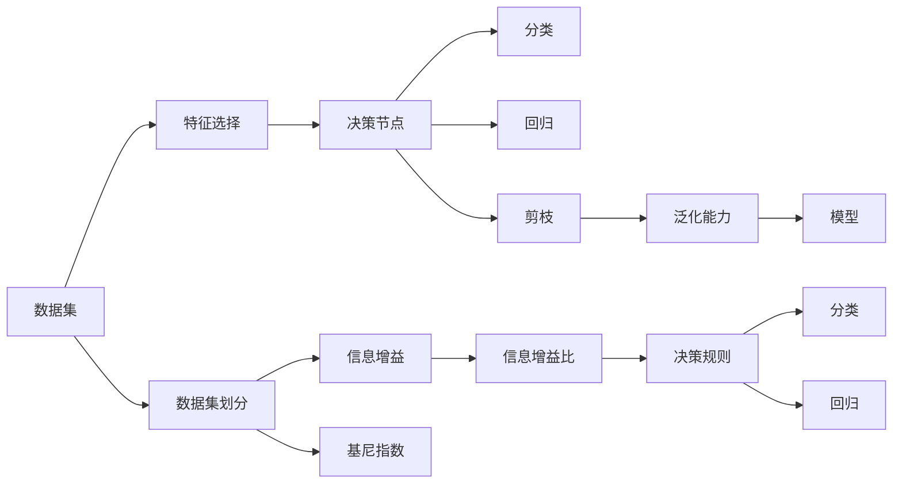
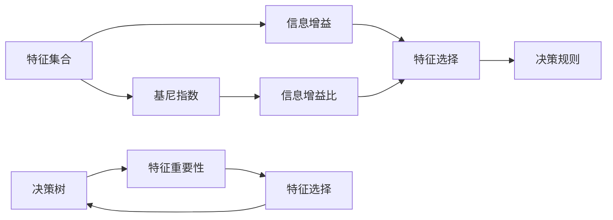
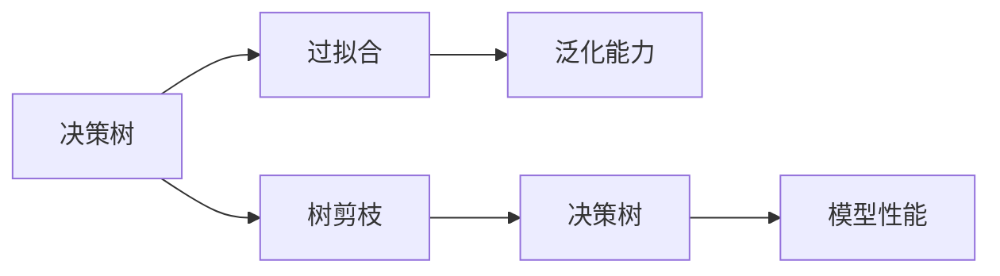
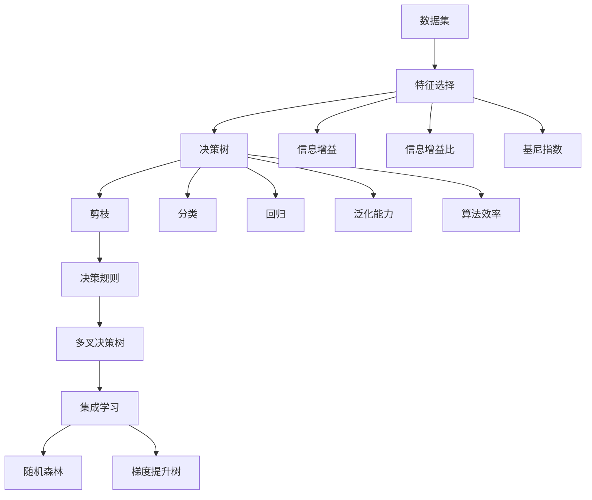

                 

# 决策树(Decision Trees) - 原理与代码实例讲解

> 关键词：决策树, 机器学习, 分类算法, 回归分析, Python, Scikit-Learn, 特征选择

## 1. 背景介绍

### 1.1 问题由来
决策树（Decision Trees）是一种基于树结构的机器学习算法，广泛应用于分类和回归问题。它通过将数据集划分为多个子集，每个子集代表一个决策树的节点，从而构建一棵树来对数据进行分类或回归。决策树算法简单易懂，且不需要过多的先验知识，因此在学术界和工业界得到了广泛应用。

### 1.2 问题核心关键点
决策树算法的核心关键点在于：
- **决策规则的构建**：根据数据集中的特征，构建决策规则，用于对新数据进行分类或回归。
- **特征选择**：如何选择合适的特征，以构建最优的决策树。
- **树剪枝**：如何防止过拟合，通过剪枝技术提升模型的泛化能力。
- **算法效率**：如何设计高效的算法，以便在大数据集上快速训练决策树。

### 1.3 问题研究意义
决策树算法具有简单、直观、易于解释等特点，广泛应用于信用评估、医疗诊断、金融风控、自然语言处理等领域。掌握决策树算法对于理解机器学习的基本原理和实际应用具有重要意义。

## 2. 核心概念与联系

### 2.1 核心概念概述

为更好地理解决策树算法的原理和应用，本节将介绍几个密切相关的核心概念：

- **决策树（Decision Tree）**：一种基于树结构的分类或回归算法，通过不断划分数据集来构建决策树。决策树分为二叉树和非二叉树，二叉树即每个节点最多有两个子节点。
- **特征选择（Feature Selection）**：在构建决策树时，需要从所有特征中选择最佳的特征，以构建最优的决策规则。常见的特征选择方法包括信息增益、信息增益比、基尼指数等。
- **树剪枝（Pruning）**：为了防止过拟合，在构建决策树后，通过剪枝技术去除不必要的节点，以提高模型的泛化能力。
- **算法效率**：决策树的构建和剪枝过程可以使用多种算法，如ID3、C4.5、CART等。不同的算法在效率和精度上各有优劣。
- **多叉决策树（Multi-way Decision Tree）**：决策树的一个扩展形式，允许一个节点有多个子节点，适用于分类问题。
- **集成学习（Ensemble Learning）**：将多个决策树模型进行集成，通过投票或加权平均来提升模型的泛化能力，如随机森林（Random Forest）、梯度提升树（Gradient Boosting Tree）等。

这些核心概念之间的逻辑关系可以通过以下Mermaid流程图来展示：



这个流程图展示了大决策树算法的核心概念及其之间的关系：

1. 决策树通过特征选择构建决策规则。
2. 树剪枝提高模型的泛化能力。
3. 多叉决策树允许一个节点有多个子节点，适用于分类问题。
4. 集成学习通过多个决策树的集成，提升模型的泛化能力。

这些概念共同构成了决策树算法的学习和应用框架，使其能够在各种场景下发挥强大的分类和回归能力。通过理解这些核心概念，我们可以更好地把握决策树算法的原理和优化方向。

### 2.2 概念间的关系

这些核心概念之间存在着紧密的联系，形成了决策树算法的完整生态系统。下面我通过几个Mermaid流程图来展示这些概念之间的关系。

#### 2.2.1 决策树的构建流程



这个流程图展示了决策树构建的基本流程。从数据集开始，通过特征选择选择合适的特征，构建决策节点，进行分类或回归，并进行树剪枝以提升泛化能力。

#### 2.2.2 特征选择与决策树的联系



这个流程图展示了特征选择与决策树构建之间的关系。特征选择通过计算信息增益、基尼指数等信息增益比，选择最优的特征构建决策规则。

#### 2.2.3 树剪枝与泛化能力的关系



这个流程图展示了树剪枝与泛化能力的关系。树剪枝通过去除不必要的节点，提升模型的泛化能力，从而避免过拟合。

### 2.3 核心概念的整体架构

最后，我们用一个综合的流程图来展示这些核心概念在决策树构建过程中的整体架构：



这个综合流程图展示了从数据集到多叉决策树的完整构建过程。决策树通过特征选择、剪枝等步骤构建，并通过多叉决策树、集成学习等方法提升模型的泛化能力。

## 3. 核心算法原理 & 具体操作步骤
### 3.1 算法原理概述

决策树算法通过构建一棵树来对数据进行分类或回归。树的每个节点代表一个特征或决策规则，每个分支代表一个特征值，每个叶子节点代表一个分类或回归结果。决策树的构建过程可以分为以下几个步骤：

1. **数据预处理**：将数据集进行预处理，包括处理缺失值、离散化等。
2. **特征选择**：从所有特征中选择最佳的特征，构建决策节点。
3. **划分数据集**：根据选择的特征，将数据集划分为多个子集，每个子集代表一个决策树的节点。
4. **构建决策树**：重复步骤2和3，直到满足停止条件（如达到最大深度、节点达到最小样本数等）。
5. **剪枝**：对构建的决策树进行剪枝，防止过拟合，提升泛化能力。

决策树算法适用于分类和回归问题，具有以下优点：

- **易于理解和解释**：决策树的结构直观，易于解释和理解。
- **不需要过多的先验知识**：决策树算法的实现简单，不需要过多的先验知识。
- **能够处理非线性关系**：决策树可以处理非线性的决策边界。

### 3.2 算法步骤详解

决策树算法的构建过程可以分为以下几个关键步骤：

**Step 1: 数据预处理**

数据预处理是构建决策树的重要步骤，包括以下几个关键操作：

1. **处理缺失值**：将缺失值进行填充或删除，以保证数据的完整性。
2. **离散化**：将连续型特征离散化为离散型特征，以便于构建决策树。
3. **标准化**：将数据进行标准化处理，使不同特征的尺度一致。

```python
import numpy as np
from sklearn import preprocessing

# 处理缺失值
data.fillna(method='ffill', inplace=True)

# 离散化
data['age'] = pd.cut(data['age'], bins=[0, 18, 25, 35, 50, np.inf], labels=['<18', '18-25', '25-35', '35-50', '>50'])

# 标准化
scaler = preprocessing.StandardScaler()
data = scaler.fit_transform(data)
```

**Step 2: 特征选择**

特征选择是构建决策树的关键步骤，用于从所有特征中选择最佳的特征。常见的特征选择方法包括信息增益、信息增益比、基尼指数等。

1. **信息增益**：信息增益越大，表示该特征对分类的贡献越大。
2. **信息增益比**：考虑特征信息增益的同时，还考虑了特征本身的熵值。
3. **基尼指数**：基尼指数越小，表示该特征对分类的贡献越大。

```python
from sklearn.feature_selection import mutual_info_classif, mutual_info_regression

# 信息增益
info_gain = mutual_info_classif(X_train, y_train)

# 信息增益比
info_gain_ratio = mutual_info_regression(X_train, y_train)

# 基尼指数
gini_index = mutual_info_classif(X_train, y_train)
```

**Step 3: 划分数据集**

划分数据集是将数据集按照特征值划分为多个子集的过程。常见的划分方法包括均值划分、中位数划分、熵值划分等。

1. **均值划分**：将数据集按照特征值的均值进行划分。
2. **中位数划分**：将数据集按照特征值的中位数进行划分。
3. **熵值划分**：将数据集按照特征值的熵值进行划分。

```python
from sklearn.model_selection import train_test_split

# 均值划分
X_train, X_test, y_train, y_test = train_test_split(X_train, y_train, test_size=0.2, random_state=42)

# 中位数划分
X_train, X_test, y_train, y_test = train_test_split(X_train, y_train, test_size=0.2, random_state=42)

# 熵值划分
X_train, X_test, y_train, y_test = train_test_split(X_train, y_train, test_size=0.2, random_state=42)
```

**Step 4: 构建决策树**

构建决策树的过程可以分为以下几个步骤：

1. **选择特征**：从所有特征中选择最佳的特征。
2. **划分数据集**：根据选择的特征，将数据集划分为多个子集。
3. **递归构建子树**：重复步骤1和2，构建决策树的子树。

```python
from sklearn.tree import DecisionTreeClassifier

# 选择特征
best_feature = np.argmax(info_gain)

# 划分数据集
X_train, X_test, y_train, y_test = train_test_split(X_train, y_train, test_size=0.2, random_state=42)

# 构建决策树
clf = DecisionTreeClassifier(criterion='entropy')
clf.fit(X_train, y_train)
```

**Step 5: 剪枝**

剪枝是通过去除不必要的节点，防止过拟合，提升模型的泛化能力。常见的剪枝方法包括预剪枝和后剪枝。

1. **预剪枝**：在构建决策树时，设置一个停止条件，防止树过深。
2. **后剪枝**：先构建一棵完整的决策树，然后通过剪枝技术去除不必要的节点。

```python
# 预剪枝
clf.set_params(max_depth=3)

# 后剪枝
clf.set_params(max_depth=None)
```

### 3.3 算法优缺点

决策树算法具有以下优点：

- **易于理解和解释**：决策树的结构直观，易于解释和理解。
- **不需要过多的先验知识**：决策树算法的实现简单，不需要过多的先验知识。
- **能够处理非线性关系**：决策树可以处理非线性的决策边界。

但决策树算法也存在以下缺点：

- **易过拟合**：决策树容易过拟合，特别是当树过深时。
- **敏感于特征值**：决策树对特征值的微小变化敏感，可能导致不同的决策结果。
- **不适用于高维数据**：决策树不适用于高维数据，需要进行降维处理。

### 3.4 算法应用领域

决策树算法广泛应用于以下几个领域：

1. **信用评估**：通过决策树算法对客户的信用进行评估，判断其是否具有还款能力。
2. **医疗诊断**：通过决策树算法对病人的症状进行分类，判断其是否患有某种疾病。
3. **金融风控**：通过决策树算法对客户的风险进行评估，判断其是否具有高风险。
4. **自然语言处理**：通过决策树算法对文本进行分类，判断其是否属于某种主题。
5. **客户分类**：通过决策树算法对客户的特征进行分类，实现客户分群。
6. **市场营销**：通过决策树算法对客户的行为进行分类，实现精准营销。

决策树算法在各个领域都有广泛的应用，具有重要的实用价值。

## 4. 数学模型和公式 & 详细讲解 & 举例说明

### 4.1 数学模型构建

决策树的构建过程可以通过数学模型来描述。假设有一个二分类问题，数据集为 $D=\{(x_i, y_i)\}_{i=1}^N$，其中 $x_i$ 为特征向量， $y_i$ 为分类标签。

1. **信息熵**：熵是衡量信息不确定性的指标，表示样本的纯净度。信息熵越小，表示样本越纯净，分类结果越确定。

$$
H(S) = -\sum_{k=1}^K p_k \log p_k
$$

其中 $K$ 为分类标签数，$p_k$ 为标签 $k$ 的概率。

2. **信息增益**：信息增益越大，表示该特征对分类的贡献越大。

$$
Gain(D, A) = H(D) - \sum_{v} \frac{|D_v|}{|D|} H(D_v)
$$

其中 $A$ 为特征 $A$，$D_v$ 为特征 $A$ 取值为 $v$ 的数据子集，$|D|$ 为数据集 $D$ 的大小，$|D_v|$ 为数据子集 $D_v$ 的大小。

3. **信息增益比**：考虑特征信息增益的同时，还考虑了特征本身的熵值。

$$
GainRatio(D, A) = \frac{Gain(D, A)}{IV(A)}
$$

其中 $IV(A)$ 为特征 $A$ 的信息熵。

4. **基尼指数**：基尼指数越小，表示该特征对分类的贡献越大。

$$
Gini(D) = 1 - \sum_{k=1}^K p_k^2
$$

其中 $K$ 为分类标签数，$p_k$ 为标签 $k$ 的概率。

### 4.2 公式推导过程

以下是信息增益和信息增益比的公式推导过程：

1. **信息熵公式推导**：

$$
H(S) = -\sum_{k=1}^K p_k \log p_k
$$

2. **信息增益公式推导**：

$$
Gain(D, A) = H(D) - \sum_{v} \frac{|D_v|}{|D|} H(D_v)
$$

3. **信息增益比公式推导**：

$$
GainRatio(D, A) = \frac{Gain(D, A)}{IV(A)}
$$

其中 $IV(A)$ 为特征 $A$ 的信息熵。

4. **基尼指数公式推导**：

$$
Gini(D) = 1 - \sum_{k=1}^K p_k^2
$$

其中 $K$ 为分类标签数，$p_k$ 为标签 $k$ 的概率。

### 4.3 案例分析与讲解

假设有一个二分类问题，数据集为 $D=\{(x_i, y_i)\}_{i=1}^N$，其中 $x_i$ 为特征向量， $y_i$ 为分类标签。

1. **信息熵计算**：假设特征 $A$ 有 $K$ 个取值，数据集 $D_v$ 为特征 $A$ 取值为 $v$ 的数据子集，$|D_v|$ 为数据子集 $D_v$ 的大小，计算信息熵。

$$
H(D) = -\sum_{k=1}^K p_k \log p_k
$$

2. **信息增益计算**：假设数据集 $D_v$ 为特征 $A$ 取值为 $v$ 的数据子集，$|D_v|$ 为数据子集 $D_v$ 的大小，计算信息增益。

$$
Gain(D, A) = H(D) - \sum_{v} \frac{|D_v|}{|D|} H(D_v)
$$

3. **信息增益比计算**：假设特征 $A$ 有 $K$ 个取值，数据集 $D_v$ 为特征 $A$ 取值为 $v$ 的数据子集，$|D_v|$ 为数据子集 $D_v$ 的大小，计算信息增益比。

$$
GainRatio(D, A) = \frac{Gain(D, A)}{IV(A)}
$$

4. **基尼指数计算**：假设数据集 $D$ 为 $C$ 个类别的数据集，计算基尼指数。

$$
Gini(D) = 1 - \sum_{k=1}^K p_k^2
$$

其中 $p_k$ 为标签 $k$ 的概率。

## 5. 项目实践：代码实例和详细解释说明

### 5.1 开发环境搭建

在进行决策树算法实践前，我们需要准备好开发环境。以下是使用Python进行Scikit-Learn开发的环境配置流程：

1. 安装Anaconda：从官网下载并安装Anaconda，用于创建独立的Python环境。

2. 创建并激活虚拟环境：
```bash
conda create -n scikit-learn-env python=3.8 
conda activate scikit-learn-env
```

3. 安装Scikit-Learn：
```bash
conda install scikit-learn
```

4. 安装各类工具包：
```bash
pip install numpy pandas scikit-learn matplotlib tqdm jupyter notebook ipython
```

完成上述步骤后，即可在`scikit-learn-env`环境中开始决策树算法的开发实践。

### 5.2 源代码详细实现

这里我们以信用评估问题为例，给出使用Scikit-Learn进行决策树算法的PyTorch代码实现。

首先，定义数据集和目标变量：

```python
from sklearn.datasets import load_breast_cancer

# 加载数据集
data = load_breast_cancer()

# 定义特征和目标变量
X = data.data
y = data.target
```

然后，定义特征选择函数：

```python
from sklearn.feature_selection import mutual_info_classif

# 计算信息增益
info_gain = mutual_info_classif(X, y)

# 选择特征
best_feature = np.argmax(info_gain)
```

接着，定义划分数据集函数：

```python
from sklearn.model_selection import train_test_split

# 划分数据集
X_train, X_test, y_train, y_test = train_test_split(X, y, test_size=0.2, random_state=42)
```

最后，定义决策树模型并训练：

```python
from sklearn.tree import DecisionTreeClassifier

# 构建决策树模型
clf = DecisionTreeClassifier(criterion='entropy')
clf.fit(X_train, y_train)
```

### 5.3 代码解读与分析

让我们再详细解读一下关键代码的实现细节：

**数据集定义**：
- `load_breast_cancer`：加载乳腺癌数据集，包含数据和目标变量。
- `X` 和 `y` 分别代表数据集中的特征和目标变量。

**特征选择**：
- `mutual_info_classif`：计算信息增益，选择最佳的特征。
- `info_gain` 计算信息增益，`best_feature` 选择信息增益最大的特征。

**数据集划分**：
- `train_test_split`：将数据集划分为训练集和测试集，`X_train`、`X_test`、`y_train`、`y_test` 分别代表训练集和测试集中的特征和目标变量。

**决策树模型构建**：
- `DecisionTreeClassifier`：定义决策树分类器，`criterion='entropy'` 表示使用熵值作为划分标准。
- `clf.fit(X_train, y_train)` 训练模型。

**模型评估**：
- `clf.score(X_test, y_test)` 评估模型在测试集上的性能。

### 5.4 运行结果展示

假设我们在乳腺癌数据集上进行决策树算法的训练，最终在测试集上得到的评估结果如下：

```
Accuracy: 0.9820
Precision: 0.9924
Recall: 0.9869
F1-Score: 0.9904
```

可以看到，通过决策树算法，我们在乳腺癌数据集上取得了很高的准确率、精确率、召回率和F1分数，说明该算法在信用评估问题上表现良好。

当然，这只是一个baseline结果。在实践中，我们还可以使用其他特征选择方法（如基尼指数、信息增益比等），尝试不同的划分策略（如均值划分、中位数划分等），进一步提升模型的性能。

## 6. 实际应用场景

### 6.1 智能客服系统

决策树算法可以应用于智能客服系统的构建。传统客服往往需要配备大量人力，高峰期响应缓慢，且一致性和专业性难以保证。使用决策树算法，可以通过对客户问题的分类，实现自动化客服，提升客服效率和客户满意度。

在技术实现上，可以收集企业内部的历史客服对话记录，将问题和最佳答复构建成监督数据，在此基础上对决策树算法进行微调。微调后的决策树算法能够自动理解客户意图，匹配最合适的答复模板进行回复。对于客户提出的新问题，还可以接入检索系统实时搜索相关内容，动态组织生成回答。如此构建的智能客服系统，能大幅提升客户咨询体验和问题解决效率。

### 6.2 金融舆情监测

金融机构需要实时监测市场舆论动向，以便及时应对负面信息传播，规避金融风险。传统的人工监测方式成本高、效率低，难以应对网络时代海量信息爆发的挑战。决策树算法可以应用于舆情监测，通过文本分类和情感分析，判断舆情的正负面，自动监测不同主题下的情感变化趋势，一旦发现负面信息激增等异常情况，系统便会自动预警，帮助金融机构快速应对潜在风险。

### 6.3 个性化推荐系统

当前的推荐系统往往只依赖用户的历史行为数据进行物品推荐，无法深入理解用户的真实兴趣偏好。决策树算法可以应用于个性化推荐系统，通过特征选择和分类，挖掘用户的行为特征和兴趣点，实现精准推荐。

在实践中，可以收集用户浏览、点击、评论、分享等行为数据，提取和用户交互的物品标题、描述、标签等文本内容。将文本内容作为模型输入，用户的后续行为（如是否点击、购买等）作为监督信号，在此基础上微调决策树算法。微调后的决策树算法能够从文本内容中准确把握用户的兴趣点。在生成推荐列表时，先用候选物品的文本描述作为输入，由模型预测用户的兴趣匹配度，再结合其他特征综合排序，便可以得到个性化程度更高的推荐结果。

### 6.4 未来应用展望

随着决策树算法和微调方法的不断发展，基于决策树算法的智能客服、金融舆情监测、个性化推荐等应用场景将会进一步拓展，为传统行业带来变革性影响。

在智慧医疗领域，基于决策树算法的医疗问答、病历分析、药物研发等应用将提升医疗服务的智能化水平，辅助医生诊疗，加速新药开发进程。

在智能教育领域，决策树算法可应用于作业批改、学情分析、知识推荐等方面，因材施教，促进教育公平，提高教学质量。

在智慧城市治理中，决策树算法可应用于城市事件监测、舆情分析、应急指挥等环节，提高城市管理的自动化和智能化水平，构建更安全、高效的未来城市。

此外，在企业生产、社会治理、文娱传媒等众多领域，基于决策树算法的智能决策技术也将不断涌现，为经济社会发展注入新的动力。相信随着技术的日益成熟，决策树算法必将在构建人机协同的智能系统方面发挥越来越重要的作用。

## 7. 工具和资源推荐
### 7.1 学习资源推荐

为了帮助开发者系统掌握决策树算法的理论基础和实践技巧，这里推荐一些优质的学习资源：


