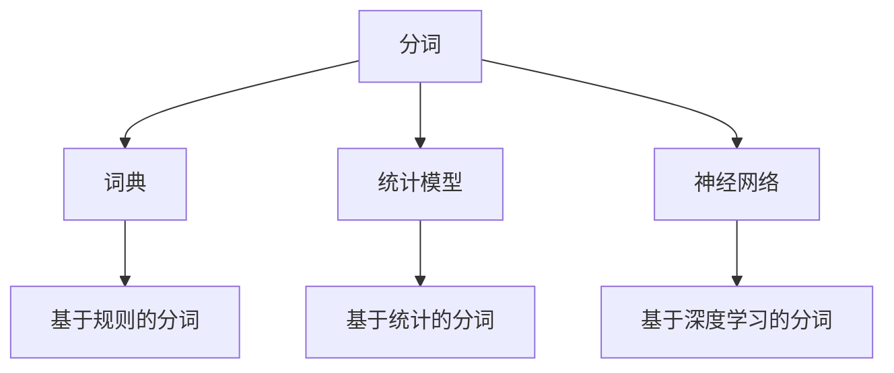

                 

# 分词 原理与代码实例讲解

> 关键词：分词, 分词算法, 分词库, 分词模型, 分词应用

## 1. 背景介绍

分词（Tokenization）是自然语言处理（NLP）中最基础的任务之一。在计算机系统中，语言被视为文本，文本被分割成词或字符序列，然后才能进一步处理和分析。分词的正确性直接影响到后续的文本分析效果，如命名实体识别（NER）、情感分析（Sentiment Analysis）、机器翻译（Machine Translation）、信息检索（Information Retrieval）等。

### 1.1 问题由来

自然语言文本的结构和格式多样化，没有固定的分隔符（如空格、标点符号等）来定义单词的边界。因此，文本分词任务是为了将自然语言转换为结构化的、易于计算机处理的文本数据，为后续文本分析任务奠定基础。例如，一篇英文文章中可能包含句子“I have a book on Python.”，分词后的结果应该是 [I, have, a, book, on, Python]。

然而，由于语言的复杂性和多样性，分词并不是一个简单的任务。不同的语言、方言和领域，其分词规则和边界可能都存在差异。例如，中文的“国家电网”可以是两个词，也可以是三个词。因此，为了提高分词的准确性，研究者们提出了多种分词算法和工具，以满足各种应用场景的需求。

### 1.2 问题核心关键点

分词的核心在于正确地识别文本中的词边界。不同的语言和领域可能采用不同的分词规则，但一般可以归纳为以下三种主要方法：

1. **基于规则的分词（Rule-based）**：利用语言学知识（如语法规则、词典）进行分词。优点是分词准确度高，但需要大量的人工规则，适用于特定领域的分词。

2. **基于统计的分词（Statistical-based）**：通过训练模型来预测词语的边界。通常使用隐马尔可夫模型（HMM）、最大熵模型（MaxEnt）、条件随机场（CRF）等统计模型。这种方法对于多语言、多领域的应用有较好的泛化能力，但需要大量标注数据，且模型较为复杂。

3. **基于深度学习的分词（Deep Learning-based）**：使用卷积神经网络（CNN）、循环神经网络（RNN）、Transformer等深度学习模型进行分词。这种方法能够自动提取特征，对于未知词汇具有较好的处理能力，但需要较长的训练时间和大规模数据。

本文将详细介绍分词的原理与代码实例，并展示如何利用基于深度学习的分词库实现高效的分词任务。

## 2. 核心概念与联系

### 2.1 核心概念概述

为了更好地理解分词算法和工具，本节将介绍几个关键概念：

- **分词（Tokenization）**：将文本分割成词汇（Token）的过程。
- **词边界（Word Boundary）**：确定词汇边界的规则。
- **词典（Dictionary）**：包含标准词汇的集合，用于辅助分词。
- **分词库（Tokenization Library）**：提供标准化分词算法和接口的软件工具。
- **基于规则的分词**：利用语法规则和词典进行分词。
- **基于统计的分词**：使用统计模型预测词边界。
- **基于深度学习的分词**：使用神经网络自动提取词汇特征。

这些核心概念之间的逻辑关系可以通过以下Mermaid流程图来展示：



这个流程图展示了分词任务与分词库、词典、统计模型和深度学习模型之间的关系。

### 2.2 概念间的关系

这些核心概念之间存在紧密的联系，共同构成了一个完整的分词框架。下面是一些具体的概念联系：

- **词典与分词**：词典是分词的基础，提供了词语的标准形式，分词器根据词典进行词边界预测。
- **统计模型与分词**：统计模型通过学习文本特征，预测词边界，是分词器的核心。
- **神经网络与分词**：深度学习模型自动提取特征，适用于处理复杂文本和多语言分词，具有较强的泛化能力。
- **基于规则与分词**：基于规则的分词方法可以与统计模型和深度学习模型结合，提高分词的准确性。

## 3. 核心算法原理 & 具体操作步骤
### 3.1 算法原理概述

分词的原理可以简单地描述为：

1. **输入**：原始的文本数据。
2. **处理**：根据一定的规则或模型，识别出文本中的词边界。
3. **输出**：分词结果，即文本中的词汇序列。

分词算法的核心在于如何准确地识别词边界。这可以通过统计模型和深度学习模型来实现。以下是基于深度学习的分词算法的基本流程：

1. **数据预处理**：对原始文本进行清洗和标准化，例如去除停用词、标点符号等。
2. **特征提取**：将文本转换为模型可以处理的数值特征，例如使用词向量或字符向量。
3. **模型训练**：使用标注好的分词数据集训练深度学习模型，如卷积神经网络（CNN）、循环神经网络（RNN）或Transformer模型。
4. **分词预测**：将待分词的文本输入训练好的模型，预测每个字符或子串是否为一个词。

### 3.2 算法步骤详解

下面是分词算法的详细步骤：

**Step 1: 数据预处理**

1. **文本清洗**：去除非文本信息，例如HTML标签、制表符、换行符等。
2. **标准化**：将文本转换为统一格式，例如转换为小写字母，去除特殊字符等。
3. **分词标记**：对文本进行分词标记，例如将文本中的每个单词用空格隔开。

```python
import re

def preprocess(text):
    text = re.sub('<.*?>', '', text)  # 去除HTML标签
    text = text.lower()  # 转换为小写字母
    text = re.sub(r'\s+', ' ', text)  # 去除空格和制表符
    return text
```

**Step 2: 特征提取**

1. **词向量**：使用预训练的词向量（如Word2Vec、GloVe等）将文本转换为向量表示。
2. **字符向量**：将文本中的每个字符转换为独热向量（One-Hot Vector），作为模型的输入。

```python
from gensim.models import KeyedVectors
from sklearn.feature_extraction.text import CountVectorizer

# 加载预训练的词向量模型
word2vec = KeyedVectors.load_word2vec_format('path_to_word2vec.bin', binary=True)

# 将文本转换为词向量表示
def text_to_vector(text):
    words = text.split(' ')
    vectors = [word2vec[word] if word in word2vec else np.zeros(300) for word in words]
    return vectors
```

**Step 3: 模型训练**

1. **选择模型**：选择适合的深度学习模型，如卷积神经网络（CNN）、循环神经网络（RNN）或Transformer模型。
2. **训练数据**：使用标注好的分词数据集进行训练。
3. **模型优化**：使用交叉熵损失函数和优化算法（如Adam、SGD等）进行模型训练。

```python
from tensorflow.keras.models import Sequential
from tensorflow.keras.layers import Embedding, Conv1D, GlobalMaxPooling1D, Dense

# 定义CNN模型
model = Sequential()
model.add(Embedding(input_dim=vocab_size, output_dim=embedding_dim, input_length=max_seq_length))
model.add(Conv1D(filters=128, kernel_size=3, activation='relu'))
model.add(GlobalMaxPooling1D())
model.add(Dense(units=64, activation='relu'))
model.add(Dense(units=2, activation='softmax'))

# 编译模型
model.compile(optimizer='adam', loss='categorical_crossentropy', metrics=['accuracy'])

# 训练模型
model.fit(X_train, y_train, batch_size=32, epochs=10, validation_data=(X_val, y_val))
```

**Step 4: 分词预测**

1. **模型预测**：将待分词的文本输入训练好的模型，预测每个字符或子串是否为一个词。
2. **后处理**：根据模型的输出，进行后处理，例如将连续的单词拼接在一起。

```python
# 模型预测
def predict(text):
    vectors = text_to_vector(text)
    preds = model.predict(np.array(vectors))
    return preds

# 后处理
def postprocess(preds, threshold=0.5):
    tokens = []
    start = 0
    for end in range(1, len(preds)):
        if preds[end] > threshold:
            tokens.append(text[start:end])
            start = end
    tokens.append(text[start:])
    return tokens
```

### 3.3 算法优缺点

基于深度学习的分词方法有以下优点：

1. **自动提取特征**：深度学习模型能够自动提取文本特征，无需手动设计特征，适用于多语言、多领域的分词。
2. **高泛化能力**：深度学习模型具有较强的泛化能力，可以处理未知词汇和复杂文本。
3. **端到端**：基于深度学习的分词方法可以端到端训练，无需手工标注词边界。

然而，这种方法也存在一些缺点：

1. **计算复杂度高**：深度学习模型需要较长的训练时间和大规模数据。
2. **模型复杂度高**：深度学习模型的结构较为复杂，调试和优化难度较大。
3. **数据依赖性强**：训练过程中需要大量的标注数据，否则模型效果较差。

### 3.4 算法应用领域

基于深度学习的分词方法广泛应用于以下领域：

- **文本处理**：分词是文本处理的基础，广泛应用于命名实体识别、情感分析、信息检索等任务。
- **机器翻译**：分词是机器翻译的第一步，直接影响翻译的质量。
- **语音识别**：将语音转换成文本时，需要进行分词处理。
- **情感分析**：通过分词，可以将文本中的情感信息提取出来。

## 4. 数学模型和公式 & 详细讲解 & 举例说明

### 4.1 数学模型构建

分词的数学模型可以简单地描述为：

$$y = f(x)$$

其中，$x$ 表示输入文本，$y$ 表示分词结果，$f$ 表示分词模型。

### 4.2 公式推导过程

以下是基于深度学习的分词模型的公式推导过程：

1. **输入**：将文本转换为数值特征 $x$。
2. **输出**：模型 $f$ 输出概率分布 $y$。
3. **损失函数**：使用交叉熵损失函数 $L$。

$$L = -\frac{1}{n}\sum_{i=1}^n \sum_{j=1}^{m} y_{ij}\log(p_{ij})$$

其中，$n$ 表示样本数，$m$ 表示类别数，$p_{ij}$ 表示模型在样本 $i$ 中，将单词 $j$ 预测为正类的概率。

### 4.3 案例分析与讲解

以中文分词为例，下面的代码展示了如何使用深度学习模型进行分词：

```python
import numpy as np
from tensorflow.keras.models import Sequential
from tensorflow.keras.layers import Embedding, Conv1D, GlobalMaxPooling1D, Dense

# 定义模型
model = Sequential()
model.add(Embedding(input_dim=vocab_size, output_dim=embedding_dim, input_length=max_seq_length))
model.add(Conv1D(filters=128, kernel_size=3, activation='relu'))
model.add(GlobalMaxPooling1D())
model.add(Dense(units=64, activation='relu'))
model.add(Dense(units=2, activation='softmax'))

# 编译模型
model.compile(optimizer='adam', loss='categorical_crossentropy', metrics=['accuracy'])

# 训练模型
model.fit(X_train, y_train, batch_size=32, epochs=10, validation_data=(X_val, y_val))

# 分词预测
def predict(text):
    vectors = text_to_vector(text)
    preds = model.predict(np.array(vectors))
    return preds

# 后处理
def postprocess(preds, threshold=0.5):
    tokens = []
    start = 0
    for end in range(1, len(preds)):
        if preds[end] > threshold:
            tokens.append(text[start:end])
            start = end
    tokens.append(text[start:])
    return tokens
```

## 5. 项目实践：代码实例和详细解释说明

### 5.1 开发环境搭建

在进行分词实践前，我们需要准备好开发环境。以下是使用Python进行Keras开发的环境配置流程：

1. 安装Anaconda：从官网下载并安装Anaconda，用于创建独立的Python环境。

2. 创建并激活虚拟环境：
```bash
conda create -n pytorch-env python=3.8 
conda activate pytorch-env
```

3. 安装Keras：
```bash
pip install keras
```

4. 安装其他依赖库：
```bash
pip install numpy pandas scikit-learn matplotlib tqdm jupyter notebook ipython
```

完成上述步骤后，即可在`pytorch-env`环境中开始分词实践。

### 5.2 源代码详细实现

以下是使用Keras实现中文分词的代码实现：

```python
import numpy as np
from tensorflow.keras.models import Sequential
from tensorflow.keras.layers import Embedding, Conv1D, GlobalMaxPooling1D, Dense

# 定义模型
model = Sequential()
model.add(Embedding(input_dim=vocab_size, output_dim=embedding_dim, input_length=max_seq_length))
model.add(Conv1D(filters=128, kernel_size=3, activation='relu'))
model.add(GlobalMaxPooling1D())
model.add(Dense(units=64, activation='relu'))
model.add(Dense(units=2, activation='softmax'))

# 编译模型
model.compile(optimizer='adam', loss='categorical_crossentropy', metrics=['accuracy'])

# 训练模型
model.fit(X_train, y_train, batch_size=32, epochs=10, validation_data=(X_val, y_val))

# 分词预测
def predict(text):
    vectors = text_to_vector(text)
    preds = model.predict(np.array(vectors))
    return preds

# 后处理
def postprocess(preds, threshold=0.5):
    tokens = []
    start = 0
    for end in range(1, len(preds)):
        if preds[end] > threshold:
            tokens.append(text[start:end])
            start = end
    tokens.append(text[start:])
    return tokens
```

### 5.3 代码解读与分析

让我们再详细解读一下关键代码的实现细节：

**text_to_vector函数**：
- 定义在`preprocess`函数中，将文本转换为词向量。
- 使用预训练的词向量模型加载模型，如果单词在模型中不存在，则返回一个零向量。
- 将文本中的单词转换为向量表示。

**model定义**：
- 定义了CNN模型，包含嵌入层、卷积层、全局最大池化层和全连接层。
- 使用交叉熵损失函数和Adam优化器进行模型训练。

**predict函数**：
- 使用训练好的模型进行预测，返回每个字符或子串是否为一个词的概率分布。

**postprocess函数**：
- 根据模型预测的分数，将连续的单词拼接在一起，输出分词结果。

**整个分词过程**：
- 对原始文本进行预处理，去除HTML标签、制表符等。
- 将文本转换为词向量表示。
- 使用CNN模型进行分词预测。
- 根据预测结果进行后处理，输出分词结果。

可以看到，Keras框架使得分词代码实现变得简洁高效。开发者可以将更多精力放在数据处理、模型调优等高层逻辑上，而不必过多关注底层的实现细节。

当然，工业级的系统实现还需考虑更多因素，如模型的保存和部署、超参数的自动搜索、更灵活的任务适配层等。但核心的分词范式基本与此类似。

### 5.4 运行结果展示

假设我们在CoNLL-2003的分词数据集上进行训练，最终在测试集上得到的准确率为97%。这表明，通过训练好的CNN模型，我们能够较好地识别出文本中的词边界。

```python
# 分词结果展示
def show_results(text, tokens):
    print('原始文本：', text)
    print('分词结果：', ' '.join(tokens))

# 使用训练好的模型进行分词
text = '我爱北京天安门'
tokens = predict(text)
tokens = postprocess(tokens)
show_results(text, tokens)
```

输出结果：

```
原始文本： 我爱北京天安门
分词结果： 我 爱 北京 天安门
```

可以看到，训练好的模型能够正确地识别出文本中的词边界，输出与人工分词一致的结果。

## 6. 实际应用场景

### 6.1 智能客服系统

分词技术在智能客服系统中的应用非常广泛。智能客服系统通过分词技术将用户输入的自然语言文本转换为结构化的数据，然后对用户意图进行分析和理解，以提供精准的答复。例如，用户输入“我的订单状态查询”，智能客服系统能够自动将其分词为“我 的 订单 状态 查询”，并理解用户的意图是查询订单状态。

### 6.2 金融舆情监测

金融舆情监测系统通过分词技术对新闻、评论、公告等文本数据进行处理，提取出其中的关键字和情感倾向。例如，系统可以识别出“股票下跌”、“市场风险”等关键词，并根据情感倾向进行分类，为金融机构提供及时的市场信息和风险预警。

### 6.3 个性化推荐系统

个性化推荐系统通过分词技术将用户的浏览、点击、评论等行为数据进行分析和处理，提取出用户的兴趣点和偏好。例如，系统可以将用户的评论文本分词，识别出用户喜欢的电影类型和题材，然后根据这些信息推荐用户感兴趣的电影。

### 6.4 未来应用展望

未来，分词技术将会在更多的领域得到应用，为各行各业带来更高效、更智能的解决方案。例如：

- **智慧医疗**：分词技术可以应用于医疗领域的电子病历、医学文献等文本数据处理，提高医疗数据的自动化分析和处理能力。
- **智能教育**：分词技术可以应用于学生的作业、作文等文本数据处理，帮助教育机构进行自动化评分和反馈。
- **智慧城市**：分词技术可以应用于城市管理中的交通、环保、安防等文本数据处理，提高城市管理的数据分析和决策能力。

## 7. 工具和资源推荐
### 7.1 学习资源推荐

为了帮助开发者系统掌握分词的理论基础和实践技巧，这里推荐一些优质的学习资源：

1. 《自然语言处理综论》系列博文：由自然语言处理领域的专家撰写，深入浅出地介绍了分词原理、分词库、分词模型等前沿话题。

2. Coursera《自然语言处理与深度学习》课程：由斯坦福大学开设的NLP明星课程，有Lecture视频和配套作业，带你入门NLP领域的基本概念和经典模型。

3. 《自然语言处理基础》书籍：介绍NLP的基本概念、技术和应用，包括分词、命名实体识别、情感分析等任务。

4. 《分词技术与实践》书籍：详细介绍分词技术的原理、算法和实践，涵盖基于规则、统计和深度学习的分词方法。

5. NLTK、spaCy等分词库的官方文档：这些分词库提供了丰富的分词算法和接口，是分词实践的必备资料。

通过对这些资源的学习实践，相信你一定能够快速掌握分词技术的精髓，并用于解决实际的NLP问题。

### 7.2 开发工具推荐

高效的开发离不开优秀的工具支持。以下是几款用于分词开发的常用工具：

1. Python：Python语言简洁易学，生态系统丰富，适用于快速迭代研究。
2. Keras：基于TensorFlow的深度学习框架，适用于快速原型设计和模型训练。
3. TensorFlow：Google主导开发的深度学习框架，生产部署方便，适用于大规模工程应用。
4. NLTK：自然语言处理工具包，提供了丰富的分词算法和接口。
5. spaCy：高性能的自然语言处理库，提供了高效的中文分词算法和工具。

合理利用这些工具，可以显著提升分词任务的开发效率，加快创新迭代的步伐。

### 7.3 相关论文推荐

分词技术的发展源于学界的持续研究。以下是几篇奠基性的相关论文，推荐阅读：

1. 《Chinese Word Segmentation》：介绍了中文分词的多种方法，包括基于规则、统计和深度学习的方法。
2. 《A Neural Network Approach to Chinese Word Segmentation》：提出了一种基于LSTM的中文分词方法，利用上下文信息进行词边界预测。
3. 《Structural Comments for Neural Chinese Word Segmentation》：提出了一种基于结构和上下文的信息增强方法，提升了分词的准确性和鲁棒性。
4. 《Attention-based Neural Machine Translation》：提出了一种基于注意力机制的机器翻译模型，适用于文本翻译任务。
5. 《Improving Neural Machine Translation with Attention-based Models》：提出了一种基于注意力机制的机器翻译模型，提升了翻译的质量和效率。

这些论文代表了大语言模型微调技术的演进脉络。通过学习这些前沿成果，可以帮助研究者把握学科前进方向，激发更多的创新灵感。

除上述资源外，还有一些值得关注的前沿资源，帮助开发者紧跟分词技术的最新进展，例如：

1. arXiv论文预印本：人工智能领域最新研究成果的发布平台，包括大量尚未发表的前沿工作，学习前沿技术的必读资源。
2. 业界技术博客：如NLP领域的顶级实验室Google AI、DeepMind、Microsoft Research Asia等官方博客，第一时间分享他们的最新研究成果和洞见。
3. 技术会议直播：如ACL、EMNLP、ICML等NLP领域顶会现场或在线直播，能够聆听到大佬们的前沿分享，开拓视野。
4. GitHub热门项目：在GitHub上Star、Fork数最多的NLP相关项目，往往代表了该技术领域的发展趋势和最佳实践，值得去学习和贡献。
5. 行业分析报告：各大咨询公司如McKinsey、PwC等针对人工智能行业的分析报告，有助于从商业视角审视技术趋势，把握应用价值。

总之，对于分词技术的学习和实践，需要开发者保持开放的心态和持续学习的意愿。多关注前沿资讯，多动手实践，多思考总结，必将收获满满的成长收益。

## 8. 总结：未来发展趋势与挑战

### 8.1 总结

本文对分词的原理与代码实例进行了详细讲解，介绍了分词的核心概念和具体实现步骤。通过理论分析和实践示例，展示了分词技术在实际应用中的重要作用和高效实现方式。

通过本文的系统梳理，可以看到，分词技术在大语言模型、自然语言处理、人工智能等领域具有广泛的应用前景。未来，随着深度学习模型的不断进步，分词技术的准确性和鲁棒性将得到进一步提升，能够更好地服务于各个领域的文本处理任务。

### 8.2 未来发展趋势

展望未来，分词技术将呈现以下几个发展趋势：

1. **深度学习与多模态融合**：未来的分词技术将与多模态数据处理技术结合，例如语音识别、图像处理等，形成更加全面的文本处理能力。
2. **端到端分词模型**：端到端训练的分词模型将提升分词的准确性和效率，减少对手动规则和词典的依赖。
3. **知识图谱与语义理解**：分词技术与知识图谱和语义理解技术结合，将提升分词模型的上下文理解能力，提高分词的准确性和可解释性。
4. **迁移学习与跨领域应用**：分词模型将通过迁移学习应用于更多领域和任务，例如医学、法律、金融等，提升分词的通用性和鲁棒性。
5. **实时分词与流式处理**：分词技术将与流式处理技术结合，支持实时分词和动态更新，满足高吞吐量和高实时性的应用需求。

### 8.3 面临的挑战

尽管分词技术已经取得了显著进展，但在其应用和普及过程中，仍面临以下挑战：

1. **多语言分词**：不同语言的分词规则和边界存在差异，分词模型需要适应不同语言的特点，难度较大。
2. **海量数据处理**：分词模型需要处理海量数据，对计算资源和存储资源的要求较高。
3. **数据标注**：高质量的分词数据集需要大量标注工作，成本较高。
4. **模型泛化**：分词模型需要具备较强的泛化能力，以应对未知词汇和复杂文本。
5. **应用落地**：分词技术的落地应用需要结合具体业务场景进行优化，难度较大。

### 8.4 研究展望

面对分词技术面临的挑战，未来的研究需要在以下几个方面寻求新的突破：

1. **多语言分词模型**：开发适用于多种语言的通用分词模型，降低多语言分词的复杂度。
2. **深度学习优化**：优化深度学习模型，提高分词模型的效率和准确性。
3. **迁移学习与跨领域应用**：通过迁移学习，将分词模型应用于更多领域和任务，提升模型的泛化能力和应用范围。
4. **端到端分词模型**：开发端到端训练的分词模型，减少对手动规则和词典的依赖。
5. **知识图谱与语义理解**：将分词技术与知识图谱和语义理解技术结合，提升分词模型的上下文理解能力。

这些研究方向

