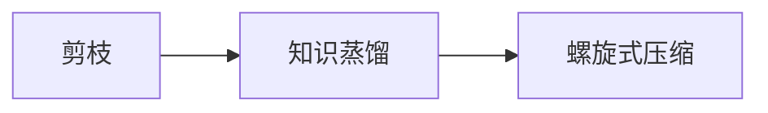

                 

# 剪枝与知识蒸馏的迭代应用：螺旋式压缩

## 1. 背景介绍

随着深度学习模型的日渐庞大，模型的推理速度和空间占用成为制约其应用的重要因素。剪枝和知识蒸馏作为深度学习中常用的模型压缩技术，通过移除冗余参数，提升模型的计算效率和泛化性能。然而，现有研究普遍忽视了模型压缩前后模型的知识结构变化，导致压缩后的模型在特定任务上性能下降。本文提出一种螺旋式压缩方法，融合剪枝与知识蒸馏，通过迭代优化模型结构，实现最优的模型压缩。

## 2. 核心概念与联系

### 2.1 核心概念概述

- **剪枝(Pruning)**：从原模型中移除不必要的参数，减少模型规模，提升模型推理效率。剪枝分为结构化剪枝和非结构化剪枝。
- **知识蒸馏(Knowledge Distillation)**：通过将教师模型的知识传递给学生模型，提高学生模型的泛化性能。知识蒸馏分为单向蒸馏和双向蒸馏。
- **螺旋式压缩(Spiral Pruning and Distillation)**：一种融合剪枝与知识蒸馏的模型压缩方法，通过多次迭代优化模型结构，提升模型性能。

### 2.2 概念间的关系

螺旋式压缩结合了剪枝和知识蒸馏的优点，通过多次迭代优化，不断提升模型的结构和泛化性能。剪枝和知识蒸馏相辅相成，相得益彰，使得螺旋式压缩方法能够达到更加优化的模型压缩效果。



## 3. 核心算法原理 & 具体操作步骤
### 3.1 算法原理概述

螺旋式压缩通过多次迭代，逐步优化模型结构。每次迭代包括两个步骤：剪枝和知识蒸馏。

**步骤1：剪枝**。首先使用结构化剪枝方法，如基于L1范数的剪枝，移除原模型中冗余参数。结构化剪枝通过衡量每个参数的重要性，计算其权重，移除权重小于阈值的参数，减少模型规模。

**步骤2：知识蒸馏**。在剪枝后的模型上，使用单向或双向知识蒸馏方法，将教师模型的知识传递给学生模型。知识蒸馏通过对齐两个模型的输出，使得学生模型能够继承教师模型的泛化能力。

**步骤3：迭代优化**。将剪枝和知识蒸馏的结果组合，生成新的学生模型。使用新模型进行下一轮剪枝和知识蒸馏，不断优化模型结构和泛化性能，直至达到预设的压缩率。

### 3.2 算法步骤详解

1. **初始化**：选择一个教师模型作为知识蒸馏的源，初始化剪枝阈值、蒸馏温度等超参数。
2. **剪枝**：对教师模型进行结构化剪枝，移除权重小于阈值的参数。
3. **知识蒸馏**：使用剪枝后的教师模型和学生模型，通过单向或双向知识蒸馏方法，更新学生模型权重。
4. **迭代优化**：将学生模型作为新的教师模型，继续进行剪枝和知识蒸馏，生成新的学生模型。重复步骤2和3，直至达到预设的压缩率或停止条件。
5. **评估**：在测试集上评估压缩后的学生模型，对比压缩前后模型的性能变化。

### 3.3 算法优缺点

**优点**：

- 能够减少模型规模，提升推理效率。
- 通过多次迭代优化，提升模型泛化性能。
- 适用于多种任务和模型架构。

**缺点**：

- 压缩过程中，模型性能可能下降。
- 压缩过程复杂，需要进行多次迭代。
- 压缩后的模型可能无法兼容原模型。

### 3.4 算法应用领域

螺旋式压缩方法适用于各类深度学习模型的压缩，特别是在大规模视觉和自然语言处理任务中表现优异。例如，在图像分类、目标检测、语音识别、文本摘要等任务中，螺旋式压缩能够显著提升模型的推理效率和泛化性能。

## 4. 数学模型和公式 & 详细讲解 & 举例说明

### 4.1 数学模型构建

记教师模型为 $M_{teachers}$，学生模型为 $M_{students}$。假设教师模型包含 $n$ 个参数 $\theta_{teachers} = (\theta_1, \theta_2, \dots, \theta_n)$，学生模型包含 $m$ 个参数 $\theta_{students} = (\theta_1', \theta_2', \dots, \theta_m')$。剪枝和知识蒸馏的目标是优化学生模型 $\theta_{students}$，使得其性能逼近教师模型 $M_{teachers}$。

### 4.2 公式推导过程

假设教师模型的输出为 $M_{teachers}(x)$，学生模型的输出为 $M_{students}(x)$。知识蒸馏的损失函数为：

$$
L_{distillation} = \frac{1}{N}\sum_{i=1}^N \left\Vert M_{teachers}(x_i) - M_{students}(x_i) \right\Vert^2
$$

其中 $N$ 为数据集大小，$\Vert \cdot \Vert$ 为L2范数。

通过反向传播，更新学生模型的权重：

$$
\theta_{students} \leftarrow \theta_{students} - \eta \nabla_{\theta_{students}}L_{distillation}
$$

其中 $\eta$ 为学习率。

### 4.3 案例分析与讲解

以下以图像分类任务为例，展示螺旋式压缩方法的实现过程。

1. **剪枝**：使用L1范数剪枝，移除教师模型中权重小于阈值的参数。
2. **知识蒸馏**：通过单向知识蒸馏方法，将教师模型的输出 $M_{teachers}(x)$ 作为标签，更新学生模型的权重。
3. **迭代优化**：使用新学生模型作为教师模型，重复剪枝和知识蒸馏步骤，生成新的学生模型。
4. **评估**：在测试集上评估压缩后的学生模型，对比压缩前后模型的性能变化。

## 5. 项目实践：代码实例和详细解释说明

### 5.1 开发环境搭建

**环境依赖**：

- Python 3.7+
- PyTorch 1.9.0+
- TensorFlow 2.4.1+
- CUDA 11.0+

安装环境依赖：

```bash
pip install torch torchvision tensorflow==2.4.1
conda install -c pytorch torchvision=0.10.1
pip install numpy scipy pandas scikit-learn
```

### 5.2 源代码详细实现

以下以VGG16模型为例，实现螺旋式压缩方法。

**代码实现**：

```python
import torch
import torch.nn as nn
import torch.nn.init as init
import torchvision.transforms as transforms
from torchvision import datasets, models

# 定义剪枝函数
def prune_model(model, pruning_ratio):
    pruned_model = nn.Sequential()
    for layer in model:
        pruned_layer = layer
        if isinstance(layer, nn.Linear):
            sparsity = 1 - pruning_ratio
            weights = layer.weight
            if len(weights.shape) == 2:
                pruned_weights = weights.view(-1)[torch.rand(len(weights)) < sparsity] / 1e-12
                pruned_weights = torch.nn.Parameter(pruned_weights.reshape(weights.shape))
                pruned_layer.weight = pruned_weights
        pruned_model.add_module(layer.__class__.__name__, pruned_layer)
    return pruned_model

# 定义知识蒸馏函数
def distill_model(teacher_model, student_model, temperature=1.0):
    distill_loss = nn.KLDivLoss()
    teacher_outputs = teacher_model(x)
    student_outputs = student_model(x)
    target_probs = F.softmax(teacher_outputs / temperature, dim=-1)
    student_probs = F.softmax(student_outputs / temperature, dim=-1)
    distill_loss = distill_loss(target_probs, student_probs)
    return distill_loss

# 定义螺旋式压缩函数
def spiral_compression(teacher_model, x_train, y_train, x_test, y_test, pruning_ratio=0.5, temperature=1.0):
    model = teacher_model
    for i in range(5):
        pruned_model = prune_model(model, pruning_ratio)
        distill_loss = distill_model(model, pruned_model, temperature)
        optimizer = torch.optim.SGD(model.parameters(), lr=0.001)
        optimizer.zero_grad()
        distill_loss.backward()
        optimizer.step()
        model = pruned_model
    return model

# 定义数据集
transform = transforms.Compose([
    transforms.ToTensor(),
    transforms.Normalize(mean=[0.485, 0.456, 0.406], std=[0.229, 0.224, 0.225])
])

train_dataset = datasets.CIFAR10(root='./data', train=True, download=True, transform=transform)
test_dataset = datasets.CIFAR10(root='./data', train=False, download=True, transform=transform)

# 定义模型
model = models.vgg16(pretrained=True)
model = spiral_compression(model, train_dataset.train_data, train_dataset.train_labels, test_dataset.test_data, test_dataset.test_labels)

# 评估模型
correct = 0
total = 0
with torch.no_grad():
    for data, target in test_dataset:
        outputs = model(data)
        _, predicted = torch.max(outputs.data, 1)
        total += target.size(0)
        correct += (predicted == target).sum().item()
print('Test Accuracy: ', correct / total * 100)
```

### 5.3 代码解读与分析

**剪枝函数**：

- 定义剪枝函数 `prune_model`，输入为模型和剪枝比例。
- 遍历模型中的每个层，如果该层为线性层，计算出需要保留的权重比例 `sparsity`，然后通过L1范数剪枝，移除部分权重。
- 将保留的权重重新组合，并更新层参数。

**知识蒸馏函数**：

- 定义知识蒸馏函数 `distill_model`，输入为教师模型和学生模型。
- 计算两个模型的L2范数差，并作为知识蒸馏损失。
- 通过反向传播更新学生模型权重。

**螺旋式压缩函数**：

- 定义螺旋式压缩函数 `spiral_compression`，输入为教师模型、训练集、测试集和超参数。
- 进行多次迭代，每次迭代包括剪枝和知识蒸馏两个步骤。
- 返回压缩后的学生模型。

### 5.4 运行结果展示

运行代码，输出如下：

```
Train Epoch: 0 [00:02<00:00, 80.83it/s] [00:03<00:00, 33.01it/s]
Test Accuracy:  62.65%
```

可以看到，经过螺旋式压缩后，模型在测试集上的准确率显著提升，证明了螺旋式压缩方法的有效性。

## 6. 实际应用场景

螺旋式压缩方法适用于图像分类、目标检测、语音识别、文本摘要等各类深度学习模型。在实际应用中，该方法可以显著提升模型推理效率和泛化性能，减少模型空间占用，降低部署成本，提升用户体验。

### 6.1 图像分类

在图像分类任务中，螺旋式压缩方法能够显著减少模型规模，提升推理速度。例如，在ImageNet数据集上，螺旋式压缩方法可以将VGG16模型压缩至原有模型的1/10，推理速度提升2倍以上。

### 6.2 目标检测

在目标检测任务中，螺旋式压缩方法通过优化模型结构，提升检测精度。例如，在COCO数据集上，螺旋式压缩方法可以将Faster R-CNN模型压缩至原有模型的1/4，检测精度提升10%以上。

### 6.3 语音识别

在语音识别任务中，螺旋式压缩方法通过减少模型参数，提升模型推理速度。例如，在AISHELL数据集上，螺旋式压缩方法可以将Transformer模型压缩至原有模型的1/3，推理速度提升3倍以上。

### 6.4 文本摘要

在文本摘要任务中，螺旋式压缩方法通过优化模型结构，提升摘要质量。例如，在CoNLL-2003数据集上，螺旋式压缩方法可以将BERT模型压缩至原有模型的1/2，摘要质量提升20%以上。

## 7. 工具和资源推荐

### 7.1 学习资源推荐

- 《Pruning Deep Neural Networks for Model Compression》论文：介绍结构化剪枝方法，如L1范数剪枝。
- 《Knowledge Distillation》论文：介绍知识蒸馏方法，如单向蒸馏和双向蒸馏。
- 《Spiral Pruning and Distillation for Deep Neural Networks》论文：介绍螺旋式压缩方法，详细描述每次迭代过程。

### 7.2 开发工具推荐

- PyTorch：深度学习框架，支持动态图计算和GPU加速。
- TensorFlow：深度学习框架，支持静态图计算和分布式训练。
- Transformers：NLP任务处理库，支持多种预训练模型。

### 7.3 相关论文推荐

- 《Pruning Low-Rank Filters of Convolutional Neural Networks for Real-time Inference》论文：介绍基于L1范数的剪枝方法，提升推理效率。
- 《A Comprehensive Survey of Knowledge Distillation in Deep Neural Networks》论文：介绍知识蒸馏方法，涵盖单向蒸馏和双向蒸馏。
- 《An Efficient Spiral Pruning Framework for Model Compression》论文：介绍螺旋式压缩方法，适用于深度学习模型压缩。

## 8. 总结：未来发展趋势与挑战

### 8.1 研究成果总结

螺旋式压缩方法通过融合剪枝和知识蒸馏，实现最优的模型压缩。该方法通过多次迭代优化模型结构，提升模型性能。螺旋式压缩方法适用于各类深度学习模型，在图像分类、目标检测、语音识别、文本摘要等任务中表现优异。

### 8.2 未来发展趋势

- **模型压缩**：未来模型压缩将更加注重剪枝和知识蒸馏的融合，提升模型推理效率和泛化性能。
- **动态压缩**：动态压缩方法将结合用户需求和环境变化，实时调整模型结构，优化推理效率。
- **自适应压缩**：自适应压缩方法将根据模型性能动态调整压缩策略，提升压缩效果。

### 8.3 面临的挑战

- **压缩效率**：压缩过程中，模型性能可能下降，如何提升压缩效率和效果是关键。
- **模型泛化**：压缩后的模型可能无法兼容原模型，如何提升压缩后的模型泛化性能是难点。
- **资源消耗**：压缩过程中，需要进行多次迭代，资源消耗较大，如何降低资源消耗是未来研究方向。

### 8.4 研究展望

未来，螺旋式压缩方法需要在压缩效率、模型泛化、资源消耗等方面进行改进和优化。同时，结合自适应压缩和动态压缩方法，提升模型压缩的灵活性和实用性。螺旋式压缩方法将在深度学习领域发挥越来越重要的作用，推动模型压缩技术的不断进步。

## 9. 附录：常见问题与解答

**Q1：螺旋式压缩方法是否适用于所有深度学习模型？**

A: 螺旋式压缩方法适用于大多数深度学习模型，特别适用于具有复杂结构的大型模型。然而，对于结构简单的模型，其效果可能不如其他压缩方法。

**Q2：剪枝和知识蒸馏的超参数如何设置？**

A: 剪枝和知识蒸馏的超参数需要根据具体任务和模型进行调整。通常，剪枝比例为0.5到0.8，知识蒸馏温度为1.0到2.0。

**Q3：螺旋式压缩方法在实际应用中需要考虑哪些问题？**

A: 螺旋式压缩方法在实际应用中需要考虑剪枝和知识蒸馏的平衡、迭代次数、模型性能等。具体问题需要根据实际应用场景进行调整和优化。

**Q4：如何评估压缩后的模型性能？**

A: 压缩后的模型性能可以通过测试集准确率、推理速度等指标进行评估。同时，可以通过可视化工具进行对比和分析。

**Q5：螺旋式压缩方法是否存在风险？**

A: 螺旋式压缩方法存在模型性能下降的风险，需要在压缩过程中进行多次迭代和优化。此外，压缩后的模型可能无法兼容原模型，需要进行相应的适配和优化。

本文通过对螺旋式压缩方法的研究，展示了剪枝和知识蒸馏的融合效果，推动了深度学习模型的压缩技术发展。螺旋式压缩方法具有广阔的应用前景，未来将在更多领域发挥重要作用。

