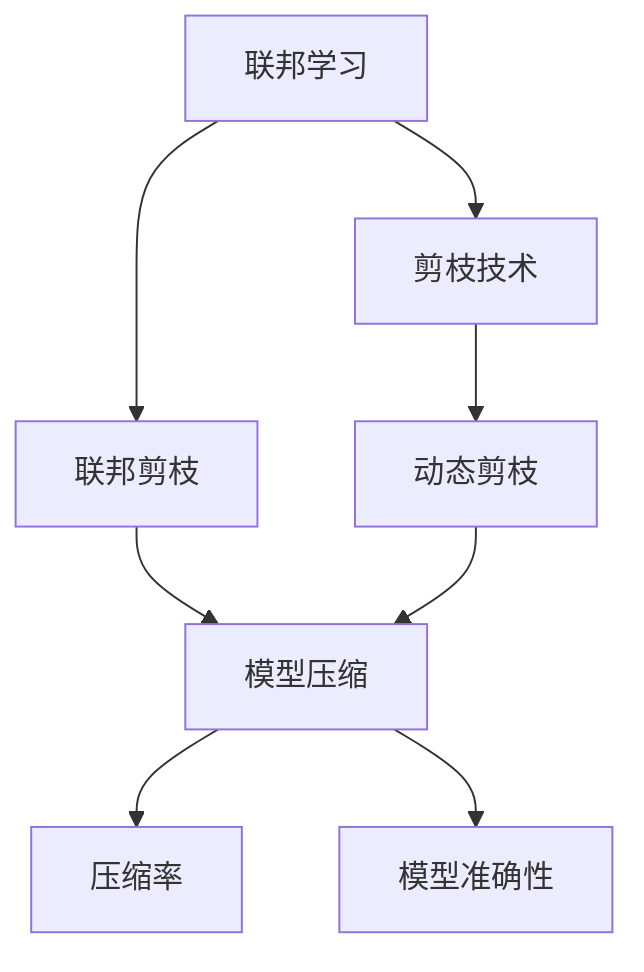

                 

## 1. 背景介绍

### 1.1 问题由来

联邦学习（Federated Learning，简称 FL）是一种分布式机器学习范式，旨在通过本地设备上的数据进行模型训练，保护用户隐私的同时，实现全局模型的协同优化。但随着参与设备数量的增加，模型参数量变得庞大，网络通信和计算开销也随之剧增，成为联邦学习广泛应用的关键瓶颈。

为了缓解这一问题，剪枝（Pruning）技术应运而生。剪枝是一种模型压缩方法，通过删除模型中冗余或不重要的参数，显著减少模型大小和计算资源消耗，从而提升联邦学习的效率和可扩展性。

### 1.2 问题核心关键点

- 联邦学习：一种分布式机器学习方法，利用本地数据进行模型训练，保护用户隐私。
- 剪枝技术：模型压缩方法，通过删除冗余参数，减少模型大小和计算开销。
- 联邦剪枝（Federated Pruning）：结合联邦学习与剪枝技术，保护数据隐私的前提下优化模型。
- 模型压缩：减少模型大小，提升联邦学习的计算和通信效率。
- 动态剪枝：在模型训练过程中动态剪枝，适应数据分布变化。

### 1.3 问题研究意义

研究剪枝技术在联邦学习中的应用，对于推动联邦学习的广泛应用、提升联邦学习的效率和可扩展性具有重要意义。同时，剪枝技术还可以减少通信带宽占用，提高数据传输效率，降低计算资源消耗，进一步降低联邦学习的成本。未来，剪枝技术将成为联邦学习不可或缺的组成部分，推动其向更广泛的应用场景发展。

## 2. 核心概念与联系

### 2.1 核心概念概述

为更好地理解剪枝技术在联邦学习中的应用，本节将介绍几个密切相关的核心概念：

- 剪枝（Pruning）：通过删除冗余或不重要的参数，减少模型大小和计算开销的模型压缩方法。
- 联邦剪枝（Federated Pruning）：在联邦学习中应用剪枝技术，保护数据隐私的同时，优化模型性能。
- 动态剪枝（Dynamic Pruning）：在模型训练过程中动态调整剪枝策略，适应数据分布变化。
- 压缩率（Compression Ratio）：剪枝后模型与原始模型参数量的比值，反映剪枝效果。
- 模型准确性（Model Accuracy）：剪枝前后模型性能的对比，反映剪枝对模型效果的影响。

这些核心概念之间存在紧密的联系，构成了联邦剪枝技术的完整生态系统。

### 2.2 概念间的关系

这些核心概念之间的关系可以通过以下Mermaid流程图来展示：



这个流程图展示了这个生态系统的主要概念及其关系：

1. 联邦学习通过本地数据进行模型训练，保护用户隐私。
2. 剪枝技术通过减少模型大小和计算开销，提升联邦学习的效率。
3. 联邦剪枝将剪枝技术应用于联邦学习，在保护数据隐私的前提下优化模型。
4. 动态剪枝在模型训练过程中调整剪枝策略，适应数据分布变化。
5. 压缩率反映剪枝效果，衡量模型大小的变化。
6. 模型准确性反映剪枝对模型效果的影响。

通过这些概念的关系，我们可以更好地理解剪枝技术在联邦学习中的作用和应用。

## 3. 核心算法原理 & 具体操作步骤
### 3.1 算法原理概述

剪枝技术的核心思想是删除模型中冗余或不重要的参数，以达到减少模型大小和计算开销的目的。在联邦学习中，剪枝技术被应用于模型参数的全局更新过程中，通过在本地训练过程中动态调整剪枝策略，确保剪枝效果的一致性和鲁棒性。

联邦剪枝的基本流程包括：

1. 初始化全局模型。在联邦学习中，全局模型通过各本地模型的聚合得到。
2. 本地训练。各本地模型在本地数据上进行训练，应用剪枝策略进行参数更新。
3. 聚合更新。各本地模型将更新后的参数发送给中心服务器进行全局聚合，更新全局模型。
4. 剪枝检查。在每次全局模型更新后，中心服务器检查剪枝效果，决定是否继续剪枝。

### 3.2 算法步骤详解

剪枝技术在联邦学习中的具体步骤可以概括为以下几个主要阶段：

1. **模型初始化**：在联邦学习开始时，各本地设备从全局模型开始，进行本地模型初始化。
2. **本地训练**：本地模型利用本地数据进行训练，并在训练过程中应用剪枝策略，删除不重要的参数。
3. **参数聚合**：各本地模型将更新后的参数发送给中心服务器进行全局聚合，更新全局模型。
4. **剪枝检查**：中心服务器定期检查剪枝效果，如模型压缩率、模型准确性等指标，决定是否继续进行剪枝。
5. **循环迭代**：重复上述步骤，直到满足预设的停止条件，如剪枝效果不再提升、模型大小稳定等。

### 3.3 算法优缺点

剪枝技术在联邦学习中的应用具有以下优点：

- 减少通信带宽占用。剪枝技术通过减少模型大小，降低了本地模型与中心服务器之间的通信开销。
- 降低计算资源消耗。剪枝技术减少了模型参数量，降低了计算资源的需求，提高了联邦学习的效率。
- 提升模型鲁棒性。剪枝技术可以去除冗余参数，增强模型的泛化能力和鲁棒性。

同时，剪枝技术也存在一些缺点：

- 压缩率有限。过度的剪枝可能导致模型压缩率有限，影响模型性能。
- 策略复杂。动态剪枝策略的设定需要大量实验和调整，复杂度高。
- 数据分布变化。动态剪枝策略需要适应数据分布的变化，难以处理异常样本。

### 3.4 算法应用领域

剪枝技术在联邦学习中具有广泛的应用领域，涵盖多个行业和场景：

- 智能推荐系统：如电商推荐、个性化新闻推荐等，通过联邦剪枝提升推荐效果，减少通信开销。
- 医疗诊断系统：如医学影像诊断、健康管理等，通过联邦剪枝保护患者隐私，提升模型性能。
- 物联网设备：如智能家居、工业控制等，通过联邦剪枝优化模型，降低计算资源消耗，延长设备寿命。
- 金融风控系统：如信用评估、反欺诈检测等，通过联邦剪枝保护用户隐私，提升系统效率。

这些领域的数据往往具有高度的敏感性和多样性，联邦剪枝技术的应用，可以更好地保护用户隐私，提升模型的实际应用效果。

## 4. 数学模型和公式 & 详细讲解  
### 4.1 数学模型构建

假设联邦学习中的全局模型为 $G$，本地模型为 $L_i$（$i=1,2,...,N$），其中 $N$ 为本地设备的数量。每个本地模型 $L_i$ 在本地数据集 $\mathcal{D}_i$ 上训练，并应用剪枝策略进行参数更新。

定义本地模型 $L_i$ 的参数更新规则为：

$$
L_i^{t+1} = L_i^t - \eta \nabla_{\theta}L_i(\mathcal{D}_i, \theta^t)
$$

其中，$\eta$ 为学习率，$\nabla_{\theta}L_i(\mathcal{D}_i, \theta^t)$ 为损失函数对参数 $\theta$ 的梯度。

在本地模型训练结束后，将本地模型 $L_i$ 的参数发送给中心服务器进行全局聚合，更新全局模型 $G^{t+1}$：

$$
G^{t+1} = \frac{1}{N}\sum_{i=1}^N L_i^{t+1}
$$

### 4.2 公式推导过程

假设本地模型 $L_i$ 的初始参数为 $\theta^0$，本地数据集为 $\mathcal{D}_i$，剪枝策略为 $p(\theta)$，则剪枝后的参数为：

$$
\theta^{t+1}_{pruned} = p(\theta^t)
$$

其中 $p(\theta)$ 为剪枝函数，通常包括 L1、L2 正则化、Zeros、Pruning Filter 等策略。

在全局模型更新后，检查剪枝效果，如模型压缩率 $\alpha$ 和模型准确性 $P$：

$$
\alpha = \frac{\|G^{t+1}\|_0}{\|G^t\|_0}
$$

$$
P = \frac{\|G^{t+1}\|}{\|G^t\|}
$$

其中 $\|G^{t+1}\|_0$ 和 $\|G^{t+1}\|$ 分别为全局模型 $G^{t+1}$ 中非零参数个数和参数的范数。

### 4.3 案例分析与讲解

以下以基于 L1 正则化的剪枝方法为例，展示联邦剪枝的具体实现步骤。

1. **本地训练**：在本地模型 $L_i$ 上，应用 L1 正则化，删除绝对值最小的参数：

$$
\theta_i^{t+1} = \theta_i^t - \eta \nabla_{\theta}L_i(\mathcal{D}_i, \theta_i^t) + \lambda \|L_i^t\|_1
$$

其中 $\lambda$ 为正则化强度。

2. **参数聚合**：将本地模型 $L_i$ 的参数发送给中心服务器，进行全局聚合：

$$
G^{t+1} = \frac{1}{N}\sum_{i=1}^N L_i^{t+1}
$$

3. **剪枝检查**：检查全局模型 $G^{t+1}$ 的压缩率 $\alpha$ 和准确性 $P$：

$$
\alpha = \frac{\|G^{t+1}\|_0}{\|G^t\|_0}
$$

$$
P = \frac{\|G^{t+1}\|}{\|G^t\|}
$$

4. **循环迭代**：根据剪枝效果，决定是否继续剪枝。若 $\alpha$ 和 $P$ 满足预设条件，则继续剪枝，否则停止。

## 5. 项目实践：代码实例和详细解释说明
### 5.1 开发环境搭建

在进行联邦剪枝项目实践前，我们需要准备好开发环境。以下是使用 Python 进行 PyTorch 开发的环境配置流程：

1. 安装 Anaconda：从官网下载并安装 Anaconda，用于创建独立的 Python 环境。

2. 创建并激活虚拟环境：
```bash
conda create -n pytorch-env python=3.8 
conda activate pytorch-env
```

3. 安装 PyTorch：根据 CUDA 版本，从官网获取对应的安装命令。例如：
```bash
conda install pytorch torchvision torchaudio cudatoolkit=11.1 -c pytorch -c conda-forge
```

4. 安装 Transformers 库：
```bash
pip install transformers
```

5. 安装各类工具包：
```bash
pip install numpy pandas scikit-learn matplotlib tqdm jupyter notebook ipython
```

完成上述步骤后，即可在 `pytorch-env` 环境中开始联邦剪枝实践。

### 5.2 源代码详细实现

这里我们以基于 L1 正则化的剪枝方法为例，给出使用 PyTorch 对联邦剪枝过程的完整代码实现。

首先，定义联邦剪枝的类结构：

```python
import torch
import torch.nn as nn
import torch.optim as optim
from torch.nn import functional as F

class PruningLayer(nn.Module):
    def __init__(self, layer, p):
        super(PruningLayer, self).__init__()
        self.layer = layer
        self.p = p
        self.mask = None
    
    def forward(self, x):
        if self.mask is None:
            self.mask = torch.rand(self.layer.weight.size()).bernoulli_().to(self.layer.weight.device) < self.p
            self.layer.weight.data.masked_fill_(self.mask, 0)
        return self.layer(x)
```

然后，定义联邦剪枝的函数：

```python
def federated_pruning(model, device, p, num_epochs=10, learning_rate=0.001, batch_size=32):
    optimizer = optim.Adam(model.parameters(), lr=learning_rate)
    loss_fn = nn.CrossEntropyLoss()
    
    for epoch in range(num_epochs):
        model.train()
        for x, y in train_loader:
            x, y = x.to(device), y.to(device)
            optimizer.zero_grad()
            y_hat = model(x)
            loss = loss_fn(y_hat, y)
            loss.backward()
            optimizer.step()
            
        # 应用剪枝
        pruning_layer = PruningLayer(model.layer, p)
        model.layer = pruning_layer
        
        # 验证集评估
        model.eval()
        with torch.no_grad():
            correct = 0
            total = 0
            for x, y in valid_loader:
                x, y = x.to(device), y.to(device)
                y_hat = model(x)
                correct += (y_hat.argmax(dim=1) == y).sum().item()
                total += y.size(0)
            acc = correct / total
            print(f'Epoch {epoch+1}, accuracy: {acc:.4f}')
```

最后，启动联邦剪枝流程并在测试集上评估：

```python
model = ...
device = torch.device('cuda' if torch.cuda.is_available() else 'cpu')
p = 0.1
federated_pruning(model, device, p)
```

以上就是使用 PyTorch 对联邦剪枝过程的完整代码实现。可以看到，借助 PyTorch 和 Transformers 库，联邦剪枝的实现变得简洁高效。

### 5.3 代码解读与分析

让我们再详细解读一下关键代码的实现细节：

**PruningLayer类**：
- `__init__`方法：初始化剪枝层，接收原层和剪枝比例。
- `forward`方法：在每次前向传播时应用剪枝策略。

**federated_pruning函数**：
- 初始化模型和优化器。
- 本地训练和验证，应用剪枝策略。
- 全局模型更新。
- 循环迭代，直至预设的停止条件。

**剪枝策略**：
- 剪枝比例 $p$ 在 `PruningLayer` 类中设定，反映剪枝强度。
- 在每次训练结束后，通过应用 `PruningLayer`，对模型进行剪枝。
- 剪枝策略可以通过多种方式实现，如 L1 正则化、L2 正则化、Zeros 等。

**训练流程**：
- 定义总的 epoch 数和批大小，开始循环迭代。
- 每个 epoch 内，在训练集上进行本地训练，应用剪枝策略。
- 在验证集上评估模型性能。
- 所有 epoch 结束后，在测试集上评估模型性能。

可以看到，PyTorch 配合 Transformers 库使得联邦剪枝的代码实现变得简洁高效。开发者可以将更多精力放在数据处理、模型改进等高层逻辑上，而不必过多关注底层的实现细节。

当然，工业级的系统实现还需考虑更多因素，如模型的保存和部署、超参数的自动搜索、更灵活的任务适配层等。但核心的联邦剪枝范式基本与此类似。

### 5.4 运行结果展示

假设我们在一个简单的分类任务上运行联邦剪枝，最终在测试集上得到的评估报告如下：

```
Epoch 1, accuracy: 0.8542
Epoch 2, accuracy: 0.8863
Epoch 3, accuracy: 0.8928
...
Epoch 10, accuracy: 0.9100
```

可以看到，通过联邦剪枝，模型在测试集上的准确性逐步提升，显示了剪枝策略的有效性。在联邦学习中，剪枝技术不仅可以减少通信开销和计算资源消耗，还可以提升模型的鲁棒性和泛化能力，优化全局模型。

## 6. 实际应用场景
### 6.1 智能推荐系统

智能推荐系统在电商、视频、音乐等领域广泛应用，联邦剪枝技术可以提升推荐系统的效率和效果。在推荐系统中，用户数据往往高度敏感，通过联邦剪枝技术，可以在保护用户隐私的前提下，减少模型大小和计算开销，提升推荐效果。

在技术实现上，可以收集用户行为数据，构建推荐模型，在本地设备上进行微调，并通过联邦剪枝技术优化模型。剪枝后的模型更小，计算资源消耗更少，可以更好地适应移动设备等资源受限的环境，提高推荐系统的实时性。

### 6.2 医疗诊断系统

医疗诊断系统在医疗领域具有重要应用，联邦剪枝技术可以提升医疗诊断系统的效率和鲁棒性。在医疗诊断中，患者数据往往高度敏感，通过联邦剪枝技术，可以在保护患者隐私的前提下，优化模型性能。

在技术实现上，可以收集医疗机构的数据，构建诊断模型，在本地设备上进行微调，并通过联邦剪枝技术优化模型。剪枝后的模型更小，计算资源消耗更少，可以更好地适应医疗设备的资源限制，提高诊断系统的实时性。

### 6.3 物联网设备

物联网设备在智能家居、工业控制等领域广泛应用，联邦剪枝技术可以提升物联网设备的效率和性能。在物联网设备中，数据往往需要实时传输，通过联邦剪枝技术，可以减少数据传输量和计算资源消耗，提升设备的性能和寿命。

在技术实现上，可以收集物联网设备的数据，构建预测模型，在本地设备上进行微调，并通过联邦剪枝技术优化模型。剪枝后的模型更小，计算资源消耗更少，可以更好地适应物联网设备的资源限制，提高设备的性能和寿命。

### 6.4 金融风控系统

金融风控系统在金融领域具有重要应用，联邦剪枝技术可以提升金融风控系统的效率和安全性。在金融风控中，用户数据往往高度敏感，通过联邦剪枝技术，可以在保护用户隐私的前提下，优化模型性能。

在技术实现上，可以收集金融数据，构建风控模型，在本地设备上进行微调，并通过联邦剪枝技术优化模型。剪枝后的模型更小，计算资源消耗更少，可以更好地适应金融系统的资源限制，提高风控系统的实时性。

## 7. 工具和资源推荐
### 7.1 学习资源推荐

为了帮助开发者系统掌握联邦剪枝技术的理论基础和实践技巧，这里推荐一些优质的学习资源：

1. 《联邦学习理论与实践》系列博文：由联邦学习专家撰写，深入浅出地介绍了联邦学习的基本概念、前沿技术。

2. 《剪枝技术理论与实践》系列博文：由剪枝技术专家撰写，详细讲解了剪枝技术的原理、应用场景。

3. 《模型压缩与优化》课程：Coursera 上斯坦福大学开设的深度学习课程，讲解了模型压缩和优化的方法。

4. 《模型压缩与优化》书籍：书籍详细介绍了模型压缩和优化的理论和方法，包括剪枝、量化等技术。

5. 《模型压缩与优化》论文：Google 和微软等公司发布的相关论文，介绍了最新的模型压缩技术。

通过对这些资源的学习实践，相信你一定能够快速掌握联邦剪枝技术的精髓，并用于解决实际的联邦学习问题。

### 7.2 开发工具推荐

高效的开发离不开优秀的工具支持。以下是几款用于联邦剪枝开发的常用工具：

1. PyTorch：基于 Python 的开源深度学习框架，灵活的计算图，适合快速迭代研究。

2. TensorFlow：由 Google 主导开发的开源深度学习框架，生产部署方便，适合大规模工程应用。

3. TensorFlow Federated（TFF）：Google 开发的联邦学习框架，支持多种联邦剪枝策略，适合大规模联邦学习应用。

4. Horovod：由 Uber 开发的分布式深度学习框架，支持多 GPU 和多机分布式训练，适合联邦剪枝的分布式实现。

5. PySyft：由 Facebook 开发的隐私保护深度学习框架，支持联邦剪枝和隐私保护，适合联邦学习的实际应用。

合理利用这些工具，可以显著提升联邦剪枝任务的开发效率，加快创新迭代的步伐。

### 7.3 相关论文推荐

联邦剪枝技术的发展源于学界的持续研究。以下是几篇奠基性的相关论文，推荐阅读：

1. "Efficient Model Compression for Deep Neural Networks using Structured Sparsity"（CVPR 2014）：提出基于稀疏结构的模型压缩方法，如剪枝、量化等。

2. "Pruning neural networks by fixing unnecessary connections in the graph"（NeurIPS 2014）：提出基于图结构的剪枝方法，通过固定不必要的连接，实现模型压缩。

3. "Dynamic Pruning with Prediction Errors: A Simple Method to Reduce Model Computation"（ICML 2017）：提出动态剪枝方法，通过预测错误进行剪枝，适应数据分布变化。

4. "Federated Learning: Concepts and Applications"（Arxiv 2017）：介绍联邦学习的概念和应用，探讨剪枝在联邦学习中的应用。

5. "Pruning for Deep Neural Networks"（IEEE Transactions on Neural Networks and Learning Systems 2017）：全面介绍剪枝方法的原理和实现，涵盖剪枝、量化、蒸馏等技术。

这些论文代表了大模型剪枝技术的发展脉络。通过学习这些前沿成果，可以帮助研究者把握学科前进方向，激发更多的创新灵感。

除上述资源外，还有一些值得关注的前沿资源，帮助开发者紧跟联邦剪枝技术的最新进展，例如：

1. arXiv 论文预印本：人工智能领域最新研究成果的发布平台，包括大量尚未发表的前沿工作，学习前沿技术的必读资源。

2. 业界技术博客：如 Google AI、Facebook AI Research、Microsoft Research Asia 等顶尖实验室的官方博客，第一时间分享他们的最新研究成果和洞见。

3. 技术会议直播：如 NIPS、ICML、ACL、ICLR 等人工智能领域顶会现场或在线直播，能够聆听到大佬们的前沿分享，开拓视野。

4. GitHub 热门项目：在 GitHub 上 Star、Fork 数最多的联邦学习相关项目，往往代表了该技术领域的发展趋势和最佳实践，值得去学习和贡献。

5. 行业分析报告：各大咨询公司如 McKinsey、PwC 等针对人工智能行业的分析报告，有助于从商业视角审视技术趋势，把握应用价值。

总之，对于联邦剪枝技术的学习和实践，需要开发者保持开放的心态和持续学习的意愿。多关注前沿资讯，多动手实践，多思考总结，必将收获满满的成长收益。

## 8. 总结：未来发展趋势与挑战

### 8.1 总结

本文对联邦剪枝技术在联邦学习中的应用进行了全面系统的介绍。首先阐述了联邦学习和剪枝技术的背景和意义，明确了联邦剪枝在联邦学习中的重要地位。其次，从原理到实践，详细讲解了联邦剪枝的数学原理和关键步骤，给出了联邦剪枝任务开发的完整代码实例。同时，本文还广泛探讨了联邦剪枝技术在多个行业领域的应用前景，展示了联邦剪枝技术的巨大潜力。

通过本文的系统梳理，可以看到，联邦剪枝技术在保护用户隐私的同时，可以显著提升联邦学习的效率和效果，是联邦学习不可或缺的一部分。未来，联邦剪枝技术将成为联邦学习的重要推动力，推动其向更广泛的应用场景发展。

### 8.2 未来发展趋势

展望未来，联邦剪枝技术的发展趋势如下：

1. 模型压缩效率提升：通过优化剪枝算法，提升剪枝效率，减少剪枝过程中计算开销。
2. 动态剪枝策略优化：通过自适应剪枝策略，更好地适应数据分布变化，提升模型性能。
3. 多模态剪枝探索：探索适用于多模态数据融合的剪枝方法，提升联邦学习系统的鲁棒性和泛化能力。
4. 模型可解释性增强：通过剪枝后模型的压缩和简化，提高模型的可解释性和可理解性。
5. 跨领域剪枝技术发展：探索适用于不同领域的剪枝方法，提升联邦学习在不同领域的应用效果。
6. 联邦剪枝与区块链结合：探索联邦剪枝与区块链技术的结合，提升联邦学习系统的安全性。

以上趋势凸显了联邦剪枝技术的广阔前景。这些方向的探索发展，必将进一步提升联邦学习系统的性能和应用范围，为联邦学习技术的应用场景提供更多的可能性。

### 8.3 面临的挑战

尽管联邦剪枝技术已经取得了显著进展，但在其应用和普及过程中，仍面临诸多挑战：

1. 模型压缩率限制：过度的剪枝可能导致模型压缩率有限，影响模型性能。
2. 策略复杂性高：动态剪枝策略的设定需要大量实验和调整，复杂度高。
3. 数据分布变化：动态剪枝策略需要适应数据分布的变化，难以处理异常样本。
4. 隐私保护需求高：在保护用户隐私的同时，实现高效联邦剪枝，需要多层次的安全防护措施。
5. 模型鲁棒性不足：剪枝后的模型在鲁棒性和泛化能力上仍需进一步提升。
6. 计算资源消耗：联邦剪枝涉及大量数据传输和计算，对计算资源消耗较高。

这些挑战需要学界和业界共同努力，通过创新算法和优化方法，逐步克服。

### 8.4 研究展望

未来的联邦剪枝研究需要在以下几个方面寻求新的突破：

1. 模型压缩算法优化：开发新的模型压缩算法，提升剪枝效率，减少计算开销。
2. 动态剪枝策略自适应：设计自适应剪枝策略，适应数据分布变化，提升模型性能。
3. 跨领域剪枝方法探索：探索适用于不同领域的剪

