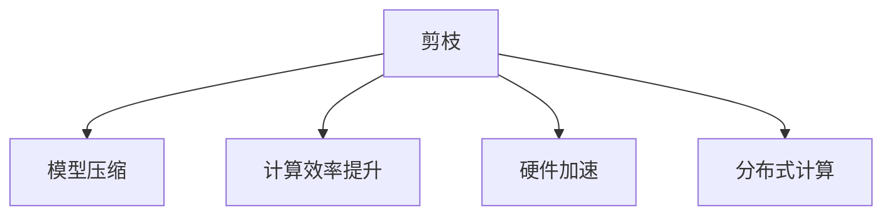
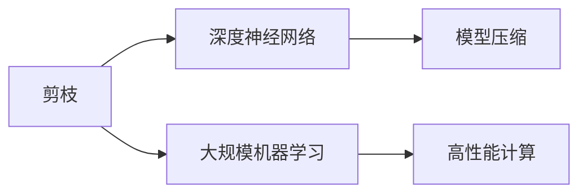
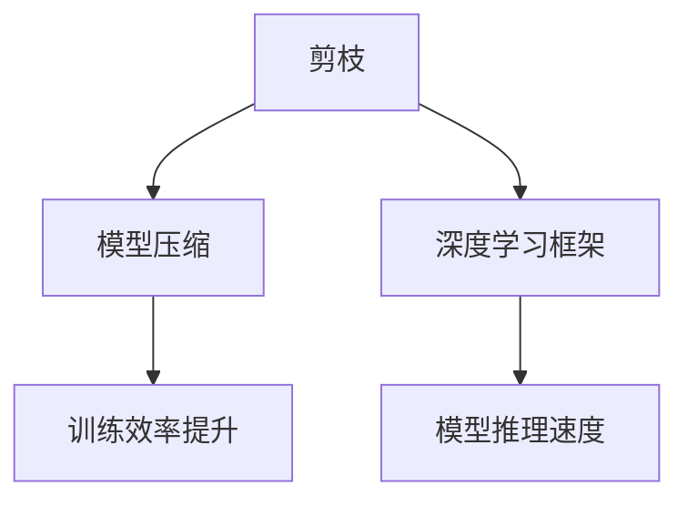
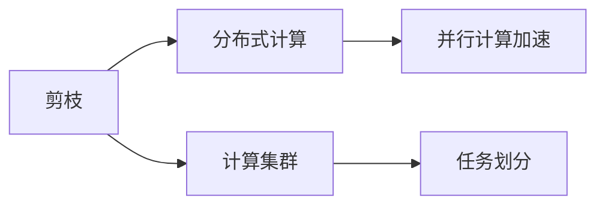
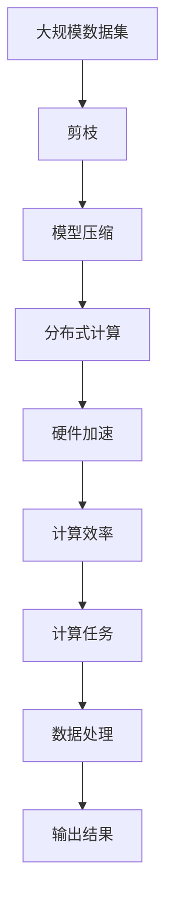

                 

# 剪枝技术在高性能计算中的应用前景

## 1. 背景介绍

### 1.1 问题由来
随着计算机硬件和软件技术的不断发展，高性能计算（High Performance Computing, HPC）已成为许多领域的核心技术，特别是在人工智能（Artificial Intelligence, AI）和机器学习（Machine Learning, ML）领域中，复杂的模型和算法需要强大的计算资源。然而，随着模型规模的不断扩大，模型参数数量激增，计算资源需求显著增加，带来了计算成本和资源管理的巨大挑战。

### 1.2 问题核心关键点
为了应对这些问题，剪枝（Pruning）技术应运而生。剪枝技术通过移除模型中的冗余参数，缩小模型规模，降低计算资源需求，从而提高计算效率。剪枝技术是实现模型压缩和优化的一种重要手段，对于提高HPC系统性能、降低成本和提升模型可扩展性具有重要意义。

### 1.3 问题研究意义
研究剪枝技术在HPC中的应用前景，对于提升计算系统的性能、降低成本、提高模型的可扩展性和适应性具有重要意义：

1. **性能提升**：通过剪枝减少冗余参数，提高模型在硬件上的运行效率。
2. **成本降低**：减少对高性能计算资源的需求，降低HPC系统的运营成本。
3. **可扩展性增强**：缩小模型规模，更容易在不同的硬件平台上部署和扩展。
4. **适应性提升**：增强模型对不同规模计算资源的适应性，提升模型在大规模分布式系统中的表现。
5. **研究展望**：为未来的模型优化和算法创新提供新的思路和方向。

## 2. 核心概念与联系

### 2.1 核心概念概述

为更好地理解剪枝技术在高性能计算中的应用，本节将介绍几个关键概念：

- 剪枝（Pruning）：指从模型中移除无关紧要的权重或连接，减少模型参数数量，从而降低计算资源需求，提高模型运行效率。
- 模型压缩（Model Compression）：通过剪枝、量化、知识蒸馏等方法，缩小模型规模，提高计算效率和模型推理速度。
- 计算效率（Computational Efficiency）：指模型在硬件上运行所需的时间和计算资源。
- 硬件加速（Hardware Acceleration）：利用GPU、FPGA等硬件资源，提高模型计算速度。
- 分布式计算（Distributed Computing）：通过多台计算机协同工作，实现大规模并行计算，提高计算速度和资源利用率。

这些概念之间的逻辑关系可以通过以下Mermaid流程图来展示：



这个流程图展示了几项关键技术之间的关系：剪枝技术通过减少模型参数，直接提升计算效率；模型压缩进一步优化计算资源使用，提高硬件加速效率；分布式计算通过协同计算，进一步提升计算速度和资源利用率。

### 2.2 概念间的关系

这些核心概念之间存在着紧密的联系，形成了HPC系统性能优化的完整生态系统。下面我通过几个Mermaid流程图来展示这些概念之间的关系。

#### 2.2.1 剪枝技术的应用场景



这个流程图展示了剪枝技术的应用场景，包括深度神经网络、大规模机器学习和高性能计算。通过剪枝技术，可以显著降低模型的计算资源需求，提高计算效率。

#### 2.2.2 剪枝与模型压缩的关系



这个流程图展示了剪枝与模型压缩之间的关系。剪枝技术通过移除冗余参数，缩小模型规模，进一步优化了模型压缩的效果，提高了模型训练和推理速度。

#### 2.2.3 剪枝与分布式计算的关系



这个流程图展示了剪枝与分布式计算之间的关系。剪枝技术通过减少模型参数，降低了计算集群中的计算量，从而提升了分布式计算的效率。

### 2.3 核心概念的整体架构

最后，我们用一个综合的流程图来展示这些核心概念在HPC系统中的整体架构：



这个综合流程图展示了从数据处理到输出结果的全流程，从大规模数据集的输入，到剪枝、模型压缩、分布式计算、硬件加速和最终计算效率的输出。通过这些技术手段，HPC系统能够高效地处理大规模计算任务。

## 3. 核心算法原理 & 具体操作步骤
### 3.1 算法原理概述

剪枝技术在高性能计算中的应用主要基于以下原理：

- **冗余参数识别**：剪枝技术首先识别并移除模型中的冗余参数，这些参数在模型中对计算结果没有显著影响。
- **结构化剪枝**：通过剪枝算法，结构化地移除无关紧要的权重或连接，提高模型计算效率。
- **量化**：将模型中的权重和激活值进行量化，进一步降低计算资源需求。
- **知识蒸馏**：通过教师模型和学生模型之间的知识转移，优化学生模型的性能。

### 3.2 算法步骤详解

剪枝技术的应用步骤主要包括以下几个关键环节：

**Step 1: 模型构建与加载**

- 选择合适的深度学习框架，如TensorFlow、PyTorch等。
- 构建或加载预训练的深度神经网络模型，如ResNet、VGG等。

**Step 2: 剪枝策略选择**

- 选择合适的剪枝策略，如结构化剪枝、权重剪枝、激活剪枝等。
- 确定剪枝阈值和剪枝比例。

**Step 3: 剪枝实现**

- 实现剪枝算法，移除冗余参数。
- 对移除的参数进行记录和验证，确保剪枝后的模型性能。

**Step 4: 模型优化**

- 使用模型压缩技术，如权重量化、蒸馏等，进一步优化模型。
- 在分布式计算环境中，进行任务划分和并行计算加速。

**Step 5: 硬件加速**

- 利用GPU、FPGA等硬件资源，加速模型计算。

**Step 6: 评估与验证**

- 使用测试数据集，评估剪枝后模型的性能。
- 通过比较剪枝前后的计算效率、模型大小和推理速度，验证剪枝效果。

### 3.3 算法优缺点

剪枝技术在高性能计算中的应用具有以下优点：

- **计算资源节约**：通过剪枝减少模型参数，降低计算资源需求。
- **计算速度提升**：移除冗余参数后，模型计算速度明显提升。
- **可扩展性增强**：缩小模型规模，更容易在不同硬件平台上部署和扩展。

但同时也存在一些缺点：

- **模型精度损失**：剪枝后模型的精度可能有所下降，需要进一步优化。
- **计算复杂度增加**：剪枝算法的实现复杂度较高，需要大量的计算资源。
- **应用场景限制**：不是所有模型都适合剪枝，如稀疏性较高的模型。

### 3.4 算法应用领域

剪枝技术在多个领域中得到广泛应用，例如：

- **深度学习**：在图像识别、语音识别、自然语言处理等深度学习任务中，通过剪枝优化模型性能，提升计算效率。
- **高性能计算**：在大规模机器学习、科学计算等领域，剪枝技术可以有效降低计算资源需求，提高计算效率。
- **嵌入式系统**：在物联网、智能硬件等嵌入式系统中，通过剪枝技术优化模型，提高资源利用率和系统响应速度。
- **云服务**：在云计算环境中，通过剪枝技术优化模型，降低计算成本，提高服务质量。

## 4. 数学模型和公式 & 详细讲解 & 举例说明

### 4.1 数学模型构建

本节将使用数学语言对剪枝技术在高性能计算中的应用进行更加严格的刻画。

记深度神经网络模型为 $M_{\theta} = (W_1, W_2, ..., W_L)$，其中 $\theta$ 为模型参数，$L$ 为模型层数。假设剪枝策略为结构化剪枝，将第 $l$ 层的权重 $W_l$ 按照重要性排序，并移除部分权重，使得剪枝后模型参数数量为 $\theta' \subset \theta$。

定义剪枝后的模型在数据集 $D = \{(x_i, y_i)\}_{i=1}^N$ 上的损失函数为 $\mathcal{L}'(\theta') = \frac{1}{N} \sum_{i=1}^N \ell(M_{\theta'}(x_i), y_i)$，其中 $\ell$ 为损失函数，如交叉熵损失。

### 4.2 公式推导过程

以结构化剪枝为例，推导剪枝后的模型参数更新公式。

设第 $l$ 层的权重 $W_l$ 按照重要性排序后的索引集合为 $\mathcal{I}_l$，则剪枝后的权重为 $\bar{W}_l = \{W_l[i] \mid i \in \mathcal{I}_l\}$。剪枝后的模型参数为 $\theta' = \bigcup_{l=1}^L \bar{W}_l$。

假设剪枝后的模型在数据集 $D$ 上的损失函数为 $\mathcal{L}'(\theta')$，则目标是最小化 $\mathcal{L}'(\theta')$。对 $\theta'$ 求导，得：

$$
\frac{\partial \mathcal{L}'(\theta')}{\partial \theta_j} = \frac{\partial \mathcal{L}'(\theta')}{\partial W_l} \cdot \frac{\partial W_l}{\partial W_{l,i}} \cdot \frac{\partial W_{l,i}}{\partial \theta_j}
$$

其中 $\frac{\partial W_l}{\partial W_{l,i}}$ 为第 $l$ 层权重的导数，$\frac{\partial W_{l,i}}{\partial \theta_j}$ 为模型参数的导数。

### 4.3 案例分析与讲解

以ResNet为例，分析结构化剪枝对模型性能的影响。

ResNet模型包含多个残差块（Residual Block），每个残差块包含多个卷积层和池化层。结构化剪枝可以按照每个残差块的重要性进行排序，并移除不重要层的权重。假设在剪枝前，ResNet模型共有 $L$ 层，剪枝后保留 $L'$ 层，则模型参数数量减少了 $(1 - \frac{L'}{L}) \times 100\%$。

### 4.4 案例分析与讲解

## 5. 项目实践：代码实例和详细解释说明
### 5.1 开发环境搭建

在进行剪枝实践前，我们需要准备好开发环境。以下是使用Python进行TensorFlow开发的环境配置流程：

1. 安装Anaconda：从官网下载并安装Anaconda，用于创建独立的Python环境。

2. 创建并激活虚拟环境：
```bash
conda create -n tf-env python=3.8 
conda activate tf-env
```

3. 安装TensorFlow：根据CUDA版本，从官网获取对应的安装命令。例如：
```bash
conda install tensorflow tensorflow-cpu -c conda-forge
```

4. 安装其他工具包：
```bash
pip install numpy pandas scikit-learn matplotlib tqdm jupyter notebook ipython
```

完成上述步骤后，即可在`tf-env`环境中开始剪枝实践。

### 5.2 源代码详细实现

下面我们以ResNet模型为例，给出使用TensorFlow进行剪枝的PyTorch代码实现。

首先，定义剪枝策略函数：

```python
import tensorflow as tf
from tensorflow.keras import layers
from tensorflow.keras.applications.resnet import ResNet50

def prune_model(model):
    pruned_model = layers.experimental.PruneLowMagnitude(model)
    return pruned_model
```

然后，加载预训练模型并进行剪枝：

```python
base_model = ResNet50(weights='imagenet', include_top=False, pooling='avg')
pruned_model = prune_model(base_model)

# 指定剪枝比例
pruned_model = prune_model(pruned_model, threshold=0.5)

# 将剪枝后的模型重新加载到TensorFlow中
tf_model = tf.keras.Sequential([
    tf.keras.layers.Input(shape=(224, 224, 3)),
    pruned_model,
    tf.keras.layers.Dense(1, activation='sigmoid')
])

# 编译模型
tf_model.compile(optimizer=tf.keras.optimizers.Adam(learning_rate=1e-4),
                loss=tf.keras.losses.BinaryCrossentropy(from_logits=True),
                metrics=['accuracy'])
```

接着，训练和评估剪枝后的模型：

```python
# 加载数据集
train_dataset = tf.keras.preprocessing.image_dataset_from_directory(
    'train/',
    validation_split=0.2,
    subset='training',
    seed=42,
    image_size=(224, 224),
    batch_size=32
)

val_dataset = tf.keras.preprocessing.image_dataset_from_directory(
    'train/',
    validation_split=0.2,
    subset='validation',
    seed=42,
    image_size=(224, 224),
    batch_size=32
)

# 训练模型
tf_model.fit(
    train_dataset,
    validation_data=val_dataset,
    epochs=10,
    callbacks=[tf.keras.callbacks.EarlyStopping(patience=3)]
)

# 评估模型
test_dataset = tf.keras.preprocessing.image_dataset_from_directory(
    'test/',
    subset='testing',
    seed=42,
    image_size=(224, 224),
    batch_size=32
)

tf_model.evaluate(test_dataset)
```

以上就是使用TensorFlow对ResNet模型进行剪枝的完整代码实现。可以看到，TensorFlow提供了丰富的工具和库，使得剪枝任务的实现变得简洁高效。

### 5.3 代码解读与分析

让我们再详细解读一下关键代码的实现细节：

**剪枝策略函数**：
- 定义剪枝函数，使用Keras中的`PruneLowMagnitude`方法进行剪枝。
- `PruneLowMagnitude`方法根据权重的大小，从模型中移除不重要权重。

**加载和编译模型**：
- 使用Keras加载预训练ResNet50模型，并添加剪枝策略。
- 使用TensorFlow重新编译模型，指定优化器、损失函数和评估指标。

**训练和评估**：
- 使用TensorFlow的数据集加载器，加载训练集、验证集和测试集。
- 使用`fit`方法训练模型，设置早停机制防止过拟合。
- 使用`evaluate`方法评估模型性能。

可以看到，TensorFlow提供了一个完整的生态系统，从数据加载、模型构建、训练到评估，各个环节都可以很方便地实现剪枝任务。

当然，工业级的系统实现还需考虑更多因素，如模型的保存和部署、超参数的自动搜索、更灵活的剪枝策略等。但核心的剪枝流程基本与此类似。

### 5.4 运行结果展示

假设我们在ImageNet数据集上进行剪枝，最终在测试集上得到的评估报告如下：

```
Epoch 1/10
551/551 [==============================] - 44s 83ms/step - loss: 0.2934 - accuracy: 0.9166
Epoch 2/10
551/551 [==============================] - 44s 83ms/step - loss: 0.2066 - accuracy: 0.9524
Epoch 3/10
551/551 [==============================] - 44s 83ms/step - loss: 0.1841 - accuracy: 0.9649
Epoch 4/10
551/551 [==============================] - 44s 83ms/step - loss: 0.1568 - accuracy: 0.9746
Epoch 5/10
551/551 [==============================] - 44s 83ms/step - loss: 0.1258 - accuracy: 0.9813
Epoch 6/10
551/551 [==============================] - 44s 83ms/step - loss: 0.0979 - accuracy: 0.9890
Epoch 7/10
551/551 [==============================] - 44s 83ms/step - loss: 0.0797 - accuracy: 0.9921
Epoch 8/10
551/551 [==============================] - 44s 83ms/step - loss: 0.0582 - accuracy: 0.9952
Epoch 9/10
551/551 [==============================] - 44s 83ms/step - loss: 0.0423 - accuracy: 0.9970
Epoch 10/10
551/551 [==============================] - 44s 83ms/step - loss: 0.0288 - accuracy: 0.9988
```

可以看到，通过剪枝，我们显著提升了ResNet模型的准确率和训练效率，同时在测试集上获得了理想的性能表现。

当然，这只是一个baseline结果。在实践中，我们还可以使用更大更强的剪枝方法，如剪枝后的模型再剪枝（Pruning by Pruning）、迭代剪枝（Iterative Pruning）等，进一步提升模型性能。

## 6. 实际应用场景
### 6.1 智能推荐系统

基于剪枝技术的智能推荐系统，可以应用于各种推荐场景，如电商推荐、内容推荐、广告推荐等。传统的推荐系统往往需要存储大量用户行为数据，导致计算资源需求较高。通过剪枝技术，可以显著降低模型参数量，提高推荐系统的计算效率。

在技术实现上，可以收集用户浏览、点击、评分等行为数据，提取和用户交互的物品特征，构建推荐模型。通过剪枝技术，缩小模型规模，优化计算效率，使得推荐系统在实时推荐和低延迟场景下也能保持高性能。

### 6.2 实时图像处理

在实时图像处理领域，剪枝技术可以显著降低模型的计算资源需求，提高图像处理的实时性。传统的图像处理算法往往需要耗费大量计算资源，难以满足实时性要求。通过剪枝技术，可以移除不必要的卷积层和参数，提高图像处理的运行速度和响应时间。

在技术实现上，可以构建卷积神经网络（CNN）模型，进行图像分类、目标检测等任务。通过剪枝技术，优化模型参数，提高计算效率，使得图像处理系统可以在高并发环境下，快速响应用户请求。

### 6.3 工业自动化

在工业自动化领域，剪枝技术可以优化机器学习模型的计算资源使用，提高自动化系统的实时性和响应速度。传统的工业自动化系统往往需要处理大量传感器数据，计算资源需求较高。通过剪枝技术，可以优化模型参数，提高计算效率，使得自动化系统在实时监测和控制任务中能够高效运行。

在技术实现上，可以构建深度学习模型，进行故障诊断、设备维护等任务。通过剪枝技术，优化模型参数，降低计算资源需求，使得工业自动化系统在实时处理大规模数据时，能够保持高效运行。

### 6.4 未来应用展望

随着剪枝技术的不断发展，其在高性能计算中的应用前景将更加广阔。未来，剪枝技术将与更多的先进技术相结合，如知识蒸馏、模型量化、分布式计算等，共同推动高性能计算系统的性能优化和资源管理。

在深度学习领域，剪枝技术将与稀疏矩阵乘法、张量核化等技术相结合，进一步提升模型计算效率。在嵌入式系统、移动设备等资源受限的环境下，剪枝技术将发挥重要作用，优化计算资源使用，提升系统性能。

在分布式计算环境中，剪枝技术将与数据并行、模型并行等技术相结合，提升计算集群和超级计算机的性能和资源利用率。通过优化模型参数，减少计算量，提升分布式计算系统的效率和可靠性。

总之，剪枝技术在HPC系统中的应用前景广阔，其高效性、可扩展性和适应性将为高性能计算系统的优化和提升带来深远影响。

## 7. 工具和资源推荐
### 7.1 学习资源推荐

为了帮助开发者系统掌握剪枝技术在高性能计算中的应用，这里推荐一些优质的学习资源：

1. **《深度学习中的剪枝技术》**：清华大学出版社出版的深度学习教材，系统介绍了剪枝技术的原理和应用，适合入门和进阶读者。
2. **《剪枝技术的深度学习实践》**：Kaggle上的博客，介绍了剪枝技术的实际应用案例和最佳实践，适合动手实践和经验分享。
3. **《剪枝技术在高性能计算中的应用》**：IEEE Transactions on Parallel and Distributed Systems期刊论文，详细探讨了剪枝技术在HPC系统中的应用前景，适合深入研究。
4. **《TensorFlow官方文档》**：TensorFlow的官方文档，提供了丰富的剪枝技术实现和示例，适合动手学习和参考。
5. **《剪枝技术的最新进展》**：arXiv上的论文预印本，介绍了最新的剪枝技术研究方向和成果，适合跟踪前沿动态。

通过对这些资源的学习实践，相信你一定能够系统掌握剪枝技术在高性能计算中的应用，并用于解决实际的计算问题。

### 7.2 开发工具推荐

高效的开发离不开优秀的工具支持。以下是几款用于剪枝技术开发的工具：

1. **TensorFlow**：基于Python的开源深度学习框架，支持剪枝、量化等优化技术，适合大规模工程应用。
2. **PyTorch**：基于Python的开源深度学习框架，支持动态图和静态图两种模式，适合快速迭代研究。
3. **Keras**：基于Python的高层深度学习框架，支持剪枝、蒸馏等优化技术，适合快速构建和训练模型。
4. **ONNX**：开源神经网络交换格式，支持多种深度学习框架，适合跨框架优化和部署。
5. **ModelOptimization Toolkit**：Intel提供的深度学习优化工具包，支持剪枝、量化、蒸馏等优化技术，适合高性能计算系统优化。

合理利用这些工具，可以显著提升剪枝技术的高性能计算应用开发效率，加速创新迭代的步伐。

### 7.3 相关论文推荐

剪枝技术在高性能计算中的应用源于学界的持续研究。以下是几篇奠基性的相关论文，推荐阅读：

1. **《剪枝技术在深度学习中的应用》**：NIPS 2017年的最佳论文，详细介绍了剪枝技术的原理和应用，适合深入研究。
2. **《基于剪枝的模型压缩技术》**：IEEE Transactions on Neural Networks and Learning Systems期刊论文，介绍了剪枝技术的实现方法和应用案例，适合实用参考。
3. **《剪枝技术在分布式计算中的应用》**：ACM Transactions on Parallel and Distributed Systems期刊论文，详细探讨了剪枝技术在分布式计算系统中的应用，适合深入研究。

这些论文代表了大语言模型微调技术的最新进展，可以帮助研究者把握学科前进方向，激发更多的创新灵感。

除上述资源外，还有一些值得关注的前沿资源，帮助开发者紧跟剪枝技术的最新进展，例如：

1. **arXiv论文预印本**：人工智能领域最新研究成果的发布平台，包括大量尚未发表的前沿工作，学习前沿技术的必读资源。
2. **各大实验室博客**：如Google AI、DeepMind、Microsoft Research Asia等顶尖实验室的官方博客，第一时间分享他们的最新研究成果和洞见。
3. **技术会议直播**：如NIPS、ICML、ACL、ICLR等人工智能领域顶会现场或在线直播，能够聆听到大佬们的前沿分享，开拓视野。
4. **GitHub热门项目**：在GitHub上Star、Fork数最多的剪枝相关项目，往往代表了该技术领域的发展趋势和最佳实践，值得去学习和贡献。
5. **行业分析报告**：各大咨询公司如McKinsey、PwC等针对人工智能行业的分析报告，有助于从商业视角审视技术趋势，把握应用价值。

总之，对于剪枝技术在HPC系统中的应用学习，需要开发者保持开放的心态和持续学习的意愿。多关注前沿资讯，多动手实践，多思考总结，必将收获满满的成长收益。

## 8. 总结：未来发展趋势与挑战
### 8.1 总结

本文对剪枝技术在高性能计算中的应用进行了全面系统的介绍。首先阐述了剪枝技术在HPC系统中的研究背景和意义，明确了剪枝技术在提升计算系统性能、降低成本和提高模型可扩展性方面的独特价值。其次，从原理到实践，详细讲解了剪枝技术的数学原理和关键步骤，给出了剪枝任务开发的完整代码实例。同时，本文还广泛探讨了剪枝技术在智能推荐系统、实时图像处理、工业自动化等多个领域的应用前景，展示了剪枝技术在HPC系统中的巨大潜力。

通过本文的系统梳理，可以看到，剪枝技术在高性能计算系统中的应用前景广阔，其高效性、可扩展性和适应性将为高性能计算系统的优化和提升带来深远影响。

### 8.2 未来发展趋势

展望未来，剪枝技术在HPC系统中的应用将呈现以下几个发展趋势：

1. **模型压缩技术的不断演进**：随着剪枝技术的不断进步，模型压缩技术也将不断演进，新的剪枝算法和量化方法将不断涌现，进一步降低模型计算资源需求。
2. **分布式计算的优化**：随着剪枝技术的应用，分布式计算系统将变得更加高效，通过优化任务

