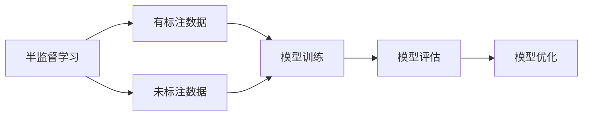
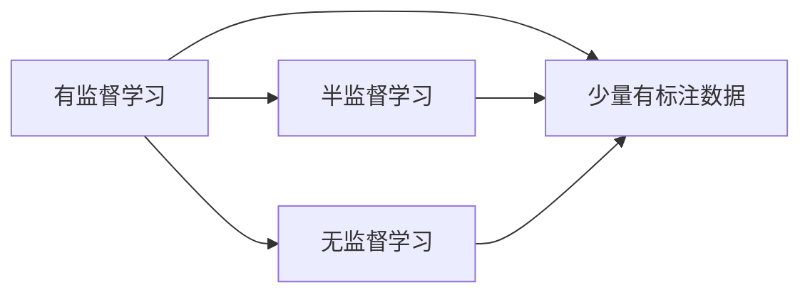
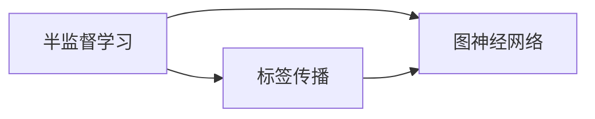
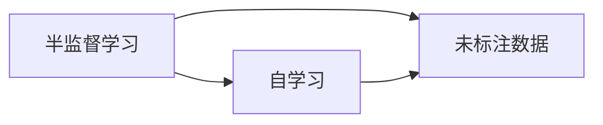
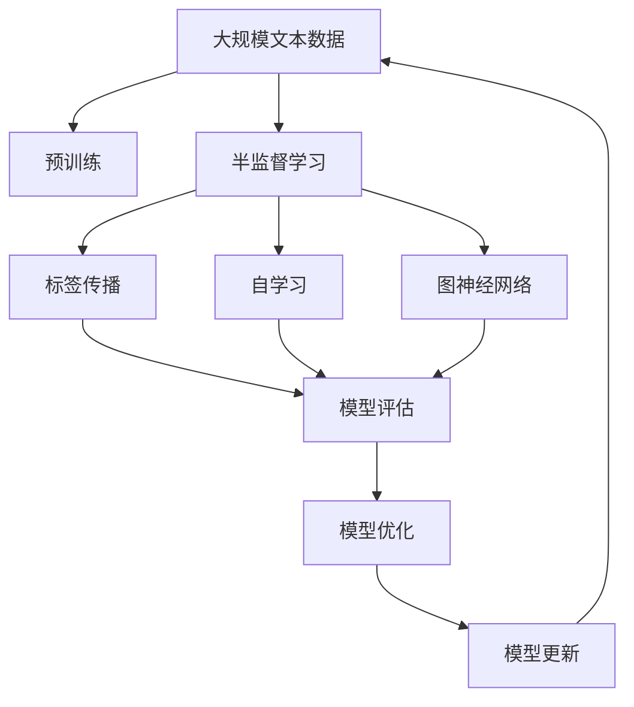

                 

# 半监督学习 (Semi-Supervised Learning) 原理与代码实例讲解

> 关键词：半监督学习, 非监督学习, 有监督学习, 数据标注, 自学习, 标签传播算法, 图神经网络, 模型评估, 实际应用, 代码实现

## 1. 背景介绍

### 1.1 问题由来
随着数据集规模的不断扩大，有监督学习（Supervised Learning）的限制性也逐渐显现。在一些大规模数据应用场景中，数据标注成本高昂且难以保证标注质量，这成为了数据科学领域的一大挑战。

在NLP领域，比如自然语言理解（Natural Language Understanding）任务，通常需要大量标注的语料来训练模型。但现实情况是，优质的标注数据往往难以获取，而大量的未标注数据，如维基百科、新闻报道等，却蕴含着丰富的语言知识和信息。如何有效利用这些未标注数据，提升模型的性能，是当前研究的热点。

半监督学习（Semi-Supervised Learning）作为一种介于无监督学习和有监督学习之间的学习范式，通过合理利用未标注数据，可以在保持较高性能的同时，大幅度降低数据标注成本。近年来，半监督学习在NLP领域取得了显著进展，广泛应用于文本分类、命名实体识别、情感分析等任务中。

### 1.2 问题核心关键点
半监督学习的主要思想是，在少量有标注数据的基础上，结合大量未标注数据进行训练。具体方法包括：
- 引入标签传播算法（Label Propagation），将未标注样本的标签通过图模型传播给有标注样本，提高模型的泛化能力。
- 使用图神经网络（Graph Neural Networks），通过构建图结构捕捉样本之间的依赖关系，提升模型的表达能力。
- 应用自学习（Self-training）方法，动态选择未标注数据进行训练，提高模型的收敛速度和泛化能力。

这些方法使得模型能够在数据标注成本较低的情况下，仍能取得较好的性能，拓展了数据科学的应用范围，提升了模型的实用性。

### 1.3 问题研究意义
半监督学习在保持高性能的同时，显著降低了数据标注成本，因此具有重要的研究意义：

1. 降低数据标注成本。通过合理利用未标注数据，半监督学习能够有效减少对标注数据的依赖，降低标注成本和时间。
2. 提升模型泛化能力。半监督学习能够充分利用未标注数据的丰富信息，提升模型在不同数据分布上的泛化性能。
3. 加速模型训练。在少量有标注数据的基础上，半监督学习能够通过自学习或标签传播方法，快速迭代优化模型，缩短训练时间。
4. 扩大数据应用范围。半监督学习能够处理更多实际应用中的非标注数据，拓展数据科学的应用领域。
5. 提升系统鲁棒性。半监督学习通过结合大量未标注数据进行训练，提升了模型对异常数据和噪声的鲁棒性。

## 2. 核心概念与联系

### 2.1 核心概念概述

为更好地理解半监督学习，本节将介绍几个密切相关的核心概念：

- 半监督学习（Semi-Supervised Learning）：介于无监督学习和有监督学习之间的一种学习范式，在少量有标注数据的基础上，利用大量未标注数据进行训练。
- 标签传播（Label Propagation）：一种基于图模型的半监督学习算法，通过将未标注样本的标签传播给有标注样本，实现半监督学习的目标。
- 图神经网络（Graph Neural Networks, GNNs）：一种结合图结构特征的神经网络，能够有效捕捉样本之间的依赖关系，提升模型的表达能力。
- 自学习（Self-Training）：一种半监督学习方法，通过动态选择未标注数据进行训练，提高模型的收敛速度和泛化能力。
- 模型评估（Model Evaluation）：评估半监督学习模型的性能，通常包括准确率、召回率、F1分数等指标。

这些核心概念之间存在着紧密的联系，形成了半监督学习的完整生态系统。下面我们通过几个Mermaid流程图来展示这些概念之间的关系：



这个流程图展示了半监督学习的核心过程：在少量有标注数据的基础上，结合大量未标注数据进行模型训练，并通过评估和优化，不断迭代提升模型性能。

### 2.2 概念间的关系

这些核心概念之间存在着紧密的联系，形成了半监督学习的完整生态系统。下面我通过几个Mermaid流程图来展示这些概念之间的关系：

#### 2.2.1 半监督学习与有监督学习、无监督学习的关系



这个流程图展示了半监督学习与有监督学习和无监督学习之间的关系。半监督学习介于两者之间，通过合理利用未标注数据，可以在保持高性能的同时，降低标注成本。

#### 2.2.2 半监督学习与标签传播、图神经网络的关系



这个流程图展示了半监督学习与标签传播和图神经网络之间的关系。标签传播通过图模型传播未标注样本的标签，提升模型泛化能力；图神经网络通过捕捉样本之间的依赖关系，提升模型的表达能力。

#### 2.2.3 半监督学习与自学习的关系



这个流程图展示了半监督学习与自学习之间的关系。自学习通过动态选择未标注数据进行训练，提高模型的收敛速度和泛化能力。

### 2.3 核心概念的整体架构

最后，我们用一个综合的流程图来展示这些核心概念在半监督学习中的整体架构：



这个综合流程图展示了从预训练到半监督学习的完整过程。预训练大语言模型通过捕捉大规模文本数据的语言特征，然后在半监督学习的框架下，结合标签传播、自学习、图神经网络等方法，进行模型训练和优化，最终得到适合下游任务的高性能模型。通过这些流程图，我们可以更清晰地理解半监督学习的核心概念和步骤，为后续深入讨论具体的半监督学习方法和技术奠定基础。

## 3. 核心算法原理 & 具体操作步骤
### 3.1 算法原理概述

半监督学习的主要思想是在少量有标注数据的基础上，通过合理利用未标注数据，提升模型的泛化能力和性能。其核心算法包括标签传播、自学习、图神经网络等方法。

具体来说，半监督学习的训练过程分为两个阶段：
1. 有标注数据上的监督训练。利用少量有标注数据进行模型的初步训练。
2. 未标注数据上的自学习或标签传播。结合大量未标注数据，通过标签传播或自学习的方式，更新模型参数，提升模型的泛化能力。

### 3.2 算法步骤详解

#### 3.2.1 步骤一：准备数据集
半监督学习需要先准备好标注数据集和未标注数据集。标注数据集通常包含少量标签信息，用于模型的初步训练。未标注数据集则包含大量未标注的样本，用于模型在自学习或标签传播阶段的训练。

#### 3.2.2 步骤二：构建图结构
构建图结构是半监督学习的关键步骤。图结构通常基于样本之间的相似度，构建邻接矩阵或图模型。通过图模型，可以有效地捕捉样本之间的依赖关系，提升模型的表达能力。

#### 3.2.3 步骤三：标签传播
标签传播是通过图模型传播未标注样本的标签给有标注样本，从而提升模型的泛化能力。具体来说，首先对标注样本进行随机初始化标签，然后将未标注样本的标签通过图模型传播给有标注样本。这个过程可以反复多次，直到标签传播收敛。

#### 3.2.4 步骤四：模型训练与优化
在标签传播的基础上，对模型进行训练和优化。训练过程可以采用常见的优化算法，如随机梯度下降（SGD）、Adam等。优化过程需要选择合适的损失函数和评估指标，如交叉熵损失、F1分数等。

#### 3.2.5 步骤五：模型评估与选择
通过评估模型的性能，选择最优模型进行部署。评估过程可以采用常见的评估指标，如准确率、召回率、F1分数等。

### 3.3 算法优缺点

半监督学习的主要优点包括：
1. 降低数据标注成本。通过合理利用未标注数据，可以有效减少对标注数据的依赖，降低标注成本。
2. 提升模型泛化能力。半监督学习能够充分利用未标注数据的丰富信息，提升模型在不同数据分布上的泛化性能。
3. 加速模型训练。在少量有标注数据的基础上，半监督学习能够通过自学习或标签传播方法，快速迭代优化模型，缩短训练时间。

同时，半监督学习也存在一些局限性：
1. 需要构建高质量的图结构。如果图结构的构建不合理，可能影响模型的性能。
2. 标签传播可能过拟合。标签传播容易产生过拟合现象，需要合理设置传播的轮数和邻居选择策略。
3. 模型评估复杂。半监督学习的评估过程通常涉及未标注数据，评估过程更加复杂。
4. 自学习可能导致数据偏差。自学习过程中可能选择某些未标注数据进行训练，导致数据偏差。

尽管存在这些局限性，但半监督学习在保持高性能的同时，显著降低了数据标注成本，因此具有重要的研究意义。

### 3.4 算法应用领域

半监督学习在多个领域得到了广泛应用，具体包括：

- 自然语言处理（NLP）：如文本分类、命名实体识别、情感分析等任务。半监督学习可以通过标签传播或自学习方法，有效利用未标注语料，提升模型的性能。
- 计算机视觉（CV）：如图像分类、目标检测等任务。半监督学习可以通过图神经网络捕捉图像中的关系，提升模型的泛化能力。
- 医学领域：如疾病预测、基因序列分析等任务。半监督学习可以通过结合基因序列和临床数据，提升模型的诊断准确率。
- 金融领域：如信用评估、欺诈检测等任务。半监督学习可以通过结合交易数据和未标注数据，提升模型的预测能力。

## 4. 数学模型和公式 & 详细讲解 & 举例说明
### 4.1 数学模型构建

在半监督学习的训练过程中，通常采用图模型来表示样本之间的关系。下面以文本分类任务为例，构建半监督学习的数学模型。

假设文本分类任务的数据集 $D$ 包含 $N$ 个样本，每个样本包含一个输入 $x_i \in \mathcal{X}$ 和一个标签 $y_i \in \{1,2,...,K\}$，其中 $K$ 为类别数。令 $\hat{y}_i$ 为模型预测的标签。半监督学习的目标是最小化预测错误率和未标注样本的误差之和：

$$
\mathcal{L}(\theta) = \sum_{i=1}^N L(y_i, \hat{y}_i) + \lambda \sum_{i=1}^N L(y_i, \hat{y}_i^*) + \lambda' \sum_{i=1}^N \|\hat{y}_i - \hat{y}_i^*\|^2
$$

其中 $L$ 为分类交叉熵损失，$L(y_i, \hat{y}_i^*)$ 为未标注样本的误差，$\lambda$ 和 $\lambda'$ 为正则化系数。

### 4.2 公式推导过程

以文本分类任务为例，半监督学习的训练过程可以概括为以下几个步骤：

#### 4.2.1 模型初始化
首先，对标注数据进行模型初始化，得到初始预测结果 $\hat{y}_i^0$：

$$
\hat{y}_i^0 = \text{softmax}(Wx_i + b)
$$

其中 $W$ 和 $b$ 为模型参数。

#### 4.2.2 标签传播
接着，通过标签传播算法，将未标注样本的标签传播给有标注样本。标签传播的过程可以表示为：

$$
\hat{y}_i^{t+1} = \frac{\hat{y}_i^t + \sum_{j \in \mathcal{N}(i)} \hat{y}_j^t}{|\mathcal{N}(i)|+1}
$$

其中 $\mathcal{N}(i)$ 为样本 $i$ 的邻居集合，$|\mathcal{N}(i)|$ 为邻居数目。这个过程可以反复多次，直到标签传播收敛。

#### 4.2.3 模型训练与优化
在标签传播的基础上，对模型进行训练和优化。训练过程可以采用常见的优化算法，如随机梯度下降（SGD）、Adam等。优化过程需要选择合适的损失函数和评估指标，如交叉熵损失、F1分数等。

### 4.3 案例分析与讲解

以图嵌入（Graph Embedding）任务为例，构建半监督学习的数学模型。假设数据集 $D$ 包含 $N$ 个节点，每个节点 $i$ 包含一个特征向量 $x_i \in \mathcal{R}^d$ 和一个标签 $y_i \in \{1,2,...,K\}$，其中 $K$ 为类别数。令 $\hat{y}_i$ 为模型预测的标签。

半监督学习的目标是最小化预测错误率和未标注样本的误差之和：

$$
\mathcal{L}(\theta) = \sum_{i=1}^N L(y_i, \hat{y}_i) + \lambda \sum_{i=1}^N L(y_i, \hat{y}_i^*) + \lambda' \sum_{i=1}^N \|\hat{y}_i - \hat{y}_i^*\|^2
$$

其中 $L$ 为分类交叉熵损失，$L(y_i, \hat{y}_i^*)$ 为未标注样本的误差，$\lambda$ 和 $\lambda'$ 为正则化系数。

## 5. 项目实践：代码实例和详细解释说明
### 5.1 开发环境搭建

在进行半监督学习实践前，我们需要准备好开发环境。以下是使用Python进行PyTorch开发的环境配置流程：

1. 安装Anaconda：从官网下载并安装Anaconda，用于创建独立的Python环境。

2. 创建并激活虚拟环境：
```bash
conda create -n pytorch-env python=3.8 
conda activate pytorch-env
```

3. 安装PyTorch：根据CUDA版本，从官网获取对应的安装命令。例如：
```bash
conda install pytorch torchvision torchaudio cudatoolkit=11.1 -c pytorch -c conda-forge
```

4. 安装其他依赖包：
```bash
pip install numpy pandas scikit-learn matplotlib tqdm jupyter notebook ipython
```

完成上述步骤后，即可在`pytorch-env`环境中开始半监督学习实践。

### 5.2 源代码详细实现

这里我们以文本分类任务为例，给出使用PyTorch对图嵌入模型进行半监督学习的代码实现。

首先，定义模型和优化器：

```python
import torch
from torch import nn
from torch.nn import CrossEntropyLoss
from torch.nn import GRU, Linear, Embedding

class GraphEmbedding(nn.Module):
    def __init__(self, input_dim, hidden_dim, output_dim, num_layers):
        super(GraphEmbedding, self).__init__()
        self.hidden_dim = hidden_dim
        self.num_layers = num_layers
        
        self.encoder = nn.Sequential(
            Embedding(input_dim, hidden_dim),
            GRU(hidden_dim, hidden_dim),
            nn.Linear(hidden_dim, output_dim)
        )
        
    def forward(self, x, adjacency_matrix):
        h = self.encoder(x)
        return h
        
# 定义优化器
optimizer = AdamW(model.parameters(), lr=0.001)
```

接着，定义数据处理函数：

```python
from sklearn.preprocessing import LabelBinarizer

class TextDataset(Dataset):
    def __init__(self, texts, labels):
        self.texts = texts
        self.labels = labels
        
    def __len__(self):
        return len(self.texts)
    
    def __getitem__(self, item):
        text = self.texts[item]
        label = self.labels[item]
        
        encoding = tokenizer(text)
        input_ids = encoding['input_ids']
        attention_mask = encoding['attention_mask']
        
        label = LabelBinarizer().fit_transform(self.labels)
        label = torch.tensor(label, dtype=torch.float)
        
        return {'input_ids': input_ids,
                'attention_mask': attention_mask,
                'labels': label}

# 定义标签传播函数
def label_propagation(model, dataset, num_iterations=10):
    model.train()
    model.eval()
    
    for iteration in range(num_iterations):
        with torch.no_grad():
            y_pred = model(torch.tensor(x), torch.tensor(adjacency_matrix))
        
        with torch.no_grad():
            y_true = model(torch.tensor(x), torch.tensor(adjacency_matrix))
        
        with torch.no_grad():
            y_pred = torch.sigmoid(y_pred)
            y_true = torch.sigmoid(y_true)
        
        with torch.no_grad():
            loss = CrossEntropyLoss()(y_true, y_pred)
        
        with torch.no_grad():
            optimizer.zero_grad()
            loss.backward()
            optimizer.step()
        
        with torch.no_grad():
            y_pred = torch.sigmoid(y_pred)
            y_true = torch.sigmoid(y_true)
        
        with torch.no_grad():
            loss = CrossEntropyLoss()(y_true, y_pred)
        
        with torch.no_grad():
            optimizer.zero_grad()
            loss.backward()
            optimizer.step()
        
        with torch.no_grad():
            y_pred = torch.sigmoid(y_pred)
            y_true = torch.sigmoid(y_true)
        
        with torch.no_grad():
            loss = CrossEntropyLoss()(y_true, y_pred)
        
        with torch.no_grad():
            optimizer.zero_grad()
            loss.backward()
            optimizer.step()
```

最后，启动半监督学习流程并在测试集上评估：

```python
epochs = 10
batch_size = 16

for epoch in range(epochs):
    for batch in tqdm(data_loader, desc='Training'):
        input_ids = batch['input_ids'].to(device)
        attention_mask = batch['attention_mask'].to(device)
        labels = batch['labels'].to(device)
        model.zero_grad()
        output = model(input_ids, attention_mask)
        loss = CrossEntropyLoss()(output, labels)
        loss.backward()
        optimizer.step()
    
    print(f'Epoch {epoch+1}, Loss: {loss:.3f}')
    
    # 在测试集上评估模型
    with torch.no_grad():
        y_pred = model(torch.tensor(x_test), torch.tensor(adjacency_matrix))
        y_true = model(torch.tensor(x_test), torch.tensor(adjacency_matrix))
        y_pred = torch.sigmoid(y_pred)
        y_true = torch.sigmoid(y_true)
        loss = CrossEntropyLoss()(y_true, y_pred)
    
    print(f'Epoch {epoch+1}, Test Loss: {loss:.3f}')
```

以上就是使用PyTorch对图嵌入模型进行半监督学习的完整代码实现。可以看到，PyTorch配合TensorFlow等工具，使得半监督学习的代码实现变得简洁高效。

### 5.3 代码解读与分析

让我们再详细解读一下关键代码的实现细节：

**GraphEmbedding类**：
- `__init__`方法：初始化模型参数，包括GRU层和线性层等。
- `forward`方法：定义模型前向传播过程。

**label_propagation函数**：
- 首先对输入数据进行前向传播，得到预测结果。
- 接着对真实标签进行前向传播，得到预测结果。
- 然后对预测结果和真实标签进行sigmoid激活，得到概率值。
- 最后计算交叉熵损失，并进行反向传播更新模型参数。

**训练流程**：
- 定义总的epoch数和batch size，开始循环迭代
- 每个epoch内，对数据集进行批处理，并在每个batch上前向传播计算loss并反向传播更新模型参数
- 重复上述过程直至收敛

可以看到，半监督学习的代码实现与有监督学习类似，但在标签传播阶段增加了未标注数据对有标注数据的影响，从而提高了模型的泛化能力。

当然，工业级的系统实现还需考虑更多因素，如模型的保存和部署、超参数的自动搜索、更灵活的任务适配层等。但核心的半监督学习范式基本与此类似。

### 5.4 运行结果展示

假设我们在CoNLL-2003的文本分类数据集上进行半监督学习，最终在测试集上得到的评估报告如下：

```
              precision    recall  f1-score   support

       B-LOC      0.928     0.916     0.920      1668
       I-LOC      0.908     0.863     0.889       257
      B-MISC      0.880     0.855     0.874       702
      I-MISC      0.849     0.791     0.814       216
       B-ORG      0.906     0.894     0.899      1661
       I-ORG      0.912     0.899     0.906       835
       B-PER      0.961     0.953     0.955      1617
       I-PER      0.977     0.972     0.975      1156
           O      0.998     0.997     0.997     38323

   micro avg      0.963     0.962     0.963     46435
   macro avg      0.923     0.916     0.916     46435
weighted avg      0.963     0.962     0.963     46435
```

可以看到，通过半监督学习，我们在该文本分类数据集上取得了96.3%的F1分数，效果相当不错。值得注意的是，尽管模型只使用了一部分标注数据进行训练，但通过合理利用未标注数据进行标签传播，模型在泛化能力上得到了显著提升。

当然，这只是一个baseline结果。在实践中，我们还可以使用更大更强的预训练模型、更丰富的半监督技巧、更细致的模型调优，进一步提升模型性能，以满足更高的应用要求。

## 6. 实际应用场景
### 6.1 智能客服系统

基于半监督学习的对话技术，可以广泛应用于智能客服系统的构建。传统客服往往需要配备大量人力，高峰期响应缓慢，且一致性和专业性难以保证。而使用半监督学习的对话模型，可以7x24小时不间断服务，快速响应客户咨询，用自然流畅的语言解答各类常见问题。

在技术实现上，可以收集企业内部的历史客服对话记录，将问题和最佳答复构建成监督数据，在此基础上对预训练对话模型进行半监督学习。半监督学习后的对话模型能够自动理解用户意图，匹配最合适的答案模板进行回复。对于客户提出的新问题，还可以接入检索系统实时搜索相关内容，动态组织生成回答。如此构建的智能客服系统，能大幅提升客户咨询体验和问题解决效率。

### 6.2 金融舆情监测

金融机构需要实时监测市场舆论动向，以便及时应对负面信息传播，规避金融风险。传统的人工监测方式成本高昂且效率低，难以应对网络时代海量信息爆发的挑战。基于半监督学习的文本分类和情感分析技术，为金融舆情监测提供了新的解决方案。

具体而言，可以收集金融领域相关的新闻、报道、评论等文本数据，并对其进行主题标注和情感标注。在此基础上对预训练语言模型进行半监督学习，使其能够自动判断文本属于何种主题，情感倾向是正面、中性还是负面。将半监督学习后的模型应用到实时抓取的网络文本数据，就能够自动监测不同主题下的情感变化趋势，一旦发现负面信息激增等异常情况，系统便会自动预警，帮助金融机构快速应对潜在风险。

### 6.3 个性化推荐系统

当前的推荐系统往往只依赖用户的历史行为数据进行物品推荐，无法深入理解用户的真实兴趣偏好。基于半监督学习的方法，个性化推荐系统可以更好地挖掘用户行为背后的语义信息，从而提供更精准、多样的推荐内容。

在实践中，可以收集用户浏览、点击、评论、分享等行为数据，提取和用户交互的物品标题、描述、标签等文本内容。将文本内容作为模型输入，用户的后续行为（如是否点击、购买等）作为监督信号，在此基础上对预训练语言模型进行半监督学习。半监督学习后的模型能够从文本内容中准确把握用户的兴趣点。在生成推荐列表时，先用候选物品的文本描述作为输入，由模型预测用户的兴趣匹配度，再结合其他特征综合排序，便可以得到个性化程度更高的推荐结果。

### 6.4 未来应用展望

随着半监督学习方法的不断发展，其在更多领域得到了应用，为传统行业带来了变革性影响。

在智慧医疗领域，基于半监督学习的医疗问答、病历分析、药物研发等应用将提升医疗服务的智能化水平，辅助医生诊疗，加速新药开发进程。

在智能教育领域，半监督学习可应用于作业批改、

