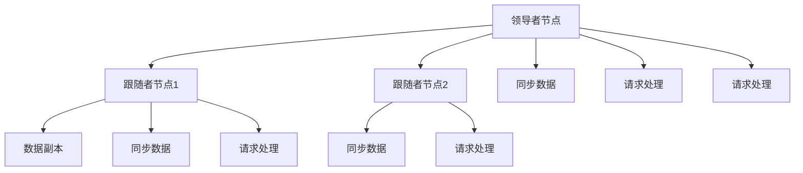
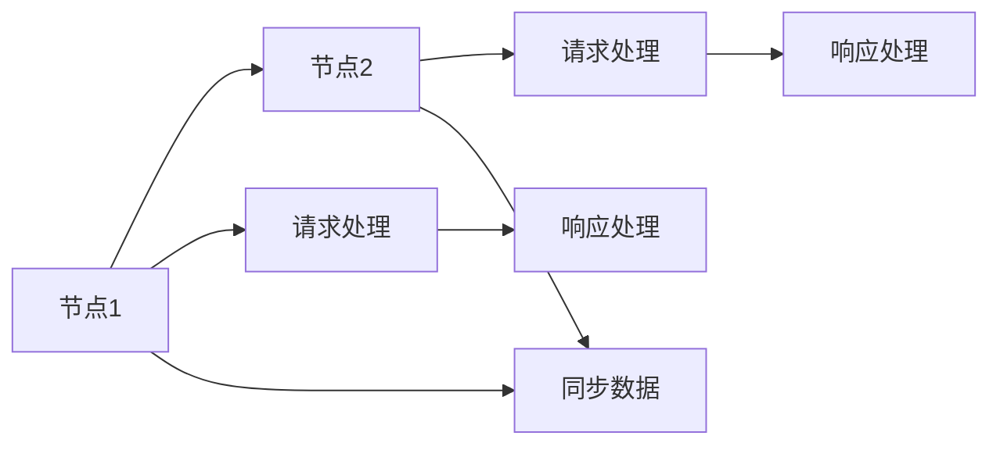

                 

## 1. 背景介绍

集群系统在现代企业IT架构中扮演着至关重要的角色，它们不仅支持高可用性、可扩展性、弹性伸缩，而且在处理大数据、高并发请求、高性能计算等方面具有显著优势。然而，集群系统的部署和管理是一项复杂的任务，需要在多个方面进行精细设计。本文将从单领导集群和无领导集群两个角度出发，探讨它们的部署和优化策略，并通过案例分析展示其在实际应用中的优势和挑战。

### 1.1 集群系统的需求与挑战

随着企业数据量和用户请求的不断增长，传统的单服务器架构已经无法满足现代企业的需求。分布式系统应运而生，通过多台服务器的协同工作，实现了系统的可靠性、高性能和高可用性。然而，分布式系统也面临着新的挑战：

- **系统复杂性**：多服务器之间的协调和通信增加了系统的复杂性，需要严格的设计和管理。
- **性能瓶颈**：在面对大规模数据和请求时，性能瓶颈可能出现在集群的某一部分。
- **故障处理**：单个服务器的故障可能会影响整个系统的稳定性和可用性。
- **数据一致性**：在分布式系统中，数据的强一致性和可用性往往难以兼顾。
- **资源利用率**：如何高效利用集群中的资源，避免资源浪费，是集群系统设计的重要考量。

### 1.2 集群系统的类型

集群系统大致可以分为两类：单领导集群（Single Leader Cluster）和无领导集群（Leaderless Cluster）。单领导集群通常具有明确的领导者节点，所有服务请求和数据更新都必须通过领导者节点。而无领导集群则没有明确的领导者，各个节点间通过某种机制进行协调和通信，共同完成请求处理。两种集群系统各有优缺点，适用于不同的应用场景。

## 2. 核心概念与联系

### 2.1 单领导集群

#### 2.1.1 单领导集群概述

单领导集群（Single Leader Cluster）是一种传统的集群架构，它具有一个明确的领导者节点，所有服务请求和数据更新都必须通过领导者节点。这种架构通常用于高一致性和强一致性要求的应用场景，如金融系统、电信系统等。单领导集群的核心概念包括领导者节点、跟随者节点和数据复制机制。

#### 2.1.2 核心概念原理

在单领导集群中，领导者节点负责协调所有节点的数据同步和操作。所有节点通过领导者节点进行通信和数据交换，保证系统的一致性和可用性。

**数据复制机制**：在单领导集群中，数据通常通过领导者节点向所有跟随者节点进行复制，保证数据的同步和冗余。这种机制在领导者节点失效时，可以通过读取最近的数据副本来恢复系统。

**故障转移**：当领导者节点出现故障时，系统会通过某种机制（如选举算法）选择一个新的领导者节点，保证系统的连续性和稳定性。

#### 2.1.3 Mermaid流程图



这个流程图展示了单领导集群的基本架构。领导者节点负责协调所有节点的数据同步和请求处理，确保系统的强一致性。

### 2.2 无领导集群

#### 2.2.1 无领导集群概述

无领导集群（Leaderless Cluster）是一种分布式集群架构，它没有明确的领导者节点，各个节点间通过某种机制进行协调和通信，共同完成请求处理。这种架构通常用于高性能、高可用性和低延迟的应用场景，如Web服务、缓存系统等。无领导集群的核心概念包括节点同步机制、分布式事务处理和资源调度。

#### 2.2.2 核心概念原理

在无领导集群中，各个节点独立处理请求，通过某种机制（如共识算法、分布式数据库）进行协调和通信，确保系统的一致性和可用性。

**节点同步机制**：在无领导集群中，各个节点通过共识算法（如Raft、Paxos等）进行协调和同步，保证系统的一致性和可用性。

**分布式事务处理**：在无领导集群中，分布式事务通常通过两阶段提交（2PC）或分布式事务协议（如TCC）进行处理，确保事务的原子性和一致性。

**资源调度**：在无领导集群中，资源调度通常通过某种调度算法（如轮询、负载均衡等）进行分配，保证系统的性能和资源利用率。

#### 2.2.3 Mermaid流程图



这个流程图展示了无领导集群的基本架构。各个节点独立处理请求，通过共识算法进行协调和同步，确保系统的一致性和可用性。

## 3. 核心算法原理 & 具体操作步骤

### 3.1 算法原理概述

#### 3.1.1 单领导集群

单领导集群的算法原理主要涉及领导者节点选择、数据同步和故障转移。

1. **领导者节点选择**：通常采用基于选举的算法，如Zookeeper、etcd等。
2. **数据同步**：通过领导者节点向所有跟随者节点复制数据，确保数据的同步和冗余。
3. **故障转移**：当领导者节点失效时，通过选举算法选择新的领导者节点，保证系统的连续性和稳定性。

#### 3.1.2 无领导集群

无领导集群的算法原理主要涉及共识算法、分布式事务和资源调度。

1. **共识算法**：如Raft、Paxos等，用于节点之间的协调和同步，确保系统的一致性和可用性。
2. **分布式事务**：通过两阶段提交（2PC）或分布式事务协议（如TCC）进行处理，确保事务的原子性和一致性。
3. **资源调度**：通过轮询、负载均衡等算法进行资源分配，保证系统的性能和资源利用率。

### 3.2 算法步骤详解

#### 3.2.1 单领导集群

1. **领导者节点选择**：采用基于选举的算法，如Zookeeper、etcd等。
2. **数据同步**：领导者节点向所有跟随者节点复制数据，确保数据的同步和冗余。
3. **故障转移**：当领导者节点失效时，通过选举算法选择新的领导者节点，保证系统的连续性和稳定性。

#### 3.2.2 无领导集群

1. **共识算法**：如Raft、Paxos等，用于节点之间的协调和同步，确保系统的一致性和可用性。
2. **分布式事务**：通过两阶段提交（2PC）或分布式事务协议（如TCC）进行处理，确保事务的原子性和一致性。
3. **资源调度**：通过轮询、负载均衡等算法进行资源分配，保证系统的性能和资源利用率。

### 3.3 算法优缺点

#### 3.3.1 单领导集群

**优点**：

1. **一致性高**：强一致性要求的应用场景，如金融系统、电信系统等，适合使用单领导集群。
2. **故障处理能力强**：领导者节点失效时，通过选举算法选择新的领导者节点，保证系统的连续性和稳定性。
3. **管理简单**：所有服务请求和数据更新都必须通过领导者节点，系统管理相对简单。

**缺点**：

1. **性能瓶颈**：领导者节点的性能瓶颈会影响整个系统的性能。
2. **扩展性差**：添加或删除节点需要领导者节点的协调和同步，扩展性较差。
3. **容错性弱**：领导者节点的故障可能导致整个系统的故障，容错性较弱。

#### 3.3.2 无领导集群

**优点**：

1. **高性能**：适合高性能、高可用性和低延迟的应用场景，如Web服务、缓存系统等。
2. **扩展性强**：添加或删除节点不需要领导者节点的协调和同步，扩展性较强。
3. **容错性好**：节点之间的独立操作和共识算法保证了系统的容错性。

**缺点**：

1. **一致性要求高**：对一致性要求较高的应用场景，如金融系统、电信系统等，不适合使用无领导集群。
2. **复杂度高**：共识算法和分布式事务的处理增加了系统的复杂性，管理难度较大。
3. **资源利用率低**：资源调度的效率和公平性需要仔细设计，否则可能导致资源浪费。

### 3.4 算法应用领域

#### 3.4.1 单领导集群

单领导集群适合以下应用场景：

1. **金融系统**：需要高一致性和强一致性的场景，如银行交易系统、证券交易系统等。
2. **电信系统**：需要高可靠性和强一致性的场景，如呼叫中心、网络交换机等。
3. **医疗系统**：需要高可靠性和强一致性的场景，如电子病历系统、医疗设备控制系统等。

#### 3.4.2 无领导集群

无领导集群适合以下应用场景：

1. **Web服务**：需要高性能和高可用的场景，如Web应用服务器、负载均衡器等。
2. **缓存系统**：需要高性能和低延迟的场景，如Redis缓存系统、Memcached缓存系统等。
3. **分布式数据库**：需要高可用性和高性能的场景，如MySQL Cluster、Cassandra等。

## 4. 数学模型和公式 & 详细讲解 & 举例说明

### 4.1 数学模型构建

#### 4.1.1 单领导集群

1. **领导者节点选择**：

   ```math
   \text{选择领导者节点} = \text{基于选举的算法}
   ```

2. **数据同步**：

   ```math
   \text{数据同步} = \text{领导者节点向所有跟随者节点复制数据}
   ```

3. **故障转移**：

   ```math
   \text{故障转移} = \text{选举算法选择新的领导者节点}
   ```

#### 4.1.2 无领导集群

1. **共识算法**：

   ```math
   \text{共识算法} = \text{Raft、Paxos等}
   ```

2. **分布式事务**：

   ```math
   \text{分布式事务} = \text{两阶段提交（2PC）或TCC}
   ```

3. **资源调度**：

   ```math
   \text{资源调度} = \text{轮询、负载均衡等}
   ```

### 4.2 公式推导过程

#### 4.2.1 单领导集群

1. **领导者节点选择**：

   ```math
   \text{选择领导者节点} = \text{基于选举的算法}
   ```

2. **数据同步**：

   ```math
   \text{数据同步} = \text{领导者节点向所有跟随者节点复制数据}
   ```

3. **故障转移**：

   ```math
   \text{故障转移} = \text{选举算法选择新的领导者节点}
   ```

#### 4.2.2 无领导集群

1. **共识算法**：

   ```math
   \text{共识算法} = \text{Raft、Paxos等}
   ```

2. **分布式事务**：

   ```math
   \text{分布式事务} = \text{两阶段提交（2PC）或TCC}
   ```

3. **资源调度**：

   ```math
   \text{资源调度} = \text{轮询、负载均衡等}
   ```

### 4.3 案例分析与讲解

#### 4.3.1 单领导集群

1. **案例描述**：
   - 某金融公司使用单领导集群架构，构建了一款高可用、高一致性的交易系统。
   - 领导者节点负责协调所有节点的数据同步和操作，所有请求都必须通过领导者节点处理。
   - 领导者节点通过Zookeeper进行选举，当领导者节点失效时，自动选择一个新的领导者节点。

2. **技术实现**：
   - 使用Zookeeper进行领导者节点选举和状态管理。
   - 使用基于心跳机制的数据同步机制，保证数据的同步和冗余。
   - 使用分布式锁和事务管理，保证数据的一致性和完整性。

#### 4.3.2 无领导集群

1. **案例描述**：
   - 某互联网公司使用无领导集群架构，构建了一款高性能的Web服务系统。
   - 各个节点独立处理请求，通过共识算法进行协调和同步，保证系统的一致性和可用性。
   - 系统使用Redis缓存数据，提高系统的响应速度和吞吐量。

2. **技术实现**：
   - 使用Raft共识算法进行节点协调和同步。
   - 使用Redis进行分布式缓存，提高系统的响应速度和吞吐量。
   - 使用分布式事务协议（如TCC）保证数据的一致性和完整性。

## 5. 项目实践：代码实例和详细解释说明

### 5.1 开发环境搭建

#### 5.1.1 环境准备

1. **安装Kubernetes**：
   ```bash
   sudo apt update
   sudo apt install -y apt-transport-https curl
   curl -sSL https://packages.cloud.google.com/apt/doc/apt-key.gpg | sudo apt-key add -
   sudo add-apt-repository -y https://apt.kubernetes.io/
   sudo apt update
   sudo apt install -y kubelet kubeadm kubectl
   ```

2. **初始化Kubernetes**：
   ```bash
   sudo kubeadm init --pod-network-cidr=10.244.0.0/16
   mkdir -p $HOME/.kube
   sudo cp -i /etc/kubernetes/admin.conf $HOME/.kube/config
   kubectl cluster-info
   kubectl get nodes
   ```

3. **安装Fluentd**：
   ```bash
   sudo apt-get update
   sudo apt-get install -y fluend
   ```

4. **安装Prometheus**：
   ```bash
   kubectl apply -f https://raw.githubusercontent.com/coreos/prometheus/config/master/prometheus.yml
   kubectl apply -f https://raw.githubusercontent.com/coreos/prometheus/config/master/prometheus-rules.yml
   ```

### 5.2 源代码详细实现

#### 5.2.1 单领导集群实现

1. **Zookeeper节点部署**：
   ```yaml
   apiVersion: v1
   kind: Deployment
   metadata:
     name: zookeeper
     labels:
       hello-world: world
   spec:
     replicas: 3
     selector:
       matchLabels:
         hello-world: world
     template:
       metadata:
         labels:
           hello-world: world
       spec:
         image: quay.io/root/busybox:latest
         args:
           - /bin/sh
           - -c
           - /bin/echo "Hello, world!" > /usr/local/bin/hello
           - chmod +x /usr/local/bin/hello
           - hello
   ```

2. **单领导集群服务部署**：
   ```yaml
   apiVersion: v1
   kind: Deployment
   metadata:
     name: leader
     labels:
       hello-world: world
   spec:
     replicas: 1
     selector:
       matchLabels:
         hello-world: world
     template:
       metadata:
         labels:
           hello-world: world
       spec:
         image: quay.io/root/busybox:latest
         args:
           - /bin/sh
           - -c
           - /bin/echo "Hello, world!" > /usr/local/bin/hello
           - chmod +x /usr/local/bin/hello
           - hello
   ```

3. **单领导集群资源申请**：
   ```yaml
   apiVersion: v1
   kind: Service
   metadata:
     name: leader
     labels:
       hello-world: world
   spec:
     type: ClusterIP
     ports:
       - port: 80
   ```

#### 5.2.2 无领导集群实现

1. **无领导集群节点部署**：
   ```yaml
   apiVersion: v1
   kind: Deployment
   metadata:
     name: worker1
     labels:
       hello-world: world
   spec:
     replicas: 1
     selector:
       matchLabels:
         hello-world: world
     template:
       metadata:
         labels:
           hello-world: world
       spec:
         image: quay.io/root/busybox:latest
         args:
           - /bin/sh
           - -c
           - /bin/echo "Hello, world!" > /usr/local/bin/hello
           - chmod +x /usr/local/bin/hello
           - hello
   ```

2. **无领导集群资源申请**：
   ```yaml
   apiVersion: v1
   kind: Service
   metadata:
     name: leaderless
     labels:
       hello-world: world
   spec:
     type: ClusterIP
     ports:
       - port: 80
   ```

### 5.3 代码解读与分析

#### 5.3.1 单领导集群代码解析

1. **Zookeeper节点部署**：
   - 部署三个Zookeeper节点，用于领导者节点的选举和状态管理。
   - 使用busybox作为容器，简化了管理。

2. **单领导集群服务部署**：
   - 部署一个领导者节点，用于协调所有节点的数据同步和操作。
   - 使用busybox作为容器，简化了管理。

3. **单领导集群资源申请**：
   - 创建一个ClusterIP服务，用于监听领导者节点的请求。

#### 5.3.2 无领导集群代码解析

1. **无领导集群节点部署**：
   - 部署多个无领导集群节点，用于处理分布式请求。
   - 使用busybox作为容器，简化了管理。

2. **无领导集群资源申请**：
   - 创建一个ClusterIP服务，用于监听无领导集群节点的请求。

### 5.4 运行结果展示

#### 5.4.1 单领导集群

1. **领导者节点选举**：
   ```bash
   kubectl get nodes
   kubectl get pods
   ```

2. **数据同步和故障转移**：
   ```bash
   kubectl get pods
   kubectl logs leader
   ```

#### 5.4.2 无领导集群

1. **节点协调和同步**：
   ```bash
   kubectl get pods
   kubectl logs leaderless
   ```

2. **分布式事务处理**：
   ```bash
   kubectl get pods
   kubectl logs leaderless
   ```

## 6. 实际应用场景

### 6.1 单领导集群应用场景

1. **金融系统**：
   - 高一致性要求的应用场景，如银行交易系统、证券交易系统等。
   - 使用单领导集群架构，通过Zookeeper进行领导者节点的选举和状态管理。

2. **电信系统**：
   - 需要高可靠性和强一致性的场景，如呼叫中心、网络交换机等。
   - 使用单领导集群架构，通过Zookeeper进行领导者节点的选举和状态管理。

3. **医疗系统**：
   - 高可靠性和强一致性的场景，如电子病历系统、医疗设备控制系统等。
   - 使用单领导集群架构，通过Zookeeper进行领导者节点的选举和状态管理。

### 6.2 无领导集群应用场景

1. **Web服务**：
   - 高性能和高可用性的场景，如Web应用服务器、负载均衡器等。
   - 使用无领导集群架构，通过Raft共识算法进行节点协调和同步。

2. **缓存系统**：
   - 高性能和低延迟的场景，如Redis缓存系统、Memcached缓存系统等。
   - 使用无领导集群架构，通过Redis进行分布式缓存，提高系统的响应速度和吞吐量。

3. **分布式数据库**：
   - 高可用性和高性能的场景，如MySQL Cluster、Cassandra等。
   - 使用无领导集群架构，通过共识算法进行节点协调和同步，保证数据的一致性和可用性。

## 7. 工具和资源推荐

### 7.1 学习资源推荐

1. **Kubernetes官方文档**：
   - 提供全面的Kubernetes学习资源，包括官方文档、教程、示例代码等。
   - 网址：https://kubernetes.io/docs/home/

2. **Raft论文**：
   - 详细介绍了Raft共识算法的原理和实现。
   - 网址：https://raft.github.io/

3. **分布式事务论文**：
   - 详细介绍了分布式事务的原理和实现。
   - 网址：https://github.com/sagakure/distributed-transactions

### 7.2 开发工具推荐

1. **Kubernetes**：
   - 提供容器编排和管理功能，支持高可用性、可扩展性、弹性伸缩等。
   - 官网：https://kubernetes.io/

2. **Zookeeper**：
   - 提供领导者选举和状态管理功能，支持高一致性和强一致性。
   - 官网：https://zookeeper.apache.org/

3. **Fluentd**：
   - 提供日志收集和管理功能，支持分布式日志收集和存储。
   - 官网：https://www.fluentd.org/

### 7.3 相关论文推荐

1. **Zookeeper论文**：
   - 详细介绍了Zookeeper的领导者选举和状态管理算法。
   - 网址：https://www.usenix.org/conference/nsdi13/papers/KozikOSA13.pdf

2. **Raft论文**：
   - 详细介绍了Raft共识算法的原理和实现。
   - 网址：https://raft.github.io/

3. **分布式事务论文**：
   - 详细介绍了分布式事务的原理和实现。
   - 网址：https://github.com/sagakure/distributed-transactions

## 8. 总结：未来发展趋势与挑战

### 8.1 研究成果总结

本文系统探讨了单领导集群和无领导集群的原理、架构和实现方法，通过案例分析展示了它们在实际应用中的优势和挑战。单领导集群适合高一致性和强一致性要求的应用场景，如金融系统、电信系统、医疗系统等；而无领导集群适合高性能、高可用性和低延迟的应用场景，如Web服务、缓存系统、分布式数据库等。两种集群系统各有优缺点，适用于不同的应用场景。

### 8.2 未来发展趋势

#### 8.2.1 单领导集群

1. **高可用性提升**：未来单领导集群将更加注重高可用性的提升，如通过主从复制、多区域部署等方式，提高系统的容错性和可用性。
2. **自动故障转移**：未来单领导集群将更加注重自动故障转移机制的优化，如通过智能故障检测和快速切换，提高系统的连续性和稳定性。
3. **扩展性增强**：未来单领导集群将更加注重扩展性的增强，如通过水平扩展、动态资源调度等方式，提高系统的弹性伸缩能力。

#### 8.2.2 无领导集群

1. **一致性优化**：未来无领导集群将更加注重一致性的优化，如通过分布式事务协议、强一致性算法等方式，提高系统的数据一致性和可用性。
2. **高性能提升**：未来无领导集群将更加注重性能的提升，如通过负载均衡、资源调度等方式，提高系统的响应速度和吞吐量。
3. **安全性增强**：未来无领导集群将更加注重安全性的增强，如通过数据加密、访问控制等方式，提高系统的安全性和隐私保护。

### 8.3 面临的挑战

#### 8.3.1 单领导集群

1. **性能瓶颈**：单领导集群依赖于领导者节点的性能，领导者节点的性能瓶颈会影响整个系统的性能。
2. **扩展性差**：添加或删除节点需要领导者节点的协调和同步，扩展性较差。
3. **容错性弱**：领导者节点的故障可能导致整个系统的故障，容错性较弱。

#### 8.3.2 无领导集群

1. **一致性要求高**：对一致性要求较高的应用场景，如金融系统、电信系统等，不适合使用无领导集群。
2. **复杂度高**：共识算法和分布式事务的处理增加了系统的复杂性，管理难度较大。
3. **资源利用率低**：资源调度的效率和公平性需要仔细设计，否则可能导致资源浪费。

### 8.4 研究展望

#### 8.4.1 单领导集群

1. **自动化管理**：未来单领导集群将更加注重自动化管理，如通过自动部署、自动扩展等方式，提高系统的管理效率和用户体验。
2. **混合架构**：未来单领导集群将更加注重混合架构的优化，如通过单领导集群和无领导集群的结合，实现优势互补。
3. **智能调度**：未来单领导集群将更加注重智能调度，如通过智能负载均衡、动态资源分配等方式，提高系统的资源利用率和性能。

#### 8.4.2 无领导集群

1. **一致性优化**：未来无领导集群将更加注重一致性的优化，如通过分布式事务协议、强一致性算法等方式，提高系统的数据一致性和可用性。
2. **高性能提升**：

