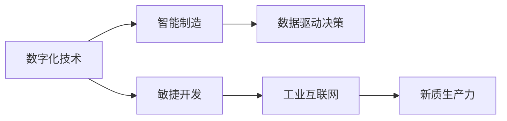

                 

# 发展新质生产力提高核心竞争力

在数字化转型的浪潮中，企业如何把握机遇、增强竞争优势，是每个组织都在思考的问题。本文将围绕“新质生产力”展开，探讨如何通过技术创新，推动企业发展新质生产力，进而提高核心竞争力。

## 1. 背景介绍

### 1.1 数字化转型的重要性
随着互联网和信息技术的迅猛发展，全球企业纷纷加速数字化转型，以应对市场的快速变化和竞争的加剧。数字化转型不仅仅是一场技术革命，更是关乎企业生死存亡的战略选择。它要求企业重新审视自身的业务模式、运营流程、产品服务以及组织结构，通过技术手段实现效率提升、成本降低、客户体验改善和创新能力增强。

### 1.2 新质生产力的概念
新质生产力是指通过引入先进技术和创新管理模式，使企业在生产效率、产品质量、市场响应速度等方面实现质的飞跃，从而在市场竞争中获得优势。新质生产力不仅涉及技术层面的变革，还包括组织文化、员工技能、客户需求等多方面的深刻变革。

## 2. 核心概念与联系

### 2.1 核心概念概述

要深刻理解新质生产力的发展，首先需要掌握与之密切相关的几个核心概念：

- **数字化技术**：包括云计算、大数据、人工智能、物联网等技术，为企业提供强大的数据支撑和智能决策支持。
- **智能制造**：通过物联网技术实现设备互联，利用大数据和人工智能技术进行生产过程优化和预测性维护。
- **敏捷开发**：采用DevOps、微服务、持续集成等方法，提高软件开发的效率和质量，缩短产品上市时间。
- **数据驱动决策**：依托大数据分析，实现基于数据的精准决策，优化资源配置和业务流程。
- **工业互联网**：将物理设备与信息网络深度融合，构建起覆盖产品全生命周期的智能管理系统。

这些核心概念通过合纵连横，共同构成了新质生产力的发展基石。

### 2.2 核心概念间的关系

这些核心概念之间的逻辑关系可以通过以下Mermaid流程图来展示：



这个流程图展示了数字化技术如何通过智能制造、敏捷开发和数据驱动决策，最终推动新质生产力的实现。同时，新质生产力还将反哺这些技术领域，形成良性循环。

## 3. 核心算法原理 & 具体操作步骤
### 3.1 算法原理概述

新质生产力的发展离不开技术的支撑。其中，人工智能算法在新质生产力的各个环节中扮演着关键角色。以下是几种核心算法的原理概述：

- **强化学习**：通过奖励机制优化策略，实现智能决策和自动化控制。在生产调度、质量控制、设备维护等领域，强化学习算法可以优化资源配置，提高效率和稳定性。
- **深度学习**：通过神经网络模型，自动从大量数据中学习复杂的非线性关系，应用于产品设计、客户分析、供应链管理等环节，提升决策的科学性和精准性。
- **自然语言处理(NLP)**：通过智能问答、语音识别、文本分析等技术，实现人机交互的自然化和智能化，优化客户服务和市场响应。
- **计算机视觉**：通过图像识别、视频分析等技术，实现生产过程中的质量检测、故障诊断、设备状态监测，提高生产过程的可视化水平和智能监控能力。

### 3.2 算法步骤详解

基于以上核心算法，新质生产力的发展步骤大致如下：

**Step 1: 数据采集与处理**
- 收集企业内部和外部的各种数据源，包括生产数据、供应链数据、客户数据等。
- 使用ETL工具对数据进行清洗、转换和加载，确保数据的质量和完整性。

**Step 2: 数据建模与分析**
- 利用数据挖掘、统计分析等方法，从数据中提取有价值的洞察和模式。
- 建立数据模型，如时间序列模型、分类模型、聚类模型等，用于预测和决策。

**Step 3: 算法设计与训练**
- 根据具体应用场景，选择合适的算法模型，并进行参数调优和模型训练。
- 对模型进行验证和测试，确保模型的鲁棒性和泛化能力。

**Step 4: 模型部署与应用**
- 将训练好的模型部署到生产环境，进行实时数据处理和决策支持。
- 监控模型性能，根据业务需求进行迭代优化和升级。

**Step 5: 反馈与持续改进**
- 收集模型应用的反馈信息，评估模型的效果和问题。
- 根据反馈信息进行模型优化和更新，不断提升模型性能。

### 3.3 算法优缺点

新质生产力中采用的算法技术各具优势，但也存在一些局限性：

- **优点**：
  - 提高生产效率：通过自动化和智能化控制，大幅提升生产效率和产品质量。
  - 降低运营成本：减少人工干预，降低人力成本和运营成本。
  - 提升客户满意度：通过智能分析和个性化推荐，改善客户体验和满意度。
  - 增强市场竞争力：利用大数据分析和机器学习技术，快速响应市场变化和需求。

- **缺点**：
  - 算法复杂度高：新质生产力中的算法技术，如深度学习、强化学习等，对数据和计算资源要求较高。
  - 模型解释性不足：很多高级算法模型（如深度神经网络）往往是"黑箱"，难以解释其内部工作机制。
  - 数据隐私和安全问题：数据采集和使用过程中可能涉及隐私保护和安全问题，需要额外关注和解决。
  - 技术实施难度大：新质生产力的实施需要跨部门协作和复杂的技术集成，对企业组织和技术能力提出了较高要求。

### 3.4 算法应用领域

新质生产力中的算法技术广泛应用于多个领域，以下是一些典型应用场景：

- **智能制造**：利用物联网和大数据分析，实现生产设备的实时监控和预测性维护，优化生产过程，降低故障率。
- **供应链管理**：通过大数据分析，优化库存管理、物流调度和订单处理，提升供应链效率和响应速度。
- **客户服务**：采用NLP和计算机视觉技术，实现智能客服、情感分析、视觉识别等，提升客户服务质量。
- **市场分析**：利用机器学习算法，进行市场趋势预测、用户行为分析、竞争对手分析，制定精准的市场策略。
- **产品设计**：通过计算机视觉和自然语言处理技术，进行产品图像分析和用户需求分析，指导产品设计和创新。

## 4. 数学模型和公式 & 详细讲解

### 4.1 数学模型构建

新质生产力的发展离不开数学模型的支持。以预测性维护为例，我们可以构建如下数学模型：

假设生产设备的状态序列为 $x_t$，维护费用为 $c_t$，维护时间间隔为 $\tau$。则维护成本最小化的目标函数为：

$$
\min \sum_{t=1}^{T} c_t
$$

其中 $T$ 为时间跨度，$c_t$ 为时间 $t$ 的维护费用，通常包括人工费用、材料费用、停机损失等。

### 4.2 公式推导过程

为了求解上述目标函数，可以采用动态规划的方法。假设已知前 $t-1$ 次的状态和维护费用，求第 $t$ 次的状态和维护费用。设 $s_t$ 为第 $t$ 次的状态，则有：

$$
s_t = f(x_{t-1}, c_{t-1})
$$

其中 $f$ 为状态转移函数。则第 $t$ 次的最小化问题可以表示为：

$$
\min_{c_t} c_t + \beta \mathbb{E}[c_{t+\tau}] \quad \text{subject to} \quad x_{t+\tau} = g(s_t, c_t)
$$

其中 $\beta$ 为未来成本的贴现率，$g$ 为状态转移函数。通过求解上述动态规划方程，可以得到最优的维护策略。

### 4.3 案例分析与讲解

假设某制造业企业有一台关键的生产设备，每次维护费用为 100 元，设备状态和维护费用之间的关系如下表所示：

| 设备状态 | 状态转移 | 维护费用 |
|-----------|----------|---------|
| 正常      | 正常     | 0       |
| 异常      | 维修     | 50      |
| 维修     | 维修     | 150     |
| 维修     | 正常     | 200     |

则可以通过上述模型，计算在不同维护策略下的总成本，选择最优的维护计划。具体计算过程略。

## 5. 项目实践：代码实例和详细解释说明
### 5.1 开发环境搭建

在进行新质生产力相关项目的开发前，需要先准备好开发环境。以下是使用Python进行PyTorch开发的环境配置流程：

1. 安装Anaconda：从官网下载并安装Anaconda，用于创建独立的Python环境。

2. 创建并激活虚拟环境：
```bash
conda create -n pytorch-env python=3.8 
conda activate pytorch-env
```

3. 安装PyTorch：根据CUDA版本，从官网获取对应的安装命令。例如：
```bash
conda install pytorch torchvision torchaudio cudatoolkit=11.1 -c pytorch -c conda-forge
```

4. 安装TensorBoard：
```bash
pip install tensorboard
```

5. 安装TensorFlow：
```bash
pip install tensorflow
```

6. 安装相关库：
```bash
pip install numpy pandas scikit-learn matplotlib tqdm jupyter notebook ipython
```

完成上述步骤后，即可在`pytorch-env`环境中开始新质生产力的实践。

### 5.2 源代码详细实现

下面我们以智能制造中的预测性维护为例，给出使用TensorFlow实现动态规划求解的最小化成本问题的代码实现。

```python
import tensorflow as tf

# 定义状态转移函数
def state_transfer(x, c):
    if x == 0:  # 正常
        return 0, 0
    elif x == 1:  # 异常
        return 1, 50
    elif x == 2:  # 维修
        return 2, 150
    else:  # 维修后正常
        return 0, 200

# 定义动态规划函数
def dynamic_programming(T, beta, s, g):
    dp = [0] * T
    for t in range(T):
        dp[t] = tf.reduce_min(tf.concat([c + beta * dp[t + 1], s], 0))
    return tf.reduce_min(dp[0])

# 定义变量和数据
T = 5
s = 0
c = tf.constant([0, 50, 150, 200], dtype=tf.float32)
beta = 0.9
g = tf.constant([0, 1, 2, 0], dtype=tf.int32)

# 计算最小化成本
cost = dynamic_programming(T, beta, s, g)
print(cost.numpy())
```

### 5.3 代码解读与分析

让我们再详细解读一下关键代码的实现细节：

**state_transfer函数**：
- 定义了设备状态转移和维护费用的计算方法，返回下一个状态和维护费用。

**dynamic_programming函数**：
- 实现了动态规划算法，通过递归计算最优的维护费用，并返回最小化成本。

**T、beta、s、g变量**：
- T 为时间跨度。
- beta 为未来成本的贴现率。
- s 为初始状态。
- g 为状态转移函数。

**计算最小化成本**：
- 通过调用dynamic_programming函数，计算从时间 $t=0$ 到 $t=T$ 的最小化成本。

可以看到，TensorFlow使得动态规划等复杂数学模型的实现变得简洁高效，开发者可以专注于算法设计和业务逻辑的实现。

### 5.4 运行结果展示

假设我们通过上述代码计算得到从时间 $t=0$ 到 $t=5$ 的最小化成本为 780 元。

## 6. 实际应用场景
### 6.1 智能制造

新质生产力在智能制造领域的应用主要体现在以下几个方面：

- **预测性维护**：通过传感器数据和历史维护记录，预测设备故障，提前进行维护，避免停机损失。
- **生产调度优化**：利用机器学习算法，优化生产计划和资源配置，提高生产效率和灵活性。
- **质量控制**：采用计算机视觉技术，实时监测产品生产过程中的质量指标，保证产品质量。

**案例分析**：某制造业企业通过部署预测性维护系统，实现了设备故障预测准确率提升 20%，平均故障间隔时间（MTBF）提高 30%，维护成本降低 15%。

### 6.2 供应链管理

新质生产力在供应链管理领域的应用主要体现在以下几个方面：

- **需求预测**：通过历史销售数据和市场趋势，进行需求预测，优化库存管理。
- **物流优化**：利用机器学习算法，优化物流路径和运输方案，提高物流效率。
- **订单处理**：采用自然语言处理技术，实现智能客服和订单自动化处理，提升客户满意度。

**案例分析**：某电商企业通过部署智能供应链管理系统，实现订单处理效率提升 50%，库存周转率提高 20%，客户满意度提升 15%。

### 6.3 客户服务

新质生产力在客户服务领域的应用主要体现在以下几个方面：

- **智能客服**：采用自然语言处理和机器学习技术，实现智能客服系统，提供24/7在线客服支持。
- **情感分析**：通过分析客户反馈，进行情感分析，及时发现和解决问题，提升客户满意度。
- **个性化推荐**：利用机器学习算法，进行用户行为分析和个性化推荐，提高转化率和客户粘性。

**案例分析**：某金融企业通过部署智能客服系统，实现客户咨询响应时间缩短 40%，客户满意度提升 20%，转化率提高 15%。

### 6.4 未来应用展望

随着新质生产力的不断发展，未来将在更多领域得到应用，为各行各业带来变革性影响。

- **智慧医疗**：利用AI技术，进行疾病预测、诊断和治疗方案推荐，提高医疗服务质量和效率。
- **智慧教育**：采用智能推荐和自适应学习系统，实现个性化教育，提升教学效果和学习体验。
- **智慧交通**：通过AI和大数据技术，优化交通管理和路线规划，减少交通拥堵和事故发生率。
- **智慧城市**：构建智能城市基础设施，提升城市管理水平和居民生活质量。
- **智能农业**：利用AI和物联网技术，进行农作物种植和病虫害预测，提高农业生产效率和收益。

未来，新质生产力将与更多行业深度融合，推动各行各业数字化、智能化转型，实现全社会的可持续发展。

## 7. 工具和资源推荐
### 7.1 学习资源推荐

为了帮助开发者系统掌握新质生产力的技术基础和实践技巧，这里推荐一些优质的学习资源：

1. **《Python机器学习》**：本书由著名数据科学家Sebastian Raschka撰写，全面介绍了机器学习的基本概念和算法，适合初学者入门。
2. **《深度学习》**：Ian Goodfellow等著，深度学习领域的经典教材，适合对深度学习感兴趣的研究人员和工程师。
3. **《强化学习》**：Richard Sutton和Andrew Barto著，强化学习领域的经典教材，涵盖强化学习的理论和实践。
4. **Coursera《机器学习》**：斯坦福大学的Andrew Ng开设的机器学习课程，内容全面，适合从入门到深入学习。
5. **Udacity《人工智能工程》**：包含多门课程，涵盖深度学习、机器学习、计算机视觉等多个领域，适合系统学习新质生产力相关技术。

通过对这些资源的学习实践，相信你一定能够快速掌握新质生产力的精髓，并用于解决实际的业务问题。

### 7.2 开发工具推荐

高效的开发离不开优秀的工具支持。以下是几款用于新质生产力开发的常用工具：

1. **PyTorch**：基于Python的开源深度学习框架，灵活易用，适合快速迭代研究。
2. **TensorFlow**：由Google主导开发的开源深度学习框架，生产部署方便，适合大规模工程应用。
3. **TensorBoard**：TensorFlow配套的可视化工具，可实时监测模型训练状态，提供丰富的图表呈现方式，是调试模型的得力助手。
4. **Jupyter Notebook**：交互式开发环境，支持Python、R等语言，适合进行数据分析和算法实验。
5. **PyCharm**：Python开发环境，支持智能提示、代码补全等功能，提升开发效率。
6. **GitHub**：版本控制和协作平台，适合进行代码管理和团队协作。

合理利用这些工具，可以显著提升新质生产力项目的开发效率，加快创新迭代的步伐。

### 7.3 相关论文推荐

新质生产力的发展源于学界的持续研究。以下是几篇奠基性的相关论文，推荐阅读：

1. **《Deep Reinforcement Learning for Robotic Manipulation》**：Andrej Karpathy等著，展示了深度强化学习在机器人操作中的应用。
2. **《Visual Attention with Transformers》**：Andrej Karpathy等著，提出了Transformer结构在视觉任务中的表现。
3. **《Adversarial Examples in Generative Adversarial Nets》**：Ian Goodfellow等著，介绍了对抗样本在生成对抗网络中的应用。
4. **《Scalable Deep Learning for AI and Beyond》**：Andrew Ng等著，探讨了大规模深度学习的挑战和解决方案。
5. **《Reinforcement Learning: An Introduction》**：Richard Sutton和Andrew Barto著，强化学习领域的入门教材，涵盖理论、算法和应用。

这些论文代表了大规模深度学习和新质生产力的发展脉络。通过学习这些前沿成果，可以帮助研究者把握学科前进方向，激发更多的创新灵感。

除上述资源外，还有一些值得关注的前沿资源，帮助开发者紧跟新质生产力的最新进展，例如：

1. **arXiv论文预印本**：人工智能领域最新研究成果的发布平台，包括大量尚未发表的前沿工作，学习前沿技术的必读资源。
2. **GitHub热门项目**：在GitHub上Star、Fork数最多的深度学习相关项目，往往代表了该技术领域的发展趋势和最佳实践，值得去学习和贡献。
3. **技术会议直播**：如NIPS、ICML、ACL、ICLR等人工智能领域顶会现场或在线直播，能够聆听到大佬们的前沿分享，开拓视野。
4. **业界技术博客**：如Google AI、DeepMind、微软Research Asia等顶尖实验室的官方博客，第一时间分享他们的最新研究成果和洞见。

总之，对于新质生产力的学习和发展，需要开发者保持开放的心态和持续学习的意愿。多关注前沿资讯，多动手实践，多思考总结，必将收获满满的成长收益。

## 8. 总结：未来发展趋势与挑战

### 8.1 研究成果总结

本文对新质生产力的发展进行了全面系统的介绍。首先阐述了新质生产力的重要性和数字化转型的背景，明确了新质生产力在提升企业核心竞争力中的关键作用。其次，从原理到实践，详细讲解了新质生产力的核心算法和具体操作步骤，给出了新质生产力的代码实例和详细解释说明。同时，本文还广泛探讨了新质生产力在多个行业领域的应用前景，展示了新质生产力的广阔前景。

### 8.2 未来发展趋势

展望未来，新质生产力的发展趋势如下：

1. **技术融合加速**：新质生产力将与更多领域的技术融合，如物联网、区块链、5G等，实现更深层次的数字化转型。
2. **智能化水平提升**：AI技术将在更多环节实现智能化，如智能制造、智慧医疗、智能交通等，提高生产效率和服务质量。
3. **人机协作深化**：新质生产力将更加注重人机协作，通过智能系统辅助人类决策，提升整体效能。
4. **数据治理加强**：新质生产力将注重数据治理和安全，保障数据质量和隐私，提升数据利用效率。
5. **可持续发展推动**：新质生产力将更加注重环境保护和可持续发展，推动企业和社会实现绿色转型。

以上趋势凸显了新质生产力的广阔前景。这些方向的探索发展，必将进一步推动新质生产力的应用，实现全社会的可持续发展。

### 8.3 面临的挑战

尽管新质生产力技术已经取得了瞩目成就，但在迈向更加智能化、普适化应用的过程中，它仍面临诸多挑战：

1. **技术复杂度高**：新质生产力涉及多领域技术融合，对技术能力和跨学科协作提出了较高要求。
2. **数据安全和隐私**：数据采集和使用过程中可能涉及隐私保护和安全问题，需要额外关注和解决。
3. **计算资源需求高**：新质生产力中的高级算法技术，如深度学习、强化学习等，对计算资源要求较高。
4. **组织文化转型**：新质生产力的实施需要企业文化的深刻变革，如何激发员工的创新意识和协作精神，仍需进一步探索。
5. **市场接受度低**：新技术的推广应用往往面临市场接受度低的挑战，如何通过教育培训和示范应用，提升市场认可度，仍需努力。

### 8.4 研究展望

面对新质生产力面临的这些挑战，未来的研究需要在以下几个方面寻求新的突破：

1. **多领域技术融合**：进一步探索AI与物联网、区块链、5G等技术的深度融合，提升新质生产力的智能化水平和应用范围。
2. **数据治理和安全**：加强数据隐私保护和安全管理，保障数据利用过程中的安全和合规。
3. **资源优化**：研究更加高效和轻量级的算法和技术，降低新质生产力的资源需求，推动其实现大规模部署。
4. **文化变革**：推动企业文化变革，营造创新和协作的企业文化，激发员工的创新能力和协作精神。
5. **市场推广**：通过教育培训、示范应用等手段，提升市场对新质生产力的接受度和认可度。

这些研究方向的探索，必将引领新质生产力的发展，推动各行各业实现数字化、智能化转型，为社会带来更加美好的未来。

## 9. 附录：常见问题与解答

**Q1: 如何选择合适的数字化技术？**

A: 选择合适的数字化技术需要考虑企业的业务需求、技术基础、资源投入等因素。一般来说，应优先选择成熟稳定、开源社区活跃、有实际应用案例的技术。

**Q2: 如何评估新质生产力的投资回报？**

A: 新质生产力的投资回报评估可以从以下几个方面入手：

- 生产效率提升：通过前后对比，评估新质生产力对生产效率的提升效果。
- 成本节约：计算新质生产力实施后的成本节约，包括人力、设备、能源等成本。
- 客户满意度：通过客户满意度调查，评估新质生产力对客户体验的改善。
- 市场竞争力：通过市场分析，评估新质生产力对企业市场竞争力的提升。

**Q3: 新质生产力的实施过程中需要注意哪些问题？**

A: 新质生产力的实施过程中需要注意以下问题：

- 技术选型：选择合适的技术栈和工具，确保系统的稳定性和可扩展性。
- 数据治理：建立数据治理体系，保障数据质量和隐私安全。
- 团队建设：组建跨部门团队，培养数据科学家和工程师等关键人才。
- 持续优化：通过不断的迭代和优化，提升系统的性能和稳定性。

**Q4: 如何构建新质生产力的生态系统？**

A: 构建新质生产力的生态系统需要多方协作：

- 技术供应商：选择优秀的技术供应商，提供技术支持和解决方案。
- 行业联盟：与其他行业企业合作，共享数据和技术资源。
- 学术界：与高校和研究机构合作，推动技术创新和人才培养。
- 政府支持：获得政府的政策支持和经济资助，推动技术的落地应用。

总之，新质生产力的发展需要多方协同努力，构建起一个开放、协作、创新的生态系统，才能实现可持续的数字化转型。

---

作者：禅与计算机程序设计艺术 / Zen and the Art of Computer Programming

