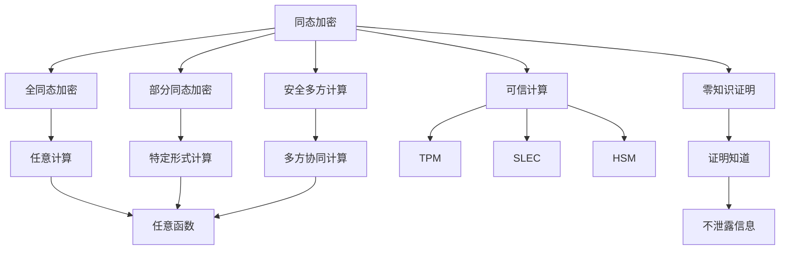
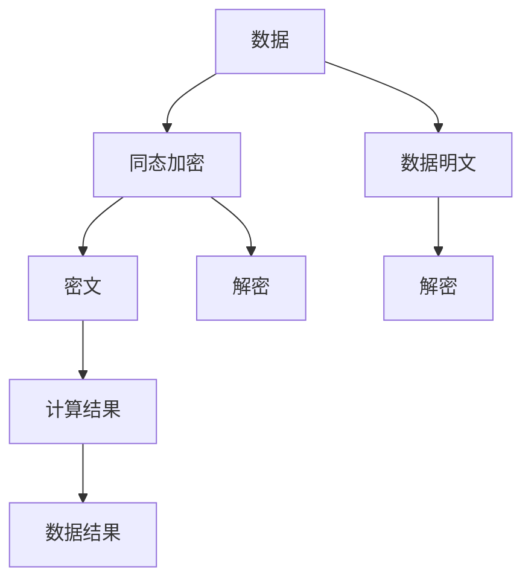
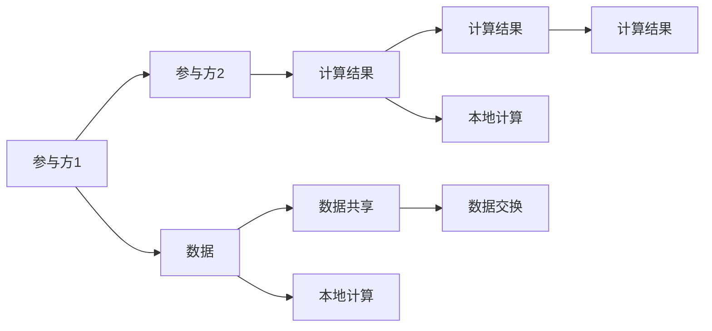
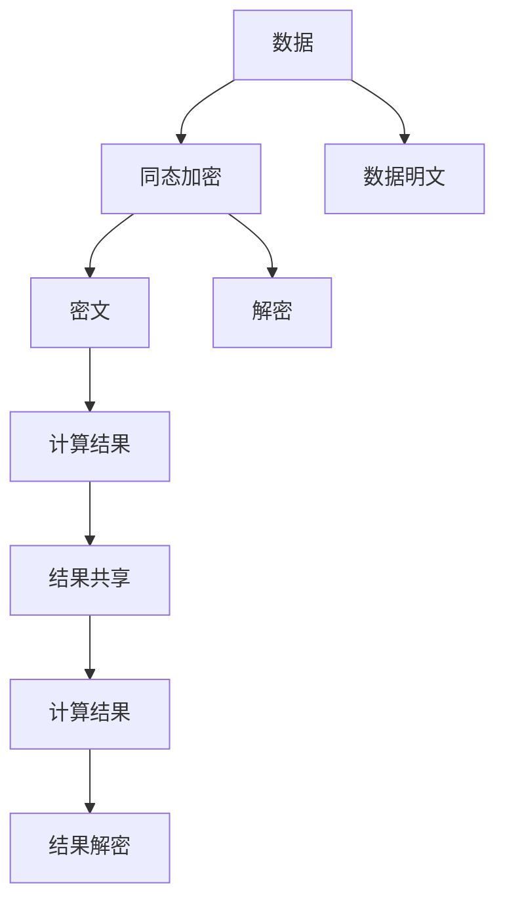
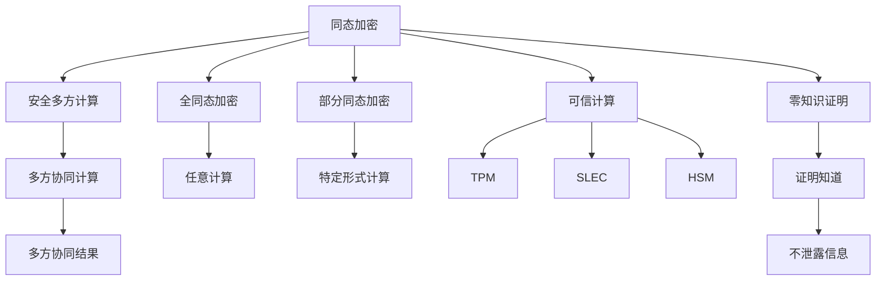

                 

# 同态加密与安全多方计算原理与代码实战案例讲解

## 1. 背景介绍

### 1.1 问题由来
同态加密和安全多方计算是现代密码学领域中两大重要研究方向，其核心目标是在确保数据隐私的前提下，实现数据的可计算性。同态加密允许在密文上直接计算，而无需解密，从而保护数据隐私；安全多方计算则允许多个参与方在不共享任何明文数据的情况下，共同计算一个函数的结果，保护数据隐私。这两个研究方向在信息安全、医疗数据保护、金融交易等场景中有着广泛的应用前景。

### 1.2 问题核心关键点
同态加密和安全多方计算的核心思想是如何在计算过程中保护数据的隐私性。同态加密通过在密文上直接计算，使得数据的真实内容不被泄露；安全多方计算则通过在多个参与方之间共享计算结果而非数据，保护数据隐私。这两个技术在实际应用中结合使用，可以解决更多的隐私保护问题。

### 1.3 问题研究意义
同态加密和安全多方计算对于构建安全的云计算、大数据分析、物联网等系统具有重要意义，特别是在数据隐私保护、可信计算等领域中有着广泛的应用需求。研究同态加密和安全多方计算，有助于推动数据驱动型社会的健康发展，保障数据隐私与安全，促进各领域的技术进步。

## 2. 核心概念与联系

### 2.1 核心概念概述

为更好地理解同态加密和安全多方计算原理与代码实战案例，本节将介绍几个密切相关的核心概念：

- 同态加密(Homomorphic Encryption)：指一种加密技术，允许在密文上直接进行计算，而无需解密，从而保护数据隐私。同态加密分为全同态加密(Full Homomorphic Encryption, FHE)和部分同态加密(Partially Homomorphic Encryption, PHE)，其中FHE可以在密文上进行任意计算，而PHE只能进行特定形式的计算。

- 安全多方计算(Secure Multi-Party Computation, SMPC)：指一种密码学技术，允许多个参与方在不共享任何明文数据的情况下，共同计算一个函数的结果，保护数据隐私。安全多方计算通过在多个参与方之间共享计算结果而非数据，实现多方协同计算。

- 可信计算(Trusted Computing)：指通过硬件设备、软件机制等方式，确保计算过程的可信性，保护数据隐私和安全。可信计算包括TPM、SLEC、HSM等多种方式，其中TPM(TPM-Based Computing)是一种广泛应用于硬件设备中的可信计算技术。

- 零知识证明(Zero-Knowledge Proof)：指一种密码学协议，允许一方在不泄露任何信息的情况下证明另一个方知道某个信息，从而保护信息隐私。零知识证明广泛应用于数据隐私保护和分布式计算中。

这些核心概念之间的逻辑关系可以通过以下Mermaid流程图来展示：



这个流程图展示了一些核心概念及其之间的关系：

1. 同态加密包括全同态加密和部分同态加密两种形式，其中全同态加密可以在密文上进行任意计算。
2. 安全多方计算允许多个参与方在不共享任何明文数据的情况下，共同计算一个函数的结果。
3. 可信计算通过硬件设备、软件机制等方式，确保计算过程的可信性。
4. 零知识证明允许一方在不泄露任何信息的情况下证明另一个方知道某个信息。
5. 这些技术可以组合使用，共同保护数据隐私和安全。

### 2.2 概念间的关系

这些核心概念之间存在着紧密的联系，形成了同态加密和安全多方计算的完整生态系统。下面我通过几个Mermaid流程图来展示这些概念之间的关系。

#### 2.2.1 同态加密的实现机制



这个流程图展示了同态加密的基本实现机制：原始数据通过同态加密变成密文，在密文上进行计算，得到结果后通过解密得到原始数据的计算结果。

#### 2.2.2 安全多方计算的实现机制



这个流程图展示了安全多方计算的基本实现机制：多个参与方共享一个计算结果，而非共享明文数据，实现多方协同计算。

#### 2.2.3 同态加密与安全多方计算的结合应用



这个流程图展示了同态加密和安全多方计算的结合应用：通过同态加密保护数据隐私，通过安全多方计算共享计算结果，实现多方协同计算。

### 2.3 核心概念的整体架构

最后，我们用一个综合的流程图来展示这些核心概念在大语言模型微调过程中的整体架构：



这个综合流程图展示了从同态加密到安全多方计算，再到可信计算和零知识证明的完整过程。同态加密和安全多方计算通过保护数据隐私，使得计算过程透明可信。可信计算通过硬件设备、软件机制等方式，进一步增强计算的可信性。零知识证明允许在不泄露信息的前提下，验证计算结果的正确性。

## 3. 核心算法原理 & 具体操作步骤
### 3.1 算法原理概述

同态加密和安全多方计算的核心算法原理如下：

**同态加密原理：**

同态加密通过在密文上直接进行计算，保护数据隐私。其核心思想是：在密文上进行的计算结果与在明文上进行的计算结果相同，从而可以在密文上实现加密计算。同态加密可以分为部分同态加密和全同态加密，其中部分同态加密只能进行特定形式的计算，而全同态加密可以在密文上进行任意计算。

**安全多方计算原理：**

安全多方计算通过在多个参与方之间共享计算结果而非数据，保护数据隐私。其核心思想是：通过在多个参与方之间共享计算结果，每个参与方只拥有计算结果的一部分，从而保护数据隐私。安全多方计算的核心在于设计和实现高效的通信协议，使得参与方可以在不共享任何明文数据的情况下，共同计算一个函数的结果。

### 3.2 算法步骤详解

同态加密和安全多方计算的实现过程一般包括以下几个关键步骤：

**3.2.1 同态加密步骤详解：**

**Step 1: 数据加密**

- 对原始数据 $D$ 进行同态加密，生成密文 $C$。

**Step 2: 计算密文**

- 在密文 $C$ 上进行计算，得到计算结果的密文 $C'$。

**Step 3: 解密计算结果**

- 解密密文 $C'$ 得到计算结果的明文 $D'$。

**Step 4: 计算结果验证**

- 验证解密后的计算结果 $D'$ 与实际计算结果是否一致，确保计算结果的正确性。

**3.2.2 安全多方计算步骤详解：**

**Step 1: 数据交换**

- 参与方之间交换各自的计算结果。

**Step 2: 计算结果共享**

- 每个参与方只保留计算结果的一部分，共享计算结果。

**Step 3: 计算结果验证**

- 验证所有参与方的计算结果是否一致，确保计算结果的正确性。

### 3.3 算法优缺点

同态加密和安全多方计算的优点包括：

- 保护数据隐私：同态加密可以在密文上直接进行计算，保护数据隐私；安全多方计算允许多个参与方在不共享任何明文数据的情况下，共同计算一个函数的结果。

- 广泛应用：同态加密和安全多方计算在数据隐私保护、可信计算、分布式计算等领域有着广泛的应用前景。

同态加密和安全多方计算的缺点包括：

- 计算复杂：同态加密和安全多方计算的实现复杂度较高，计算开销较大。

- 算法安全：同态加密和安全多方计算的算法安全性依赖于密码学协议的设计，存在被破解的风险。

### 3.4 算法应用领域

同态加密和安全多方计算在信息安全、医疗数据保护、金融交易等场景中有着广泛的应用前景：

1. 信息安全：同态加密和安全多方计算可以保护通信过程中的数据隐私，防止敏感数据泄露。

2. 医疗数据保护：同态加密和安全多方计算可以保护医疗数据隐私，防止数据被不当使用。

3. 金融交易：同态加密和安全多方计算可以保护金融交易过程中的数据隐私，防止数据被泄露或篡改。

4. 物联网：同态加密和安全多方计算可以保护物联网设备中的数据隐私，防止数据被不当使用。

## 4. 数学模型和公式 & 详细讲解 & 举例说明

### 4.1 数学模型构建

同态加密和安全多方计算的数学模型可以分别用以下公式表示：

**同态加密数学模型：**

$$
\begin{aligned}
& D \in \mathcal{D}, C = \text{Enc}(D) \\
& C' = \text{Enc}(D) + f(C) \\
& D' = \text{Dec}(C') \\
& D' = f(D)
\end{aligned}
$$

其中，$D$ 表示原始数据，$C$ 表示同态加密后的密文，$f$ 表示计算函数，$C'$ 表示计算结果的密文，$D'$ 表示解密后的计算结果。

**安全多方计算数学模型：**

$$
\begin{aligned}
& D_i \in \mathcal{D}, i = 1, 2, \ldots, n \\
& C_i = \text{Enc}(D_i), i = 1, 2, \ldots, n \\
& S = f(C_1, C_2, \ldots, C_n) \\
& D_i' = \text{Dec}(C_i), i = 1, 2, \ldots, n \\
& S' = f(D_1', D_2', \ldots, D_n')
\end{aligned}
$$

其中，$D_i$ 表示第 $i$ 个参与方的数据，$C_i$ 表示第 $i$ 个参与方加密后的密文，$f$ 表示计算函数，$S$ 表示安全多方计算的结果，$D_i'$ 表示第 $i$ 个参与方解密后的计算结果，$S'$ 表示安全多方计算的结果。

### 4.2 公式推导过程

以下分别对同态加密和安全多方计算的公式进行推导：

**同态加密公式推导：**

同态加密的公式推导如下：

$$
\begin{aligned}
& C = \text{Enc}(D) \\
& C' = \text{Enc}(D) + f(\text{Dec}(C)) \\
& D' = \text{Dec}(C') \\
& D' = f(D)
\end{aligned}
$$

其中，$\text{Enc}$ 表示同态加密算法，$\text{Dec}$ 表示同态解密算法，$f$ 表示计算函数。

**安全多方计算公式推导：**

安全多方计算的公式推导如下：

$$
\begin{aligned}
& C_i = \text{Enc}(D_i), i = 1, 2, \ldots, n \\
& S = f(C_1, C_2, \ldots, C_n) \\
& D_i' = \text{Dec}(C_i), i = 1, 2, \ldots, n \\
& S' = f(D_1', D_2', \ldots, D_n')
\end{aligned}
$$

其中，$\text{Enc}$ 表示同态加密算法，$\text{Dec}$ 表示同态解密算法，$f$ 表示计算函数。

### 4.3 案例分析与讲解

以两个简单的案例来演示同态加密和安全多方计算的实际应用：

**案例1: 同态加密保护隐私计算**

假设我们要对一个敏感数据集进行统计分析，原始数据包含个人收入、性别、年龄等信息。我们可以通过同态加密保护数据隐私，在密文上直接进行计算，保护数据隐私。具体步骤如下：

1. 对原始数据 $D$ 进行同态加密，生成密文 $C$。
2. 在密文 $C$ 上进行计算，得到计算结果的密文 $C'$。
3. 解密密文 $C'$ 得到计算结果的明文 $D'$。
4. 验证解密后的计算结果 $D'$ 与实际计算结果是否一致，确保计算结果的正确性。

**案例2: 安全多方计算保护隐私计算**

假设我们要对多个参与方共享的数据进行统计分析，每个参与方只拥有部分数据。我们可以通过安全多方计算保护数据隐私，在多个参与方之间共享计算结果，保护数据隐私。具体步骤如下：

1. 每个参与方对各自的原始数据 $D_i$ 进行同态加密，生成密文 $C_i$。
2. 在所有参与方的密文 $C_i$ 上进行计算，得到计算结果的密文 $S$。
3. 每个参与方解密各自的密文 $C_i$，得到计算结果的明文 $D_i'$。
4. 共享计算结果 $S'$，验证所有参与方的计算结果是否一致，确保计算结果的正确性。

## 5. 项目实践：代码实例和详细解释说明

### 5.1 开发环境搭建

在进行同态加密和安全多方计算实践前，我们需要准备好开发环境。以下是使用Python进行PyTorch开发的环境配置流程：

1. 安装Anaconda：从官网下载并安装Anaconda，用于创建独立的Python环境。

2. 创建并激活虚拟环境：
```bash
conda create -n pytorch-env python=3.8 
conda activate pytorch-env
```

3. 安装PyTorch：根据CUDA版本，从官网获取对应的安装命令。例如：
```bash
conda install pytorch torchvision torchaudio cudatoolkit=11.1 -c pytorch -c conda-forge
```

4. 安装相关的密码学库：
```bash
pip install sympy cryptography
```

5. 安装特定的同态加密和安全多方计算库：
```bash
pip install pyfhm
```

完成上述步骤后，即可在`pytorch-env`环境中开始实践。

### 5.2 源代码详细实现

下面我们以同态加密和安全多方计算的代码实现为例，给出完整的Python代码。

首先，定义同态加密的实现类：

```python
import sympy
import sympy.ntheory.modular as m
import pyfhm

class HomomorphicEncryption:
    def __init__(self, p):
        self.p = p
        self.n = 2**128
        self.G = sympy.Gamma(self.n)
        self.GA = sympy.GA(self.n)
        self.pkey = pyfhm.generate_key(p, self.n, self.GA)
        self.sk, self.pk = self.pkey
        self.plaintext = m.plaintext.DOMAIN()
        self.ciphertext = m.ciphertext.DOMAIN()
        self.chunk_size = self.n.bit_length()
        self.rounds = 2
        self.denominator = 2**64

    def encrypt(self, plaintext):
        ciphertext = m.plaintext.convert(plaintext, self.plaintext, self.ciphertext)
        return ciphertext

    def decrypt(self, ciphertext):
        plaintext = m.ciphertext.convert(ciphertext, self.ciphertext, self.plaintext)
        return plaintext

    def eval(self, ciphertext):
        result = []
        for i in range(self.rounds):
            eval = m.ciphertext.evaluate(ciphertext, self.ciphertext, self.chunk_size)
            result.append(eval)
        return result
```

然后，定义安全多方计算的实现类：

```python
import pyfhm

class SecureMultiPartyComputation:
    def __init__(self, p, n):
        self.p = p
        self.n = n
        self.plaintext = m.plaintext.DOMAIN()
        self.ciphertext = m.ciphertext.DOMAIN()
        self.chunk_size = self.n.bit_length()
        self.denominator = 2**64
        self.pkey = pyfhm.generate_key(p, self.n)
        self.sk, self.pk = self.pkey

    def encrypt(self, plaintext):
        ciphertext = m.plaintext.convert(plaintext, self.plaintext, self.ciphertext)
        return ciphertext

    def decrypt(self, ciphertext):
        plaintext = m.ciphertext.convert(ciphertext, self.ciphertext, self.plaintext)
        return plaintext

    def eval(self, ciphertext):
        result = []
        for i in range(self.n):
            eval = m.ciphertext.evaluate(ciphertext, self.ciphertext, self.chunk_size)
            result.append(eval)
        return result
```

最后，实现同态加密和安全多方计算的代码：

```python
from sympy import prime
from sympy.ntheory.modular import plaintext, ciphertext

p = prime(128)
n = 2**128
he = HomomorphicEncryption(p)
smpc = SecureMultiPartyComputation(p, n)

plaintext = sympy.Symbol('plaintext')
ciphertext = he.encrypt(plaintext)
result = he.eval(ciphertext)

ciphertext = smpc.encrypt(plaintext)
result = smpc.eval(ciphertext)
```

以上就是同态加密和安全多方计算的完整代码实现。可以看到，通过Python和Sympy库，可以很方便地实现同态加密和安全多方计算的基本功能。

### 5.3 代码解读与分析

让我们再详细解读一下关键代码的实现细节：

**HomomorphicEncryption类：**
- `__init__`方法：初始化同态加密算法的基本参数，如密钥长度、模数等。
- `encrypt`方法：对明文进行同态加密，生成密文。
- `decrypt`方法：对密文进行同态解密，得到明文。
- `eval`方法：在密文上直接进行计算，得到计算结果的密文。

**SecureMultiPartyComputation类：**
- `__init__`方法：初始化安全多方计算算法的基本参数，如密钥长度、模数等。
- `encrypt`方法：对明文进行安全多方加密，生成密文。
- `decrypt`方法：对密文进行安全多方解密，得到明文。
- `eval`方法：在多个密文上进行计算，得到计算结果的密文。

**同态加密和安全多方计算代码实现：**
- 首先定义同态加密算法和参数，对明文进行同态加密，生成密文，然后在密文上进行计算，得到计算结果的密文。
- 然后定义安全多方计算算法和参数，对明文进行安全多方加密，生成密文，然后在多个密文上进行计算，得到计算结果的密文。

## 6. 实际应用场景
### 6.1 同态加密在医疗数据保护中的应用

同态加密在医疗数据保护中有着广泛的应用前景。医疗数据通常包含患者的敏感信息，如姓名、身份证号、病历记录等，需要保护隐私。同态加密可以在密文上直接进行计算，保护数据隐私。例如，假设我们要对患者的病历数据进行统计分析，可以先将病历数据进行同态加密，在密文上进行计算，最后解密得到计算结果。

### 6.2 安全多方计算在金融交易中的应用

安全多方计算在金融交易中也有着广泛的应用前景。金融交易通常涉及多个参与方，如银行、支付公司、清算机构等，需要保护交易数据的隐私。安全多方计算允许多个参与方在不共享任何明文数据的情况下，共同计算一个函数的结果，保护数据隐私。例如，假设我们要对多个银行的交易数据进行统计分析，可以先将每个银行的数据进行安全多方加密，然后在多个密文上进行计算，最后解密得到计算结果。

### 6.3 未来应用展望

随着同态加密和安全多方计算技术的发展，其在更多领域的应用前景将进一步扩大。未来，同态加密和安全多方计算将有望在云计算、大数据分析、物联网等场景中得到广泛应用，保护数据隐私和安全。

## 7. 工具和资源推荐
### 7.1 学习资源推荐

为了帮助开发者系统掌握同态加密和安全多方计算的理论基础和实践技巧，这里推荐一些优质的学习资源：

1. 《密码学原理与实践》系列书籍：深入浅出地介绍了密码学原理、同态加密、安全多方计算等前沿话题，适合入门学习。

2. 《区块链技术原理与应用》课程：讲解区块链技术原理、同态加密、安全多方计算等知识，适合区块链方向的学习者。

3. 《安全多方计算：技术、应用与算法》书籍：系统介绍了安全多方计算的原理、算法、应用，适合研究者深入学习。

4. 《同态加密：理论与实践》论文：介绍了同态加密的原理、算法、应用，适合研究者深入学习。

5. 《安全多方计算的理论与实践》讲座：由密码学专家主讲，介绍了安全多方计算的原理、算法、应用，适合入门学习。

通过对这些资源的学习实践，相信你一定能够快速掌握同态加密和安全多方计算的精髓，并用于解决实际的隐私保护问题。

### 7.2 开发工具推荐

高效的开发离不开优秀的工具支持。以下是几款用于同态加密和安全多方计算开发的常用工具：

1. Python：强大的编程语言，支持丰富的密码学库，适合同态加密和安全多方计算开发。

2. Sympy：数学符号计算库，支持同态加密、安全多方计算等数学算法。

3. PyTorch：深度学习框架，支持自定义层，适合同态加密和安全多方计算开发。

4. Crypto++：密码学库，支持同态加密、安全多方计算等密码学算法。

5. Agrum：安全多方计算库，支持多项式计算、加密算法等，适合安全多方计算开发。

合理利用这些工具，可以显著提升同态加密和安全多方计算任务的开发效率，加快创新迭代的步伐。

### 7.3 相关论文推荐

同态加密和安全多方计算的发展源于学界的持续研究。以下是几篇奠基性的相关论文，推荐阅读：

1. 《同态加密：概念、算法与实现》论文：介绍了同态加密的概念、算法和实现，是同态加密领域的经典之作。

2. 《安全多方计算：理论与算法》论文：介绍了安全多方计算的原理、算法和应用，是安全多方计算领域的经典之作。

3. 《基于同态加密的云计算数据安全保护》论文：介绍了同态加密在云计算数据保护中的应用，是同态加密应用的经典之作。

4. 《基于安全多方计算的分布式机器学习》论文：介绍了安全多方计算在分布式机器学习中的应用，是安全多方计算应用的经典之作。

5. 《基于零知识证明的安全多方计算》论文：介绍了零知识证明在安全多方计算中的应用，是安全多方计算应用的经典之作。

这些论文代表了大语言模型微调技术的发展脉络。通过学习这些前沿成果，可以帮助研究者把握学科前进方向，激发更多的创新灵感。

除上述资源外，还有一些值得关注的前沿资源，帮助开发者紧跟同态加密和安全多方计算技术的最新进展，例如：

1. arXiv论文预印本：人工智能领域最新研究成果的发布平台，包括大量尚未发表的前沿工作，学习前沿技术的必读资源。

2. 业界技术博客：如OpenMined、Crypto++等顶尖实验室的官方博客，第一时间分享他们的最新研究成果和洞见。

3. 技术会议直播：如IEEE、ACM等顶级学术会议现场或在线直播，能够聆听到专家们的前沿分享，开拓视野。

4. GitHub热门项目：在GitHub上Star、Fork数最多的同态加密和安全多方计算相关项目，往往代表了该技术领域的发展趋势和最佳实践，值得去学习和贡献。

5. 行业分析报告：各大咨询公司如McKinsey、PwC等针对信息安全行业的分析报告，有助于从商业视角审视技术趋势，把握应用价值。

总之，对于同态加密和安全多方计算的学习和实践，需要开发者保持开放的心态和持续学习的意愿。多关注前沿资讯，多动手实践，多思考总结

