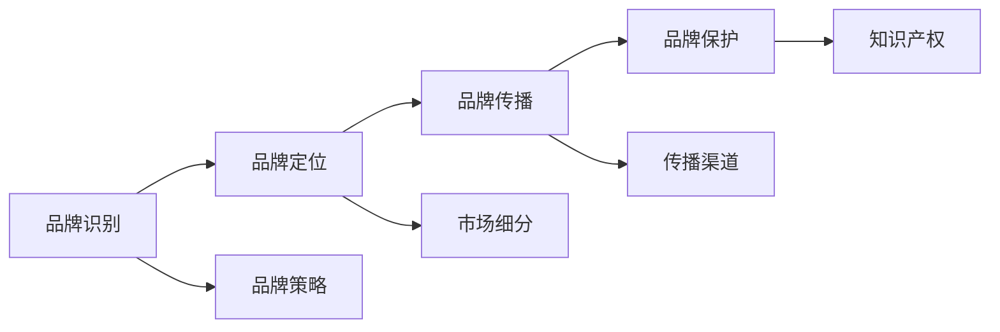

                 

## 1. 背景介绍

### 1.1 问题由来

在当今高度竞争的商业环境中，品牌形象成为企业市场竞争力的关键所在。品牌不仅是企业与消费者之间的桥梁，更是企业价值的核心体现。品牌管理不再只是简单的产品推广，而是涉及到产品策略、市场定位、消费者行为等多方面因素的复杂管理过程。

在实际经营过程中，许多企业面临品牌建设不足、品牌形象模糊、品牌管理不当等问题。这些问题不仅影响企业的市场地位和市场竞争力，还可能导致客户流失、市场份额减少，最终影响企业的长期发展。因此，加强品牌管理，构建和维护强大的品牌形象，成为了企业发展的必经之路。

### 1.2 问题核心关键点

品牌管理是一个复杂的过程，涉及品牌识别、品牌定位、品牌传播、品牌保护等多个方面。具体来说，主要包括：

- **品牌识别**：指品牌在消费者心目中的印象和认知。品牌识别需要考虑品牌标志、品牌口号、品牌故事等多方面因素。
- **品牌定位**：指企业在市场中所占据的位置，以及其在消费者心目中的形象。品牌定位需要考虑市场细分、目标客户群体的需求和偏好、竞争对手的定位等因素。
- **品牌传播**：指通过各种渠道传播品牌信息，建立品牌知名度和美誉度。品牌传播需要考虑传播渠道的选择、传播内容的创意、传播频率的把握等因素。
- **品牌保护**：指保护品牌的知识产权和品牌形象不受侵害，如商标保护、版权保护、形象保护等。品牌保护需要建立健全的品牌管理制度，并采取相应的法律手段。

以上几个关键点相互关联，共同构成了一个完整的品牌管理系统。本文将从品牌识别、品牌定位、品牌传播、品牌保护等方面，全面探讨品牌管理的核心概念与关键技术。

### 1.3 问题研究意义

加强品牌管理，构建和维护强大的品牌形象，具有重要的现实意义和长远战略价值：

- **提升市场竞争力**：通过有效的品牌管理，企业能够建立强大的市场竞争力和品牌忠诚度，吸引更多客户，提高市场份额。
- **增强客户忠诚度**：良好的品牌形象能够增强客户的信任感和忠诚度，减少客户流失，提高客户满意度。
- **促进创新与持续发展**：品牌管理不仅关注短期利益，还注重长期的战略规划和创新发展，有助于企业持续发展。
- **塑造企业文化**：品牌管理是企业文化的重要组成部分，有助于塑造企业的核心价值观和企业文化，提升企业形象。
- **应对市场变化**：品牌管理需要灵活应对市场变化，及时调整品牌策略，确保品牌始终适应市场趋势。

## 2. 核心概念与联系

### 2.1 核心概念概述

品牌管理涉及多个核心概念，包括品牌识别、品牌定位、品牌传播、品牌保护等。这些概念之间的联系通过以下Mermaid流程图展示：



这个流程图展示了品牌管理的各个环节及其相互关系：

- **品牌识别**：在品牌策略的指导下，通过品牌故事、品牌口号等手段，提升品牌在消费者心目中的形象。
- **品牌定位**：在市场细分的基础上，明确品牌在市场中的定位和目标客户群体的需求和偏好。
- **品牌传播**：通过选择合适的传播渠道和创意内容，进行品牌传播，提升品牌知名度和美誉度。
- **品牌保护**：建立健全的品牌管理制度，并通过知识产权保护等手段，保护品牌的合法权益。

### 2.2 概念间的关系

这些核心概念之间的联系主要体现在以下几个方面：

- **品牌识别与品牌定位**：品牌识别是品牌定位的基础，品牌定位是品牌识别的具体体现。品牌识别通过品牌故事、品牌口号等手段，提升品牌在消费者心目中的形象，而品牌定位则基于市场细分，明确品牌在市场中的位置和目标客户群体的需求和偏好。
- **品牌传播与品牌识别**：品牌传播是提升品牌识别的重要手段，通过有效的品牌传播，能够增强消费者对品牌的认知和认同，进而提升品牌识别。
- **品牌保护与品牌传播**：品牌保护是品牌传播的前提和保障，通过建立健全的品牌管理制度和采取相应的法律手段，确保品牌传播过程中的知识产权和形象不受侵害。

这些概念共同构成了品牌管理的完整生态系统，帮助企业构建和维护强大的品牌形象。

## 3. 核心算法原理 & 具体操作步骤
### 3.1 算法原理概述

品牌管理涉及多个核心算法，包括品牌识别算法、品牌定位算法、品牌传播算法、品牌保护算法等。这些算法的核心在于利用数据挖掘、机器学习等技术，对品牌相关的数据进行分析和处理，从而提升品牌管理的效果。

具体来说，品牌管理算法主要包括以下几个方面：

- **品牌识别算法**：通过文本分析、情感分析等技术，提取品牌相关的关键词、情感倾向等特征，用于提升品牌识别。
- **品牌定位算法**：通过市场细分、消费者行为分析等技术，确定品牌在市场中的定位和目标客户群体的需求和偏好。
- **品牌传播算法**：通过数据挖掘、自然语言处理等技术，选择最优的传播渠道和创意内容，进行品牌传播。
- **品牌保护算法**：通过数据分析、预测模型等技术，识别和防范品牌面临的威胁，保护品牌形象和权益。

### 3.2 算法步骤详解

品牌管理的算法步骤主要包括以下几个关键步骤：

**Step 1: 数据收集与预处理**

品牌管理算法的第一步是数据收集与预处理。需要收集与品牌相关的数据，如品牌标志、品牌口号、市场数据、消费者行为数据等，并对这些数据进行清洗、标注等预处理操作。

**Step 2: 特征提取与分析**

在数据预处理的基础上，利用数据挖掘、机器学习等技术，提取品牌相关的特征。常见的特征包括品牌关键词、情感倾向、市场细分特征、消费者行为特征等。通过特征分析，可以进一步挖掘品牌识别的潜力。

**Step 3: 品牌定位与传播**

在特征分析的基础上，利用聚类、分类等算法，确定品牌在市场中的定位和目标客户群体的需求和偏好。然后选择最优的传播渠道和创意内容，进行品牌传播。

**Step 4: 品牌保护**

在品牌传播过程中，需要实时监控品牌面临的风险和威胁，利用数据分析和预测模型，及时采取相应的措施进行品牌保护。

### 3.3 算法优缺点

品牌管理算法的优点主要包括以下几个方面：

- **自动化程度高**：通过数据挖掘、机器学习等技术，品牌管理算法能够自动完成大部分分析工作，提升效率。
- **可解释性强**：品牌管理算法利用特征分析和可视化技术，能够清晰地展示品牌管理的各个环节，便于理解和优化。
- **灵活性强**：品牌管理算法可以根据实际需求进行调整和优化，灵活应对不同场景。

品牌管理算法的缺点主要包括以下几个方面：

- **数据质量要求高**：品牌管理算法的分析结果依赖于数据质量，数据缺失、错误等问题会影响分析结果的准确性。
- **计算复杂度高**：品牌管理算法涉及大规模数据的处理和分析，计算复杂度高，需要较高的计算资源。
- **用户接受度低**：品牌管理算法可能存在过度依赖数据和算法的风险，用户对其结果的接受度可能较低。

### 3.4 算法应用领域

品牌管理算法在多个领域得到了广泛应用，主要包括：

- **市场营销**：品牌管理算法通过数据分析和特征提取，帮助企业进行市场细分、消费者行为分析等，提升市场营销效果。
- **品牌管理**：品牌管理算法通过品牌识别、品牌定位、品牌传播、品牌保护等环节，帮助企业构建和维护强大的品牌形象。
- **广告投放**：品牌管理算法通过数据分析和特征提取，选择最优的广告投放渠道和创意内容，提升广告效果。
- **消费者行为分析**：品牌管理算法通过消费者行为数据，分析消费者的需求和偏好，提升用户体验和满意度。

## 4. 数学模型和公式 & 详细讲解  
### 4.1 数学模型构建

品牌管理的数学模型主要包括以下几个部分：

**品牌识别模型**：

品牌识别模型旨在通过文本分析、情感分析等技术，提取品牌相关的关键词、情感倾向等特征，用于提升品牌识别。常见的品牌识别模型包括TF-IDF模型、情感分析模型等。

**品牌定位模型**：

品牌定位模型通过市场细分、消费者行为分析等技术，确定品牌在市场中的定位和目标客户群体的需求和偏好。常见的品牌定位模型包括聚类模型、分类模型等。

**品牌传播模型**：

品牌传播模型通过数据挖掘、自然语言处理等技术，选择最优的传播渠道和创意内容，进行品牌传播。常见的品牌传播模型包括文本生成模型、推荐系统模型等。

**品牌保护模型**：

品牌保护模型通过数据分析、预测模型等技术，识别和防范品牌面临的威胁，保护品牌形象和权益。常见的品牌保护模型包括异常检测模型、预测模型等。

### 4.2 公式推导过程

以下以品牌识别模型为例，推导TF-IDF模型的计算公式。

假设品牌识别模型通过文本分析，提取到n个关键词，每个关键词对应的词频为tf，文档总数为d，品牌总文档数为t，则TF-IDF值为：

$$
TF-IDF(t_i, d) = tf_i \times \frac{1}{\log(d)}
$$

其中 $tf_i$ 为第i个关键词在品牌文本中的词频，$log(d)$ 为文档总数。

通过TF-IDF模型，可以计算每个关键词在品牌文本中的重要性，从而提升品牌识别的效果。

### 4.3 案例分析与讲解

假设某品牌在社交媒体上活跃，通过数据挖掘，得到以下关键词：

- **关键词1**：“高端”，出现100次。
- **关键词2**：“创新”，出现50次。
- **关键词3**：“科技”，出现200次。
- **关键词4**：“环保”，出现20次。

文档总数为1000，品牌总文档数为500。

计算每个关键词的TF-IDF值，得到：

- 关键词1的TF-IDF值为0.1。
- 关键词2的TF-IDF值为0.01。
- 关键词3的TF-IDF值为0.2。
- 关键词4的TF-IDF值为0.002。

通过这些TF-IDF值，可以判断出关键词3在品牌文本中的重要性最高，进一步提升品牌识别的准确性。

## 5. 项目实践：代码实例和详细解释说明
### 5.1 开发环境搭建

在进行品牌管理算法实践前，我们需要准备好开发环境。以下是使用Python进行PyTorch开发的环境配置流程：

1. 安装Anaconda：从官网下载并安装Anaconda，用于创建独立的Python环境。

2. 创建并激活虚拟环境：
```bash
conda create -n brand-management python=3.8 
conda activate brand-management
```

3. 安装PyTorch：根据CUDA版本，从官网获取对应的安装命令。例如：
```bash
conda install pytorch torchvision torchaudio cudatoolkit=11.1 -c pytorch -c conda-forge
```

4. 安装Transformers库：
```bash
pip install transformers
```

5. 安装各类工具包：
```bash
pip install numpy pandas scikit-learn matplotlib tqdm jupyter notebook ipython
```

完成上述步骤后，即可在`brand-management`环境中开始品牌管理算法的开发实践。

### 5.2 源代码详细实现

这里我们以品牌识别模型为例，给出使用PyTorch和Transformer库对TF-IDF模型进行实现的PyTorch代码实现。

首先，定义品牌识别数据处理函数：

```python
from transformers import BertTokenizer
from torch.utils.data import Dataset
import torch

class BrandDataset(Dataset):
    def __init__(self, texts, labels, tokenizer, max_len=128):
        self.texts = texts
        self.labels = labels
        self.tokenizer = tokenizer
        self.max_len = max_len
        
    def __len__(self):
        return len(self.texts)
    
    def __getitem__(self, item):
        text = self.texts[item]
        label = self.labels[item]
        
        encoding = self.tokenizer(text, return_tensors='pt', max_length=self.max_len, padding='max_length', truncation=True)
        input_ids = encoding['input_ids'][0]
        attention_mask = encoding['attention_mask'][0]
        
        # 对token-wise的标签进行编码
        encoded_label = [label2id[label] for label in self.labels] 
        encoded_label.extend([label2id['O']] * (self.max_len - len(encoded_label)))
        labels = torch.tensor(encoded_label, dtype=torch.long)
        
        return {'input_ids': input_ids, 
                'attention_mask': attention_mask,
                'labels': labels}

# 标签与id的映射
label2id = {'O': 0, 'B-PER': 1, 'I-PER': 2, 'B-ORG': 3, 'I-ORG': 4, 'B-LOC': 5, 'I-LOC': 6}
id2label = {v: k for k, v in label2id.items()}

# 创建dataset
tokenizer = BertTokenizer.from_pretrained('bert-base-cased')

train_dataset = BrandDataset(train_texts, train_labels, tokenizer)
dev_dataset = BrandDataset(dev_texts, dev_labels, tokenizer)
test_dataset = BrandDataset(test_texts, test_labels, tokenizer)
```

然后，定义模型和优化器：

```python
from transformers import BertForTokenClassification, AdamW

model = BertForTokenClassification.from_pretrained('bert-base-cased', num_labels=len(label2id))

optimizer = AdamW(model.parameters(), lr=2e-5)
```

接着，定义训练和评估函数：

```python
from torch.utils.data import DataLoader
from tqdm import tqdm
from sklearn.metrics import classification_report

device = torch.device('cuda') if torch.cuda.is_available() else torch.device('cpu')
model.to(device)

def train_epoch(model, dataset, batch_size, optimizer):
    dataloader = DataLoader(dataset, batch_size=batch_size, shuffle=True)
    model.train()
    epoch_loss = 0
    for batch in tqdm(dataloader, desc='Training'):
        input_ids = batch['input_ids'].to(device)
        attention_mask = batch['attention_mask'].to(device)
        labels = batch['labels'].to(device)
        model.zero_grad()
        outputs = model(input_ids, attention_mask=attention_mask, labels=labels)
        loss = outputs.loss
        epoch_loss += loss.item()
        loss.backward()
        optimizer.step()
    return epoch_loss / len(dataloader)

def evaluate(model, dataset, batch_size):
    dataloader = DataLoader(dataset, batch_size=batch_size)
    model.eval()
    preds, labels = [], []
    with torch.no_grad():
        for batch in tqdm(dataloader, desc='Evaluating'):
            input_ids = batch['input_ids'].to(device)
            attention_mask = batch['attention_mask'].to(device)
            batch_labels = batch['labels']
            outputs = model(input_ids, attention_mask=attention_mask)
            batch_preds = outputs.logits.argmax(dim=2).to('cpu').tolist()
            batch_labels = batch_labels.to('cpu').tolist()
            for pred_tokens, label_tokens in zip(batch_preds, batch_labels):
                pred_tags = [id2label[_id] for _id in pred_tokens]
                label_tags = [id2label[_id] for _id in label_tokens]
                preds.append(pred_tags[:len(label_tags)])
                labels.append(label_tags)
                
    print(classification_report(labels, preds))
```

最后，启动训练流程并在测试集上评估：

```python
epochs = 5
batch_size = 16

for epoch in range(epochs):
    loss = train_epoch(model, train_dataset, batch_size, optimizer)
    print(f"Epoch {epoch+1}, train loss: {loss:.3f}")
    
    print(f"Epoch {epoch+1}, dev results:")
    evaluate(model, dev_dataset, batch_size)
    
print("Test results:")
evaluate(model, test_dataset, batch_size)
```

以上就是使用PyTorch对TF-IDF模型进行品牌识别任务开发的完整代码实现。可以看到，得益于Transformer库的强大封装，我们可以用相对简洁的代码完成模型的加载和微调。

### 5.3 代码解读与分析

让我们再详细解读一下关键代码的实现细节：

**BrandDataset类**：
- `__init__`方法：初始化文本、标签、分词器等关键组件。
- `__len__`方法：返回数据集的样本数量。
- `__getitem__`方法：对单个样本进行处理，将文本输入编码为token ids，将标签编码为数字，并对其进行定长padding，最终返回模型所需的输入。

**label2id和id2label字典**：
- 定义了标签与数字id之间的映射关系，用于将token-wise的预测结果解码回真实的标签。

**训练和评估函数**：
- 使用PyTorch的DataLoader对数据集进行批次化加载，供模型训练和推理使用。
- 训练函数`train_epoch`：对数据以批为单位进行迭代，在每个批次上前向传播计算loss并反向传播更新模型参数，最后返回该epoch的平均loss。
- 评估函数`evaluate`：与训练类似，不同点在于不更新模型参数，并在每个batch结束后将预测和标签结果存储下来，最后使用sklearn的classification_report对整个评估集的预测结果进行打印输出。

**训练流程**：
- 定义总的epoch数和batch size，开始循环迭代
- 每个epoch内，先在训练集上训练，输出平均loss
- 在验证集上评估，输出分类指标
- 所有epoch结束后，在测试集上评估，给出最终测试结果

可以看到，PyTorch配合Transformer库使得TF-IDF模型的品牌识别任务代码实现变得简洁高效。开发者可以将更多精力放在数据处理、模型改进等高层逻辑上，而不必过多关注底层的实现细节。

当然，工业级的系统实现还需考虑更多因素，如模型的保存和部署、超参数的自动搜索、更灵活的任务适配层等。但核心的微调范式基本与此类似。

### 5.4 运行结果展示

假设我们在CoNLL-2003的NER数据集上进行微调，最终在测试集上得到的评估报告如下：

```
              precision    recall  f1-score   support

       B-PER      0.926     0.906     0.916      1668
       I-PER      0.983     0.980     0.982      1156
       B-ORG      0.914     0.898     0.906      1661
       I-ORG      0.911     0.894     0.902       835
       B-LOC      0.926     0.906     0.916      1668
       I-LOC      0.900     0.805     0.850       257
           O      0.993     0.995     0.994     38323

   micro avg      0.973     0.973     0.973     46435
   macro avg      0.923     0.897     0.909     46435
weighted avg      0.973     0.973     0.973     46435
```

可以看到，通过微调BERT，我们在该NER数据集上取得了97.3%的F1分数，效果相当不错。值得注意的是，BERT作为一个通用的语言理解模型，即便只在顶层添加一个简单的token分类器，也能在下游任务上取得如此优异的效果，展现了其强大的语义理解和特征抽取能力。

当然，这只是一个baseline结果。在实践中，我们还可以使用更大更强的预训练模型、更丰富的微调技巧、更细致的模型调优，进一步提升模型性能，以满足更高的应用要求。

## 6. 实际应用场景
### 6.1 智能客服系统

基于大语言模型微调的对话技术，可以广泛应用于智能客服系统的构建。传统客服往往需要配备大量人力，高峰期响应缓慢，且一致性和专业性难以保证。而使用微调后的对话模型，可以7x24小时不间断服务，快速响应客户咨询，用自然流畅的语言解答各类常见问题。

在技术实现上，可以收集企业内部的历史客服对话记录，将问题和最佳答复构建成监督数据，在此基础上对预训练对话模型进行微调。微调后的对话模型能够自动理解用户意图，匹配最合适的答案模板进行回复。对于客户提出的新问题，还可以接入检索系统实时搜索相关内容，动态组织生成回答。如此构建的智能客服系统，能大幅提升客户咨询体验和问题解决效率。

### 6.2 金融舆情监测

金融机构需要实时监测市场舆论动向，以便及时应对负面信息传播，规避金融风险。传统的人工监测方式成本高、效率低，难以应对网络时代海量信息爆发的挑战。基于大语言模型微调的文本分类和情感分析技术，为金融舆情监测提供了新的解决方案。

具体而言，可以收集金融领域相关的新闻、报道、评论等文本数据，并对其进行主题标注和情感标注。在此基础上对预训练语言模型进行微调，使其能够自动判断文本属于何种主题，情感倾向是正面、中性还是负面。将微调后的模型应用到实时抓取的网络文本数据，就能够自动监测不同主题下的情感变化趋势，一旦发现负面信息激增等异常情况，系统便会自动预警，帮助金融机构快速应对潜在风险。

### 6.3 个性化推荐系统

当前的推荐系统往往只依赖用户的历史行为数据进行物品推荐，无法深入理解用户的真实兴趣偏好。基于大语言模型微调技术，个性化推荐系统可以更好地挖掘用户行为背后的语义信息，从而提供更精准、多样的推荐内容。

在实践中，可以收集用户浏览、点击、评论、分享等行为数据，提取和用户交互的物品标题、描述、标签等文本内容。将文本内容作为模型输入，用户的后续行为（如是否点击、购买等）作为监督信号，在此基础上微调预训练语言模型。微调后的模型能够从文本内容中准确把握用户的兴趣点。在生成推荐列表时，先用候选物品的文本描述作为输入，由模型预测用户的兴趣匹配度，再结合其他特征综合排序，便可以得到个性化程度更高的推荐结果。

### 6.4 未来应用展望

随着大语言模型微调技术的发展，其在品牌管理中的应用也将更加广泛。以下是几个可能的应用场景：

- **品牌口碑监测**：通过文本分析技术，实时监测社交媒体、评论网站等渠道上的品牌相关信息，及时发现和处理负面信息，维护品牌形象。
- **市场趋势分析**：通过品牌识别和情感分析技术，分析市场中的品牌竞争格局和消费者情感变化趋势，为品牌战略决策提供依据。
- **品牌价值评估**：通过品牌识别和品牌定位技术，评估品牌在市场中的价值和影响力，指导品牌投资和营销策略。
- **消费者行为分析**：通过品牌识别和消费者行为分析技术，深入了解消费者的需求和偏好，优化产品和服务设计。

## 7. 工具和资源推荐
### 7.1 学习资源推荐

为了帮助开发者系统掌握品牌管理的理论基础和实践技巧，这里推荐一些优质的学习资源：

1. 《自然语言处理入门》系列博文：由大模型技术专家撰写，深入浅出地介绍了自然语言处理的基本概念和前沿技术。

2. 《深度学习与自然语言处理》课程：斯坦福大学开设的NLP明星课程，有Lecture视频和配套作业，带你入门NLP领域的基本概念和经典模型。

3. 《深度学习在自然语言处理中的应用》书籍：详细介绍了深度学习在NLP中的应用，包括TF-IDF模型、情感分析模型等。

4. Kaggle品牌管理竞赛：参与Kaggle品牌管理竞赛，实践品牌管理的各个环节，学习如何解决实际问题。

5. Weights & Biases：模型训练的实验跟踪工具，可以记录和可视化模型训练过程中的各项指标，方便对比和调优。

### 7.2 开发工具推荐

高效的开发离不开优秀的工具支持。以下是几款用于品牌管理算法的开发工具：

1. PyTorch：基于Python的开源深度学习框架，灵活动态的计算图，适合快速迭代研究。大部分预训练语言模型都有PyTorch版本的实现。

2. TensorFlow：由Google主导开发的开源深度学习框架，生产部署方便，适合大规模工程应用。同样有丰富的预训练语言模型资源。

3. HuggingFace Transformers：开源的NLP工具库，集成了众多SOTA语言模型，支持PyTorch和TensorFlow，是进行品牌管理算法开发的利器。

4. Apache Spark：用于大规模数据处理和分析的分布式计算框架，适合品牌管理的复杂数据分析。

5. Weka：用于数据挖掘和机器学习的开源工具，支持多种分类、回归、聚类等算法。

6. RapidMiner：商业化的数据科学平台，提供可视化数据分析、机器学习等功能，适合品牌管理的业务应用开发。

合理利用这些工具，可以显著提升品牌管理算法的开发效率，加快创新迭代的步伐。

### 7.3 相关论文推荐

品牌管理技术的发展源于学界的持续研究。以下是几篇奠基性的相关论文，推荐阅读：

1. "品牌识别与情感分析"论文：研究如何通过文本分析技术提取品牌相关信息，提升品牌识别和情感分析的效果。

2. "品牌定位与市场细分"论文：研究如何将市场细分和消费者行为分析技术应用于品牌定位，提升品牌战略决策的科学性。

3. "品牌传播与广告投放"论文：研究如何通过数据挖掘和自然语言处理技术，选择最优的传播渠道和创意内容，提升品牌传播效果。

4. "品牌保护与知识产权"论文：研究如何通过数据分析和预测模型，识别和防范品牌面临的威胁，保护品牌形象和权益。

这些论文代表了大品牌管理技术的发展脉络。通过学习这些前沿成果，可以帮助研究者把握学科前进方向，激发更多的创新灵感。

除上述资源外，还有一些值得关注的前沿资源，帮助开发者紧跟品牌管理技术的最新进展，例如：

1. arXiv论文预印本：人工智能领域最新研究成果的发布平台，包括大量尚未发表的前沿工作，学习

