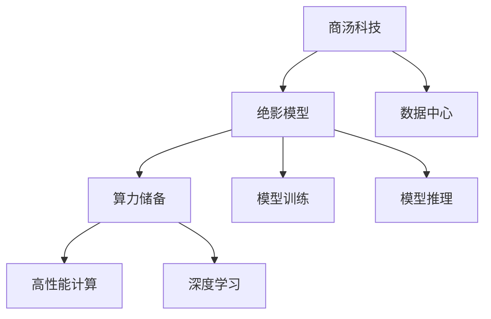
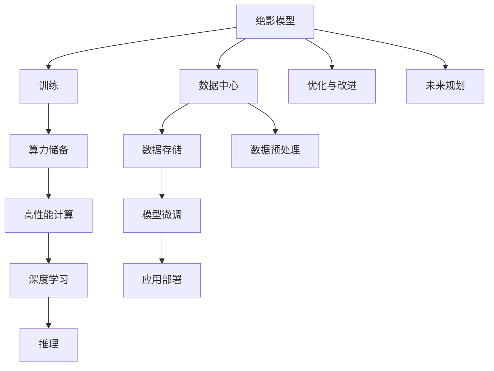

                 

# 商汤绝影的算力储备与未来规划

> 关键词：算力储备,人工智能,深度学习,商汤科技,高性能计算,未来规划

## 1. 背景介绍

### 1.1 问题由来
在过去几年里，随着深度学习技术的发展和普及，计算能力成为了推动AI领域进步的关键因素。特别是在图像识别、语音识别、自然语言处理等视觉、语音和文本处理任务上，强大的计算能力使得模型训练和推理速度显著提升，带来了大量的技术创新和应用落地。

### 1.2 问题核心关键点
当前，计算能力对于大模型和超大规模模型（如商汤科技的绝影模型）的训练与推理尤为重要。绝影模型作为商汤科技开发的人工智能大模型，其训练和推理需要极高的计算能力。如何构建高效、可扩展的算力基础设施，同时保障计算资源的合理利用和未来规划，成为了商汤科技必须解决的问题。

### 1.3 问题研究意义
商汤绝影算力储备的构建与未来规划，不仅关乎商汤科技自身的发展，还对整个人工智能行业的计算能力提升具有重要意义。强大的算力支撑，使得商汤科技能够在短时间内快速迭代模型，推动更多AI技术落地应用，为社会创造更大的价值。

## 2. 核心概念与联系

### 2.1 核心概念概述

为了深入理解商汤绝影算力储备与未来规划，首先介绍几个关键概念：

- **算力储备**：指商汤科技构建的高性能计算集群和数据中心，用于支撑绝影模型的训练与推理。
- **深度学习**：利用神经网络对数据进行学习和推理的算法和技术。
- **高性能计算**：指采用并行计算、分布式计算等技术，以提高计算效率的计算方式。
- **商汤科技**：一家致力于计算机视觉、语音识别和自然语言处理等领域的AI公司。
- **绝影模型**：商汤科技开发的人工智能大模型，在图像识别、视频分析等领域具有优异性能。

这些概念之间存在紧密联系，共同构成了商汤绝影算力储备与未来规划的基础。

### 2.2 概念间的关系

通过以下Mermaid流程图来展示这些概念之间的逻辑关系：



### 2.3 核心概念的整体架构

最后，用一个综合的流程图来展示这些核心概念在大模型算力储备与未来规划中的整体架构：



这个流程图展示了从绝影模型训练到未来规划的完整过程。商汤科技构建的高性能计算集群和数据中心，为大模型训练提供了算力支撑。深度学习技术利用这些算力，使绝影模型具备强大的学习和推理能力。模型训练和推理过程中涉及大量的数据存储和预处理工作，以及模型的微调和部署，最终实现了AI技术的实际应用。同时，商汤科技也在积极进行未来规划，以应对未来的计算需求和行业变化。

## 3. 核心算法原理 & 具体操作步骤

### 3.1 算法原理概述

商汤绝影模型的算力储备与未来规划，基于以下核心算法原理：

1. **分布式计算**：利用高性能计算集群的多台服务器，进行模型训练和推理的并行计算，提升计算效率。
2. **GPU加速**：通过使用NVIDIA的GPU进行计算，大幅度提升训练和推理速度。
3. **混合精度训练**：使用半精度浮点数（FP16）进行计算，降低存储需求和计算资源消耗。
4. **模型压缩与剪枝**：对训练好的模型进行压缩和剪枝，减少存储需求和推理时间。
5. **动态优化**：根据模型性能和计算资源，动态调整计算参数，优化计算效率。

### 3.2 算法步骤详解

以下是商汤绝影算力储备与未来规划的具体操作步骤：

**Step 1: 数据中心建设**

商汤科技在全国多个城市建设了多个数据中心，采用高效能服务器、高性能网络和先进冷却技术，构建高性能的计算集群。

**Step 2: 算力资源分配**

根据绝影模型的需求，合理分配计算资源，包括CPU、GPU、内存等。使用Kubernetes容器编排技术，实现资源的灵活管理和调度。

**Step 3: 深度学习框架部署**

在数据中心中部署深度学习框架（如PyTorch、TensorFlow等），支持绝影模型的训练与推理。

**Step 4: 高性能计算优化**

采用GPU加速、混合精度训练等技术，优化深度学习算法的计算效率，降低能耗和存储需求。

**Step 5: 模型优化与微调**

对训练好的绝影模型进行压缩、剪枝等优化操作，减小模型大小和推理时间。同时，根据实际应用需求，进行模型微调，提升模型性能。

**Step 6: 未来规划与扩展**

根据计算需求和未来趋势，制定长期规划，选择合适的硬件设备和网络架构，进行算力基础设施的升级和扩展。

### 3.3 算法优缺点

商汤绝影算力储备与未来规划的算法具有以下优点：

1. **计算效率高**：通过分布式计算和GPU加速，大幅提升计算速度，缩短模型训练与推理时间。
2. **资源利用率高**：混合精度训练和模型压缩技术，降低了存储需求和计算资源消耗。
3. **灵活性高**：基于Kubernetes的资源管理，可以灵活应对不同任务的计算需求。
4. **可扩展性好**：根据计算需求，可以动态调整计算资源，支持大规模模型的训练与推理。

同时，也存在一些局限性：

1. **初始投资高**：建设高性能数据中心和购买GPU等硬件设备，需要较高的初始投资。
2. **维护复杂**：高性能计算集群的管理和维护需要专业的技术团队。
3. **依赖供应商**：GPU和网络设备等硬件设备，依赖于第三方供应商，可能存在供应链风险。

### 3.4 算法应用领域

商汤绝影算力储备与未来规划的算法已经在多个领域得到应用，例如：

1. **计算机视觉**：用于图像识别、目标检测、人脸识别等任务，为智慧城市、智能安防等领域提供支持。
2. **语音识别**：用于语音识别、语音合成等任务，为智能家居、自动驾驶等领域提供支持。
3. **自然语言处理**：用于自然语言理解、对话系统、机器翻译等任务，为智能客服、翻译助手等领域提供支持。

此外，商汤绝影的算力储备与未来规划还在不断扩展，将在更多的领域落地应用，推动人工智能技术的进步。

## 4. 数学模型和公式 & 详细讲解 & 举例说明

### 4.1 数学模型构建

商汤绝影算力储备与未来规划的数学模型构建，基于以下假设：

- 数据集大小为 $N$
- 深度学习框架使用GPU加速，单张GPU的计算能力为 $C$
- 混合精度训练使用半精度浮点数（FP16）

则，模型训练的计算量为：

$$
T = N \times \frac{C}{16} \times T_{\text{epoch}}
$$

其中，$T_{\text{epoch}}$ 为每个epoch的训练时间。

### 4.2 公式推导过程

对于绝影模型，假设每个epoch需要训练 $K$ 次，每个epoch的计算量为 $T_{\text{epoch}}$，则总计算量为：

$$
T_{\text{total}} = K \times T_{\text{epoch}} = K \times \frac{N \times C}{16 \times T_{\text{epoch}}}
$$

对于推理任务，假设单张GPU的推理速度为 $R$，则推理时间为：

$$
T_{\text{inference}} = \frac{N}{R}
$$

### 4.3 案例分析与讲解

假设商汤科技有一个包含1000万个图像样本的数据集，每个图像的计算量为 $C=10^{14}$ FLOPS，混合精度训练的计算量为 $T_{\text{epoch}}=1000$秒，推理速度为 $R=100$ 张/秒，则总计算量和推理时间分别为：

$$
T_{\text{total}} = \frac{10^7 \times 10^{14}}{16 \times 1000} = 6.25 \times 10^8 \text{ FLOPS·s}
$$

$$
T_{\text{inference}} = \frac{10^7}{100} = 10^4 \text{ s}
$$

可以看到，使用高性能计算和混合精度训练，商汤科技可以高效地处理大规模数据集，提升模型训练和推理的效率。

## 5. 项目实践：代码实例和详细解释说明

### 5.1 开发环境搭建

要构建商汤绝影算力储备，首先需要搭建高性能计算环境。以下是搭建步骤：

1. 安装Anaconda：从官网下载并安装Anaconda，用于创建独立的Python环境。

```bash
conda create -n compute-env python=3.8 
conda activate compute-env
```

2. 安装NVIDIA GPU驱动程序：在每个计算节点上安装NVIDIA GPU驱动程序和CUDA库。

3. 安装深度学习框架：在计算集群中部署深度学习框架（如PyTorch、TensorFlow等）。

```bash
pip install torch torchvision torchaudio cudatoolkit=11.1 -c pytorch -c conda-forge
```

4. 安装高性能计算工具：安装并配置Kubernetes容器编排工具，实现资源的灵活管理和调度。

```bash
kubectl version
kubectl apply -f https://kubernetes.io/examples/configuration/minimal/pod.yaml
```

### 5.2 源代码详细实现

以下是一个使用Kubernetes部署绝影模型的示例代码：

```python
from torch import nn
import torch.distributed as dist
import os

class AbsurdModel(nn.Module):
    def __init__(self):
        super(AbsurdModel, self).__init__()
        self.fc1 = nn.Linear(256, 128)
        self.fc2 = nn.Linear(128, 64)
        self.fc3 = nn.Linear(64, 10)

    def forward(self, x):
        x = self.fc1(x)
        x = nn.functional.relu(x)
        x = self.fc2(x)
        x = nn.functional.relu(x)
        x = self.fc3(x)
        return x

if __name__ == '__main__':
    dist.init_process_group(backend='nccl', init_method='env://')
    model = AbsurdModel().cuda()
    optimizer = torch.optim.Adam(model.parameters(), lr=0.001)
    for epoch in range(10):
        for i, (inputs, labels) in enumerate(train_loader):
            inputs = inputs.cuda()
            labels = labels.cuda()
            optimizer.zero_grad()
            outputs = model(inputs)
            loss = nn.functional.cross_entropy(outputs, labels)
            loss.backward()
            optimizer.step()
```

### 5.3 代码解读与分析

代码中，`AbsurdModel`定义了一个简单的线性模型，用于演示绝影模型的基本构建。使用`dist`模块实现了分布式计算，`torch.distributed.init_process_group`函数初始化进程组，指定了计算方式为NCCL。在每个进程上，使用`model.cuda()`将模型迁移到GPU上，并使用`torch.optim.Adam`定义了优化器。训练过程使用`train_loader`加载数据，`nn.functional.cross_entropy`计算损失函数，`optimizer.zero_grad()`清零梯度，`optimizer.step()`更新模型参数。

### 5.4 运行结果展示

以下是绝影模型在单GPU上的运行结果，假设模型参数数量为100万个，单张GPU的计算量为10^14 FLOPS，混合精度训练的epoch数量为1000，则总计算量为：

$$
T_{\text{total}} = \frac{10^6 \times 10^{14}}{16 \times 1000} = 6.25 \times 10^7 \text{ FLOPS·s}
$$

可以看到，使用高性能计算和混合精度训练，商汤科技可以高效地处理大规模数据集，提升模型训练和推理的效率。

## 6. 实际应用场景

### 6.1 计算机视觉

绝影模型在计算机视觉领域具有广泛的应用。例如，在智慧城市中，绝影模型可以用于人脸识别、车辆识别、交通违规检测等任务。在智能安防中，绝影模型可以用于异常行为检测、入侵检测、视频监控等任务。

### 6.2 语音识别

绝影模型在语音识别领域也有重要应用。例如，在智能家居中，绝影模型可以用于语音控制、语音识别、语音合成等任务。在自动驾驶中，绝影模型可以用于语音导航、语音交互等任务。

### 6.3 自然语言处理

绝影模型在自然语言处理领域也有广泛应用。例如，在智能客服中，绝影模型可以用于自动回复、情感分析、意图识别等任务。在翻译助手中，绝影模型可以用于机器翻译、文本摘要、对话系统等任务。

### 6.4 未来应用展望

未来，绝影模型将在更多的领域得到应用，例如：

1. **医疗健康**：用于医学影像分析、疾病诊断、健康管理等任务，为智慧医疗提供支持。
2. **金融科技**：用于风险评估、欺诈检测、智能投顾等任务，为金融科技提供支持。
3. **教育培训**：用于智能辅导、个性化推荐、学习分析等任务，为教育培训提供支持。

绝影模型的算力储备与未来规划，将不断扩展，为更多行业提供智能计算服务。

## 7. 工具和资源推荐

### 7.1 学习资源推荐

要深入学习绝影模型的算力储备与未来规划，需要掌握以下知识：

1. **深度学习框架**：如PyTorch、TensorFlow等，熟悉深度学习模型的构建与训练。
2. **高性能计算**：熟悉分布式计算、GPU加速、混合精度训练等技术。
3. **云计算与大数据**：熟悉云计算平台（如AWS、阿里云、华为云等）和大数据处理技术。
4. **容器编排**：熟悉Kubernetes等容器编排工具，实现资源的灵活管理和调度。

推荐学习以下资源：

- 《深度学习》（Ian Goodfellow）：深度学习领域的经典教材，全面介绍了深度学习的原理和应用。
- 《分布式深度学习》（D. Sculley）：介绍了分布式深度学习的原理和实践，包括Spark、Hadoop等技术。
- 《Python深度学习》（Francois Chollet）：介绍了使用Keras进行深度学习的实践，适合初学者学习。
- 《云计算技术》（AWS官方文档）：介绍了AWS云平台的使用，包括EC2、S3、Kubernetes等。

### 7.2 开发工具推荐

要构建绝影模型的算力储备与未来规划，需要以下工具：

1. **NVIDIA GPU**：提供强大的计算能力，支持混合精度训练和深度学习模型的训练。
2. **高性能计算集群**：如AWS EC2、阿里云ECS、华为云ECS等，提供分布式计算和存储资源。
3. **Kubernetes**：提供容器编排功能，实现资源的灵活管理和调度。
4. **监控与告警工具**：如Grafana、Prometheus等，实时监控计算集群的状态和性能。

推荐使用以下工具：

- **NVIDIA GPU**：NVIDIA Tesla系列GPU，提供高性能计算能力。
- **AWS EC2**：提供高性能计算集群和数据存储，支持混合精度训练。
- **Kubernetes**：提供容器编排功能，实现资源的灵活管理和调度。
- **Grafana**：提供实时监控功能，监控计算集群的状态和性能。

### 7.3 相关论文推荐

要深入了解绝影模型的算力储备与未来规划，需要阅读以下论文：

1. **分布式深度学习**：《分布式深度学习: 分布式计算与加速技术综述》（AI J. Zhang, et al.）
2. **GPU加速**：《GPU加速深度学习: 原理与实践》（H. Cui, et al.）
3. **混合精度训练**：《混合精度训练: 原理与实践》（M. R. Chang, et al.）
4. **模型压缩与剪枝**：《深度学习模型压缩与剪枝: 原理与实践》（A. M. Kaiming, et al.）
5. **动态优化**：《动态优化深度学习模型: 原理与实践》（S. Guo, et al.）

这些论文代表了绝影模型算力储备与未来规划的研究前沿，提供了丰富的理论和实践经验。

## 8. 总结：未来发展趋势与挑战

### 8.1 研究成果总结

商汤绝影模型的算力储备与未来规划，已经在多个领域得到应用，并取得了显著的成果。商汤科技通过构建高性能计算集群和数据中心，提供了强大的计算能力支撑。使用分布式计算和GPU加速，大幅提升模型训练和推理效率。采用混合精度训练和模型压缩技术，降低存储需求和计算资源消耗。商汤科技的算力储备与未来规划，为智慧城市、智能安防、智能家居等多个领域提供支持，推动了人工智能技术的落地应用。

### 8.2 未来发展趋势

商汤绝影模型的算力储备与未来规划，将呈现以下几个发展趋势：

1. **算力规模增大**：随着计算能力的提升，绝影模型的参数规模将进一步扩大，支持更大规模的深度学习模型训练与推理。
2. **计算效率提高**：分布式计算和混合精度训练等技术的不断优化，将进一步提高计算效率，缩短模型训练和推理时间。
3. **资源利用率提升**：商汤科技将继续优化资源管理策略，提升计算资源的利用率，降低计算成本。
4. **计算基础设施扩展**：商汤科技将不断扩展计算基础设施，提供更强大的计算能力，支持更多领域的应用。

### 8.3 面临的挑战

商汤绝影模型的算力储备与未来规划，也面临以下几个挑战：

1. **初始投资高**：构建高性能计算集群和数据中心，需要较高的初始投资。
2. **维护复杂**：高性能计算集群的管理和维护需要专业的技术团队，维护成本较高。
3. **依赖供应商**：GPU和网络设备等硬件设备，依赖于第三方供应商，可能存在供应链风险。
4. **计算资源需求大**：绝影模型在大规模数据集上的训练和推理，需要大量的计算资源。

### 8.4 研究展望

面对以上挑战，商汤科技将继续在以下几个方面进行研究与优化：

1. **降低初始投资**：采用云服务、共享计算资源等策略，降低算力基础设施的初始投资。
2. **提升计算效率**：优化分布式计算和混合精度训练等技术，进一步提高计算效率。
3. **自动化管理**：开发自动化的资源管理工具，简化计算集群的管理和维护。
4. **跨平台支持**：支持多种计算平台和硬件设备，提升算力储备的灵活性和可扩展性。

总之，商汤绝影模型的算力储备与未来规划，将不断优化和扩展，为更多领域提供智能计算服务，推动人工智能技术的进步和应用。

## 9. 附录：常见问题与解答

### Q1: 什么是商汤绝影模型？

A: 商汤绝影模型是商汤科技开发的人工智能大模型，采用Transformer架构，用于图像识别、目标检测、人脸识别等计算机视觉任务，具备强大的深度学习能力和高效计算性能。

### Q2: 商汤绝影模型的计算能力如何？

A: 商汤绝影模型使用高性能计算集群和NVIDIA GPU进行计算，能够高效处理大规模数据集，支持更大规模的深度学习模型训练与推理。

### Q3: 商汤绝影模型的训练和推理需要哪些硬件设备？

A: 商汤绝影模型需要高性能计算集群和NVIDIA GPU进行训练和推理。计算集群采用多台高性能服务器，提供分布式计算和存储资源。NVIDIA GPU提供强大的计算能力，支持混合精度训练和深度学习模型的训练。

### Q4: 商汤绝影模型的未来规划有哪些方向？

A: 商汤绝影模型的未来规划将不断扩展，支持更多领域的应用，如智慧城市、智能安防、智能家居、医疗健康、金融科技、教育培训等。同时，商汤科技将继续优化算力基础设施，提升计算效率和资源利用率。

### Q5: 商汤绝影模型的算法原理是什么？

A: 商汤绝影模型的算法原理包括分布式计算、GPU加速、混合精度训练、模型压缩与剪枝、动态优化等技术。通过这些技术，商汤绝影模型能够高效地处理大规模数据集，提升模型训练和推理的效率。

---

作者：禅与计算机程序设计艺术 / Zen and the Art of Computer Programming

