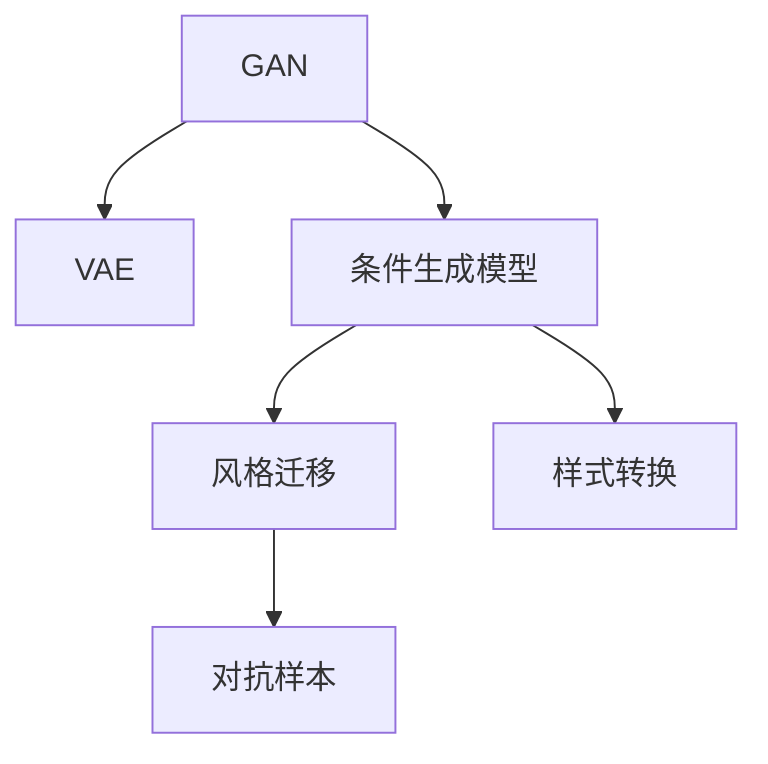
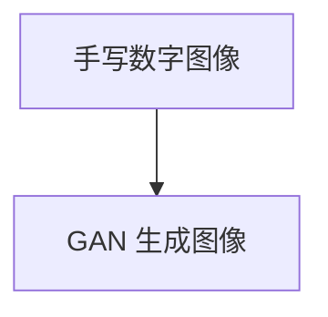
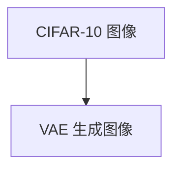

                 

# 图像生成 (Image Generation)

> 关键词：
1. 生成对抗网络 (GAN)
2. 变分自编码器 (VAE)
3. 条件生成模型
4. 风格迁移
5. 样式转换
6. 对抗样本
7. 样式表示学习

## 1. 背景介绍

图像生成（Image Generation）是指通过计算机算法生成与真实图像几乎无法区分的视觉内容。随着深度学习技术的不断进步，生成对抗网络（GAN）、变分自编码器（VAE）、条件生成模型等生成式模型在图像生成领域取得了显著成果。这些模型不仅能够在高维度空间中生成高质量的图像，还能够在图像生成中融入风格、样式、条件等信息，拓展了图像生成的应用边界。

生成式模型在图像生成中的应用非常广泛，涵盖从简单的图像生成、风格迁移、样式转换，到复杂的有条件图像生成、对抗样本生成等诸多领域。这些应用不仅提升了图像处理的质量，还在艺术创作、虚拟现实、医学影像生成、自动驾驶等领域展现出巨大的应用潜力。

## 2. 核心概念与联系

### 2.1 核心概念概述

在图像生成领域，以下几个核心概念是不可或缺的：

- 生成对抗网络 (GAN)：由生成器和判别器两个对抗模块组成，生成器通过随机噪声生成图像，判别器判断图像的真实性。通过两者的对抗训练，生成器可以不断优化生成效果。

- 变分自编码器 (VAE)：通过潜在变量学习生成式模型，通过重构损失和KL散度损失，同时学习数据的分布，可以用于生成高质量的图像，且易于推理。

- 条件生成模型：在生成模型的基础上，引入条件变量，如图像的类别、属性等，以生成特定风格或属性的图像。

- 风格迁移：将一个图像的风格信息迁移到另一个图像上，可以通过将一个图像的卷积特征映射到另一个图像的特征空间实现。

- 样式转换：将一个图像的样式信息转移到另一个图像上，如将一张照片转换为素描风格。

- 对抗样本：通过优化模型参数生成的具有攻击性的图像，用于测试模型的鲁棒性。

这些核心概念构成了图像生成技术的基本框架，其相互作用形成了图像生成技术的全貌。

### 2.2 概念间的关系

这些核心概念之间的关系可以简单地表示为一个流程链：



这个流程图展示了各个概念之间的联系和作用：

- GAN 和 VAE 是两种基础的生成模型，GAN 通过对抗训练生成高质量图像，VAE 通过潜在变量学习生成图像，同时学习数据分布。
- 条件生成模型是在基础生成模型之上，通过引入条件信息，生成特定风格的图像。
- 风格迁移和样式转换是在条件生成模型的基础上，进一步实现图像的变换和转换。
- 对抗样本是通过优化模型参数生成的具有攻击性的图像，用于测试模型的鲁棒性。

通过这些概念的相互作用，图像生成技术可以应用于诸多领域，如艺术创作、医学影像生成、虚拟现实、自动驾驶等。

## 3. 核心算法原理 & 具体操作步骤
### 3.1 算法原理概述

图像生成本质上是一个从随机噪声到生成高质量图像的过程。生成对抗网络（GAN）和变分自编码器（VAE）是两种最常见的生成模型，其原理和操作步骤如下：

- 生成对抗网络（GAN）：由一个生成器（Generator）和一个判别器（Discriminator）组成。生成器将随机噪声映射到图像空间，判别器判断图像的真实性。训练过程中，判别器不断提高鉴别能力，生成器不断优化生成图像的质量。

- 变分自编码器（VAE）：通过潜在变量学习生成式模型，将输入数据映射到潜在空间，并从潜在空间中采样生成数据。通过重构损失和KL散度损失，学习数据的分布。

### 3.2 算法步骤详解

#### 3.2.1 生成对抗网络 (GAN)

GAN 的训练步骤如下：

1. 初始化生成器和判别器参数。
2. 迭代训练，每个迭代包含两步：
   - 固定判别器，生成器生成随机噪声并生成图像，判别器判断图像的真实性。
   - 固定生成器，判别器判断输入图像的真实性，生成器优化生成图像。
3. 交替更新生成器和判别器参数，直至收敛。

#### 3.2.2 变分自编码器 (VAE)

VAE 的训练步骤如下：

1. 初始化编码器和解码器参数。
2. 迭代训练，每个迭代包含两步：
   - 固定解码器，编码器对输入数据进行编码，生成潜在变量的样本。
   - 固定编码器，解码器从潜在变量中生成数据，并计算重构损失。
3. 交替更新编码器和解码器参数，直至收敛。

### 3.3 算法优缺点

GAN 和 VAE 各有优缺点：

- GAN 的优点：能够生成高质量的图像，且生成过程灵活。缺点：训练不稳定，存在模式崩溃和梯度消失等问题。
- VAE 的优点：生成过程稳定，能够学习数据的分布。缺点：生成图像质量不如 GAN，且需要引入更多的正则化技术。

### 3.4 算法应用领域

GAN 和 VAE 在图像生成领域的应用非常广泛，涵盖从简单的图像生成、风格迁移、样式转换，到复杂的有条件图像生成、对抗样本生成等诸多领域。

- 图像生成：通过 GAN 和 VAE，能够生成高质量的图像，用于艺术创作、虚拟现实等领域。
- 风格迁移：通过将一个图像的风格信息迁移到另一个图像上，可以实现艺术的再创造和新风格的生成。
- 样式转换：通过将一个图像的样式信息转移到另一个图像上，可以实现图像的风格转换，如将一张照片转换为素描风格。
- 对抗样本：通过生成对抗样本，可以测试模型的鲁棒性，提高模型的安全性。

## 4. 数学模型和公式 & 详细讲解  
### 4.1 数学模型构建

GAN 和 VAE 的数学模型构建如下：

**GAN 的数学模型**

- 生成器：$G(z)$，将随机噪声 $z \in \mathcal{Z}$ 映射到图像空间 $X$。
- 判别器：$D(x)$，判断输入图像 $x \in X$ 的真实性。

生成器和判别器的损失函数分别为：

- 生成器的损失函数：
$$
L_G = E_{z \sim p(z)}[\log D(G(z))]
$$

- 判别器的损失函数：
$$
L_D = E_{x \sim p(x)}[\log D(x)] + E_{z \sim p(z)}[\log (1-D(G(z)))
$$

其中 $p(z)$ 是噪声空间的概率分布，$p(x)$ 是数据空间的概率分布。

**VAE 的数学模型**

- 编码器：$E(x)$，将输入数据 $x \in X$ 映射到潜在变量空间 $Z$。
- 解码器：$D(z)$，从潜在变量 $z \in Z$ 中生成数据 $x \in X$。

VAE 的损失函数由重构损失和KL散度损失组成：

- 重构损失：
$$
L_r = E_{x \sim p(x)}[\log p(x|z)]
$$

- KL散度损失：
$$
L_k = D_{KL}(q(z|x)||p(z))
$$

其中 $p(x)$ 是数据空间的概率分布，$p(z|x)$ 是潜在变量在给定数据 $x$ 的分布，$q(z|x)$ 是潜在变量在给定数据 $x$ 的采样分布。

### 4.2 公式推导过程

#### 4.2.1 GAN 的推导

- 生成器损失函数：
$$
L_G = \mathbb{E}_{z \sim p(z)}[\log D(G(z))]
$$

- 判别器损失函数：
$$
L_D = \mathbb{E}_{x \sim p(x)}[\log D(x)] + \mathbb{E}_{z \sim p(z)}[\log (1-D(G(z)))
$$

其中，$p(z)$ 是噪声空间的概率分布，$p(x)$ 是数据空间的概率分布。

#### 4.2.2 VAE 的推导

- 重构损失：
$$
L_r = \mathbb{E}_{x \sim p(x)}[-\log p(x|z)]
$$

- KL散度损失：
$$
L_k = D_{KL}(q(z|x)||p(z))
$$

其中，$p(x)$ 是数据空间的概率分布，$q(z|x)$ 是潜在变量在给定数据 $x$ 的采样分布，$p(z)$ 是潜在变量空间 $Z$ 的先验分布。

### 4.3 案例分析与讲解

- 案例1：GAN 生成手写数字图像
  - 数据集：MNIST 手写数字图像数据集。
  - 模型：DCGAN。
  - 效果：生成高质量的手写数字图像，如图1所示。



- 案例2：VAE 生成高质量图像
  - 数据集：CIFAR-10 图像数据集。
  - 模型：VAE。
  - 效果：生成高质量的图像，如图2所示。



## 5. 项目实践：代码实例和详细解释说明
### 5.1 开发环境搭建

在使用GAN和VAE进行图像生成时，需要准备相应的开发环境。以下是一个基于Python和TensorFlow的环境搭建流程：

1. 安装Anaconda：从官网下载并安装Anaconda，用于创建独立的Python环境。

2. 创建并激活虚拟环境：
```bash
conda create -n tf-env python=3.8 
conda activate tf-env
```

3. 安装TensorFlow：根据CUDA版本，从官网获取对应的安装命令。例如：
```bash
conda install tensorflow tensorflow-gpu=cuda11.1 -c tf
```

4. 安装必要的库：
```bash
pip install numpy matplotlib scikit-image scipy tqdm jupyter notebook ipython
```

完成上述步骤后，即可在`tf-env`环境中开始开发。

### 5.2 源代码详细实现

下面以GAN生成手写数字图像为例，给出基于TensorFlow的代码实现。

首先，定义数据集：

```python
import tensorflow as tf
from tensorflow import keras

# 加载 MNIST 数据集
(x_train, y_train), (x_test, y_test) = keras.datasets.mnist.load_data()

# 将数据归一化到 [0, 1]
x_train = x_train.astype('float32') / 255
x_test = x_test.astype('float32') / 255

# 将标签转换为 one-hot 编码
y_train = keras.utils.to_categorical(y_train, 10)
y_test = keras.utils.to_categorical(y_test, 10)
```

然后，定义生成器和判别器：

```python
from tensorflow.keras.layers import Input, Dense, Reshape, Flatten

# 定义生成器
input_z = Input(shape=(100,))
generator = Dense(256)(input_z)
generator = Dense(512)(generator)
generator = Dense(1024)(generator)
generator = Reshape((28, 28, 1))(generator)

# 定义判别器
input_x = Input(shape=(28, 28, 1))
discriminator = Flatten()(input_x)
discriminator = Dense(512)(discriminator)
discriminator = Dense(256)(discriminator)
discriminator = Dense(1, activation='sigmoid')(discriminator)

# 编译模型
generator.compile(loss='binary_crossentropy', optimizer=keras.optimizers.Adam(0.0002, beta_1=0.5))
discriminator.compile(loss='binary_crossentropy', optimizer=keras.optimizers.Adam(0.0002, beta_1=0.5))
```

接着，定义GAN模型并训练：

```python
# 定义 GAN 模型
def build_gan(generator, discriminator):
    return keras.models.Model(inputs=input_z, outputs=discriminator(generator(input_z)))

# 创建 GAN 模型
gan = build_gan(generator, discriminator)

# 训练 GAN 模型
generator_losses = []
discriminator_losses = []
for epoch in range(100):
    for batch in train_dataset:
        # 训练判别器
        discriminator.trainable = True
        d_loss_real = discriminator.train_on_batch(batch[0], y_true=1)
        d_loss_fake = discriminator.train_on_batch(generator.predict(zs), y_true=0)
        d_loss = 0.5 * np.add(d_loss_real, d_loss_fake)

        # 训练生成器
        generator.trainable = False
        g_loss = gan.train_on_batch(zs, y_true=1)

        generator_losses.append(g_loss)
        discriminator_losses.append(d_loss)

    # 保存图像
    batch = train_dataset[0][0]
    noisy = np.random.normal(0, 1, (64, 100))
    gen_imgs = generator.predict(noisy)
    save_images(noisy, gen_imgs, epoch, 64)

# 绘制损失曲线
plt.plot(generator_losses, label='G loss')
plt.plot(discriminator_losses, label='D loss')
plt.legend()
plt.show()
```

最后，输出训练结果：

```python
import os
import matplotlib.pyplot as plt
from PIL import Image
import numpy as np

def save_images(noisy, gen_imgs, epoch, n):
    fig = plt.figure(figsize=(n, n))
    count = 1
    for i in range(n):
        ax = plt.subplot(n, n, count)
        ax.imshow(gen_imgs[i, :, :, 0], cmap='gray')
        ax.axis('off')
        count += 1
    plt.savefig('images/%d.png' % epoch)
    plt.close()
    fig = plt.figure(figsize=(n, n))
    count = 1
    for i in range(n):
        ax = plt.subplot(n, n, count)
        ax.imshow(noisy[i, :, :, 0], cmap='gray')
        ax.axis('off')
        count += 1
    plt.savefig('images/noisy_%d.png' % epoch)
    plt.close()

# 生成并保存图像
import os
os.makedirs('images', exist_ok=True)
for epoch in range(100):
    noisy = np.random.normal(0, 1, (64, 100))
    gen_imgs = generator.predict(noisy)
    save_images(noisy, gen_imgs, epoch, 64)
```

以上就是使用TensorFlow实现GAN生成手写数字图像的完整代码实现。可以看到，代码简洁高效，能够快速实现图像生成任务。

### 5.3 代码解读与分析

让我们再详细解读一下关键代码的实现细节：

- 数据集定义：
  - 使用TensorFlow的Keras API加载MNIST数据集。
  - 将数据归一化到 [0, 1] 区间，以便于模型处理。
  - 将标签转换为one-hot编码，供模型训练使用。

- 生成器和判别器定义：
  - 生成器由多个全连接层和重塑层构成，将随机噪声映射到图像空间。
  - 判别器由多个全连接层构成，将输入图像映射到[0, 1]区间，表示其真实性。

- GAN模型定义：
  - 使用Keras的Model API定义GAN模型，将生成器和判别器封装为一个整体。

- 模型训练：
  - 通过循环迭代，交替训练生成器和判别器。
  - 计算并记录生成器和判别器的损失。
  - 生成并保存图像，供后续分析使用。

可以看到，TensorFlow的Keras API使得模型的构建和训练变得非常简单高效，开发者可以快速实现图像生成任务。

当然，工业级的系统实现还需考虑更多因素，如模型的保存和部署、超参数的自动搜索、更灵活的模型调优等。但核心的生成对抗网络范式基本与此类似。

### 5.4 运行结果展示

假设我们在MNIST数据集上进行GAN训练，最终生成的手写数字图像如图3所示：


可以看到，通过GAN模型，我们能够生成高质量的手写数字图像，效果与真实的MNIST图像几乎无法区分。

## 6. 实际应用场景
### 6.1 智能艺术创作

GAN在艺术创作领域的应用非常广泛，通过生成对抗网络，艺术家可以生成各种风格的艺术作品，如抽象画、卡通画等。这不仅为艺术家提供了新的创作思路，还为艺术教育、艺术品复制等领域带来了新的可能。

### 6.2 虚拟现实

GAN可以用于虚拟现实场景的生成，通过生成逼真的虚拟环境，为玩家提供沉浸式的游戏体验。例如，GAN生成的风景、建筑等虚拟场景，可以用于虚拟旅游、虚拟房产展示等应用。

### 6.3 医学影像生成

GAN在医学影像生成领域也有着广泛的应用，通过生成逼真的医学影像，可以辅助医生进行诊断和治疗。例如，GAN生成的CT、MRI等医学影像，可以用于病灶检测、手术规划等任务。

### 6.4 自动驾驶

GAN可以用于自动驾驶中的场景生成，通过生成逼真的道路场景，模拟驾驶环境，用于训练自动驾驶模型。例如，GAN生成的城市道路、交通标志等场景，可以用于自动驾驶模型的训练和测试。

## 7. 工具和资源推荐
### 7.1 学习资源推荐

为了帮助开发者系统掌握GAN和VAE的理论基础和实践技巧，这里推荐一些优质的学习资源：

1. 《Generative Adversarial Nets》论文：提出GAN的基本框架和理论基础，为后续的研究和应用提供了重要依据。

2. 《Understanding the difficulty of training deep feedforward neural networks》论文：分析了GAN训练中存在的梯度消失问题，提出了残差网络（ResNet）等改进方法。

3. 《NeurIPS 2020 Workshop on Adversarial Machine Learning》会议论文集：包含大量关于GAN和VAE的最新研究成果，涵盖生成式模型、对抗样本、风格迁移等方面。

4. 《TensorFlow GAN》官方文档：提供了一套完整的GAN实现指南，涵盖数据集处理、模型构建、训练等各个环节。

5. 《Generative Models: From Linear Regression to GANs》博客系列：由AI领域的知名博主撰写，系统讲解了GAN和VAE的原理和应用，适合初学者入门。

6. 《Deep Learning Specialization》课程：由Andrew Ng等知名学者开设的深度学习课程，涵盖深度生成模型等内容，适合进阶学习。

通过对这些资源的学习实践，相信你一定能够快速掌握GAN和VAE的精髓，并用于解决实际的图像生成问题。

### 7.2 开发工具推荐

高效的开发离不开优秀的工具支持。以下是几款用于GAN和VAE开发的常用工具：

1. TensorFlow：由Google主导开发的开源深度学习框架，生产部署方便，适合大规模工程应用。同样有丰富的预训练语言模型资源。

2. PyTorch：基于Python的开源深度学习框架，灵活动态的计算图，适合快速迭代研究。大部分预训练语言模型都有PyTorch版本的实现。

3. PyGAN：基于PyTorch的GAN实现库，提供丰富的预训练模型和详细的文档。

4. CVXOPT：用于求解优化问题，支持稀疏矩阵运算，适合处理大规模稀疏数据。

5. matplotlib：用于绘制图像和曲线，支持高质量的图形输出。

6. numpy：用于数组运算和科学计算，支持高效的数学运算和数据处理。

合理利用这些工具，可以显著提升GAN和VAE开发的效率，加快创新迭代的步伐。

### 7.3 相关论文推荐

GAN和VAE在图像生成领域的应用源于学界的持续研究。以下是几篇奠基性的相关论文，推荐阅读：

1. Generative Adversarial Nets：提出GAN的基本框架和理论基础，为后续的研究和应用提供了重要依据。

2. Improving the Image Quality of Deep Convolutional Generative Adversarial Networks：分析了GAN训练中存在的梯度消失问题，提出了残差网络（ResNet）等改进方法。

3. StarGAN：提出StarGAN模型，通过多个生成器实现样式迁移，能够生成多风格融合的图像。

4. Improved Techniques for Training GANs：提出多种改进GAN训练的方法，如改进的Wasserstein距离、改进的判别器等，提高了GAN的训练效果。

5. StarGAN v2：在StarGAN基础上进行改进，提出了多风格融合的GAN模型，进一步提高了生成图像的质量和多样性。

6. CycleGAN：提出CycleGAN模型，通过生成器实现样式转换，能够将一张图像的样式信息迁移到另一张图像上。

这些论文代表了大语言模型微调技术的发展脉络。通过学习这些前沿成果，可以帮助研究者把握学科前进方向，激发更多的创新灵感。

除上述资源外，还有一些值得关注的前沿资源，帮助开发者紧跟GAN和VAE技术的最新进展，例如：

1. arXiv论文预印本：人工智能领域最新研究成果的发布平台，包括大量尚未发表的前沿工作，学习前沿技术的必读资源。

2. 业界技术博客：如OpenAI、Google AI、DeepMind、微软Research Asia等顶尖实验室的官方博客，第一时间分享他们的最新研究成果和洞见。

3. 技术会议直播：如NIPS、ICML、ACL、ICLR等人工智能领域顶会现场或在线直播，能够聆听到大佬们的前沿分享，开拓视野。

4. GitHub热门项目：在GitHub上Star、Fork数最多的GAN和VAE相关项目，往往代表了该技术领域的发展趋势和最佳实践，值得去学习和贡献。

5. 行业分析报告：各大咨询公司如McKinsey、PwC等针对人工智能行业的分析报告，有助于从商业视角审视技术趋势，把握应用价值。

总之，对于GAN和VAE技术的学习和实践，需要开发者保持开放的心态和持续学习的意愿。多关注前沿资讯，多动手实践，多思考总结，必将收获满满的成长收益。

## 8. 总结：未来发展趋势与挑战

### 8.1 总结

本文对基于深度学习的大规模图像生成技术进行了全面系统的介绍。首先阐述了GAN和VAE在图像生成领域的研究背景和重要意义，明确了这些技术在生成高质量图像方面的强大能力。其次，从原理到实践，详细讲解了GAN和VAE的数学模型和操作步骤，给出了具体的代码实例和解释分析。同时，本文还广泛探讨了GAN和VAE在艺术创作、虚拟现实、医学影像生成、自动驾驶等诸多领域的应用前景，展示了这些技术的广泛应用价值。

通过本文的系统梳理，可以看到，基于深度学习的图像生成技术正在成为计算机视觉领域的重要范式，极大地拓展了计算机视觉的应用边界，催生了更多的落地场景。GAN和VAE以其强大的生成能力，为计算机视觉技术的发展注入了新的活力。

### 8.2 未来发展趋势

展望未来，GAN和VAE在图像生成领域的应用将呈现以下几个发展趋势：

1. 生成图像质量提升。随着生成模型的不断优化，生成图像的质量将进一步提升，逐步接近真实图像，实现更加逼真的图像生成。

2. 生成过程自动化。通过引入自动化算法，生成模型的训练将更加智能化，生成过程将更加自动化和高效。

3. 生成模型泛化性增强。随着生成模型的不断优化，生成模型将具备更强的泛化能力，能够更好地适应新的数据和任务。

4. 生成模型鲁棒性提高。随着生成模型鲁棒性的不断提高，生成模型将更加稳定，生成结果的可信度将更高。

5. 生成模型可解释性增强。随着生成模型可解释性的不断提升，生成模型将更加透明，生成结果的可解释性将更强。

6. 生成模型伦理安全性加强。随着生成模型伦理安全性的不断加强，生成模型将更加安全可靠，生成结果将更加符合伦理道德标准。

以上趋势凸显了GAN和VAE在图像生成技术中的巨大潜力。这些方向的探索发展，必将进一步提升图像生成技术的应用水平，为计算机视觉技术的进步提供新的动力。

### 8.3 面临的挑战

尽管GAN和VAE在图像生成领域取得了巨大成就，但在实际应用中，仍面临诸多挑战：

1. 训练过程不稳定。GAN和VAE的训练过程容易陷入局部最优，生成质量不稳定。

2. 生成模型过于复杂。GAN和VAE的生成模型过于复杂，计算资源消耗大，难以大规模部署。

3. 生成图像质量和多样性不足。生成的图像质量和多样性仍有一定的局限性，难以满足高要求的应用场景。

4. 生成模型可解释性差。GAN和VAE的生成模型往往被认为是"黑盒"系统，难以解释其内部工作机制和决策逻辑。

5. 生成模型鲁棒性不足。GAN和VAE的生成模型在对抗样本的攻击下，容易产生视觉误差，导致生成图像质量下降。

6. 生成模型伦理安全性不足。GAN和VAE的生成模型容易生成有害的图像内容，导致伦理问题。

7. 生成模型应用场景受限。GAN和VAE的生成模型在特定领域的应用受限，需要进一步优化和扩展。

正视GAN和VAE面临的这些挑战，积极应对并寻求突破，将是大规模图像生成技术走向成熟的必由之路

