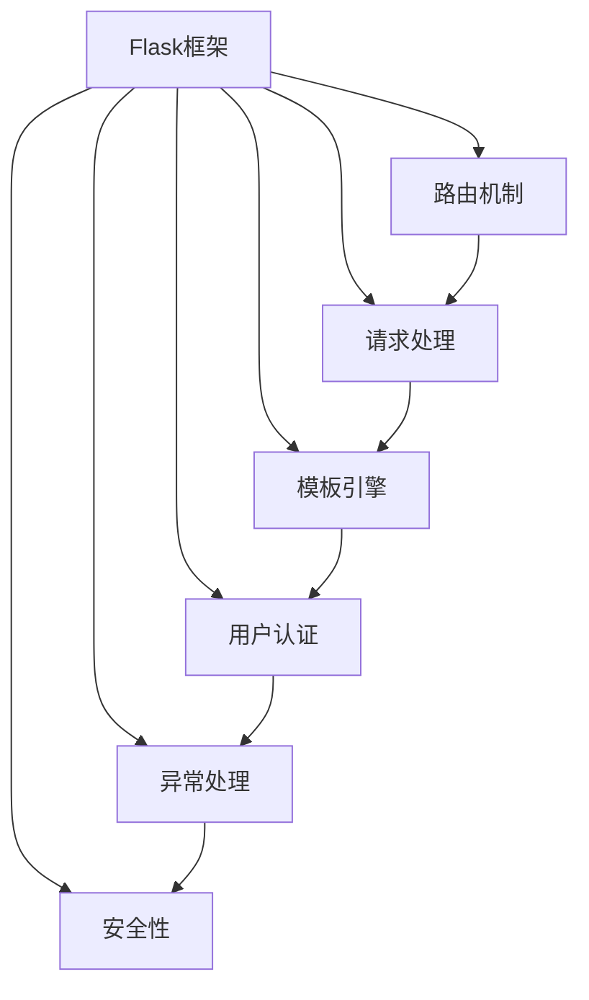
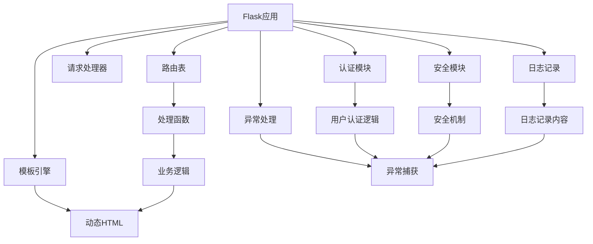

                 

# 基于 Flask 的 Web Server 设计与实现

> 关键词：Flask, Web Server, 服务器设计, 应用程序开发, 网络编程, 框架选择, 路由机制, 请求处理, 模板引擎, 用户认证, 异常处理, 安全性

## 1. 背景介绍

### 1.1 问题由来
随着互联网的快速发展，Web应用程序的需求日益增长。Web Server（服务器）作为Web应用的核心基础设施，扮演着至关重要的角色。在众多服务器选项中，Flask因其轻量级、易用性、灵活性等特点，成为了开发Web应用的首选框架之一。但如何设计一个高效、可靠、安全的Flask Web Server，仍是许多开发者面临的挑战。

本文聚焦于基于Flask的Web Server设计，旨在帮助开发者系统掌握Flask服务器的核心原理和最佳实践，全面覆盖从设计到实现的各个环节，使读者能够轻松构建高性能、高可用性的Flask Web Server。

### 1.2 问题核心关键点
设计一个优秀的Flask Web Server需要考虑以下核心问题：
1. 选择合适的技术栈：根据应用需求，合理选择后端语言、数据库、缓存等技术栈。
2. 设计高效的路由机制：合理规划路由规则，优化请求处理流程。
3. 实现安全的认证和授权机制：保护应用免受恶意攻击。
4. 采用现代化的设计原则：如无状态化、分片等，提高系统的可扩展性和性能。
5. 引入先进的工具和组件：如模板引擎、异步处理等，提高开发效率。
6. 优化异常处理和日志记录：提高应用的稳定性和可维护性。

本文将围绕以上关键点，详细介绍Flask Web Server的设计和实现方法。

### 1.3 问题研究意义
设计一个高性能、高可用性的Flask Web Server，对于提升Web应用的质量和用户体验具有重要意义：

1. 降低开发成本：Flask框架提供了丰富的功能和组件，开发者可以无需从头编写底层代码，提高开发效率。
2. 提升系统性能：通过合理的架构设计和优化策略，Flask Web Server能够高效处理大量并发请求。
3. 增强系统可靠性：完善的异常处理和日志记录机制，保障应用稳定运行。
4. 提高应用安全性：通过安全的认证和授权机制，保护应用免受各种恶意攻击。
5. 拓展应用场景：Flask Web Server适用于多种Web应用场景，包括API服务、社交网络、在线商城等。

本文旨在通过深入探讨Flask Web Server的设计和实现，帮助开发者构建可靠、高效的Web应用，加速Web应用开发的进程。

## 2. 核心概念与联系

### 2.1 核心概念概述

在设计Flask Web Server时，需要掌握以下核心概念：

- Flask：一个轻量级的Python Web框架，提供简单灵活的开发环境。
- Web Server：负责接收和处理客户端请求，并将响应返回给客户端的网络服务。
- 路由机制：将客户端请求映射到对应的处理函数，实现URL请求与后端逻辑的分离。
- 请求处理：处理客户端请求，执行业务逻辑，并返回响应。
- 模板引擎：用于生成动态HTML页面，提高开发效率。
- 用户认证和授权：通过加密、权限控制等手段，保障用户信息的安全性。
- 异常处理：捕获并处理程序运行过程中出现的异常情况，保障系统稳定。
- 安全性：保护应用免受SQL注入、跨站脚本(XSS)、跨站请求伪造(CSRF)等常见攻击。

这些核心概念构成了Flask Web Server的基本架构，相互关联，共同实现Web应用的各项功能。

### 2.2 概念间的关系

以下是一个简单的Flask Web Server的体系结构图，展示了这些核心概念之间的关系：



这个图表展示了Flask Web Server的基本架构，路由机制、请求处理、模板引擎、用户认证、异常处理和安全性等模块相互作用，共同构成了一个完整的Web应用系统。

### 2.3 核心概念的整体架构

下图展示了Flask Web Server的整体架构：



这个架构图详细展示了Flask Web Server的各个组成部分及其交互关系。路由表将请求映射到相应的处理函数，请求处理器执行业务逻辑并返回结果，模板引擎将动态HTML渲染为最终的响应内容，认证模块和异常处理模块保障应用的安全性和稳定性，日志记录模块用于记录系统运行信息，安全模块提供额外的安全保障。

## 3. 核心算法原理 & 具体操作步骤
### 3.1 算法原理概述

Flask Web Server的核心算法原理主要包括以下几个方面：

1. 路由算法：根据请求的URL路径，将请求映射到对应的处理函数。
2. 请求处理算法：接收并处理客户端请求，执行业务逻辑，并返回响应。
3. 模板引擎算法：将动态生成的HTML代码渲染为最终的响应内容。
4. 认证和授权算法：通过加密、权限控制等手段，保障用户信息的安全性。
5. 异常处理算法：捕获并处理程序运行过程中出现的异常情况，保障系统稳定。
6. 安全性算法：保护应用免受SQL注入、XSS、CSRF等常见攻击。

这些算法共同构成了一个高效的Flask Web Server，能够处理各种Web请求，提供稳定可靠的服务。

### 3.2 算法步骤详解

以下是一个完整的Flask Web Server设计流程，包括各个关键步骤的详细步骤：

**Step 1: 环境搭建**
- 安装Flask：使用pip安装Flask框架。
- 配置数据库：选择合适的数据库，并配置Flask应用程序与数据库的连接。
- 创建项目目录：组织项目结构，便于管理和维护。

**Step 2: 路由规则设计**
- 设计路由表：根据应用需求，设计路由规则，将URL路径映射到对应的处理函数。
- 定义路由视图：使用Flask的`@app.route`装饰器定义路由视图，将路由规则与处理函数绑定。
- 使用蓝图：将路由规则和视图函数封装成蓝图模块，便于管理和重用。

**Step 3: 请求处理**
- 创建处理函数：根据路由规则，编写对应的处理函数，处理客户端请求。
- 执行业务逻辑：在处理函数中执行具体的业务逻辑，如数据查询、计算等。
- 返回响应：将处理结果转换为HTTP响应，并返回给客户端。

**Step 4: 模板引擎**
- 安装模板引擎：选择适合的模板引擎，如Jinja2，并安装依赖。
- 配置模板引擎：在Flask应用中配置模板引擎，指定模板文件的存放路径。
- 使用模板：在路由视图中使用模板引擎，将动态内容插入到HTML模板中。

**Step 5: 用户认证和授权**
- 设计认证流程：选择适合的认证方式，如基于令牌的认证、OAuth等，设计认证流程。
- 实现认证逻辑：在路由视图中实现认证逻辑，验证用户身份。
- 授权管理：根据用户角色和权限，控制对敏感资源的访问。

**Step 6: 异常处理**
- 设计异常处理逻辑：根据业务逻辑，设计异常处理逻辑，捕获和处理程序运行过程中出现的异常。
- 记录日志：使用Flask的日志模块，记录系统运行信息，便于排查问题。

**Step 7: 安全性**
- 防SQL注入：使用ORM框架，避免手写SQL语句，防止SQL注入攻击。
- 防止XSS攻击：对用户输入的数据进行过滤和转义，防止XSS攻击。
- 防止CSRF攻击：使用CSRF令牌，防止恶意用户伪造请求。

**Step 8: 优化和测试**
- 性能优化：根据应用需求，优化路由表、数据库连接、缓存等配置。
- 测试流程：编写单元测试和集成测试，确保应用功能的正确性和性能。
- 部署上线：选择适合的主机和部署方式，部署Flask应用。

### 3.3 算法优缺点

基于Flask的Web Server设计具有以下优点：

- 轻量级：Flask框架设计简单，不依赖过多的第三方库，启动速度快。
- 灵活性：Flask提供了丰富的扩展和插件，开发者可以自由选择和使用。
- 易用性：Flask提供了简单便捷的API，开发者可以快速上手，编写业务逻辑。
- 安全性：Flask提供了丰富的安全工具和插件，能够有效防范各种攻击。

然而，基于Flask的Web Server设计也存在一些缺点：

- 性能瓶颈：由于Flask是单线程的，处理并发请求时可能会遇到性能瓶颈。
- 扩展性问题：Flask的扩展性不够强大，难以应对大规模、高并发的应用场景。
- 不适合大型应用：Flask适用于小型、轻量级的应用，不适合大型、复杂的Web应用。

### 3.4 算法应用领域

基于Flask的Web Server设计可以广泛应用于以下领域：

- 动态网站：如博客、新闻网站、论坛等。
- API服务：如RESTful API服务，提供数据接口。
- 社交网络：如社交媒体平台，提供用户互动功能。
- 在线商城：如电商平台，提供商品展示、购物车等功能。
- 在线教育：如在线学习平台，提供课程展示、用户互动等功能。

## 4. 数学模型和公式 & 详细讲解 & 举例说明

### 4.1 数学模型构建

Flask Web Server的核心算法原理可以通过以下数学模型进行描述：

设$T$为请求时间，$D$为请求数据，$C$为客户端，$S$为服务器，$L$为日志。

Flask Web Server的工作流程可以表示为：
$$
\begin{aligned}
& C \rightarrow S: D \\
& S \rightarrow C: R \\
& S \rightarrow L: S, R
\end{aligned}
$$

其中$R$表示响应，$S$表示服务器的处理结果。

### 4.2 公式推导过程

以路由算法为例，推导路由规则的设计过程：

假设路由规则为`/path/<id>`，其中`/path`为固定路径，`<id>`为可变参数。使用Flask的`@app.route`装饰器定义路由视图：

```python
@app.route('/path/<id>')
def view(id):
    # 处理逻辑
```

在处理函数中，可以根据参数`id`的值，执行对应的业务逻辑。

### 4.3 案例分析与讲解

以用户认证为例，推导基于令牌的认证逻辑：

1. 用户登录：用户输入用户名和密码，向服务器发送登录请求。
2. 服务器验证：服务器验证用户身份，生成令牌（token）。
3. 客户端存储：客户端将令牌存储在本地，进行后续请求。
4. 认证检查：客户端发送请求时，将令牌附加到请求头中，服务器验证令牌是否有效。
5. 认证成功：令牌有效，服务器执行请求处理，返回响应。

## 5. 项目实践：代码实例和详细解释说明

### 5.1 开发环境搭建

以下是在Linux系统上搭建Flask Web Server的基本步骤：

1. 安装Flask：使用pip安装Flask框架。
2. 创建项目目录：组织项目结构，创建`flask_app.py`、`templates`、`static`等子目录。
3. 配置数据库：选择合适的数据库，如SQLite，并配置Flask应用程序与数据库的连接。
4. 安装依赖：安装Flask依赖库，如Jinja2、Flask-SQLAlchemy等。

### 5.2 源代码详细实现

以下是一个简单的Flask Web Server代码实现，用于展示Flask的基本用法：

```python
from flask import Flask, render_template, request

app = Flask(__name__)

@app.route('/')
def index():
    return render_template('index.html')

@app.route('/hello', methods=['GET', 'POST'])
def hello():
    if request.method == 'POST':
        name = request.form.get('name')
        return render_template('hello.html', name=name)
    return render_template('hello.html')

if __name__ == '__main__':
    app.run(debug=True)
```

### 5.3 代码解读与分析

以上代码实现了一个简单的Flask Web Server，用于展示Flask的基本用法：

- 创建Flask应用：`app = Flask(__name__)`。
- 定义路由视图：使用`@app.route`装饰器定义路由视图。
- 路由视图函数：定义处理函数，返回渲染的模板。
- 渲染模板：使用`render_template`函数渲染HTML模板。
- 运行应用：使用`app.run()`启动Flask应用。

### 5.4 运行结果展示

运行Flask应用后，在浏览器中访问`http://localhost:5000`，将显示`index.html`页面的内容。在`/hello`路径上输入`name`参数，将显示带有参数`name`的`hello.html`页面。

## 6. 实际应用场景

### 6.1 智能问答系统

基于Flask的Web Server可以设计智能问答系统，用于解答用户提出的问题。系统可以结合自然语言处理技术，实现问题意图识别、答案生成等功能。

系统设计流程如下：

1. 收集问题数据：收集常见问题和答案，构建问题-答案数据库。
2. 设计路由规则：根据问题类型，设计路由规则，将问题映射到对应的处理函数。
3. 实现问答逻辑：在处理函数中，使用自然语言处理技术，识别问题意图，从数据库中获取答案，返回响应。
4. 集成模板引擎：使用Jinja2模板引擎，将问答结果渲染为HTML页面。
5. 部署系统：将系统部署到服务器，提供在线问答服务。

### 6.2 在线商城

基于Flask的Web Server可以设计在线商城系统，用于展示商品、处理订单等。系统可以结合数据库、缓存等技术，实现高效的商品展示和订单处理。

系统设计流程如下：

1. 设计数据库表：设计商品、订单等数据库表，存储商品信息和订单数据。
2. 设计路由规则：根据应用需求，设计路由规则，将URL路径映射到对应的处理函数。
3. 实现订单逻辑：在处理函数中，执行商品展示、订单处理等业务逻辑。
4. 集成缓存机制：使用Redis等缓存机制，提高订单处理速度。
5. 部署系统：将系统部署到服务器，提供在线商城服务。

### 6.3 在线教育平台

基于Flask的Web Server可以设计在线教育平台，用于提供课程展示、在线学习等功能。系统可以结合视频、音频等技术，实现互动教学。

系统设计流程如下：

1. 收集课程数据：收集课程信息，构建课程数据库。
2. 设计路由规则：根据课程类型，设计路由规则，将课程映射到对应的处理函数。
3. 实现课程展示：在处理函数中，展示课程信息、播放视频等。
4. 集成用户认证：使用OAuth等认证机制，保障用户信息的安全性。
5. 部署系统：将系统部署到服务器，提供在线教育服务。

## 7. 工具和资源推荐

### 7.1 学习资源推荐

为了帮助开发者系统掌握Flask Web Server的设计和实现，以下推荐一些优质的学习资源：

1. Flask官方文档：Flask框架的官方文档，详细介绍了Flask的核心概念和API使用方法。
2. Flask Web开发教程：系统讲解Flask Web开发的基础知识和高级技巧。
3. Flask实战教程：通过实际项目，展示Flask Web开发的完整流程和最佳实践。
4. Flask源码解析：深入解析Flask框架的源码，了解其内部机制和工作原理。
5. Flask扩展库教程：介绍Flask常用的扩展库，如Flask-SQLAlchemy、Flask-WTF等，并展示使用方法。

### 7.2 开发工具推荐

为了提高Flask Web Server的开发效率，以下推荐一些常用的开发工具：

1. PyCharm：一款强大的Python开发工具，支持Flask框架的开发和调试。
2. VSCode：一款轻量级的代码编辑器，支持Flask框架的开发和调试。
3. Sublime Text：一款轻量级的代码编辑器，支持Flask框架的开发和调试。
4. Jupyter Notebook：一款支持Python和Flask的交互式开发环境，方便调试和测试。

### 7.3 相关论文推荐

Flask Web Server的设计和实现涉及众多相关领域，以下是几篇有影响力的论文，推荐阅读：

1. Web Application Architecture with Flask: A Comprehensive Guide（Flask官方文档）
2. Flask Web Development: Your First Web App with Python（Flask实战教程）
3. Flask-SQLAlchemy: Object-relational mapping with SQLAlchemy and Flask（Flask扩展库教程）
4. RESTful Web Services with Flask and Flask-RESTful（Flask扩展库教程）

## 8. 总结：未来发展趋势与挑战

### 8.1 研究成果总结

本文详细介绍了基于Flask的Web Server设计，涵盖了从环境搭建到实际应用的各个环节。通过系统讲解Flask框架的核心概念和最佳实践，帮助开发者构建高效、可靠、安全的Web应用。

### 8.2 未来发展趋势

Flask Web Server的设计和实现将继续向着以下几个方向发展：

1. 异步处理：引入异步处理技术，提高Flask Web Server的并发处理能力。
2. 容器化：使用Docker等容器化技术，将Flask Web Server部署到云平台或Kubernetes集群中，提高应用的可扩展性和可靠性。
3. 微服务架构：采用微服务架构，将应用分解为多个服务，提高应用的灵活性和可维护性。
4. 无状态化：采用无状态化设计，提高应用的性能和可靠性。
5. 安全性：引入更多的安全机制，如Web令牌、OAuth等，保障应用的安全性。

### 8.3 面临的挑战

尽管Flask Web Server具有诸多优点，但仍面临一些挑战：

1. 性能瓶颈：Flask的异步处理能力有限，处理大规模并发请求时可能存在性能瓶颈。
2. 扩展性问题：Flask的扩展性不够强大，难以应对大规模、高并发的应用场景。
3. 安全性问题：Flask的安全机制不够完善，需要进一步增强安全防护。
4. 社区支持问题：Flask社区的活跃度较低，缺乏足够的资源和支持。

### 8.4 研究展望

未来的研究需要在以下几个方面进行突破：

1. 异步处理：引入异步处理技术，提高Flask Web Server的并发处理能力。
2. 微服务架构：采用微服务架构，将应用分解为多个服务，提高应用的灵活性和可维护性。
3. 安全性：引入更多的安全机制，如Web令牌、OAuth等，保障应用的安全性。
4. 社区支持：加强Flask社区的建设，吸引更多的开发者和贡献者，提升Flask的生态系统。

总之，Flask Web Server的设计和实现是一个长期的过程，需要不断探索和优化，才能满足越来越复杂的Web应用需求。只有不断创新和进步，才能确保Flask Web Server在未来的发展中保持竞争力。

## 9. 附录：常见问题与解答

**Q1：什么是Flask？**

A: Flask是一个轻量级的Python Web框架，提供简单灵活的开发环境，广泛用于Web应用开发。

**Q2：如何使用Flask设计Web Server？**

A: 设计Flask Web Server需要以下步骤：
1. 环境搭建：安装Flask，配置数据库，创建项目目录。
2. 路由规则设计：设计路由规则，将URL路径映射到对应的处理函数。
3. 请求处理：创建处理函数，执行业务逻辑，返回响应。
4. 模板引擎：使用模板引擎，将动态内容渲染为HTML页面。
5. 用户认证和授权：实现用户认证和授权机制，保障用户信息的安全性。
6. 异常处理：设计异常处理逻辑，捕获和处理程序运行过程中出现的异常。
7. 安全性：引入安全机制，保护应用免受各种攻击。
8. 优化和测试：优化系统配置，编写测试代码，确保应用功能的正确性和性能。
9. 部署上线：选择合适的主机和部署方式，部署Flask应用。

**Q3：Flask Web Server的性能瓶颈有哪些？**

A: Flask Web Server的性能瓶颈主要包括以下几个方面：
1. 单线程：Flask是单线程的，处理并发请求时可能存在性能瓶颈。
2. 路由查找：路由查找过程可能消耗较多时间，特别是在复杂路由规则的情况下。
3. 数据库操作：数据库操作是Web应用的瓶颈之一，需要优化数据库连接和查询操作。
4. 缓存机制：缓存机制可以显著提升Web应用的性能，需要合理配置和使用。

**Q4：如何优化Flask Web Server的性能？**

A: 优化Flask Web Server的性能需要以下措施：
1. 异步处理：引入异步处理技术，提高Flask Web Server的并发处理能力。
2. 缓存机制：使用Redis等缓存机制，减少数据库操作和响应时间。
3. 数据库优化：优化数据库连接和查询操作，提高数据库性能。
4. 无状态化：采用无状态化设计，提高应用的性能和可靠性。
5. 压缩和CDN：使用压缩和CDN技术，减少网络传输时间和带宽消耗。

**Q5：如何使用Flask设计安全的应用？**

A: 使用Flask设计安全的应用需要以下措施：
1. 用户认证：实现用户认证机制，保障用户信息的安全性。
2. 授权管理：根据用户角色和权限，控制对敏感资源的访问。
3. 数据加密：对敏感数据进行加密，防止数据泄露。
4. CSRF防护：使用CSRF令牌，防止恶意用户伪造请求。
5. 防止SQL注入：使用ORM框架，避免手写SQL语句，防止SQL注入攻击。
6. 防止XSS攻击：对用户输入的数据进行过滤和转义，防止XSS攻击。

本文通过详细讲解Flask Web Server的设计和实现，帮助开发者系统掌握Flask框架的核心概念和最佳实践，全面覆盖从设计到实现的各个环节，使读者能够轻松构建高性能、高可用性的Flask Web Server。

---

作者：禅与计算机程序设计艺术 / Zen and the Art of Computer Programming

