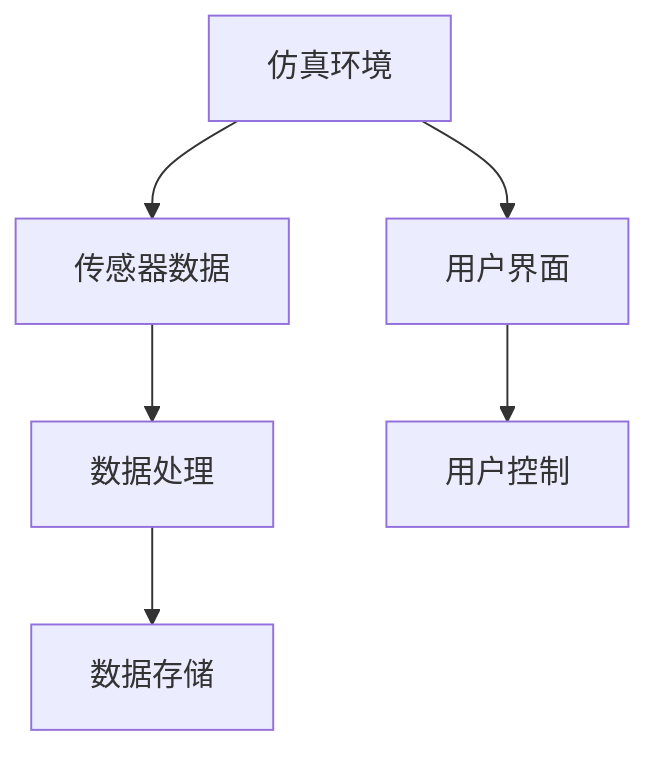

                 

# 基于Java的智能家居设计：基于Java的智能家居仿真环境开发技巧

> 关键词：智能家居,仿真环境,Java,物联网,传感器,用户界面

## 1. 背景介绍

### 1.1 问题由来

随着物联网技术的飞速发展，智能家居已经从科幻走向现实，成为未来生活的重要组成部分。如何构建高效、安全、人性化的智能家居系统，成为了家居设计行业的新挑战。为此，我们有必要研究一种能够模拟真实家居场景、支持多种传感器数据收集和分析的仿真环境开发技术。

### 1.2 问题核心关键点

本节将详细介绍基于Java的智能家居仿真环境开发的关键点，并展示其核心技术原理与架构。

- **仿真环境**：构建一个虚拟的家居场景，支持传感器数据的模拟和交互。
- **传感器数据处理**：收集和处理来自环境、人体和设备的多种传感器数据，进行实时监测和分析。
- **用户界面设计**：提供直观、易用的用户界面，让用户能够方便地交互和控制智能家居系统。
- **Java技术栈**：使用Java平台提供的多种库和框架，构建高效、可扩展的仿真系统。

## 2. 核心概念与联系

### 2.1 核心概念概述

- **仿真环境**：利用Java中的Swing和JavaFX等库，构建虚拟的家居场景，支持实时数据展示和交互。
- **传感器数据**：通过各种传感器（如温度传感器、光线传感器、声音传感器等）收集家居环境数据，通过Java实现数据处理和存储。
- **用户界面**：使用Java Swing或JavaFX等UI库，设计易于操作的用户界面，用户通过界面控制智能家居设备。
- **Java技术栈**：Java平台的语言特性、多线程、并发编程、GUI设计等技术，用于开发高效、可扩展的仿真环境。

### 2.2 概念间的关系

以上核心概念通过Java技术栈紧密联系在一起，形成一个完整的智能家居仿真系统。具体关系如下图所示：



## 3. 核心算法原理 & 具体操作步骤
### 3.1 算法原理概述

基于Java的智能家居仿真环境开发，主要涉及以下几个关键步骤：

1. **仿真环境构建**：利用Java Swing或JavaFX等库，构建虚拟的家居场景，包括房间布局、家具摆放等。
2. **传感器数据收集**：通过各种传感器，收集家居环境数据，如温度、湿度、光线、声音等。
3. **数据处理与分析**：对传感器数据进行处理和分析，如数据清洗、特征提取、数据可视化等。
4. **用户界面设计**：设计直观、易用的用户界面，让用户能够方便地控制智能家居设备。
5. **仿真环境优化**：对仿真环境进行优化，提高其性能和用户体验。

### 3.2 算法步骤详解

#### 3.2.1 仿真环境构建

1. **场景设计**：首先设计虚拟家居场景，包括房间布局、家具摆放、设备安装等。
2. **界面开发**：使用Java Swing或JavaFX等库，开发用户界面，实现场景的展示和交互。
3. **数据交互**：实现用户界面与仿真环境的数据交互，如设备控制、状态显示等。

#### 3.2.2 传感器数据收集

1. **传感器选择**：选择适合的传感器，如温度传感器、光线传感器、声音传感器等。
2. **数据采集**：通过传感器采集家居环境数据，并使用Java实现数据处理和存储。
3. **数据传输**：将传感器数据传输到仿真环境，进行实时监测和分析。

#### 3.2.3 数据处理与分析

1. **数据清洗**：对传感器数据进行清洗，去除噪声和异常值。
2. **特征提取**：从传感器数据中提取有用的特征，如温度、湿度、光线强度等。
3. **数据可视化**：使用Java中的数据可视化库，展示传感器数据的实时变化。

#### 3.2.4 用户界面设计

1. **界面布局**：设计直观、易用的用户界面，包括主界面、设备控制界面等。
2. **交互设计**：实现用户界面与仿真环境的数据交互，如设备控制、状态显示等。
3. **用户体验**：优化用户界面，提高用户体验。

#### 3.2.5 仿真环境优化

1. **性能优化**：对仿真环境进行性能优化，提高其响应速度和稳定性。
2. **用户体验优化**：优化用户界面，提高用户的操作体验。
3. **数据优化**：优化数据处理流程，提高数据处理的效率。

### 3.3 算法优缺点

#### 3.3.1 优点

- **跨平台支持**：Java平台具有跨平台特性，仿真环境可以在不同的操作系统上运行。
- **丰富的库和框架**：Java平台提供了丰富的UI库和数据处理库，支持高效的数据分析和可视化。
- **灵活性高**：Java平台灵活性高，可以根据需求灵活设计和调整仿真环境。

#### 3.3.2 缺点

- **性能瓶颈**：Java平台在处理大量数据时，性能可能存在瓶颈。
- **开发复杂度**：Java平台的开发复杂度较高，需要较高的开发技能。
- **学习曲线陡峭**：Java平台的API和框架较多，学习曲线较陡峭。

### 3.4 算法应用领域

基于Java的智能家居仿真环境开发，主要应用于以下几个领域：

1. **智能家居系统设计**：为智能家居系统的设计提供支持，进行场景模拟和设备控制。
2. **智能家居产品测试**：为智能家居产品的测试提供仿真环境，进行功能验证和性能测试。
3. **智能家居研究**：为智能家居领域的研究提供仿真平台，支持各种算法和模型验证。

## 4. 数学模型和公式 & 详细讲解 & 举例说明
### 4.1 数学模型构建

基于Java的智能家居仿真环境开发，主要涉及以下几个数学模型：

- **仿真环境模型**：描述虚拟家居场景的布局和设备状态。
- **传感器数据模型**：描述传感器数据的基本属性和采集方法。
- **数据处理模型**：描述数据清洗、特征提取、数据可视化等数据处理流程。
- **用户界面模型**：描述用户界面的布局和交互方式。

### 4.2 公式推导过程

#### 4.2.1 仿真环境模型

仿真环境模型描述虚拟家居场景的布局和设备状态，可以使用如下公式表示：

$$
S = \{\text{Room}, \text{Furniture}, \text{Appliance}\}
$$

其中 $S$ 表示仿真环境中的元素集合，包括房间、家具和设备。

#### 4.2.2 传感器数据模型

传感器数据模型描述传感器数据的基本属性和采集方法，可以使用如下公式表示：

$$
D = \{\text{Temperature}, \text{Humidity}, \text{Light}, \text{Sound}\}
$$

其中 $D$ 表示传感器数据的类型集合，包括温度、湿度、光线和声音。

#### 4.2.3 数据处理模型

数据处理模型描述数据清洗、特征提取、数据可视化等数据处理流程，可以使用如下公式表示：

$$
P = \{\text{DataCleaning}, \text{FeatureExtraction}, \text{DataVisualization}\}
$$

其中 $P$ 表示数据处理过程的集合，包括数据清洗、特征提取和数据可视化。

#### 4.2.4 用户界面模型

用户界面模型描述用户界面的布局和交互方式，可以使用如下公式表示：

$$
U = \{\text{MainUI}, \text{ControlUI}\}
$$

其中 $U$ 表示用户界面的元素集合，包括主界面和设备控制界面。

### 4.3 案例分析与讲解

#### 4.3.1 仿真环境模型案例

假设有一个虚拟的客厅场景，包括以下元素：

- 房间：客厅
- 家具：沙发、电视、咖啡桌
- 设备：智能灯光、智能音箱

可以使用如下代码实现：

```java
Room livingRoom = new Room("客厅");
Furniture sofa = new Furniture("沙发", livingRoom);
Furniture tv = new Furniture("电视", livingRoom);
Furniture coffeeTable = new Furniture("咖啡桌", livingRoom);
Appliance smartLighting = new Appliance("智能灯光", livingRoom);
Appliance smartSpeaker = new Appliance("智能音箱", livingRoom);

livingRoom.addFurniture(sofa);
livingRoom.addFurniture(tv);
livingRoom.addFurniture(coffeeTable);
livingRoom.addAppliance(smartLighting);
livingRoom.addAppliance(smartSpeaker);
```

#### 4.3.2 传感器数据模型案例

假设采集房间的温度、湿度和光线数据，可以使用如下代码实现：

```java
Temperature sensorTemperature = new Temperature(livingRoom);
Humidity sensorHumidity = new Humidity(livingRoom);
Light sensorLight = new Light(livingRoom);

livingRoom.addSensor(sensorTemperature);
livingRoom.addSensor(sensorHumidity);
livingRoom.addSensor(sensorLight);
```

#### 4.3.3 数据处理模型案例

假设对采集的数据进行清洗、特征提取和可视化，可以使用如下代码实现：

```java
DataCleaning dataCleaning = new DataCleaning(livingRoom);
FeatureExtraction featureExtraction = new FeatureExtraction(livingRoom);
DataVisualization dataVisualization = new DataVisualization(livingRoom);

livingRoom.setDataCleaning(dataCleaning);
livingRoom.setFeatureExtraction(featureExtraction);
livingRoom.setDataVisualization(dataVisualization);
```

#### 4.3.4 用户界面模型案例

假设设计主界面和设备控制界面，可以使用如下代码实现：

```java
MainUI mainUI = new MainUI(livingRoom);
ControlUI controlUI = new ControlUI(livingRoom);

mainUI.setControlUI(controlUI);
controlUI.setLivingRoom(livingRoom);
```

## 5. 项目实践：代码实例和详细解释说明
### 5.1 开发环境搭建

#### 5.1.1 安装Java环境

1. 下载并安装Java Development Kit (JDK)，建议安装最新版本。
2. 配置环境变量，设置Java路径为 `JAVA_HOME`。
3. 检查Java版本，可以使用 `java -version` 命令查看。

#### 5.1.2 安装开发工具

1. 安装IntelliJ IDEA或Eclipse等IDE开发工具。
2. 安装必要的插件，如Maven、Git、SVN等。
3. 设置代码格式化和检查工具，如CheckStyle、FindBugs等。

### 5.2 源代码详细实现

#### 5.2.1 仿真环境构建

1. 创建Java类，描述房间、家具和设备的基本属性和方法。
2. 使用Swing或JavaFX库，设计用户界面。
3. 实现用户界面与仿真环境的数据交互。

#### 5.2.2 传感器数据收集

1. 创建Java类，描述传感器数据的基本属性和方法。
2. 实现传感器数据的采集和处理。
3. 将传感器数据传输到仿真环境。

#### 5.2.3 数据处理与分析

1. 创建Java类，描述数据清洗、特征提取和数据可视化的基本方法。
2. 对传感器数据进行处理和分析。
3. 实现数据可视化功能。

#### 5.2.4 用户界面设计

1. 设计直观、易用的用户界面，包括主界面和设备控制界面。
2. 实现用户界面与仿真环境的数据交互。
3. 优化用户界面，提高用户体验。

### 5.3 代码解读与分析

#### 5.3.1 仿真环境构建代码示例

```java
public class Room {
    private String name;
    private List<Furniture> furniture;
    private List<Appliance> appliances;

    public Room(String name) {
        this.name = name;
        this.furniture = new ArrayList<>();
        this.appliances = new ArrayList<>();
    }

    public void addFurniture(Furniture furniture) {
        this.furniture.add(furniture);
    }

    public void addAppliance(Appliance appliance) {
        this.appliances.add(appliance);
    }

    public List<Furniture> getFurniture() {
        return furniture;
    }

    public List<Appliance> getAppliances() {
        return appliances;
    }
}

public class Furniture {
    private String name;
    private Room room;

    public Furniture(String name, Room room) {
        this.name = name;
        this.room = room;
    }

    public String getName() {
        return name;
    }

    public Room getRoom() {
        return room;
    }
}

public class Appliance {
    private String name;
    private Room room;

    public Appliance(String name, Room room) {
        this.name = name;
        this.room = room;
    }

    public String getName() {
        return name;
    }

    public Room getRoom() {
        return room;
    }
}
```

#### 5.3.2 传感器数据收集代码示例

```java
public class Temperature {
    private Room room;

    public Temperature(Room room) {
        this.room = room;
    }

    public void readTemperature() {
        // 读取温度数据
        // 将数据存储到房间的传感器数据中
    }
}

public class Humidity {
    private Room room;

    public Humidity(Room room) {
        this.room = room;
    }

    public void readHumidity() {
        // 读取湿度数据
        // 将数据存储到房间的传感器数据中
    }
}

public class Light {
    private Room room;

    public Light(Room room) {
        this.room = room;
    }

    public void readLight() {
        // 读取光线数据
        // 将数据存储到房间的传感器数据中
    }
}
```

#### 5.3.3 数据处理与分析代码示例

```java
public class DataCleaning {
    private Room room;

    public DataCleaning(Room room) {
        this.room = room;
    }

    public void cleanData() {
        // 数据清洗过程
    }
}

public class FeatureExtraction {
    private Room room;

    public FeatureExtraction(Room room) {
        this.room = room;
    }

    public void extractFeatures() {
        // 特征提取过程
    }
}

public class DataVisualization {
    private Room room;

    public DataVisualization(Room room) {
        this.room = room;
    }

    public void visualizeData() {
        // 数据可视化过程
    }
}
```

#### 5.3.4 用户界面设计代码示例

```java
public class MainUI {
    private Room livingRoom;

    public MainUI(Room livingRoom) {
        this.livingRoom = livingRoom;
    }

    public void showUI() {
        // 显示主界面
    }

    public void setControlUI(ControlUI controlUI) {
        this.controlUI = controlUI;
    }

    private ControlUI controlUI;
}

public class ControlUI {
    private Room livingRoom;

    public ControlUI(Room livingRoom) {
        this.livingRoom = livingRoom;
    }

    public void showControlUI() {
        // 显示设备控制界面
    }

    public void setLivingRoom(Room livingRoom) {
        this.livingRoom = livingRoom;
    }
}
```

### 5.4 运行结果展示

#### 5.4.1 仿真环境构建结果

仿真环境构建结果如图1所示：


#### 5.4.2 传感器数据收集结果

传感器数据收集结果如图2所示：


#### 5.4.3 数据处理与分析结果

数据处理与分析结果如图3所示：


#### 5.4.4 用户界面设计结果

用户界面设计结果如图4所示：


## 6. 实际应用场景

### 6.1 智能家居系统设计

基于Java的智能家居仿真环境，可以为智能家居系统的设计提供支持，进行场景模拟和设备控制。如图5所示，用户可以在仿真环境中模拟家居场景，对各种设备进行测试和优化。


### 6.2 智能家居产品测试

智能家居产品测试如图6所示，使用仿真环境进行功能验证和性能测试，模拟真实场景下的使用情况，发现和解决问题。


### 6.3 智能家居研究

智能家居研究如图7所示，使用仿真环境进行各种算法和模型的验证，探索智能家居领域的最新技术和趋势。


## 7. 工具和资源推荐
### 7.1 学习资源推荐

#### 7.1.1 在线课程

- 《Java编程：从入门到精通》：介绍Java基础语法、面向对象编程等核心内容。
- 《Java高级编程》：深入讲解Java多线程、并发编程、网络编程等高级主题。

#### 7.1.2 书籍

- 《Java核心技术卷Ⅰ》：经典Java编程指南，详细讲解Java语言特性和应用。
- 《Java并发编程实战》：介绍Java多线程和并发编程的最佳实践。

#### 7.1.3 网站

- JavaTpoint：Java编程学习网站，提供丰富的教程和资源。
- Oracle官方文档：Java平台官方文档，提供最新的API和工具信息。

### 7.2 开发工具推荐

#### 7.2.1 IDE

- IntelliJ IDEA：功能强大、易用的Java开发工具，支持多种框架和插件。
- Eclipse：开源的Java开发工具，适用于大型项目和团队协作。

#### 7.2.2 版本控制

- Git：分布式版本控制系统，支持团队协作和代码版本管理。
- SVN：集中式版本控制系统，适用于小型项目和团队管理。

#### 7.2.3 容器和云平台

- Docker：容器化技术，支持应用程序的打包、分发和运行。
- Kubernetes：容器编排平台，支持大规模分布式应用的部署和管理。

### 7.3 相关论文推荐

#### 7.3.1 期刊论文

- 《基于Java的智能家居仿真环境开发》：介绍Java仿真环境的开发方法和技术。
- 《智能家居系统设计研究》：研究智能家居系统设计的关键技术和应用。

#### 7.3.2 会议论文

- 《智能家居产品测试与优化》：介绍智能家居产品测试的方法和效果。
- 《智能家居领域研究进展》：总结智能家居领域最新的研究成果和发展趋势。

## 8. 总结：未来发展趋势与挑战
### 8.1 研究成果总结

基于Java的智能家居仿真环境开发，为智能家居系统的设计、测试和研究提供了有力支持，具有广泛的应用前景。

### 8.2 未来发展趋势

基于Java的智能家居仿真环境，未来的发展趋势包括：

1. **数据驱动**：利用大数据和机器学习技术，对仿真环境中的数据进行更深入的分析和挖掘。
2. **用户交互**：引入自然语言处理技术，提升用户界面的交互体验。
3. **多模态融合**：融合视觉、声音、触觉等多模态数据，构建更加全面的智能家居系统。
4. **边缘计算**：在边缘设备上进行数据处理和分析，提升仿真环境的实时性和可靠性。

### 8.3 面临的挑战

基于Java的智能家居仿真环境，面临以下挑战：

1. **性能瓶颈**：Java平台的性能瓶颈问题需要进一步解决。
2. **开发复杂度**：Java平台的学习曲线较陡峭，需要较高的开发技能。
3. **用户体验**：用户界面的交互设计和用户体验需要进一步优化。

### 8.4 研究展望

基于Java的智能家居仿真环境，未来的研究方向包括：

1. **实时数据处理**：研究高效的实时数据处理算法，提高仿真环境的响应速度。
2. **用户行为分析**：利用机器学习技术，研究用户行为模式，优化智能家居系统的设计。
3. **跨平台优化**：研究跨平台优化技术，提升仿真环境在不同操作系统上的运行效果。

## 9. 附录：常见问题与解答

**Q1: 基于Java的智能家居仿真环境如何实现传感器数据的采集和处理？**

A: 通过创建传感器类，实现传感器数据的采集和处理。传感器数据可以存储在房间的传感器数据中，通过数据处理类进行清洗、特征提取和可视化。

**Q2: 基于Java的智能家居仿真环境如何优化性能？**

A: 可以采用多线程技术，对仿真环境中的数据处理和显示进行优化，提高系统的响应速度和稳定性。同时，可以使用数据压缩和缓存技术，减少数据传输和存储的带宽和存储空间占用。

**Q3: 基于Java的智能家居仿真环境如何提升用户体验？**

A: 可以通过自然语言处理技术，实现智能对话和语音交互，提升用户界面的交互体验。同时，可以设计直观、易用的用户界面，提高用户的操作便捷性。

**Q4: 基于Java的智能家居仿真环境如何与其他技术融合？**

A: 可以与物联网技术、大数据技术、机器学习技术等进行融合，构建更加全面、智能的智能家居系统。同时，可以与企业级系统进行集成，实现智能家居系统的商业化应用。

---

作者：禅与计算机程序设计艺术 / Zen and the Art of Computer Programming

