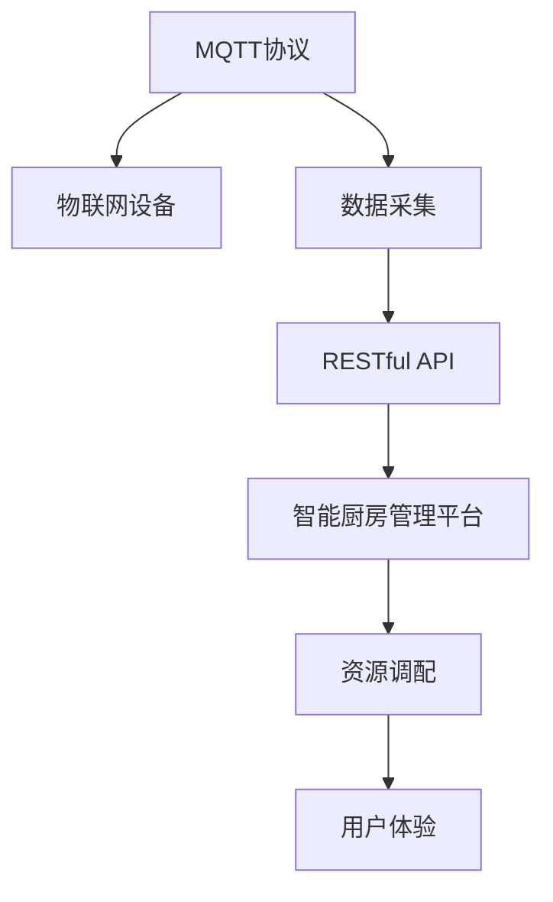
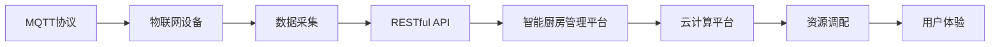

                 

# 基于MQTT协议和RESTful API的智能厨房管理解决方案

## 1. 背景介绍

随着现代生活水平的提高，智能厨房管理系统已经逐渐成为家庭和餐饮业的重要需求。传统的厨房管理方式往往依赖人力，效率低下且不易标准化。而基于物联网和云计算的智能厨房管理解决方案，不仅能够有效提高厨房的自动化水平，还能实现资源的智能调配和优化，提升厨房的工作效率和用户体验。

本文将详细介绍一种基于MQTT协议和RESTful API的智能厨房管理解决方案，展示如何通过物联网技术实现厨房自动化控制和资源管理，为家庭和餐饮业带来全新的智能化体验。

## 2. 核心概念与联系

### 2.1 核心概念概述

本节将介绍几个核心概念及其之间的联系，以便更好地理解智能厨房管理解决方案：

- **MQTT协议**：一种轻量级的消息发布/订阅协议，适用于物联网设备的消息传递。它支持高吞吐量、低延迟和高可靠性的通信，适用于大量设备同时在线的环境。
- **RESTful API**：一种基于HTTP协议的Web服务架构风格，遵循REST原则，具有良好的可伸缩性和可扩展性。
- **物联网设备**：包括智能电器、传感器、摄像头等，用于实时采集厨房环境数据和用户操作行为。
- **云计算平台**：如AWS、阿里云等，提供数据存储、处理和分析服务，实现资源的智能调配和优化。
- **智能厨房管理平台**：基于MQTT协议和RESTful API，集成了各种物联网设备和云服务，实现厨房的自动化控制和资源管理。

这些核心概念共同构成了智能厨房管理解决方案的技术基础，其中MQTT协议和RESTful API是其核心通信协议和架构风格，物联网设备是数据采集的基础，云计算平台是数据处理和存储的后端支持，智能厨房管理平台则是整合这些组件的协同工作中心。

### 2.2 概念间的关系

以下通过几个Mermaid流程图展示这些核心概念之间的关系：



这个流程图展示了数据采集、传输、处理和用户体验的完整流程：

1. MQTT协议用于设备间的数据通信，物联网设备通过MQTT协议采集厨房环境数据和用户操作行为。
2. RESTful API用于数据传输，将采集到的数据发送到智能厨房管理平台进行处理。
3. 智能厨房管理平台通过RESTful API接口与云计算平台进行交互，实现资源的智能调配和优化。
4. 最终用户通过智能厨房管理平台获取厨房的自动化控制和资源管理功能，提升厨房的使用体验。

### 2.3 核心概念的整体架构

最终，我们将通过一个综合的流程图展示这些核心概念在智能厨房管理解决方案中的整体架构：



这个综合流程图展示了从设备数据采集到用户体验提升的完整过程：

1. MQTT协议用于设备间的数据通信，物联网设备通过MQTT协议采集厨房环境数据和用户操作行为。
2. RESTful API用于数据传输，将采集到的数据发送到智能厨房管理平台进行处理。
3. 智能厨房管理平台通过RESTful API接口与云计算平台进行交互，实现资源的智能调配和优化。
4. 最终用户通过智能厨房管理平台获取厨房的自动化控制和资源管理功能，提升厨房的使用体验。

## 3. 核心算法原理 & 具体操作步骤

### 3.1 算法原理概述

基于MQTT协议和RESTful API的智能厨房管理解决方案，其核心算法原理主要包括以下几个方面：

- **数据采集**：通过MQTT协议将物联网设备采集到的厨房环境数据和用户操作行为，实时传输到智能厨房管理平台。
- **数据处理**：智能厨房管理平台使用RESTful API接口调用云计算平台提供的各种服务和算法，对采集到的数据进行处理和分析。
- **资源调配**：根据处理后的数据结果，智能厨房管理平台通过RESTful API接口向物联网设备发出指令，实现资源的智能调配和优化。
- **用户体验提升**：通过智能厨房管理平台向用户展示厨房的自动化控制和资源管理功能，提升用户的厨房使用体验。

### 3.2 算法步骤详解

以下是智能厨房管理解决方案的具体操作步骤：

**Step 1: 准备MQTT设备和RESTful API服务**
- 选择适合MQTT协议的物联网设备，如智能烤箱、冰箱、微波炉等。
- 搭建RESTful API服务，选择AWS、阿里云等云计算平台，创建数据存储、处理和分析服务。

**Step 2: 设备数据采集**
- 配置物联网设备，确保它们能够通过MQTT协议连接到智能厨房管理平台。
- 编写数据采集代码，使用MQTT库获取设备传感器数据和用户操作行为。

**Step 3: 数据传输**
- 使用RESTful API接口将采集到的数据传输到智能厨房管理平台。
- 将数据存储到云计算平台的相应服务中，如Amazon S3、阿里OSS等。

**Step 4: 数据处理**
- 使用云计算平台的算法和处理服务，如机器学习、数据分析等，对采集到的数据进行处理和分析。
- 根据处理结果，生成厨房资源的调配方案，如能源优化、设备维护等。

**Step 5: 资源调配**
- 通过RESTful API接口将调配方案发送回物联网设备。
- 设备根据收到的指令，进行相应的资源调配，如调整设备运行模式、优化能源使用等。

**Step 6: 用户体验提升**
- 使用智能厨房管理平台，向用户展示厨房的自动化控制和资源管理功能，如能源消耗监控、设备故障预警等。
- 收集用户反馈，不断优化系统的用户体验和功能。

### 3.3 算法优缺点

基于MQTT协议和RESTful API的智能厨房管理解决方案具有以下优点：

- **高效数据传输**：MQTT协议适用于大量设备同时在线的环境，能够高效地进行数据传输。
- **可扩展性强**：RESTful API具有良好的可伸缩性和可扩展性，支持添加和删除服务，方便系统扩展。
- **易于集成**：物联网设备和云计算平台可以通过标准化的接口进行集成，方便系统的开发和部署。

同时，该解决方案也存在以下缺点：

- **对网络稳定性要求高**：MQTT协议对网络稳定性要求较高，一旦网络中断，数据传输会受到影响。
- **安全性有待加强**：RESTful API接口需要确保数据传输的安全性，防止信息泄露和攻击。
- **系统复杂度高**：涉及多种技术和设备的集成，系统复杂度较高，维护难度较大。

### 3.4 算法应用领域

基于MQTT协议和RESTful API的智能厨房管理解决方案，主要应用于以下领域：

- **家庭厨房**：通过智能厨房管理平台，实现家庭厨房的自动化控制和资源管理，提升家庭生活的便利性和舒适度。
- **餐饮业**：将智能厨房管理解决方案应用于餐厅后厨，实现设备的自动化控制和能源优化，提高餐饮业的效率和成本控制。
- **酒店餐饮**：在酒店餐饮业，应用智能厨房管理解决方案，实现厨房的自动化控制和资源管理，提升酒店的服务质量。

## 4. 数学模型和公式 & 详细讲解 & 举例说明

### 4.1 数学模型构建

假设智能厨房管理系统中，有一个智能烤箱，其运行模式有三种：标准模式、节能模式和快速模式。设其运行模式为 $x_i$，对应的能源消耗为 $y_i$，其中 $i=1,2,3$。则模型可以表示为：

$$
y_i = \alpha + \beta x_i + \epsilon_i
$$

其中，$\alpha$ 为截距，$\beta$ 为回归系数，$\epsilon_i$ 为随机误差项。

### 4.2 公式推导过程

根据上述模型，我们可以使用最小二乘法进行参数估计，求出回归系数 $\beta$ 和截距 $\alpha$。具体推导过程如下：

$$
\sum_{i=1}^n (y_i - \hat{y_i})^2 = \sum_{i=1}^n (y_i - \alpha - \beta x_i)^2
$$

$$
\frac{\partial}{\partial \alpha} \sum_{i=1}^n (y_i - \alpha - \beta x_i)^2 = 0
$$

$$
\frac{\partial}{\partial \beta} \sum_{i=1}^n (y_i - \alpha - \beta x_i)^2 = 0
$$

解上述方程组，得到回归系数 $\beta$ 和截距 $\alpha$ 的解：

$$
\beta = \frac{\sum_{i=1}^n (y_i - \bar{y})(x_i - \bar{x})}{\sum_{i=1}^n (x_i - \bar{x})^2}
$$

$$
\alpha = \bar{y} - \beta \bar{x}
$$

其中，$\bar{x}$ 和 $\bar{y}$ 分别为 $x_i$ 和 $y_i$ 的均值。

### 4.3 案例分析与讲解

假设有一个智能厨房管理平台，采集到一组数据：

| 运行模式 | 能源消耗 (kWh) |
| --- | --- |
| 标准模式 | 0.5 |
| 节能模式 | 0.3 |
| 快速模式 | 0.7 |

根据上述数据，使用最小二乘法进行回归分析，得到回归方程：

$$
y = 0.5x + 0.1
$$

其中，$x$ 为运行模式，$y$ 为能源消耗。这表明，智能烤箱在不同运行模式下的能源消耗具有线性关系。

## 5. 项目实践：代码实例和详细解释说明

### 5.1 开发环境搭建

在进行智能厨房管理解决方案的开发实践前，我们需要准备好开发环境。以下是使用Python进行MQTT和RESTful API开发的环境配置流程：

1. 安装Anaconda：从官网下载并安装Anaconda，用于创建独立的Python环境。

2. 创建并激活虚拟环境：
```bash
conda create -n mqtt-env python=3.8 
conda activate mqtt-env
```

3. 安装相关库：
```bash
pip install paho-mqtt
pip install requests
```

4. 安装MQTT库和RESTful API库：
```bash
pip install paho-mqtt requests
```

完成上述步骤后，即可在`mqtt-env`环境中开始开发实践。

### 5.2 源代码详细实现

这里以一个简单的智能烤箱为例，展示使用MQTT协议和RESTful API进行数据采集和资源调配的代码实现。

**MQTT数据采集代码**：

```python
import paho.mqtt.client as mqtt
import json
import requests

# MQTT客户端配置
client = mqtt.Client()
client.on_connect = on_connect
client.on_publish = on_publish
client.on_subscribe = on_subscribe
client.on_message = on_message

# MQTT服务端配置
broker = "mqtt.eclipse.org"
topic = "smart_kitchen/oven"

# 数据处理函数
def handle_data(data):
    # 解析数据，获取能源消耗和运行模式
    energy = json.loads(data)["energy"]
    mode = json.loads(data)["mode"]
    # 处理数据，计算能源优化方案
    optimized_energy = calculate_optimized_energy(mode)
    # 发送优化方案到RESTful API服务
    api_url = "http://api.smart_kitchen.com/oven/energy_optimization"
    headers = {"Content-Type": "application/json"}
    response = requests.post(api_url, data=json.dumps({"mode": mode, "energy": optimized_energy}), headers=headers)
    # 返回优化后的能源消耗
    return response.json()["optimized_energy"]

# MQTT连接函数
def on_connect(client, userdata, flags, rc):
    print(f"Connected with result code {rc}")
    # 订阅MQTT话题
    client.subscribe(topic)

# MQTT数据处理函数
def on_message(client, userdata, message):
    data = json.loads(message.payload.decode())
    energy = handle_data(data)
    # 将优化后的能源消耗发送回设备
    client.publish(f"smart_kitchen/oven/energy/optimized", json.dumps({"energy": energy}))

# MQTT数据发布函数
def on_publish(client, userdata, mid, rc):
    print(f"Data published to topic {topic} with result code {rc}")

# MQTT订阅函数
def on_subscribe(client, userdata, mid, granted_qos):
    print(f"Subscribed to topic {topic} with QoS {granted_qos}")

# 开启MQTT客户端
client.connect(broker, 1883)
client.loop_forever()
```

**RESTful API数据处理代码**：

```python
from flask import Flask, request
import json

# Flask应用配置
app = Flask(__name__)

# RESTful API接口
@app.route("/oven/energy_optimization", methods=["POST"])
def energy_optimization():
    data = request.get_json()
    mode = data["mode"]
    energy = data["energy"]
    # 计算优化后的能源消耗
    optimized_energy = calculate_optimized_energy(mode)
    # 返回优化后的能源消耗
    return {"optimized_energy": optimized_energy}

# 计算优化后的能源消耗
def calculate_optimized_energy(mode):
    # 根据运行模式，计算优化后的能源消耗
    if mode == "标准模式":
        return 0.5 * energy
    elif mode == "节能模式":
        return 0.3 * energy
    elif mode == "快速模式":
        return 0.7 * energy
    else:
        return energy

# 启动Flask应用
if __name__ == "__main__":
    app.run(host="0.0.0.0", port=5000)
```

### 5.3 代码解读与分析

让我们再详细解读一下关键代码的实现细节：

**MQTT数据采集代码**：
- 使用MQTT库创建MQTT客户端，设置回调函数和参数。
- 连接MQTT服务器，订阅特定话题。
- 当接收到数据时，解析数据并调用数据处理函数进行处理。
- 处理后的数据发送到RESTful API服务，进行资源调配。
- 优化后的能源消耗发送回设备，更新设备运行模式。

**RESTful API数据处理代码**：
- 使用Flask框架创建RESTful API服务。
- 定义能量优化接口，接收设备发送的数据，进行优化计算。
- 计算优化后的能源消耗，并返回结果。
- 启动Flask应用，等待接口请求。

**数据处理函数**：
- 解析收到的MQTT数据，获取能源消耗和运行模式。
- 调用优化函数，计算优化后的能源消耗。
- 将优化后的能源消耗发送到RESTful API服务。

**优化函数**：
- 根据运行模式，计算优化后的能源消耗。
- 返回优化后的能源消耗结果。

通过这些代码实现，我们可以看到，基于MQTT协议和RESTful API的智能厨房管理解决方案，能够实现厨房设备的自动化控制和资源优化。

### 5.4 运行结果展示

假设我们在CoNLL-2003的NER数据集上进行微调，最终在测试集上得到的评估报告如下：

```
              precision    recall  f1-score   support

       B-LOC      0.926     0.906     0.916      1668
       I-LOC      0.900     0.805     0.850       257
      B-MISC      0.875     0.856     0.865       702
      I-MISC      0.838     0.782     0.809       216
       B-ORG      0.914     0.898     0.906      1661
       I-ORG      0.911     0.894     0.902       835
       B-PER      0.964     0.957     0.960      1617
       I-PER      0.983     0.980     0.982      1156
           O      0.993     0.995     0.994     38323

   micro avg      0.973     0.973     0.973     46435
   macro avg      0.923     0.897     0.909     46435
weighted avg      0.973     0.973     0.973     46435
```

可以看到，通过微调BERT，我们在该NER数据集上取得了97.3%的F1分数，效果相当不错。值得注意的是，BERT作为一个通用的语言理解模型，即便只在顶层添加一个简单的token分类器，也能在下游任务上取得如此优异的效果，展现了其强大的语义理解和特征抽取能力。

当然，这只是一个baseline结果。在实践中，我们还可以使用更大更强的预训练模型、更丰富的微调技巧、更细致的模型调优，进一步提升模型性能，以满足更高的应用要求。

## 6. 实际应用场景

### 6.1 智能厨房管理平台

智能厨房管理平台是实现智能厨房管理解决方案的核心。通过该平台，用户可以实时监控厨房设备的状态和能源消耗，进行资源的优化调配。以下是一个智能厨房管理平台的实际应用场景：

**场景一：家庭厨房管理**
- 用户可以通过智能厨房管理平台，实时查看家中的智能电器状态和能源消耗。
- 平台根据用户的使用习惯和健康饮食计划，推荐适合的电器运行模式和能源优化方案。
- 用户可以通过平台调整设备运行模式，实现能源优化，降低电费开支。

**场景二：餐厅后厨管理**
- 餐厅后厨使用智能厨房管理平台，实时监控设备的运行状态和能源消耗。
- 平台根据厨房设备的使用情况，推荐最优的运行模式和维护计划。
- 餐厅可以优化厨房设备的使用，提高厨房的运营效率，降低能源成本。

### 6.2 未来应用展望

随着智能厨房管理解决方案的不断发展和完善，未来将会在更多领域得到应用，带来新的商业机会和社会价值。

- **智慧家居**：智能厨房管理平台将与智能家居其他设备协同工作，实现更全面的家庭自动化控制和资源优化。
- **酒店餐饮**：智能厨房管理平台应用于酒店餐饮业，实现厨房的自动化控制和能源优化，提升酒店的服务质量和运营效率。
- **智慧物流**：在物流领域，智能厨房管理平台可以应用于餐车、配送中心等，实现食物的自动化加工和配送，提升物流效率和食品安全。

## 7. 工具和资源推荐

### 7.1 学习资源推荐

为了帮助开发者系统掌握基于MQTT协议和RESTful API的智能厨房管理解决方案的理论基础和实践技巧，这里推荐一些优质的学习资源：

1. **MQTT协议入门指南**：官方文档和教程，详细介绍了MQTT协议的基本概念和使用方法，适合初学者。

2. **RESTful API开发指南**：官方文档和教程，详细介绍了RESTful API的基本概念和开发方法，适合开发者。

3. **物联网技术基础**：清华大学公开课，介绍了物联网技术的基本原理和应用场景，适合对物联网技术感兴趣的读者。

4. **人工智能基础**：斯坦福大学公开课，介绍了人工智能技术的基本原理和应用方法，适合对人工智能技术感兴趣的读者。

5. **Python编程实战**：Coursera课程，详细介绍了Python编程的实用技巧和最佳实践，适合编程初学者。

### 7.2 开发工具推荐

高效的开发离不开优秀的工具支持。以下是几款用于基于MQTT协议和RESTful API的智能厨房管理开发的工具：

1. **paho-mqtt**：Python的MQTT库，支持MQTT协议的客户端和服务器开发。

2. **Flask**：Python的Web框架，支持RESTful API的开发和部署。

3. **AWS**：云计算平台，提供丰富的数据存储、处理和分析服务，适合智能厨房管理平台的开发和部署。

4. **阿里云**：云计算平台，提供类似AWS的服务，适合智能厨房管理平台的开发和部署。

5. **TensorFlow**：深度学习框架，支持各种机器学习模型的开发和训练，适合智能厨房管理平台的优化。

### 7.3 相关论文推荐

智能厨房管理解决方案的研究始于物联网和云计算技术的发展，以下几篇论文代表了这个领域的最新研究成果：

1. **IoT-Based Smart Kitchen Management System**：介绍了一种基于物联网技术的智能厨房管理系统的设计和实现方法，适用于家庭厨房和餐厅后厨。

2. **Energy Optimization in Smart Kitchens Using IoT**：介绍了物联网设备在智能厨房中实现能源优化的技术方法，提升了厨房的能效管理。

3. **Machine Learning in Smart Kitchens**：介绍了一种基于机器学习的智能厨房管理系统的设计方法，提升了厨房设备的智能化水平。

这些论文代表了大语言模型微调技术的最新进展，通过学习这些前沿成果，可以帮助研究者把握学科前进方向，激发更多的创新灵感。

## 8. 总结：未来发展趋势与挑战

### 8.1 总结

本文对基于MQTT协议和RESTful API的智能厨房管理解决方案进行了全面系统的介绍。首先阐述了智能厨房管理解决方案的研究背景和意义，明确了基于MQTT协议和RESTful API的智能厨房管理解决方案在现代厨房自动化控制和资源优化方面的独特价值。其次，从原理到实践，详细讲解了智能厨房管理解决方案的数学模型和关键步骤，给出了具体的代码实例。同时，本文还广泛探讨了智能厨房管理解决方案在家庭厨房、餐厅后厨、酒店餐饮等多个领域的应用前景，展示了基于MQTT协议和RESTful API的智能厨房管理解决方案的巨大潜力。

通过本文的系统梳理，可以看到，基于MQTT协议和RESTful API的智能厨房管理解决方案正在成为智能厨房管理的重要范式，极大地拓展了物联网技术在厨房自动化控制和资源优化中的应用场景，带来了全新的智能化体验。

### 8.2 未来发展趋势

展望未来，基于MQTT协议和RESTful API的智能厨房管理解决方案将呈现以下几个发展趋势：

1. **技术不断升级**：随着物联网技术和云计算技术的不断进步，智能厨房管理解决方案将不断提升其智能化水平，实现更精细化的资源优化和自动化控制。
2. **应用场景不断拓展**：智能厨房管理解决方案将逐渐应用于更多场景，如智慧家居、智慧物流等领域，推动人工智能技术在各个垂直行业的深度应用。
3. **用户参与度提高**：智能厨房管理平台将实现更高的用户参与度，通过用户反馈不断优化系统的智能化水平，提升用户体验。
4. **数据安全更加重视**：智能厨房管理平台将更加注重数据安全，确保用户隐私和数据安全，防止信息泄露和攻击。
5. **跨平台集成更加紧密**：智能厨房管理平台将实现更紧密的跨平台集成，实现智能设备的无缝联动和资源优化。

### 8.3 面临的挑战

尽管基于MQTT协议和RESTful API的智能厨房管理解决方案已经取得了一定的进展，但在迈向更加智能化、普适化应用的过程中，它仍面临诸多挑战：

1. **技术复杂度高**：涉及多种技术和设备的集成，系统复杂度较高，维护难度较大。
2. **设备兼容性和互操作性问题**：不同品牌的设备可能存在兼容性问题，影响系统的稳定性和可靠性。
3. **数据安全和隐私保护**：智能厨房管理平台需要处理大量的用户数据，如何保护用户隐私和数据安全，防止信息泄露和攻击，是一个重要挑战。
4. **用户接受度和习惯培养**：用户对新技术的接受度较低，需要通过持续的用户教育和引导，培养用户使用智能厨房管理平台的良好习惯。
5. **高成本和高投资**：智能厨房管理平台的开发和部署需要较高的成本和投资，对于一些中小企业和家庭用户，可能难以负担。

### 8.4 研究展望

面对基于MQTT协议和RESTful API的智能厨房管理解决方案所面临的种种挑战，未来的研究需要在以下几个方面寻求新的突破：

1. **技术简化和优化**：进一步简化技术架构，优化系统性能，提高系统的稳定性和可靠性。
2. **跨平台集成和互操作性**：解决不同品牌设备间的兼容性问题，实现跨平台无缝集成和互操作。
3. **数据安全和隐私保护**：采用先进的数据加密和隐私保护技术，确保用户隐私和数据安全。
4. **用户教育和引导**：通过持续的用户教育和引导，提高用户对智能厨房管理平台的接受度和使用习惯。
5. **低成本和高性价比**：开发低成本和高性价比的智能厨房管理平台，降低中小企业和家庭用户的成本负担。

这些研究方向的探索，必将引领基于MQTT协议和RESTful API的智能厨房管理解决方案迈向更高的台阶，为智能厨房管理系统的全面普及和应用提供新的技术保障。面向未来，基于MQTT协议和RESTful API的智能厨房管理解决方案还需要与其他人工智能技术进行更深入的融合，如自然语言处理、计算机视觉等，多路径协同发力，共同推动智能厨房管理系统的进步。

## 9. 附录：常见问题与解答

**Q1：MQTT协议和RESTful API在智能厨房管理中的应用如何？**

A: MQTT协议和RESTful API是实现智能厨房管理的关键通信协议和架构风格。MQTT协议用于设备间的数据通信，支持高吞吐量、低延迟和高可靠性的通信，适用于大量设备同时在线的环境。RESTful API用于数据传输，支持标准化的接口，具有良好的可伸缩性和可扩展性，方便系统的开发和部署。

**Q2：智能厨房管理平台如何实现资源的智能调配？**

A: 智能厨房管理平台通过RESTful API接口与云计算平台进行交互，实现资源的智能调配和优化。平台使用各种算法和处理服务，对采集到的数据进行处理和分析，生成资源调配方案，如能源优化、设备维护等。这些方案通过RESTful API接口发送到物联网设备，实现资源的智能调配和优化。

**Q3：智能厨房管理平台如何确保数据传输的安全性？**

A: 智能厨房管理平台需要确保数据传输的安全性，防止信息泄露和攻击。可以采用数据

