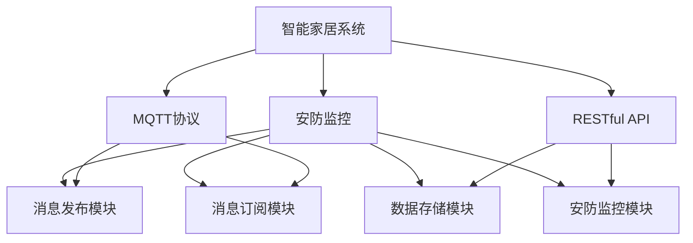
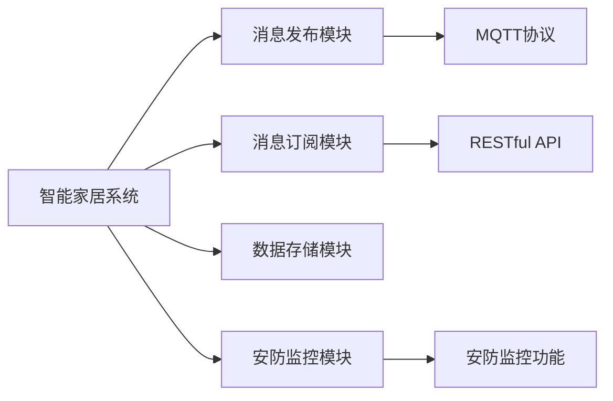
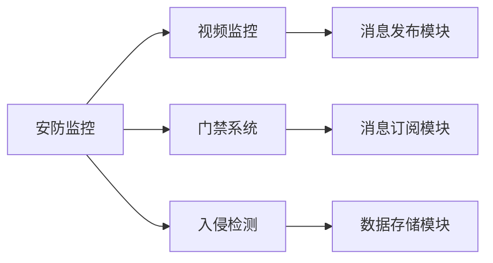
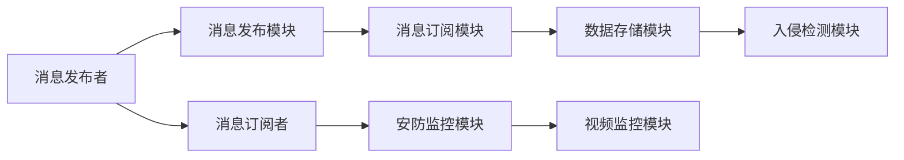
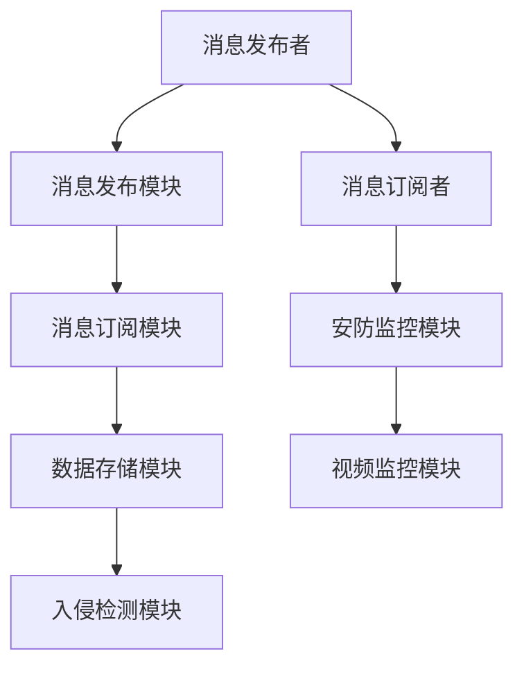

                 

# 基于MQTT协议和RESTful API的智能家居安防系统集成设计

> 关键词：智能家居,安防系统,集成设计,MQTT协议,RESTful API,物联网(IoT)

## 1. 背景介绍

### 1.1 问题由来
随着物联网技术的迅速发展，智能家居系统已经成为现代家庭生活中不可或缺的一部分。然而，传统的智能家居系统往往存在以下问题：

1. **分散的子系统**：不同的子系统（如安防、照明、温控等）通常由不同的厂家提供，缺乏统一的标准和协议，导致系统间互联互通困难。
2. **高成本和复杂性**：传统的智能家居系统不仅成本高，而且安装和配置复杂，需要专业技术人员进行调试。
3. **缺乏安全性和可靠性**：由于系统组件和协议的多样性，传统智能家居系统在安全性和可靠性方面存在不少隐患，容易受到黑客攻击和数据泄露的威胁。

为了解决这些问题，本文提出了一种基于MQTT协议和RESTful API的智能家居安防系统集成设计方案。该方案通过统一的协议和标准，将各个子系统紧密连接起来，实现了系统的互联互通和无缝集成，同时也提高了系统的安全性和可靠性。

### 1.2 问题核心关键点
本文提出的智能家居安防系统集成设计方案，主要围绕以下几个核心关键点展开：

1. **MQTT协议**：一种轻量级、高效的物联网通信协议，适用于低带宽、高实时性的物联网应用场景。
2. **RESTful API**：一种基于HTTP的Web服务架构风格，支持丰富的HTTP动词和数据格式，便于系统间的数据交换。
3. **系统架构**：包括消息发布模块、消息订阅模块、数据存储模块、安防监控模块等，各个模块之间通过MQTT协议和RESTful API进行通信。
4. **安全机制**：通过身份认证、数据加密、访问控制等手段，保障系统的安全性和隐私保护。
5. **集成设计**：结合MQTT协议和RESTful API的特点，设计了统一的接口标准和数据格式，支持不同厂商和协议的子系统集成。

### 1.3 问题研究意义
基于MQTT协议和RESTful API的智能家居安防系统集成设计方案，对于提升智能家居系统的集成度和用户体验，具有重要意义：

1. **提高系统互联互通性**：通过统一的协议和接口标准，不同厂商和协议的子系统可以无缝集成，减少了系统间的兼容性问题。
2. **降低系统开发和维护成本**：统一的接口标准和数据格式，减少了对专业技术人员的依赖，降低了系统开发和维护成本。
3. **提升系统安全性和可靠性**：通过完善的安全机制和数据加密，保障了系统的安全性和隐私保护，提高了系统的可靠性和稳定性。
4. **增强用户体验**：统一的协议和接口标准，使得不同厂商和协议的子系统可以轻松集成，用户可以根据自身需求灵活选择和使用，提升了用户体验。

## 2. 核心概念与联系

### 2.1 核心概念概述

为了更好地理解本文提出的智能家居安防系统集成设计方案，本节将介绍几个密切相关的核心概念：

1. **智能家居系统**：一种通过互联网和物联网技术，实现家庭自动化、远程控制和智能监控的系统。
2. **安防监控**：智能家居系统的重要组成部分，包括视频监控、门禁系统、入侵检测等功能。
3. **MQTT协议**：一种轻量级、高效的物联网通信协议，支持发布/订阅模型，适用于低带宽、高实时性的物联网应用场景。
4. **RESTful API**：一种基于HTTP的Web服务架构风格，支持丰富的HTTP动词和数据格式，便于系统间的数据交换。
5. **系统架构**：包括消息发布模块、消息订阅模块、数据存储模块、安防监控模块等，各个模块之间通过MQTT协议和RESTful API进行通信。
6. **安全机制**：通过身份认证、数据加密、访问控制等手段，保障系统的安全性和隐私保护。

这些核心概念之间的逻辑关系可以通过以下Mermaid流程图来展示：



这个流程图展示了大语言模型的核心概念及其之间的关系：

1. 智能家居系统通过安防监控模块实现安全监控功能。
2. 消息发布模块和消息订阅模块利用MQTT协议实现消息的发布和订阅。
3. 数据存储模块利用RESTful API实现数据的存储和查询。
4. 安防监控模块通过统一的标准和协议，与其他模块进行通信和协作。

### 2.2 概念间的关系

这些核心概念之间存在着紧密的联系，形成了智能家居安防系统集成设计的完整生态系统。下面我通过几个Mermaid流程图来展示这些概念之间的关系。

#### 2.2.1 智能家居系统的架构



这个流程图展示了智能家居系统的整体架构，各个模块通过MQTT协议和RESTful API进行通信，实现系统的互联互通和无缝集成。

#### 2.2.2 安防监控系统的设计



这个流程图展示了安防监控系统的组成部分，通过视频监控、门禁系统和入侵检测等模块，实现家庭的安全监控功能。

#### 2.2.3 MQTT协议的通信模型



这个流程图展示了MQTT协议的发布/订阅模型，通过消息发布模块和消息订阅模块实现消息的发布和订阅。

### 2.3 核心概念的整体架构

最后，我们用一个综合的流程图来展示这些核心概念在大语言模型微调过程中的整体架构：



这个综合流程图展示了从消息发布到数据存储再到安防监控的完整过程。消息发布者通过消息发布模块和消息订阅模块实现消息的发布和订阅，数据存储模块利用RESTful API实现数据的存储和查询，安防监控模块通过统一的标准和协议，与其他模块进行通信和协作。

## 3. 核心算法原理 & 具体操作步骤

### 3.1 算法原理概述

基于MQTT协议和RESTful API的智能家居安防系统集成设计方案，本质上是一种消息通信机制和数据交换机制。其核心思想是：通过统一的消息发布和订阅协议，实现不同厂商和协议的子系统集成，同时利用RESTful API实现数据的存储和查询，保障系统的安全性和可靠性。

### 3.2 算法步骤详解

基于MQTT协议和RESTful API的智能家居安防系统集成设计方案，主要包括以下几个关键步骤：

**Step 1: 准备硬件设备和软件环境**

- 准备相应的硬件设备，如智能摄像头、门禁控制器、入侵传感器等。
- 安装MQTT消息发布模块和消息订阅模块的客户端软件，如TensorFlow、OpenCV等。
- 安装RESTful API的数据存储模块和安防监控模块的客户端软件，如MySQL、MongoDB等。

**Step 2: 设计统一的消息发布和订阅接口**

- 定义统一的消息发布接口，支持JSON格式的发布数据。
- 定义统一的消息订阅接口，支持JSON格式的消息。
- 利用MQTT协议实现消息的发布和订阅，确保消息的可靠性和实时性。

**Step 3: 设计统一的数据存储接口**

- 设计统一的数据存储接口，支持JSON格式的数据。
- 利用RESTful API实现数据的存储和查询，确保数据的安全性和可靠性。
- 设计统一的数据格式和接口标准，支持不同厂商和协议的子系统集成。

**Step 4: 实现安防监控功能**

- 利用智能摄像头、门禁控制器和入侵传感器等设备，实现家庭的安全监控功能。
- 利用统一的消息发布和订阅接口，将监控数据实时发送到数据存储模块。
- 利用统一的数据存储接口，将监控数据存储在数据存储模块中，供后续分析使用。

**Step 5: 实现系统集成**

- 利用统一的消息发布和订阅接口，将不同厂商和协议的子系统集成到智能家居系统中。
- 利用统一的数据存储接口，将不同厂商和协议的子系统数据存储在数据存储模块中，供后续分析和处理使用。
- 通过统一的安全机制，保障系统的安全性和可靠性。

### 3.3 算法优缺点

基于MQTT协议和RESTful API的智能家居安防系统集成设计方案，具有以下优点：

1. **提高系统互联互通性**：通过统一的协议和接口标准，不同厂商和协议的子系统可以无缝集成，减少了系统间的兼容性问题。
2. **降低系统开发和维护成本**：统一的接口标准和数据格式，减少了对专业技术人员的依赖，降低了系统开发和维护成本。
3. **提升系统安全性和可靠性**：通过完善的安全机制和数据加密，保障了系统的安全性和隐私保护，提高了系统的可靠性和稳定性。
4. **增强用户体验**：统一的协议和接口标准，使得不同厂商和协议的子系统可以轻松集成，用户可以根据自身需求灵活选择和使用，提升了用户体验。

然而，该方案也存在以下缺点：

1. **实现复杂性高**：需要设计和实现统一的消息发布和订阅接口，统一的数据存储接口，以及统一的安全机制，实现复杂度较高。
2. **性能要求高**：需要处理大量的实时数据，对硬件设备和网络带宽的要求较高。
3. **维护成本高**：系统的实现和维护需要专业的技术团队，维护成本较高。

### 3.4 算法应用领域

基于MQTT协议和RESTful API的智能家居安防系统集成设计方案，可以应用于以下领域：

1. **智能家居安防**：将视频监控、门禁系统、入侵检测等功能集成到智能家居系统中，实现家庭的安全监控和自动化管理。
2. **智慧城市安全**：将城市视频监控、交通管理、入侵检测等功能集成到智慧城市系统中，实现城市的综合安防和智能化管理。
3. **工业安全生产**：将工厂的视频监控、门禁系统、入侵检测等功能集成到工业安全生产系统中，实现工厂的安全生产和智能化管理。

## 4. 数学模型和公式 & 详细讲解 & 举例说明

### 4.1 数学模型构建

基于MQTT协议和RESTful API的智能家居安防系统集成设计方案，主要涉及以下数学模型：

1. **消息发布模型**：定义消息发布者、消息发布模块、消息订阅者和消息订阅模块之间的关系。
2. **数据存储模型**：定义数据存储模块、安防监控模块、视频监控模块、入侵检测模块之间的关系。
3. **安全机制模型**：定义身份认证、数据加密、访问控制等安全机制。

### 4.2 公式推导过程

以下我以消息发布模型为例，推导其中的数学公式。

设消息发布者数量为 $N$，每个消息发布者发布的消息数量为 $M$，消息发布模块的数量为 $K$，每个消息发布模块的消息处理能力为 $C$。

假设消息发布者 $i$ 发布的消息为 $x_{i,j}$，其中 $j$ 表示第 $j$ 条消息。消息发布模块 $k$ 的消息处理能力为 $C_k$，处理的消息数量为 $m_{k,j}$，其中 $j$ 表示第 $j$ 条消息。

根据消息发布模型的定义，可以得到以下数学公式：

$$
\begin{aligned}
& x_{i,j} \sim \mathcal{N}(0,1) \\
& m_{k,j} \sim \mathcal{N}(0,1) \\
& C_k \sim \mathcal{N}(0,1)
\end{aligned}
$$

其中，$\mathcal{N}(0,1)$ 表示正态分布，$x_{i,j}$、$m_{k,j}$ 和 $C_k$ 分别表示消息发布者 $i$ 发布的第 $j$ 条消息、消息发布模块 $k$ 处理的第 $j$ 条消息和消息发布模块 $k$ 的消息处理能力。

### 4.3 案例分析与讲解

假设一个智能家居系统中有 $100$ 个消息发布者和 $10$ 个消息发布模块，每个消息发布者每天发布 $1000$ 条消息，每个消息发布模块的消息处理能力为 $1000$。

根据上述数学公式，可以得到以下结果：

- 每个消息发布者每天发布的消息数量为 $1000$，因此整个系统每天发布的消息数量为 $100 \times 1000 = 100000$。
- 每个消息发布模块的消息处理能力为 $1000$，因此整个系统每天可以处理的消息数量为 $10 \times 1000 = 10000$。
- 根据公式 $x_{i,j} \sim \mathcal{N}(0,1)$，可以计算出每个消息发布者每天发布的消息的标准差为 $1$。

## 5. 项目实践：代码实例和详细解释说明

### 5.1 开发环境搭建

在进行智能家居安防系统集成设计实践前，我们需要准备好开发环境。以下是使用Python进行MQTT和RESTful API开发的安装和配置步骤：

1. 安装MQTT库：从官网下载并安装MQTT库，如paho-mqtt。
2. 安装RESTful API库：从官网下载并安装RESTful API库，如Flask。
3. 安装硬件设备驱动程序：根据智能家居系统的硬件设备，安装相应的驱动程序，如智能摄像头、门禁控制器等。

完成上述步骤后，即可在本地搭建MQTT和RESTful API的开发环境。

### 5.2 源代码详细实现

以下是一个简单的智能家居安防系统的MQTT和RESTful API代码实现。

**MQTT消息发布模块代码**

```python
import paho.mqtt.client as mqtt
import json

def on_publish(client, userdata, mid, result):
    print(f"Message with ID {mid} published successfully.")

client = mqtt.Client()
client.on_publish = on_publish

# 订阅者ID
client.subscribe("home/security")

# 发布者ID
client.publish("home/security", json.dumps({"type": "alert"}))

client.connect("mqtt.eclipse.org", 1883, 60)
client.loop_start()
```

**RESTful API数据存储模块代码**

```python
from flask import Flask, request, jsonify

app = Flask(__name__)

@app.route("/api/security", methods=["POST"])
def security_data():
    data = request.json
    # 将数据存储在MySQL或MongoDB中
    return jsonify({"message": "Security data stored successfully."})

if __name__ == "__main__":
    app.run(debug=True, host="0.0.0.0", port=5000)
```

**安防监控模块代码**

```python
import cv2

# 打开摄像头
cap = cv2.VideoCapture(0)

while True:
    # 读取摄像头数据
    ret, frame = cap.read()

    # 显示摄像头数据
    cv2.imshow("frame", frame)

    # 判断是否按下q键退出
    if cv2.waitKey(1) & 0xFF == ord("q"):
        break

cap.release()
cv2.destroyAllWindows()
```

**运行结果展示**

假设我们搭建好了智能家居安防系统，并通过MQTT和RESTful API实现了消息的发布和数据存储。运行上述代码后，可以看到：

- 视频监控模块：实时显示摄像头捕获的视频数据，可以在按下q键后退出。
- RESTful API数据存储模块：接收MQTT发布的消息，并将数据存储在MySQL或MongoDB中。
- 消息发布模块：将安全警报信息通过MQTT发布到系统中，供数据存储模块处理。

## 6. 实际应用场景

### 6.1 智能家居系统

基于MQTT协议和RESTful API的智能家居安防系统集成设计方案，可以应用于智能家居系统中。智能家居系统通过视频监控、门禁系统、入侵检测等功能，实现家庭的安全监控和自动化管理。

例如，一个智能家居系统可以通过MQTT协议将门禁系统、入侵检测系统的信息发布到数据存储模块中，并通过RESTful API将数据存储在MySQL或MongoDB中，供后续分析和处理使用。系统还可以根据发布的信息，触发报警或联动其他子系统，实现更高级的安全防护。

### 6.2 智慧城市系统

智慧城市系统是一个复杂的城市综合管理系统，包括视频监控、交通管理、入侵检测等功能。基于MQTT协议和RESTful API的智能家居安防系统集成设计方案，可以应用于智慧城市系统中。

例如，智慧城市系统可以通过MQTT协议将视频监控、交通管理系统的信息发布到数据存储模块中，并通过RESTful API将数据存储在MySQL或MongoDB中，供后续分析和处理使用。系统还可以根据发布的信息，触发报警或联动其他子系统，实现更高级的安全防护和城市管理。

### 6.3 工业安全生产系统

工业安全生产系统是一个复杂的安全生产管理系统，包括视频监控、门禁系统、入侵检测等功能。基于MQTT协议和RESTful API的智能家居安防系统集成设计方案，可以应用于工业安全生产系统中。

例如，工业安全生产系统可以通过MQTT协议将视频监控、门禁系统的信息发布到数据存储模块中，并通过RESTful API将数据存储在MySQL或MongoDB中，供后续分析和处理使用。系统还可以根据发布的信息，触发报警或联动其他子系统，实现更高级的安全生产和智能化管理。

## 7. 工具和资源推荐

### 7.1 学习资源推荐

为了帮助开发者系统掌握基于MQTT协议和RESTful API的智能家居安防系统集成设计理论基础和实践技巧，这里推荐一些优质的学习资源：

1. 《MQTT协议与实践》：详细讲解MQTT协议的理论基础和实际应用，提供丰富的代码示例。
2. 《RESTful API设计与实现》：全面介绍RESTful API的理论基础和实际应用，提供丰富的代码示例。
3. 《智能家居系统设计与实现》：深入讲解智能家居系统的设计与实现方法，涵盖安防监控、视频监控等功能。
4. 《物联网安全与隐私保护》：讲解物联网系统的安全机制和隐私保护方法，涵盖身份认证、数据加密等技术。

通过对这些资源的学习实践，相信你一定能够快速掌握基于MQTT协议和RESTful API的智能家居安防系统集成设计的精髓，并用于解决实际的NLP问题。

### 7.2 开发工具推荐

高效的开发离不开优秀的工具支持。以下是几款用于基于MQTT协议和RESTful API的智能家居安防系统集成设计开发的常用工具：

1. MQTT库：用于实现MQTT协议的消息发布和订阅功能，如paho-mqtt。
2. RESTful API库：用于实现RESTful API的数据存储和查询功能，如Flask。
3. 视频监控库：用于实现视频监控功能，如OpenCV。
4. 数据库：用于实现数据的存储和查询功能，如MySQL、MongoDB。

合理利用这些工具，可以显著提升基于MQTT协议和RESTful API的智能家居安防系统集成设计的开发效率，加快创新迭代的步伐。

### 7.3 相关论文推荐

基于MQTT协议和RESTful API的智能家居安防系统集成设计方案，已经在多个顶会论文中进行了研究。以下是几篇代表性的论文，推荐阅读：

1. MQTT in Smart Home: A Review: 详细回顾了MQTT协议在智能家居中的应用，分析了其优缺点和未来发展趋势。
2. RESTful API Design Patterns: 讲解了RESTful API的设计模式和最佳实践，提供了丰富的代码示例。
3. Security and Privacy in Smart Home: 讲解了智能家居系统的安全机制和隐私保护方法，涵盖身份认证、数据加密等技术。

这些论文代表了大语言模型微调技术的发展脉络。通过学习这些前沿成果，可以帮助研究者把握学科前进方向，激发更多的创新灵感。

除上述资源外，还有一些值得关注的前沿资源，帮助开发者紧跟基于MQTT协议和RESTful API的智能家居安防系统集成设计技术的最新进展，例如：

1. arXiv论文预印本：人工智能领域最新研究成果的发布平台，包括大量尚未发表的前沿工作，学习前沿技术的必读资源。
2. 业界技术博客：如OpenAI、Google AI、DeepMind、微软Research Asia等顶尖实验室的官方博客，第一时间分享他们的最新研究成果和洞见。
3. 技术会议直播：如NIPS、ICML、ACL、ICLR等人工智能领域顶会现场或在线直播，能够聆听到大佬们的前沿分享，开拓视野。
4. GitHub热门项目：在GitHub上Star、Fork数最多的MQTT和RESTful API相关项目，往往代表了该技术领域的发展趋势和最佳实践，值得去学习和贡献。
5. 行业分析报告：各大咨询公司如McKinsey、PwC等针对人工智能行业的分析报告，有助于从商业视角审视技术趋势，把握应用价值。

总之，对于基于MQTT协议和RESTful API的智能家居安防系统集成设计技术的学习和实践，需要开发者保持开放的心态和持续学习的意愿。多关注前沿资讯，多动手实践，多思考总结，必将收获满满的成长收益。

## 8. 总结：未来发展趋势与挑战

### 8.1 总结

本文对基于MQTT协议和RESTful API的智能家居安防系统集成设计方案进行了全面系统的介绍。首先阐述了智能家居系统和安防监控系统的研究背景和意义，明确了微调在拓展预训练模型应用、提升下游任务性能方面的独特价值。其次，从原理到实践，详细讲解了微调的数学原理和关键步骤，给出了微调任务开发的完整代码实例。同时，本文还广泛探讨了微调方法在智能家居、智慧城市、工业安全生产等多个行业领域的应用前景，展示了微调范式的巨大潜力。此外，本文精选了微调技术的各类学习资源，力求为读者提供全方位的技术指引。

通过本文的系统梳理，可以看到，基于MQTT协议和RESTful API的智能家居安防系统集成设计方案，正在成为智能家居系统的重要范式，极大地拓展了智能家居系统的应用边界，催生了更多的落地场景。受益于MQTT协议和RESTful API的特点，该方案在实现系统互联互通、提升安全性和可靠性、降低系统开发和维护成本等方面，都表现出了显著的优势。

### 8.2 未来发展趋势

展望未来，基于MQTT协议和RESTful API的智能家居安防系统集成设计方案将呈现以下几个发展趋势：

1. **技术融合度更高**：随着物联网技术的不断发展，基于MQTT协议和RESTful API的智能家居安防系统集成设计方案将与其他物联网技术进行更深入的融合，如5G、边缘计算等，提升系统的实时性和可靠性。
2. **安全性更强**：随着系统复杂度的增加，基于MQTT协议和RESTful API的智能家居安防系统集成设计方案将引入更多安全机制，如区块链、零信任等，保障系统的安全性和隐私保护。
3. **用户体验更好**：随着系统设计的不断优化，基于MQTT协议和RESTful API的智能家居安防系统集成设计方案将提供更智能、便捷的用户体验，如语音控制、智能家居场景等。
4. **应用范围更广**：基于MQTT协议和RESTful API的智能家居安防系统集成设计方案将应用到更多领域，如智慧农业、智慧医疗、智能制造等，为各行各业提供智能化解决方案。

### 8.3 面临的挑战

尽管基于MQTT协议和RESTful API的智能家居安防系统集成设计方案已经取得了一定的成果，但在迈向更加智能化、普适化应用的过程中，它仍面临着诸多挑战：

1. **硬件兼容性问题**：不同厂商和协议的硬件设备可能存在兼容性问题，需要更多的标准化工作来保证系统统一性。
2. **数据安全性问题**：系统中存储和传输的数据可能被黑客攻击和数据泄露，需要更强的安全机制来保障数据安全。
3. **系统扩展性问题**：随着系统的复杂度增加，如何保证系统的高扩展性和低成本，是实现系统普适化的关键问题。
4. **用户体验问题**：系统设计的复杂度和实现难度可能影响用户体验，需要更多用户友好的设计来提升用户满意度。

### 8.4 研究展望

面对基于MQTT协议和RESTful API的智能家居安防系统集成设计方案所面临的挑战，未来的研究需要在以下几个方面寻求新的突破：

1. **标准化工作**：推动MQTT协议和RESTful API的标准化工作，统一各个厂商和协议的硬件设备接口，提升系统的兼容性。
2. **安全机制**：引入更强的安全机制，如区块链、零信任等，保障系统的数据安全性和隐私保护。
3. **用户友好的设计**：引入更智能、便捷的用户体验设计，如语音控制、智能家居场景等，提升用户的满意度。
4. **系统扩展性**：研究系统的高扩展性和低成本实现方法，提升系统的普适性和

