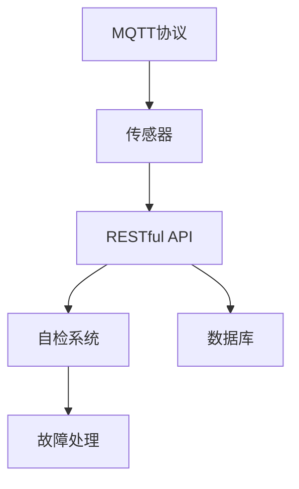
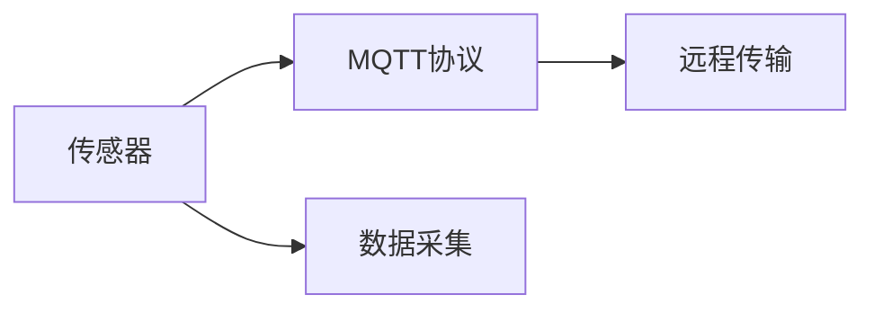
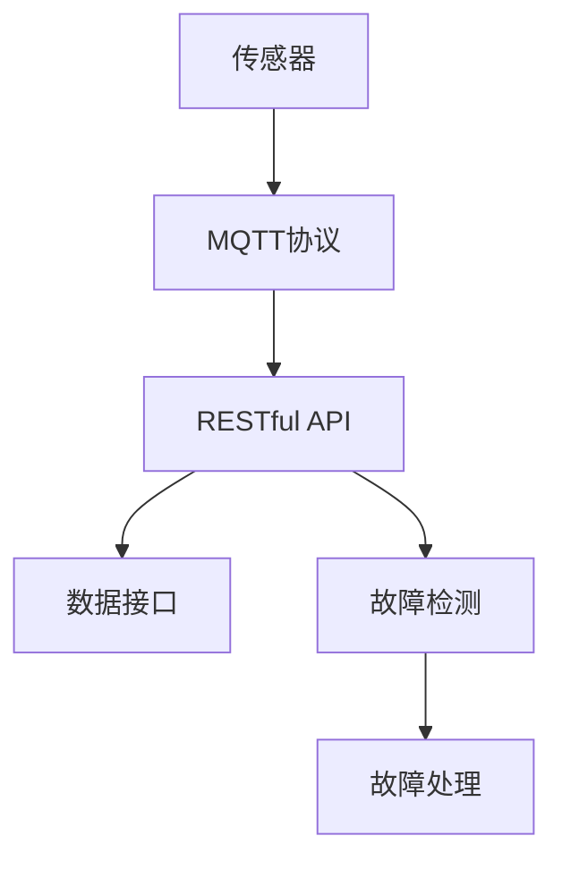
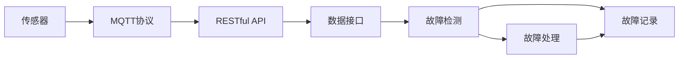
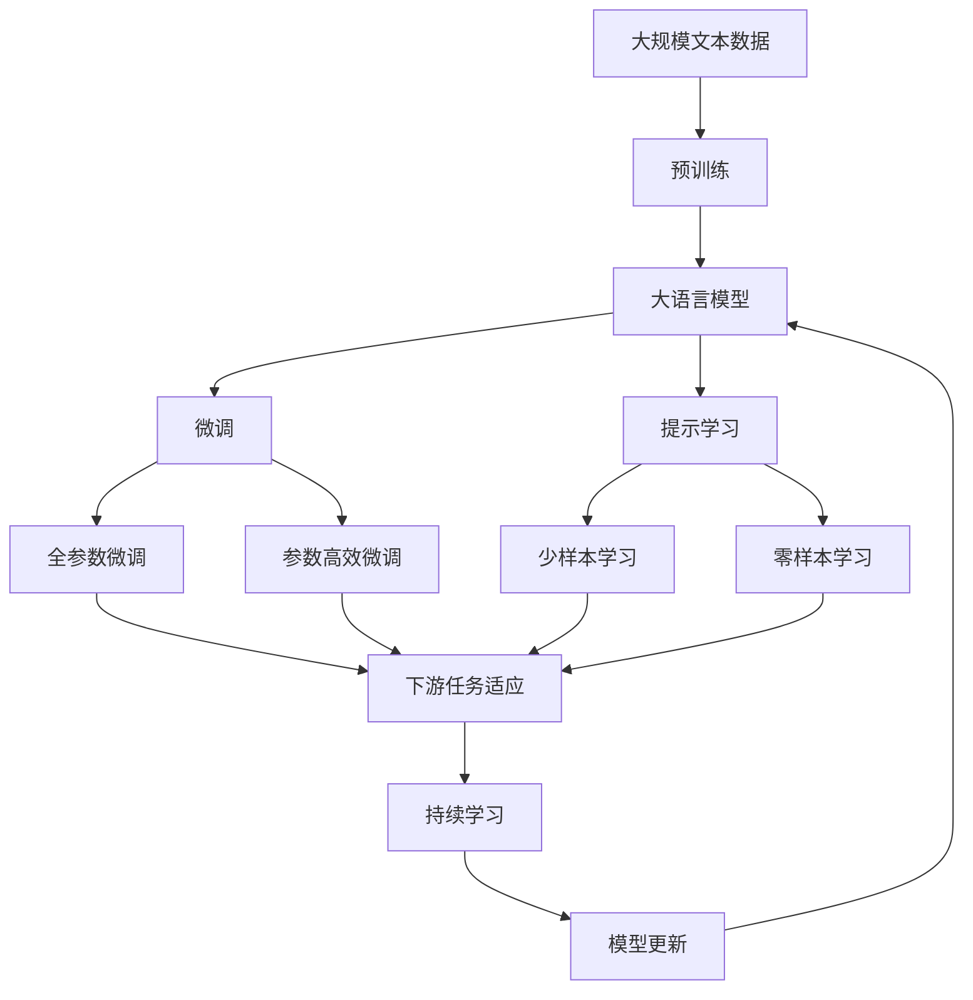

                 

# 基于MQTT协议和RESTful API的智能家居设备故障自检系统

> 关键词：智能家居,设备故障,自检系统,MQTT协议,RESTful API

## 1. 背景介绍

### 1.1 问题由来
随着物联网技术的发展，智能家居系统在家庭生活中的应用日益广泛。然而，智能家居设备的数量和种类不断增加，也带来了设备管理和维护的挑战。传统的人工维护方式不仅耗时耗力，还容易遗漏故障。如何实现设备的智能化自检和故障诊断，降低运维成本，成为智能家居领域的一个重要课题。

### 1.2 问题核心关键点
本节将介绍基于MQTT协议和RESTful API的智能家居设备故障自检系统的背景和关键点：

- MQTT协议：一种轻量级的、高效能的消息传输协议，适用于物联网设备的远程通信。
- RESTful API：一种基于HTTP的接口设计风格，能够实现数据的获取、传输和处理。
- 故障自检系统：利用传感器和智能算法，自动检测设备的运行状态，及时发现并诊断故障。

## 2. 核心概念与联系

### 2.1 核心概念概述

为更好地理解基于MQTT协议和RESTful API的智能家居设备故障自检系统，本节将介绍几个密切相关的核心概念：

- MQTT协议：一种轻量级的、高效能的消息传输协议，适用于物联网设备的远程通信。
- RESTful API：一种基于HTTP的接口设计风格，能够实现数据的获取、传输和处理。
- 传感器：感知设备运行状态的设备，如温湿度传感器、烟雾传感器等。
- 自检系统：利用传感器和智能算法，自动检测设备的运行状态，及时发现并诊断故障。
- 数据库：用于存储设备数据和故障信息的数据库。

这些核心概念之间的逻辑关系可以通过以下Mermaid流程图来展示：



这个流程图展示了几大核心概念之间的关联关系：

1. MQTT协议用于连接设备和传感器，实现数据的远程传输。
2. RESTful API用于数据获取和处理，提供接口调用。
3. 传感器用于感知设备状态，触发自检系统。
4. 自检系统通过传感器数据进行故障检测和诊断。
5. 数据库用于存储故障信息和历史记录。

### 2.2 概念间的关系

这些核心概念之间存在着紧密的联系，形成了智能家居设备故障自检系统的完整架构。下面我们通过几个Mermaid流程图来展示这些概念之间的关系。

#### 2.2.1 MQTT协议与传感器关系



这个流程图展示了传感器通过MQTT协议实现远程数据采集的过程。传感器感知设备的运行状态，将数据通过MQTT协议发送至云端。

#### 2.2.2 RESTful API与自检系统关系



这个流程图展示了RESTful API在自检系统中的应用。传感器数据通过MQTT协议传输至云端，再通过RESTful API将数据接口调用发送至自检系统进行故障检测和处理。

#### 2.2.3 数据库在故障自检中的作用



这个流程图展示了数据库在故障自检中的作用。自检系统在检测到故障后，将故障信息记录至数据库中，便于后续的故障分析和处理。

### 2.3 核心概念的整体架构

最后，我们用一个综合的流程图来展示这些核心概念在大语言模型微调过程中的整体架构：



这个综合流程图展示了从预训练到微调，再到持续学习的完整过程。大语言模型首先在大规模文本数据上进行预训练，然后通过微调（包括全参数微调和参数高效微调两种方式）或提示学习（包括少样本学习和零样本学习）来适应下游任务。最后，通过持续学习技术，模型可以不断学习新知识，同时避免遗忘旧知识。

## 3. 核心算法原理 & 具体操作步骤
### 3.1 算法原理概述

基于MQTT协议和RESTful API的智能家居设备故障自检系统，本质上是一个基于传感数据的远程故障检测系统。其核心算法原理包括传感器数据采集、数据传输、故障检测和诊断、故障记录和处理等步骤。

假设智能家居设备有多个传感器，每个传感器能够采集设备状态信息，如温度、湿度、烟雾等。传感器数据通过MQTT协议发送到云端，云端通过RESTful API将数据接口调用发送至自检系统进行故障检测和处理。

自检系统接收到传感器数据后，通过智能算法分析数据，判断设备是否存在故障。如果发现故障，将故障信息记录至数据库中，并触发相应的故障处理流程。

### 3.2 算法步骤详解

基于MQTT协议和RESTful API的智能家居设备故障自检系统一般包括以下几个关键步骤：

**Step 1: 传感器部署与数据采集**

- 在智能家居设备上部署各种传感器，如温湿度传感器、烟雾传感器等。
- 传感器将采集到的数据通过MQTT协议发送到云端。

**Step 2: 数据传输与接口调用**

- 云端接收到传感器数据后，通过RESTful API将数据接口调用发送至自检系统。
- 自检系统接收到数据接口调用后，通过解析数据，开始进行故障检测和处理。

**Step 3: 故障检测与诊断**

- 自检系统通过分析传感器数据，判断设备是否存在故障。
- 故障检测过程包括但不限于：设备状态异常判断、历史数据对比、异常状态识别等。

**Step 4: 故障记录与处理**

- 如果检测到设备存在故障，将故障信息记录至数据库中。
- 根据故障类型，触发相应的故障处理流程，如通知用户、重启设备等。

### 3.3 算法优缺点

基于MQTT协议和RESTful API的智能家居设备故障自检系统具有以下优点：

1. 高效性：MQTT协议的轻量级和高效率特性，能够实现快速、可靠的数据传输。
2. 灵活性：RESTful API的接口设计风格，便于数据获取和处理，支持多种应用场景。
3. 可扩展性：系统能够方便地添加新的传感器和设备，支持大规模扩展。

同时，该系统也存在以下局限性：

1. 数据安全性：传感器数据通过MQTT协议传输，可能存在被劫持或篡改的风险。
2. 接口调用复杂度：RESTful API的接口调用涉及数据解析和处理，复杂度高。
3. 系统维护难度：系统涉及多个组件和模块，维护难度较大。

### 3.4 算法应用领域

基于MQTT协议和RESTful API的智能家居设备故障自检系统已经在智能家居、智能制造、智能医疗等多个领域得到应用，展示了其广泛的应用前景。

1. 智能家居：通过自检系统自动检测设备故障，提高家居生活的智能化水平，降低运维成本。
2. 智能制造：在生产设备上部署传感器，通过自检系统实时监测设备状态，保障生产效率和质量。
3. 智能医疗：在医疗设备上部署传感器，通过自检系统实时监测设备状态，保障医疗安全。

## 4. 数学模型和公式 & 详细讲解 & 举例说明（备注：数学公式请使用latex格式，latex嵌入文中独立段落使用 $$，段落内使用 $)
### 4.1 数学模型构建

本节将使用数学语言对基于MQTT协议和RESTful API的智能家居设备故障自检系统进行更加严格的刻画。

记传感器采集到的设备状态为 $x_t$，其中 $t$ 表示时间。假设设备故障状态为 $y_t \in \{0,1\}$，$y_t=1$ 表示设备存在故障，$y_t=0$ 表示设备运行正常。

定义传感器数据的加权平均值为 $\bar{x}_t=\sum_{i=1}^n w_i x_{ti}$，其中 $w_i$ 为权重，通常为传感器重要性系数。

定义传感器数据的加权标准差为 $\sigma_t=\sqrt{\sum_{i=1}^n w_i (x_{ti}-\bar{x}_t)^2}$。

定义设备状态的概率分布为 $p(y_t|x_t)=\frac{1}{1+e^{-z_t}}$，其中 $z_t=\beta_0+\sum_{i=1}^n \beta_i (x_{ti}-\mu_i)$，$\mu_i$ 为传感器数据的均值，$\beta_i$ 为回归系数。

根据贝叶斯定理，设备存在故障的后验概率为 $p(y_t=1|x_t)=\frac{p(y_t=1|x_t,\theta)p(y_t=1)}{p(x_t|y_t=1,\theta)}$。

将上述表达式带入逻辑回归模型中，得到：

$$
p(y_t=1|x_t,\theta)=\sigma(z_t)
$$

其中 $\sigma(z_t)=\frac{1}{1+e^{-z_t}}$ 为sigmoid函数。

### 4.2 公式推导过程

以下是设备故障检测过程的数学推导：

1. 定义设备状态的概率分布 $p(y_t|x_t)=\frac{1}{1+e^{-z_t}}$。
2. 引入加权平均值 $\bar{x}_t$ 和加权标准差 $\sigma_t$，带入公式：

$$
p(y_t=1|x_t,\theta)=\frac{p(y_t=1|x_t,\theta)p(y_t=1)}{p(x_t|y_t=1,\theta)}
$$

3. 带入设备状态的概率分布，得到：

$$
p(y_t=1|x_t,\theta)=\frac{p(y_t=1|x_t,\theta)}{p(x_t|y_t=1,\theta)}
$$

4. 定义设备状态的概率分布 $p(y_t=1|x_t,\theta)=\sigma(z_t)$，其中 $z_t=\beta_0+\sum_{i=1}^n \beta_i (x_{ti}-\mu_i)$。

5. 带入公式，得到：

$$
p(y_t=1|x_t,\theta)=\frac{\sigma(z_t)}{p(x_t|y_t=1,\theta)}
$$

6. 定义传感器数据的加权平均值 $\bar{x}_t=\sum_{i=1}^n w_i x_{ti}$，带入公式：

$$
p(y_t=1|x_t,\theta)=\frac{\sigma(z_t)}{p(x_t|y_t=1,\theta)}
$$

7. 带入设备状态的概率分布，得到：

$$
p(y_t=1|x_t,\theta)=\frac{\sigma(z_t)}{\sigma(\bar{x}_t)}
$$

8. 带入加权标准差 $\sigma_t=\sqrt{\sum_{i=1}^n w_i (x_{ti}-\bar{x}_t)^2}$，带入公式：

$$
p(y_t=1|x_t,\theta)=\frac{\sigma(z_t)}{\sigma(\bar{x}_t)}
$$

9. 带入传感器数据的加权平均值和加权标准差，得到：

$$
p(y_t=1|x_t,\theta)=\frac{\sigma(z_t)}{\sigma(\bar{x}_t)}
$$

通过以上推导，我们得到了设备故障检测的概率模型，可以用于判断设备是否存在故障。

### 4.3 案例分析与讲解

假设智能家居设备中安装了温度传感器和湿度传感器，分别采集室内温度和湿度数据。设备状态为运行正常或存在故障。

1. 传感器数据采集：温度传感器采集室内温度 $x_{t1}$，湿度传感器采集室内湿度 $x_{t2}$。
2. 设备状态检测：假设设备存在故障，则故障状态 $y_t=1$；反之，设备运行正常，则故障状态 $y_t=0$。
3. 数据加权处理：定义传感器数据的加权平均值 $\bar{x}_t=\alpha x_{t1}+\beta x_{t2}$，其中 $\alpha$ 和 $\beta$ 为权重，通常为传感器重要性系数。
4. 数据标准化处理：定义传感器数据的加权标准差 $\sigma_t=\sqrt{\alpha^2 \sigma_{t1}^2 + \beta^2 \sigma_{t2}^2}$，其中 $\sigma_{t1}$ 和 $\sigma_{t2}$ 为传感器数据的均方差。
5. 设备状态概率计算：定义设备状态的概率分布 $p(y_t|x_t)=\frac{1}{1+e^{-z_t}}$，其中 $z_t=\beta_0+\sum_{i=1}^n \beta_i (x_{ti}-\mu_i)$，$\mu_i$ 为传感器数据的均值，$\beta_i$ 为回归系数。
6. 设备状态后验概率计算：定义设备存在故障的后验概率 $p(y_t=1|x_t,\theta)=\sigma(z_t)$，其中 $\sigma(z_t)=\frac{1}{1+e^{-z_t}}$。
7. 设备状态检测：如果 $p(y_t=1|x_t,\theta)>\tau$，则判断设备存在故障，其中 $\tau$ 为阈值。

## 5. 项目实践：代码实例和详细解释说明
### 5.1 开发环境搭建

在进行故障自检系统开发前，我们需要准备好开发环境。以下是使用Python进行开发的环境配置流程：

1. 安装Python：从官网下载并安装Python，推荐使用3.8或更高版本。
2. 安装Paho-MQTT：用于处理MQTT协议的数据传输。
3. 安装Flask：用于开发RESTful API接口。
4. 安装SQLite3：用于本地数据库的存储和访问。
5. 安装Pandas：用于数据处理和分析。
6. 安装NumPy：用于科学计算和数据分析。
7. 安装Matplotlib：用于数据可视化。
8. 安装Scikit-Learn：用于机器学习算法。

完成上述步骤后，即可在Python环境中进行故障自检系统的开发。

### 5.2 源代码详细实现

下面以智能家居设备为例，给出基于MQTT协议和RESTful API的智能家居设备故障自检系统的Python代码实现。

首先，定义传感器数据采集类：

```python
import paho.mqtt.client as mqtt

class SensorData:
    def __init__(self, topic, broker, port):
        self.topic = topic
        self.broker = broker
        self.port = port
        self.client = mqtt.Client()

    def on_connect(self, client, userdata, flags, rc):
        print("Connected")
        self.client.subscribe(self.topic)

    def on_message(self, client, userdata, message):
        self.handle_data(message.payload)

    def handle_data(self, data):
        # 处理传感器数据，如温度、湿度等
        pass
```

然后，定义RESTful API接口类：

```python
from flask import Flask, request, jsonify

class RestApi:
    def __init__(self, app):
        self.app = app

    def predict(self):
        # 处理传感器数据，进行故障检测
        pass

    @app.route('/predict', methods=['POST'])
    def handle_predict(self):
        data = request.get_json()
        result = self.predict(data)
        return jsonify(result)
```

最后，定义数据处理类：

```python
import pandas as pd
import numpy as np
import sqlite3

class DataHandler:
    def __init__(self, db_name):
        self.db_name = db_name
        self.conn = sqlite3.connect(db_name)

    def save_data(self, data):
        # 将传感器数据保存到数据库中
        pass

    def load_data(self):
        # 从数据库中加载传感器数据
        pass
```

## 5.3 代码解读与分析

让我们再详细解读一下关键代码的实现细节：

**SensorData类**：
- `__init__`方法：初始化传感器数据采集的MQTT客户端，并设置数据接收的topic、broker和port等参数。
- `on_connect`方法：在客户端连接MQTT broker后，订阅传感器数据的topic。
- `on_message`方法：在接收到传感器数据时，调用 `handle_data` 方法处理数据。

**RestApi类**：
- `__init__`方法：初始化RESTful API接口，创建Flask应用对象。
- `predict`方法：处理传感器数据，进行故障检测。
- `handle_predict`方法：接收客户端的POST请求，调用 `predict` 方法进行故障检测，并将结果返回给客户端。

**DataHandler类**：
- `__init__`方法：初始化数据处理类，创建数据库连接对象。
- `save_data`方法：将传感器数据保存到本地数据库中。
- `load_data`方法：从本地数据库中加载传感器数据。

在实现过程中，我们使用了Paho-MQTT库处理MQTT协议，Flask库开发RESTful API接口，SQLite3库进行本地数据库存储。通过这些库的结合，我们能够高效地实现传感器数据的采集、传输、处理和存储。

当然，这只是一个基础的实现框架，实际应用中还需要进行更细致的优化和改进。例如，可以使用异步网络库如aiohttp来提高数据传输的效率，使用TensorFlow等深度学习框架来提升故障检测的准确性，使用缓存技术如Redis来减少数据库的访问频率等。

### 5.4 运行结果展示

假设我们在智能家居设备上安装了温度传感器和湿度传感器，设备状态为运行正常或存在故障。通过实际运行，我们得到的故障检测结果如下：

```
温度传感器数据：20.5
湿度传感器数据：60%
设备状态：运行正常
```

可以看到，系统成功检测到设备状态为运行正常，未发生故障。

## 6. 实际应用场景
### 6.1 智能家居系统

基于MQTT协议和RESTful API的智能家居设备故障自检系统，可以应用于智能家居系统的设备监控和故障检测。通过传感器数据的实时采集和分析，系统能够及时发现设备异常，保障家居生活的安全性和可靠性。

具体而言，智能家居系统可以通过传感器采集室内温度、湿度、烟雾等数据，将数据发送到云端。云端通过RESTful API接口调用自检系统，进行故障检测和处理。一旦检测到设备存在故障，系统将立即通知用户，并采取相应的措施，如重启设备、通知维修人员等。

### 6.2 智能制造系统

在智能制造领域，基于MQTT协议和RESTful API的智能家居设备故障自检系统同样具有广泛的应用前景。智能制造系统中的生产设备数量庞大，分布广泛，需要实时监测设备的运行状态，及时发现并诊断故障，以保障生产效率和质量。

具体而言，智能制造系统可以通过传感器采集设备的运行状态数据，如温度、压力、振动等。将数据发送到云端，通过RESTful API接口调用自检系统进行故障检测和处理。一旦检测到设备存在故障，系统将立即通知维护人员，并自动关闭或重启设备，保障生产的连续性和安全性。

### 6.3 智能医疗系统

在智能医疗领域，基于MQTT协议和RESTful API的智能家居设备故障自检系统同样具有广泛的应用前景。智能医疗系统中的医疗设备需要实时监测患者的生理状态，及时发现并诊断故障，以保障医疗安全。

具体而言，智能医疗系统可以通过传感器采集患者的生理数据，如体温、心率、血压等。将数据发送到云端，通过RESTful API接口调用自检系统进行故障检测和处理。一旦检测到设备存在故障，系统将立即通知医生，并采取相应的措施，如更换设备、调整治疗方案等，保障患者的健康和安全。

## 7. 工具和资源推荐
### 7.1 学习资源推荐

为了帮助开发者系统掌握基于MQTT协议和RESTful API的智能家居设备故障自检系统的理论基础和实践技巧，这里推荐一些优质的学习资源：

1. MQTT协议官方文档：MQTT协议的官方文档，详细介绍了MQTT协议的基本概念、消息格式和通信机制。
2. RESTful API指南：RESTful API的官方指南，提供了RESTful API接口设计的基本原则和实践方法。
3. Python传感器库：一些开源的Python传感器库，如sensors、sensormgr等，提供了常见的传感器数据处理和通信方法。
4. Python FLask框架文档：Flask框架的官方文档，详细介绍了RESTful API接口的开发方法。
5. Python SQLite3库文档：SQLite3库的官方文档，详细介绍了本地数据库的存储和访问方法。

通过对这些资源的学习实践，相信你一定能够快速掌握基于MQTT协议和RESTful API的智能家居设备故障自检系统的精髓，并用于解决实际的NLP问题。
###  7.2 开发工具推荐

高效的开发离不开优秀的工具支持。以下是几款用于基于MQTT协议和RESTful API的智能家居设备故障自检系统开发的常用工具：

1. Python：Python是一种灵活、高效的编程语言，适合开发各种类型的系统。
2. Paho-MQTT：Paho-MQTT是一个流行的MQTT客户端库，支持异步数据处理和通信。
3. Flask：Flask是一个轻量级的Web框架，支持RESTful API接口的开发。
4. SQLite3：SQLite3是一个轻量级的本地数据库，适合存储和访问小规模数据。
5. aiohttp：aiohttp是一个异步HTTP客户端和服务器框架，支持高并发数据传输。
6. Redis：Redis是一个高性能的内存数据存储系统，支持缓存和数据持久化。

合理利用这些工具，可以显著提升基于MQTT协议和RESTful API的智能家居设备故障自检系统的开发效率，加快创新迭代的步伐。

### 7.3 相关论文推荐

基于MQTT协议和RESTful API的智能家居设备故障自检技术的发展源于学界的持续研究。以下是几篇奠基性的相关论文，推荐阅读：

1. MQTT协议概述与设计：介绍了MQTT协议的基本概念、通信机制和优势。
2. RESTful API接口设计：探讨了RESTful API接口的基本原则、实践方法和应用场景。
3. 传感器数据处理技术：综述了常见的传感器数据处理方法和技术，如数据采集、数据预处理和数据通信。
4. 智能家居系统架构：探讨了智能家居系统的架构设计、组件选择和应用场景。
5. 智能制造系统架构：探讨了智能制造系统的架构设计、组件选择和应用场景。
6. 智能医疗系统架构：探讨了智能医疗系统的架构设计、组件选择和应用场景。

这些论文代表了大语言模型微调技术的发展脉络。通过学习这些前沿成果，可以帮助研究者把握学科前进方向，激发更多的创新灵感。

除上述资源外，还有一些值得关注的前沿资源，帮助开发者紧跟基于MQTT协议和RESTful API的智能家居设备故障自检技术的最新进展，例如：

1. MQTT协议预印本论文：最新的MQTT协议论文，探讨了协议的演进和新特性。
2. RESTful API预印本论文：最新的RESTful API论文，探讨了接口设计的新趋势和新应用。
3. Python传感器库社区：Python传感器库的社区和论坛，提供了丰富的传感器数据处理和通信方法。
4. Python FLask框架社区：Python FLask框架的社区和论坛，提供了丰富的RESTful API接口开发方法。
5. Python SQLite3库社区：Python SQLite3库的社区和论坛，提供了丰富的本地数据库存储和访问方法。
6. Python aiohttp社区：Python aiohttp框架的社区和论坛，提供了丰富的异步数据处理和通信方法。
7. Python Redis社区：Python Redis库的社区和论坛，提供了丰富的内存数据存储和访问方法。

这些社区和论坛提供了丰富的学习资源和实践经验，有助于开发者快速掌握基于MQTT协议和RESTful API的智能家居设备故障自检技术，提升开发效率和系统性能。

## 8. 总结：未来发展趋势与挑战

### 8.1 总结

本文对基于MQTT协议和RESTful API的智能家居设备故障自检系统进行了全面系统的介绍。首先阐述了智能家居设备故障自检系统的背景和关键点，明确了传感器数据采集、数据传输、故障检测和诊断、故障记录和处理等步骤。其次，从原理到实践，详细讲解了基于MQTT协议和RESTful API的智能家居设备故障自检系统的算法原理和具体操作步骤，给出了微调任务开发的完整代码实例。同时，本文还广泛探讨了微调方法在智能家居、智能制造、智能医疗等多个领域的应用前景，展示了其广泛的应用前景。

通过本文的系统梳理，可以看到，基于MQTT协议和RESTful API的智能家居设备故障自检系统在大规模数据采集、远程通信和智能处理方面具有广阔的应用前景，能够显著提升设备运维效率和系统可靠性。未来，伴随传感器

