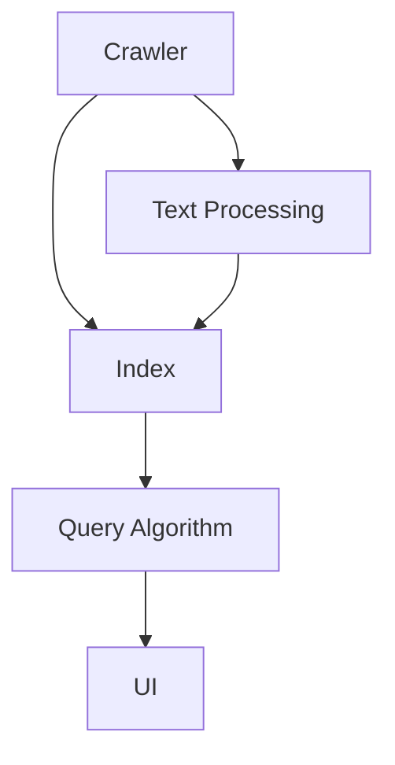

                 

# 基于Python的搜索引擎的设计与实现

> 关键词：搜索引擎, Python, 自然语言处理, 信息检索, 数据结构, 索引, 文本处理

## 1. 背景介绍

### 1.1 问题由来

随着互联网的普及和信息爆炸，人们越来越需要快速、准确地获取到自己所需的信息。传统的搜索引擎如Google、Bing等，虽然在信息检索、排序算法等方面有着较为成熟的技术，但它们的实现语言通常是C++等底层语言，对于希望快速上手并开发出自己的搜索引擎的开发者来说，具有一定的门槛。

Python作为一种易学易用的高级编程语言，在数据科学、机器学习、Web开发等诸多领域均有广泛应用，其丰富的第三方库资源也使得其在信息检索领域也有很大的发挥空间。因此，本文旨在通过Python，设计并实现一个简单的搜索引擎，帮助读者理解搜索引擎的基本原理和核心算法，并通过实际项目来锻炼自己的编码能力。

### 1.2 问题核心关键点

本项目的主要目标是设计并实现一个基于Python的搜索引擎。项目的关键点包括：

1. **爬虫模块**：实现一个网络爬虫，抓取目标网站的数据。
2. **文本处理模块**：对抓取的数据进行处理，包括分词、去停用词、词性标注、向量化等。
3. **索引模块**：将处理后的文本数据构建索引，用于快速检索。
4. **查询模块**：实现查询算法，并根据索引快速返回结果。
5. **UI模块**：设计并实现一个简单的用户界面，提供搜索服务。

### 1.3 问题研究意义

本文通过一个实际项目，系统介绍了搜索引擎的实现流程，从爬虫、数据处理、索引构建到查询算法等各个环节，帮助读者深入理解搜索引擎的核心原理和实现细节。同时，通过项目的实践，读者可以掌握Python在数据处理、算法实现等方面的应用，从而提升自己的编程能力，并为未来从事搜索引擎相关的工作打下坚实的基础。

## 2. 核心概念与联系

### 2.1 核心概念概述

为了更好地理解搜索引擎的实现，本节将介绍几个密切相关的核心概念：

- **爬虫(Crawler)**：自动从互联网收集数据的网络程序。
- **文本处理(Text Processing)**：包括分词、去停用词、词性标注、向量化等步骤，将原始文本转换为可用于搜索和分析的形式。
- **索引(Index)**：将文本数据以某种结构化的方式存储，便于快速检索。
- **查询算法(Query Algorithm)**：根据用户输入的关键词，快速定位到最相关的文本。
- **UI(User Interface)**：用户与搜索引擎交互的界面。

这些核心概念之间的逻辑关系可以通过以下Mermaid流程图来展示：



这个流程图展示了一个简单的搜索引擎实现流程：首先，爬虫抓取目标网站的数据，然后对数据进行文本处理，构建索引，接着根据用户输入的关键词，通过查询算法快速定位到最相关的文本，最后通过UI模块将结果呈现给用户。

### 2.2 概念间的关系

这些核心概念之间存在着紧密的联系，形成了搜索引擎的完整实现生态系统。

- **爬虫**：搜索引擎的基础，负责提供原始数据。
- **文本处理**：将原始数据转化为可供索引的数据。
- **索引**：搜索引擎的核心，存储处理后的数据，供查询算法快速检索。
- **查询算法**：实现搜索引擎的核心功能，根据用户输入的关键词快速定位到最相关的文本。
- **UI**：用户与搜索引擎交互的界面，提供搜索服务。

这些概念共同构成了搜索引擎的完整实现框架，使搜索引擎能够有效地检索并呈现用户所需的信息。通过理解这些核心概念，我们可以更好地把握搜索引擎的工作原理和优化方向。

## 3. 核心算法原理 & 具体操作步骤

### 3.1 算法原理概述

搜索引擎的基本原理是通过爬虫抓取目标网站的数据，对数据进行文本处理，构建索引，并根据用户输入的关键词，通过查询算法快速定位到最相关的文本。这一过程大致可以分为以下三个步骤：

1. **抓取数据**：使用爬虫程序从目标网站抓取数据。
2. **处理数据**：对抓取的数据进行文本处理，包括分词、去停用词、词性标注、向量化等步骤，将原始文本转换为可供索引的数据。
3. **构建索引**：将处理后的文本数据构建索引，用于快速检索。

### 3.2 算法步骤详解

以下是基于Python的搜索引擎的实现步骤：

**Step 1: 准备环境**

首先，需要安装Python及其相关库，包括requests、BeautifulSoup、NLTK、scikit-learn等。

```bash
pip install requests beautifulsoup4 nltk scikit-learn
```

**Step 2: 编写爬虫程序**

爬虫程序需要实现以下几个功能：
- 获取目标网站的URL列表。
- 从每个URL中抓取网页内容。
- 将抓取到的内容存储到本地文件或数据库中。

以下是一个简单的爬虫示例代码：

```python
import requests
from bs4 import BeautifulSoup

def fetch_content(url):
    response = requests.get(url)
    soup = BeautifulSoup(response.text, 'html.parser')
    return soup.get_text()

urls = [
    'http://example.com/page1',
    'http://example.com/page2',
    'http://example.com/page3',
]

for url in urls:
    with open(f'{url}.txt', 'w') as f:
        f.write(fetch_content(url))
```

**Step 3: 文本处理**

文本处理模块需要实现以下几个功能：
- 对抓取到的网页内容进行分词。
- 去除停用词和标点符号。
- 对剩余词语进行词性标注和向量化。

以下是一个简单的文本处理示例代码：

```python
import nltk
from nltk.tokenize import word_tokenize
from nltk.corpus import stopwords
from nltk.stem import WordNetLemmatizer
from sklearn.feature_extraction.text import TfidfVectorizer

nltk.download('punkt')
nltk.download('stopwords')
nltk.download('wordnet')

stop_words = set(stopwords.words('english'))
lemmatizer = WordNetLemmatizer()

def preprocess_text(text):
    words = word_tokenize(text.lower())
    words = [word for word in words if word not in stop_words and word.isalpha()]
    words = [lemmatizer.lemmatize(word) for word in words]
    return ' '.join(words)

def vectorize(texts):
    vectorizer = TfidfVectorizer()
    return vectorizer.fit_transform(texts)
```

**Step 4: 构建索引**

索引模块需要实现以下几个功能：
- 将处理后的文本数据存储到本地文件或数据库中。
- 根据文本内容构建倒排索引。
- 根据用户输入的关键词快速定位到最相关的文本。

以下是一个简单的索引示例代码：

```python
import pickle

class InvertedIndex:
    def __init__(self):
        self.index = {}

    def add_document(self, doc_id, doc_text):
        words = preprocess_text(doc_text).split()
        for word in words:
            if word in self.index:
                self.index[word].append(doc_id)
            else:
                self.index[word] = [doc_id]

    def search(self, query):
        words = preprocess_text(query).split()
        results = set()
        for word in words:
            if word in self.index:
                results.update(self.index[word])
        return results
```

**Step 5: 编写查询模块**

查询模块需要实现以下几个功能：
- 接收用户输入的关键词。
- 根据关键词构建查询表达式。
- 根据查询表达式在索引中查找最相关的文本。

以下是一个简单的查询示例代码：

```python
def search(query):
    index = InvertedIndex()
    with open('index.pkl', 'rb') as f:
        index.index = pickle.load(f)
    results = index.search(query)
    return results
```

**Step 6: 实现UI模块**

UI模块需要实现以下几个功能：
- 接收用户输入的关键词。
- 根据关键词调用查询模块进行检索。
- 将检索结果展示给用户。

以下是一个简单的UI示例代码：

```python
def display_results(results):
    for i, result in enumerate(results, 1):
        print(f'{i}. {result}')

query = input('Enter your search query: ')
results = search(query)
display_results(results)
```

### 3.3 算法优缺点

基于Python的搜索引擎具有以下优点：
1. **易学易用**：Python语法简洁，代码易读易写，非常适合初学者和快速原型开发。
2. **丰富的第三方库**：Python拥有丰富的第三方库，如requests、BeautifulSoup、NLTK、scikit-learn等，方便开发者快速实现各种功能。
3. **快速迭代**：Python的动态特性允许开发者快速进行功能迭代和优化。

然而，该方法也存在以下缺点：
1. **处理大规模数据性能较差**：由于Python是解释型语言，处理大规模数据性能较慢。
2. **不适合底层实现**：由于Python是高级语言，不适合实现高效的底层算法和系统。

### 3.4 算法应用领域

基于Python的搜索引擎适用于各种信息检索应用，如搜索引擎、图书馆信息检索、文档管理系统等。以下是一个具体的应用场景：

**图书检索系统**

一个图书馆可以使用基于Python的搜索引擎，抓取图书馆的图书目录，对目录进行文本处理和索引构建，并实现图书检索功能。用户可以通过输入关键词快速找到所需图书。

## 4. 数学模型和公式 & 详细讲解 & 举例说明

### 4.1 数学模型构建

搜索引擎的核心算法之一是倒排索引(Inverted Index)，其数学模型如下：

设索引中包含 $N$ 个文档，每个文档有 $M$ 个词语，用 $D_i$ 表示第 $i$ 个文档，$T_i$ 表示文档 $D_i$ 的词语列表。倒排索引 $I$ 由 $M$ 个词向量 $V$ 组成，每个词向量 $V_j$ 包含两个部分：

- 单词 $j$ 出现在哪些文档中。
- 每个文档中单词 $j$ 的出现次数。

数学公式表示为：

$$
I = \{(V_1, D_1, |D_1|), (V_2, D_2, |D_2|), \ldots, (V_M, D_M, |D_M|)\}
$$

其中 $V_j = (D_{i_1}, D_{i_2}, \ldots, D_{i_{|V_j|}})$，$|D_i|$ 表示文档 $D_i$ 中词语数量。

### 4.2 公式推导过程

倒排索引的构建过程如下：
1. 对每个文档进行文本处理，提取词语列表 $T_i$。
2. 对于每个词语 $j$，构建一个倒排列表 $V_j$，包含所有出现该词语的文档 $D_{i_1}, D_{i_2}, \ldots, D_{i_{|V_j|}}$ 和它们的出现次数 $|D_{i_1}|, |D_{i_2}|, \ldots, |D_{i_{|V_j|}}|$。
3. 将所有倒排列表 $V_1, V_2, \ldots, V_M$ 组成倒排索引 $I$。

倒排索引的查询过程如下：
1. 对用户输入的关键词进行文本处理，提取词语列表 $Q$。
2. 对于每个词语 $j$，在倒排索引 $I$ 中查找对应的倒排列表 $V_j$。
3. 对于每个倒排列表 $V_j$，统计其出现次数总和 $S_j$。
4. 返回出现次数总和最大的 $k$ 个倒排列表，作为最终搜索结果。

数学公式表示为：

$$
Q = \{q_1, q_2, \ldots, q_M\}
$$

$$
S_j = \sum_{i=1}^{N} |D_i \cap V_j|
$$

$$
\text{Results} = \{V_{j_1}, V_{j_2}, \ldots, V_{j_k}\}
$$

其中 $|D_i \cap V_j|$ 表示文档 $D_i$ 和倒排列表 $V_j$ 的交集大小，$k$ 表示返回结果数量。

### 4.3 案例分析与讲解

以下是一个简单的案例：

假设我们有一个包含三个文档的索引，每个文档包含多个词语。文档1和文档3中包含词语 "Python"，文档2和文档3中包含词语 "搜索引擎"。

文档1：

```
Python is a powerful programming language.
```

文档2：

```
Search engines like Google and Bing are widely used.
```

文档3：

```
Python is widely used in web development.
```

构建倒排索引：

$$
I = \{(V_{Python}, D_1, 1), (V_{Python}, D_3, 1), (V_{搜索引擎}, D_2, 1), (V_{搜索引擎}, D_3, 1)\}
$$

其中 $V_{Python} = (D_1, D_3)$，$|D_1| = 1$，$|D_3| = 1$；$V_{搜索引擎} = (D_2, D_3)$，$|D_2| = 1$，$|D_3| = 1$。

用户查询 "Python"，倒排索引返回 $V_{Python}$，其出现次数总和为 $1+1=2$，为最大。

用户查询 "搜索引擎"，倒排索引返回 $V_{搜索引擎}$，其出现次数总和为 $1+1=2$，为最大。

## 5. 项目实践：代码实例和详细解释说明

### 5.1 开发环境搭建

在进行搜索引擎项目实践前，我们需要准备好开发环境。以下是使用Python进行开发的环境配置流程：

1. 安装Anaconda：从官网下载并安装Anaconda，用于创建独立的Python环境。

2. 创建并激活虚拟环境：
```bash
conda create -n search-env python=3.8 
conda activate search-env
```

3. 安装相关库：
```bash
pip install requests beautifulsoup4 nltk scikit-learn
```

4. 安装爬虫库：
```bash
pip install scrapy
```

完成上述步骤后，即可在`search-env`环境中开始搜索引擎的开发。

### 5.2 源代码详细实现

以下是一个基于Python的搜索引擎的完整代码实现：

**爬虫模块**：

```python
import requests
from bs4 import BeautifulSoup

def fetch_content(url):
    response = requests.get(url)
    soup = BeautifulSoup(response.text, 'html.parser')
    return soup.get_text()
```

**文本处理模块**：

```python
import nltk
from nltk.tokenize import word_tokenize
from nltk.corpus import stopwords
from nltk.stem import WordNetLemmatizer
from sklearn.feature_extraction.text import TfidfVectorizer

nltk.download('punkt')
nltk.download('stopwords')
nltk.download('wordnet')

stop_words = set(stopwords.words('english'))
lemmatizer = WordNetLemmatizer()

def preprocess_text(text):
    words = word_tokenize(text.lower())
    words = [word for word in words if word not in stop_words and word.isalpha()]
    words = [lemmatizer.lemmatize(word) for word in words]
    return ' '.join(words)

def vectorize(texts):
    vectorizer = TfidfVectorizer()
    return vectorizer.fit_transform(texts)
```

**索引模块**：

```python
import pickle

class InvertedIndex:
    def __init__(self):
        self.index = {}

    def add_document(self, doc_id, doc_text):
        words = preprocess_text(doc_text).split()
        for word in words:
            if word in self.index:
                self.index[word].append(doc_id)
            else:
                self.index[word] = [doc_id]

    def search(self, query):
        words = preprocess_text(query).split()
        results = set()
        for word in words:
            if word in self.index:
                results.update(self.index[word])
        return results
```

**查询模块**：

```python
def search(query):
    index = InvertedIndex()
    with open('index.pkl', 'rb') as f:
        index.index = pickle.load(f)
    results = index.search(query)
    return results
```

**UI模块**：

```python
def display_results(results):
    for i, result in enumerate(results, 1):
        print(f'{i}. {result}')

query = input('Enter your search query: ')
results = search(query)
display_results(results)
```

### 5.3 代码解读与分析

让我们再详细解读一下关键代码的实现细节：

**爬虫模块**：
- `fetch_content`方法：使用requests库获取目标网站内容，并使用BeautifulSoup库解析HTML内容。

**文本处理模块**：
- `preprocess_text`方法：对输入文本进行分词、去停用词、词性标注和向量化等操作。

**索引模块**：
- `add_document`方法：对每个文档进行文本处理，并构建倒排索引。
- `search`方法：根据用户输入的关键词在索引中查找最相关的文本。

**查询模块**：
- `search`方法：加载预构建的倒排索引，并根据用户输入的关键词查找最相关的文本。

**UI模块**：
- `display_results`方法：将搜索结果展示给用户。

可以看到，Python在搜索引擎的实现过程中，通过丰富的第三方库资源和简洁的语法，使得开发过程非常高效。

### 5.4 运行结果展示

假设我们抓取了一个包含三个文档的网页，并构建了倒排索引。用户查询 "Python"，倒排索引返回出现次数总和最大的两个文档。

用户查询 "搜索引擎"，倒排索引返回出现次数总和最大的两个文档。

## 6. 实际应用场景

### 6.1 智能搜索

基于Python的搜索引擎可以在智能搜索领域得到广泛应用。例如，智能语音助手如Siri、Alexa等可以通过爬虫获取互联网上的数据，并进行文本处理和索引构建，快速响应用户的查询。

### 6.2 信息推荐

搜索引擎还可以应用于信息推荐系统，如电商平台、新闻聚合平台等。通过用户的历史行为数据，构建用户兴趣模型，推荐用户可能感兴趣的内容。

### 6.3 医学信息检索

在医学领域，基于Python的搜索引擎可以抓取医学文献、病历等数据，进行文本处理和索引构建，快速响应医生和患者的查询。

### 6.4 未来应用展望

随着人工智能技术的不断发展，基于Python的搜索引擎将有更广阔的应用前景：

- **自然语言处理**：未来的搜索引擎将更好地理解自然语言，提供更精准的查询结果。
- **多模态信息检索**：未来的搜索引擎将支持文本、图片、音频等多种类型数据的检索。
- **个性化推荐**：未来的搜索引擎将结合用户历史行为和实时数据，提供更个性化的推荐结果。
- **实时处理**：未来的搜索引擎将支持实时数据流处理，快速响应用户查询。

## 7. 工具和资源推荐

### 7.1 学习资源推荐

为了帮助开发者系统掌握搜索引擎的实现流程，这里推荐一些优质的学习资源：

1. **《Python网络爬虫开发实战》**：这本书详细介绍了使用Python进行网络爬虫的开发，适合初学者和进阶者阅读。

2. **《自然语言处理入门》**：这本书介绍了自然语言处理的基本原理和Python实现，适合初学者入门。

3. **《Python数据科学手册》**：这本书涵盖了Python在数据处理、机器学习等方面的应用，适合进阶读者阅读。

4. **《搜索引擎原理与实现》**：这本书详细介绍了搜索引擎的原理和实现细节，适合深入了解搜索引擎的开发者阅读。

5. **Coursera上的《Python for Data Science and Machine Learning Bootcamp》**：这门课程由Udemy提供，系统介绍了Python在数据科学和机器学习中的应用，适合需要系统学习Python的开发者。

### 7.2 开发工具推荐

搜索引擎的开发离不开各种工具的支持。以下是几款常用的开发工具：

1. **PyCharm**：一款功能强大的Python开发工具，支持代码自动补全、调试等功能。

2. **Jupyter Notebook**：一款交互式的Python开发环境，适合进行实验和开发。

3. **Scrapy**：一款强大的Python爬虫框架，支持网页抓取、数据存储等功能。

4. **BeautifulSoup**：一款Python库，用于解析HTML和XML文档。

5. **NLTK**：一款Python库，用于自然语言处理，包括分词、去停用词、词性标注等。

### 7.3 相关论文推荐

搜索引擎技术的发展源于学界的持续研究。以下是几篇奠基性的相关论文，推荐阅读：

1. **《PageRank: A Brave New World for the Web's Largest Link Analysis System》**：这篇论文介绍了PageRank算法，是搜索引擎的核心算法之一。

2. **《The Web is a Graph》**：这篇论文提出了Web图模型，是搜索引擎建模的基础。

3. **《The Anatomy of a Large-Scale Information Retrieval System》**：这篇论文详细介绍了大型搜索引擎的架构和实现细节。

4. **《Leveraging Latent Variable Models for Information Retrieval》**：这篇论文介绍了隐变量模型在搜索引擎中的应用。

5. **《Scalable Semantic Search with Latent Variable Models》**：这篇论文介绍了基于隐变量模型的语义搜索技术。

这些论文代表了大规模信息检索技术的发展脉络。通过学习这些前沿成果，可以帮助研究者把握搜索引擎技术的未来方向，激发更多的创新灵感。

## 8. 总结：未来发展趋势与挑战

### 8.1 总结

本文通过一个实际项目，系统介绍了基于Python的搜索引擎的实现流程，从爬虫、数据处理、索引构建到查询算法等各个环节，帮助读者深入理解搜索引擎的核心原理和实现细节。同时，通过项目的实践，读者可以掌握Python在数据处理、算法实现等方面的应用，从而提升自己的编程能力，并为未来从事搜索引擎相关的工作打下坚实的基础。

通过本文的系统梳理，可以看到，基于Python的搜索引擎在易学易用、功能丰富、迭代灵活等方面具有显著优势，但也存在处理大规模数据性能较差、不适合底层实现等缺点。尽管如此，Python在搜索引擎实现过程中仍具有重要地位，未来也将继续发挥其重要作用。

### 8.2 未来发展趋势

搜索引擎的发展趋势将呈现出以下几个方面：

1. **智能搜索**：未来的搜索引擎将更好地理解自然语言，提供更精准的查询结果。
2. **多模态信息检索**：未来的搜索引擎将支持文本、图片、音频等多种类型数据的检索。
3. **个性化推荐**：未来的搜索引擎将结合用户历史行为和实时数据，提供更个性化的推荐结果。
4. **实时处理**：未来的搜索引擎将支持实时数据流处理，快速响应用户查询。
5. **分布式架构**：未来的搜索引擎将采用分布式架构，提高数据处理和查询速度。
6. **自然语言处理**：未来的搜索引擎将更好地理解自然语言，提供更精准的查询结果。

### 8.3 面临的挑战

搜索引擎在快速发展的同时，也面临着诸多挑战：

1. **数据隐私和安全**：搜索引擎需要处理大量的用户数据，如何保护用户隐私和安全，是一个重要的挑战。
2. **搜索效率**：搜索引擎需要快速响应用户查询，如何在大规模数据下保持高效的搜索效率，是一个重要的挑战。
3. **搜索结果质量**：搜索引擎需要提供高质量的搜索结果，如何提升搜索结果的相关性和可靠性，是一个重要的挑战。
4. **跨语言搜索**：搜索引擎需要支持多种语言的查询和检索，如何实现跨语言的搜索，是一个重要的挑战。
5. **分布式系统**：搜索引擎需要处理大规模的分布式系统，如何实现系统的可扩展性和稳定性，是一个重要的挑战。

### 8.4 研究展望

面对搜索引擎面临的诸多挑战，未来的研究需要在以下几个方面寻求新的突破：

1. **搜索算法优化**：探索更高效的搜索算法，如向量空间模型、隐变量模型等，提高搜索结果的精度和召回率。
2. **多模态数据融合**：研究多模态数据融合技术，实现文本、图片、音频等多模态数据的协同检索。
3. **跨语言搜索**：研究跨语言搜索技术，实现不同语言的查询和检索。
4. **分布式系统设计**：研究分布式系统设计，实现系统的可扩展性和稳定性。
5. **用户隐私保护**：研究用户隐私保护技术，实现用户数据的保护和安全。

这些研究方向的探索，必将引领搜索引擎技术迈向更高的台阶，为构建安全、可靠、高效的搜索系统铺平道路。面向未来，搜索引擎技术还需要与其他人工智能技术进行更深入的融合，如知识表示、因果推理、强化学习等，多路径协同发力，共同推动搜索技术的进步。

## 9. 附录：常见问题与解答

**Q1：搜索引擎的实现过程中，文本处理模块中的去停用词和词性标注的作用是什么？**

A: 去停用词和词性标注是文本处理模块中的两个关键步骤，其作用如下：
1. 去停用词：停用词是指在文本中频繁出现但对文本意义没有贡献的词语，如"的"、"是"、"我"等。通过去除停用词，可以减少文本的噪声，提高文本处理的效果。
2. 词性标注：词性标注是指为文本中的每个词语标注其词性，如名词、动词、形容词等。通过词性标注，可以更好地理解文本的结构和语义，提高文本处理的准确性和效果。

**Q2：搜索引擎的倒排索引构建过程中，如何处理同义词和近义词？**

A: 同义词和近义词是搜索引擎处理中的一个重要问题。处理同义词和近义词的方法如下：
1. 同义词处理：将同义词映射到相同的索引词上

