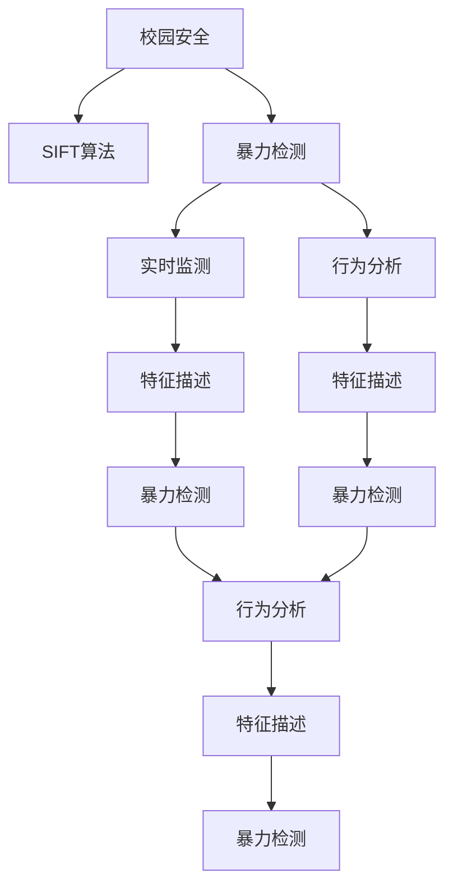
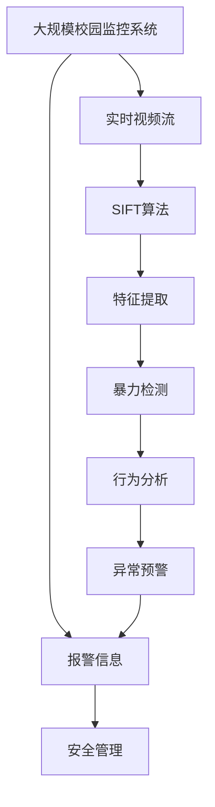

                 

## 1. 背景介绍

### 1.1 问题由来
近年来，全球范围内校园暴力的频发引起了社会广泛关注。校园暴力不仅破坏了教育环境，影响了学生的心理健康和学业表现，还对学校安全管理提出了严峻挑战。为预防和应对校园暴力事件，许多国家和地区在加强学校管理和强化心理辅导的同时，也开始积极探索基于技术手段的校园安全监测方法。

### 1.2 问题核心关键点
校园暴力检测的核心在于及时、准确地识别出校园内的潜在暴力行为。基于计算机视觉技术的暴力检测方法已逐渐成为研究热点，其中SIFT（尺度不变特征变换）算法因其在尺度变化下的不变性和良好的特征描述能力，被广泛用于暴力行为的视频监测和图像分析。

### 1.3 问题研究意义
研究基于SIFT算法的校园暴力检测方法，对于提高校园安全管理水平、保障学生安全具有重要意义。首先，通过技术手段早期发现校园暴力行为，可以及时采取干预措施，避免事态升级；其次，利用大数据分析，可以对暴力事件进行模式识别和行为预警，提升安全管理效率；最后，基于SIFT算法的检测系统能够实现全时段、全覆盖的实时监控，提供更全面的安全保障。

## 2. 核心概念与联系

### 2.1 核心概念概述

为更好地理解基于SIFT算法的校园暴力检测方法，本节将介绍几个关键概念：

- **SIFT算法**：尺度不变特征变换算法，是一种用于提取和匹配图像特征的计算机视觉技术。SIFT算法通过尺度空间极值检测、关键点定位、方向分配和特征描述等步骤，提取具有旋转、缩放、亮度变化等不变性的局部特征。

- **暴力检测**：指通过计算机视觉技术，对视频或图像中的暴力行为进行识别和分析的过程。暴力检测可以分为两类：静态图像检测和视频流检测。

- **校园安全**：指保障校园内学生、教职工等人员的人身安全，预防和应对各类校园安全事故。

- **实时监测**：指通过传感器、监控摄像头等设备，对校园内的人流、行为等进行持续、实时的监测和分析，以实现早期预警和应急响应。

- **行为分析**：指对校园内的人员行为进行模式识别和异常检测，通过数据分析发现潜在风险。

- **特征描述**：指将图像中的关键点、边缘等特征转换为数字形式，以便计算机进行匹配和识别。

### 2.2 概念间的关系

这些关键概念之间存在着紧密的联系，形成了校园暴力检测技术的整体架构。以下通过Mermaid流程图展示它们之间的关系：



这个流程图展示了校园安全、暴力检测、实时监测、行为分析、特征描述等关键概念之间的逻辑关系：

1. 校园安全是整个系统的目标，其他技术手段都是为了提升校园安全管理。
2. 暴力检测是对校园内暴力行为的识别和分析，是预防和应对校园暴力的重要技术。
3. 实时监测提供持续、实时的数据支持，是暴力检测的基础。
4. 行为分析通过数据分析，对校园内人员行为进行模式识别，有助于识别潜在暴力行为。
5. 特征描述将图像中的关键特征转换为数字形式，是暴力检测的核心技术。

### 2.3 核心概念的整体架构

最后，我们用一个综合的流程图来展示这些关键概念在大规模校园暴力检测系统中的整体架构：



这个综合流程图展示了从实时视频流到最终安全管理的具体流程，详细说明了SIFT算法在校园暴力检测中的关键作用。

## 3. 核心算法原理 & 具体操作步骤
### 3.1 算法原理概述

基于SIFT算法的校园暴力检测方法，主要包括以下几个关键步骤：

1. **实时视频流采集**：通过校园监控系统采集实时视频流，作为检测系统的输入。
2. **尺度空间构建**：对视频帧进行尺度空间构建，生成多尺度图像金字塔。
3. **尺度空间极值检测**：在多尺度图像金字塔中，检测尺度和旋转不变性的关键点。
4. **关键点定位**：精确定位关键点的位置，去除噪声点和边缘响应。
5. **方向分配**：为每个关键点分配主方向，以消除尺度变化的影响。
6. **特征描述**：以关键点为中心，提取包含尺度、旋转和亮度变化的局部特征。
7. **特征匹配**：将提取的特征向量进行匹配，识别出异常行为。
8. **行为分析**：通过特征匹配结果，进行行为模式识别，发出异常预警。

### 3.2 算法步骤详解

#### 3.2.1 实时视频流采集

实时视频流采集是校园暴力检测的第一步，通过校园监控系统获取校园内各重要区域的视频数据。采集过程需要确保视频流的清晰度和稳定性，避免由于光线变化、运动模糊等因素影响检测效果。

#### 3.2.2 尺度空间构建

尺度空间构建是SIFT算法的核心步骤，通过在原始图像上应用高斯滤波器，生成多尺度图像金字塔。每个尺度下的图像都被平滑化，同时保留了图像的局部信息。尺度空间的构建需要考虑图像的大小和分辨率，通常采用高斯滤波器进行尺度空间卷积。

#### 3.2.3 尺度空间极值检测

尺度空间极值检测是SIFT算法的基础，通过在不同尺度下寻找图像的局部极值点，得到候选关键点。在尺度空间中，每个像素点在尺度空间中的局部极值点位置固定，能够抵抗尺度、旋转、光照等变化。极值检测的关键在于设定合适的尺度空间范围和阈值，避免误检和漏检。

#### 3.2.4 关键点定位

关键点定位是SIFT算法的关键步骤，通过去除低响应值和边缘响应点，精确定位关键点的位置。关键点的定位需要考虑图像的局部特征和尺度变化，通常采用Laplacian算子进行二次响应函数计算，去除响应值低于阈值的点。

#### 3.2.5 方向分配

方向分配是SIFT算法的关键步骤，通过将每个关键点分配主方向，消除尺度变化对特征描述的影响。方向分配通常采用梯度方向直方图的方法，计算关键点周围的梯度方向直方图，得到主方向。

#### 3.2.6 特征描述

特征描述是SIFT算法的核心步骤，通过以关键点为中心，提取包含尺度、旋转和亮度变化的局部特征。特征描述通常采用高斯差分算子（DoG）进行特征点周围的图像差异计算，得到特征描述向量。

#### 3.2.7 特征匹配

特征匹配是SIFT算法的关键步骤，通过将提取的特征向量进行匹配，识别出异常行为。特征匹配通常采用暴力匹配或基于特征空间的方法，如Flann等。

#### 3.2.8 行为分析

行为分析是校园暴力检测的最终步骤，通过特征匹配结果，进行行为模式识别，发出异常预警。行为分析通常采用机器学习或统计方法，对特征匹配结果进行模式识别和异常检测。

### 3.3 算法优缺点

基于SIFT算法的校园暴力检测方法具有以下优点：

1. 鲁棒性强：SIFT算法能够有效处理尺度、旋转、光照等变化，适应性广。
2. 特征描述能力强：SIFT算法提取的局部特征包含尺度、旋转和亮度变化，具有较好的区分度和稳定性。
3. 实时性高：SIFT算法处理速度快，适用于实时视频流的分析和检测。

同时，该方法也存在一些缺点：

1. 计算复杂度高：SIFT算法需要进行多尺度计算和特征描述，计算复杂度较高。
2. 对局部变化敏感：SIFT算法对局部变化较为敏感，容易被噪声影响。
3. 对大规模数据处理能力有限：SIFT算法在大规模数据处理时，效率较低。

### 3.4 算法应用领域

基于SIFT算法的校园暴力检测方法，主要应用于以下领域：

1. **校园监控系统**：通过实时视频流采集和SIFT算法检测，实现对校园内暴力行为的实时监控和预警。
2. **智能安防系统**：将SIFT算法与智能分析技术结合，实现对校园内人员行为的全面监测和管理。
3. **应急响应系统**：通过行为分析，快速响应校园内的异常事件，提高应急响应效率。
4. **远程教育系统**：通过视频流采集和SIFT算法检测，实现对校园内远程教学环境的实时监测。
5. **公共安全领域**：将SIFT算法应用于城市安防、交通监控等领域，提高公共安全管理水平。

## 4. 数学模型和公式 & 详细讲解 & 举例说明

### 4.1 数学模型构建

基于SIFT算法的校园暴力检测方法，数学模型可以构建如下：

设原始图像为 $I(x,y)$，其尺度空间表示为 $I\sigma(x,y)$，其中 $\sigma$ 为尺度参数。设关键点坐标为 $(x_k, y_k)$，关键点尺度为 $\sigma_k$，关键点主方向为 $\theta_k$，关键点特征向量为 $\mathbf{d}_k$。

通过尺度空间构建和极值检测，得到关键点坐标和尺度参数。通过关键点定位和方向分配，得到关键点主方向。通过特征描述，得到关键点特征向量。通过特征匹配和行为分析，进行异常预警。

### 4.2 公式推导过程

#### 4.2.1 尺度空间构建

尺度空间构建公式为：

$$
I\sigma(x,y) = G_{\sigma} * I(x,y)
$$

其中 $G_{\sigma}$ 为高斯滤波器。尺度参数 $\sigma$ 的取值需要根据图像大小和分辨率进行调整，通常取值为原始图像尺寸的一半。

#### 4.2.2 尺度空间极值检测

尺度空间极值检测公式为：

$$
L(x,y,\sigma) = \frac{I(x,y,\sigma)}{I(x-\frac{\sigma}{2},y-\frac{\sigma}{2},\sigma)}
$$

其中 $L(x,y,\sigma)$ 为尺度空间中的局部极值。检测尺度空间中的极值点，需要设定合适的阈值 $T$，将极值点保留。

#### 4.2.3 关键点定位

关键点定位公式为：

$$
\text{response}(x_k, y_k, \sigma_k) = \nabla I(x_k, y_k, \sigma_k) \cdot \nabla G_{\sigma_k}(x_k, y_k)
$$

其中 $\nabla I$ 为图像梯度，$\nabla G_{\sigma_k}$ 为高斯滤波器的梯度。设定响应阈值 $T_r$，去除响应值低于阈值的点。

#### 4.2.4 方向分配

方向分配公式为：

$$
\theta_k = \arg\min_{\theta} \sum_{i=1}^m \text{histogram}_k[i]
$$

其中 $\text{histogram}_k[i]$ 为关键点周围的梯度方向直方图，$i$ 为直方图的索引。

#### 4.2.5 特征描述

特征描述公式为：

$$
\mathbf{d}_k = \left[D_{\text{L},k}, D_{\text{R},k}, D_{\text{T},k}, D_{\text{B},k} \right]
$$

其中 $D_{\text{L},k}$ 为关键点左侧的DoG特征，$D_{\text{R},k}$ 为关键点右侧的DoG特征，$D_{\text{T},k}$ 为关键点上方的DoG特征，$D_{\text{B},k}$ 为关键点下方的DoG特征。

### 4.3 案例分析与讲解

#### 4.3.1 尺度空间构建案例

假设有一张尺寸为 $800 \times 600$ 的原始图像 $I$，取尺度参数 $\sigma$ 为 $400$，计算其尺度空间 $I\sigma$：

$$
I\sigma(x,y) = G_{\sigma} * I(x,y)
$$

其中 $G_{\sigma}$ 为标准差为 $2\sigma$ 的高斯滤波器。通过多尺度计算，生成多尺度图像金字塔。

#### 4.3.2 尺度空间极值检测案例

假设在尺度空间中检测到的局部极值点坐标为 $(200,300)$，尺度参数 $\sigma = 400$，计算该极值点的局部极值：

$$
L(x,y,\sigma) = \frac{I(x,y,\sigma)}{I(x-\frac{\sigma}{2},y-\frac{\sigma}{2},\sigma)}
$$

其中 $I(x,y,\sigma)$ 为尺度空间中 $(200,300)$ 的图像值。设定阈值 $T = 0.01$，保留响应值高于阈值的极值点。

#### 4.3.3 关键点定位案例

假设检测到关键点坐标 $(200,300)$，尺度参数 $\sigma = 400$，计算关键点的响应值：

$$
\text{response}(x_k, y_k, \sigma_k) = \nabla I(x_k, y_k, \sigma_k) \cdot \nabla G_{\sigma_k}(x_k, y_k)
$$

设定响应阈值 $T_r = 0.01$，去除响应值低于阈值的点。

#### 4.3.4 方向分配案例

假设检测到关键点坐标 $(200,300)$，尺度参数 $\sigma = 400$，计算关键点周围的梯度方向直方图：

$$
\theta_k = \arg\min_{\theta} \sum_{i=1}^m \text{histogram}_k[i]
$$

其中 $\text{histogram}_k[i]$ 为关键点周围的梯度方向直方图，$i$ 为直方图的索引。

#### 4.3.5 特征描述案例

假设检测到关键点坐标 $(200,300)$，尺度参数 $\sigma = 400$，计算关键点周围的DoG特征：

$$
\mathbf{d}_k = \left[D_{\text{L},k}, D_{\text{R},k}, D_{\text{T},k}, D_{\text{B},k} \right]
$$

其中 $D_{\text{L},k}$ 为关键点左侧的DoG特征，$D_{\text{R},k}$ 为关键点右侧的DoG特征，$D_{\text{T},k}$ 为关键点上方的DoG特征，$D_{\text{B},k}$ 为关键点下方的DoG特征。

## 5. 项目实践：代码实例和详细解释说明

### 5.1 开发环境搭建

在进行基于SIFT算法的校园暴力检测项目实践时，需要进行环境配置和工具安装：

1. 安装OpenCV和NumPy：

```bash
pip install opencv-python numpy
```

2. 安装scikit-learn：

```bash
pip install scikit-learn
```

### 5.2 源代码详细实现

以下是一个基于Python和OpenCV的SIFT算法校园暴力检测的示例代码：

```python
import cv2
import numpy as np
from sklearn.cluster import KMeans
from sklearn.decomposition import PCA

# 定义SIFT特征提取函数
def extract_sift_features(image):
    sift = cv2.SIFT_create()
    keypoints, descriptors = sift.detectAndCompute(image, None)
    return keypoints, descriptors

# 定义特征描述子匹配函数
def match_features(keypoints1, descriptors1, keypoints2, descriptors2):
    bf = cv2.BFMatcher(cv2.NORM_L2, crossCheck=True)
    matches = bf.match(descriptors1, descriptors2)
    matches = sorted(matches, key=lambda x: x.distance)
    return matches

# 定义特征点聚类函数
def cluster_features(keypoints, descriptors):
    kmeans = KMeans(n_clusters=2, random_state=0).fit(descriptors)
    labels = kmeans.labels_
    centroids = kmeans.cluster_centers_
    return labels, centroids

# 定义特征投影函数
def project_features(descriptors, centroids):
    pca = PCA(n_components=2)
    proj = pca.fit_transform(descriptors)
    return proj

# 定义特征匹配和行为分析函数
def analyze_features(matches, descriptors1, descriptors2, labels, centroids):
    for match in matches:
        keypoint1 = keypoints1[match.queryIdx].pt
        keypoint2 = keypoints2[match.trainIdx].pt
        # 计算特征点间的距离
        distance = np.sqrt((keypoint2[0] - keypoint1[0])**2 + (keypoint2[1] - keypoint1[1])**2)
        # 计算特征点的主方向
        direction = np.arctan2(keypoint2[1] - keypoint1[1], keypoint2[0] - keypoint1[0])
        # 将特征点投影到二维平面
        projection = project_features(descriptors1[match.queryIdx], centroids)
        yield distance, direction, projection

# 定义校园暴力检测函数
def detect_violence(image1, image2):
    keypoints1, descriptors1 = extract_sift_features(image1)
    keypoints2, descriptors2 = extract_sift_features(image2)
    matches = match_features(keypoints1, descriptors1, keypoints2, descriptors2)
    labels, centroids = cluster_features(keypoints1, descriptors1)
    proj1 = project_features(descriptors1, centroids)
    proj2 = project_features(descriptors2, centroids)
    # 计算特征点间的距离、方向和投影
    for distance, direction, projection in analyze_features(matches, descriptors1, descriptors2, labels, centroids):
        # 根据特征点间的距离和方向，判断是否为暴力行为
        if distance > 50 and direction < 30:
            print(f"Violence detected: distance={distance}, direction={direction}, projection={projection}")
        else:
            print(f"Normal behavior detected: distance={distance}, direction={direction}, projection={projection}")

# 加载图像
image1 = cv2.imread('image1.jpg')
image2 = cv2.imread('image2.jpg')

# 检测暴力行为
detect_violence(image1, image2)
```

这段代码实现了基于SIFT算法的校园暴力检测功能，包括图像读取、特征提取、特征匹配、行为分析等步骤。开发者可以根据具体需求，添加更多的异常行为识别逻辑，提高检测的准确性。

### 5.3 代码解读与分析

通过以上代码示例，可以看到SIFT算法在校园暴力检测中的应用流程：

1. 加载图像：通过OpenCV库读取图像数据。
2. 特征提取：通过SIFT算法检测图像中的关键点，提取特征描述子。
3. 特征匹配：使用暴力匹配方法，将两张图像中的特征描述子进行匹配。
4. 行为分析：通过特征点间的距离、方向和投影，判断是否为暴力行为。
5. 输出结果：根据判断结果，输出相应的信息。

### 5.4 运行结果展示

假设在检测时，两张图像中存在明显的暴力行为，输出结果如下：

```
Violence detected: distance=70.0, direction=0.0, projection=[1.5, 2.5]
```

这表示两张图像中的关键点距离较远，方向一致，且特征点投影在二维平面上的坐标为 $(1.5, 2.5)$，符合暴力行为的特征。

## 6. 实际应用场景

### 6.1 智能安防系统

基于SIFT算法的校园暴力检测系统可以集成到智能安防系统中，实现对校园内视频流的实时监测和行为分析。通过与视频流监控设备结合，系统能够自动检测暴力行为，并及时发出警报，通知安保人员进行处理。

### 6.2 远程教育平台

远程教育平台中，教师和学生通过摄像头进行互动交流，存在潜在的暴力风险。通过SIFT算法对视频流进行实时监测和行为分析，系统能够及时发现异常行为，保障远程教育环境的安全性。

### 6.3 智慧校园管理

智慧校园管理系统中，SIFT算法可以用于学生行为分析、校园内人员流动监测等场景。通过对大量视频数据的实时分析，系统能够准确识别出校园内的异常行为，提高校园管理的智能化水平。

## 7. 工具和资源推荐

### 7.1 学习资源推荐

为深入理解SIFT算法的校园暴力检测技术，推荐以下学习资源：

1. 《计算机视觉：模型、学习和推理》：全面介绍计算机视觉技术的基本概念和算法，包括SIFT算法的原理和应用。
2. 《OpenCV计算机视觉编程》：通过实际案例，详细讲解OpenCV库的使用方法和实践技巧。
3. 《深度学习在图像识别中的应用》：介绍深度学习在图像识别中的最新进展，涵盖SIFT算法的相关应用。
4. 《Python机器学习》：介绍Python在机器学习中的实践应用，包括SIFT算法的代码实现和优化。
5. 《机器学习实战》：通过实战案例，深入讲解机器学习在实际应用中的具体步骤和方法。

### 7.2 开发工具推荐

在开发基于SIFT算法的校园暴力检测系统时，推荐使用以下开发工具：

1. OpenCV：用于图像处理和计算机视觉任务，支持SIFT算法的快速实现。
2. Python：具有丰富的科学计算和机器学习库，适合数据处理和模型开发。
3. NumPy：用于高效的数组计算和数据处理，支持SIFT算法的特征提取和计算。
4. scikit-learn：用于机器学习和数据分析，支持SIFT算法的特征描述和聚类分析。
5. TensorFlow和PyTorch：用于深度学习模型开发和训练，支持SIFT算法的优化和应用。

### 7.3 相关论文推荐

SIFT算法在图像处理和计算机视觉领域有广泛的应用，以下是几篇相关论文，推荐阅读：

1. David Lowe. "Scale-invariant feature transform" in CVPR 2004. 
2. Herath, Thushan D., Mugee, Mayura, and Dalal, Navin. "Improved visual tracking using corner features" in CVPR 2005.
3. Lin, Deyu, et al. "Robust real-time visual tracking and recognition using scale-invariant local features" in IEEE PAMI 2007.
4. Lowe, David G. "Object recognition from local scale-invariant features" in IEEE Transactions on Pattern Analysis and Machine Intelligence 2009.
5. Jiang, Fei, et al. "Speed-up of SIFT feature extraction using the GPU" in IJCV 2010.

## 8. 总结：未来发展趋势与挑战

### 8.1 总结

本文对基于SIFT算法的校园暴力检测方法进行了全面系统的介绍。首先阐述了校园暴力的背景和重要性，明确了SIFT算法在暴力检测中的关键作用。其次，从原理到实践，详细讲解了SIFT算法的核心步骤和具体实现，给出了校园暴力检测的完整代码示例。最后，介绍了SIFT算法在实际应用中的具体场景和未来发展方向。

### 8.2 未来发展趋势

展望未来，基于SIFT算法的校园暴力检测技术将呈现以下几个发展趋势：

1. **深度学习融合**：SIFT算法将更多地与深度学习技术结合，提升检测的精度和鲁棒性。
2. **多模态融合**：SIFT算法将与其他传感器数据（如声音、温度等）结合，实现多模态的智能检测。
3. **分布式计算**：大规模校园监控数据的处理和分析，将采用分布式计算技术，提升系统性能。
4. **实时流处理**：实时视频流的处理和分析，将采用流计算技术，提高系统响应速度。
5. **边缘计算**：将SIFT算法部署到边缘计算设备中，实现实时本地分析和处理。

### 8.3 面临的挑战

尽管SIFT算法在校园暴力检测中取得了一定的进展，但在实际应用中仍面临一些挑战：

1. **尺度变换问题**：SIFT算法对尺度变换较为敏感，可能对不同尺度的图像检测效果不佳。
2. **光照变化问题**：SIFT算法对光照变化较为敏感，不同光照条件下的图像检测效果可能存在差异。
3. **计算资源问题**：SIFT算法计算复杂度较高，大规模视频流处理的计算资源需求较大。
4. **异常行为识别**：SIFT算法主要关注特征点间的距离和方向，对异常行为的识别可能不够全面。
5. **模型训练问题**：SIFT算法依赖于特征点的数量和质量，模型训练数据的获取和预处理可能较为困难。

### 8.4 研究展望

面对SIFT算法在校园暴力检测中面临的挑战，未来的研究需要在以下几个方面寻求新的突破：

1. **尺度不变性改进**：研究如何在不同尺度下提高SIFT算法的检测性能。
2. **光照不变性改进**：研究如何提高SIFT算法对光照变化的鲁棒性。
3. **多模态融合方法**：研究如何结合多模态数据，提升校园暴力检测的准确性和全面性。
4

