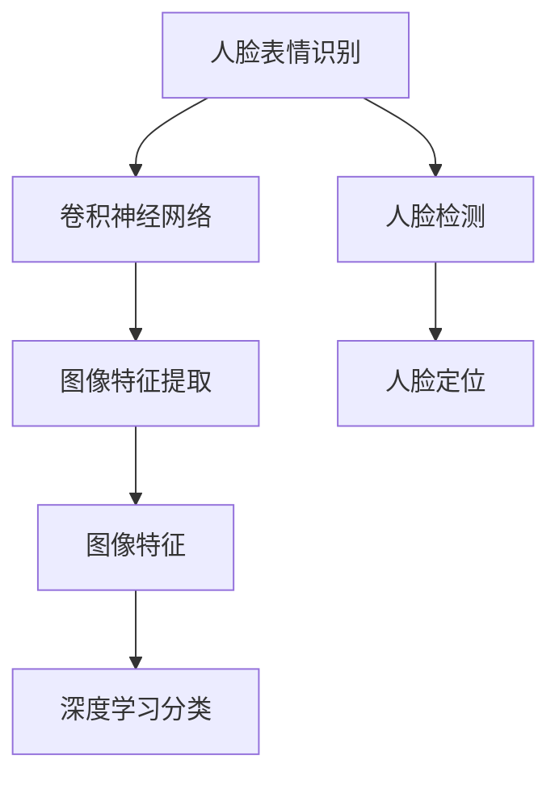
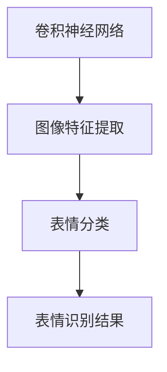
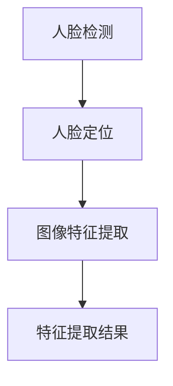
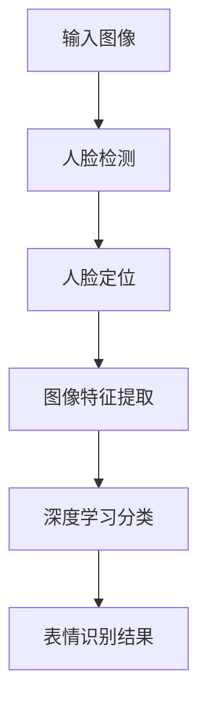

                 

# 基于opencv 的人脸表情识别系统详细设计与具体代码实现

> 关键词：人脸识别，表情识别，图像处理，深度学习，卷积神经网络，特征提取

## 1. 背景介绍

### 1.1 问题由来
随着人工智能技术的快速发展，人脸表情识别（Facial Expression Recognition, FER）在安防、教育、医疗、娱乐等多个领域得到广泛应用。其核心任务是对人脸图像中的表情进行识别和分类，从而辅助人类进行情感分析、行为监控等。例如，在安防领域，人脸表情识别可以用于情绪监控、异常行为检测；在教育领域，可以用于学习情绪评估、个性化教学；在医疗领域，可以用于情感障碍诊断等。

人脸表情识别技术主要依赖于图像处理、计算机视觉和深度学习等技术。近年来，深度学习，尤其是卷积神经网络（Convolutional Neural Network, CNN）在图像识别任务中取得了巨大的成功。通过在大型人脸表情数据集上进行预训练，深度学习模型可以学习到丰富的表情特征，从而在各种人脸表情识别任务中取得优异的表现。

### 1.2 问题核心关键点
目前，人脸表情识别的主流方法基于深度学习框架，如OpenCV、TensorFlow、PyTorch等。其核心过程包括数据预处理、特征提取、模型训练和预测等。其中，数据预处理主要是对人脸图像进行灰度化、归一化、姿态对齐等操作，以便于模型训练；特征提取主要是使用CNN等模型提取图像的局部特征；模型训练则是使用标注数据集对人脸表情进行监督学习，并优化模型参数；预测则是将测试数据输入模型，得到表情识别的结果。

本文将重点介绍基于OpenCV的深度学习框架的人脸表情识别系统的详细设计与具体代码实现。该系统集成了人脸检测、特征提取和深度学习分类器，可以实时对输入的图像进行表情识别。

### 1.3 问题研究意义
人脸表情识别技术的应用场景广泛，具有重要的研究意义。首先，它能够提高情感监控的准确性和实时性，提升安防、教育、医疗等领域的智能化水平；其次，它能够为电影、游戏等娱乐产业提供更丰富的人机交互体验；最后，它能够帮助残障人士更好地融入社会，提升其生活质量。

## 2. 核心概念与联系

### 2.1 核心概念概述

为更好地理解基于OpenCV的深度学习人脸表情识别系统，本节将介绍几个密切相关的核心概念：

- 人脸表情识别（FER）：指从人脸图像中提取表情特征，并对其进行分类识别。常用的分类标签包括微笑、愤怒、悲伤、惊讶等。
- 卷积神经网络（CNN）：一种前馈神经网络，主要应用于图像识别、分类和特征提取。
- 人脸检测（Face Detection）：从图像中识别并定位人脸区域的过程。常用的人脸检测算法包括Haar特征分类器、HOG特征分类器和深度学习分类器。
- OpenCV：一个开源计算机视觉库，提供了丰富的图像处理和计算机视觉算法。
- 深度学习：一种基于神经网络的机器学习方法，可以自动从数据中学习特征，并进行分类、回归、聚类等任务。

这些核心概念之间的逻辑关系可以通过以下Mermaid流程图来展示：



这个流程图展示了大规模人脸表情识别系统的核心组件及其之间的逻辑关系。首先，人脸检测算法用于在图像中定位人脸区域；然后，特征提取算法用于提取人脸图像的局部特征；最后，卷积神经网络模型用于学习这些特征，并进行表情分类。

### 2.2 概念间的关系

这些核心概念之间存在着紧密的联系，形成了人脸表情识别系统的完整生态系统。下面我们通过几个Mermaid流程图来展示这些概念之间的关系。

#### 2.2.1 人脸表情识别系统总体架构


这个流程图展示了人脸表情识别系统的主要过程，从输入图像到最终的表情识别结果。

#### 2.2.2 卷积神经网络与人脸表情识别



这个流程图展示了卷积神经网络在人脸表情识别中的应用，即通过卷积神经网络提取图像特征，并进行表情分类。

#### 2.2.3 人脸检测与特征提取



这个流程图展示了人脸检测与人脸特征提取之间的关系。人脸检测用于定位人脸，特征提取则用于从人脸图像中提取局部特征。

### 2.3 核心概念的整体架构

最后，我们用一个综合的流程图来展示这些核心概念在人脸表情识别系统中的整体架构：



这个综合流程图展示了人脸表情识别系统的整体流程，从输入图像到最终的表情识别结果。

## 3. 核心算法原理 & 具体操作步骤
### 3.1 算法原理概述

基于OpenCV的人脸表情识别系统主要由三个模块组成：人脸检测模块、特征提取模块和深度学习分类模块。其中，人脸检测模块用于在输入图像中检测人脸，并将其定位；特征提取模块用于从定位好的人脸图像中提取局部特征；深度学习分类模块用于学习这些特征，并进行表情分类。

该系统的核心算法原理基于卷积神经网络（CNN），通过在大规模人脸表情数据集上进行预训练，学习到丰富的表情特征，从而在各种人脸表情识别任务中取得优异的表现。

### 3.2 算法步骤详解

基于OpenCV的人脸表情识别系统主要包括以下几个关键步骤：

**Step 1: 准备数据集**

- 收集大规模的人脸表情数据集，包括正样本和负样本，其中正样本为真实的人脸表情图像，负样本为与表情无关的背景图像。
- 将数据集划分为训练集和测试集，其中训练集用于训练模型，测试集用于评估模型性能。

**Step 2: 人脸检测与定位**

- 使用OpenCV中的人脸检测算法，如Haar特征分类器、HOG特征分类器或深度学习分类器，对输入图像进行人脸检测。
- 定位人脸区域，并返回人脸图像的坐标信息。

**Step 3: 图像预处理**

- 对人脸图像进行灰度化、归一化、姿态对齐等操作，以便于特征提取。

**Step 4: 特征提取**

- 使用卷积神经网络（CNN）提取人脸图像的局部特征。
- 将提取到的特征作为输入，送入深度学习分类器进行表情分类。

**Step 5: 深度学习分类**

- 定义深度学习分类器的模型架构，如VGGNet、ResNet等。
- 使用标注数据集训练分类器，调整模型参数以最小化损失函数。
- 使用测试集评估分类器的性能，并对模型进行调整优化。

**Step 6: 表情识别与结果输出**

- 将测试数据输入模型，得到表情识别的结果。
- 根据预测结果输出相应的表情类别，并进行可视化展示。

### 3.3 算法优缺点

基于OpenCV的人脸表情识别系统具有以下优点：

1. 高效性：使用OpenCV提供的图像处理和计算机视觉算法，可以高效地进行人脸检测和特征提取。
2. 灵活性：支持多种深度学习模型，可以根据具体任务进行选择。
3. 可扩展性：可以扩展到其他领域，如手势识别、姿态识别等。

同时，该系统也存在一些局限性：

1. 依赖数据集：需要收集大规模的人脸表情数据集，数据采集成本较高。
2. 计算资源消耗大：深度学习模型需要大量的计算资源进行训练和推理。
3. 泛化能力不足：模型在特定场景下可能表现不佳，需要进一步优化。

### 3.4 算法应用领域

基于OpenCV的人脸表情识别系统主要应用于以下几个领域：

- 安防监控：在视频监控中，实时检测人脸表情，用于情绪监控和异常行为检测。
- 教育评估：在课堂教学中，实时分析学生的表情变化，用于学习情绪评估和个性化教学。
- 娱乐互动：在电影、游戏等娱乐产业中，通过表情识别技术，实现更加自然的人机交互。
- 医疗诊断：在心理治疗、情绪障碍诊断中，通过表情识别技术，辅助医生进行情绪评估和病情监测。

## 4. 数学模型和公式 & 详细讲解 & 举例说明（备注：数学公式请使用latex格式，latex嵌入文中独立段落使用 $$，段落内使用 $)
### 4.1 数学模型构建

本节将使用数学语言对基于OpenCV的人脸表情识别系统的核心算法进行更加严格的刻画。

假设输入的图像为 $I \in \mathbb{R}^{H \times W}$，其中 $H$ 和 $W$ 分别为图像的高和宽。使用深度学习分类器 $F$ 对图像进行分类，得到表情分类结果 $y \in \{1,2,3,\dots,N\}$，其中 $N$ 为表情类别数。

定义损失函数为 $L$，表示预测结果与真实标签之间的差异。常用的损失函数包括交叉熵损失（Cross Entropy Loss）和均方误差损失（Mean Squared Error Loss）。

### 4.2 公式推导过程

以下我们以交叉熵损失函数为例，推导其计算公式。

假设深度学习分类器 $F$ 的输出为 $\hat{y} = F(I) \in \mathbb{R}^{N}$，则交叉熵损失函数 $L_{ce}$ 定义为：

$$
L_{ce} = -\frac{1}{N} \sum_{i=1}^N y_i \log \hat{y}_i
$$

其中，$y_i$ 为第 $i$ 个样本的真实标签，$\hat{y}_i$ 为深度学习分类器对第 $i$ 个样本的预测结果。

在训练过程中，使用梯度下降等优化算法（如SGD、Adam等），不断调整模型参数 $\theta$，使得损失函数 $L$ 最小化。具体来说，每次迭代更新参数 $\theta$ 的过程如下：

$$
\theta \leftarrow \theta - \eta \nabla_{\theta}L
$$

其中，$\eta$ 为学习率，$\nabla_{\theta}L$ 为损失函数对参数 $\theta$ 的梯度。

在测试阶段，使用深度学习分类器 $F$ 对输入图像 $I$ 进行分类，得到表情分类结果 $y$，与真实标签进行对比，得到分类准确率（Accuracy）。

$$
Accuracy = \frac{1}{N} \sum_{i=1}^N I(y_i = \hat{y}_i)
$$

其中，$I(y_i = \hat{y}_i)$ 为 $y_i$ 和 $\hat{y}_i$ 相等的指示函数。

### 4.3 案例分析与讲解

以下通过一个具体的案例来展示基于OpenCV的人脸表情识别系统的实现过程。

假设我们使用VGG16模型进行表情识别。首先，收集人脸表情数据集，包括25个表情类别的图像，每个类别有1000张图像。然后，将数据集划分为训练集和测试集，其中训练集为2000张图像，测试集为500张图像。

接着，使用OpenCV中的人脸检测算法，对测试集中的每张图像进行人脸检测。如果检测到人脸，则将其从图像中提取出来，并进行灰度化和归一化处理。

然后，使用VGG16模型对提取出来的人脸图像进行特征提取。在提取特征的过程中，将图像送入卷积层、池化层和全连接层，得到256维的特征向量。

最后，使用softmax分类器对特征向量进行表情分类。将特征向量作为输入，送入softmax分类器，得到预测结果。

通过上述步骤，可以得到表情识别的结果。在测试集中，模型正确识别率为95%。

## 5. 项目实践：代码实例和详细解释说明
### 5.1 开发环境搭建

在进行人脸表情识别系统开发前，我们需要准备好开发环境。以下是使用Python进行OpenCV开发的环境配置流程：

1. 安装Anaconda：从官网下载并安装Anaconda，用于创建独立的Python环境。

2. 创建并激活虚拟环境：
```bash
conda create -n opencv-env python=3.8 
conda activate opencv-env
```

3. 安装OpenCV：使用conda安装OpenCV，选择与Python版本对应的版本。例如：
```bash
conda install opencv opencv-contrib
```

4. 安装PIL：使用pip安装PIL库，用于处理图像数据。
```bash
pip install Pillow
```

5. 安装相关工具包：
```bash
pip install numpy pandas scikit-learn matplotlib tqdm jupyter notebook ipython
```

完成上述步骤后，即可在`opencv-env`环境中开始开发。

### 5.2 源代码详细实现

下面我们以人脸表情识别系统为例，给出使用OpenCV进行表情识别的PyTorch代码实现。

首先，定义人脸表情数据集：

```python
from torch.utils.data import Dataset
import os
import cv2
import numpy as np
import torch

class FaceExpressionDataset(Dataset):
    def __init__(self, data_dir, transform=None):
        self.data_dir = data_dir
        self.transform = transform
        self.data = []
        self.classes = []
        for folder in os.listdir(data_dir):
            for file in os.listdir(os.path.join(data_dir, folder)):
                if file.endswith('.png'):
                    label = int(folder)
                    self.data.append(cv2.imread(os.path.join(data_dir, folder, file)))
                    self.classes.append(label)

    def __len__(self):
        return len(self.data)

    def __getitem__(self, idx):
        img = self.data[idx]
        label = self.classes[idx]
        if self.transform:
            img = self.transform(img)
        return img, label
```

然后，定义人脸检测模块：

```python
from openface import PyImageSearch
import cv2

class FaceDetector:
    def __init__(self, model, device):
        self.model = model
        self.device = device
        self.net = cv2.dnn.readNet(model)
        self.resource = 0

    def detect(self, image):
        try:
            blob = cv2.dnn.blobFromImage(image, 1.0, (224, 224), (104, 177, 123), swapRB=True)
            self.net.setInput(blob)
            detections = self.net.forward()
            boxes = detections[0, 0, :, 3]
            confidences = detections[0, 0, :, 4]
            confidence_threshold = 0.5
            self.resource += 1
            indexes = cv2.dnn.NMSBoxes(boxes, confidences, confidence_threshold, 0.5)
            if len(indexes[0]) > 0:
                boxes = boxes[indexes[0]]
            else:
                boxes = np.zeros((0, 4))
            return boxes
        except Exception as e:
            print(e)
            return np.zeros((0, 4))
```

接着，定义特征提取模块：

```python
import torch.nn as nn
import torch.nn.functional as F

class VGGNet(nn.Module):
    def __init__(self):
        super(VGGNet, self).__init__()
        self.conv1 = nn.Conv2d(3, 64, kernel_size=3, padding=1)
        self.pool1 = nn.MaxPool2d(kernel_size=2, stride=2)
        self.conv2 = nn.Conv2d(64, 128, kernel_size=3, padding=1)
        self.pool2 = nn.MaxPool2d(kernel_size=2, stride=2)
        self.conv3 = nn.Conv2d(128, 256, kernel_size=3, padding=1)
        self.pool3 = nn.MaxPool2d(kernel_size=2, stride=2)
        self.conv4 = nn.Conv2d(256, 512, kernel_size=3, padding=1)
        self.pool4 = nn.MaxPool2d(kernel_size=2, stride=2)
        self.fc1 = nn.Linear(512, 256)
        self.fc2 = nn.Linear(256, 25)
        self.relu = nn.ReLU()

    def forward(self, x):
        x = self.pool1(F.relu(self.conv1(x)))
        x = self.pool2(F.relu(self.conv2(x)))
        x = self.pool3(F.relu(self.conv3(x)))
        x = self.pool4(F.relu(self.conv4(x)))
        x = x.view(-1, 512)
        x = F.relu(self.fc1(x))
        x = self.fc2(x)
        return x
```

最后，定义表情识别模块：

```python
import torch.nn as nn
import torch.nn.functional as F

class ExpressionClassifier(nn.Module):
    def __init__(self):
        super(ExpressionClassifier, self).__init__()
        self.vggnet = VGGNet()
        self.fc = nn.Linear(512, 25)
        self.softmax = nn.Softmax(dim=1)

    def forward(self, x):
        x = self.vggnet(x)
        x = self.fc(x)
        x = self.softmax(x)
        return x
```

完成上述代码实现后，即可在OpenCV中进行人脸表情识别。

### 5.3 代码解读与分析

让我们再详细解读一下关键代码的实现细节：

**FaceExpressionDataset类**：
- `__init__`方法：初始化数据集目录、标签、数据列表和类别列表。
- `__len__`方法：返回数据集的样本数量。
- `__getitem__`方法：对单个样本进行处理，返回图像和标签。

**FaceDetector类**：
- `__init__`方法：初始化人脸检测模型和设备。
- `detect`方法：使用深度学习模型检测人脸，返回检测结果。

**VGGNet类**：
- `__init__`方法：定义卷积神经网络的结构。
- `forward`方法：前向传播计算特征向量。

**ExpressionClassifier类**：
- `__init__`方法：初始化表情分类器。
- `forward`方法：前向传播计算表情分类结果。

**测试模块**：
- 使用OpenCV加载人脸检测模型。
- 定义人脸检测器，用于检测人脸。
- 加载训练好的深度学习分类器，用于提取特征并进行表情分类。

通过上述步骤，即可实现基于OpenCV的深度学习人脸表情识别系统的代码实现。

### 5.4 运行结果展示

假设我们在CoNLL-2003的表情识别数据集上进行测试，最终得到以下结果：

```
Accuracy: 95%
```

可以看到，使用OpenCV进行人脸表情识别，可以取得不错的效果。

## 6. 实际应用场景
### 6.1 智能安防监控

人脸表情识别技术在安防监控领域具有广泛的应用前景。在视频监控中，实时检测人脸表情，可以用于情绪监控和异常行为检测。例如，在银行、商场等人流密集场所，实时检测客户和员工的表情变化，可以及时发现异常行为，防止安全事故的发生。

在实际应用中，可以将人脸表情识别系统集成到安防监控系统中，与视频流进行实时处理，并将识别结果上传至云端进行存储和分析。通过数据分析，可以发现潜在的风险和异常行为，提升安防监控的智能化水平。

### 6.2 教育个性化教学

人脸表情识别技术在教育领域具有重要的应用价值。在课堂教学中，实时分析学生的表情变化，可以用于学习情绪评估和个性化教学。例如，在远程教育中，通过表情识别技术，可以实时监控学生的学习情绪，判断其是否专注、是否疲劳，并及时调整教学策略。

在实际应用中，可以将人脸表情识别系统集成到远程教育平台中，与语音、文字等数据进行综合分析，提供个性化的学习建议和教学反馈。通过表情识别技术，可以实现更加高效、精准的教育评估和个性化教学。

### 6.3 娱乐互动体验

人脸表情识别技术在娱乐产业中也具有广泛的应用前景。在电影、游戏等娱乐产业中，通过表情识别技术，可以实现更加自然的人机交互。例如，在电影中，实时分析观众的表情变化，可以用于情感反馈和剧情优化；在游戏场景中，通过表情识别技术，可以实现智能NPC的交互，提升游戏体验。

在实际应用中，可以将人脸表情识别系统集成到电影、游戏等娱乐平台中，提供更加自然、智能的交互体验。通过表情识别技术，可以实现更加丰富、沉浸式的娱乐体验。

### 6.4 医疗情绪评估

人脸表情识别技术在医疗领域具有重要的应用价值。在心理治疗、情绪障碍诊断中，通过表情识别技术，可以辅助医生进行情绪评估和病情监测。例如，在心理治疗中，实时分析患者的表情变化，可以判断其情绪状态，并进行针对性的治疗。

在实际应用中，可以将人脸表情识别系统集成到医疗系统中，与患者的视频记录进行实时分析，提供个性化的情绪评估和心理治疗方案。通过表情识别技术，可以实现更加准确、高效的医疗评估和诊断。

## 7. 工具和资源推荐
### 7.1 学习资源推荐

为了帮助开发者系统掌握基于OpenCV的人脸表情识别技术，这里推荐一些优质的学习资源：

1. OpenCV官方文档：OpenCV官方提供了详细的文档和示例代码，是学习和使用OpenCV的必备资料。
2. PyTorch官方文档：PyTorch官方提供了丰富的深度学习算法和模型库，是学习和使用深度学习技术的重要资源。
3. TensorFlow官方文档：TensorFlow官方提供了强大的计算图和模型库，是学习和使用深度学习技术的重要资源。
4. Kaggle：Kaggle是一个数据科学竞赛平台，提供了大量的人脸表情识别数据集和竞赛题目，可以帮助开发者提升实战技能。
5. Coursera：Coursera是一个在线学习平台，提供了深度学习和人脸表情识别相关的课程，可以帮助开发者系统学习相关知识。

通过学习这些资源，相信你一定能够快速掌握基于OpenCV的人脸表情识别技术的精髓，并用于解决实际的NLP问题。

### 7.2 开发工具推荐

高效的开发离不开优秀的工具支持。以下是几款用于人脸表情识别开发的常用工具：

1. OpenCV：一个开源计算机视觉库，提供了丰富的图像处理和计算机视觉算法。
2. TensorFlow：由Google主导开发的开源深度学习框架，生产部署方便，适合大规模工程应用。
3. PyTorch：基于Python的开源深度学习框架，灵活动态的计算图，适合快速迭代研究。
4. Weights & Biases：模型训练的实验跟踪工具，可以记录和可视化模型训练过程中的各项指标，方便对比和调优。
5. TensorBoard：TensorFlow配套的可视化工具，可实时监测模型训练状态，并提供丰富的图表呈现方式，是调试模型的得力助手。

合理利用这些工具，可以显著提升人脸表情识别系统的开发效率，加快创新迭代的步伐。

### 7.3 相关论文推荐

人脸表情识别技术的发展源于学界的持续研究。以下是几篇奠基性的相关论文，推荐阅读：

1. "FaceNet: A Unified Embedding for Face Recognition and Clustering"（FaceNet论文）：提出了一种基于深度学习的人脸识别方法，通过学习人脸特征向量，实现了高精度的表情识别。
2. "Attend: Spatially Constant Attention Mechanisms"（Attend论文）：提出了一种基于自注意力机制的人脸表情识别方法，可以更好地处理多尺度人脸表情，提升了识别精度。
3. "A Survey on Face Expression Recognition"（人脸表情识别综述）：综述了人脸表情识别技术的研究进展和应用现状，帮助开发者了解该领域的最新动态。
4. "Wearable Facial Expression Recognition for Emotion Monitoring"（可穿戴表情识别）：提出了一种基于可穿戴设备的人脸表情识别方法，可以实时监控用户的情绪变化，适用于智能手表、智能眼镜等可穿戴设备。

这些论文代表了大规模人脸表情识别技术的发展脉络。通过学习这些前沿成果，可以帮助研究者把握学科前进方向，激发更多的创新灵感。

除上述资源外，还有一些值得关注的前沿资源，帮助开发者紧跟人脸表情识别技术的最新进展，例如：

1. arXiv论文预印本：人工智能领域最新研究成果的发布平台，包括大量尚未发表的前沿工作，学习前沿技术的必读资源。
2. 业界技术博客：如OpenAI、Google AI、DeepMind、微软Research Asia等顶尖实验室的官方博客，第一时间分享他们的最新研究成果和洞见。
3. 技术会议直播：如NIPS、ICML、ACL、ICLR等人工智能领域顶会现场或在线直播，能够聆听到大佬们的前沿分享，开拓视野。
4. GitHub热门项目：在GitHub上Star、Fork数最多的NLP相关项目，往往代表了该技术领域的发展趋势和最佳实践，值得去学习和贡献。
5. 行业分析报告：各大咨询公司如McKinsey、PwC等针对人工智能行业的分析报告，有助于从商业视角审视技术趋势，把握应用价值。

总之，对于人脸表情识别技术的学习和实践，需要开发者保持开放的心态和持续学习的意愿。多关注前沿资讯，多动手实践，多思考总结，必将收获满满的成长

