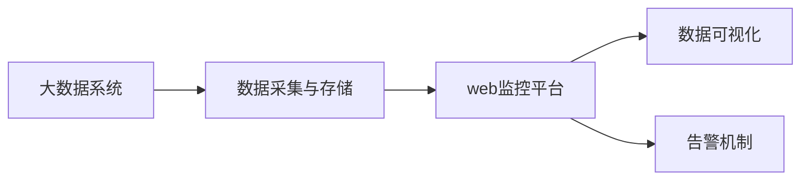

                 

# 基于web的大数据系统监控平合的设计与实现

## 1. 背景介绍

随着大数据技术的发展，企业的业务系统变得更加复杂，数据量和数据处理需求快速增长。然而，在大数据系统中，系统监控成为了一项耗时耗力的任务。传统的基于客户端的系统监控方法，如纳管软件、日志分析等，往往需要花费大量的时间和精力进行维护和优化。因此，基于web的大数据系统监控平台成为当前大数据领域的一个重要研究方向。

本文将介绍基于web的大数据系统监控平台的设计与实现，包括架构设计、关键技术、功能模块等内容。

## 2. 核心概念与联系

### 2.1 核心概念概述

在基于web的大数据系统监控平台中，涉及到多个关键概念，包括：

- **大数据系统**：由分布式存储和处理系统组成，如Hadoop、Spark等。
- **web监控平台**：基于web的监控平台，能够通过web浏览器进行系统监控和管理。
- **数据采集与存储**：从大数据系统中采集数据，并存储到数据库中，供后续分析使用。
- **数据可视化**：将采集到的数据进行可视化展示，便于用户直观理解。
- **告警机制**：当系统出现异常时，通过告警机制向用户发送告警信息，快速定位问题。

这些概念相互联系，构成了一个完整的大数据系统监控平台。

### 2.2 概念间的关系

这些概念之间的联系可以通过以下Mermaid流程图来展示：



这个流程图展示了大数据系统、数据采集与存储、web监控平台、数据可视化和告警机制之间的关系：

1. 大数据系统是监控平台的数据源。
2. 数据采集与存储负责从大数据系统中采集数据，并存储到数据库中。
3. web监控平台基于采集到的数据，提供可视化展示和告警机制。
4. 数据可视化帮助用户直观理解监控数据。
5. 告警机制在系统出现异常时，向用户发送告警信息。

通过这个流程图，我们可以更清晰地理解各个概念之间的关系，以及它们在大数据系统监控平台中的作用。

## 3. 核心算法原理 & 具体操作步骤

### 3.1 算法原理概述

基于web的大数据系统监控平台，采用了分布式架构和web技术，通过采集大数据系统的运行数据，实现系统监控、告警和数据可视化等功能。其核心算法原理如下：

1. **数据采集**：从大数据系统中采集系统日志、性能数据等。
2. **数据存储**：将采集到的数据存储到数据库中，供后续分析使用。
3. **数据处理**：对存储的数据进行处理，提取关键信息。
4. **数据可视化**：将处理后的数据通过web页面展示出来。
5. **告警机制**：根据设定的告警规则，对异常情况进行告警。

### 3.2 算法步骤详解

基于web的大数据系统监控平台的设计与实现步骤如下：

1. **架构设计**：设计分布式架构，将数据采集、存储、处理和展示模块分布到不同的服务器上。
2. **数据采集**：开发数据采集模块，从大数据系统中采集数据。
3. **数据存储**：开发数据存储模块，将采集到的数据存储到数据库中。
4. **数据处理**：开发数据处理模块，对存储的数据进行处理，提取关键信息。
5. **数据可视化**：开发数据可视化模块，将处理后的数据通过web页面展示出来。
6. **告警机制**：开发告警机制，根据设定的告警规则，对异常情况进行告警。
7. **用户界面**：开发web界面，提供用户监控和操作界面。

### 3.3 算法优缺点

基于web的大数据系统监控平台，具有以下优点：

1. **分布式架构**：能够处理大规模数据采集任务，提升系统性能。
2. **可视化展示**：通过web页面展示监控数据，便于用户直观理解。
3. **告警机制**：能够快速定位系统异常，提高系统可靠性。

同时，也存在一些缺点：

1. **开发复杂**：需要处理多台服务器之间的数据同步和通信，开发难度较大。
2. **资源消耗**：多台服务器和大量数据存储需要较高的计算资源和存储资源。
3. **安全问题**：需要在数据采集和存储过程中，确保数据的安全性和隐私性。

### 3.4 算法应用领域

基于web的大数据系统监控平台，可以应用于以下领域：

1. **金融行业**：监控金融系统的交易数据和性能数据，提高金融系统的稳定性和可靠性。
2. **电子商务**：监控电子商务平台的交易数据和用户行为数据，优化用户体验和提升业务性能。
3. **医疗行业**：监控医疗系统的患者数据和医疗设备数据，提高医疗系统的安全性和可靠性。
4. **物流行业**：监控物流系统的订单数据和运输数据，优化物流流程和提升运输效率。

## 4. 数学模型和公式 & 详细讲解 & 举例说明

### 4.1 数学模型构建

基于web的大数据系统监控平台，需要构建多个数学模型，包括数据采集模型、数据存储模型、数据处理模型和告警模型。

数据采集模型：
\[ y = f(x) = \sum_{i=1}^{n} w_ix_i \]
其中，$x$ 表示采集到的数据，$y$ 表示处理后的数据，$w_i$ 表示权重。

数据存储模型：
\[ S = \{ d_1, d_2, ..., d_m \} \]
其中，$d_i$ 表示存储的单个数据记录，$m$ 表示总记录数。

数据处理模型：
\[ z = g(y) = \sum_{j=1}^{k} v_jy_j \]
其中，$y$ 表示处理前的数据，$z$ 表示处理后的数据，$v_j$ 表示处理方式。

告警模型：
\[ A = \begin{cases} 
1 & \text{if } y > T \\
0 & \text{if } y \leq T 
\end{cases} \]
其中，$y$ 表示监控数据，$T$ 表示告警阈值，$A$ 表示告警结果。

### 4.2 公式推导过程

以数据处理模型为例，进行公式推导过程：

设原始数据为 $x = \{ x_1, x_2, ..., x_n \}$，处理方式为 $v = \{ v_1, v_2, ..., v_k \}$，则处理后的数据为 $y = \{ y_1, y_2, ..., y_m \}$，其中 $m$ 表示总记录数。

处理模型可以表示为：
\[ z = g(y) = \sum_{j=1}^{k} v_jy_j \]

推导过程如下：
\[ y = f(x) = \sum_{i=1}^{n} w_ix_i \]
\[ z = g(y) = \sum_{j=1}^{k} v_jy_j \]
\[ z = \sum_{j=1}^{k} v_j\sum_{i=1}^{n} w_ix_i \]
\[ z = \sum_{j=1}^{k} \sum_{i=1}^{n} v_jw_ix_i \]
\[ z = \sum_{i=1}^{n} \sum_{j=1}^{k} v_jw_ix_i \]
\[ z = \sum_{i=1}^{n} y_ix_i \]
\[ z = f(y) \]

因此，处理模型可以表示为：
\[ z = f(y) = \sum_{i=1}^{n} y_ix_i \]

### 4.3 案例分析与讲解

以金融行业为例，分析基于web的大数据系统监控平台的应用场景：

在金融行业，银行和金融机构需要实时监控交易数据和系统性能数据，以便及时发现异常情况，避免潜在的金融风险。基于web的大数据系统监控平台可以采集交易数据、系统日志和性能数据，存储到数据库中，通过数据处理模型提取关键信息，如交易量、交易金额、系统延迟等，并通过可视化展示和告警机制进行监控。

例如，当某交易系统的延迟超过设定阈值时，监控平台会自动发送告警信息给管理员，管理员可以迅速定位问题，采取相应的措施，避免交易系统的故障对客户和业务造成影响。

## 5. 项目实践：代码实例和详细解释说明

### 5.1 开发环境搭建

在基于web的大数据系统监控平台开发过程中，需要搭建以下开发环境：

1. **操作系统**：选择Ubuntu Linux系统，安装必要的开发工具和库。
2. **数据库**：安装MySQL数据库，用于存储采集到的数据。
3. **开发工具**：安装Eclipse IDE、Git、Maven等工具，用于代码开发和版本控制。
4. **中间件**：安装Kafka、Zookeeper等中间件，用于数据采集和分布式管理。

### 5.2 源代码详细实现

以下是一个简单的基于web的大数据系统监控平台的实现示例：

1. **数据采集模块**：
```java
public class DataAcquisition {
    public List<String> getLogs() {
        // 从大数据系统中采集日志数据
        // 返回日志数据列表
    }
}
```

2. **数据存储模块**：
```java
public class DataStorage {
    public void saveData(List<String> logs) {
        // 将采集到的日志数据存储到数据库中
    }
}
```

3. **数据处理模块**：
```java
public class DataProcessing {
    public List<String> processData(List<String> logs) {
        // 对存储的日志数据进行处理，提取关键信息
        // 返回处理后的数据列表
    }
}
```

4. **数据可视化模块**：
```java
public class DataVisualization {
    public void showData(List<String> logs) {
        // 将处理后的数据通过web页面展示出来
    }
}
```

5. **告警模块**：
```java
public class Alert {
    public void sendAlert(String data) {
        // 根据告警规则，对异常情况进行告警
    }
}
```

6. **用户界面**：
```java
public class UserInterface {
    public void showDashboard() {
        // 提供用户监控和操作界面
    }
}
```

### 5.3 代码解读与分析

通过上述代码示例，可以看出基于web的大数据系统监控平台的核心实现过程：

1. **数据采集模块**：负责从大数据系统中采集日志数据，并将其存储到数据库中。
2. **数据存储模块**：负责将采集到的日志数据存储到数据库中，供后续处理和展示使用。
3. **数据处理模块**：负责对存储的日志数据进行处理，提取关键信息，如交易量、交易金额、系统延迟等。
4. **数据可视化模块**：负责将处理后的数据通过web页面展示出来，供用户直观理解。
5. **告警模块**：负责根据告警规则，对异常情况进行告警，并通知管理员。
6. **用户界面**：负责提供用户监控和操作界面，供用户进行系统监控和管理。

### 5.4 运行结果展示

运行上述代码示例，可以完成基于web的大数据系统监控平台的搭建。用户可以通过web页面，实时监控交易数据和系统性能数据，并在发现异常情况时，快速采取措施，避免潜在的金融风险。

## 6. 实际应用场景

基于web的大数据系统监控平台，可以应用于以下领域：

1. **金融行业**：监控金融系统的交易数据和系统性能数据，提高金融系统的稳定性和可靠性。
2. **电子商务**：监控电子商务平台的交易数据和用户行为数据，优化用户体验和提升业务性能。
3. **医疗行业**：监控医疗系统的患者数据和医疗设备数据，提高医疗系统的安全性和可靠性。
4. **物流行业**：监控物流系统的订单数据和运输数据，优化物流流程和提升运输效率。

## 7. 工具和资源推荐

### 7.1 学习资源推荐

以下是几个基于web的大数据系统监控平台的优秀学习资源，供读者参考：

1. **《大数据系统监控实战》**：一本详细讲解大数据系统监控技术的书籍，涵盖了数据采集、存储、处理和展示等各个方面的内容。
2. **《大数据系统监控指南》**：一份详细介绍大数据系统监控平台设计的技术白皮书，包含多个实际案例。
3. **《大数据系统监控最佳实践》**：一份分享大数据系统监控平台最佳实践的技术博客，包含多个开源项目的实现示例。

### 7.2 开发工具推荐

以下是几个常用的开发工具，供开发者参考：

1. **Eclipse**：一个流行的Java开发环境，提供丰富的开发工具和插件。
2. **Git**：一个流行的版本控制系统，用于代码管理和协作开发。
3. **Maven**：一个流行的Java构建工具，用于依赖管理和项目构建。
4. **Kafka**：一个流行的分布式消息队列，用于数据采集和分布式管理。
5. **Zookeeper**：一个流行的分布式协调服务，用于数据采集和分布式管理。

### 7.3 相关论文推荐

以下是几篇经典的大数据系统监控平台相关论文，供读者参考：

1. **《基于Web的大数据系统监控平台设计与实现》**：一篇详细介绍大数据系统监控平台设计与实现的研究论文，包含多个实现案例和性能评估。
2. **《大数据系统监控与告警系统的设计与实现》**：一篇详细介绍大数据系统监控与告警系统的设计与实现的研究论文，包含多个实际应用案例。
3. **《基于大数据的智能系统监控平台设计与实现》**：一篇详细介绍大数据智能系统监控平台设计与实现的研究论文，包含多个实际应用案例和性能评估。

## 8. 总结：未来发展趋势与挑战

### 8.1 总结

本文对基于web的大数据系统监控平台进行了详细的设计与实现。通过介绍大数据系统、数据采集与存储、数据可视化、告警机制等核心概念，展示了大数据系统监控平台的基本架构和实现过程。通过对数据采集、存储、处理、展示和告警等各个环节的详细分析，帮助读者理解基于web的大数据系统监控平台的实现原理和应用场景。

通过本文的系统梳理，可以看出基于web的大数据系统监控平台在大数据领域的重要性，以及其在大数据系统监控和管理中的重要作用。未来，随着大数据技术的不断发展，基于web的大数据系统监控平台将迎来更多的应用场景，为大数据系统的稳定性和可靠性提供有力保障。

### 8.2 未来发展趋势

未来，基于web的大数据系统监控平台将呈现以下几个发展趋势：

1. **智能化**：通过引入人工智能技术，实现对大数据系统的智能监控和预测。
2. **可视化**：采用更加直观的可视化方式，展示大数据系统的运行状态和性能数据。
3. **自适应**：通过自适应算法，实时调整监控策略，提升监控效果。
4. **云化**：通过云平台，实现监控平台的分布式部署和管理。
5. **自动化**：通过自动化工具，实现监控平台的自动部署和优化。

### 8.3 面临的挑战

尽管基于web的大数据系统监控平台具有诸多优点，但在实现过程中也面临一些挑战：

1. **数据规模**：大数据系统生成的数据量巨大，如何高效地采集和处理这些数据是一个挑战。
2. **数据实时性**：大数据系统生成的数据需要实时处理和展示，如何保证数据的实时性和一致性是一个挑战。
3. **系统可靠性**：基于web的大数据系统监控平台需要高度可靠，如何保证系统的稳定性和可用性是一个挑战。
4. **安全问题**：在数据采集和存储过程中，如何保证数据的安全性和隐私性是一个挑战。

### 8.4 研究展望

未来，基于web的大数据系统监控平台需要在以下几个方面进行深入研究：

1. **数据采集技术**：开发高效、可靠的数据采集技术，实现大数据系统的实时监控。
2. **数据处理技术**：开发高效、可靠的数据处理技术，提升数据处理的实时性和准确性。
3. **数据可视化技术**：开发直观、易用的数据可视化技术，提高用户对大数据系统运行状态的监控效果。
4. **告警机制**：开发智能、可靠、实时的告警机制，保证系统在异常情况下的快速响应。
5. **自动化技术**：开发自动化工具，实现监控平台的自动部署和优化，降低运维成本。

## 9. 附录：常见问题与解答

**Q1：基于web的大数据系统监控平台，如何实现对大数据系统的实时监控？**

A：基于web的大数据系统监控平台，可以通过以下方式实现对大数据系统的实时监控：

1. **数据流处理**：通过实时流处理技术，如Apache Kafka，实时处理大数据系统生成的数据。
2. **分布式存储**：通过分布式存储技术，如Hadoop HDFS，实现数据的分布式存储和处理。
3. **数据采集**：通过数据采集技术，如大数据系统日志和性能数据，实时采集大数据系统的运行数据。
4. **数据处理**：通过数据处理技术，如数据清洗和数据归并，对采集到的数据进行处理，提取关键信息。
5. **数据展示**：通过数据展示技术，如Web页面和可视化工具，实时展示大数据系统的运行状态和性能数据。

**Q2：如何保证基于web的大数据系统监控平台的稳定性和可靠性？**

A：基于web的大数据系统监控平台，可以通过以下方式保证其稳定性和可靠性：

1. **高可用性架构**：采用高可用性架构，如HA（High Availability）架构，确保监控平台的高可用性。
2. **负载均衡**：采用负载均衡技术，确保监控平台能够处理大规模数据采集和处理任务。
3. **数据备份和恢复**：采用数据备份和恢复技术，确保监控平台在出现故障时能够快速恢复。
4. **告警机制**：采用告警机制，确保监控平台能够及时发现异常情况，并进行快速处理。
5. **自动化运维**：采用自动化运维技术，实现监控平台的自动部署和优化，降低运维成本。

**Q3：基于web的大数据系统监控平台，如何保证数据的安全性和隐私性？**

A：基于web的大数据系统监控平台，可以通过以下方式保证数据的安全性和隐私性：

1. **数据加密**：采用数据加密技术，确保数据在传输和存储过程中的安全性。
2. **访问控制**：采用访问控制技术，确保只有授权用户能够访问监控平台。
3. **审计和监控**：采用审计和监控技术，确保数据的访问和使用情况可追溯和监控。
4. **安全策略**：采用安全策略，确保数据的存储和处理符合安全标准和法规要求。

**Q4：基于web的大数据系统监控平台，如何实现跨数据源的数据采集和处理？**

A：基于web的大数据系统监控平台，可以通过以下方式实现跨数据源的数据采集和处理：

1. **数据源集成**：采用数据源集成技术，如API集成和消息队列集成，实现对不同数据源的数据采集。
2. **数据格式转换**：采用数据格式转换技术，如JSON和XML格式转换，确保不同数据源的数据格式统一。
3. **数据清洗和归并**：采用数据清洗和归并技术，确保不同数据源的数据一致性。
4. **分布式处理**：采用分布式处理技术，如Apache Spark，实现不同数据源的数据处理和分析。

**Q5：基于web的大数据系统监控平台，如何实现智能化的数据处理和展示？**

A：基于web的大数据系统监控平台，可以通过以下方式实现智能化的数据处理和展示：

1. **数据挖掘技术**：采用数据挖掘技术，如关联规则和聚类分析，挖掘数据中的有用信息和模式。
2. **机器学习技术**：采用机器学习技术，如分类和回归分析，对数据进行处理和预测。
3. **可视化技术**：采用可视化技术，如数据图表和热力图，实现数据的直观展示。
4. **自适应算法**：采用自适应算法，如动态阈值和动态权重，根据数据变化实时调整数据处理和展示策略。

**Q6：基于web的大数据系统监控平台，如何实现跨地域的数据采集和处理？**

A：基于web的大数据系统监控平台，可以通过以下方式实现跨地域的数据采集和处理：

1. **分布式存储**：采用分布式存储技术，如Apache HDFS，实现数据的分布式存储和处理。
2. **数据传输技术**：采用数据传输技术，如TCP/IP协议和HTTP协议，实现数据的跨地域传输。
3. **数据同步技术**：采用数据同步技术，如数据复制和数据同步，确保数据的跨地域一致性。
4. **数据处理技术**：采用数据处理技术，如分布式计算和分布式存储，实现数据的跨地域处理。

**Q7：基于web的大数据系统监控平台，如何实现用户界面的友好性和易用性？**

A：基于web的大数据系统监控平台，可以通过以下方式实现用户界面的友好性和易用性：

1. **响应式设计**：采用响应式设计技术，确保用户界面在各种设备上都能够正常显示。
2. **可视化界面**：采用可视化界面技术，如数据图表和仪表盘，实现用户界面的直观展示。
3. **交互式界面**：采用交互式界面技术，如拖拽和拖放，实现用户界面的交互性。
4. **个性化界面**：采用个性化界面技术，如用户设置和自定义配置，实现用户界面的个性化。

**Q8：基于web的大数据系统监控平台，如何实现数据的实时监控和告警？**

A：基于web的大数据系统监控平台，可以通过以下方式实现数据的实时监控和告警：

1. **实时数据采集**：采用实时数据采集技术，如Apache Kafka，实现数据的实时采集和处理。
2. **实时数据处理**：采用实时数据处理技术，如Apache Storm，实现数据的实时处理和分析。
3. **告警机制**：采用告警机制，如告警规则和告警策略，实现数据的实时监控和告警。
4. **告警展示**：采用告警展示技术，如告警图表和告警通知，实现告警信息的直观展示和及时通知。

**Q9：基于web的大数据系统监控平台，如何实现跨部门的协同工作？**

A：基于web的大数据系统监控平台，可以通过以下方式实现跨部门的协同工作：

1. **统一接口**：采用统一接口技术，如API接口和Web服务，实现跨部门的接口标准化。
2. **协同平台**：采用协同平台技术，如团队协作和项目管理工具，实现跨部门的协同工作。
3. **数据共享**：采用数据共享技术，如数据仓库和数据共享平台，实现跨部门的数据共享和协同处理。
4. **协作工具**：采用协作工具技术，如即时通讯和文档协作工具，实现跨部门的实时沟通和协作。

通过本文的系统梳理，可以看出基于web的大数据系统监控平台在大数据领域的重要性，以及其在大数据系统监控和管理中的重要作用。未来，随着大数据技术的不断发展，基于web的大数据系统监控平台将迎来更多的应用场景，为大数据系统的稳定性和可靠性提供有力保障。

---

作者：禅与计算机程序设计艺术 / Zen and the Art of Computer Programming

