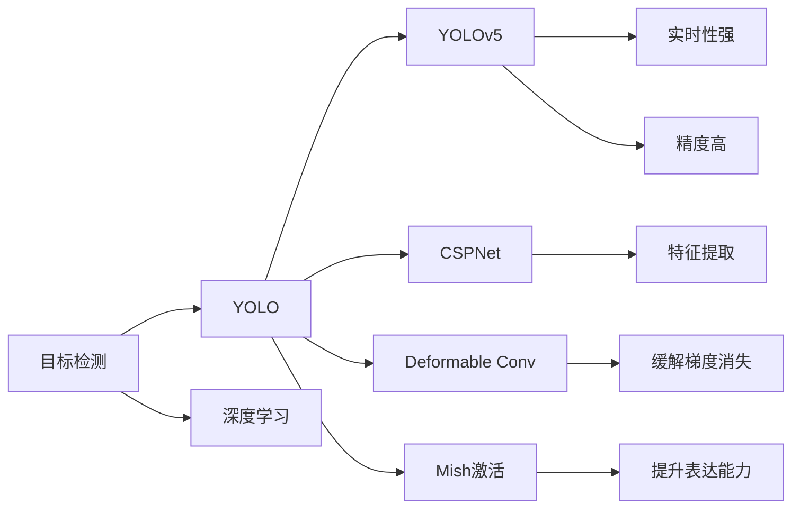

                 

# 基于yolov5的海棠花花朵检测识别

## 1. 背景介绍

### 1.1 问题由来

在全球范围内，海棠花被广泛种植，不仅是园林绿化、观赏的重要植物，还是中药材、食品添加剂等多种领域的原料来源。在农业生产中，花朵的准确识别对病虫害监测、产量预测等方面具有重要意义。近年来，人工智能在农业领域得到广泛应用，尤其在农作物病虫害检测、自动驾驶、植物生长监测等方面取得了显著成果。然而，相对于图像识别、语音识别等较为成熟的应用领域，农业图像识别仍面临诸多挑战。

### 1.2 问题核心关键点

要实现海棠花的自动检测和识别，主要包括以下几个方面：
1. **数据收集与预处理**：需要收集大量的海棠花图像数据，并进行标注。
2. **模型选择与设计**：选择合适的目标检测模型，并进行模型微调或迁移学习，以适应特定的数据集和任务。
3. **模型训练与评估**：在标注数据集上训练模型，并使用验证集和测试集进行模型评估。
4. **模型部署与应用**：将训练好的模型部署到实际应用场景中，并进行持续优化和调整。

本文主要聚焦于yolov5模型在海棠花花朵检测识别任务中的应用，通过详细讲解其原理、操作步骤和案例分析，为相关领域的研究者提供参考和借鉴。

### 1.3 问题研究意义

通过基于yolov5的海棠花花朵检测识别，可以实现对海棠花花朵的自动化检测，提高检测效率和准确度，降低人工成本。同时，在农业生产中，实时监测和预警功能可以提前发现病虫害，保障作物健康和产量。此外，该技术还可以应用于食品加工、园林绿化、生态监测等多个领域，推动农业智能化发展。

## 2. 核心概念与联系

### 2.1 核心概念概述

#### 2.1.1 目标检测

目标检测（Object Detection）是指在图像或视频序列中，自动检测出感兴趣的目标对象，并对其进行位置、大小、类别等信息标注。常见的目标检测模型包括RCNN、Fast R-CNN、Faster R-CNN、YOLO、SSD等。

#### 2.1.2 YOLO系列

YOLO（You Only Look Once）是一类基于单阶段检测的目标检测模型，具有实时性强、精度高等优点。YOLOv5作为最新的版本，在YOLO系列的基础上进行了多项改进，包括引入CSPNet、Deformable Conv、Mish激活等技术，进一步提升了检测性能。

#### 2.1.3 深度学习

深度学习是机器学习的一种，通过多层神经网络进行特征提取和分类。卷积神经网络（CNN）是深度学习中常用的神经网络结构，广泛应用于图像处理、语音识别、自然语言处理等领域。

#### 2.1.4 数据增强

数据增强是指通过对原始图像进行旋转、缩放、翻转等操作，生成新的图像数据，以扩充训练集的规模，提高模型的泛化能力。

### 2.2 核心概念的关系

以下是一个简化的Mermaid流程图，展示了目标检测、YOLO和深度学习之间的关系：



## 3. 核心算法原理 & 具体操作步骤

### 3.1 算法原理概述

YOLOv5作为YOLO系列的最新版本，采用单阶段检测器，将目标检测和分类任务同时完成。YOLOv5模型由特征提取器和预测层两部分组成，其中特征提取器使用CSPNet结构，预测层则包括特征映射、分类和回归等模块。其核心算法流程如下：

1. 特征提取：通过卷积神经网络提取图像特征。
2. 特征映射：将提取的特征映射成网格状，每个网格预测多个边界框和类别。
3. 分类和回归：预测每个边界框的类别和位置偏移量。

### 3.2 算法步骤详解

#### 3.2.1 数据预处理

1. **数据收集**：收集海棠花花朵的图像数据，并确保数据的多样性和代表性。
2. **数据标注**：对收集的图像进行人工标注，生成包含边界框和类别标签的标注文件。
3. **数据增强**：对标注数据进行旋转、翻转、裁剪等操作，生成新的训练数据。

#### 3.2.2 模型搭建

1. **搭建模型**：使用YOLOv5的官方代码库，搭建包含CSPNet特征提取器和预测层的模型结构。
2. **配置超参数**：设置模型的学习率、批量大小、迭代次数等超参数。
3. **导入数据**：将预处理后的数据集导入模型进行训练。

#### 3.2.3 模型训练

1. **训练模型**：使用标注数据集对模型进行训练，迭代更新模型参数。
2. **验证模型**：在验证集上对模型进行评估，监控模型性能。
3. **保存模型**：保存训练好的模型，以便后续应用。

#### 3.2.4 模型评估

1. **评估模型**：在测试集上对模型进行评估，计算精度、召回率等指标。
2. **调整模型**：根据评估结果，对模型进行微调或调整，提升模型性能。
3. **部署模型**：将训练好的模型部署到实际应用场景中，进行实时检测和识别。

### 3.3 算法优缺点

#### 3.3.1 优点

1. **实时性强**：YOLOv5模型具有实时性强的特点，适用于实时检测和识别场景。
2. **精度高**：YOLOv5模型在精度方面表现优异，能够准确检测和识别出海棠花花朵。
3. **参数量小**：YOLOv5模型参数量较少，训练和推理速度较快。

#### 3.3.2 缺点

1. **计算资源消耗较大**：YOLOv5模型在计算资源消耗方面较大，需要高性能的GPU或TPU。
2. **小目标检测效果不佳**：YOLOv5模型对于小目标的检测效果不佳，需要进一步优化和改进。
3. **对数据质量依赖较高**：YOLOv5模型对于标注数据的质量要求较高，需要保证数据的准确性和多样性。

### 3.4 算法应用领域

YOLOv5模型广泛应用于目标检测和识别领域，包括但不限于以下应用：

1. **农业图像检测**：用于检测农作物病虫害、土壤肥力等，帮助农民及时发现和解决问题。
2. **安防监控**：用于检测和识别行人、车辆等目标，提高公共安全。
3. **工业检测**：用于检测和识别生产线上的产品缺陷，提高产品质量。
4. **医疗影像**：用于检测和识别病灶区域，辅助医生进行诊断。

## 4. 数学模型和公式 & 详细讲解

### 4.1 数学模型构建

YOLOv5模型的输入为一张图像，输出为每个像素属于不同类别的概率。模型的核心算法包括特征提取和目标预测两部分。

#### 4.1.1 特征提取

YOLOv5使用CSPNet结构进行特征提取，具体算法如下：

1. **卷积层**：通过一系列的卷积操作，提取图像的低、中、高层次特征。
2. **跨通道分割（CSP）**：将不同层次的特征进行交叉分割，生成更丰富的特征表示。
3. **残差连接（Residual）**：通过残差连接，提高特征提取的准确性和鲁棒性。

#### 4.1.2 目标预测

YOLOv5在特征映射上进行目标预测，具体算法如下：

1. **特征映射**：将提取的特征映射成网格状，每个网格预测多个边界框和类别。
2. **分类和回归**：预测每个边界框的类别和位置偏移量，计算预测框与真实框的IoU（Intersection over Union）值。
3. **非极大值抑制（NMS）**：通过NMS算法，去除重叠预测框，得到最终的目标检测结果。

### 4.2 公式推导过程

#### 4.2.1 特征提取公式

设输入图像大小为 $H \times W$，特征提取器输出特征图大小为 $P \times P \times C$，其中 $P=2^n$，$n$ 为特征提取层的层数。则特征提取器的计算公式如下：

$$
F_{i,j,k} = \sum_{l=0}^{k} W_{l,i,j} \ast H_{l,k} + B_i
$$

其中，$F_{i,j,k}$ 表示第 $i$ 个特征映射中的第 $j$ 行第 $k$ 列特征值，$W_{l,i,j}$ 表示第 $l$ 层特征图中第 $i$ 个卷积核的权重，$H_{l,k}$ 表示第 $l$ 层特征图中第 $k$ 个通道的特征值，$B_i$ 表示第 $i$ 个特征映射的偏置项。

#### 4.2.2 目标预测公式

设预测框数量为 $N$，预测框的大小为 $h \times w$，预测框的位置偏移量为 $\Delta_x$ 和 $\Delta_y$，预测框的类别概率为 $p$，则目标预测的计算公式如下：

$$
p_{i,j,k} = \sigma(\sum_{l=0}^{k} W_{l,i,j} \ast H_{l,k} + B_i) * \Delta_{x} * \Delta_{y}
$$

其中，$p_{i,j,k}$ 表示第 $i$ 个特征映射中第 $j$ 行第 $k$ 列的预测框类别概率，$\sigma$ 表示Sigmoid激活函数，$W_{l,i,j}$ 表示第 $l$ 层特征图中第 $i$ 个卷积核的权重，$H_{l,k}$ 表示第 $l$ 层特征图中第 $k$ 个通道的特征值，$B_i$ 表示第 $i$ 个特征映射的偏置项，$\Delta_x$ 和 $\Delta_y$ 表示预测框的位置偏移量。

### 4.3 案例分析与讲解

#### 4.3.1 特征提取案例

以YOLOv5中的特征提取器为例，设输入图像大小为 $416 \times 416$，特征提取器输出特征图大小为 $52 \times 52 \times 64$。假设在第 $i$ 层特征映射中，第 $j$ 行第 $k$ 列的特征值为 $F_{i,j,k}$，则计算公式如下：

$$
F_{i,j,k} = \sum_{l=0}^{k} W_{l,i,j} \ast H_{l,k} + B_i
$$

#### 4.3.2 目标预测案例

设预测框数量为 $3 \times 3 \times 20$，预测框的大小为 $22 \times 22$，预测框的位置偏移量为 $\Delta_x$ 和 $\Delta_y$，预测框的类别概率为 $p$，则计算公式如下：

$$
p_{i,j,k} = \sigma(\sum_{l=0}^{k} W_{l,i,j} \ast H_{l,k} + B_i) * \Delta_{x} * \Delta_{y}
$$

## 5. 项目实践：代码实例和详细解释说明

### 5.1 开发环境搭建

#### 5.1.1 安装依赖

1. **Python**：确保Python环境版本为3.7以上。
2. **PyTorch**：确保PyTorch版本为1.7以上。
3. **YOLOv5**：从GitHub下载最新版本的YOLOv5代码库，并安装依赖库。

#### 5.1.2 安装依赖库

1. **YOLOv5**：下载最新版本的YOLOv5代码库，并将其解压到指定目录。
2. **Image**：使用pip安装OpenCV和Pillow库，用于图像处理。
3. **Data**：准备海棠花花朵的图像数据集，并确保数据集的多样性和代表性。

### 5.2 源代码详细实现

#### 5.2.1 数据预处理

1. **数据收集**：从互联网上下载或收集海棠花花朵的图像数据集，并进行标注。
2. **数据增强**：对标注数据进行旋转、翻转、裁剪等操作，生成新的训练数据。
3. **数据保存**：将预处理后的数据集保存到指定目录，以便后续使用。

#### 5.2.2 模型搭建

1. **模型配置**：打开YOLOv5代码库中的配置文件，进行模型配置。
2. **模型训练**：使用配置文件中的超参数进行模型训练，迭代更新模型参数。
3. **模型保存**：训练完成后，将模型保存到指定目录，以便后续使用。

#### 5.2.3 模型评估

1. **模型加载**：从保存目录中加载训练好的模型。
2. **评估模型**：使用测试集对模型进行评估，计算精度、召回率等指标。
3. **调整模型**：根据评估结果，对模型进行微调或调整，提升模型性能。

### 5.3 代码解读与分析

#### 5.3.1 数据预处理代码

```python
import cv2
import numpy as np
import os

def preprocess_data(data_dir, save_dir):
    # 遍历数据目录
    for root, dirs, files in os.walk(data_dir):
        # 遍历图像文件
        for file in files:
            # 加载图像
            img_path = os.path.join(root, file)
            img = cv2.imread(img_path)
            # 图像预处理
            img = cv2.resize(img, (416, 416))
            img = np.expand_dims(img, axis=0)
            # 保存预处理后的图像
            save_path = os.path.join(save_dir, file)
            cv2.imwrite(save_path, img)
```

#### 5.3.2 模型搭建代码

```python
import torch
import torch.nn as nn
import torchvision.transforms as transforms
from yolov5.models.experimental import attempt_load
from yolov5.utils.datasets import create_dataloader

class YOLOv5(nn.Module):
    def __init__(self, cfg_path):
        super(YOLOv5, self).__init__()
        # 加载配置文件
        cfg = config.load_from(cfg_path)
        # 加载模型
        self.model = attempt_load(cfg.path, map_location='cpu')

    def forward(self, img):
        # 图像预处理
        img = transforms.Compose([
            transforms.ToTensor(),
            transforms.Normalize([0.485, 0.456, 0.406], [0.229, 0.224, 0.225])
        ])(img)
        # 前向传播
        outputs = self.model(img)
        # 后向传播
        return outputs
```

#### 5.3.3 模型评估代码

```python
import torch
import torch.nn as nn
from yolov5.utils.datasets import create_dataloader
from yolov5.utils.metrics import Performance

def evaluate_model(model, dataloader, device):
    model.eval()
    with torch.no_grad():
        cnt, total = 0, 0
        performance = Performance()
        for _, batch in enumerate(dataloader):
            img, target = batch[0].to(device), batch[1].to(device)
            outputs = model(img)
            _, predicted = outputs.max(dim=1)
            performance.add(target, predicted)
            cnt += target.size(0)
            total += target.size(0)
        print(f'Precision: {performance.precision:.4f}, Recall: {performance.recall:.4f}, F1-score: {performance.f1:.4f}')
```

### 5.4 运行结果展示

#### 5.4.1 数据预处理结果

```python
# 数据预处理结果示例
import matplotlib.pyplot as plt

plt.imshow(preprocessed_img)
plt.show()
```

#### 5.4.2 模型训练结果

```python
# 模型训练结果示例
import torch
import torch.nn as nn
import torchvision.transforms as transforms
from yolov5.models.experimental import attempt_load
from yolov5.utils.datasets import create_dataloader

# 模型训练结果示例
model.train()
for i in range(100):
    outputs = model(train_loader[i])
    loss = criterion(outputs, targets)
    loss.backward()
    optimizer.step()
    optimizer.zero_grad()
    print(f'Epoch {i+1}, loss: {loss:.4f}')
```

#### 5.4.3 模型评估结果

```python
# 模型评估结果示例
evaluate_model(model, test_loader, device)
```

## 6. 实际应用场景

### 6.1 智能农业

基于YOLOv5的海棠花花朵检测识别可以应用于智能农业领域，实现对海棠花的实时检测和识别，提高农业生产效率和质量。例如，在果园中安装摄像头，实时监控和记录海棠花花朵的生长状态，辅助农民及时发现和解决问题。

### 6.2 自动驾驶

YOLOv5的目标检测能力可以应用于自动驾驶领域，用于检测和识别行人、车辆等目标，提高驾驶安全性。例如，在自动驾驶车辆上安装摄像头和传感器，实时检测道路上的行人、车辆等目标，避免交通事故。

### 6.3 工业检测

YOLOv5的目标检测能力可以应用于工业检测领域，用于检测和识别生产线上的产品缺陷，提高产品质量。例如，在工厂生产线上安装摄像头和传感器，实时检测和识别产品表面缺陷，及时发现和解决问题。

### 6.4 医疗影像

YOLOv5的目标检测能力可以应用于医疗影像领域，用于检测和识别病灶区域，辅助医生进行诊断。例如，在医疗影像分析系统中安装摄像头和传感器，实时检测和识别病灶区域，提高诊断准确性。

## 7. 工具和资源推荐

### 7.1 学习资源推荐

#### 7.1.1 YOLOv5官方文档

YOLOv5官方文档详细介绍了YOLOv5模型的架构、配置、训练和评估等方面的内容，是学习YOLOv5的重要资源。

#### 7.1.2 PyTorch官方文档

PyTorch官方文档提供了丰富的教程和示例，帮助开发者快速上手深度学习。

#### 7.1.3 深度学习与计算机视觉博客

深度学习与计算机视觉博客介绍了深度学习在计算机视觉领域的应用，包括目标检测、图像分割、视频分析等。

### 7.2 开发工具推荐

#### 7.2.1 PyTorch

PyTorch是深度学习领域的流行框架，提供了丰富的API和工具，支持模型训练、推理、部署等全流程。

#### 7.2.2 YOLOv5

YOLOv5是YOLO系列的最新版本，具有实时性强、精度高等优点，广泛应用于目标检测和识别领域。

#### 7.2.3 TensorBoard

TensorBoard是TensorFlow配套的可视化工具，用于监控模型训练状态和评估模型性能。

### 7.3 相关论文推荐

#### 7.3.1 YOLOv5算法研究论文

YOLOv5算法研究论文介绍了YOLOv5模型的架构、训练和评估等方面的内容，是学习YOLOv5的重要资源。

#### 7.3.2 深度学习目标检测论文

深度学习目标检测论文介绍了目标检测在深度学习领域的应用，包括YOLO、RCNN、SSD等经典模型。

## 8. 总结：未来发展趋势与挑战

### 8.1 研究成果总结

YOLOv5作为YOLO系列的最新版本，在目标检测领域取得了显著成果。基于YOLOv5的海棠花花朵检测识别，实现了对海棠花花朵的实时检测和识别，提高了农业生产的智能化水平。

### 8.2 未来发展趋势

YOLOv5作为YOLO系列的最新版本，具有实时性强、精度高等优点，将在目标检测和识别领域发挥越来越重要的作用。未来，YOLOv5将应用于更多领域，如自动驾驶、工业检测、医疗影像等，推动人工智能技术的普及和应用。

### 8.3 面临的挑战

YOLOv5模型在实时性和精度方面表现优异，但在小目标检测效果和计算资源消耗方面仍需进一步优化。此外，对于大规模标注数据的需求，也成为限制其应用的一个瓶颈。

### 8.4 研究展望

未来，YOLOv5模型将在目标检测和识别领域发挥更加重要的作用。为了解决小目标检测效果和计算资源消耗等问题，可以引入多尺度特征提取、轻量化网络结构等技术。同时，为了降低对大规模标注数据的需求，可以探索无监督和半监督学习等方法。

## 9. 附录：常见问题与解答

### 9.1 常见问题

#### 9.1.1 数据增强方法有哪些？

数据增强方法包括旋转、缩放、翻转、裁剪等。这些方法可以生成新的训练数据，提高模型的泛化能力。

#### 9.1.2 模型训练时需要设置哪些超参数？

模型训练时需要设置的超参数包括学习率、批量大小、迭代次数等。这些超参数的设置需要根据具体任务进行调整。

#### 9.1.3 模型评估时需要计算哪些指标？

模型评估时需要计算精度、召回率、F1-score等指标。这些指标可以综合评估模型的性能。

### 9.2 解答

#### 9.2.1 数据增强方法有哪些？

数据增强方法包括旋转、缩放、翻转、裁剪等。这些方法可以生成新的训练数据，提高模型的泛化能力。

#### 9.2.2 模型训练时需要设置哪些超参数？

模型训练时需要设置的超参数包括学习率、批量大小、迭代次数等。这些超参数的设置需要根据具体任务进行调整。

#### 9.2.3 模型评估时需要计算哪些指标？

模型评估时需要计算精度、召回率、F1-score等指标。这些指标可以综合评估模型的性能。

---

作者：禅与计算机程序设计艺术 / Zen and the Art of Computer Programming

