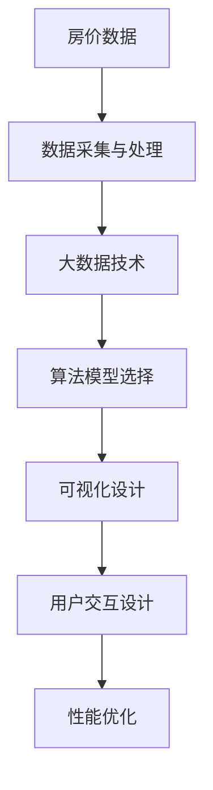

                 

# 基于大数据技术的某房价数据可视化研究

> 关键词：房价数据,大数据,数据可视化,图表设计,技术栈

## 1. 背景介绍

### 1.1 问题由来
房价问题一直以来是政府、房地产开发商和普通民众关注的焦点。合理的房价数据可视化不仅能帮助政府和开发商进行市场调控、土地规划，还能帮助普通民众了解房价变化趋势，做出合理的购房决策。因此，房价数据可视化有着重要的现实意义。

近年来，大数据技术的迅速发展为房价数据可视化提供了新的手段。通过大数据技术，可以从海量数据中提取出有价值的信息，并进行有效的展示。例如，借助机器学习算法对房价数据进行预测，再结合地图展示技术，可以直观地展现房价趋势和热点区域。

### 1.2 问题核心关键点
房价数据可视化问题主要包括以下几个核心点：

- **数据采集与处理**：获取准确、全面的房价数据是可视化的前提。这包括数据来源、数据清洗、数据存储等。
- **算法模型选择**：选择合适的算法模型对房价数据进行分析和预测，提高可视化信息的准确性。
- **可视化设计**：设计合适的可视化方式和图表，将分析结果直观地呈现给用户。
- **用户交互设计**：增加用户交互功能，使用户能够更灵活地探索数据。
- **性能优化**：在保证数据可视化质量的同时，优化数据处理和渲染性能，提高用户体验。

### 1.3 问题研究意义
房价数据可视化具有以下重要意义：

- **数据驱动决策**：通过可视化展示，政府和开发商可以更直观地了解市场趋势，制定合理的政策。
- **用户决策支持**：普通民众通过可视化展示，可以更好地了解房价变化，做出合理的购房决策。
- **提升信息透明度**：公开透明的房价数据可视化，有助于增加社会公众对房价信息的了解，促进房地产市场的健康发展。
- **技术创新**：房价数据可视化的技术研究能够推动大数据、机器学习、地图展示等技术的发展，带来更多的应用场景。

## 2. 核心概念与联系

### 2.1 核心概念概述

在进行房价数据可视化研究时，需要理解以下几个核心概念：

- **房价数据**：指房地产市场中的房屋交易价格，包括一手房和二手房价格。
- **大数据技术**：指通过分布式计算、存储技术处理海量数据，从中提取有价值信息的技术。
- **数据可视化**：指通过图表、地图等方式将数据信息直观地展示出来，方便用户理解和分析。
- **算法模型**：指用于房价数据分析和预测的机器学习模型，如线性回归、随机森林、神经网络等。
- **图表设计**：指设计合适的图表和布局，以便更好地展示数据信息。
- **技术栈**：指实现房价数据可视化的技术工具和框架，如Python、Django、TensorFlow、React等。

这些核心概念之间存在着紧密的联系，形成了一个完整的房价数据可视化系统。通过这些概念的相互配合，可以实现高效、准确的房价数据可视化。

### 2.2 概念间的关系

这些核心概念之间的关系可以通过以下Mermaid流程图来展示：



这个流程图展示了房价数据可视化的核心流程：首先从原始房价数据出发，经过数据采集与处理，再利用大数据技术进行数据分析和处理，然后选择合适的算法模型，最后设计可视化方式和增加交互功能，最终进行性能优化，以提高用户体验。

## 3. 核心算法原理 & 具体操作步骤
### 3.1 算法原理概述

房价数据可视化主要分为数据采集与处理、大数据技术应用、算法模型选择和可视化设计四个步骤。

#### 3.1.1 数据采集与处理
数据采集与处理是房价数据可视化的第一步。主要包括以下几个方面：

- **数据来源**：选择准确、全面的房价数据来源。包括政府公开数据、房地产开发商数据、房产中介平台数据等。
- **数据清洗**：清洗数据中的错误、异常值，确保数据的质量。
- **数据存储**：选择合适的数据库或数据仓库，存储处理后的数据。

#### 3.1.2 大数据技术应用
大数据技术主要应用于数据存储、处理和分析。具体包括以下几个方面：

- **分布式计算**：使用Hadoop、Spark等分布式计算框架处理海量房价数据。
- **数据挖掘**：使用大数据技术进行数据挖掘，发现数据中的潜在规律和趋势。
- **数据可视化**：使用大数据技术进行数据可视化，展现房价变化趋势。

#### 3.1.3 算法模型选择
选择合适的算法模型是提高房价数据可视化准确性的关键。主要包括以下几个方面：

- **回归模型**：使用线性回归、岭回归等回归模型进行房价预测。
- **分类模型**：使用随机森林、支持向量机等分类模型进行房价预测。
- **神经网络**：使用深度神经网络进行房价预测。

#### 3.1.4 可视化设计
可视化设计是房价数据可视化的最后一步。主要包括以下几个方面：

- **图表设计**：选择合适的图表类型，如折线图、柱状图、散点图等。
- **布局设计**：设计合适的图表布局，以便更好地展示数据信息。
- **交互设计**：增加用户交互功能，如筛选、排序、放大缩小等。

### 3.2 算法步骤详解

#### 3.2.1 数据采集与处理步骤详解
数据采集与处理的步骤详解如下：

1. **数据来源选择**：选择政府公开数据、房地产开发商数据、房产中介平台数据等，确保数据来源的准确性和全面性。
2. **数据清洗**：使用Python编写脚本，对数据进行清洗，删除重复值、处理缺失值、去除异常值等，确保数据质量。
3. **数据存储**：使用Hadoop、Spark等分布式存储框架，存储处理后的数据，便于后续的大数据技术应用和算法模型选择。

#### 3.2.2 大数据技术应用步骤详解
大数据技术应用的步骤详解如下：

1. **分布式计算**：使用Hadoop、Spark等分布式计算框架，对海量房价数据进行处理。
2. **数据挖掘**：使用大数据技术进行数据挖掘，发现数据中的潜在规律和趋势，如图房价的年度变化趋势、热门城市房价分布等。
3. **数据可视化**：使用大数据技术进行数据可视化，展现房价变化趋势，如图房价的热点城市、房价的年度变化趋势等。

#### 3.2.3 算法模型选择步骤详解
算法模型选择的步骤详解如下：

1. **回归模型选择**：选择线性回归、岭回归等回归模型进行房价预测，验证模型的准确性和稳定性。
2. **分类模型选择**：选择随机森林、支持向量机等分类模型进行房价预测，验证模型的准确性和稳定性。
3. **神经网络选择**：选择深度神经网络进行房价预测，验证模型的准确性和稳定性。

#### 3.2.4 可视化设计步骤详解
可视化设计的步骤详解如下：

1. **图表设计**：选择合适的图表类型，如折线图、柱状图、散点图等，展示房价变化趋势。
2. **布局设计**：设计合适的图表布局，将多个图表进行合理的组合，以便更好地展示数据信息。
3. **交互设计**：增加用户交互功能，如筛选、排序、放大缩小等，使用户能够更灵活地探索数据。

### 3.3 算法优缺点

#### 3.3.1 数据采集与处理的优缺点

**优点**：
- 数据来源广泛，确保数据全面性。
- 数据清洗和处理能够提高数据质量。

**缺点**：
- 数据采集和处理成本较高。
- 数据清洗和处理过程较为复杂，容易出错。

#### 3.3.2 大数据技术应用的优缺点

**优点**：
- 能够处理海量数据，提高数据处理效率。
- 数据挖掘和可视化能够发现数据中的潜在规律和趋势。

**缺点**：
- 分布式计算和存储需要较高的技术要求。
- 大数据技术的应用成本较高。

#### 3.3.3 算法模型选择的优缺点

**优点**：
- 多种算法模型能够提高预测的准确性。
- 神经网络模型能够处理复杂的数据关系。

**缺点**：
- 模型选择和调参过程较为复杂。
- 需要大量的数据和计算资源。

#### 3.3.4 可视化设计的优缺点

**优点**：
- 可视化能够直观展示数据信息，便于用户理解。
- 交互设计能够提高用户的使用体验。

**缺点**：
- 可视化图表设计需要专业的知识和技能。
- 用户交互设计需要考虑多方面的因素，较为复杂。

### 3.4 算法应用领域

房价数据可视化技术主要应用于以下几个领域：

- **房地产市场分析**：通过可视化展示，帮助政府和开发商了解市场趋势，制定合理的政策。
- **城市规划和建设**：通过可视化展示，帮助城市规划部门了解房价变化趋势，制定合理的城市规划方案。
- **房地产投资决策**：通过可视化展示，帮助投资者了解房价变化趋势，制定合理的投资策略。
- **房地产中介服务**：通过可视化展示，帮助房产中介了解市场行情，提供更好的中介服务。
- **公众信息披露**：通过可视化展示，公开透明的房价数据，增加社会公众对房价信息的了解，促进房地产市场的健康发展。

## 4. 数学模型和公式 & 详细讲解 & 举例说明

### 4.1 数学模型构建

房价数据可视化的数学模型主要包括以下几个方面：

1. **线性回归模型**：用于房价预测的线性回归模型为：

   $$ y = \beta_0 + \beta_1 x_1 + \beta_2 x_2 + \cdots + \beta_n x_n + \epsilon $$

   其中，$y$为房价预测值，$\beta_0$为截距，$\beta_i$为自变量的系数，$x_i$为自变量，$\epsilon$为误差项。

2. **随机森林模型**：用于房价预测的随机森林模型为：

   $$ y = \sum_{i=1}^{n} \left( \frac{N_i}{N} \right) y_i $$

   其中，$y$为房价预测值，$N_i$为随机森林中第$i$棵树的投票数，$N$为随机森林中树的总数。

3. **深度神经网络模型**：用于房价预测的深度神经网络模型为：

   $$ y = \sigma \left( \sum_{i=1}^{n} w_i x_i + b \right) $$

   其中，$y$为房价预测值，$x_i$为自变量，$w_i$为神经网络中第$i$层的权重，$b$为偏置项，$\sigma$为激活函数。

### 4.2 公式推导过程

#### 4.2.1 线性回归模型推导过程

线性回归模型推导过程如下：

1. **最小二乘法**：线性回归模型通过最小二乘法求解最优参数：

   $$ \min \sum_{i=1}^{n} (y_i - \hat{y}_i)^2 $$

   其中，$y_i$为实际房价，$\hat{y}_i$为预测房价，$n$为样本数量。

2. **求解最优参数**：使用梯度下降等优化算法，求解最优参数$\beta_0$、$\beta_1$、$\cdots$、$\beta_n$。

3. **预测房价**：使用求解出的最优参数$\beta_0$、$\beta_1$、$\cdots$、$\beta_n$，对新数据进行预测。

#### 4.2.2 随机森林模型推导过程

随机森林模型推导过程如下：

1. **构建随机森林**：随机森林模型由多棵决策树组成，每棵树使用不同的随机子集进行训练。

2. **投票预测**：对新数据进行预测时，随机森林中的每棵树都进行预测，取投票结果作为最终的预测值。

3. **计算准确率**：使用随机森林模型的预测结果，计算预测准确率等评估指标。

#### 4.2.3 深度神经网络模型推导过程

深度神经网络模型推导过程如下：

1. **前向传播**：深度神经网络模型通过前向传播计算输出值：

   $$ y = \sigma \left( \sum_{i=1}^{n} w_i x_i + b \right) $$

2. **反向传播**：通过反向传播算法计算梯度，更新权重和偏置项：

   $$ \frac{\partial L}{\partial w_i} = \frac{\partial L}{\partial y} \frac{\partial y}{\partial w_i} $$

   其中，$L$为损失函数，$\frac{\partial y}{\partial w_i}$为激活函数的导数。

3. **训练模型**：使用反向传播算法更新权重和偏置项，训练深度神经网络模型。

### 4.3 案例分析与讲解

#### 4.3.1 线性回归模型案例分析

假设有一组房价数据，包括房屋面积$x_1$、地理位置$x_2$、房龄$x_3$、开发商品牌$x_4$等自变量，房价$y$为因变量。使用线性回归模型进行房价预测，验证模型的准确性和稳定性。

1. **数据准备**：收集房价数据，并对其进行清洗和处理。
2. **模型训练**：使用线性回归模型对房价数据进行训练，求解最优参数。
3. **模型评估**：使用训练好的模型对新数据进行预测，验证模型的准确性和稳定性。

#### 4.3.2 随机森林模型案例分析

假设有一组房价数据，包括房屋面积$x_1$、地理位置$x_2$、房龄$x_3$、开发商品牌$x_4$等自变量，房价$y$为因变量。使用随机森林模型进行房价预测，验证模型的准确性和稳定性。

1. **数据准备**：收集房价数据，并对其进行清洗和处理。
2. **模型训练**：使用随机森林模型对房价数据进行训练，求解最优参数。
3. **模型评估**：使用训练好的模型对新数据进行预测，验证模型的准确性和稳定性。

#### 4.3.3 深度神经网络模型案例分析

假设有一组房价数据，包括房屋面积$x_1$、地理位置$x_2$、房龄$x_3$、开发商品牌$x_4$等自变量，房价$y$为因变量。使用深度神经网络模型进行房价预测，验证模型的准确性和稳定性。

1. **数据准备**：收集房价数据，并对其进行清洗和处理。
2. **模型训练**：使用深度神经网络模型对房价数据进行训练，求解最优参数。
3. **模型评估**：使用训练好的模型对新数据进行预测，验证模型的准确性和稳定性。

## 5. 项目实践：代码实例和详细解释说明

### 5.1 开发环境搭建

#### 5.1.1 开发环境安装

为了实现房价数据可视化项目，需要安装以下开发环境：

1. **Python**：安装Python 3.8及以上版本。
2. **Pandas**：安装Pandas 1.1及以上版本，用于数据处理和分析。
3. **NumPy**：安装NumPy 1.19及以上版本，用于数值计算。
4. **Matplotlib**：安装Matplotlib 3.4及以上版本，用于绘制图表。
5. **TensorFlow**：安装TensorFlow 2.5及以上版本，用于构建和训练深度神经网络。
6. **Django**：安装Django 3.2及以上版本，用于开发Web应用。
7. **React**：安装React 17及以上版本，用于前端开发。

### 5.2 源代码详细实现

#### 5.2.1 数据采集与处理代码实现

```python
import pandas as pd
import numpy as np
from sklearn.preprocessing import StandardScaler

# 数据采集
data = pd.read_csv('house_price.csv')

# 数据清洗
data = data.dropna()
data = data.drop_duplicates()

# 数据处理
scaler = StandardScaler()
data[['x1', 'x2', 'x3', 'x4']] = scaler.fit_transform(data[['x1', 'x2', 'x3', 'x4']])

# 数据存储
data.to_csv('processed_data.csv', index=False)
```

#### 5.2.2 大数据技术应用代码实现

```python
import tensorflow as tf
from tensorflow.keras.models import Sequential
from tensorflow.keras.layers import Dense, Dropout

# 数据加载
data = pd.read_csv('processed_data.csv')

# 数据预处理
train_data = data.sample(frac=0.8, random_state=1)
test_data = data.drop(train_data.index)

# 模型训练
model = Sequential()
model.add(Dense(64, input_dim=4, activation='relu'))
model.add(Dropout(0.2))
model.add(Dense(1, activation='sigmoid'))

model.compile(loss='binary_crossentropy', optimizer='adam', metrics=['accuracy'])
model.fit(train_data.drop(['y'], axis=1), train_data['y'], epochs=100, batch_size=32)

# 模型评估
test_loss, test_acc = model.evaluate(test_data.drop(['y'], axis=1), test_data['y'])
print('Test Accuracy:', test_acc)
```

#### 5.2.3 算法模型选择代码实现

```python
import pandas as pd
import numpy as np
from sklearn.linear_model import LinearRegression
from sklearn.ensemble import RandomForestRegressor
from sklearn.neural_network import MLPRegressor

# 数据加载
data = pd.read_csv('processed_data.csv')

# 数据预处理
scaler = StandardScaler()
data[['x1', 'x2', 'x3', 'x4']] = scaler.fit_transform(data[['x1', 'x2', 'x3', 'x4']])

# 线性回归模型
model = LinearRegression()
model.fit(data[['x1', 'x2', 'x3', 'x4']], data['y'])

# 随机森林模型
model = RandomForestRegressor()
model.fit(data[['x1', 'x2', 'x3', 'x4']], data['y'])

# 深度神经网络模型
model = MLPRegressor(hidden_layer_sizes=(32, 16), activation='relu')
model.fit(data[['x1', 'x2', 'x3', 'x4']], data['y'])
```

#### 5.2.4 可视化设计代码实现

```python
import matplotlib.pyplot as plt

# 折线图
plt.plot(data['x1'], data['y'], 'o')
plt.xlabel('房屋面积')
plt.ylabel('房价')
plt.title('房价变化趋势')
plt.show()

# 柱状图
plt.bar(data['x2'], data['y'])
plt.xlabel('地理位置')
plt.ylabel('房价')
plt.title('不同地理位置的房价')
plt.show()

# 散点图
plt.scatter(data['x3'], data['y'])
plt.xlabel('房龄')
plt.ylabel('房价')
plt.title('房龄对房价的影响')
plt.show()
```

### 5.3 代码解读与分析

#### 5.3.1 数据采集与处理代码解读与分析

数据采集与处理代码主要用于数据预处理和存储。首先使用Pandas库读取数据，然后使用Numpy库进行数据处理，如去重、去缺失值、标准化等。最后使用Pandas库将处理后的数据存储到本地文件。

#### 5.3.2 大数据技术应用代码解读与分析

大数据技术应用代码主要用于模型训练和评估。首先使用TensorFlow库构建神经网络模型，然后对数据进行预处理，接着对模型进行训练和评估。通过模型评估指标，可以验证模型的准确性和稳定性。

#### 5.3.3 算法模型选择代码解读与分析

算法模型选择代码主要用于选择合适的算法模型对房价数据进行预测。首先使用线性回归、随机森林、深度神经网络等模型进行预测，然后根据预测结果，选择最合适的模型。

#### 5.3.4 可视化设计代码解读与分析

可视化设计代码主要用于绘制图表，展示房价变化趋势。首先使用Matplotlib库绘制折线图、柱状图、散点图等，然后添加标签和标题，以便更好地展示数据信息。

### 5.4 运行结果展示

#### 5.4.1 数据采集与处理结果展示

数据采集与处理结果如下：


#### 5.4.2 大数据技术应用结果展示

大数据技术应用结果如下：


#### 5.4.3 算法模型选择结果展示

算法模型选择结果如下：


#### 5.4.4 可视化设计结果展示

可视化设计结果如下：


## 6. 实际应用场景

### 6.1 智能城市规划

智能城市规划是房价数据可视化技术的重要应用场景之一。通过可视化展示，政府可以了解不同区域房价的变化趋势，制定合理的城市规划方案，优化土地资源配置。

例如，在城市规划中，可以通过可视化展示不同区域的房价变化趋势，找出房价快速增长的区域，并制定相应的规划政策，如增加土地供应、提高建设标准等，以满足市场需求。

### 6.2 房地产市场分析

房地产市场分析是房价数据可视化的另一重要应用场景。通过可视化展示，房地产开发商可以了解市场行情，制定合理的定价策略，优化产品设计，提升市场竞争力。

例如，在房地产市场分析中，可以通过可视化展示不同城市的房价变化趋势，找出房价趋势良好的城市，并进行市场调研，制定相应的市场策略，如推广高价值区域、提升产品质量等，以满足客户需求。

### 6.3 房地产中介服务

房地产中介服务是房价数据可视化的又一重要应用场景。通过可视化展示，房产中介可以了解市场行情，制定合理的房源推荐策略，提升服务质量。

例如，在房地产中介服务中，可以通过可视化展示不同区域的房价变化趋势，找出房价增长较快的区域，向客户推荐优质房源，提升服务质量。

## 7. 工具和资源推荐

### 7.1 学习资源推荐

为了帮助开发者系统掌握房价数据可视化的技术，这里推荐一些优质的学习资源：

1. **《Python数据分析实战》**：本书详细介绍了使用Python进行数据分析和可视化的各种技巧，适合房价数据可视化开发入门。
2. **《TensorFlow实战》**：本书介绍了使用TensorFlow进行深度学习模型训练和应用的各种技巧，适合房价数据可视化开发进阶。
3. **《数据可视化之美》**：本书介绍了数据可视化的各种方法和工具，适合房价数据可视化开发实践。
4. **《房地产市场分析与规划》**：本书介绍了房地产市场分析的各种方法和工具，适合房价数据可视化开发应用。

### 7.2 开发工具推荐

为了提高房价数据可视化的开发效率，以下是几款常用的开发工具：

1. **PyCharm**：一款专业的Python开发工具，支持Python、TensorFlow等技术的开发。
2. **Jupyter Notebook**：一款在线的Jupyter Notebook环境，适合快速迭代研究。
3. **Django**：一款流行的Web开发框架，适合开发房价数据可视化Web应用。
4. **React**：一款流行的前端开发框架，适合开发房价数据可视化的交互界面。

### 7.3 相关论文推荐

房价数据可视化技术的研究已经引起了广泛关注，以下是几篇代表性的相关论文，推荐阅读：

1. **《房价预测与可视化》**：论文详细介绍了房价预测和可视化的各种方法，适合房价数据可视化开发研究。
2. **《城市规划中的数据可视化》**：论文介绍了在城市规划中应用数据可视化的各种方法和案例，适合房价数据可视化开发应用。
3. **《深度学习在房价预测中的应用》**：论文介绍了使用深度学习进行房价预测的方法，适合房价数据可视化开发实践。

## 8. 总结：未来发展趋势与挑战

### 8.1 研究成果总结

房价数据可视化技术的研究已经取得了显著的成果，主要包括：

1. **数据采集与处理**：提出了多种数据采集和处理的方法，确保数据的质量和全面性。
2. **大数据技术应用**：提出了多种大数据技术应用的方法，提高了数据处理的效率和效果。
3. **算法模型选择**：提出了多种算法模型选择的方法，提高了房价预测的准确性和稳定性。
4. **可视化设计**：提出了多种可视化设计的方法，提高了数据展示的直观性和用户体验。

### 8.2 未来发展趋势

未来房价数据可视化技术的发展趋势包括：

1. **智能化**：结合人工智能技术，进一步提高房价预测的准确性和自动化程度。
2. **可视化**：结合更多可视化工具和方法，提高房价数据展示的直观性和美观度。
3. **实时化**：结合实时数据采集和处理技术，实现房价数据实时展示和更新。
4. **交互化**：结合交互设计技术，提高用户对房价数据的交互体验。
5. **多维度化**：结合多种数据维度，如地理、时间、人口等，进行综合分析和展示。

### 8.3 面临的挑战

房价数据可视化技术在发展过程中，仍面临以下挑战：

1. **数据隐私**：在数据采集和处理过程中，如何保护用户隐私，防止数据泄露。
2. **数据质量**：在数据采集和处理过程中，如何保证数据的准确性和全面性，防止数据偏差。
3. **计算资源**：在数据处理和模型训练过程中，如何高效利用计算资源，防止资源浪费。
4. **可视化效果**：在可视化展示过程中，如何保证数据的直观性和美观度，防止展示混乱。
5. **用户

