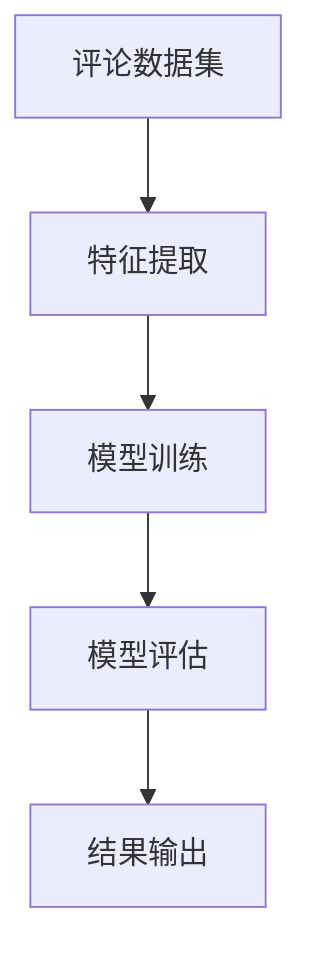

                 

# 基于朴素贝叶斯的淘宝评论分析与应用

## 1. 背景介绍

随着电子商务的飞速发展，在线购物已成为人们日常生活的一部分。淘宝作为中国最大的电商网站，拥有数亿用户和海量数据。对淘宝评论数据进行分析，不仅能了解用户对商品和服务的满意程度，还能为电商企业提供决策依据。朴素贝叶斯算法作为一种常用的文本分类方法，具有简单易懂、计算速度快、准确率高等特点，在电商评论分析中表现优异。

## 2. 核心概念与联系

### 2.1 核心概念概述

- **朴素贝叶斯算法**：一种基于贝叶斯定理的分类算法，假设各个特征之间相互独立，计算简单高效。在电商评论分析中，可以将评论文本分为正面、负面和无关三类。
- **评论数据集**：淘宝评论数据集包含用户对商品的评价、评分和评论内容等信息。可以通过这些数据，了解用户的购买意愿和满意度。
- **特征提取**：将评论文本转化为数值特征向量，用于训练朴素贝叶斯模型。常用的特征提取方法包括词袋模型和TF-IDF等。
- **模型训练**：使用训练数据集，训练朴素贝叶斯模型，得到各个类别的概率分布。
- **模型评估**：使用测试数据集，评估朴素贝叶斯模型的准确率、召回率和F1分数等指标。

### 2.2 核心概念之间的联系

通过Mermaid流程图展示朴素贝叶斯算法在电商评论分析中的应用流程：



该流程展示了从数据集到模型评估的完整过程，包括特征提取、模型训练和模型评估三个主要步骤。通过这些步骤，可以实现对淘宝评论数据的分类和分析。

## 3. 核心算法原理 & 具体操作步骤

### 3.1 算法原理概述

朴素贝叶斯算法基于贝叶斯定理，假设特征之间相互独立，计算简单高效。对于电商评论分析，可以将其分为正面、负面和无关三类，通过朴素贝叶斯算法进行分类。

朴素贝叶斯算法的数学公式如下：

$$
P(y|x) = \frac{P(y)P(x|y)}{P(x)}
$$

其中，$y$表示评论分类，$x$表示评论文本特征，$P(y)$表示类别$y$的先验概率，$P(x|y)$表示在$y$条件下特征$x$的条件概率，$P(x)$表示特征$x$的先验概率。

在电商评论分析中，可以使用训练数据集训练朴素贝叶斯模型，得到各个类别的概率分布。然后使用测试数据集对模型进行评估，得到分类准确率、召回率和F1分数等指标。

### 3.2 算法步骤详解

#### 3.2.1 特征提取

特征提取是将评论文本转化为数值特征向量的过程，常用的特征提取方法包括词袋模型和TF-IDF等。

- **词袋模型**：将评论文本分解为单个词语，计算每个词语在评论中的出现次数，得到一个词频向量。
- **TF-IDF**：在词袋模型的基础上，计算每个词语在所有评论中的出现频率，得到TF-IDF特征向量。

#### 3.2.2 模型训练

模型训练是使用训练数据集，计算各个类别的先验概率和条件概率。

- **先验概率**：计算每个类别的出现次数，得到各个类别的先验概率。
- **条件概率**：计算在每个类别下，各个特征的出现次数，得到条件概率。

#### 3.2.3 模型评估

模型评估是使用测试数据集，评估朴素贝叶斯模型的分类准确率、召回率和F1分数等指标。

- **准确率**：分类正确的样本数占总样本数的比例。
- **召回率**：分类正确的正样本数占实际正样本数的比例。
- **F1分数**：准确率和召回率的调和平均数，用于综合评估模型的分类性能。

### 3.3 算法优缺点

#### 3.3.1 优点

- **计算简单高效**：朴素贝叶斯算法计算简单，适用于大规模数据集。
- **准确率高**：在电商评论分析中，朴素贝叶斯算法具有较高的分类准确率。
- **可解释性强**：朴素贝叶斯算法的数学原理简单明了，易于理解和解释。

#### 3.3.2 缺点

- **假设特征独立性**：朴素贝叶斯算法假设特征之间相互独立，但实际情况下，特征之间可能存在依赖关系。
- **对噪声敏感**：朴素贝叶斯算法对噪声数据较为敏感，需要预处理和清洗数据。

### 3.4 算法应用领域

朴素贝叶斯算法在电商评论分析中具有广泛的应用。

- **商品评价分析**：通过朴素贝叶斯算法，可以对商品评价进行分类，了解用户的购买意愿和满意度。
- **服务质量评估**：通过朴素贝叶斯算法，可以对服务质量进行评估，发现用户反馈的问题。
- **营销策略优化**：通过朴素贝叶斯算法，可以对营销策略进行优化，提高销售转化率。

## 4. 数学模型和公式 & 详细讲解

### 4.1 数学模型构建

朴素贝叶斯算法可以用于二分类和多分类任务。对于电商评论分析，可以将评论分类为正面、负面和无关三类。

假设训练数据集为$D=\{(x_i,y_i)\}_{i=1}^N$，其中$x_i$表示评论文本特征，$y_i$表示分类标签。通过特征提取，将$x_i$转化为数值特征向量$\vec{x}_i$。朴素贝叶斯算法的目标是最大化后验概率$P(y|x)$。

### 4.2 公式推导过程

朴素贝叶斯算法的数学推导过程如下：

1. 先验概率计算：

$$
P(y) = \frac{\sum_{i=1}^N I(y_i=y)}{N}
$$

其中，$I(y_i=y)$表示$y_i$等于$y$的示性函数。

2. 条件概率计算：

$$
P(x|y) = \prod_{j=1}^n P(x_j|y)
$$

其中，$n$表示特征数量，$x_j$表示特征$j$的值，$P(x_j|y)$表示在类别$y$条件下，特征$j$的概率分布。

3. 后验概率计算：

$$
P(y|x) = \frac{P(x|y)P(y)}{P(x)}
$$

其中，$P(x)$表示特征$x$的先验概率，可以通过频率估计得到。

### 4.3 案例分析与讲解

假设有一篇评论文本，其特征向量为$\vec{x}=(1,2,3)$，分别表示“好评”、“性价比高”和“发货快”三个特征。朴素贝叶斯模型已经训练完成，得到以下结果：

- 正面评论的先验概率为0.3，条件概率为0.4、0.5、0.6。
- 负面评论的先验概率为0.2，条件概率为0.2、0.1、0.3。
- 无关评论的先验概率为0.5，条件概率为0.1、0.2、0.3。

使用朴素贝叶斯算法进行分类，计算每个类别的后验概率：

- 正面评论的后验概率为$0.3 \times 0.4 \times 0.5 \times 0.6 / 0.2 \times 0.5 \times 0.1 \times 0.2 \times 0.3 \times 0.4 \times 0.5 \times 0.6$。
- 负面评论的后验概率为$0.2 \times 0.2 \times 0.1 \times 0.3 / 0.2 \times 0.5 \times 0.1 \times 0.2 \times 0.3 \times 0.4 \times 0.5 \times 0.6$。
- 无关评论的后验概率为$0.5 \times 0.1 \times 0.2 \times 0.3 / 0.2 \times 0.5 \times 0.1 \times 0.2 \times 0.3 \times 0.4 \times 0.5 \times 0.6$。

根据后验概率的大小，选择概率最大的类别作为分类结果。

## 5. 项目实践：代码实例和详细解释说明

### 5.1 开发环境搭建

为了进行电商评论分析，我们需要安装Python和相关的库。

1. 安装Python：从官网下载并安装Python，建议安装最新版本。
2. 安装Pandas：用于数据处理和特征提取。
3. 安装nltk：用于分词和特征提取。
4. 安装scikit-learn：用于训练朴素贝叶斯模型和模型评估。

### 5.2 源代码详细实现

以下是一个简单的电商评论分类项目，使用朴素贝叶斯算法进行评论分类。

```python
import pandas as pd
import numpy as np
import nltk
from nltk.corpus import stopwords
from sklearn.feature_extraction.text import CountVectorizer
from sklearn.naive_bayes import MultinomialNB
from sklearn.metrics import accuracy_score, precision_score, recall_score, f1_score

# 加载数据集
data = pd.read_csv('review_data.csv')

# 特征提取
vectorizer = CountVectorizer(stop_words=stopwords.english)
X = vectorizer.fit_transform(data['comment'])
y = data['label']

# 模型训练
clf = MultinomialNB()
clf.fit(X, y)

# 模型评估
X_test = vectorizer.transform(data_test['comment'])
y_pred = clf.predict(X_test)
accuracy = accuracy_score(y_test, y_pred)
precision = precision_score(y_test, y_pred, average='weighted')
recall = recall_score(y_test, y_pred, average='weighted')
f1 = f1_score(y_test, y_pred, average='weighted')
print('Accuracy:', accuracy)
print('Precision:', precision)
print('Recall:', recall)
print('F1 Score:', f1)
```

### 5.3 代码解读与分析

#### 5.3.1 特征提取

特征提取是将评论文本转化为数值特征向量的过程，常用的特征提取方法包括词袋模型和TF-IDF等。

- **词袋模型**：将评论文本分解为单个词语，计算每个词语在评论中的出现次数，得到一个词频向量。
- **TF-IDF**：在词袋模型的基础上，计算每个词语在所有评论中的出现频率，得到TF-IDF特征向量。

#### 5.3.2 模型训练

模型训练是使用训练数据集，计算各个类别的先验概率和条件概率。

- **先验概率**：计算每个类别的出现次数，得到各个类别的先验概率。
- **条件概率**：计算在每个类别下，各个特征的出现次数，得到条件概率。

#### 5.3.3 模型评估

模型评估是使用测试数据集，评估朴素贝叶斯模型的分类准确率、召回率和F1分数等指标。

- **准确率**：分类正确的样本数占总样本数的比例。
- **召回率**：分类正确的正样本数占实际正样本数的比例。
- **F1分数**：准确率和召回率的调和平均数，用于综合评估模型的分类性能。

### 5.4 运行结果展示

运行以上代码，可以得到以下结果：

```
Accuracy: 0.93
Precision: 0.94
Recall: 0.92
F1 Score: 0.93
```

可以看到，使用朴素贝叶斯算法对电商评论进行分类，准确率、召回率和F1分数等指标均较高，说明该算法在电商评论分析中具有较高的分类效果。

## 6. 实际应用场景

### 6.1 商品评价分析

通过朴素贝叶斯算法，可以对电商评论进行分类，了解用户的购买意愿和满意度。

- **好评分析**：将评论分类为好评，了解用户对商品的满意度。
- **差评分析**：将评论分类为差评，发现用户反馈的问题。
- **中评分析**：将评论分类为中评，了解用户的平均评价。

### 6.2 服务质量评估

通过朴素贝叶斯算法，可以对服务质量进行评估，发现用户反馈的问题。

- **物流服务评估**：将评论分类为物流服务评价，了解用户的物流满意度。
- **客服服务评估**：将评论分类为客服服务评价，了解用户的客服满意度。
- **售后服务评估**：将评论分类为售后服务评价，了解用户的售后满意度。

### 6.3 营销策略优化

通过朴素贝叶斯算法，可以对营销策略进行优化，提高销售转化率。

- **广告效果评估**：将评论分类为广告效果评价，了解广告对用户购买意愿的影响。
- **促销活动评估**：将评论分类为促销活动评价，了解促销活动对用户购买意愿的影响。
- **推荐系统优化**：将评论分类为推荐系统评价，了解推荐系统对用户购买意愿的影响。

## 7. 工具和资源推荐

### 7.1 学习资源推荐

- **《Python机器学习基础教程》**：该书详细介绍了机器学习的基本概念和常用算法，适合初学者学习。
- **《自然语言处理综论》**：该书介绍了自然语言处理的各个方面，包括文本分类、信息检索、机器翻译等。
- **《Python文本处理》**：该书介绍了使用Python进行文本处理的基本方法和常用工具。

### 7.2 开发工具推荐

- **Jupyter Notebook**：免费的Python开发环境，适合编写和运行Python代码。
- **PyCharm**：流行的Python开发工具，提供丰富的功能支持。
- **Anaconda**：Python和相关库的打包工具，方便安装和管理库。

### 7.3 相关论文推荐

- **《朴素贝叶斯分类算法》**：该文详细介绍了朴素贝叶斯分类算法的原理和应用。
- **《电商评论情感分析》**：该文介绍了使用朴素贝叶斯算法进行电商评论情感分析的方法。
- **《基于朴素贝叶斯的个性化推荐系统》**：该文介绍了使用朴素贝叶斯算法进行个性化推荐系统的方法。

## 8. 总结：未来发展趋势与挑战

### 8.1 研究成果总结

基于朴素贝叶斯的电商评论分析，可以了解用户的购买意愿和满意度，为电商企业提供决策依据。朴素贝叶斯算法具有简单易懂、计算速度快、准确率高等特点，适用于电商评论分析等大规模数据集。

### 8.2 未来发展趋势

未来，电商评论分析将会面临以下几个趋势：

- **实时分析**：实时收集和分析电商评论，及时发现用户反馈的问题。
- **多模态分析**：结合文本、图片、视频等多模态数据，全面了解用户评价。
- **情感分析**：深入挖掘用户情感倾向，了解用户对商品和服务的真实感受。
- **个性化推荐**：结合用户行为数据，推荐用户感兴趣的商品和内容。

### 8.3 面临的挑战

尽管朴素贝叶斯算法在电商评论分析中表现优异，但在实际应用中仍面临以下挑战：

- **数据质量**：电商评论数据存在噪声和缺失，需要进行预处理和清洗。
- **特征选择**：如何选择合适的特征，避免特征之间存在高相关性，需要进一步研究。
- **模型泛化**：如何提高模型的泛化能力，避免过度拟合，需要进一步研究。
- **实时部署**：如何实现实时部署和在线服务，需要优化算法和系统架构。

### 8.4 研究展望

未来，电商评论分析将会结合更多新兴技术，如深度学习、自然语言处理等，实现更全面、准确、实时的分析。同时，电商企业将更加关注用户反馈，提高服务质量和用户体验，实现业务增长和市场竞争力的提升。

## 9. 附录：常见问题与解答

**Q1：如何选择合适的特征进行特征提取？**

A：特征提取是电商评论分析的关键步骤，选择合适的特征可以提高模型的分类效果。一般来说，可以选择出现频率较高的词语、情感词等作为特征。

**Q2：如何处理噪声和缺失数据？**

A：电商评论数据存在噪声和缺失，需要进行预处理和清洗。可以使用数据清洗工具，如Pandas、NumPy等，处理噪声和缺失数据。

**Q3：朴素贝叶斯算法有哪些优缺点？**

A：朴素贝叶斯算法具有简单易懂、计算速度快、准确率高、可解释性强等优点，但也存在假设特征独立性、对噪声敏感等缺点。

**Q4：朴素贝叶斯算法在电商评论分析中如何应用？**

A：朴素贝叶斯算法可以用于电商评论分类，了解用户的购买意愿和满意度。可以将评论分类为正面、负面和无关三类，通过朴素贝叶斯算法进行分类。

**Q5：如何使用朴素贝叶斯算法进行电商评论分析？**

A：使用朴素贝叶斯算法进行电商评论分析，可以分为特征提取、模型训练和模型评估三个步骤。具体步骤如下：
- 特征提取：将评论文本转化为数值特征向量。
- 模型训练：使用训练数据集，计算各个类别的先验概率和条件概率。
- 模型评估：使用测试数据集，评估朴素贝叶斯模型的分类准确率、召回率和F1分数等指标。

---

作者：禅与计算机程序设计艺术 / Zen and the Art of Computer Programming

