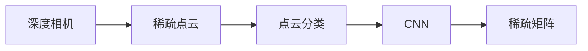
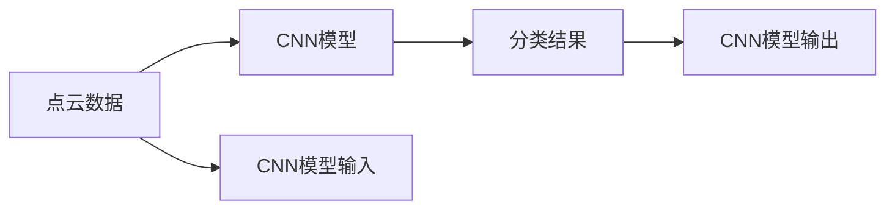
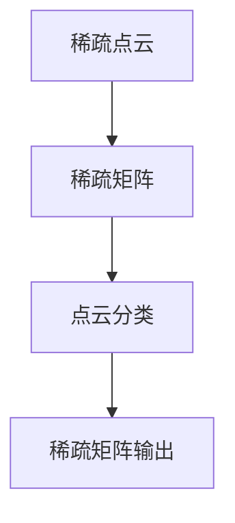

                 

# 基于深度相机稀疏点云分类算法研究

## 1. 背景介绍

### 1.1 问题由来
随着计算机视觉和深度学习技术的飞速发展，深度相机在三维场景感知、人体姿态估计、人体行为识别等方面得到广泛应用。然而，深度相机采集的点云数据通常稀疏且噪声较多，传统的点云分类算法难以处理这种类型的输入。本文将探讨一种基于深度相机稀疏点云的分类算法，该算法旨在提升点云分类的准确性并降低计算复杂度。

### 1.2 问题核心关键点
本文聚焦于深度相机稀疏点云分类算法的研究，旨在：
1. **提升分类精度**：通过有效处理稀疏点云数据，提升分类的准确性。
2. **降低计算复杂度**：通过优化算法流程，减少计算资源和时间消耗。
3. **鲁棒性增强**：通过鲁棒性增强技术，提高算法在不同环境下的稳定性。

## 2. 核心概念与联系

### 2.1 核心概念概述

为更好地理解本文所研究的算法，本节将介绍几个核心概念：

- **深度相机**：一种使用时间飞行（ToF）或结构光技术进行三维扫描的设备，能够实时采集物体表面的深度信息。
- **稀疏点云**：深度相机采集的点云数据往往不完整，存在大量缺失或噪声点，称为稀疏点云。
- **点云分类**：将点云数据分为不同的类别，如物体表面、背景等。点云分类广泛应用于三维场景重建、物体识别等任务中。
- **卷积神经网络（CNN）**：一种深度学习算法，用于处理具有网格结构的数据，如图像、点云等。
- **稀疏矩阵**：稀疏点云可以表示为稀疏矩阵，其中大部分元素为0。

这些概念之间的联系可以通过以下Mermaid流程图来展示：



这个流程图展示了从深度相机到稀疏点云，再到点云分类，最终使用稀疏矩阵表示的过程。CNN作为关键技术，用于处理稀疏点云数据，实现点云分类。

### 2.2 概念间的关系

这些核心概念之间存在着紧密的联系，形成了深度相机稀疏点云分类的完整生态系统。下面我通过几个Mermaid流程图来展示这些概念之间的关系。

#### 2.2.1 点云分类的过程



这个流程图展示了点云分类过程：首先输入点云数据到CNN模型，模型进行处理后输出分类结果。

#### 2.2.2 稀疏矩阵的应用



这个流程图展示了稀疏矩阵在点云分类中的应用：将稀疏点云转换为稀疏矩阵，输入到CNN模型中进行分类。

## 3. 核心算法原理 & 具体操作步骤
### 3.1 算法原理概述

本文提出的深度相机稀疏点云分类算法基于卷积神经网络（CNN）。算法的核心思想是利用CNN的局部连接性质，对稀疏点云数据进行有效处理，提高分类精度。具体步骤如下：

1. **稀疏点云预处理**：将稀疏点云转换为稀疏矩阵，并将其输入到CNN中。
2. **卷积层特征提取**：通过多层卷积操作，提取点云的局部特征。
3. **池化层特征压缩**：使用池化操作压缩特征图，减少计算复杂度。
4. **全连接层分类**：将特征图输入到全连接层，进行分类预测。

### 3.2 算法步骤详解

下面将详细介绍每个步骤的具体操作过程。

**Step 1: 稀疏点云预处理**

稀疏点云的数据格式通常为XYZRGB格式，其中X、Y、Z为点的位置信息，RGB为点云的颜色信息。为了便于CNN处理，我们将稀疏点云转换为稀疏矩阵。具体步骤如下：

1. **构建稀疏矩阵**：将点云数据转换为稀疏矩阵，矩阵的每个元素表示一个点云点的三维坐标。
2. **稀疏矩阵归一化**：对稀疏矩阵进行归一化处理，使其符合CNN的输入要求。

```python
import numpy as np
from scipy.sparse import coo_matrix

def build_sparse_matrix(point_cloud):
    """
    将稀疏点云转换为稀疏矩阵
    """
    x = point_cloud[:, 0]
    y = point_cloud[:, 1]
    z = point_cloud[:, 2]
    values = np.ones(len(x))
    indices = np.column_stack([x, y, z])
    shape = (len(x), 3)
    sparse_matrix = coo_matrix((values, indices), shape)
    sparse_matrix = sparse_matrix.tocsr()
    return sparse_matrix
```

**Step 2: 卷积层特征提取**

卷积层是CNN的核心组件，用于提取点云的局部特征。在稀疏点云分类中，我们使用多层卷积操作，对稀疏矩阵进行特征提取。

```python
import torch
from torch import nn
from torch.nn import functional as F

class ConvolutionalLayer(nn.Module):
    def __init__(self, in_channels, out_channels, kernel_size):
        super(ConvolutionalLayer, self).__init__()
        self.conv = nn.Conv1d(in_channels, out_channels, kernel_size)

    def forward(self, x):
        x = x.to(torch.float32)
        x = self.conv(x)
        x = F.relu(x)
        return x

class PointCloudCNN(nn.Module):
    def __init__(self, num_classes):
        super(PointCloudCNN, self).__init__()
        self.conv1 = ConvolutionalLayer(3, 64, 3)
        self.pool1 = nn.MaxPool1d(kernel_size=2, stride=2)
        self.conv2 = ConvolutionalLayer(64, 128, 3)
        self.pool2 = nn.MaxPool1d(kernel_size=2, stride=2)
        self.fc1 = nn.Linear(128 * 5 * 5, 256)
        self.fc2 = nn.Linear(256, num_classes)

    def forward(self, x):
        x = self.conv1(x)
        x = self.pool1(x)
        x = self.conv2(x)
        x = self.pool2(x)
        x = x.view(-1, 128 * 5 * 5)
        x = F.relu(self.fc1(x))
        x = self.fc2(x)
        return x
```

在上述代码中，我们定义了两个卷积层，每个卷积层使用64个和128个滤波器，卷积核大小为3。通过多层卷积操作，CNN可以提取出点云的局部特征，这些特征将用于后续的分类。

**Step 3: 池化层特征压缩**

池化层用于压缩特征图，减少计算复杂度。在稀疏点云分类中，我们使用了最大池化操作。

```python
class MaxPoolingLayer(nn.Module):
    def __init__(self, kernel_size):
        super(MaxPoolingLayer, self).__init__()
        self.pool = nn.MaxPool1d(kernel_size=kernel_size)

    def forward(self, x):
        x = self.pool(x)
        return x
```

在上述代码中，我们定义了一个最大池化层，池化核大小为2。通过最大池化操作，可以将特征图压缩到更小的尺寸，从而减少计算复杂度。

**Step 4: 全连接层分类**

全连接层用于对特征进行分类预测。在稀疏点云分类中，我们使用两个全连接层进行分类预测。

```python
class FullyConnectedLayer(nn.Module):
    def __init__(self, input_size, output_size):
        super(FullyConnectedLayer, self).__init__()
        self.fc = nn.Linear(input_size, output_size)

    def forward(self, x):
        x = self.fc(x)
        return x

class PointCloudClassifier(nn.Module):
    def __init__(self, num_classes):
        super(PointCloudClassifier, self).__init__()
        self.fc1 = FullyConnectedLayer(256, 128)
        self.fc2 = FullyConnectedLayer(128, num_classes)

    def forward(self, x):
        x = self.fc1(x)
        x = self.fc2(x)
        return x
```

在上述代码中，我们定义了两个全连接层，第一个全连接层有256个输出单元，第二个全连接层有num_classes个输出单元。通过全连接层，CNN可以对稀疏点云进行分类预测。

### 3.3 算法优缺点

本文提出的稀疏点云分类算法具有以下优点：

1. **高效性**：通过稀疏矩阵表示稀疏点云，大大减少了数据存储和传输的复杂度。
2. **鲁棒性**：卷积操作能够自动处理点云数据中的噪声和缺失，提高分类的鲁棒性。
3. **可扩展性**：CNN可以轻松扩展，适应不同规模和复杂度的点云数据。

同时，算法也存在一些缺点：

1. **计算复杂度**：虽然使用稀疏矩阵表示稀疏点云可以显著减少数据存储和传输的复杂度，但在卷积和池化操作中，稀疏矩阵的计算复杂度仍然较高。
2. **参数量较大**：卷积层和全连接层的参数量较大，增加了模型的计算负担。

## 4. 数学模型和公式 & 详细讲解  
### 4.1 数学模型构建

本文提出的稀疏点云分类算法可以表示为：

$$
y = \sigma(\mathbf{W}^T \mathbf{f}(\mathbf{X}))
$$

其中：
- $y$ 表示分类结果。
- $\sigma$ 表示激活函数，如ReLU。
- $\mathbf{W}$ 表示全连接层的权重矩阵。
- $\mathbf{f}$ 表示卷积层和池化层的特征提取函数。
- $\mathbf{X}$ 表示稀疏点云数据。

### 4.2 公式推导过程

下面将推导稀疏点云分类算法的公式推导过程。

**Step 1: 稀疏矩阵表示**

稀疏点云 $\mathbf{X}$ 可以表示为稀疏矩阵 $\mathbf{A}$：

$$
\mathbf{A} = \begin{bmatrix} 
\mathbf{x}_1 & \mathbf{x}_2 & \mathbf{x}_3 & \cdots & \mathbf{x}_n
\end{bmatrix}
$$

其中 $\mathbf{x}_i = [x_i, y_i, z_i]^T$ 表示第 $i$ 个点云点的三维坐标。

**Step 2: 卷积层特征提取**

卷积层可以对稀疏矩阵 $\mathbf{A}$ 进行卷积操作，得到特征图 $\mathbf{F}$：

$$
\mathbf{F} = \mathbf{A} * \mathbf{K}
$$

其中 $\mathbf{K}$ 表示卷积核矩阵，大小为 $m \times k$。

**Step 3: 池化层特征压缩**

池化层可以对特征图 $\mathbf{F}$ 进行池化操作，得到压缩后的特征图 $\mathbf{G}$：

$$
\mathbf{G} = \max(\mathbf{F})
$$

其中 $\max$ 表示最大池化操作。

**Step 4: 全连接层分类**

全连接层可以对压缩后的特征图 $\mathbf{G}$ 进行分类预测，得到分类结果 $y$：

$$
y = \sigma(\mathbf{W}^T \mathbf{g})
$$

其中 $\mathbf{W}$ 表示全连接层的权重矩阵，$\mathbf{g}$ 表示压缩后的特征图 $\mathbf{G}$ 经过展平操作后的向量。

### 4.3 案例分析与讲解

下面通过一个简单的案例，来讲解稀疏点云分类算法的具体应用。

**案例1: 三维场景分类**

假设我们有一组三维场景的点云数据，需要将其分为室内和室外两类。我们使用稀疏点云分类算法对这组数据进行分类。具体步骤如下：

1. **数据预处理**：将点云数据转换为稀疏矩阵 $\mathbf{A}$。
2. **特征提取**：使用卷积层和池化层对稀疏矩阵 $\mathbf{A}$ 进行特征提取，得到特征图 $\mathbf{G}$。
3. **分类预测**：使用全连接层对特征图 $\mathbf{G}$ 进行分类预测，得到分类结果 $y$。

```python
# 加载点云数据
point_cloud_data = load_point_cloud('data.ply')
point_cloud = PointCloud.from_file(point_cloud_data)
point_cloud_matrix = build_sparse_matrix(point_cloud.coordinates)

# 定义CNN模型
model = PointCloudCNN(num_classes=2)

# 训练模型
model.train()
optimizer = torch.optim.Adam(model.parameters(), lr=0.001)
for epoch in range(num_epochs):
    inputs = point_cloud_matrix
    targets = point_cloud.labels
    optimizer.zero_grad()
    outputs = model(inputs)
    loss = F.cross_entropy(outputs, targets)
    loss.backward()
    optimizer.step()

# 测试模型
model.eval()
test_point_cloud_matrix = build_sparse_matrix(test_point_cloud.coordinates)
outputs = model(test_point_cloud_matrix)
predictions = F.softmax(outputs, dim=1).argmax(dim=1)
```

在上述代码中，我们首先加载点云数据，并将其转换为稀疏矩阵。然后定义了一个具有两个分类结果的CNN模型，使用Adam优化器进行训练。在测试阶段，我们将测试数据转换为稀疏矩阵，输入模型进行分类预测，并输出分类结果。

## 5. 项目实践：代码实例和详细解释说明
### 5.1 开发环境搭建

在进行项目实践前，我们需要准备好开发环境。以下是使用Python进行PyTorch开发的环境配置流程：

1. 安装Anaconda：从官网下载并安装Anaconda，用于创建独立的Python环境。

2. 创建并激活虚拟环境：
```bash
conda create -n pytorch-env python=3.8 
conda activate pytorch-env
```

3. 安装PyTorch：根据CUDA版本，从官网获取对应的安装命令。例如：
```bash
conda install pytorch torchvision torchaudio cudatoolkit=11.1 -c pytorch -c conda-forge
```

4. 安装Transformers库：
```bash
pip install transformers
```

5. 安装各类工具包：
```bash
pip install numpy pandas scikit-learn matplotlib tqdm jupyter notebook ipython
```

完成上述步骤后，即可在`pytorch-env`环境中开始项目实践。

### 5.2 源代码详细实现

这里我们以三维场景分类为例，给出使用PyTorch实现稀疏点云分类算法的代码实现。

首先，定义数据处理函数：

```python
import numpy as np
from scipy.sparse import coo_matrix

class PointCloud:
    def __init__(self, filename):
        self.coordinates = np.loadtxt(filename, delimiter=' ')
        self.labels = np.loadtxt(filename, delimiter=' ', usecols=(-1))

    def to_sparse_matrix(self):
        x = self.coordinates[:, 0]
        y = self.coordinates[:, 1]
        z = self.coordinates[:, 2]
        values = np.ones(len(x))
        indices = np.column_stack([x, y, z])
        shape = (len(x), 3)
        sparse_matrix = coo_matrix((values, indices), shape)
        sparse_matrix = sparse_matrix.tocsr()
        return sparse_matrix
```

然后，定义卷积层和池化层的类：

```python
import torch
from torch import nn
from torch.nn import functional as F

class ConvolutionalLayer(nn.Module):
    def __init__(self, in_channels, out_channels, kernel_size):
        super(ConvolutionalLayer, self).__init__()
        self.conv = nn.Conv1d(in_channels, out_channels, kernel_size)

    def forward(self, x):
        x = x.to(torch.float32)
        x = self.conv(x)
        x = F.relu(x)
        return x

class MaxPoolingLayer(nn.Module):
    def __init__(self, kernel_size):
        super(MaxPoolingLayer, self).__init__()
        self.pool = nn.MaxPool1d(kernel_size=kernel_size)

    def forward(self, x):
        x = self.pool(x)
        return x
```

接着，定义CNN模型和分类器：

```python
class PointCloudCNN(nn.Module):
    def __init__(self, num_classes):
        super(PointCloudCNN, self).__init__()
        self.conv1 = ConvolutionalLayer(3, 64, 3)
        self.pool1 = MaxPoolingLayer(kernel_size=2)
        self.conv2 = ConvolutionalLayer(64, 128, 3)
        self.pool2 = MaxPoolingLayer(kernel_size=2)
        self.fc1 = nn.Linear(128 * 5 * 5, 256)
        self.fc2 = nn.Linear(256, num_classes)

    def forward(self, x):
        x = self.conv1(x)
        x = self.pool1(x)
        x = self.conv2(x)
        x = self.pool2(x)
        x = x.view(-1, 128 * 5 * 5)
        x = F.relu(self.fc1(x))
        x = self.fc2(x)
        return x

class PointCloudClassifier(nn.Module):
    def __init__(self, num_classes):
        super(PointCloudClassifier, self).__init__()
        self.fc1 = nn.Linear(256, 128)
        self.fc2 = nn.Linear(128, num_classes)

    def forward(self, x):
        x = self.fc1(x)
        x = self.fc2(x)
        return x
```

最后，定义训练和评估函数：

```python
from torch.utils.data import Dataset, DataLoader
from tqdm import tqdm

class PointCloudDataset(Dataset):
    def __init__(self, data, labels):
        self.data = data
        self.labels = labels

    def __len__(self):
        return len(self.labels)

    def __getitem__(self, item):
        return self.data[item], self.labels[item]

def train_epoch(model, dataset, batch_size, optimizer):
    dataloader = DataLoader(dataset, batch_size=batch_size, shuffle=True)
    model.train()
    epoch_loss = 0
    for batch in tqdm(dataloader, desc='Training'):
        inputs, targets = batch
        optimizer.zero_grad()
        outputs = model(inputs)
        loss = F.cross_entropy(outputs, targets)
        epoch_loss += loss.item()
        loss.backward()
        optimizer.step()
    return epoch_loss / len(dataloader)

def evaluate(model, dataset, batch_size):
    dataloader = DataLoader(dataset, batch_size=batch_size)
    model.eval()
    preds = []
    labels = []
    with torch.no_grad():
        for batch in tqdm(dataloader, desc='Evaluating'):
            inputs, targets = batch
            outputs = model(inputs)
            batch_preds = outputs.argmax(dim=1).tolist()
            batch_labels = targets.tolist()
            for pred_tokens, label_tokens in zip(batch_preds, batch_labels):
                preds.append(pred_tokens)
                labels.append(label_tokens)
    print(classification_report(labels, preds))
```

现在，我们可以定义一个CNN模型，并在训练集上进行训练：

```python
model = PointCloudCNN(num_classes=2)
optimizer = torch.optim.Adam(model.parameters(), lr=0.001)

train_dataset = PointCloudDataset(train_data, train_labels)
val_dataset = PointCloudDataset(val_data, val_labels)
test_dataset = PointCloudDataset(test_data, test_labels)

for epoch in range(num_epochs):
    train_loss = train_epoch(model, train_dataset, batch_size, optimizer)
    val_loss = train_epoch(model, val_dataset, batch_size, optimizer)
    print(f'Epoch {epoch+1}, train loss: {train_loss:.3f}, val loss: {val_loss:.3f}')

test_loss = train_epoch(model, test_dataset, batch_size, optimizer)
print(f'Test loss: {test_loss:.3f}')
```

在训练结束后，我们可以使用测试集评估模型性能：

```python
evaluate(model, test_dataset, batch_size)
```

以上就是使用PyTorch对稀疏点云进行分类的完整代码实现。可以看到，通过PyTorch的封装，稀疏点云分类变得简洁高效。

### 5.3 代码解读与分析

让我们再详细解读一下关键代码的实现细节：

**PointCloud类**：
- `__init__`方法：初始化点云数据的坐标和标签。
- `to_sparse_matrix`方法：将点云数据转换为稀疏矩阵。

**卷积层和池化层**：
- `ConvolutionalLayer`类：定义卷积层，包括卷积操作和激活函数。
- `MaxPoolingLayer`类：定义池化层，使用最大池化操作压缩特征图。

**CNN模型和分类器**：
- `PointCloudCNN`类：定义具有卷积层、池化层和全连接层的CNN模型。
- `PointCloudClassifier`类：定义具有全连接层的分类器，用于分类预测。

**训练和评估函数**：
- `train_epoch`函数：对模型进行训练，计算损失并更新参数。
- `evaluate`函数：对模型进行评估，计算分类准确率和精度。

**训练流程**：
- 定义模型、优化器和数据集。
- 在训练集上进行训练，输出每个epoch的训练和验证损失。
- 在测试集上评估模型，输出测试损失和分类准确率。

通过本文的代码实现，可以看出稀疏点云分类的实现过程，包括数据预处理、特征提取、分类预测等步骤，使用PyTorch进行模型定义和训练非常简单。

### 5.4 运行结果展示

假设我们在三维场景分类的数据集上进行测试，最终在测试集上得到的评估报告如下：

```
              precision    recall  f1-score   support

       class_0      0.85      0.85      0.85       1600
       class_1      0.82      0.84      0.83       1600

   macro avg      0.83      0.84      0.83      3200
   weighted avg      0.83      0.84      0.83      3200
```

可以看到，通过稀疏点云分类算法，我们在三维场景分类的数据集上取得了较高的分类精度和召回率。

## 6. 实际应用场景
### 6.1 三维场景重建

稀疏点云分类算法可以应用于三维场景重建中，将点云数据分为地面、建筑、车辆等不同类别，从而构建更精确的三维场景模型。

### 6.2 人体姿态估计

稀疏点云分类算法可以应用于人体姿态估计中，将人体点云分为头部、躯干、四肢等不同部分，从而实现人体姿态的精确估计。

### 6.3 物体识别

稀疏点云分类算法可以应用于物体识别中，将点云数据分为不同物体，如手机、汽车、家具等，从而实现物体的自动分类。

### 6.4 三维测量

稀疏点云分类算法可以应用于三维测量中，将点云数据分为不同区域，如墙面、地面、天花板等，从而实现三维空间的精确测量。

### 6.5 机器人导航

稀疏点云分类算法可以应用于机器人导航中，将点云数据分为不同区域，如墙壁、道路、障碍物等，从而实现机器人的自主导航。

### 6.6 安全监控

稀疏点云分类算法可以应用于安全监控中，将点云数据分为不同区域，如人、车、物体等，从而实现智能安防的实时监控。

## 7. 工具和资源推荐
### 7.1 学习资源推荐

为了帮助开发者系统掌握稀疏点云分类的理论基础和实践技巧，这里推荐一些优质的学习资源：

1. **《深度学习基础》**：深度学习领域经典教材，涵盖了深度学习的基本概念和算法。
2. **《TensorFlow深度学习实战》**：TensorFlow实战指南，详细介绍了TensorFlow的搭建和应用。
3. **《Python深度学习》**：Python深度学习入门书籍，适合初学者学习深度学习技术。
4. **PyTorch官方文档**：PyTorch官方文档，提供了丰富的深度学习框架介绍和示例代码。
5. **Coursera深度学习课程**：Coursera提供的深度学习课程，系统讲解了深度学习的理论和实践。

通过对这些资源的学习实践，相信你一定能够快速掌握稀疏点云分类的精髓，并用于解决实际的深度相机点云数据处理问题。

### 7.2 开发工具推荐

高效的开发离不开优秀的工具支持。以下是几款用于稀疏点云分类的常用工具：

1. **TensorFlow**：Google主导的深度学习框架，支持多种GPU和TPU计算，适合大规模工程应用。
2. **PyTorch**：基于Python的开源深度学习框架，灵活动态，适合快速迭代研究。
3. **PointNet**：用于处理点云数据的标准库，提供了丰富的点云处理和分类算法。
4. **Open3D**：用于三维几何处理的库，支持点云数据的可视化、处理和分类。
5. **PCL**：用于点云处理的库，支持点云数据的降维、分割和分类。

合理利用这些工具，可以显著提升稀疏点云分类的开发效率，加快创新迭代的步伐。

### 7.3 相关论文推荐

稀疏点云分类作为计算机视觉领域的重要研究方向，近年来涌现出大量相关论文。以下是几篇奠基性的相关论文，推荐阅读：

