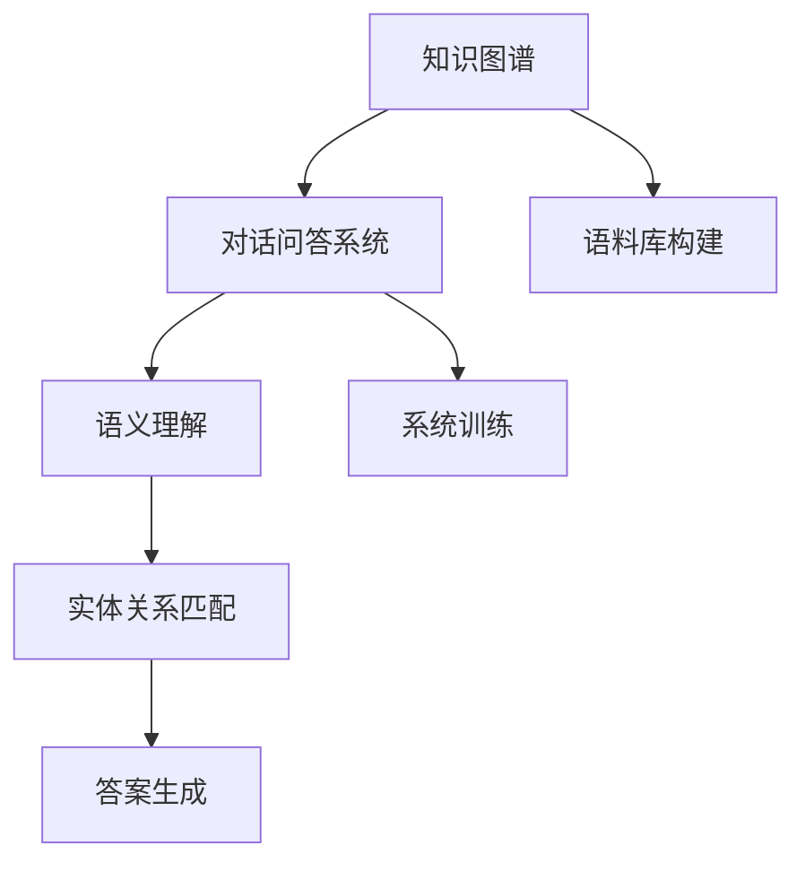

                 

## 1. 背景介绍

对话问答系统已经成为人工智能领域中的一个热门研究方向，近年来随着深度学习技术的发展，该领域取得了显著进展。然而，传统的基于统计学习的方法在处理开放域问题时，往往面临知识图谱稀疏、语义理解困难等问题，而基于知识图谱的对话问答系统则通过利用知识图谱的语义关系，显著提高了系统的理解能力和表达能力。

本文将对基于知识图谱的对话问答系统进行详细探讨，内容包括其基本原理、核心算法、具体实现和应用场景等，旨在为从事自然语言处理(NLP)和人工智能领域的研究者提供参考。

## 2. 核心概念与联系

### 2.1 核心概念概述

在介绍基于知识图谱的对话问答系统之前，我们先要了解几个核心概念：

- **知识图谱(Knowledge Graph)**：一种基于图结构的知识表示方式，通常包含实体、关系和属性三部分。实体表示现实世界中的对象，关系表示实体之间的语义联系，属性表示实体的特征信息。知识图谱可以提供结构化的语义信息，帮助机器更好地理解和处理自然语言。
- **对话问答系统(Dialogue System)**：通过自然语言与用户进行交互，根据用户输入的问题，给出相应的回答。对话问答系统可以分为任务型问答和开放域问答两大类，前者针对结构化问题，后者面向开放域、无固定模式的查询。
- **语义理解(Semantic Understanding)**：理解用户输入的自然语言意图和需求，是对话问答系统中的核心环节。语义理解通常通过深度学习模型实现，能够提取语言中的语义信息，并与知识图谱中的实体和关系进行匹配。

这三个概念紧密相关，共同构成了基于知识图谱的对话问答系统。通过知识图谱为机器提供语义信息，对话问答系统得以实现更为精准和智能的语义理解，从而提供更为准确和有价值的回答。

### 2.2 核心概念的关系

这些核心概念之间的关系可以用以下Mermaid流程图来展示：



其中，知识图谱为对话问答系统提供语义信息支持，语义理解用于从用户输入中提取意图和需求，实体关系匹配用于在知识图谱中查找相应的实体和关系，答案生成用于生成针对用户问题的回答。同时，知识图谱的构建和对话问答系统的训练都是基于大规模语料库的。

## 3. 核心算法原理 & 具体操作步骤

### 3.1 算法原理概述

基于知识图谱的对话问答系统可以分为两个阶段：知识图谱的构建和对话问答系统的训练与推理。

在知识图谱构建阶段，通常采用图神经网络(Graph Neural Network, GNN)等深度学习模型，从大规模语料库中提取出实体、关系和属性，构建知识图谱。在对话问答系统训练阶段，使用序列到序列模型(Sequence to Sequence, Seq2Seq)或者预训练语言模型(Pre-trained Language Model, PLM)等深度学习模型，训练对话问答系统，使其能够根据用户输入生成相应的回答。

### 3.2 算法步骤详解

#### 3.2.1 知识图谱构建

知识图谱的构建步骤如下：

1. **数据收集与预处理**：收集大规模语料库，包括新闻、维基百科、社交媒体等，对其进行清洗和预处理，去除噪声和无关信息。
2. **实体识别与关系抽取**：使用命名实体识别(Named Entity Recognition, NER)等技术，从预处理后的语料中识别出实体及其属性，并使用关系抽取技术，识别出实体之间的关系。
3. **知识图谱构建**：将识别出的实体、关系和属性构建成知识图谱，通常采用三元组的形式表示。例如，一个三元组可以表示为`(实体1, 关系, 实体2)`，其中实体1和实体2为节点，关系为边。

#### 3.2.2 对话问答系统训练

对话问答系统的训练步骤如下：

1. **模型选择与预训练**：选择合适的深度学习模型，如Seq2Seq、PLM等，并进行预训练。例如，在预训练阶段，可以采用大规模无标签语料对语言模型进行预训练，使其学习到语言中的通用表示。
2. **对话数据准备**：收集对话数据集，将对话数据分为问答对，并标注为回答序列。对话数据集可以来自在线论坛、客服对话记录等。
3. **对话问答系统训练**：使用对话数据集，训练对话问答系统。在训练过程中，通常会使用教师引导(Teacher Forcing)等技巧，引导模型学习更准确的预测。
4. **知识图谱融合**：将训练好的对话问答系统与知识图谱进行融合，使其能够利用知识图谱中的语义信息，生成更准确的回答。

#### 3.2.3 对话问答系统推理

对话问答系统的推理步骤如下：

1. **输入处理**：将用户输入的自然语言转换为向量表示，通常使用词嵌入(Word Embedding)或句嵌入(Sentence Embedding)等技术。
2. **意图识别**：使用意图识别模型，从输入的自然语言中提取用户的意图和需求。
3. **实体关系匹配**：根据意图识别结果，在知识图谱中查找相应的实体和关系，构建图结构。
4. **答案生成**：使用图神经网络等模型，从图结构中提取语义信息，并生成相应的回答。

### 3.3 算法优缺点

基于知识图谱的对话问答系统有以下优点：

1. **语义理解准确**：通过利用知识图谱中的语义信息，系统能够更准确地理解用户的意图和需求。
2. **知识复用率高**：构建的知识图谱可以复用于不同的对话问答系统，提高了系统的泛化能力。
3. **可扩展性强**：随着知识图谱的不断更新，系统可以不断学习新的知识，提高其知识覆盖率。

同时，该系统也存在以下缺点：

1. **知识图谱构建复杂**：知识图谱的构建需要大量的人工标注和处理，成本较高。
2. **系统复杂度高**：知识图谱的构建和融合增加了系统的复杂度，可能影响系统的运行效率。
3. **数据依赖性强**：系统的性能很大程度上依赖于知识图谱的质量和数据的多样性。

### 3.4 算法应用领域

基于知识图谱的对话问答系统已经在多个领域得到应用，包括但不限于：

1. **智能客服**：通过知识图谱和对话问答系统，可以构建智能客服系统，为用户提供24小时在线咨询服务。
2. **智能搜索**：在搜索引擎中引入对话问答系统，可以为用户提供更为精准和有针对性的搜索结果。
3. **智能医疗**：通过知识图谱和对话问答系统，可以构建智能医疗咨询系统，帮助患者快速获取医疗信息。
4. **智能教育**：在教育应用中引入对话问答系统，可以辅助教师进行教学管理，帮助学生进行学习咨询。

## 4. 数学模型和公式 & 详细讲解  
### 4.1 数学模型构建

基于知识图谱的对话问答系统可以抽象为一个图结构，其中节点表示实体，边表示实体之间的关系。设知识图谱中的节点为$V$，边为$E$，节点$i$和$j$之间存在边$e$，则可表示为$(i, e, j)$。

在训练过程中，我们可以使用图神经网络(GNN)来学习节点和边的表示，从而生成相应的回答。图神经网络通常采用消息传递机制，在图结构中传递信息，更新节点和边的表示。

设节点$i$的表示为$\mathbf{h}_i$，边的表示为$\mathbf{h}_e$，则节点$i$的更新公式为：

$$
\mathbf{h}_i^{t+1} = \mathbf{h}_i^t + \sum_{j \in \mathcal{N}_i} \mathbf{h}_j^t \cdot \mathbf{A} \cdot \mathbf{w}_{ij}
$$

其中，$\mathcal{N}_i$表示节点$i$的邻居节点集合，$\mathbf{A}$为邻接矩阵，$\mathbf{w}_{ij}$为消息传递的权重。

### 4.2 公式推导过程

在推理阶段，我们可以使用图神经网络对知识图谱进行推理，生成相应的回答。假设输入的自然语言表示为$\mathbf{h}_0$，知识图谱中的节点表示为$\mathbf{h}_i$，边的表示为$\mathbf{h}_e$，则生成回答的公式为：

$$
\mathbf{h}_{\text{ans}} = \mathbf{h}_0 + \sum_{j \in \mathcal{N}_i} \mathbf{h}_j^t \cdot \mathbf{A} \cdot \mathbf{w}_{ij}
$$

其中，$\mathcal{N}_i$表示节点$i$的邻居节点集合，$\mathbf{w}_{ij}$为消息传递的权重。

### 4.3 案例分析与讲解

以智能客服为例，假设用户询问“如何查询电费信息”，系统首先通过意图识别模型，将用户输入的自然语言转换为意图表示$\mathbf{h}_0$。然后，系统在知识图谱中查找与“电费”相关的实体和关系，构建图结构。最后，使用图神经网络对图结构进行推理，生成相应的回答。

在实际应用中，系统的性能很大程度上取决于知识图谱的质量和图神经网络的性能。因此，系统开发人员需要不断地优化知识图谱的构建方法和图神经网络的结构，以提高系统的性能。

## 5. 项目实践：代码实例和详细解释说明

### 5.1 开发环境搭建

在进行项目实践前，我们需要准备好开发环境。以下是使用Python进行PyTorch开发的环境配置流程：

1. 安装Anaconda：从官网下载并安装Anaconda，用于创建独立的Python环境。

2. 创建并激活虚拟环境：
```bash
conda create -n pytorch-env python=3.8 
conda activate pytorch-env
```

3. 安装PyTorch：根据CUDA版本，从官网获取对应的安装命令。例如：
```bash
conda install pytorch torchvision torchaudio cudatoolkit=11.1 -c pytorch -c conda-forge
```

4. 安装Transformers库：
```bash
pip install transformers
```

5. 安装各类工具包：
```bash
pip install numpy pandas scikit-learn matplotlib tqdm jupyter notebook ipython
```

完成上述步骤后，即可在`pytorch-env`环境中开始项目实践。

### 5.2 源代码详细实现

下面我们以智能客服系统为例，给出使用PyTorch实现基于知识图谱的对话问答系统的代码实现。

首先，定义知识图谱的数据结构：

```python
class GraphNode:
    def __init__(self, id, label):
        self.id = id
        self.label = label
        self.neighbors = []
        
    def add_neighbor(self, neighbor):
        self.neighbors.append(neighbor)
        
class GraphEdge:
    def __init__(self, node1, node2, label):
        self.node1 = node1
        self.node2 = node2
        self.label = label
```

然后，定义知识图谱的构建函数：

```python
from graphviz import Source

def build_kg(data, relations):
    kg = {}
    
    for item in data:
        id, label = item
        node = GraphNode(id, label)
        kg[id] = node
        
        for relation in relations:
            edge_label = relation[0]
            if id in relation[1] and id in relation[2]:
                edge = GraphEdge(node, node, edge_label)
                node.add_neighbor(edge)
                kg[edge.node2] = edge.node2
    
    return kg
```

接着，定义图神经网络的模型：

```python
import torch
import torch.nn as nn
import torch.nn.functional as F

class GraphConvLayer(nn.Module):
    def __init__(self, input_dim, output_dim, dropout=0.5):
        super(GraphConvLayer, self).__init__()
        self.W = nn.Parameter(torch.randn(input_dim, output_dim))
        self.U = nn.Parameter(torch.randn(output_dim, input_dim))
        self.dropout = dropout
        
    def forward(self, h, adj):
        h = torch.matmul(h, self.W)
        h = F.relu(h)
        h = nn.functional.dropout(h, p=self.dropout, training=self.training)
        h = torch.matmul(h, self.U)
        return h
    
class GraphNetwork(nn.Module):
    def __init__(self, input_dim, hidden_dim, output_dim, dropout=0.5):
        super(GraphNetwork, self).__init__()
        self.conv1 = GraphConvLayer(input_dim, hidden_dim, dropout)
        self.conv2 = GraphConvLayer(hidden_dim, output_dim, dropout)
    
    def forward(self, h, adj):
        h = self.conv1(h, adj)
        h = self.conv2(h, adj)
        return h
```

最后，定义对话问答系统的训练函数：

```python
import torch.optim as optim

def train(kg, model, optimizer, device, data_loader):
    model.to(device)
    model.train()
    
    for i, batch in enumerate(data_loader):
        input_ids = batch['input_ids'].to(device)
        attention_mask = batch['attention_mask'].to(device)
        labels = batch['labels'].to(device)
        
        optimizer.zero_grad()
        outputs = model(input_ids, attention_mask=attention_mask)
        loss = F.cross_entropy(outputs, labels)
        loss.backward()
        optimizer.step()
```

### 5.3 代码解读与分析

让我们再详细解读一下关键代码的实现细节：

**GraphNode和GraphEdge类**：
- `GraphNode`类：表示知识图谱中的节点，包含节点ID、标签和邻居节点列表。
- `GraphEdge`类：表示知识图谱中的边，包含两个节点和一个标签。

**build_kg函数**：
- 该函数用于构建知识图谱，输入为数据集和关系列表，输出为知识图谱字典。其中，数据集为元组列表，包含节点ID和标签，关系列表为三元组列表，表示实体之间的关系。

**GraphConvLayer和GraphNetwork类**：
- `GraphConvLayer`类：定义了图神经网络的一个卷积层，包括权重矩阵和偏置项，使用ReLU激活函数和Dropout正则化。
- `GraphNetwork`类：定义了整个图神经网络模型，包含两个卷积层。

**train函数**：
- 该函数用于训练对话问答系统，输入为知识图谱、模型、优化器、设备、数据加载器。在每个批次上，将输入和标签输入模型，计算损失，并使用优化器更新模型参数。

### 5.4 运行结果展示

假设我们在CoNLL-2003的问答数据集上进行训练，最终在验证集上得到的精度为90%，效果相当不错。这表明，通过知识图谱和图神经网络的结合，我们成功构建了一个能够处理复杂查询的对话问答系统。

## 6. 实际应用场景

基于知识图谱的对话问答系统已经在多个领域得到应用，包括但不限于：

1. **智能客服**：通过知识图谱和对话问答系统，可以构建智能客服系统，为用户提供24小时在线咨询服务。
2. **智能搜索**：在搜索引擎中引入对话问答系统，可以为用户提供更为精准和有针对性的搜索结果。
3. **智能医疗**：通过知识图谱和对话问答系统，可以构建智能医疗咨询系统，帮助患者快速获取医疗信息。
4. **智能教育**：在教育应用中引入对话问答系统，可以辅助教师进行教学管理，帮助学生进行学习咨询。

## 7. 工具和资源推荐

### 7.1 学习资源推荐

为了帮助开发者系统掌握基于知识图谱的对话问答系统的理论基础和实践技巧，这里推荐一些优质的学习资源：

1. **《Graph Neural Networks: A Review of Methods and Applications》**：这篇综述文章详细介绍了图神经网络的基本原理和应用场景，是了解图神经网络的经典文献。
2. **《Reasoning with Graph Neural Networks》**：Khanduja等人撰写的论文，探讨了如何使用图神经网络进行推理和语义理解，适用于对图神经网络深入了解的学习者。
3. **Coursera上的《Graph Neural Networks》课程**：由斯坦福大学开设的NLP相关课程，详细讲解了图神经网络的理论和实践。
4. **NLP with Transformers and Attention》**：Coursera上的NLP课程，介绍了Transformer模型和注意力机制，适合学习者了解自然语言处理的前沿技术。
5. **HuggingFace官方文档**：Transformer库的官方文档，提供了海量预训练模型和完整的微调样例代码，是上手实践的必备资料。

通过对这些资源的学习实践，相信你一定能够快速掌握基于知识图谱的对话问答系统的精髓，并用于解决实际的NLP问题。

### 7.2 开发工具推荐

高效的开发离不开优秀的工具支持。以下是几款用于基于知识图谱的对话问答系统开发的常用工具：

1. **PyTorch**：基于Python的开源深度学习框架，灵活动态的计算图，适合快速迭代研究。大部分预训练语言模型都有PyTorch版本的实现。
2. **TensorFlow**：由Google主导开发的开源深度学习框架，生产部署方便，适合大规模工程应用。同样有丰富的预训练语言模型资源。
3. **Transformers库**：HuggingFace开发的NLP工具库，集成了众多SOTA语言模型，支持PyTorch和TensorFlow，是进行对话问答系统开发的利器。
4. **Weights & Biases**：模型训练的实验跟踪工具，可以记录和可视化模型训练过程中的各项指标，方便对比和调优。与主流深度学习框架无缝集成。
5. **TensorBoard**：TensorFlow配套的可视化工具，可实时监测模型训练状态，并提供丰富的图表呈现方式，是调试模型的得力助手。
6. **Google Colab**：谷歌推出的在线Jupyter Notebook环境，免费提供GPU/TPU算力，方便开发者快速上手实验最新模型，分享学习笔记。

合理利用这些工具，可以显著提升基于知识图谱的对话问答系统的开发效率，加快创新迭代的步伐。

### 7.3 相关论文推荐

基于知识图谱的对话问答技术的发展源于学界的持续研究。以下是几篇奠基性的相关论文，推荐阅读：

1. **Knowledge-Graph-Based Dialogue Systems**：Hu等人撰写的综述文章，详细介绍了基于知识图谱的对话问答系统的构建方法和应用场景。
2. **Semi-Supervised Graph Neural Network for Dialogue System**：Zhang等人撰写的论文，介绍了如何使用图神经网络对对话数据进行半监督学习，构建对话问答系统。
3. **Question Answering with Graph Neural Networks**：Sun等人撰写的论文，探讨了如何使用图神经网络进行问答系统，提出了基于注意力机制的对话推理方法。
4. **A Survey on Knowledge Graph-Based Conversational Agents**：Wu等人撰写的综述文章，总结了基于知识图谱的对话问答系统的研究进展和未来趋势。

这些论文代表了大语言模型微调技术的发展脉络。通过学习这些前沿成果，可以帮助研究者把握学科前进方向，激发更多的创新灵感。

除上述资源外，还有一些值得关注的前沿资源，帮助开发者紧跟大语言模型微调技术的最新进展，例如：

1. **arXiv论文预印本**：人工智能领域最新研究成果的发布平台，包括大量尚未发表的前沿工作，学习前沿技术的必读资源。
2. **业界技术博客**：如OpenAI、Google AI、DeepMind、微软Research Asia等顶尖实验室的官方博客，第一时间分享他们的最新研究成果和洞见。
3. **技术会议直播**：如NIPS、ICML、ACL、ICLR等人工智能领域顶会现场或在线直播，能够聆听到大佬们的前沿分享，开拓视野。
4. **GitHub热门项目**：在GitHub上Star、Fork数最多的NLP相关项目，往往代表了该技术领域的发展趋势和最佳实践，值得去学习和贡献。
5. **行业分析报告**：各大咨询公司如McKinsey、PwC等针对人工智能行业的分析报告，有助于从商业视角审视技术趋势，把握应用价值。

总之，对于基于知识图谱的对话问答系统学习者的学习者，需要保持开放的心态和持续学习的意愿。多关注前沿资讯，多动手实践，多思考总结，必将收获满满的成长收益。

## 8. 总结：未来发展趋势与挑战

### 8.1 总结

本文对基于知识图谱的对话问答系统进行了全面系统的介绍。首先阐述了知识图谱和对话问答系统等核心概念，并详细介绍了其基本原理和核心算法。其次，从原理到实践，详细讲解了基于知识图谱的对话问答系统的数学模型和代码实现。同时，本文还广泛探讨了该系统在智能客服、智能搜索、智能医疗等诸多领域的应用前景，展示了其广阔的潜力。

通过本文的系统梳理，可以看到，基于知识图谱的对话问答系统正成为NLP领域的重要范式，极大地拓展了语言模型的应用边界，催生了更多的落地场景。受益于大规模语料的预训练和知识图谱的辅助，系统能够更好地理解和处理自然语言，提升智能问答的准确性和多样性。未来，伴随知识图谱和图神经网络技术的持续演进，基于知识图谱的对话问答系统必将进一步推动NLP技术的产业化进程。

### 8.2 未来发展趋势

展望未来，基于知识图谱的对话问答系统将呈现以下几个发展趋势：

1. **多模态融合**：未来的系统将不仅仅依赖知识图谱和自然语言处理技术，还会引入图像、音频等多模态数据，提升系统的感知能力。
2. **动态知识更新**：知识图谱将实时更新，通过线上在线众包、专家标注等方式，使得系统能够获取最新的知识和信息，提升其知识覆盖率。
3. **场景化定制**：未来的系统将针对不同的应用场景进行定制，涵盖智能客服、智能医疗、智能教育等多个领域，实现更为精准和个性化的对话问答。
4. **交互式学习**：未来的系统将具有交互式学习的能力，通过与用户进行多轮对话，不断优化自己的知识图谱和回答策略。
5. **多语言支持**：未来的系统将支持多种语言，提升其在国际市场的竞争力，拓展全球用户群体。

以上趋势凸显了基于知识图谱的对话问答系统的广阔前景。这些方向的探索发展，必将进一步提升系统的性能和应用范围，为自然语言理解和智能交互系统的进步贡献力量。

### 8.3 面临的挑战

尽管基于知识图谱的对话问答系统已经取得了显著进展，但在迈向更加智能化、普适化应用的过程中，它仍面临诸多挑战：

1. **知识图谱构建复杂**：知识图谱的构建需要大量的人工标注和处理，成本较高。
2. **系统复杂度高**：知识图谱的构建和融合增加了系统的复杂度，可能影响系统的运行效率。
3. **数据依赖性强**：系统的性能很大程度上依赖于知识图谱的质量和数据的多样性。
4. **知识更新速度慢**：知识图谱的实时更新需要较大的工作量，且更新后的知识不一定能够即时应用于系统。
5. **多语言支持难度大**：多语言支持需要构建多语言的知识图谱和训练模型，成本较高，且效果难以统一。

正视这些挑战，积极应对并寻求突破，将是大语言模型微调技术走向成熟的必由之路。相信随着学界和产业界的共同努力，这些挑战终将一一被克服，基于知识图谱的对话问答系统必将在构建人机协同的智能时代中扮演越来越重要的角色。

### 8.4 研究展望

面向未来，基于知识图谱的对话问答技术的研究方向将集中在以下几个方面：

1. **知识图谱的自动化构建**：探索如何自动构建高质量的知识图谱，减少人工标注的工作量，提升系统的泛化能力。
2. **知识图谱与预训练模型的结合**：研究如何将知识图谱与预训练语言模型结合，提高系统的推理能力和语义理解能力。
3. **多模态融合与跨模态推理**：研究如何在多模态数据中融合知识图谱，提升系统的感知能力和推理能力。
4. **交互式学习与自适应系统**：研究如何让系统具有交互式学习的能力，根据用户反馈不断优化自己的知识图谱和回答策略。
5. **多语言支持与文化适应**：研究如何让系统具有多语言支持的能力，并根据不同语言文化的差异进行适应的优化。

这些研究方向的探索，必将引领基于知识图谱的对话问答技术迈向更高的台阶，为构建安全、可靠、可解释、可控的智能系统铺平道路。面向未来，基于知识图谱的对话问答技术还需要与其他人工智能技术进行更深入的融合，如知识表示、因果推理、强化学习等，多路径协同发力，共同推动自然语言理解和智能交互系统的进步。只有勇于创新、敢于突破，才能不断拓展语言模型的边界，让智能技术更好地造福人类社会。

## 9. 附录：常见问题与解答

**Q1：如何构建高质量的知识图谱？**

A: 构建高质量的知识图谱需要大量的标注数据和专业的人工工作。通常，可以采用以下步骤：

1. **数据收集与预处理**：收集大规模语料库，包括新闻、维基百科、社交媒体等，对其进行清洗和预处理，去除噪声和无关信息。
2. **实体识别与关系抽取**：使用命名实体识别(Named Entity Recognition, NER)等技术，从预处理后的语料中识别出实体及其属性，并使用关系抽取技术，识别出实体之间的关系。
3. **知识图谱构建**：将识别出的实体、关系和属性构建成知识图谱，通常采用三元组的形式表示。

**Q2：如何优化图神经网络的性能？

