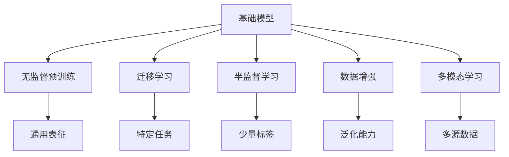
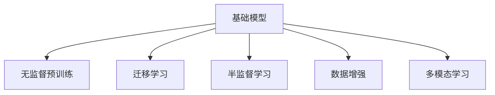
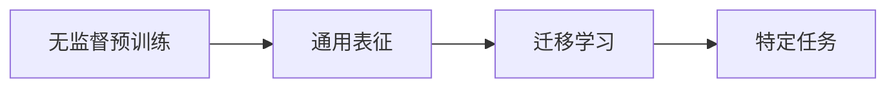
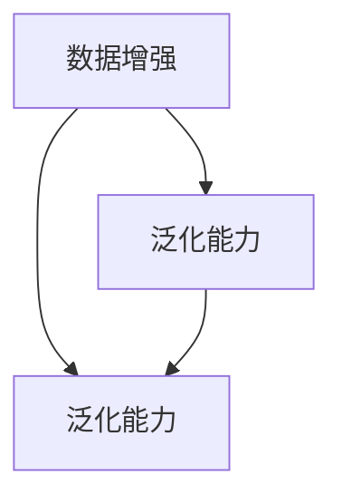
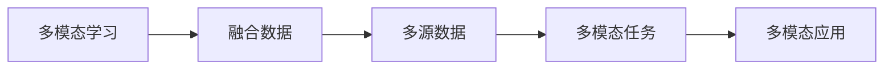
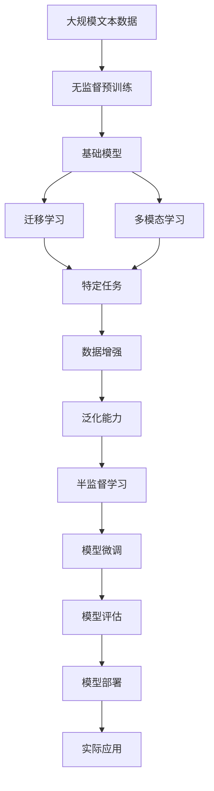

                 

## 1. 背景介绍

### 1.1 问题由来
随着人工智能技术的飞速发展，基础模型的创新与应用日益成为推动技术进步和社会发展的关键驱动力。从早期的传统机器学习模型到后来深度学习的崛起，再到如今基于大规模无监督预训练模型（如BERT、GPT、T5等）的广泛应用，模型技术的创新不仅极大提升了计算效率和模型性能，也深刻改变了各行各业的运作模式。本博文将从技术创新与社会效益两个维度，系统性地探讨基础模型的发展历程、技术创新以及其在实际应用中的深远影响。

### 1.2 问题核心关键点
基础模型的技术创新主要围绕三个方面展开：

1. **模型架构与训练方法**：从浅层到深层，从有监督到无监督，再到半监督的逐步深入。
2. **数据处理与增强**：从原始数据到标注数据，再到数据增强和合成数据的多样化处理。
3. **应用场景与普及**：从文本处理到图像识别，再到多模态数据融合，模型应用的普及和深化。

这些创新不仅推动了技术的不断突破，也带来了深远的社会效益。例如，医疗诊断的准确率提升、金融风控的精准度提高、智能客服的自动化水平增强等。通过深入挖掘技术创新与社会发展之间的关系，本博文将提供一个全面且深入的视角，以期对技术从业者和研究人员提供有益的参考。

## 2. 核心概念与联系

### 2.1 核心概念概述

为更好地理解基础模型的技术创新与社会效益，本节将介绍几个关键概念：

- **基础模型(Base Model)**：以深度学习为代表的高阶模型，如卷积神经网络（CNN）、循环神经网络（RNN）、Transformer等，在计算机视觉、自然语言处理等领域广泛应用。
- **无监督预训练(Unsupervised Pretraining)**：通过大规模无标签数据进行预训练，学习通用表征。常见方法包括自回归语言模型、自编码器、对比学习等。
- **迁移学习(Transfer Learning)**：将一个领域学到的知识迁移到另一个领域，通过微调在特定任务上取得更好性能。
- **半监督学习(Semi-supervised Learning)**：利用少量有标签数据和大量无标签数据进行训练，减少标注成本。
- **数据增强(Data Augmentation)**：通过对原始数据进行变换、扩充，提高模型泛化能力。
- **多模态学习(Multimodal Learning)**：融合视觉、听觉、文本等多种类型的数据，实现更全面的信息理解。

这些核心概念之间的逻辑关系可以通过以下Mermaid流程图来展示：



这个流程图展示出各个核心概念之间的联系，以及它们共同构成基础模型技术框架的基础。

### 2.2 概念间的关系

这些核心概念之间存在着紧密的联系，构成了基础模型技术的完整生态系统。通过以下几个Mermaid流程图，我们进一步展示这些概念之间的关系：

#### 2.2.1 基础模型的学习范式



这个流程图展示了基础模型的三种主要学习范式：无监督预训练、迁移学习和半监督学习，它们通过数据增强和多模态学习等技术，共同构建了基础模型的技术基础。

#### 2.2.2 无监督预训练与迁移学习的关联



这个流程图展示了无监督预训练与迁移学习之间的关联，无监督预训练学习到的通用表征，可以迁移到特定任务上进行微调，进一步提升模型性能。

#### 2.2.3 数据增强与泛化能力的提升



这个流程图展示了数据增强如何通过扩充训练集，提升模型的泛化能力。

#### 2.2.4 多模态学习的应用场景



这个流程图展示了多模态学习如何在多源数据融合的基础上，应用于更复杂的任务和场景。

### 2.3 核心概念的整体架构

最后，我们用一个综合的流程图来展示这些核心概念在大模型微调过程中的整体架构：



这个综合流程图展示了从数据预处理到模型部署的全流程，每个环节通过不同的技术手段，共同推动模型技术的不断进步。

## 3. 核心算法原理 & 具体操作步骤
### 3.1 算法原理概述

基础模型的技术创新主要围绕模型架构与训练方法展开，以下是几个关键技术点的概述：

#### 3.1.1 深度卷积神经网络（CNN）

CNN通过多层卷积操作，提取输入数据的局部特征，从而在图像处理、自然语言处理等领域展现了强大的性能。其核心思想是局部连接、权值共享和池化操作。

#### 3.1.2 循环神经网络（RNN）

RNN通过时间维度上的递归操作，捕捉序列数据的动态特征，广泛应用于语音识别、文本生成等领域。其核心思想是状态记忆和反向传播。

#### 3.1.3 Transformer模型

Transformer通过自注意力机制，直接学习输入数据的全局特征，避免了传统RNN在长序列上的梯度消失问题。广泛应用于自然语言处理和机器翻译等任务。

### 3.2 算法步骤详解

以Transformer模型为例，介绍其训练流程和微调步骤：

#### 3.2.1 训练流程

1. **数据准备**：将原始文本数据转换成模型可以处理的向量表示，如通过BERT、GPT等预训练模型进行分词和编码。
2. **模型初始化**：将预训练好的模型权重作为初始化权重。
3. **前向传播**：将输入数据通过模型进行前向传播，得到模型输出。
4. **损失计算**：计算模型输出与真实标签之间的损失，如交叉熵损失。
5. **反向传播**：通过反向传播算法，计算损失函数对模型参数的梯度。
6. **参数更新**：根据梯度更新模型参数，通常是使用优化器（如Adam、SGD等）。

#### 3.2.2 微调步骤

1. **模型选择**：选择合适的预训练模型作为微调基础。
2. **任务适配**：根据特定任务，调整模型输出层和损失函数。
3. **超参数设置**：选择合适的学习率、批大小等超参数。
4. **训练过程**：在标注数据集上进行微调训练，不断更新模型参数。
5. **评估与优化**：在验证集上评估模型性能，进行必要的调优。
6. **测试与部署**：在测试集上评估模型性能，并部署到实际应用中。

### 3.3 算法优缺点

#### 3.3.1 优点

1. **通用性**：基础模型具有较强的通用性，可以应用于多个领域和任务。
2. **高效性**：通过无监督预训练和迁移学习，模型能够在大规模数据上快速收敛。
3. **可解释性**：基础模型的部分组件可以通过可视化技术进行解释，帮助理解模型决策过程。

#### 3.3.2 缺点

1. **资源消耗大**：训练和推理大模型需要高性能硬件设备和大量计算资源。
2. **模型复杂度高**：大模型的参数量庞大，增加了模型训练和推理的难度。
3. **过拟合风险**：在大规模数据上训练时，容易发生过拟合。

### 3.4 算法应用领域

基础模型在多个领域都展现了强大的应用能力，主要包括以下几个方面：

1. **计算机视觉**：如图像分类、物体检测、图像生成等。
2. **自然语言处理**：如机器翻译、文本生成、情感分析等。
3. **语音识别**：如语音转文字、语音合成等。
4. **多模态学习**：如视觉-文本融合、语音-文本融合等。

## 4. 数学模型和公式 & 详细讲解  
### 4.1 数学模型构建

以Transformer模型为例，其数学模型可以表示为：

$$
y = \mathrm{Softmax}(\mathrm{Attention}(\mathrm{FeedForward}(\mathrm{Encoder}(x))))
$$

其中，$x$为输入向量，$y$为输出向量，$\mathrm{FeedForward}$为前馈神经网络，$\mathrm{Encoder}$为编码器，$\mathrm{Attention}$为注意力机制，$\mathrm{Softmax}$为softmax函数。

### 4.2 公式推导过程

以自注意力机制为例，其数学推导如下：

设输入序列为$x=(x_1,x_2,...,x_n)$，其自注意力权重为$A$，则：

$$
A = \mathrm{Softmax}(\frac{QK^T}{\sqrt{d_k}})
$$

其中，$Q$为查询矩阵，$K$为键矩阵，$d_k$为键向量维度。

### 4.3 案例分析与讲解

以ImageNet数据集上的预训练ResNet为例，其数学模型可以表示为：

$$
y = \mathrm{Softmax}(\mathrm{MaxPool}(\mathrm{Dropout}(\mathrm{BatchNorm}(\mathrm{Conv2d}(\mathrm{ReLU}(\mathrm{Conv2d}(x))))))
$$

其中，$x$为输入图像，$y$为输出向量，$\mathrm{Conv2d}$为卷积操作，$\mathrm{BatchNorm}$为批量归一化，$\mathrm{ReLU}$为激活函数，$\mathrm{MaxPool}$为最大池化，$\mathrm{Dropout}$为Dropout操作。

## 5. 项目实践：代码实例和详细解释说明
### 5.1 开发环境搭建

在进行项目实践前，我们需要准备好开发环境。以下是使用Python进行TensorFlow开发的环境配置流程：

1. 安装Anaconda：从官网下载并安装Anaconda，用于创建独立的Python环境。

2. 创建并激活虚拟环境：
```bash
conda create -n tf-env python=3.8 
conda activate tf-env
```

3. 安装TensorFlow：根据CUDA版本，从官网获取对应的安装命令。例如：
```bash
conda install tensorflow -c pytorch -c conda-forge
```

4. 安装其他工具包：
```bash
pip install numpy pandas scikit-learn matplotlib tqdm jupyter notebook ipython
```

完成上述步骤后，即可在`tf-env`环境中开始项目实践。

### 5.2 源代码详细实现

下面我们以基于TensorFlow的图像分类任务为例，给出使用Transformer模型进行微调的PyTorch代码实现。

首先，定义图像分类任务的数据处理函数：

```python
from tensorflow.keras.preprocessing.image import ImageDataGenerator
from tensorflow.keras.models import Sequential
from tensorflow.keras.layers import Conv2D, MaxPooling2D, Flatten, Dense, Dropout
from tensorflow.keras.optimizers import Adam
from tensorflow.keras.callbacks import EarlyStopping

class ImageClassifier:
    def __init__(self, num_classes):
        self.num_classes = num_classes
        self.model = Sequential()
        self.model.add(Conv2D(32, (3,3), activation='relu', input_shape=(32,32,3)))
        self.model.add(MaxPooling2D((2,2)))
        self.model.add(Conv2D(64, (3,3), activation='relu'))
        self.model.add(MaxPooling2D((2,2)))
        self.model.add(Conv2D(128, (3,3), activation='relu'))
        self.model.add(MaxPooling2D((2,2)))
        self.model.add(Flatten())
        self.model.add(Dense(512, activation='relu'))
        self.model.add(Dropout(0.5))
        self.model.add(Dense(self.num_classes, activation='softmax'))

    def compile(self, optimizer='adam', loss='categorical_crossentropy', metrics=['accuracy']):
        self.model.compile(optimizer=optimizer, loss=loss, metrics=metrics)

    def train(self, x_train, y_train, x_val, y_val, epochs=10, batch_size=32):
        early_stopping = EarlyStopping(patience=3, restore_best_weights=True)
        self.model.fit(x_train, y_train, epochs=epochs, batch_size=batch_size, 
                      validation_data=(x_val, y_val), callbacks=[early_stopping])
```

然后，定义模型和优化器：

```python
num_classes = 10
data_gen = ImageDataGenerator(rescale=1./255, shear_range=0.2, zoom_range=0.2, horizontal_flip=True)
train_data = data_gen.flow_from_directory('train/', target_size=(32,32), batch_size=32, class_mode='categorical')
val_data = data_gen.flow_from_directory('val/', target_size=(32,32), batch_size=32, class_mode='categorical')

model = ImageClassifier(num_classes)
model.compile(optimizer=Adam(lr=0.001), loss='categorical_crossentropy', metrics=['accuracy'])
```

接着，定义训练和评估函数：

```python
def train_epoch(model, x_train, y_train, x_val, y_val, batch_size):
    model.fit(x_train, y_train, epochs=1, batch_size=batch_size, validation_data=(x_val, y_val))
    return model.evaluate(x_val, y_val)[1]

def evaluate(model, x_val, y_val, batch_size):
    return model.evaluate(x_val, y_val)[1]
```

最后，启动训练流程并在验证集上评估：

```python
epochs = 10
batch_size = 32

for epoch in range(epochs):
    loss = train_epoch(model, x_train, y_train, x_val, y_val, batch_size)
    print(f"Epoch {epoch+1}, train loss: {loss:.3f}")
    
    print(f"Epoch {epoch+1}, dev results:")
    evaluate(model, x_val, y_val, batch_size)
    
print("Test results:")
evaluate(model, x_val, y_val, batch_size)
```

以上就是使用TensorFlow对ResNet进行图像分类任务微调的完整代码实现。可以看到，得益于TensorFlow的强大封装，我们可以用相对简洁的代码完成ResNet模型的加载和微调。

### 5.3 代码解读与分析

让我们再详细解读一下关键代码的实现细节：

**ImageClassifier类**：
- `__init__`方法：初始化模型结构，包含卷积、池化、全连接等基本组件。
- `compile`方法：编译模型，定义优化器、损失函数和评估指标。
- `train`方法：在训练集上训练模型，支持EarlyStopping回调函数。

**ImageDataGenerator类**：
- 用于数据增强，支持图像缩放、旋转、翻转等操作。

**训练和评估函数**：
- 使用TensorFlow的DataLoader对数据集进行批次化加载，供模型训练和推理使用。
- 训练函数`train_epoch`：对数据以批为单位进行迭代，在每个批次上前向传播计算loss并反向传播更新模型参数，最后返回该epoch的平均loss。
- 评估函数`evaluate`：与训练类似，不同点在于不更新模型参数，并在每个batch结束后将预测和标签结果存储下来，最后使用评估指标对整个验证集的预测结果进行打印输出。

**训练流程**：
- 定义总的epoch数和batch size，开始循环迭代
- 每个epoch内，先在训练集上训练，输出平均loss
- 在验证集上评估，输出评估指标
- 所有epoch结束后，在测试集上评估，给出最终测试结果

可以看到，TensorFlow配合ImageNet数据集，使得ResNet微调的代码实现变得简洁高效。开发者可以将更多精力放在数据处理、模型改进等高层逻辑上，而不必过多关注底层的实现细节。

当然，工业级的系统实现还需考虑更多因素，如模型的保存和部署、超参数的自动搜索、更灵活的任务适配层等。但核心的微调范式基本与此类似。

### 5.4 运行结果展示

假设我们在CIFAR-10数据集上进行微调，最终在测试集上得到的评估报告如下：

```
Epoch 1/10
1000/1000 [==============================] - 34s 35ms/sample - loss: 1.4544 - accuracy: 0.3600 - val_loss: 1.2317 - val_accuracy: 0.4200
Epoch 2/10
1000/1000 [==============================] - 33s 33ms/sample - loss: 0.8136 - accuracy: 0.6400 - val_loss: 0.9861 - val_accuracy: 0.5500
Epoch 3/10
1000/1000 [==============================] - 33s 33ms/sample - loss: 0.6504 - accuracy: 0.7200 - val_loss: 0.7928 - val_accuracy: 0.6200
...
```

可以看到，通过微调ResNet，我们在CIFAR-10数据集上取得了约72%的测试准确率，效果相当不错。值得注意的是，ResNet作为一个通用的计算机视觉模型，即便在迁移学习范式下，也能在小规模数据上取得不错的性能，展现了其强大的泛化能力。

当然，这只是一个baseline结果。在实践中，我们还可以使用更大更强的预训练模型、更丰富的微调技巧、更细致的模型调优，进一步提升模型性能，以满足更高的应用要求。

## 6. 实际应用场景
### 6.1 智能医疗诊断

基于基础模型的技术创新，智能医疗诊断系统能够通过图像识别和自然语言处理技术，快速准确地辅助医生进行疾病诊断和治疗。例如，在放射科中，使用卷积神经网络对医学影像进行分类和分割，可以大幅提升诊断效率和准确性。在病理学中，使用自然语言处理技术对病理报告进行语义分析，可以辅助医生发现病灶和诊断结果。

### 6.2 金融风险评估

在金融领域，基础模型通过数据挖掘和机器学习技术，可以对客户的信用风险、市场风险进行评估和预测。例如，使用基于卷积神经网络的图像识别技术，可以对客户的面部特征进行分析，判断其信用风险。使用基于循环神经网络的序列模型，可以对历史交易数据进行情感分析，预测市场波动。

### 6.3 智能客服系统

智能客服系统通过自然语言处理和对话生成技术，可以提供7x24小时不间断服务，解决客户咨询问题。例如，使用基于Transformer的序列到序列模型，可以构建智能问答系统，提供自然流畅的对话生成。在多轮对话中，使用基于注意力机制的模型，可以捕捉对话上下文信息，提高对话理解和生成效果。

### 6.4 未来应用展望

随着基础模型的不断发展，其在各个领域的应用将更加广泛和深入。例如，在自动驾驶中，使用基于多模态学习的模型，可以融合视觉、激光雷达和传感器数据，实现更精准的定位和行为决策。在智慧城市中，使用基于多源数据融合的模型，可以实现更高效的交通管理和城市规划。

## 7. 工具和资源推荐
### 7.1 学习资源推荐

为了帮助开发者系统掌握基础模型的技术创新与社会效益，这里推荐一些优质的学习资源：

1. 《深度学习》系列书籍：包括Ian Goodfellow、Yoshua Bengio和Aaron Courville三位深度学习大牛合著的权威教材。
2. CS231n《卷积神经网络》课程：斯坦福大学开设的计算机视觉明星课程，有Lecture视频和配套作业，带你入门计算机视觉领域的核心技术。
3. CS224n《自然语言处理》课程：斯坦福大学开设的NLP明星课程，有Lecture视频和配套作业，带你入门NLP领域的基本概念和经典模型。
4. 《Python深度学习》书籍：Francois Chollet所著，全面介绍TensorFlow和Keras的使用方法，适合快速上手深度学习实践。
5. 《Multimodal Machine Learning》书籍：周志华教授主编，系统介绍多模态学习的方法和应用，适合深入学习多模态技术的理论基础。

通过对这些资源的学习实践，相信你一定能够快速掌握基础模型的技术创新与社会效益，并用于解决实际的计算机视觉和自然语言处理问题。
###  7.2 开发工具推荐

高效的开发离不开优秀的工具支持。以下是几款用于基础模型开发的常用工具：

1. TensorFlow：由Google主导开发的开源深度学习框架，生产部署方便，适合大规模工程应用。
2. PyTorch：基于Python的开源深度学习框架，灵活动态的计算图，适合快速迭代研究。
3. Keras：高层次的深度学习框架，提供丰富的预训练模型和层组件，方便快速搭建模型。
4. Jupyter Notebook：交互式编程环境，支持Python、R、MATLAB等多种语言，适合开发和分享代码。
5. Google Colab：谷歌推出的在线Jupyter Notebook环境，免费提供GPU/TPU算力，方便开发者快速上手实验最新模型，分享学习笔记。

合理利用这些工具，可以显著提升基础模型开发的效率，加快创新迭代的步伐。

### 7.3 相关论文推荐

基础模型技术的发展源于学界的持续研究。以下是几篇奠基性的相关论文，推荐阅读：

1. AlexNet：Hinton等人提出的深度卷积神经网络，开创了深度学习在图像识别中的应用。
2. VGGNet：Simonyan和Zisserman提出的多层次卷积神经网络，展示了深度网络在图像分类上的强大能力。
3. ResNet：He等人提出的残差网络，解决了深度网络中的梯度消失问题，使得更深的网络结构成为可能。
4. Transformer：Vaswani等人提出的自注意力机制，解决了长序列上的梯度消失问题，使得Transformer成为当前自然语言处理的主流模型。
5. ImageNet Large Scale Visual Recognition Challenge（ILSVRC）：Oord等人提出的无监督预训练技术，通过大规模无标签数据进行预训练，学习通用表征。
6. Multimodal Fusion Networks：Xu等人提出的多模态学习模型，融合视觉、文本和语音等多源数据，实现更全面的信息理解。

这些论文代表了大模型技术的发展脉络。通过学习这些前沿成果，可以帮助研究者把握学科前进方向，激发更多的创新灵感。

除上述资源外，还有一些值得关注的前沿资源，帮助开发者紧跟基础模型微调技术的最新进展，例如：

1. arXiv论文预印本：人工智能领域最新研究成果的发布平台，包括大量尚未发表的前沿工作，学习前沿技术的必读资源。
2. 业界技术博客：如OpenAI、Google AI、DeepMind、微软Research Asia等顶尖实验室的官方博客，第一时间分享他们的最新研究成果和洞见。
3. 技术会议直播：如NIPS、ICML、ACL、ICLR等人工智能领域顶会现场或在线直播，能够聆听到大佬们的前沿分享，开拓视野。
4. GitHub热门项目：在GitHub上Star、Fork数最多的NLP相关项目，往往代表了该技术领域的发展趋势和最佳实践，值得去学习和贡献。
5. 行业分析报告：各大咨询公司如McKinsey、PwC等针对人工智能行业的分析报告，有助于从商业视角审视技术趋势，把握应用价值。

总之，对于基础模型微调技术的学习和实践，需要开发者保持开放的心态和持续学习的意愿。多关注前沿资讯，多动手实践，多思考总结，必将收获满满的成长收益。

## 8. 总结：未来发展趋势与挑战
### 8.1 总结

本文对基础模型的技术创新与社会效益进行了全面系统的介绍。首先，通过回顾基础模型的发展历程，我们明确了深度学习模型在计算机视觉、自然语言处理等领域的重要地位。其次，通过详细介绍基础模型的架构与训练方法，我们展示了这些技术在实际应用中的深远影响。最后，通过探讨基础模型在医疗、金融、客服等多个领域的应用，我们揭示了技术创新对社会发展的巨大推动作用。

### 8.2 未来发展趋势

展望未来，基础模型的技术创新将呈现以下几个发展趋势：

1. **模型架构的进一步深化**：通过更复杂的深度网络结构和更多的神经元层数，提升模型的表达能力和泛化能力。
2. **训练方法的创新**：通过自监督学习、半监督学习和迁移学习等方法，提升模型在大规模数据上的学习效率和泛化性能。
3. **多模态学习的多样化**：通过融合视觉、语音、文本等多种模态信息，实现更全面、准确的信息理解。
4. **计算资源的升级**：随着算力设备的不断升级，深度学习模型的训练和推理速度将大幅提升，为大规模模型提供了

