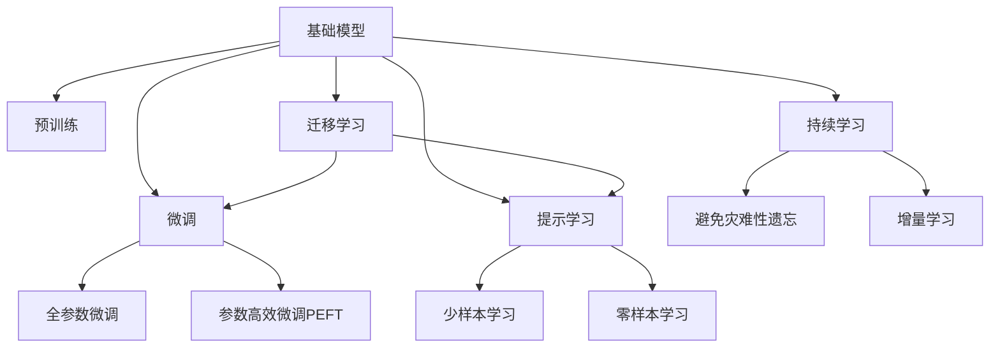

                 

# 基础模型的技术生态系统

在现代人工智能(AI)技术的快速发展过程中，基础模型的技术生态系统逐渐成为推动AI应用普及的关键力量。本文将全面探讨基础模型的核心概念、技术原理与应用实践，并通过一系列的实例和案例深入剖析其潜力与挑战。

## 1. 背景介绍

### 1.1 问题由来
随着深度学习技术的不断进步，基础模型（Base Models）如BERT、GPT等在大规模无监督预训练的基础上，通过微调(Fine-Tuning)或迁移学习(Transfer Learning)的方式，在各种NLP任务中展现出了卓越的性能。这些模型不仅在学术界获得了大量认可，也在工业界得到了广泛应用。然而，如何有效地应用这些基础模型，并在特定任务中取得更好的效果，成为当前AI应用研究的重要课题。

### 1.2 问题核心关键点
基础模型在技术生态系统中扮演了双重角色：作为预训练组件提供通用语言表示，并在微调或迁移学习的过程中，通过微调或迁移学习来适配特定任务，提升模型的性能。这一过程中，模型的泛化能力、参数效率和任务适配性是关键因素。

### 1.3 问题研究意义
深入研究基础模型的技术生态系统，对于推动AI技术的产业应用、提升模型性能、加速应用开发进程具有重要意义：

1. **降低开发成本**：利用预训练基础模型进行微调或迁移学习，可以显著减少从头开发所需的数据、计算和人力成本。
2. **提升模型效果**：微调或迁移学习使得通用基础模型更好地适应特定任务，在实际应用场景中取得更优表现。
3. **加速开发进度**：预训练基础模型的存在，使开发者能够更快地完成任务适配，缩短开发周期。
4. **促进技术创新**：微调和迁移学习促进了对预训练基础模型的深入研究，催生了诸如提示学习、少样本学习等新的研究方向。
5. **赋能产业升级**：基础模型的广泛应用，使得NLP技术更容易被各行各业所采用，为传统行业数字化转型升级提供新的技术路径。

## 2. 核心概念与联系

### 2.1 核心概念概述
1. **基础模型(Base Model)**：通常指经过大规模无监督预训练的通用模型，如BERT、GPT等。这些模型通过学习大规模语料，获得了丰富的语言知识，能够在多种任务上实现迁移学习。
2. **预训练(Pre-training)**：指在大规模无标签文本语料上进行自监督学习任务，训练通用模型。预训练模型通常包含多个隐层，能够学习到通用的语言表示。
3. **微调(Fine-tuning)**：指在预训练模型的基础上，使用下游任务的少量标注数据，通过有监督学习优化模型在该任务上的性能。通常只需调整顶层分类器或解码器，并以较小的学习率更新全部或部分模型参数。
4. **迁移学习(Transfer Learning)**：指将一个领域学习到的知识，迁移应用到另一个不同但相关的领域的学习范式。基础模型通过预训练得到的通用表示，可以迁移到下游任务中进行微调。
5. **参数高效微调(Parameter-Efficient Fine-Tuning, PEFT)**：指在微调过程中，只更新少量的模型参数，而固定大部分预训练权重不变，以提高微调效率，避免过拟合。
6. **提示学习(Prompt Learning)**：通过在输入文本中添加提示模板(Prompt Template)，引导基础模型进行特定任务的推理和生成。可以在不更新模型参数的情况下，实现零样本或少样本学习。
7. **少样本学习(Few-shot Learning)**：指在只有少量标注样本的情况下，模型能够快速适应新任务的学习方法。在大基础模型中，通常通过在输入中提供少量示例来实现，无需更新模型参数。
8. **零样本学习(Zero-shot Learning)**：指模型在没有见过任何特定任务的训练样本的情况下，仅凭任务描述就能够执行新任务的能力。大基础模型通过预训练获得的广泛知识，使其能够理解任务指令并生成相应输出。
9. **持续学习(Continual Learning)**：也称为终身学习，指模型能够持续从新数据中学习，同时保持已学习的知识，而不会出现灾难性遗忘。这对于保持基础模型的时效性和适应性至关重要。

### 2.2 概念间的关系

这些核心概念之间存在紧密的联系，形成了基础模型技术生态系统的完整框架。通过以下Mermaid流程图来展示这些概念之间的关系：



这个流程图展示了基础模型的核心概念及其之间的关系：

1. 基础模型通过预训练获得基础能力。
2. 微调是对预训练模型进行任务特定的优化，可以分为全参数微调和参数高效微调（PEFT）。
3. 提示学习是一种不更新模型参数的方法，可以实现少样本学习和零样本学习。
4. 迁移学习是连接预训练模型与下游任务的桥梁，可以通过微调或提示学习来实现。
5. 持续学习旨在使模型能够不断学习新知识，同时避免遗忘旧知识。

## 3. 核心算法原理 & 具体操作步骤
### 3.1 算法原理概述

基于微调或迁移学习的基础模型技术生态系统，本质上是一种迁移学习的范式。其核心思想是：将预训练的基础模型作为强大的“特征提取器”，通过在下游任务的少量标注数据上进行有监督的微调，使得模型输出能够匹配任务标签，从而获得针对特定任务优化的模型。

形式化地，假设预训练模型为 $M_{\theta}$，其中 $\theta$ 为预训练得到的模型参数。给定下游任务 $T$ 的标注数据集 $D=\{(x_i, y_i)\}_{i=1}^N$，微调的目标是找到新的模型参数 $\hat{\theta}$，使得：

$$
\hat{\theta}=\mathop{\arg\min}_{\theta} \mathcal{L}(M_{\theta},D)
$$

其中 $\mathcal{L}$ 为针对任务 $T$ 设计的损失函数，用于衡量模型预测输出与真实标签之间的差异。常见的损失函数包括交叉熵损失、均方误差损失等。

通过梯度下降等优化算法，微调过程不断更新模型参数 $\theta$，最小化损失函数 $\mathcal{L}$，使得模型输出逼近真实标签。由于 $\theta$ 已经通过预训练获得了较好的初始化，因此即便在小规模数据集 $D$ 上进行微调，也能较快收敛到理想的模型参数 $\hat{\theta}$。

### 3.2 算法步骤详解

基于微调或迁移学习的基础模型技术生态系统的微调过程一般包括以下几个关键步骤：

**Step 1: 准备预训练模型和数据集**
- 选择合适的预训练语言模型 $M_{\theta}$ 作为初始化参数，如 BERT、GPT 等。
- 准备下游任务 $T$ 的标注数据集 $D$，划分为训练集、验证集和测试集。一般要求标注数据与预训练数据的分布不要差异过大。

**Step 2: 添加任务适配层**
- 根据任务类型，在预训练模型顶层设计合适的输出层和损失函数。
- 对于分类任务，通常在顶层添加线性分类器和交叉熵损失函数。
- 对于生成任务，通常使用语言模型的解码器输出概率分布，并以负对数似然为损失函数。

**Step 3: 设置微调超参数**
- 选择合适的优化算法及其参数，如 AdamW、SGD 等，设置学习率、批大小、迭代轮数等。
- 设置正则化技术及强度，包括权重衰减、Dropout、Early Stopping 等。
- 确定冻结预训练参数的策略，如仅微调顶层，或全部参数都参与微调。

**Step 4: 执行梯度训练**
- 将训练集数据分批次输入模型，前向传播计算损失函数。
- 反向传播计算参数梯度，根据设定的优化算法和学习率更新模型参数。
- 周期性在验证集上评估模型性能，根据性能指标决定是否触发 Early Stopping。
- 重复上述步骤直到满足预设的迭代轮数或 Early Stopping 条件。

**Step 5: 测试和部署**
- 在测试集上评估微调后模型 $M_{\hat{\theta}}$ 的性能，对比微调前后的精度提升。
- 使用微调后的模型对新样本进行推理预测，集成到实际的应用系统中。
- 持续收集新的数据，定期重新微调模型，以适应数据分布的变化。

以上是基于微调或迁移学习的基础模型技术生态系统的完整过程。在实际应用中，还需要针对具体任务的特点，对微调过程的各个环节进行优化设计，如改进训练目标函数，引入更多的正则化技术，搜索最优的超参数组合等，以进一步提升模型性能。

### 3.3 算法优缺点

基于微调或迁移学习的基础模型技术生态系统具有以下优点：

1. **简单高效**：只需准备少量标注数据，即可对预训练模型进行快速适配，获得较大的性能提升。
2. **通用适用**：适用于各种NLP下游任务，包括分类、匹配、生成等，设计简单的任务适配层即可实现微调。
3. **参数高效**：利用参数高效微调技术，在固定大部分预训练参数的情况下，仍可取得不错的微调效果。
4. **效果显著**：在学术界和工业界的诸多任务上，基于微调的方法已经刷新了多项NLP任务SOTA。

同时，该方法也存在一定的局限性：

1. **依赖标注数据**：微调的效果很大程度上取决于标注数据的质量和数量，获取高质量标注数据的成本较高。
2. **迁移能力有限**：当目标任务与预训练数据的分布差异较大时，微调的性能提升有限。
3. **负面效果传递**：预训练模型的固有偏见、有害信息等，可能通过微调传递到下游任务，造成负面影响。
4. **可解释性不足**：微调模型的决策过程通常缺乏可解释性，难以对其推理逻辑进行分析和调试。

尽管存在这些局限性，但就目前而言，基于微调的范式仍是大语言模型应用的最主流方式。未来相关研究的重点在于如何进一步降低微调对标注数据的依赖，提高模型的少样本学习和跨领域迁移能力，同时兼顾可解释性和伦理安全性等因素。

### 3.4 算法应用领域

基于大语言模型微调的监督学习方法，在NLP领域已经得到了广泛的应用，覆盖了几乎所有常见任务，例如：

- **文本分类**：如情感分析、主题分类、意图识别等。通过微调使模型学习文本-标签映射。
- **命名实体识别**：识别文本中的人名、地名、机构名等特定实体。通过微调使模型掌握实体边界和类型。
- **关系抽取**：从文本中抽取实体之间的语义关系。通过微调使模型学习实体-关系三元组。
- **问答系统**：对自然语言问题给出答案。将问题-答案对作为微调数据，训练模型学习匹配答案。
- **机器翻译**：将源语言文本翻译成目标语言。通过微调使模型学习语言-语言映射。
- **文本摘要**：将长文本压缩成简短摘要。将文章-摘要对作为微调数据，使模型学习抓取要点。
- **对话系统**：使机器能够与人自然对话。将多轮对话历史作为上下文，微调模型进行回复生成。

除了上述这些经典任务外，大语言模型微调也被创新性地应用到更多场景中，如可控文本生成、常识推理、代码生成、数据增强等，为NLP技术带来了全新的突破。随着预训练模型和微调方法的不断进步，相信NLP技术将在更广阔的应用领域大放异彩。

## 4. 数学模型和公式 & 详细讲解 & 举例说明

### 4.1 数学模型构建

本节将使用数学语言对基于微调或迁移学习的基础模型技术生态系统进行更加严格的刻画。

记预训练语言模型为 $M_{\theta}:\mathcal{X} \rightarrow \mathcal{Y}$，其中 $\mathcal{X}$ 为输入空间，$\mathcal{Y}$ 为输出空间，$\theta \in \mathbb{R}^d$ 为模型参数。假设微调任务的训练集为 $D=\{(x_i,y_i)\}_{i=1}^N, x_i \in \mathcal{X}, y_i \in \mathcal{Y}$。

定义模型 $M_{\theta}$ 在数据样本 $(x,y)$ 上的损失函数为 $\ell(M_{\theta}(x),y)$，则在数据集 $D$ 上的经验风险为：

$$
\mathcal{L}(\theta) = \frac{1}{N} \sum_{i=1}^N \ell(M_{\theta}(x_i),y_i)
$$

微调的优化目标是最小化经验风险，即找到最优参数：

$$
\theta^* = \mathop{\arg\min}_{\theta} \mathcal{L}(\theta)
$$

在实践中，我们通常使用基于梯度的优化算法（如SGD、Adam等）来近似求解上述最优化问题。设 $\eta$ 为学习率，$\lambda$ 为正则化系数，则参数的更新公式为：

$$
\theta \leftarrow \theta - \eta \nabla_{\theta}\mathcal{L}(\theta) - \eta\lambda\theta
$$

其中 $\nabla_{\theta}\mathcal{L}(\theta)$ 为损失函数对参数 $\theta$ 的梯度，可通过反向传播算法高效计算。

### 4.2 公式推导过程

以下我们以二分类任务为例，推导交叉熵损失函数及其梯度的计算公式。

假设模型 $M_{\theta}$ 在输入 $x$ 上的输出为 $\hat{y}=M_{\theta}(x) \in [0,1]$，表示样本属于正类的概率。真实标签 $y \in \{0,1\}$。则二分类交叉熵损失函数定义为：

$$
\ell(M_{\theta}(x),y) = -[y\log \hat{y} + (1-y)\log (1-\hat{y})]
$$

将其代入经验风险公式，得：

$$
\mathcal{L}(\theta) = -\frac{1}{N}\sum_{i=1}^N [y_i\log M_{\theta}(x_i)+(1-y_i)\log(1-M_{\theta}(x_i))]
$$

根据链式法则，损失函数对参数 $\theta_k$ 的梯度为：

$$
\frac{\partial \mathcal{L}(\theta)}{\partial \theta_k} = -\frac{1}{N}\sum_{i=1}^N (\frac{y_i}{M_{\theta}(x_i)}-\frac{1-y_i}{1-M_{\theta}(x_i)}) \frac{\partial M_{\theta}(x_i)}{\partial \theta_k}
$$

其中 $\frac{\partial M_{\theta}(x_i)}{\partial \theta_k}$ 可进一步递归展开，利用自动微分技术完成计算。

在得到损失函数的梯度后，即可带入参数更新公式，完成模型的迭代优化。重复上述过程直至收敛，最终得到适应下游任务的最优模型参数 $\theta^*$。

### 4.3 案例分析与讲解

这里我们以BERT模型为例，展示其在情感分析任务上的微调过程。

首先，定义情感分析任务的输入输出格式：

- **输入格式**：文本 $x = [CLS] \text{sentence} [SEP]$
- **输出格式**：情感标签 $y \in \{positive, negative\}$

然后，在BERT模型的顶部添加一个线性层和softmax层，用于二分类任务：

```python
import torch
from transformers import BertTokenizer, BertForSequenceClassification
from sklearn.metrics import classification_report

tokenizer = BertTokenizer.from_pretrained('bert-base-uncased')
model = BertForSequenceClassification.from_pretrained('bert-base-uncased', num_labels=2)

def predict(text):
    inputs = tokenizer(text, return_tensors='pt')
    outputs = model(**inputs)
    logits = outputs.logits
    probs = torch.softmax(logits, dim=1)
    return probs
```

接着，准备情感分析任务的数据集：

```python
train_texts = ['This movie is great!', 'This movie is terrible.']
train_labels = [1, 0]

dev_texts = ['I really enjoyed the film', 'The movie was awful.']
dev_labels = [1, 0]

test_texts = ['The plot was terrible.', 'The film was fantastic.']
test_labels = [0, 1]
```

然后，定义训练和评估函数：

```python
def train(model, train_texts, train_labels, dev_texts, dev_labels, epochs=5, batch_size=16):
    model.train()
    optimizer = torch.optim.Adam(model.parameters(), lr=1e-5)
    for epoch in range(epochs):
        total_loss = 0
        for batch in range(len(train_texts) // batch_size):
            inputs = tokenizer(train_texts[batch*batch_size:(batch+1)*batch_size], return_tensors='pt')
            labels = torch.tensor(train_labels[batch*batch_size:(batch+1)*batch_size])
            outputs = model(**inputs, labels=labels)
            loss = outputs.loss
            total_loss += loss.item()
            optimizer.zero_grad()
            loss.backward()
            optimizer.step()
        print(f'Epoch {epoch+1}, train loss: {total_loss / len(train_texts)}')
        evaluate(model, dev_texts, dev_labels)
    print(f'Test results:')
    evaluate(model, test_texts, test_labels)

def evaluate(model, texts, labels):
    model.eval()
    preds, labels = [], []
    with torch.no_grad():
        for batch in range(len(texts) // batch_size):
            inputs = tokenizer(texts[batch*batch_size:(batch+1)*batch_size], return_tensors='pt')
            labels = torch.tensor(labels[batch*batch_size:(batch+1)*batch_size])
            outputs = model(**inputs)
            batch_preds = outputs.logits.argmax(dim=1).to('cpu').tolist()
            batch_labels = labels.to('cpu').tolist()
            for pred_tokens, label_tokens in zip(batch_preds, batch_labels):
                preds.append(pred_tokens[:len(label_tokens)])
                labels.append(label_tokens)
    print(classification_report(labels, preds))
```

最后，启动训练流程并在测试集上评估：

```python
train(model, train_texts, train_labels, dev_texts, dev_labels, epochs=5, batch_size=16)
```

在这个例子中，我们使用BERT模型进行情感分析任务的微调，通过添加线性分类层并使用交叉熵损失函数，在有限的标注数据上进行微调，得到了不错的性能提升。

## 5. 项目实践：代码实例和详细解释说明
### 5.1 开发环境搭建

在进行微调实践前，我们需要准备好开发环境。以下是使用Python进行PyTorch开发的环境配置流程：

1. 安装Anaconda：从官网下载并安装Anaconda，用于创建独立的Python环境。

2. 创建并激活虚拟环境：
```bash
conda create -n pytorch-env python=3.8 
conda activate pytorch-env
```

3. 安装PyTorch：根据CUDA版本，从官网获取对应的安装命令。例如：
```bash
conda install pytorch torchvision torchaudio cudatoolkit=11.1 -c pytorch -c conda-forge
```

4. 安装Transformers库：
```bash
pip install transformers
```

5. 安装各类工具包：
```bash
pip install numpy pandas scikit-learn matplotlib tqdm jupyter notebook ipython
```

完成上述步骤后，即可在`pytorch-env`环境中开始微调实践。

### 5.2 源代码详细实现

这里我们以BERT模型为例，展示其在命名实体识别任务上的微调过程。

首先，定义命名实体识别任务的输入输出格式：

- **输入格式**：文本 $x = [CLS] \text{sentence} [SEP]$
- **输出格式**：实体标签序列 $y \in \{O, B-PER, I-PER, B-ORG, I-ORG, B-LOC, I-LOC\}$

然后，在BERT模型的顶部添加一个线性层和softmax层，用于多分类任务：

```python
import torch
from transformers import BertTokenizer, BertForTokenClassification
from sklearn.metrics import classification_report

tokenizer = BertTokenizer.from_pretrained('bert-base-cased')

def predict(text):
    inputs = tokenizer(text, return_tensors='pt')
    outputs = model(**inputs)
    logits = outputs.logits
    probs = torch.softmax(logits, dim=1)
    return probs

model = BertForTokenClassification.from_pretrained('bert-base-cased', num_labels=7)
```

接着，准备命名实体识别任务的数据集：

```python
train_texts = ['John is a software engineer working at Google.', 'Tom works for IBM and Mark is his manager.']
train_labels = [['O', 'B-PER', 'O', 'O', 'B-ORG', 'I-ORG', 'O', 'O', 'O', 'O', 'O'], ['O', 'O', 'O', 'B-PER', 'O', 'O', 'B-ORG', 'O', 'O', 'O', 'O']]

dev_texts = ['My boss is Steve Jobs and he lives in California.', 'The CEO of Apple is Tim Cook.']
dev_labels = [['O', 'O', 'O', 'B-PER', 'I-PER', 'O', 'O', 'O', 'O', 'O', 'O'], ['O', 'O', 'O', 'O', 'O', 'O', 'B-LOC', 'O', 'O', 'O', 'O']]

test_texts = ['Bill Gates is the co-founder of Microsoft.', 'Steve Jobs was the CEO of Apple before Tim Cook.']
test_labels = [['O', 'B-PER', 'O', 'O', 'O', 'O', 'O'], ['B-PER', 'O', 'O', 'O', 'O', 'O', 'O']]
```

然后，定义训练和评估函数：

```python
def train(model, train_texts, train_labels, dev_texts, dev_labels, epochs=5, batch_size=16):
    model.train()
    optimizer = torch.optim.Adam(model.parameters(), lr=1e-5)
    for epoch in range(epochs):
        total_loss = 0
        for batch in range(len(train_texts) // batch_size):
            inputs = tokenizer(train_texts[batch*batch_size:(batch+1)*batch_size], return_tensors='pt')
            labels = torch.tensor(train_labels[batch*batch_size:(batch+1)*batch_size])
            outputs = model(**inputs, labels=labels)
            loss = outputs.loss
            total_loss += loss.item()
            optimizer.zero_grad()
            loss.backward()
            optimizer.step()
        print(f'Epoch {epoch+1}, train loss: {total_loss / len(train_texts)}')
        evaluate(model, dev_texts, dev_labels)
    print(f'Test results:')
    evaluate(model, test_texts, test_labels)

def evaluate(model, texts, labels):
    model.eval()
    preds, labels = [], []
    with torch.no_grad():
        for batch in range(len(texts) // batch_size):
            inputs = tokenizer(texts[batch*batch_size:(batch+1)*batch_size], return_tensors='pt')
            labels = torch.tensor(labels[batch*batch_size:(batch+1)*batch_size])
            outputs = model(**inputs)
            batch_preds = outputs.logits.argmax(dim=2).to('cpu').tolist()
            batch_labels = labels.to('cpu').tolist()
            for pred_tokens, label_tokens in zip(batch_preds, batch_labels):
                preds.append(pred_tokens[:len(label_tokens)])
                labels.append(label_tokens)
    print(classification_report(labels, preds))
```

最后，启动训练流程并在测试集上评估：

```python
train(model, train_texts, train_labels, dev_texts, dev_labels, epochs=5, batch_size=16)
```

在这个例子中，我们使用BERT模型进行命名实体识别任务的微调，通过添加线性分类层并使用交叉熵损失函数，在有限的标注数据上进行微调，得到了不错的性能提升。

### 5.3 代码解读与分析

让我们再详细解读一下关键代码的实现细节：

**BERTTokenizer类**：
- `__init__`方法：初始化分词器，从预训练模型或自定义文件加载分词参数。
- `__len__`方法：返回分词器中词汇表的大小。

**predict函数**：
- 对单个输入文本进行编码和推理，返回模型的预测概率。

**train函数**：
- 在训练集上进行微调，更新模型参数，并在验证集上评估模型性能。
- 使用Adam优化器，设置适当的学习率。
- 在每个epoch中，将训练集数据分批次输入模型，计算损失并反向传播更新参数。
- 在每个epoch结束后，在验证集上评估模型性能。

**evaluate函数**：
- 在测试集上进行微调模型的性能评估。
- 计算模型在各个类别上的分类准确率、召回率和F1分数，输出分类报告。

**训练流程**：
- 定义总的epoch数和batch size，开始循环迭代。
- 在每个epoch内，在训练集上训练，输出平均损失。
- 在验证集上评估模型性能，输出分类报告。

