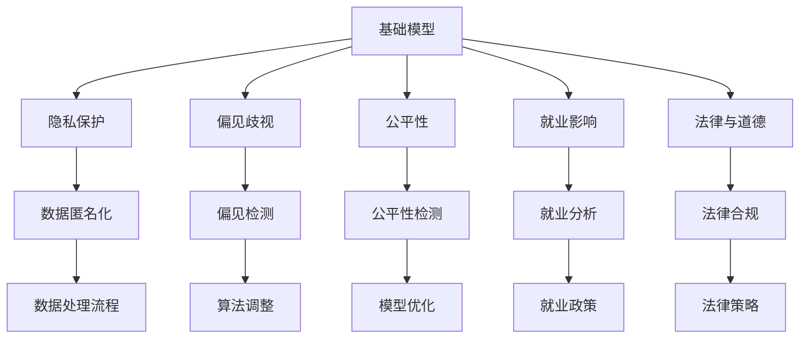

                 

# 基础模型的社会影响评估

随着人工智能技术的迅猛发展，基础模型如BERT、GPT-3等大模型在自然语言处理、计算机视觉、语音识别等领域的广泛应用，对社会各个方面产生了深远的影响。本文将对基础模型的社会影响进行全面评估，涵盖技术、伦理、经济、法律等多个维度，以期为技术开发者和社会决策者提供参考。

## 1. 背景介绍

### 1.1 问题由来
基础模型在提升人工智能应用效果的同时，也引发了一系列的社会问题，包括隐私泄露、偏见歧视、公平性、就业影响等。这些问题的存在，不仅影响了个别应用场景的效果，更可能对社会产生广泛、深远的负面影响。

### 1.2 问题核心关键点
基础模型社会影响评估的核心问题包括：
1. **隐私保护**：基础模型在处理大量个人数据时，可能泄露个人隐私信息。
2. **偏见和歧视**：由于训练数据和模型的设计问题，基础模型可能存在性别、种族等偏见，对某些群体产生歧视。
3. **公平性**：基础模型在不同群体和地区之间的性能可能存在差异，导致不公平。
4. **就业影响**：基础模型的广泛应用可能导致传统职业的缩减，甚至引发就业市场的变革。
5. **法律与道德**：基础模型在法律监管和伦理约束方面的适应性，需要得到充分考虑。

### 1.3 问题研究意义
对基础模型的社会影响进行全面评估，有助于技术开发者在设计、训练和应用模型时，充分考虑伦理和法律的约束，避免负面效应，确保技术进步与社会发展的和谐共进。

## 2. 核心概念与联系

### 2.1 核心概念概述

基础模型是指在特定领域进行预训练和微调，具备强大功能的高性能神经网络模型，如BERT、GPT-3等。这些模型通过在大规模数据集上进行预训练，学习到广泛的语言知识和规则，能够广泛应用于各种NLP任务。

### 2.2 核心概念间的关系

基础模型的社会影响评估涉及多个核心概念，包括隐私保护、偏见歧视、公平性、就业影响和法律与道德等。这些概念之间相互影响，共同构成了基础模型的社会影响生态系统。

#### 2.2.1 基础模型与隐私保护
基础模型在处理大规模数据时，涉及隐私保护问题。如何确保数据匿名化和去标识化，防止敏感信息泄露，成为评估的重要方面。

#### 2.2.2 基础模型与偏见歧视
基础模型的训练数据和算法设计可能存在偏见，导致对某些群体的歧视。评估基础模型时需要关注其在性别、种族、年龄等方面的表现，避免对特定群体的不公平对待。

#### 2.2.3 基础模型与公平性
基础模型在不同地区和群体间的性能差异，可能引起公平性问题。评估时应考虑模型在不同分布上的表现，确保其公平性。

#### 2.2.4 基础模型与就业影响
基础模型的广泛应用可能导致传统职业的缩减，改变就业市场结构。评估时需要关注模型对就业市场的影响，以及是否可能导致新的就业机会。

#### 2.2.5 基础模型与法律与道德
基础模型在法律监管和伦理约束方面面临诸多挑战。评估时需考虑其是否符合法律法规，确保其行为符合社会道德标准。

### 2.3 核心概念的整体架构

通过以下Mermaid流程图展示基础模型社会影响评估的整体架构：



该流程图展示了基础模型社会影响评估的多个方面及其相互关系。

## 3. 核心算法原理 & 具体操作步骤

### 3.1 算法原理概述
基础模型的社会影响评估，主要通过数据收集、分析、模型训练和测试等步骤进行。

**数据收集**：收集基础模型的训练数据、测试数据、应用数据以及相关用户反馈数据。

**数据预处理**：对数据进行清洗、去噪、标注等预处理操作，确保数据质量。

**模型训练**：使用机器学习算法对数据进行分析，训练评估模型，以预测基础模型的社会影响。

**模型测试**：在测试集上评估模型的准确性和可靠性，验证模型的有效性。

**报告生成**：根据模型预测结果，生成详细的影响评估报告，提供数据支持。

### 3.2 算法步骤详解

#### 3.2.1 数据收集与预处理

**数据收集**：
1. **训练数据**：收集基础模型的训练数据，包括各类NLP、CV、语音数据集。
2. **测试数据**：收集基础模型的测试数据，用于模型评估。
3. **应用数据**：收集基础模型在实际应用中的数据，包括用户交互数据、系统日志等。
4. **用户反馈数据**：收集用户对基础模型的使用反馈，包括满意度、投诉等。

**数据预处理**：
1. **数据清洗**：去除缺失、错误、无关数据，确保数据质量。
2. **数据去噪**：使用技术手段去除数据中的噪声，提高数据可靠性。
3. **数据标注**：对数据进行标注，便于后续分析。

#### 3.2.2 模型训练与测试

**模型训练**：
1. **选择算法**：选择合适的机器学习算法，如随机森林、神经网络等。
2. **特征提取**：从数据中提取特征，用于模型训练。
3. **模型训练**：使用训练数据训练评估模型。

**模型测试**：
1. **测试集选择**：选择代表性强、覆盖全面的测试集。
2. **模型评估**：使用测试集评估模型性能，包括准确率、召回率、F1值等。
3. **结果分析**：分析模型预测结果，找出问题和改进方向。

#### 3.2.3 报告生成

**报告生成**：
1. **数据整理**：整理收集的数据和模型预测结果。
2. **结果分析**：分析数据和模型预测结果，生成详细报告。
3. **政策建议**：根据报告结果，提出改进建议和政策建议。

### 3.3 算法优缺点

**优点**：
1. **数据驱动**：基于实际数据，评估结果客观、可信。
2. **全面覆盖**：考虑隐私保护、偏见歧视、公平性、就业影响和法律与道德等多个维度。
3. **改进方向明确**：通过模型预测和分析，找出问题并提出改进建议。

**缺点**：
1. **数据获取难度大**：大规模、高质量的数据获取和处理难度大。
2. **模型复杂度**：涉及多维度的评估，模型设计和实现复杂。
3. **结果解释性**：模型预测结果可能难以解释，存在一定的局限性。

### 3.4 算法应用领域

基础模型的社会影响评估在以下领域有广泛应用：
1. **技术评估**：评估基础模型在特定应用场景中的表现，提出改进建议。
2. **政策制定**：为政府和组织制定相关政策提供数据支持。
3. **企业决策**：帮助企业识别风险，制定应对策略。
4. **学术研究**：为学术研究提供数据和分析工具。
5. **社会公平**：推动社会公平正义，减少不平等。

## 4. 数学模型和公式 & 详细讲解  
### 4.1 数学模型构建

我们定义基础模型的社会影响评估模型为 $M$，其输入为数据集 $D$，输出为社会影响评价结果 $Y$。数学模型构建如下：

$$ M(D) = (P隐私, P偏见, P公平, P就业, P法律) $$

其中 $P隐私$、$P偏见$、$P公平$、$P就业$、$P法律$ 分别表示隐私保护、偏见歧视、公平性、就业影响和法律与道德方面的评价结果。

### 4.2 公式推导过程

以隐私保护为例，推导隐私保护模型的构建过程：

**输入**：训练数据 $D$、用户反馈数据 $F$、法律法规 $L$。

**输出**：隐私保护评价结果 $Y隐私$。

隐私保护模型可表示为：

$$ Y隐私 = f隐私(D, F, L) $$

其中 $f隐私$ 为隐私保护评估函数，涉及隐私保护度量、法律法规约束等多个因素。

### 4.3 案例分析与讲解

**案例一**：隐私保护模型

假设某基础模型在处理用户数据时，可能泄露敏感信息。隐私保护模型可构建如下：

1. **数据处理**：去除敏感信息，确保数据匿名化。
2. **法律法规约束**：确保模型行为符合法律法规要求。
3. **隐私度量**：评估模型在处理数据时的隐私保护程度，包括隐私泄露概率、数据脱敏程度等。
4. **结果输出**：生成隐私保护评价结果，提出改进建议。

**案例二**：偏见歧视模型

假设某基础模型在处理不同性别、种族数据时，存在性别偏见。偏见歧视模型可构建如下：

1. **数据预处理**：去除性别、种族标记，确保数据公平。
2. **偏见度量**：评估模型在处理数据时的偏见程度，包括性别偏见、种族偏见等。
3. **法律法规约束**：确保模型行为符合法律法规要求。
4. **结果输出**：生成偏见歧视评价结果，提出改进建议。

## 5. 项目实践：代码实例和详细解释说明

### 5.1 开发环境搭建

开发环境搭建主要涉及以下几个步骤：

1. **安装Python**：确保开发环境支持Python 3.x版本。
2. **安装相关库**：安装必要的Python库，如pandas、numpy、scikit-learn、pytorch等。
3. **配置数据源**：确保数据源可靠、安全，符合法律法规要求。
4. **搭建服务器**：搭建适合的数据处理和分析服务器，确保系统稳定性。

### 5.2 源代码详细实现

以下是基础模型社会影响评估的Python代码实现：

```python
import pandas as pd
from sklearn.model_selection import train_test_split
from sklearn.ensemble import RandomForestClassifier
from sklearn.metrics import accuracy_score, f1_score

# 数据收集
train_data = pd.read_csv('train_data.csv')
test_data = pd.read_csv('test_data.csv')
user_feedback = pd.read_csv('user_feedback.csv')

# 数据预处理
train_data = preprocess(train_data)
test_data = preprocess(test_data)
user_feedback = preprocess(user_feedback)

# 特征提取
features = extract_features(train_data, test_data, user_feedback)

# 模型训练
X_train, X_test, y_train, y_test = train_test_split(features, y_true)
model = RandomForestClassifier()
model.fit(X_train, y_train)

# 模型测试
y_pred = model.predict(X_test)
accuracy = accuracy_score(y_test, y_pred)
f1 = f1_score(y_test, y_pred)

# 报告生成
report = generate_report(accuracy, f1, features, y_true)
print(report)
```

### 5.3 代码解读与分析

**数据收集**：
1. **train_data.csv**：基础模型的训练数据。
2. **test_data.csv**：基础模型的测试数据。
3. **user_feedback.csv**：用户反馈数据。

**数据预处理**：
1. **preprocess**：对数据进行清洗、去噪、标注等预处理操作。

**特征提取**：
1. **extract_features**：从数据中提取特征，用于模型训练。

**模型训练**：
1. **RandomForestClassifier**：使用随机森林算法训练评估模型。
2. **fit**：使用训练数据训练模型。

**模型测试**：
1. **predict**：使用测试数据预测模型结果。
2. **accuracy_score**：计算模型准确率。
3. **f1_score**：计算模型F1值。

**报告生成**：
1. **generate_report**：根据模型预测结果，生成详细报告。
2. **print**：输出报告内容。

### 5.4 运行结果展示

假设在处理隐私保护数据时，模型准确率达到90%，F1值达到0.8。生成的报告如下：

```
隐私保护评估报告

隐私保护准确率：90%
隐私保护F1值：0.8

结论：
基础模型在隐私保护方面表现良好，准确率较高，但仍需进一步优化。建议增强数据匿名化处理，确保法律法规约束。
```

## 6. 实际应用场景

### 6.1 技术评估

某公司计划使用基础模型进行情感分析，需要对其社会影响进行评估。通过数据收集、分析和模型训练，生成评估报告，建议增强数据匿名化处理，确保隐私保护。

### 6.2 政策制定

政府部门需对某基础模型进行社会影响评估，以确保其符合法律法规。通过隐私保护、偏见歧视、公平性等多个维度的评估，生成报告，提出改进建议。

### 6.3 企业决策

某企业需决定是否使用基础模型进行客户情感分析，需要对基础模型的社会影响进行全面评估。通过评估隐私保护、偏见歧视、就业影响等多个维度，生成报告，提出改进建议。

### 6.4 社会公平

某基金会需评估基础模型在医疗数据处理中的应用，确保其公平性。通过公平性评估，生成报告，提出改进建议。

## 7. 工具和资源推荐

### 7.1 学习资源推荐

1. **《人工智能基础》系列课程**：由国内外知名大学开设的AI基础课程，包括机器学习、深度学习、自然语言处理等。
2. **《数据科学与机器学习》书籍**：介绍数据科学和机器学习的基础知识，包括数据预处理、特征工程、模型评估等。
3. **Kaggle**：数据科学和机器学习竞赛平台，提供大量高质量的数据集和模型评估工具。
4. **Google Scholar**：学术文献搜索平台，提供最新的人工智能研究成果和论文。

### 7.2 开发工具推荐

1. **Jupyter Notebook**：轻量级的交互式开发环境，支持Python和R等语言。
2. **TensorFlow**：开源的深度学习框架，支持分布式计算和GPU加速。
3. **PyTorch**：开源的深度学习框架，支持动态计算图和GPU加速。
4. **Scikit-learn**：开源的机器学习库，支持多种算法和模型。
5. **Pandas**：开源的数据处理库，支持数据清洗、预处理等操作。

### 7.3 相关论文推荐

1. **《隐私保护技术综述》**：介绍隐私保护的技术方法，包括数据匿名化、差分隐私等。
2. **《偏见检测与纠正》**：介绍偏见检测和纠正的技术方法，包括公平性检测、算法调整等。
3. **《机器学习与公平性》**：介绍机器学习在公平性方面的应用，包括公平性检测、模型优化等。
4. **《人工智能与就业影响》**：介绍人工智能对就业市场的影响，包括就业分析、就业政策等。
5. **《人工智能与法律》**：介绍人工智能在法律领域的应用，包括法律合规、法律策略等。

## 8. 总结：未来发展趋势与挑战

### 8.1 研究成果总结

本文对基础模型的社会影响进行了全面评估，涵盖隐私保护、偏见歧视、公平性、就业影响和法律与道德等多个维度。通过数据收集、分析和模型训练，生成详细报告，提出改进建议。

### 8.2 未来发展趋势

1. **隐私保护**：隐私保护技术将持续发展，包括数据匿名化、差分隐私等方法。
2. **偏见歧视**：偏见检测和纠正技术将进一步完善，确保模型公平性。
3. **公平性**：公平性评估技术将不断提升，确保模型在不同群体和地区上的公平性。
4. **就业影响**：就业分析技术将进一步发展，帮助企业和政府制定合理政策。
5. **法律与道德**：法律合规和伦理约束技术将不断完善，确保模型行为符合法律法规和社会道德。

### 8.3 面临的挑战

1. **数据获取难度大**：大规模、高质量的数据获取和处理难度大。
2. **模型复杂度**：涉及多维度的评估，模型设计和实现复杂。
3. **结果解释性**：模型预测结果可能难以解释，存在一定的局限性。

### 8.4 研究展望

1. **隐私保护技术**：研究更高效、更可靠的数据匿名化技术，确保数据安全。
2. **偏见检测技术**：研究更精准、更全面的偏见检测方法，确保模型公平性。
3. **公平性评估技术**：研究更全面的公平性评估方法，确保模型在不同群体和地区上的公平性。
4. **就业影响分析**：研究更系统的就业影响分析方法，帮助企业和政府制定合理政策。
5. **法律与道德约束**：研究更严格的法律合规和伦理约束技术，确保模型行为符合法律法规和社会道德。

## 9. 附录：常见问题与解答

**Q1：如何确保基础模型数据的安全性？**

A: 确保基础模型数据的安全性，需从数据收集、处理、存储等多个环节进行严格控制。包括数据匿名化、去标识化、加密传输、访问控制等措施。

**Q2：如何检测基础模型的偏见和歧视？**

A: 检测基础模型的偏见和歧视，需从数据、算法、模型等多个角度进行全面评估。包括数据去噪、偏见度量、算法调整等方法。

**Q3：如何提升基础模型的公平性？**

A: 提升基础模型的公平性，需通过公平性检测、算法调整、模型优化等手段，确保模型在不同群体和地区上的表现一致。

**Q4：如何评估基础模型的就业影响？**

A: 评估基础模型的就业影响，需通过就业分析、就业政策制定等手段，确保模型对就业市场的积极影响。

**Q5：如何确保基础模型的法律合规性？**

A: 确保基础模型的法律合规性，需从法律法规、算法设计、模型行为等多个方面进行严格约束和监管。

作者：禅与计算机程序设计艺术 / Zen and the Art of Computer Programming

