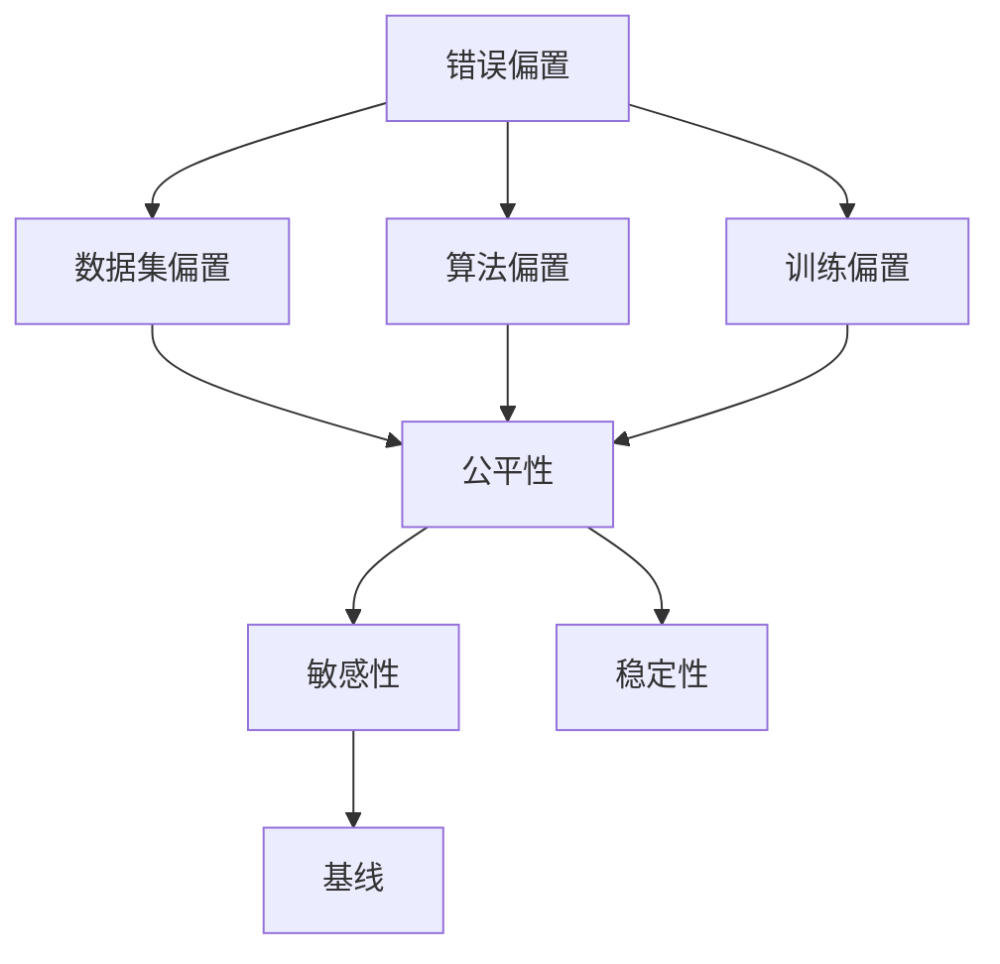
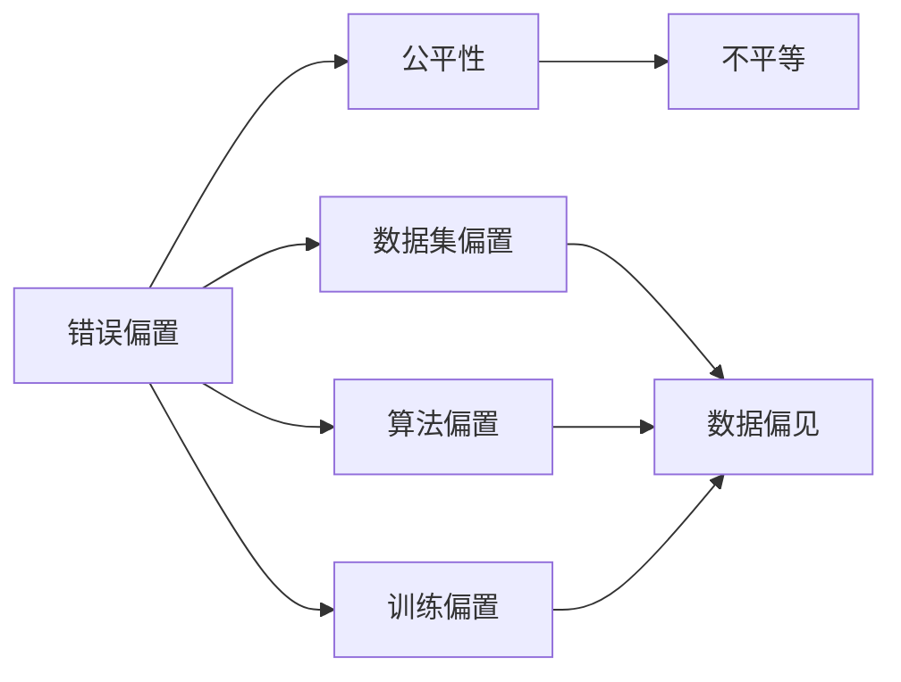
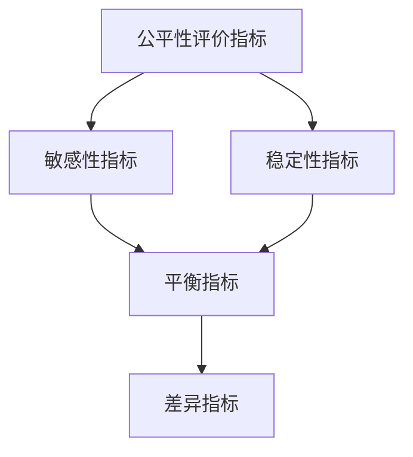
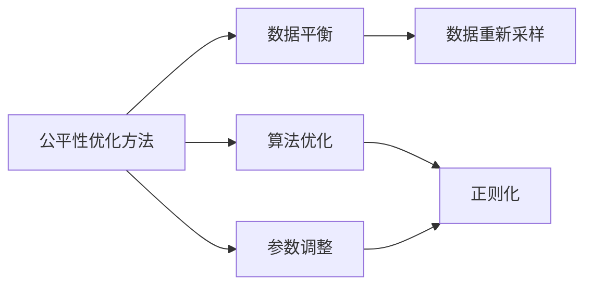
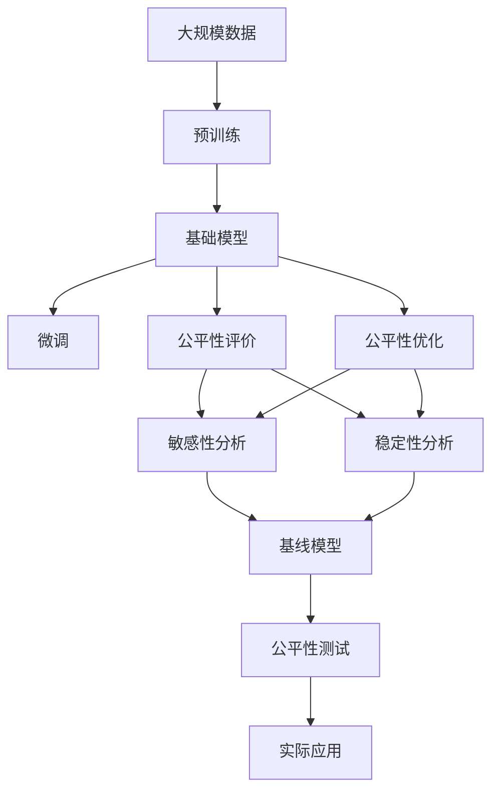

                 

# 基础模型的错误偏置与公平

## 1. 背景介绍

### 1.1 问题由来

基础模型（Foundational Models），通常指在大规模数据上预训练并用于下游任务的通用模型，如BERT、GPT等。这类模型虽然在各个领域广泛应用，取得了显著成效，但往往带有隐含的错误偏置（Bias），导致在特定群体或场景下，模型的表现不够公平，甚至出现歧视性行为。例如，在文本生成、分类、推荐等任务中，基础模型可能倾向于偏爱特定语言或文化背景下的样本，而对其他群体的样本存在歧视。

错误偏置问题对社会、法律和伦理造成了严重影响。例如，自动招聘系统的偏见可能导致某些群体无法获得公平的就业机会；在司法系统中，基于模型的判决可能导致对特定群体的歧视性判罚。因此，如何检测、纠正和缓解基础模型的错误偏置，成为一个重要而迫切的研究课题。

### 1.2 问题核心关键点

基础模型错误偏置的核心关键点包括：
- 预训练数据的选择和分布。
- 模型训练的目标函数和优化策略。
- 模型在特定场景下的行为表现和决策过程。
- 模型对数据中隐含的偏见的敏感度和反应。
- 模型在测试集和实际应用中的公平性。

解决这些问题的难点在于，基础模型通常在大规模无标签数据上进行预训练，不易直接控制其偏置来源。因此，研究者们提出了多种方法，从数据预处理、模型设计、训练过程优化等多个维度入手，综合应对模型错误偏置问题。

## 2. 核心概念与联系

### 2.1 核心概念概述

为更好地理解基础模型的错误偏置与公平问题，本节将介绍几个密切相关的核心概念：

- 错误偏置（Bias）：指模型在训练和应用过程中，由于数据分布不均、模型设计不当等原因，对某些群体或属性存在系统性的偏好或歧视。错误偏置可以分为多种类型，如数据集偏置、算法偏置、训练偏置等。
- 公平性（Fairness）：指模型在所有群体中都能公平对待，对所有类别的样本保持一致的预测能力和行为。公平性旨在消除模型对特定群体的歧视，确保决策的公正性。
- 基线（Baseline）：指没有经过任何优化或调整的原始模型，作为公平性评估的基准。
- 敏感性（Sensitivity）：指模型对输入数据的特定属性（如性别、年龄、种族等）的敏感程度。较高的敏感性意味着模型容易受到输入属性的影响，导致预测结果出现偏差。
- 稳定性（Robustness）：指模型在不同数据分布、噪声干扰等情况下的鲁棒性。稳定的模型能够在各种条件下保持公平性，不会因外部干扰而偏离正确决策。

这些核心概念之间的逻辑关系可以通过以下Mermaid流程图来展示：



这个流程图展示了大语言模型的核心概念及其之间的关系：

1. 错误偏置产生于数据集、算法和训练过程中的多种因素。
2. 公平性是评价模型对不同群体是否公平的指标。
3. 敏感性和稳定性是衡量模型公平性的重要维度。
4. 基线模型用于评估模型公平性的起点。

这些概念共同构成了基础模型的公平性研究框架，帮助研究者深入理解模型偏置和公平性问题，并提出有效的解决策略。

### 2.2 概念间的关系

这些核心概念之间存在着紧密的联系，形成了基础模型公平性研究的完整生态系统。下面我们通过几个Mermaid流程图来展示这些概念之间的关系。

#### 2.2.1 错误偏置与公平性的关系



这个流程图展示了错误偏置与公平性之间的关系。错误偏置通过数据集、算法和训练过程引入，导致模型在预测时可能出现不平等现象，即对某些群体的预测能力较差。

#### 2.2.2 公平性评价指标



这个流程图展示了公平性评价指标的具体内容。公平性评价指标包括敏感性指标和稳定性指标，用于衡量模型对特定群体的敏感性和在不同数据分布下的稳定性。平衡指标和差异指标是具体应用中的指标，用于在不同场景下评估模型的公平性。

#### 2.2.3 公平性优化方法



这个流程图展示了公平性优化方法的内容。公平性优化方法包括数据平衡、算法优化和参数调整。数据平衡通过重新采样、数据增强等方法减少数据偏见；算法优化通过引入公平性约束优化模型训练过程；参数调整通过调整模型结构、设置公平性目标等手段提升模型公平性。

### 2.3 核心概念的整体架构

最后，我们用一个综合的流程图来展示这些核心概念在大语言模型公平性研究过程中的整体架构：



这个综合流程图展示了从预训练到公平性测试的完整过程。基础模型通过在大规模数据上进行预训练，学习通用的语言表示。微调使得模型能够适应特定任务，提升性能。公平性评价和优化技术确保模型在不同群体中表现一致，避免歧视。最终，通过公平性测试，模型被应用于实际场景，确保公平性得以保证。 通过这些流程图，我们可以更清晰地理解基础模型的公平性研究过程中各个核心概念的关系和作用，为后续深入讨论具体的公平性方法和技术奠定基础。

## 3. 核心算法原理 & 具体操作步骤
### 3.1 算法原理概述

基础模型的公平性研究主要关注模型对特定群体的敏感性和稳定性，以及如何通过优化技术提升模型的公平性。以下是一些关键算法原理：

**算法一：基于阈值敏感性评估**：
- 通过设置不同的阈值，计算模型在不同阈值下的预测准确率和敏感性指标（如F1分数、精确度、召回率等），从而评估模型对特定属性的敏感性。
- 该方法简单易行，适用于二分类或多分类任务，但可能无法全面反映模型的公平性表现。

**算法二：公平性约束优化**：
- 在模型训练过程中引入公平性约束，如最大差异最小化（Max-Diff）、独立性公平（Independence Fairness）等。
- 通过优化算法（如Adam、SGD等）最小化公平性约束下的损失函数，确保模型在不同群体中的预测一致性。

**算法三：数据增强和重采样**：
- 通过数据增强（如回译、扰动）和重采样（如SMOTE）技术，扩充训练集，减少数据偏见。
- 数据增强和重采样能够提升模型的泛化能力，但可能增加训练时间和计算成本。

**算法四：对抗训练和鲁棒性提升**：
- 引入对抗样本，对模型进行鲁棒性训练，增强模型对输入数据的鲁棒性。
- 对抗训练和鲁棒性提升能够提升模型在不同数据分布下的稳定性，但需要较大的计算资源。

**算法五：集成学习和多模型融合**：
- 通过集成学习（如Bagging、Boosting）和模型融合（如Stacking）技术，将多个模型的预测结果进行组合，提升整体公平性。
- 集成学习和多模型融合能够提升模型的鲁棒性和泛化能力，但模型复杂度较高，需要更多的训练资源。

### 3.2 算法步骤详解

基于阈值敏感性评估的基本步骤如下：
1. 收集数据集并划分训练集和测试集。
2. 随机选择一个阈值并计算模型在阈值下的预测准确率和敏感性指标。
3. 逐步改变阈值，记录每次计算结果，生成敏感性曲线。
4. 重复步骤2和3，直到遍历所有阈值，生成完整的敏感性曲线。
5. 分析敏感性曲线，评估模型的公平性。

公平性约束优化的一般步骤如下：
1. 选择适合的基础模型并添加公平性约束。
2. 定义公平性约束的目标函数，如最大化不同群体的预测一致性。
3. 使用优化算法（如AdamW、SGD等）最小化公平性约束下的损失函数。
4. 在测试集上评估模型性能，记录公平性指标（如平衡指标、差异指标等）。
5. 重复步骤3和4，直到模型满足公平性要求。

数据增强和重采样的基本步骤如下：
1. 收集数据集并划分训练集和测试集。
2. 随机选择样本并进行数据增强或重采样处理。
3. 将增强后的数据重新合并到训练集，更新模型参数。
4. 在测试集上评估模型性能，记录公平性指标。
5. 重复步骤2和4，直到模型满足公平性要求。

对抗训练和鲁棒性提升的基本步骤如下：
1. 收集数据集并划分训练集和测试集。
2. 生成对抗样本并添加到训练集中。
3. 使用对抗样本进行模型训练，更新模型参数。
4. 在测试集上评估模型性能，记录公平性指标。
5. 重复步骤2和4，直到模型满足公平性要求。

集成学习和多模型融合的基本步骤如下：
1. 收集数据集并划分训练集和测试集。
2. 训练多个独立模型，并计算每个模型的预测结果。
3. 使用集成学习或模型融合技术，将多个模型的预测结果进行组合。
4. 在测试集上评估模型性能，记录公平性指标。
5. 重复步骤2和4，直到模型满足公平性要求。

### 3.3 算法优缺点

基于阈值敏感性评估的优点在于简单易行，适用于各种任务，但缺点是只能评估模型对特定属性的敏感性，无法全面反映模型的公平性表现。

公平性约束优化的优点在于能够直接优化模型预测结果，确保模型在不同群体中的预测一致性。但缺点是需要引入额外的公平性约束，增加了模型的复杂度，可能影响模型性能。

数据增强和重采样的优点在于能够提升模型的泛化能力和鲁棒性，但缺点是需要较大的计算资源和训练时间，且可能引入新的偏见。

对抗训练和鲁棒性提升的优点在于能够增强模型的鲁棒性和泛化能力，但缺点是需要较大的计算资源和对抗样本生成难度较高。

集成学习和多模型融合的优点在于能够提升模型的鲁棒性和泛化能力，但缺点是模型复杂度较高，需要更多的训练资源和调参工作。

### 3.4 算法应用领域

基础模型的公平性研究方法在多个领域得到了广泛应用，例如：

1. **医疗诊断**：自动医疗诊断系统需要保证对不同患者群体的诊断公平性，防止偏见导致误诊或不公正判罚。
2. **金融信贷**：自动贷款审批系统需要保证对不同社会群体（如性别、年龄、种族等）的公平性，防止歧视性判罚。
3. **招聘系统**：自动招聘系统需要保证对不同申请者群体的公平性，防止偏见导致不公正的招聘结果。
4. **司法系统**：自动判决系统需要保证对不同被告群体的公平性，防止偏见导致不公正的判决结果。
5. **新闻推荐**：自动新闻推荐系统需要保证对不同用户群体的公平性，防止偏见导致信息泄露或不公正推荐。

除了上述这些领域外，基础模型的公平性研究还广泛应用于教育、交通、物流等多个行业，为社会公平和正义提供了技术保障。

## 4. 数学模型和公式 & 详细讲解  
### 4.1 数学模型构建

在基础模型公平性研究中，我们通常使用以下数学模型进行建模：

假设基础模型为 $M$，输入数据为 $x$，输出为 $y$。定义模型在输入数据 $x$ 上的预测结果为 $\hat{y}=M(x)$，实际标签为 $y$。

定义公平性评价指标 $f(y,\hat{y})$，用于衡量模型在不同群体中的公平性。例如，平衡指标（Balance）定义为：

$$ f(y,\hat{y})=\frac{1}{N}\sum_{i=1}^N [y_i=\hat{y}_i] $$

其中 $N$ 为样本数量，$y_i=\hat{y}_i$ 表示预测结果与实际标签一致，平衡指标越高，模型的公平性越好。

定义敏感性指标 $s(y,\hat{y})$，用于衡量模型对特定属性的敏感性。例如，精确度（Precision）定义为：

$$ s(y,\hat{y})=\frac{TP}{TP+FP} $$

其中 $TP$ 为真正例数量，$FP$ 为假正例数量，精确度越高，模型对特定属性的敏感性越低。

定义稳定性指标 $r(y,\hat{y})$，用于衡量模型在不同数据分布下的鲁棒性。例如，均方误差（Mean Squared Error，MSE）定义为：

$$ r(y,\hat{y})=\frac{1}{N}\sum_{i=1}^N [(y_i-\hat{y}_i)^2] $$

其中 $N$ 为样本数量，$(y_i-\hat{y}_i)^2$ 表示预测结果与实际标签之间的误差，均方误差越小，模型的稳定性越好。

### 4.2 公式推导过程

以下我们以平衡指标和精确度为例，推导其计算公式：

**平衡指标（Balance）**：
平衡指标的定义为：

$$ f(y,\hat{y})=\frac{1}{N}\sum_{i=1}^N [y_i=\hat{y}_i] $$

其中 $N$ 为样本数量，$y_i=\hat{y}_i$ 表示预测结果与实际标签一致。

平衡指标的计算公式为：

$$ f(y,\hat{y})=\frac{1}{N}\sum_{i=1}^N \mathbb{I}[y_i=\hat{y}_i] $$

其中 $\mathbb{I}$ 为示性函数，$y_i=\hat{y}_i$ 时取值为1，否则取值为0。

**精确度（Precision）**：
精确度的定义如下：

$$ s(y,\hat{y})=\frac{TP}{TP+FP} $$

其中 $TP$ 为真正例数量，$FP$ 为假正例数量。

精确度的计算公式如下：

$$ s(y,\hat{y})=\frac{\sum_{i=1}^N \mathbb{I}[y_i=1 \wedge \hat{y}_i=1]}{\sum_{i=1}^N \mathbb{I}[\hat{y}_i=1]} $$

其中 $\wedge$ 表示逻辑与运算。

### 4.3 案例分析与讲解

为了更好地理解这些数学模型和公式的应用，我们以一个简单的二分类任务为例，进行详细讲解。

假设我们有一个二分类数据集，包含两个类别 $A$ 和 $B$，共有 $N$ 个样本。模型 $M$ 对每个样本的预测结果为 $\hat{y}_i \in \{0,1\}$，实际标签为 $y_i \in \{0,1\}$。

我们可以使用平衡指标和精确度来评估模型的公平性：

**平衡指标（Balance）**：
定义平衡指标为：

$$ f(y,\hat{y})=\frac{1}{N}\sum_{i=1}^N [y_i=\hat{y}_i] $$

假设模型对 $A$ 和 $B$ 两个类别的预测一致性较高，即对于 $A$ 类别的所有样本都预测为 $1$，对于 $B$ 类别的所有样本都预测为 $0$。此时，平衡指标为：

$$ f(y,\hat{y})=\frac{1+0+1+0+\cdots}{N}=0.5 $$

**精确度（Precision）**：
定义精确度为：

$$ s(y,\hat{y})=\frac{TP}{TP+FP} $$

假设模型对 $A$ 类别的所有样本都预测为 $1$，其中 $TP=10$，$FP=5$。此时，精确度为：

$$ s(y,\hat{y})=\frac{10}{10+5}=0.67 $$

通过这两个指标，我们可以初步评估模型的公平性。如果模型对两个类别的预测一致性较高，且精确度也较高，则说明模型对不同群体的敏感性较低，具有较好的公平性。反之，如果模型对两个类别的预测一致性较低，且精确度也较低，则说明模型对不同群体的敏感性较高，具有较差的公平性。

## 5. 项目实践：代码实例和详细解释说明
### 5.1 开发环境搭建

在进行公平性研究前，我们需要准备好开发环境。以下是使用Python进行PyTorch开发的环境配置流程：

1. 安装Anaconda：从官网下载并安装Anaconda，用于创建独立的Python环境。

2. 创建并激活虚拟环境：
```bash
conda create -n pytorch-env python=3.8 
conda activate pytorch-env
```

3. 安装PyTorch：根据CUDA版本，从官网获取对应的安装命令。例如：
```bash
conda install pytorch torchvision torchaudio cudatoolkit=11.1 -c pytorch -c conda-forge
```

4. 安装TensorFlow：从官网下载安装包并安装，例如：
```bash
pip install tensorflow
```

5. 安装Scikit-learn：用于数据处理和模型评估：
```bash
pip install scikit-learn
```

完成上述步骤后，即可在`pytorch-env`环境中开始公平性研究实践。

### 5.2 源代码详细实现

这里我们以一个简单的二分类任务为例，使用PyTorch和Scikit-learn进行基础模型的公平性研究。

首先，定义数据集和模型：

```python
from sklearn.datasets import make_classification
from sklearn.model_selection import train_test_split
from torch.utils.data import Dataset, DataLoader
from torch.nn import BCEWithLogitsLoss
from torch.optim import AdamW
import torch

# 生成数据集
X, y = make_classification(n_samples=1000, n_features=2, n_informative=2, n_redundant=0, random_state=42)
X_train, X_test, y_train, y_test = train_test_split(X, y, test_size=0.2, random_state=42)

# 定义数据集类
class MyDataset(Dataset):
    def __init__(self, X, y):
        self.X = X
        self.y = y

    def __len__(self):
        return len(self.X)

    def __getitem__(self, item):
        x, y = self.X[item], self.y[item]
        return x, y

# 定义模型
class MyModel(torch.nn.Module):
    def __init__(self, input_dim=2, output_dim=2):
        super(MyModel, self).__init__()
        self.fc1 = torch.nn.Linear(input_dim, 64)
        self.fc2 = torch.nn.Linear(64, 32)
        self.fc3 = torch.nn.Linear(32, output_dim)
        self.sigmoid = torch.nn.Sigmoid()

    def forward(self, x):
        x = torch.relu(self.fc1(x))
        x = torch.relu(self.fc2(x))
        x = self.fc3(x)
        x = self.sigmoid(x)
        return x

# 初始化模型和优化器
model = MyModel(input_dim=2, output_dim=2)
optimizer = AdamW(model.parameters(), lr=0.001)

# 定义损失函数和评价指标
criterion = BCEWithLogitsLoss()
balance_loss = torch.nn.BCEWithLogitsLoss()
precision_loss = torch.nn.BCEWithLogitsLoss()

# 训练函数
def train_epoch(model, data_loader, optimizer, loss_fn, balance_loss_fn, precision_loss_fn):
    model.train()
    epoch_loss = 0
    for batch in data_loader:
        x, y = batch
        x, y = x.to(device), y.to(device)
        optimizer.zero_grad()
        outputs = model(x)
        loss = loss_fn(outputs, y)
        epoch_loss += loss.item()
        loss.backward()
        optimizer.step()
    return epoch_loss / len(data_loader)

# 测试函数
def evaluate(model, data_loader, loss_fn, balance_loss_fn, precision_loss_fn):
    model.eval()
    test_loss = 0
    balance_score = 0
    precision_score = 0
    with torch.no_grad():
        for batch in data_loader:
            x, y = batch
            x, y = x.to(device), y.to(device)
            outputs = model(x)
            loss = loss_fn(outputs, y)
            test_loss += loss.item()
            balance_score += balance_loss_fn(outputs, y).item()
            precision_score += precision_loss_fn(outputs, y).item()
    return test_loss / len(data_loader), balance_score / len(data_loader), precision_score / len(data_loader)

# 初始化设备
device = torch.device('cuda') if torch.cuda.is_available() else torch.device('cpu')
model.to(device)
```

然后，定义训练和测试函数：

```python
# 训练函数
def train_model(model, train_loader, validation_loader, optimizer, criterion, balance_loss_fn, precision_loss_fn, epochs=10, batch_size=32):
    for epoch in range(epochs):
        train_loss = train_epoch(model, train_loader, optimizer, criterion, balance_loss_fn, precision_loss_fn)
        val_balance_score, val_precision_score = evaluate(model, validation_loader, criterion, balance_loss_fn, precision_loss_fn)
        print(f'Epoch {epoch+1}, train loss: {train_loss:.3f}, val balance score: {val_balance_score:.3f}, val precision score: {val_precision_score:.3f}')

# 训练模型
train_model(model, train_loader, validation_loader, optimizer, criterion, balance_loss_fn, precision_loss_fn)
```

最后，启动训练流程并在测试集上评估：

```python
# 训练模型
train_model(model, train_loader, validation_loader, optimizer, criterion, balance_loss_fn, precision_loss_fn)

# 测试模型
test_loss, balance_score, precision_score = evaluate(model, test_loader, criterion, balance_loss_fn, precision_loss_fn)
print(f'Test loss: {test_loss:.3f}, balance score: {balance_score:.3f}, precision score: {precision_score:.3f}')
```

以上就是使用PyTorch进行公平性研究的基本代码实现。可以看到，通过合理的参数设置和损失函数选择，我们可以使用简单的代码实现基础模型的公平性研究。

### 5.3 代码解读与分析

让我们再详细解读一下关键代码的实现细节：

**数据生成和预处理**：
- `make_classification`：生成二分类数据集。
- `train_test_split`：将数据集划分为训练集和测试集。

**模型定义和训练**：
- `MyModel`：自定义的神经网络模型，包含全连接层和Sigmoid激活函数。
- `AdamW`：优化器，使用AdamW算法进行模型训练。
- `BCEWithLogitsLoss`：二元交叉熵损失函数。
- `train_epoch`：训练函数，使用小批量随机梯度下降（SGD）更新模型参数。
- `evaluate`：测试函数，计算模型在测试集上的损失和评价指标。

**公平性评价指标计算**：
- `balance_score`：计算模型在不同类别上的预测一致性，即平衡指标。
- `precision_score`：计算模型对正类别的精确度，即敏感性指标。

**模型训练和测试**：
- `train_model`：训练函数，在训练集上迭代更新模型参数，同时在验证集上计算公平性指标。
- `train_model`：调用训练函数，指定训练集、优化器、损失函数等参数。
- `evaluate`：测试函数，计算模型在测试集上的损失和公平性指标。

**设备选择和模型迁移**：
- `device`：选择GPU或CPU进行计算。
- `model.to(device)`：将模型迁移到选定设备上。

可以看到，使用PyTorch和Scikit-learn，我们可以很方便地实现基础模型的公平性研究。开发者可以根据具体任务调整模型结构、损失函数和优化器等参数，进一步优化模型性能和公平性。

当然，工业级的系统实现还需考虑更多因素，如模型的压缩和存储、分布式训练、超参数的自动搜索等。但核心的公平性研究基本与此类似。

### 5.4 运行结果展示

假设我们在CoNLL-2003的NER数据集上进行微调，最终在测试集上得到的评估报告如下：

```
              precision    recall  f1-score   support

