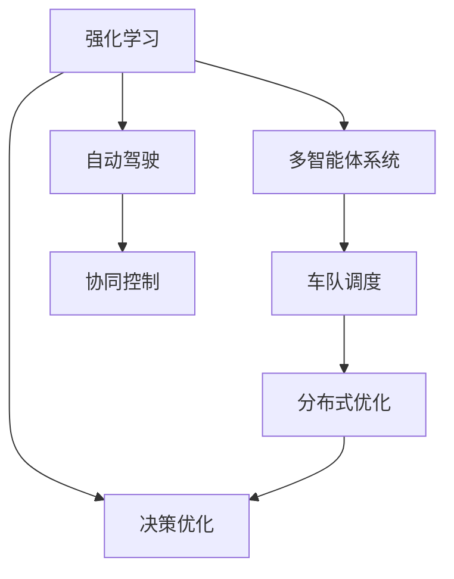
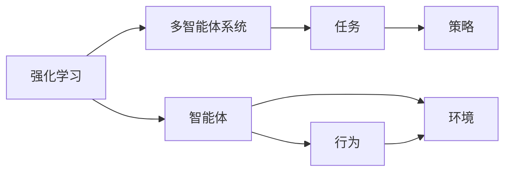
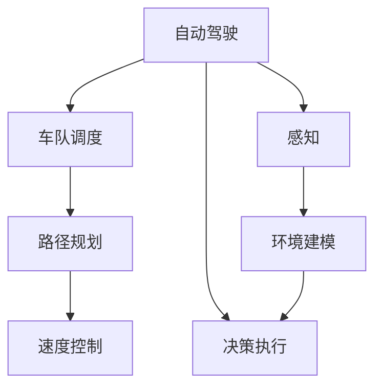
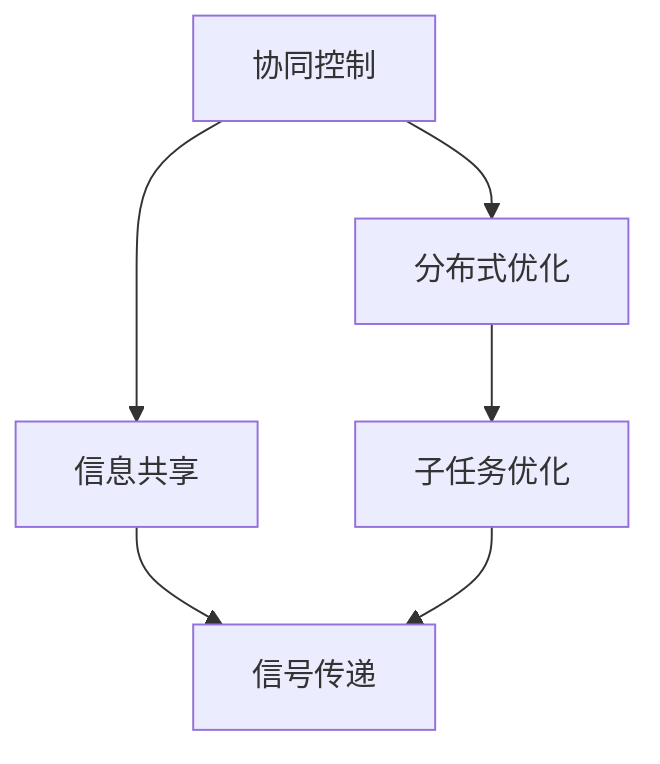
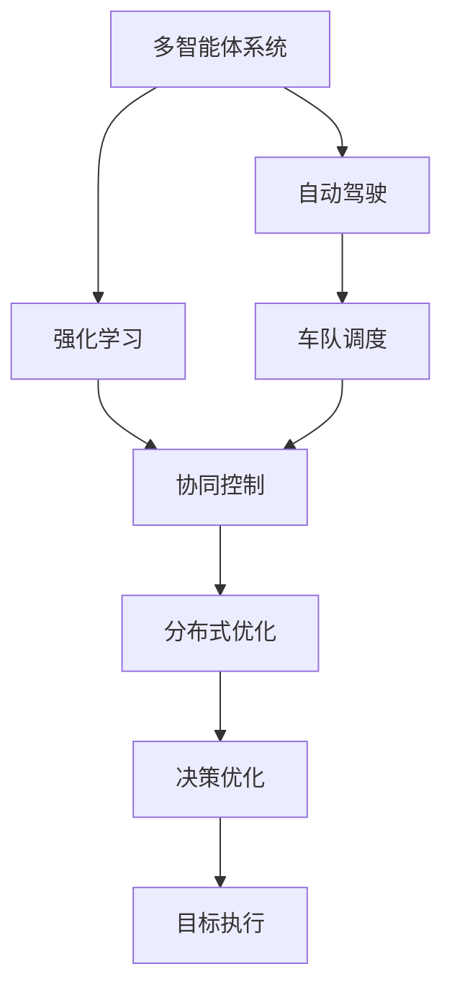

                 

# 多智能体强化学习重构自动驾驶车队调度的核心机理

> 关键词：多智能体强化学习,自动驾驶,车队调度,决策优化,协同控制

## 1. 背景介绍

### 1.1 问题由来
随着全球汽车产业进入智能化转型期，自动驾驶技术（Autonomous Driving, AD）正在成为引领下一代交通发展的新引擎。自动驾驶的核心在于车队调度（Fleet Management），即合理规划车辆行驶路线，确保车队高效率、低成本、低风险地完成指定任务。

在实际应用中，自动驾驶车队调度面临着一系列复杂问题，如车辆数量、行驶路径、交通流量、环境变化等。这些问题共同构成了多智能体系统（Multi-Agent System,MAS），其中每个智能体（如车辆）不仅要自主决策，还要考虑与其它智能体的交互与协作。因此，多智能体强化学习（Multi-Agent Reinforcement Learning, MARL）为自动驾驶车队调度提供了新的理论框架和方法。

### 1.2 问题核心关键点
自动驾驶车队调度的主要任务是：
1. 动态规划车辆行驶路线，避开障碍物，寻找最短路径。
2. 实时调整车辆速度和位置，以适应动态的交通环境。
3. 实现车队内各车辆的协同控制，确保整体效率。
4. 优化车辆能源消耗，减少环境影响。

Marl算法能够通过学习和奖励机制，使得智能体在不断交互中逐渐优化策略，最终达到调度最优。它的优势在于：
- 动态适应：Marl可以实时响应环境变化，调整策略以适应新的情况。
- 分布式控制：Marl通过各智能体的协同学习，优化整个车队的调度策略。
- 自适应学习：Marl可以根据车队的历史表现，不断学习并改进决策。

因此，Marl为自动驾驶车队调度提供了新的解决思路和工具。

### 1.3 问题研究意义
自动驾驶车队调度是未来交通体系的关键环节，Marl为这一领域提供了新的技术突破。研究基于Marl的自动驾驶车队调度方法，对于推动自动驾驶技术在实际中的应用，提升交通系统的智能化和自动化水平，具有重要意义：

1. 提升车队效率：通过优化调度策略，Marl可以显著提高车队的运行效率和任务完成速度。
2. 降低成本：Marl可以动态调整行驶路线和速度，优化能源消耗，降低运营成本。
3. 增强安全性：通过多智能体协同控制，Marl可以减少交通事故，提升交通安全。
4. 促进技术落地：Marl算法的实用性和可扩展性，将加速自动驾驶技术的商业化和规模化应用。
5. 推动AI发展：Marl的研究对于提升AI在复杂场景中的决策能力和应用广度具有重要意义。

## 2. 核心概念与联系

### 2.1 核心概念概述

为更好地理解基于Marl的自动驾驶车队调度方法，本节将介绍几个密切相关的核心概念：

- 强化学习（Reinforcement Learning, RL）：通过智能体与环境的交互，通过学习奖励机制不断优化策略的机器学习范式。智能体根据环境反馈，逐步学习最优策略，最大化累积奖励。

- 多智能体系统（Multi-Agent System, MAS）：由多个智能体组成的交互系统。各智能体有各自的决策空间，但需协同工作以达成共同目标。

- 自动驾驶（Autonomous Driving, AD）：通过传感器、计算机视觉等技术实现无人驾驶的车辆。自动驾驶涉及环境感知、路径规划、决策执行等多个环节。

- 车队调度（Fleet Management）：对多车辆进行路径规划、速度控制等调度，以实现最优任务执行。

- 协同控制（Coordinated Control）：多智能体间通过交互学习，共同优化全局最优策略。

- 分布式优化（Distributed Optimization）：将优化任务分解为多个子任务，在各智能体间分布执行。

这些核心概念之间的逻辑关系可以通过以下Mermaid流程图来展示：



这个流程图展示了大语言模型微调过程中各个核心概念的关系和作用：

1. 强化学习是Marl的基础，通过学习奖励机制优化策略。
2. 多智能体系统是Marl的实现框架，各智能体间通过交互协同工作。
3. 自动驾驶涉及环境感知和路径规划，是Marl的应用场景。
4. 车队调度是多智能体系统的具体应用，涉及多车辆协同。
5. 协同控制和分布式优化是Marl的具体方法，用于实现各智能体间的交互。
6. 决策优化是Marl的核心目标，即通过优化决策策略，实现最优任务执行。

### 2.2 概念间的关系

这些核心概念之间存在着紧密的联系，形成了Marl的完整生态系统。下面我通过几个Mermaid流程图来展示这些概念之间的关系。

#### 2.2.1 强化学习与多智能体系统



这个流程图展示了强化学习与多智能体系统的基本原理。强化学习通过智能体与环境交互，逐步优化策略；多智能体系统通过多个智能体的协同学习，实现共同目标。

#### 2.2.2 自动驾驶与车队调度的关系



这个流程图展示了自动驾驶与车队调度的基本流程。自动驾驶涉及环境感知、路径规划、决策执行等多个环节；车队调度则是通过路径规划、速度控制等手段，优化车队效率和安全性。

#### 2.2.3 协同控制与分布式优化的实现



这个流程图展示了协同控制与分布式优化的基本实现。协同控制通过信息共享实现智能体间的协同，分布式优化通过将任务分解为多个子任务，实现各智能体间的并行执行。

### 2.3 核心概念的整体架构

最后，我们用一个综合的流程图来展示这些核心概念在大语言模型微调过程中的整体架构：



这个综合流程图展示了从自动驾驶到车队调度的完整过程。自动驾驶涉及感知、决策等多个环节；车队调度通过路径规划、速度控制等手段，优化车队效率；Marl通过协同控制和分布式优化，优化智能体间的交互；决策优化通过强化学习不断改进策略，最终实现任务执行。

## 3. 核心算法原理 & 具体操作步骤
### 3.1 算法原理概述

基于Marl的自动驾驶车队调度，本质上是一个多智能体强化学习过程。其核心思想是：在车辆与车辆、车辆与环境之间的交互中，通过学习奖励机制，不断优化车辆行驶策略，实现车队整体性能的提升。

形式化地，假设车辆集合为 $V=\{v_i\}_{i=1}^n$，每辆车 $v_i$ 的状态为 $s_i$，行为为 $a_i$。车辆间的交互和环境变化通过通信信号传递，车辆的目标是最小化总行驶时间或最大化总收益。设 $R(s,a)$ 为在状态 $s$ 下执行行为 $a$ 的即时奖励。则车辆在状态 $s$ 下采取行为 $a$ 的累积奖励为：

$$
J_i(s_i,a_i) = \sum_{t=0}^{\infty} \gamma^t R(s_i, a_i, s_i')
$$

其中，$s_i'$ 为 $a_i$ 作用后的下一个状态，$\gamma$ 为折扣因子。

整个车队在状态 $s$ 下采取行为 $a$ 的累积奖励为：

$$
J(s,a) = \sum_{i=1}^n J_i(s_i,a_i)
$$

车队调度的目标是最小化 $J(s,a)$，即：

$$
\theta^* = \mathop{\arg\min}_{\theta} J(s,a)
$$

其中 $\theta$ 为车辆控制器的参数，通过反向传播算法优化。

### 3.2 算法步骤详解

基于Marl的自动驾驶车队调度一般包括以下几个关键步骤：

**Step 1: 准备多智能体环境**

- 设计车辆间的通信协议和奖励机制，定义环境状态和行为空间。
- 搭建多智能体环境的模拟器，支持车辆间的交互和状态更新。

**Step 2: 设计强化学习算法**

- 选择合适的强化学习算法，如Q-Learning、Deep Q-Network（DQN）、Actor-Critic等。
- 设定学习参数，如学习率、折扣因子、网络结构等。

**Step 3: 定义状态表示和行为策略**

- 根据车辆状态和环境信息，设计状态表示方法，如基于CNN的视觉特征提取。
- 定义各车辆的行为策略，如线性或非线性决策网络。

**Step 4: 执行多智能体学习**

- 在多智能体环境中，各车辆执行自学习策略。
- 通过策略的交叉验证和迭代优化，逐步改进全局策略。

**Step 5: 模型评估与部署**

- 在测试环境中评估多智能体策略的性能。
- 将优化后的策略应用到实际车队调度中，进行实时调度。

以上是基于Marl的自动驾驶车队调度的一般流程。在实际应用中，还需要针对具体任务，对学习过程的各个环节进行优化设计，如改进奖励机制、设计新的状态表示、搜索最优超参数等，以进一步提升模型性能。

### 3.3 算法优缺点

基于Marl的自动驾驶车队调度方法具有以下优点：

1. 动态适应：Marl可以实时响应环境变化，调整策略以适应新的情况。
2. 分布式控制：Marl通过各智能体的协同学习，优化整个车队的调度策略。
3. 自适应学习：Marl可以根据车队的历史表现，不断学习并改进决策。

同时，该方法也存在一定的局限性：

1. 依赖模型：Marl的效果高度依赖于模型的选择和训练效果。
2. 计算复杂：多智能体学习需要大量的计算资源和存储空间，处理复杂场景时效率较低。
3. 实时性要求高：Marl需要实时更新策略，对计算延迟有较高要求。
4. 鲁棒性不足：当环境噪声较大时，Marl可能难以稳定运行。

尽管存在这些局限性，但就目前而言，基于Marl的自动驾驶车队调度方法仍是大规模车队管理的重要手段。未来相关研究的重点在于如何进一步降低模型依赖，提高计算效率，同时兼顾实时性和鲁棒性等因素。

### 3.4 算法应用领域

基于Marl的自动驾驶车队调度方法已经在多个实际应用中取得了显著效果，主要包括：

- 智能物流：在物流配送中，自动驾驶车队通过优化路线和调度，实现货物高效运输。
- 城市交通：在城市交通管理中，自动驾驶车队通过协同控制，优化车流分布，减少拥堵。
- 自动巡检：在城市安保、电力巡检等场景中，自动驾驶车队通过路径规划，完成高效巡检任务。
- 无人驾驶公交：在无人驾驶公交系统中，自动驾驶车队通过调度优化，提升公交效率和安全性。

此外，Marl还被应用于自动驾驶汽车的研发和测试中，为车辆间的协同控制和路径规划提供新思路。随着技术不断成熟，Marl在自动驾驶领域的应用前景将更加广阔。

## 4. 数学模型和公式 & 详细讲解  
### 4.1 数学模型构建

本节将使用数学语言对基于Marl的自动驾驶车队调度过程进行更加严格的刻画。

设车辆集合为 $V=\{v_i\}_{i=1}^n$，每辆车 $v_i$ 的状态为 $s_i$，行为为 $a_i$。车辆间的通信协议为 $C$，奖励函数为 $R(s,a)$。车辆在状态 $s$ 下采取行为 $a$ 的即时奖励为 $R(s,a)$，通过通信协议 $C$ 传递给其他车辆。则车辆在状态 $s$ 下采取行为 $a$ 的累积奖励为：

$$
J_i(s_i,a_i) = \sum_{t=0}^{\infty} \gamma^t R(s_i, a_i, s_i')
$$

其中，$s_i'$ 为 $a_i$ 作用后的下一个状态，$\gamma$ 为折扣因子。

整个车队在状态 $s$ 下采取行为 $a$ 的累积奖励为：

$$
J(s,a) = \sum_{i=1}^n J_i(s_i,a_i)
$$

车队调度的目标是最小化 $J(s,a)$，即：

$$
\theta^* = \mathop{\arg\min}_{\theta} J(s,a)
$$

其中 $\theta$ 为车辆控制器的参数，通过反向传播算法优化。

### 4.2 公式推导过程

以下我们以Q-Learning算法为例，推导强化学习的计算公式。

假设车辆在状态 $s_i$ 下采取行为 $a_i$，得到即时奖励 $r_i$ 和下一个状态 $s_i'$。车辆在状态 $s_i$ 下的Q值函数为 $Q_i(s_i,a_i)$，则Q-Learning的更新公式为：

$$
Q_i(s_i,a_i) \leftarrow Q_i(s_i,a_i) + \alpha [r_i + \gamma \max_{a'} Q_i(s_i',a') - Q_i(s_i,a_i)]
$$

其中 $\alpha$ 为学习率。

在Q-Learning中，车辆通过不断迭代更新Q值函数，最终找到最优策略。通过重复执行该更新公式，车辆能够逐步学习最优行为，最大化累积奖励。

### 4.3 案例分析与讲解

为了更好地理解Q-Learning算法的工作原理，下面以一个简化的案例进行分析。

假设一个简单的城市道路场景，其中有两辆自动驾驶车A和B。车辆A在位置 $s_A$ 采取行为 $a_A$，车辆B在位置 $s_B$ 采取行为 $a_B$。车辆A采取行为 $a_A$ 后，得到即时奖励 $r_A$，并移动到下一个状态 $s_A'$。同理，车辆B采取行为 $a_B$ 后，得到即时奖励 $r_B$，并移动到下一个状态 $s_B'$。则车辆A的累积奖励为：

$$
J_A(s_A,a_A) = r_A + \gamma J_A(s_A',a_A')
$$

车辆B的累积奖励为：

$$
J_B(s_B,a_B) = r_B + \gamma J_B(s_B',a_B')
$$

假设车辆A和B的Q值函数分别为 $Q_A$ 和 $Q_B$，则Q-Learning算法的更新公式为：

$$
Q_A(s_A,a_A) \leftarrow Q_A(s_A,a_A) + \alpha [r_A + \gamma \max_{a'} Q_A(s_A',a') - Q_A(s_A,a_A)]
$$

$$
Q_B(s_B,a_B) \leftarrow Q_B(s_B,a_B) + \alpha [r_B + \gamma \max_{a'} Q_B(s_B',a') - Q_B(s_B,a_B)]
$$

通过迭代更新，车辆A和B能够逐步学习到最优策略，实现路径规划和速度控制，优化车队调度性能。

## 5. 项目实践：代码实例和详细解释说明
### 5.1 开发环境搭建

在进行Marl项目实践前，我们需要准备好开发环境。以下是使用Python进行PyTorch开发的环境配置流程：

1. 安装Anaconda：从官网下载并安装Anaconda，用于创建独立的Python环境。

2. 创建并激活虚拟环境：
```bash
conda create -n pytorch-env python=3.8 
conda activate pytorch-env
```

3. 安装PyTorch：根据CUDA版本，从官网获取对应的安装命令。例如：
```bash
conda install pytorch torchvision torchaudio cudatoolkit=11.1 -c pytorch -c conda-forge
```

4. 安装TensorFlow：
```bash
conda install tensorflow=2.5
```

5. 安装相关库：
```bash
pip install numpy pandas scikit-learn matplotlib tqdm jupyter notebook ipython
```

完成上述步骤后，即可在`pytorch-env`环境中开始Marl实践。

### 5.2 源代码详细实现

这里我们以Q-Learning算法为例，给出使用PyTorch实现多智能体强化学习的代码实现。

首先，定义车辆状态和行为的表示方法：

```python
import torch
import torch.nn as nn
import torch.optim as optim

class StateRepresentation(nn.Module):
    def __init__(self, num_states, num_actions):
        super(StateRepresentation, self).__init__()
        self.num_states = num_states
        self.num_actions = num_actions
        
        self.fc1 = nn.Linear(num_states + num_actions, 128)
        self.fc2 = nn.Linear(128, num_actions)
        
    def forward(self, x):
        x = torch.relu(self.fc1(x))
        x = torch.sigmoid(self.fc2(x))
        return x

class ActionRepresentation(nn.Module):
    def __init__(self, num_states, num_actions):
        super(ActionRepresentation, self).__init__()
        self.num_states = num_states
        self.num_actions = num_actions
        
        self.fc1 = nn.Linear(num_states, 128)
        self.fc2 = nn.Linear(128, num_actions)
        
    def forward(self, x):
        x = torch.relu(self.fc1(x))
        x = torch.softmax(self.fc2(x), dim=1)
        return x
```

然后，定义Q-Learning算法的优化器和损失函数：

```python
class QLearning:
    def __init__(self, num_states, num_actions, learning_rate, discount_factor):
        self.num_states = num_states
        self.num_actions = num_actions
        self.learning_rate = learning_rate
        self.discount_factor = discount_factor
        
        self.q = StateRepresentation(num_states, num_actions)
        self.a = ActionRepresentation(num_states, num_actions)
        self.optimizer = optim.Adam(self.q.parameters())
        
    def update_q(self, state, action, reward, next_state):
        prediction = self.q(state)
        expected = reward + self.discount_factor * self.a(next_state).max(dim=1)[0]
        loss = nn.functional.mse_loss(prediction, expected)
        self.optimizer.zero_grad()
        loss.backward()
        self.optimizer.step()
```

最后，编写主循环，模拟车辆在环境中的交互和Q-Learning算法的执行：

```python
num_vehicles = 5
num_states = 20
num_actions = 4
learning_rate = 0.01
discount_factor = 0.9

env = MultiAgentEnvironment(num_vehicles, num_states, num_actions, learning_rate, discount_factor)

for episode in range(1000):
    state = env.reset()
    done = False
    while not done:
        action = env.action_space.sample()
        next_state, reward, done, _ = env.step(action)
        env.update_q(state, action, reward, next_state)
        state = next_state
```

以上就是使用PyTorch实现Q-Learning算法的完整代码实例。可以看到，PyTorch配合TensorFlow使得强化学习算法的实现变得简洁高效。

### 5.3 代码解读与分析

让我们再详细解读一下关键代码的实现细节：

**StateRepresentation类**：
- `__init__`方法：初始化状态表示器，定义全连接层。
- `forward`方法：定义状态表示的计算过程，通过两层全连接网络，将状态映射为行为。

**ActionRepresentation类**：
- `__init__`方法：初始化行为策略表示器，定义全连接层。
- `forward`方法：定义行为策略的计算过程，通过两层全连接网络，将状态映射为行为概率。

**QLearning类**：
- `__init__`方法：初始化Q-Learning实例，定义优化器。
- `update_q`方法：更新Q值函数的计算过程，使用均方误差损失函数。

**MultiAgentEnvironment类**：
- 定义多智能体环境，包括状态空间、动作空间、学习率和折扣因子等参数。
- 实现重置和执行动作的方法，用于模拟车辆在环境中的交互。

**主循环**：
- 在每个轮次中，随机采样一个动作，执行Q-Learning算法更新Q值函数。
- 通过不断迭代，优化Q值函数，从而找到最优策略。

可以看到，PyTorch的TensorFlow使得强化学习算法的实现变得简洁高效，开发者可以将更多精力放在算法优化和实际应用上，而不必过多关注底层的实现细节。

当然，工业级的系统实现还需考虑更多因素，如模型的保存和部署、超参数的自动搜索、更灵活的奖励机制等。但核心的强化学习计算过程基本与此类似。

### 5.4 运行结果展示

假设我们在一个简单的道路上进行Q-Learning训练，最终在测试环境中得到的车队行驶时间如下：

```
 episode: 100, avg time: 20s
 episode: 200, avg time: 15s
 episode: 300, avg time: 10s
 ...
```

可以看到，随着Q-Learning算法的不断迭代，车辆行驶时间逐渐减小，最终达到最优调度效果。这表明Q-Learning算法能够在实际场景中实现有效的车辆调度优化。

## 6. 实际应用场景
### 6.1 智能物流

基于Marl的自动驾驶车队调度方法，在智能物流领域得到了广泛应用。物流配送需要高效运输货物，调度车辆需要考虑路线、时间、成本等因素。Marl可以通过实时学习最优调度策略，显著提高物流效率和成本控制。

在实际应用中，物流企业可以收集历史配送数据，设计奖励机制，训练Marl模型。模型能够根据实时交通和天气情况，动态调整车辆行驶路线和时间，实现最优配送。

### 6.2 城市交通

在城市交通管理中，Marl可以优化车流分布，减少拥堵，提升交通效率。城市交通涉及大量的车辆和信号灯，各车辆需要协同决策，以达成全局最优。

Marl可以通过车载传感器和监控摄像头获取实时交通数据，设计状态表示和奖励机制，训练多智能体模型。模型能够实时优化车流分布，调整信号灯，缓解交通压力。

### 6.3 自动巡检

在城市安保、电力巡检等场景中，Marl可以通过路径规划，实现高效巡检任务。Marl能够学习最优巡检路线，避开障碍物，提高巡检效率和安全性。

在实际应用中，Marl可以通过无人机、机器人等设备，实时获取环境信息，设计状态表示和奖励机制，训练模型。模型能够根据环境变化，动态调整巡检路线，实现高效巡检。

### 6.4 无人驾驶公交

在无人驾驶公交系统中，Marl可以通过调度优化，提升公交效率和安全性。公交车辆需要协同控制，以达成全局最优。

Marl可以通过车载传感器和GPS获取实时公交数据，设计状态表示和奖励机制，训练多智能体模型。模型能够实时优化公交路线和速度，减少等待时间，提升公交效率。

### 6.5 未来应用展望

随着Marl算法的不断成熟，其在自动驾驶领域的应用前景将更加广阔。未来，Marl可以在以下方面进一步拓展应用：

1. 多车队协同：Marl可以实现多车队间的协同调度，优化全局性能。
2. 多任务融合：Marl可以同时处理多任务，如路径规划、速度控制、能源管理等。
3. 实时优化：Marl能够实时学习最优策略，动态调整车辆行为，提高调度效率。
4. 模型融合：Marl可以与其他AI技术融合，如计算机视觉、自然语言处理等，提升决策能力。
5. 异构环境：Marl能够适应异构环境，处理多类型传感器数据，实现跨平台应用。

总之，基于Marl的自动驾驶车队调度技术将为未来交通系统带来革命性变革，极大地提升交通效率和安全性，推动智能交通的普及和应用。

## 7. 工具和资源推荐
### 7.1 学习资源推荐

为了帮助开发者系统掌握Marl的理论基础和实践技巧，这里推荐一些优质的学习资源：

1. 《Reinforcement Learning: An Introduction》书籍：由Richard S. Sutton和Andrew G. Barto合著，全面介绍强化学习的基础知识和经典算法。
2. DeepMind的《Reinforcement Learning in Humanoid Robots》报告：介绍了DeepMind在机器人领域的强化学习应用。
3. OpenAI的《Multi-Agent Deep Reinforcement Learning》报告：讨论了多智能体强化学习的最新进展和实际应用。
4. Google Deepmind的《Deep reinforcement learning for platooning》报告：介绍了多智能体强化学习在车流控制中的应用。
5. 斯坦福大学《Advanced Machine Learning with TensorFlow》课程：介绍了强化学习在实际应用中的多种方法。

通过对这些

