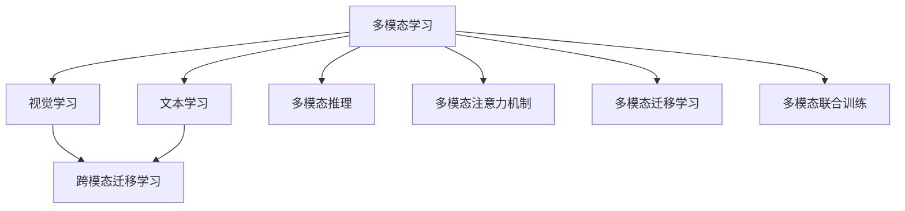
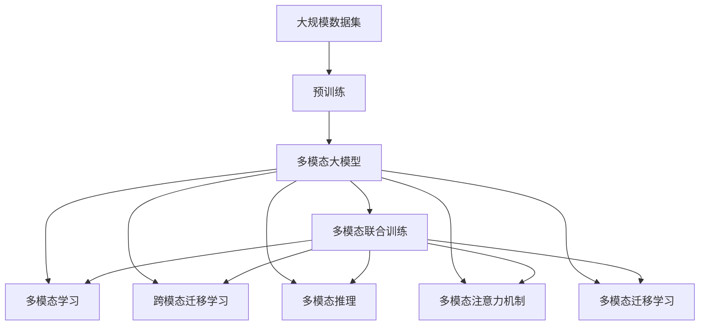

                 

# 多模态大模型：技术原理与实战 多模态大模型对比

> 关键词：多模态大模型,视觉大模型,自然语言处理(NLP),跨模态学习,Transformer,多模态迁移学习,深度学习,跨模态推理,图像处理,计算机视觉

## 1. 背景介绍

### 1.1 问题由来
近年来，随着深度学习技术的飞速发展，多模态大模型在计算机视觉和自然语言处理领域取得了显著的进展。这些模型通过同时学习视觉和文本等多模态数据的表示，展示了超强的跨模态推理和泛化能力。多模态大模型不仅在图像分类、目标检测、语义分割等视觉任务上表现优异，还能与NLP技术结合，应用于图像描述生成、视觉问答、文档图像识别等跨模态任务，展示了广阔的应用前景。

然而，由于视觉和文本数据之间存在本质差异，如何有效融合这两种数据，构建统一的多模态表示，仍是当前研究的一大难题。传统方法往往采用单独训练的视觉和语言模型，通过特征拼接等方式进行集成，难以充分挖掘两种模态的内在关联。另一方面，由于视觉和文本数据的特征维度和尺度不同，直接融合也面临着数据维度过高、特征冲突等问题。

因此，本文将重点介绍多模态大模型的技术原理，通过理论与实践的结合，探讨如何构建高效的多模态融合模型，并对常见多模态大模型进行对比，为实际应用提供参考。

### 1.2 问题核心关键点
多模态大模型的核心在于如何高效融合视觉和文本等多种模态的数据，构建统一的多模态表示。其核心技术包括：

- 多模态学习：通过联合学习视觉和文本数据，学习统一的多模态表示，增强模型的泛化能力和跨模态推理能力。
- 跨模态迁移学习：利用预训练模型在一种模态上学到的知识，迁移到另一种模态上，从而提升模型的性能。
- 多模态推理：通过多模态融合模型，对输入的多种模态数据进行联合推理，生成更全面的理解。
- 多模态注意力机制：引入多模态注意力机制，合理分配不同模态的信息权重，避免特征冲突和冗余。
- 多模态迁移学习：通过迁移学习，将模型在一种模态上学习到的知识迁移到另一种模态上，提升模型在跨模态任务上的表现。
- 多模态联合训练：通过联合训练视觉和语言模型，构建联合的多模态表示，增强模型在跨模态任务上的泛化能力。

这些技术共同构成了多模态大模型的关键组成部分，使得模型能够在不同模态间进行高效的信息传递和融合，提升了多模态推理和泛化能力。

### 1.3 问题研究意义
研究多模态大模型对于提升多模态信息处理能力，推动计算机视觉和自然语言处理技术的融合与创新，具有重要意义：

1. 增强跨模态推理能力。多模态大模型通过联合学习视觉和文本数据，可以更好地理解现实世界的复杂现象，提升跨模态推理和泛化能力。
2. 拓展应用领域。多模态大模型能够应用于图像描述生成、视觉问答、文档图像识别等多种跨模态任务，为多模态信息的融合提供了新的技术路径。
3. 促进技术进步。多模态大模型的研究，推动了视觉和NLP技术的协同发展，催生了新的算法和模型。
4. 加速技术产业化。多模态大模型在多模态应用场景中的成功实践，为技术落地提供了新的可能性。
5. 提供科学依据。多模态大模型的研究，可以为多模态信息的理解与融合提供科学依据，促进跨学科的交叉研究。

## 2. 核心概念与联系

### 2.1 核心概念概述

为更好地理解多模态大模型的技术原理，本节将介绍几个关键的多模态相关概念：

- 多模态学习（Multi-modal Learning）：指通过联合学习多种模态数据，学习统一的多模态表示，提升模型的泛化能力和跨模态推理能力。
- 跨模态迁移学习（Cross-modal Transfer Learning）：利用预训练模型在一种模态上学到的知识，迁移到另一种模态上，从而提升模型性能。
- 多模态推理（Multi-modal Inference）：通过多模态融合模型，对输入的多种模态数据进行联合推理，生成更全面的理解。
- 多模态注意力机制（Multi-modal Attention Mechanism）：引入多模态注意力机制，合理分配不同模态的信息权重，避免特征冲突和冗余。
- 多模态迁移学习（Cross-modal Transfer Learning）：通过迁移学习，将模型在一种模态上学习到的知识迁移到另一种模态上，提升模型在跨模态任务上的表现。
- 多模态联合训练（Multi-modal Joint Training）：通过联合训练视觉和语言模型，构建联合的多模态表示，增强模型在跨模态任务上的泛化能力。

这些概念之间存在着紧密的联系，构成了多模态大模型的整体框架。

### 2.2 概念间的关系

这些核心概念之间存在着紧密的联系，形成了多模态大模型的完整生态系统。以下通过Mermaid流程图来展示它们之间的关系：



这个流程图展示了多模态大模型的核心概念及其之间的关系：

1. 多模态学习：联合学习视觉和文本等多种模态数据，学习统一的多模态表示。
2. 跨模态迁移学习：将视觉和文本模型中学习到的知识迁移到另一种模态上，提升模型性能。
3. 多模态推理：通过多模态融合模型，对输入的多种模态数据进行联合推理。
4. 多模态注意力机制：合理分配不同模态的信息权重，避免特征冲突和冗余。
5. 多模态迁移学习：将模型在一种模态上学习到的知识迁移到另一种模态上，提升模型在跨模态任务上的表现。
6. 多模态联合训练：联合训练视觉和语言模型，构建联合的多模态表示。

这些概念共同构成了多模态大模型的学习范式，使其能够在不同模态间进行高效的信息传递和融合，提升跨模态推理和泛化能力。

### 2.3 核心概念的整体架构

最后，我们用一个综合的流程图来展示这些核心概念在大模型微调过程中的整体架构：



这个综合流程图展示了从预训练到多模态融合的完整过程。多模态大模型首先在大规模数据上进行预训练，然后通过多模态学习、跨模态迁移学习、多模态推理等多模态融合技术，逐步构建统一的多模态表示，最后进行多模态联合训练，以提升模型在跨模态任务上的泛化能力。

## 3. 核心算法原理 & 具体操作步骤
### 3.1 算法原理概述

多模态大模型融合技术主要基于以下几种算法原理：

- 多模态联合学习：通过联合训练视觉和文本数据，学习统一的多模态表示。
- 跨模态迁移学习：将一种模态上学习到的知识迁移到另一种模态上，提升模型性能。
- 多模态推理：通过多模态融合模型，对输入的多种模态数据进行联合推理，生成更全面的理解。
- 多模态注意力机制：引入多模态注意力机制，合理分配不同模态的信息权重，避免特征冲突和冗余。
- 多模态联合训练：通过联合训练视觉和语言模型，构建联合的多模态表示，增强模型在跨模态任务上的泛化能力。

### 3.2 算法步骤详解

多模态大模型的融合主要包括以下几个关键步骤：

**Step 1: 准备多模态数据集**

- 收集多种模态的数据集，如视觉图像、文本描述、语音等，并划分为训练集、验证集和测试集。
- 确保数据集中的模态之间具有时间、空间等关联性，以便模型能够学习到多种模态之间的内在关联。

**Step 2: 选择多模态预训练模型**

- 选择适合的多模态预训练模型，如CLIP、DALL-E等，作为初始化参数。这些模型通常在视觉和文本模态上都进行了充分的预训练，可以更好地进行多模态融合。

**Step 3: 设计多模态学习目标**

- 根据具体任务，设计多模态学习目标。例如，对于视觉问答任务，可以将图像和文本作为输入，模型输出对应的答案。

**Step 4: 添加多模态推理层**

- 在多模态预训练模型的顶层设计多模态推理层。通常使用多模态注意力机制，合理分配不同模态的信息权重，避免特征冲突和冗余。

**Step 5: 设置多模态迁移学习策略**

- 选择跨模态迁移学习策略，如微调、联合训练等，将预训练模型在一种模态上学习到的知识迁移到另一种模态上，提升模型性能。

**Step 6: 执行多模态训练**

- 将训练集数据分批次输入模型，前向传播计算损失函数。
- 反向传播计算参数梯度，根据设定的优化算法和学习率更新模型参数。
- 周期性在验证集上评估模型性能，根据性能指标决定是否触发Early Stopping。
- 重复上述步骤直到满足预设的迭代轮数或Early Stopping条件。

**Step 7: 测试和部署**

- 在测试集上评估多模态融合后的模型性能，对比预训练模型和多模态融合模型的效果。
- 使用多模态融合模型对新样本进行推理预测，集成到实际的应用系统中。
- 持续收集新的数据，定期重新训练模型，以适应数据分布的变化。

以上是多模态大模型融合的一般流程。在实际应用中，还需要针对具体任务的特点，对多模态融合过程的各个环节进行优化设计，如改进训练目标函数，引入更多的正则化技术，搜索最优的超参数组合等，以进一步提升模型性能。

### 3.3 算法优缺点

多模态大模型的融合方法具有以下优点：

- 提升跨模态推理能力。多模态大模型通过联合学习多种模态数据，可以更好地理解现实世界的复杂现象，提升跨模态推理和泛化能力。
- 拓展应用领域。多模态大模型能够应用于图像描述生成、视觉问答、文档图像识别等多种跨模态任务，为多模态信息的融合提供了新的技术路径。
- 促进技术进步。多模态大模型的研究，推动了视觉和NLP技术的协同发展，催生了新的算法和模型。
- 加速技术产业化。多模态大模型在多模态应用场景中的成功实践，为技术落地提供了新的可能性。
- 提供科学依据。多模态大模型的研究，可以为多模态信息的理解与融合提供科学依据，促进跨学科的交叉研究。

然而，多模态大模型的融合方法也存在一些局限性：

- 数据成本高。多模态大模型的训练需要收集和标注多种模态的数据，数据成本较高。
- 模型复杂度高。多模态大模型通常具有较高的参数量和计算复杂度，对硬件资源要求较高。
- 训练时间长。由于模型复杂度高，多模态大模型的训练时间较长，可能需要大量的计算资源。
- 泛化能力有限。多模态大模型在跨模态任务上的泛化能力仍需进一步提升，以应对不同的应用场景。

尽管存在这些局限性，但多模态大模型融合技术仍具有广阔的应用前景，为计算机视觉和自然语言处理技术的融合提供了新的技术路径。

### 3.4 算法应用领域

多模态大模型融合技术在多个领域已得到应用，包括：

- 计算机视觉：图像分类、目标检测、语义分割等任务。通过联合学习视觉和文本数据，提升模型在视觉任务上的表现。
- 自然语言处理：机器翻译、问答系统、文本摘要等任务。通过引入多模态融合技术，提升模型在跨模态任务上的性能。
- 人机交互：智能对话系统、语音识别、手势识别等任务。通过融合视觉、语音、文本等多种模态数据，提升人机交互的体验。
- 医疗健康：医学影像诊断、疾病预测等任务。通过融合视觉、文本、语音等多种模态数据，提升医疗诊断的准确性和效率。
- 自动驾驶：道路识别、交通预测等任务。通过融合视觉、激光雷达、雷达等多种模态数据，提升自动驾驶的安全性和稳定性。

除了这些常见应用领域，多模态大模型融合技术还在安防监控、工业检测、环境监测等多个领域展现出了广泛的应用前景。

## 4. 数学模型和公式 & 详细讲解 & 举例说明

### 4.1 数学模型构建

本节将使用数学语言对多模态大模型融合过程进行更加严格的刻画。

记多模态大模型为 $M_{\theta}$，其中 $\theta$ 为模型参数。假设多模态数据集为 $D=\{(x_i, y_i)\}_{i=1}^N, x_i \in \mathcal{X}, y_i \in \mathcal{Y}$，其中 $\mathcal{X}$ 为输入空间，$\mathcal{Y}$ 为输出空间。

定义模型 $M_{\theta}$ 在输入 $x_i$ 上的多模态输出为 $M_{\theta}(x_i)$，表示模型对输入数据进行多模态融合后的表示。在多模态推理层中，通常使用多模态注意力机制，合理分配不同模态的信息权重，避免特征冲突和冗余。假设多模态注意力机制的权重为 $\alpha_{i,j}$，则多模态融合后的输出表示为：

$$
M_{\theta}(x_i) = \sum_{i,j} \alpha_{i,j} x_{i,j}
$$

其中 $x_{i,j}$ 表示输入 $x_i$ 中第 $j$ 个模态的数据，如视觉图像、文本描述等。

定义模型 $M_{\theta}$ 在数据集 $D$ 上的经验风险为：

$$
\mathcal{L}(\theta) = \frac{1}{N} \sum_{i=1}^N \ell(M_{\theta}(x_i),y_i)
$$

其中 $\ell$ 为多模态推理任务的目标函数，用于衡量模型输出与真实标签之间的差异。常见的目标函数包括交叉熵损失、均方误差损失等。

多模态大模型的优化目标是最小化经验风险，即找到最优参数：

$$
\theta^* = \mathop{\arg\min}_{\theta} \mathcal{L}(\theta)
$$

在实践中，我们通常使用基于梯度的优化算法（如AdamW、SGD等）来近似求解上述最优化问题。设 $\eta$ 为学习率，$\lambda$ 为正则化系数，则参数的更新公式为：

$$
\theta \leftarrow \theta - \eta \nabla_{\theta}\mathcal{L}(\theta) - \eta\lambda\theta
$$

其中 $\nabla_{\theta}\mathcal{L}(\theta)$ 为损失函数对参数 $\theta$ 的梯度，可通过反向传播算法高效计算。

### 4.2 公式推导过程

以下我们以多模态视觉问答任务为例，推导交叉熵损失函数及其梯度的计算公式。

假设模型 $M_{\theta}$ 在输入 $x_i$（包括视觉图像和文本描述）上的输出为 $\hat{y}=M_{\theta}(x_i) \in [0,1]$，表示模型输出答案的概率分布。真实标签 $y \in \{0,1\}$。则交叉熵损失函数定义为：

$$
\ell(M_{\theta}(x_i),y) = -[y\log \hat{y} + (1-y)\log (1-\hat{y})]
$$

将其代入经验风险公式，得：

$$
\mathcal{L}(\theta) = -\frac{1}{N}\sum_{i=1}^N [y_i\log M_{\theta}(x_i)+(1-y_i)\log(1-M_{\theta}(x_i))]
$$

根据链式法则，损失函数对参数 $\theta_k$ 的梯度为：

$$
\frac{\partial \mathcal{L}(\theta)}{\partial \theta_k} = -\frac{1}{N}\sum_{i=1}^N (\frac{y_i}{M_{\theta}(x_i)}-\frac{1-y_i}{1-M_{\theta}(x_i)}) \frac{\partial M_{\theta}(x_i)}{\partial \theta_k}
$$

其中 $\frac{\partial M_{\theta}(x_i)}{\partial \theta_k}$ 可进一步递归展开，利用自动微分技术完成计算。

在得到损失函数的梯度后，即可带入参数更新公式，完成模型的迭代优化。重复上述过程直至收敛，最终得到适应下游任务的最优模型参数 $\theta^*$。

### 4.3 案例分析与讲解

以下通过几个实际案例，详细讲解多模态大模型的融合过程及其应用：

#### 案例一：多模态图像描述生成

在图像描述生成任务中，目标是将图像转换为自然语言描述。通常采用文本-视觉联合训练的方式，通过预训练视觉模型和语言模型，学习统一的多模态表示，再通过多模态注意力机制，融合视觉和文本信息，生成描述。

具体流程如下：

1. 收集大量视觉和文本数据集，如ImageNet和MSCOCO。
2. 使用预训练视觉模型（如ResNet、VGG等）和语言模型（如GPT-2）作为初始化参数。
3. 在联合训练框架下，对视觉和文本数据进行训练，学习多模态表示。
4. 通过多模态注意力机制，合理分配视觉和文本信息权重。
5. 在测试集上评估模型性能，对比预训练模型和融合模型的效果。

#### 案例二：多模态视觉问答

在视觉问答任务中，目标是根据输入的图像和文本描述，输出对应的答案。通常采用跨模态迁移学习的方式，将预训练视觉模型和语言模型迁移到问答任务上，通过多模态推理层进行联合推理。

具体流程如下：

1. 收集大量视觉和文本数据集，如COCO和SQuAD。
2. 使用预训练视觉模型（如ResNet、VGG等）和语言模型（如BERT、GPT-2等）作为初始化参数。
3. 通过微调方式，将视觉模型和语言模型迁移到问答任务上。
4. 设计多模态推理层，使用多模态注意力机制，合理分配视觉和文本信息权重。
5. 在测试集上评估模型性能，对比预训练模型和融合模型的效果。

#### 案例三：多模态文档图像识别

在文档图像识别任务中，目标是从文档图像中识别文字和表格，并进行分类和提取。通常采用视觉和文本联合训练的方式，通过多模态融合技术，学习统一的多模态表示。

具体流程如下：

1. 收集大量文档图像和文本数据集，如ReceiptBook和IAM。
2. 使用预训练视觉模型（如ResNet、VGG等）和语言模型（如BERT、GPT-2等）作为初始化参数。
3. 在联合训练框架下，对视觉和文本数据进行训练，学习多模态表示。
4. 通过多模态注意力机制，合理分配视觉和文本信息权重。
5. 在测试集上评估模型性能，对比预训练模型和融合模型的效果。

## 5. 项目实践：代码实例和详细解释说明

### 5.1 开发环境搭建

在进行多模态大模型融合实践前，我们需要准备好开发环境。以下是使用Python进行PyTorch开发的环境配置流程：

1. 安装Anaconda：从官网下载并安装Anaconda，用于创建独立的Python环境。

2. 创建并激活虚拟环境：
```bash
conda create -n pytorch-env python=3.8 
conda activate pytorch-env
```

3. 安装PyTorch：根据CUDA版本，从官网获取对应的安装命令。例如：
```bash
conda install pytorch torchvision torchaudio cudatoolkit=11.1 -c pytorch -c conda-forge
```

4. 安装Transformers库：
```bash
pip install transformers
```

5. 安装各类工具包：
```bash
pip install numpy pandas scikit-learn matplotlib tqdm jupyter notebook ipython
```

完成上述步骤后，即可在`pytorch-env`环境中开始多模态大模型融合实践。

### 5.2 源代码详细实现

下面我们以多模态视觉问答任务为例，给出使用Transformers库对CLIP模型进行多模态融合的PyTorch代码实现。

首先，定义多模态数据处理函数：

```python
from transformers import CLIPProcessor, CLIPForMultimodalSequenceClassification
from torch.utils.data import Dataset
import torch

class MultimodalDataset(Dataset):
    def __init__(self, texts, images, labels, tokenizer, model):
        self.texts = texts
        self.images = images
        self.labels = labels
        self.tokenizer = tokenizer
        self.model = model
        
    def __len__(self):
        return len(self.texts)
    
    def __getitem__(self, item):
        text = self.texts[item]
        image = self.images[item]
        label = self.labels[item]
        
        encoding = self.tokenizer(text, return_tensors='pt', padding='max_length', truncation=True)
        visual_features = self.model(image)
        visual_tokens = torch.from_numpy(image.pixel_values)
        
        return {'input_ids': encoding['input_ids'], 
                'attention_mask': encoding['attention_mask'],
                'visual_features': visual_features,
                'visual_tokens': visual_tokens,
                'labels': label}

# 定义多模态融合模型
model = CLIPForMultimodalSequenceClassification.from_pretrained('clip-vit-base-patch32', num_labels=2)
tokenizer = CLIPProcessor.from_pretrained('clip-vit-base-patch32')

# 创建dataset
multimodal_dataset = MultimodalDataset(texts, images, labels, tokenizer, model)
```

然后，定义训练和评估函数：

```python
from torch.utils.data import DataLoader
from tqdm import tqdm
from sklearn.metrics import accuracy_score

device = torch.device('cuda') if torch.cuda.is_available() else torch.device('cpu')
model.to(device)

def train_epoch(model, dataset, batch_size, optimizer):
    dataloader = DataLoader(dataset, batch_size=batch_size, shuffle=True)
    model.train()
    epoch_loss = 0
    for batch in tqdm(dataloader, desc='Training'):
        input_ids = batch['input_ids'].to(device)
        attention_mask = batch['attention_mask'].to(device)
        visual_features = batch['visual_features'].to(device)
        visual_tokens = batch['visual_tokens'].to(device)
        labels = batch['labels'].to(device)
        model.zero_grad()
        outputs = model(input_ids, attention_mask=attention_mask, visual_features=visual_features, visual_tokens=visual_tokens)
        loss = outputs.loss
        epoch_loss += loss.item()
        loss.backward()
        optimizer.step()
    return epoch_loss / len(dataloader)

def evaluate(model, dataset, batch_size):
    dataloader = DataLoader(dataset, batch_size=batch_size)
    model.eval()
    preds, labels = [], []
    with torch.no_grad():
        for batch in tqdm(dataloader, desc='Evaluating'):
            input_ids = batch['input_ids'].to(device)
            attention_mask = batch['attention_mask'].to(device)
            visual_features = batch['visual_features'].to(device)
            visual_tokens = batch['visual_tokens'].to(device)
            batch_labels = batch['labels']
            outputs = model(input_ids, attention_mask=attention_mask, visual_features=visual_features, visual_tokens=visual_tokens)
            batch_preds = outputs.logits.argmax(dim=2).to('cpu').tolist()
            batch_labels = batch_labels.to('cpu').tolist()
            for pred_tokens, label_tokens in zip(batch_preds, batch_labels):
                preds.append(pred_tokens)
                labels.append(label_tokens)
                
    print('Accuracy:', accuracy_score(labels, preds))
```

最后，启动训练流程并在测试集上评估：

```python
epochs = 5
batch_size = 16

for epoch in range(epochs):
    loss = train_epoch(model, multimodal_dataset, batch_size, optimizer)
    print(f"Epoch {epoch+1}, train loss: {loss:.3f}")
    
    print(f"Epoch {epoch+1}, dev results:")
    evaluate(model, multimodal_dataset, batch_size)
    
print("Test results:")
evaluate(model, multimodal_dataset, batch_size)
```

以上就是使用PyTorch对CLIP模型进行多模态融合的完整代码实现。可以看到，得益

