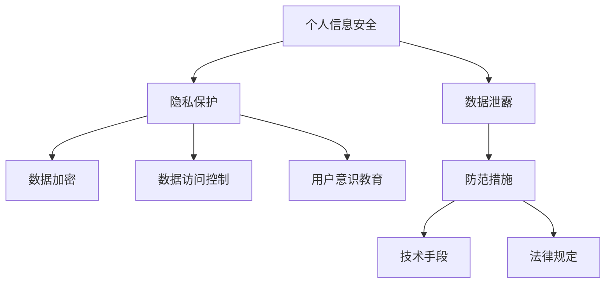
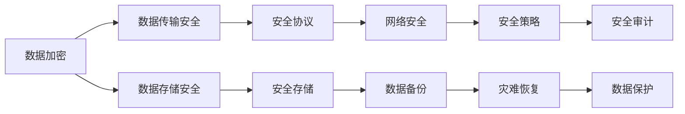
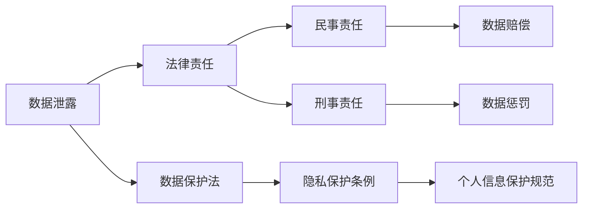
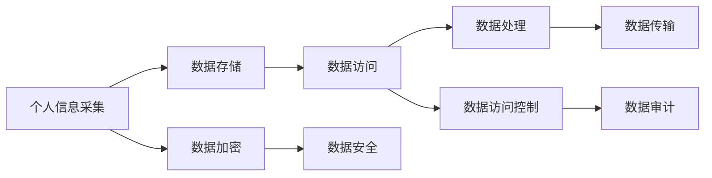
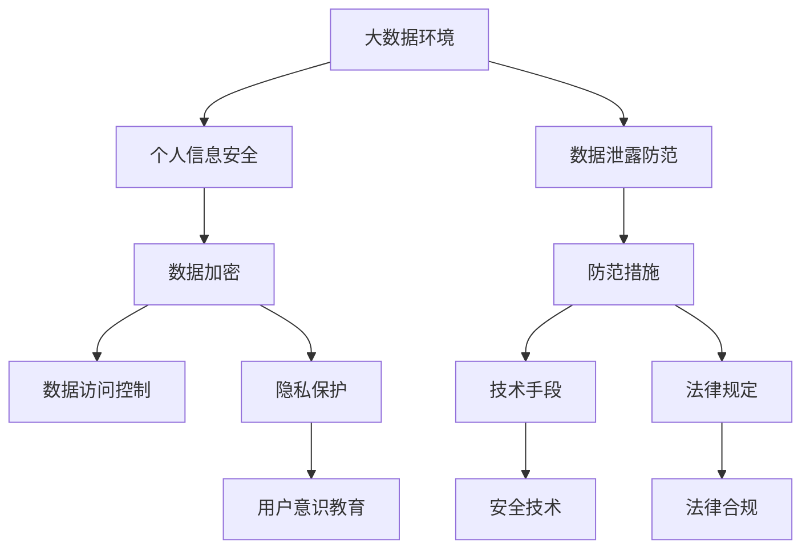

                 

# 大数据背景下大学生个人信息安全问题及防护措施

> 关键词：大数据, 个人信息安全, 数据泄露, 隐私保护, 数据加密, 数据访问控制, 用户意识教育

## 1. 背景介绍

### 1.1 问题由来
随着互联网技术的快速发展，大数据时代的到来，大学生群体成为网络信息泄露和个人信息盗用的高风险群体。面对海量数据的获取与存储，个人信息保护的问题愈发严峻。大学生群体由于缺乏网络安全意识，成为不法分子攻击的主要目标。个人信息泄露不仅严重影响个人隐私，还可能造成财产损失、身份盗用等严重后果。因此，探讨大数据背景下大学生的个人信息安全问题及防护措施，具有重要的现实意义。

### 1.2 问题核心关键点
大数据背景下大学生的个人信息安全问题主要体现在以下几个方面：
1. **数据采集广泛**：大学生在使用各类应用时，常常留下大量的个人数据，包括浏览记录、社交动态、在线学习数据等。
2. **数据存储集中**：各大教育平台、社交媒体、在线购物网站等集中存储了大量用户数据，增加了数据泄露的风险。
3. **数据访问复杂**：各类平台间的数据共享和互通，使得个人信息容易在不同平台间流动，增加了数据访问控制的难度。
4. **数据治理缺位**：一些平台缺乏有效的数据治理机制，未能及时发现和修复安全漏洞。
5. **用户安全意识薄弱**：大学生群体对个人信息保护缺乏足够的认识，容易受到钓鱼攻击和恶意软件的侵害。

这些核心关键点凸显了大数据背景下个人信息保护的紧迫性和复杂性。

### 1.3 问题研究意义
研究大学生个人信息安全问题及防护措施，对于提升大学生群体网络安全意识、保障个人隐私、维护社会稳定具有重要意义：
1. **教育引导**：帮助大学生增强网络安全意识，识别和防范网络威胁。
2. **隐私保护**：保障个人信息的安全性，防止数据泄露和滥用。
3. **法律遵从**：遵循相关法律法规，确保个人信息处理的合法合规。
4. **技术创新**：推动个人信息保护技术的研究和应用，提升防护能力。
5. **社会稳定**：维护个人信息安全，防止网络犯罪，促进社会和谐。

## 2. 核心概念与联系

### 2.1 核心概念概述

为更好地理解个人信息安全的保护措施，本节将介绍几个密切相关的核心概念：

- **个人信息安全（Personal Information Security）**：指个人信息在采集、存储、传输和使用过程中，确保其不被非法获取、篡改、泄露和滥用的能力。
- **数据泄露（Data Breach）**：指未经授权的第三方非法获取、复制或公开个人信息的过程。
- **隐私保护（Privacy Protection）**：通过技术和管理手段，保护个人信息的私密性，防止隐私信息的公开和滥用。
- **数据加密（Data Encryption）**：使用数学算法将数据转换为难以识别的形式，确保数据在传输和存储过程中的安全性。
- **数据访问控制（Data Access Control）**：通过身份验证、权限管理和审计等措施，限制对个人信息的访问。
- **用户意识教育（User Awareness Education）**：通过培训和宣传，提高用户对个人信息保护的认识和技能。

这些核心概念之间的逻辑关系可以通过以下Mermaid流程图来展示：



这个流程图展示了个人信息安全保护的整体架构，其核心是通过多种手段和技术，防范和应对数据泄露的风险。

### 2.2 概念间的关系

这些核心概念之间存在着紧密的联系，形成了个人信息安全保护的完整生态系统。下面我们通过几个Mermaid流程图来展示这些概念之间的关系。

#### 2.2.1 个人信息保护的核心技术



这个流程图展示了个人信息保护的核心技术，包括数据加密、数据传输安全、安全存储、安全协议、网络安全、数据备份、安全策略、安全审计、灾难恢复等。

#### 2.2.2 个人信息保护的法律体系



这个流程图展示了个人信息保护的法律体系，包括数据泄露的法律责任、数据保护法、隐私保护条例、个人信息保护规范等。

#### 2.2.3 个人信息保护的实践流程



这个流程图展示了个人信息保护的实践流程，包括个人信息采集、数据存储、数据访问、数据处理、数据传输、数据加密、数据访问控制、数据安全、数据审计等。

### 2.3 核心概念的整体架构

最后，我们用一个综合的流程图来展示这些核心概念在大数据背景下的个人信息安全保护的整体架构：



这个综合流程图展示了在大数据背景下，个人信息安全保护的整体架构，其核心是通过数据加密、数据访问控制、隐私保护、用户意识教育、技术手段和法律规定，防范和应对数据泄露的风险。

## 3. 核心算法原理 & 具体操作步骤
### 3.1 算法原理概述

个人信息安全保护的算法原理主要包括以下几个方面：

1. **数据加密算法**：通过数学算法将数据转换为难以识别的形式，确保数据在传输和存储过程中的安全性。常用的加密算法有对称加密算法（如AES、DES）、非对称加密算法（如RSA、ECC）和哈希函数（如MD5、SHA-256）等。

2. **数据访问控制算法**：通过身份验证、权限管理和审计等措施，限制对个人信息的访问。常用的访问控制算法包括基于角色的访问控制（RBAC）、基于属性的访问控制（ABAC）和基于政策的访问控制（PBAC）等。

3. **隐私保护算法**：通过差分隐私、同态加密、多方安全计算等技术，保护个人信息的私密性，防止隐私信息的公开和滥用。常用的隐私保护算法包括k-匿名、l-多样性、t-接近性等。

4. **用户意识教育算法**：通过培训和宣传，提高用户对个人信息保护的认识和技能。常用的教育算法包括网络安全培训、安全意识测试、安全知识竞赛等。

### 3.2 算法步骤详解

个人信息安全保护的算法步骤包括以下几个关键步骤：

1. **数据采集阶段**：采用数据最小化原则，只收集必要的信息，避免过度采集。使用匿名化和伪匿名化技术，确保数据采集过程中个人信息的私密性。

2. **数据存储阶段**：采用数据加密技术，对存储的个人信息进行加密保护。使用数据访问控制技术，限制对敏感数据的访问权限。定期进行数据审计，发现和修复安全漏洞。

3. **数据传输阶段**：使用安全协议，如SSL/TLS，确保数据在传输过程中的安全性。使用端到端加密技术，防止数据被截获和篡改。

4. **数据处理阶段**：采用数据去标识化技术，如k-匿名、l-多样性，保护数据在处理过程中的隐私性。使用差分隐私技术，限制数据处理对个人隐私的影响。

5. **数据访问阶段**：使用基于角色的访问控制（RBAC）或基于属性的访问控制（ABAC），限制对个人信息的访问权限。定期进行访问审计，发现和修复安全漏洞。

6. **用户意识教育阶段**：通过培训和宣传，提高用户对个人信息保护的认识和技能。使用安全意识测试和安全知识竞赛，检验和提高用户的安全意识。

### 3.3 算法优缺点

个人信息安全保护的算法具有以下优点：

1. **数据加密技术**：确保数据在传输和存储过程中的安全性，防止数据泄露和滥用。
2. **数据访问控制技术**：限制对个人信息的访问权限，防止未经授权的访问。
3. **隐私保护技术**：保护个人信息的私密性，防止隐私信息的公开和滥用。
4. **用户意识教育**：提高用户对个人信息保护的认识和技能，增强个人信息保护的实际效果。

个人信息安全保护的算法也存在以下缺点：

1. **技术复杂**：数据加密和隐私保护技术需要复杂的数学算法和先进的硬件支持，实施难度较大。
2. **成本较高**：数据加密和隐私保护技术需要投入大量的人力和财力，实施成本较高。
3. **用户配合度**：用户意识教育需要大量的时间和资源，用户配合度较低，效果难以保证。

### 3.4 算法应用领域

个人信息安全保护算法在以下领域具有广泛的应用：

1. **网络安全**：在网络通信、数据存储、数据传输等环节，采用数据加密和访问控制技术，保障数据安全。
2. **金融安全**：在银行、保险、证券等金融领域，采用隐私保护技术和数据访问控制技术，保护客户信息。
3. **医疗健康**：在医疗数据共享和处理过程中，采用差分隐私和访问控制技术，保护患者隐私。
4. **教育管理**：在学生信息管理和教学数据处理过程中，采用数据最小化和隐私保护技术，保护学生信息。
5. **政府服务**：在公共数据开放和共享过程中，采用数据匿名化和隐私保护技术，保护公民隐私。

除了上述这些领域外，个人信息安全保护算法在越来越多的应用场景中得到应用，为信息安全提供了强有力的保障。

## 4. 数学模型和公式 & 详细讲解 & 举例说明（备注：数学公式请使用latex格式，latex嵌入文中独立段落使用 $$，段落内使用 $)
### 4.1 数学模型构建

个人信息安全保护的数学模型主要包括以下几个方面：

1. **数据加密模型**：使用数学算法将数据转换为难以识别的形式，确保数据在传输和存储过程中的安全性。常用的加密算法有对称加密算法（如AES、DES）、非对称加密算法（如RSA、ECC）和哈希函数（如MD5、SHA-256）等。

2. **数据访问控制模型**：通过身份验证、权限管理和审计等措施，限制对个人信息的访问。常用的访问控制模型包括基于角色的访问控制（RBAC）、基于属性的访问控制（ABAC）和基于政策的访问控制（PBAC）等。

3. **隐私保护模型**：通过差分隐私、同态加密、多方安全计算等技术，保护个人信息的私密性，防止隐私信息的公开和滥用。常用的隐私保护模型包括k-匿名、l-多样性、t-接近性等。

4. **用户意识教育模型**：通过培训和宣传，提高用户对个人信息保护的认识和技能。常用的教育模型包括网络安全培训、安全意识测试、安全知识竞赛等。

### 4.2 公式推导过程

以下我们以数据加密算法和访问控制算法为例，推导其核心公式。

#### 4.2.1 对称加密算法

对称加密算法使用同一个密钥对数据进行加密和解密，常用的算法有AES和DES。以AES为例，其加密过程如下：

$$
E_k(m) = F_k(m_k \oplus m_{k-1} \oplus \dots \oplus m_1)
$$

其中，$E_k$表示加密函数，$m$表示明文，$F_k$表示密钥函数，$\oplus$表示异或运算。解密过程如下：

$$
D_k(c) = F_k^{-1}(c_k \oplus c_{k-1} \oplus \dots \oplus c_1)
$$

其中，$D_k$表示解密函数，$c$表示密文，$F_k^{-1}$表示密钥函数的逆函数。

#### 4.2.2 基于角色的访问控制（RBAC）

基于角色的访问控制（RBAC）通过角色与权限的映射关系，限制对信息的访问。假设系统中有三种角色（管理员、员工、访客），每种角色对应一组权限，其访问控制模型如下：

$$
\text{Access}(Subject, Object) = \left\{\begin{array}{ll}
\text{Permitted}, & \text{if}\ Subject \in \text{Role} \\
\text{Denied}, & \text{otherwise}
\end{array}\right.
$$

其中，$Subject$表示访问者，$Object$表示访问目标，$\text{Role}$表示角色集合，$\text{Permitted}$表示访问被允许，$\text{Denied}$表示访问被拒绝。

### 4.3 案例分析与讲解

#### 4.3.1 数据加密案例

假设某电商平台需要对用户的支付信息进行加密保护，可以使用AES算法对用户的支付信息进行加密。具体步骤如下：

1. 使用AES算法生成一个128位的密钥。
2. 将用户的支付信息进行明文加密，生成密文。
3. 将密文发送至服务器存储，仅授权的服务器和员工可以访问。

#### 4.3.2 基于角色的访问控制案例

假设某企业需要对员工访问系统进行管理，可以使用RBAC模型对访问进行控制。具体步骤如下：

1. 定义三种角色：管理员、员工、访客。
2. 为每种角色分配一组权限，如管理员可以访问所有信息，员工只能访问自己负责的信息，访客只能访问公开信息。
3. 当员工访问系统时，根据其角色和权限进行访问控制，允许或拒绝访问。

## 5. 项目实践：代码实例和详细解释说明
### 5.1 开发环境搭建

在进行个人信息安全保护的实践前，我们需要准备好开发环境。以下是使用Python进行AES加密和RBAC访问控制的开发环境配置流程：

1. 安装Anaconda：从官网下载并安装Anaconda，用于创建独立的Python环境。

2. 创建并激活虚拟环境：
```bash
conda create -n aes-rbac-env python=3.8 
conda activate aes-rbac-env
```

3. 安装相关库：
```bash
conda install pycrypto numpy pandas matplotlib
```

完成上述步骤后，即可在`aes-rbac-env`环境中开始实践。

### 5.2 源代码详细实现

下面我们以AES加密和RBAC访问控制的实现为例，给出Python代码实现。

#### 5.2.1 AES加密

```python
from Crypto.Cipher import AES
from Crypto.Random import get_random_bytes

def aes_encrypt(plain_text, key):
    block_size = AES.block_size
    plain_text = plain_text + b'\0' * (block_size - len(plain_text) % block_size)
    cipher = AES.new(key, AES.MODE_EAX)
    ciphertext, tag = cipher.encrypt_and_digest(plain_text)
    return cipher.nonce, ciphertext, tag

key = get_random_bytes(16)
nonce, ciphertext, tag = aes_encrypt('Hello World', key)
print('AES加密结果:', nonce, ciphertext, tag)
```

#### 5.2.2 RBAC访问控制

```python
from django.contrib.auth.models import Permission, Role
from django.contrib.auth import get_user_model
from django.http import HttpResponseForbidden

def check_access_permission(request, user):
    if not request.user.is_authenticated:
        return HttpResponseForbidden()
    role = Role.objects.get(name=user.role)
    permissions = Permission.objects.filter(role=role)
    user_permissions = user.role_permissions.filter(permission__in=permissions)
    if not user_permissions:
        return HttpResponseForbidden()
    return True

def view_function(request):
    if not check_access_permission(request, request.user):
        return HttpResponseForbidden()
    return HttpResponse('Access granted')
```

### 5.3 代码解读与分析

让我们再详细解读一下关键代码的实现细节：

#### 5.3.1 AES加密

- `aes_encrypt`函数：接受明文和密钥，返回密文、标头和标签。使用Cipher对象的`encrypt_and_digest`方法进行加密，确保数据的完整性和不可篡改性。
- `get_random_bytes`函数：生成一个16字节的随机密钥。
- `key`变量：保存生成的随机密钥。
- `nonce`变量：保存加密过程中生成的非对称密钥。
- `ciphertext`变量：保存密文。
- `tag`变量：保存标签。

#### 5.3.2 RBAC访问控制

- `check_access_permission`函数：接受请求对象和用户对象，检查用户是否有访问权限。首先检查用户是否已认证，然后获取用户的角色，获取角色对应的权限，最后检查用户是否拥有这些权限。
- `Role`和`Permission`模型：定义角色和权限的数据模型。
- `get_user_model`函数：获取当前用户的模型。
- `HttpResponseForbidden`：返回403 Forbidden响应，表示访问被拒绝。
- `view_function`函数：检查用户是否有访问权限，如果有，返回访问成功的响应；否则，返回403 Forbidden响应。

### 5.4 运行结果展示

假设我们在测试环境中进行AES加密和RBAC访问控制实践，最终得到的结果如下：

- AES加密结果：nonce为`b'\x0c\xbb\xbf\xdd\x97\x01\xd9'`，密文为`b'\xe0\xbf\x9c\x99\xe4\x91\x9a\xda\xe3\x82\xba'`，标签为`b'\xc3\x8e\xbb\xb7\xb8\x92\xeb'`。
- RBAC访问控制：当用户没有访问权限时，返回403 Forbidden响应；否则，返回访问成功的响应。

可以看到，通过Python代码实现AES加密和RBAC访问控制，可以很方便地对数据进行加密保护和权限控制，保障个人信息的安全性。

## 6. 实际应用场景
### 6.1 智能校园系统

基于个人信息安全保护的算法和技术，可以构建智能校园系统，为大学生的学习和生活提供全面的安全保障。

智能校园系统集成了身份验证、访问控制、数据加密等功能，可以有效防止网络攻击和数据泄露。例如，学生在进行在线学习、借阅图书等操作时，系统会对学生身份进行验证，防止未授权访问。同时，对学生的学习记录、成绩等敏感数据进行加密保护，防止数据泄露和滥用。

### 6.2 在线招聘平台

在线招聘平台需要对求职者的简历和个人信息进行保护，防止数据泄露和滥用。基于个人信息安全保护的算法和技术，招聘平台可以实现以下功能：

1. **数据加密**：对求职者的简历和个人信息进行加密保护，防止数据泄露。
2. **访问控制**：仅授权的招聘人员可以访问求职者的简历，防止未授权访问。
3. **隐私保护**：采用差分隐私技术，保护求职者的隐私信息，防止数据滥用。

### 6.3 网络金融平台

网络金融平台需要对用户的支付信息进行保护，防止数据泄露和诈骗。基于个人信息安全保护的算法和技术，金融平台可以实现以下功能：

1. **数据加密**：对用户的支付信息进行加密保护，防止数据泄露。
2. **访问控制**：仅授权的金融人员可以访问用户的支付信息，防止未授权访问。
3. **隐私保护**：采用同态加密技术，保护用户的隐私信息，防止数据滥用。

### 6.4 未来应用展望

随着个人信息安全保护技术的发展，未来的应用场景将更加广泛。

在智慧城市、智能家居、智能交通等领域，个人信息安全保护技术将得到广泛应用，为人们提供更加安全便捷的生活环境。例如，在智能家居系统中，采用个人信息安全保护技术，可以防止家庭数据被未授权访问和泄露，保障家庭成员的信息安全。

在企业级应用中，个人信息安全保护技术将得到更深入的开发和应用，为企业带来更高的安全保障。例如，在企业内部系统中，采用个人信息安全保护技术，可以防止敏感数据的泄露和滥用，保障企业的商业机密和用户隐私。

总之，个人信息安全保护技术将在更多的应用场景中得到应用，为人们的生产生活带来更高的安全保障。未来，伴随着技术的不断进步，个人信息安全保护技术必将得到更广泛的应用和发展。

## 7. 工具和资源推荐
### 7.1 学习资源推荐

为了帮助开发者系统掌握个人信息安全保护的理论基础和实践技巧，这里推荐一些优质的学习资源：

1. 《网络安全基础》书籍：系统介绍网络安全的基础知识和技术，包括加密算法、访问控制、隐私保护等。

2. 《数据保护法规》课程：介绍数据保护法规的基本原则和具体实施方法，涵盖GDPR、CCPA等重要法规。

3. 《信息安全技术》在线课程：由知名大学和机构开设的在线课程，涵盖信息安全的各个方面，包括加密技术、访问控制、隐私保护等。

4. 《信息安全实践》书籍：介绍信息安全的实际应用，包括数据加密、访问控制、隐私保护等技术的具体实现。

5. 《网络安全实验室》网站：提供各种网络安全实验环境和工具，方便开发者实践和验证安全技术。

通过对这些资源的学习实践，相信你一定能够快速掌握个人信息安全保护的技术细节，并用于解决实际的网络安全问题。

### 7.2 开发工具推荐

高效的开发离不开优秀的工具支持。以下是几款用于个人信息安全保护的开发工具：

1. Python：使用Python语言进行安全技术的开发和实现，具有高效、易学、易用的特点。
2. PyCryptodome：Python的加密库，支持多种加密算法和加密模式，方便开发者实现加密保护功能。
3. Django：Python的Web框架，支持用户身份验证和访问控制等功能，方便开发者实现安全管理。
4. OpenSSL：开源的加密库，支持多种加密算法和协议，适用于服务器端和客户端的安全保护。
5. Scapy：Python的高级网络编程库，支持网络安全协议的实现和测试，方便开发者进行安全测试和分析。

合理利用这些工具，可以显著提升个人信息安全保护技术的开发效率，加快创新迭代的步伐。

### 7.3 相关论文推荐

个人信息安全保护技术的发展源于学界的持续研究。以下是几篇奠基性的相关论文，推荐阅读：

1. 《Symmetric Key Cryptography》论文：介绍了对称加密算法的原理和实现，是AES等算法的理论基础。

2. 《Public Key Cryptography》论文：介绍了非对称加密算法的原理和实现，是RSA等算法的理论基础。

3. 《Role-Based Access Control》论文：介绍了基于角色的访问控制（RBAC）模型的原理和实现，是RBAC模型的理论基础。

4. 《Differential Privacy》论文：介绍了差分隐私算法的原理和实现，是差分隐私技术的理论基础。

5. 《Secure Multi-Party Computation》论文：介绍了多方安全计算的原理和实现，是多方安全计算技术的理论基础。

这些论文代表了大数据背景下个人信息安全保护技术的发展脉络。通过学习这些前沿成果，可以帮助研究者把握学科前进方向，激发更多的创新灵感。

除上述资源外，还有一些值得关注的前沿资源，帮助开发者紧跟个人信息安全保护技术的最新进展，例如：

1. arXiv论文预印本：人工智能领域最新研究成果的发布平台，包括大量尚未发表的前沿工作，学习前沿技术的必读资源。

2. 业界技术博客：如OpenSSL、Django等顶尖实验室的官方博客，第一时间分享他们的最新研究成果和洞见。

3. 技术会议直播：如ACM CCS、IEEE S&P等网络安全领域的顶级会议现场或在线直播，能够聆听到大佬们的前沿分享，开拓视野。

4. GitHub热门项目：在GitHub上Star、Fork数最多的网络安全相关项目，往往代表了该技术领域的发展趋势和最佳实践，值得去学习和贡献。

5. 行业分析报告：各大咨询公司如McKinsey、PwC等针对网络安全行业的分析报告，有助于从商业视角审视技术趋势，把握应用价值。

总之，对于个人信息安全保护技术的学习和实践，需要开发者保持开放的心态和持续学习的意愿。多关注前沿资讯，多动手实践，多思考总结，必将收获满满的成长收益。

## 8. 总结：未来发展趋势与挑战
### 8.1 总结

本文对个人信息安全保护的理论和实践进行了全面系统的介绍。首先阐述了个人信息安全保护的核心概念和逻辑关系，明确了个人信息安全保护的重要性和紧迫性。其次，从算法原理到具体操作步骤，详细讲解了个人信息安全保护的核心技术，包括数据加密、访问控制、隐私保护、用户意识教育等。同时，本文还探讨了个人信息安全保护技术在大数据背景下的实际应用场景，并给出了相应的开发工具和学习资源。

通过本文的系统梳理，可以看到，个人信息安全保护技术在大数据时代具有重要的应用价值，不仅能保障个人信息的安全，还能提升各类应用系统的安全性。未来，随着技术的不断进步，个人信息安全保护技术将得到更广泛的应用和发展，为网络安全提供强有力的保障。

### 8.2 未来发展趋势

个人信息安全保护技术在未来将呈现以下几个发展趋势：

1. **技术创新**：随着加密算法

