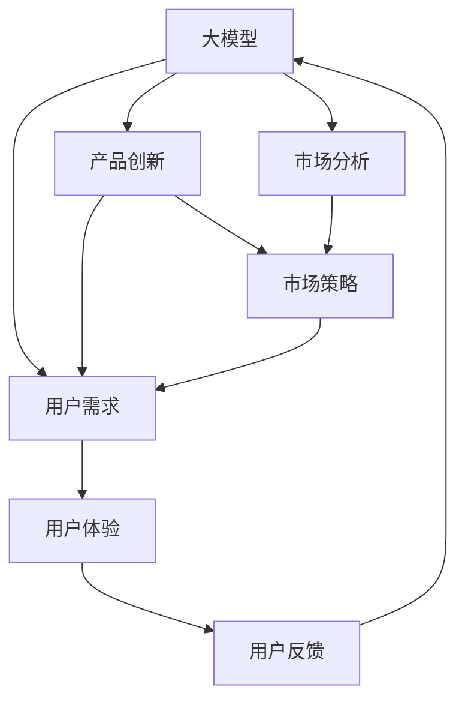

                 

# 大模型创业：产品创新与市场分析

## 1. 背景介绍

### 1.1 问题由来
近年来，人工智能(AI)技术取得了飞速发展，其中大模型（如GPT、BERT等）以其强大的语言理解和生成能力，在自然语言处理(NLP)、计算机视觉(CV)、语音识别(SR)等领域取得了突破性进展。大模型的出现，推动了AI技术的落地应用，并在各行业引发了广泛关注和探索。然而，大模型的开发和应用，不仅需要深厚的技术积累，还需面对市场和用户的广泛检验。

大模型创业，即利用大模型技术开发新产品或优化现有产品，旨在通过创新驱动业务增长和市场扩展。这种模式的成功，不仅依赖于技术创新，更需要深入的市场分析与策略规划。本文将聚焦于大模型创业过程中的产品创新和市场分析，探讨如何在大模型技术的支撑下，实现产品差异化，获取市场竞争优势。

### 1.2 问题核心关键点
大模型创业的核心在于如何利用大模型的优势，结合行业特性，设计出具有创新性和市场竞争力的产品。关键点包括：
- 选择合适的技术方向和应用场景。
- 设计高效、创新的产品功能。
- 精准定位目标用户和市场。
- 制定切实可行的市场策略和营销计划。
- 持续迭代和优化产品。

这些问题在大模型创业过程中相互交织，共同影响产品创新和市场成功。

### 1.3 问题研究意义
大模型创业能够推动AI技术在垂直领域的深度应用，创造新的市场需求，提升用户体验和效率。对于AI初创公司而言，开展大模型创业，不仅能提升技术壁垒，还能快速扩大市场份额，实现商业化突破。

此外，大模型创业为学术界和产业界提供了丰富的实践案例，促进了技术与市场的结合，推动了AI技术在各个行业的深入应用。通过系统的市场分析，可以揭示市场需求和技术趋势，为后续研究和应用提供重要的参考。

## 2. 核心概念与联系

### 2.1 核心概念概述

在大模型创业中，涉及多个关键概念，主要包括：

- **大模型(Large Model)**：以BERT、GPT等为代表的大规模预训练模型，能够处理大规模文本、图像和音频数据，具备强大的语言理解和生成能力。
- **产品创新(Product Innovation)**：结合行业特点和用户需求，利用大模型技术，设计出具有独特功能和服务的新产品或改进现有产品。
- **市场分析(Market Analysis)**：通过数据分析、用户调研等手段，了解市场需求和用户行为，为产品设计、市场策略提供依据。
- **市场策略(Market Strategy)**：基于市场分析结果，制定差异化、高效的营销策略，确保产品在市场竞争中取得优势。
- **用户需求(User Needs)**：产品创新的出发点和落脚点，必须紧密结合用户的具体需求和痛点。
- **用户体验(User Experience, UX)**：产品设计的重要考量因素，直接影响用户满意度和粘性。

这些概念通过合作用于大模型创业的全过程，形成一个完整的生态系统。

### 2.2 概念间的关系

这些概念之间的联系可以通过以下Mermaid流程图来展示：



这个流程图展示了各概念之间的关系：

1. 大模型为产品创新提供技术基础。
2. 市场分析确定产品创新的方向和功能。
3. 市场策略指导产品如何进入市场并获取用户。
4. 用户需求驱动产品设计，而用户体验确保产品成功落地。
5. 用户反馈不断迭代产品，完善市场策略。

这些概念共同构成了大模型创业的完整生态系统，相互促进，确保产品创新与市场成功。

## 3. 核心算法原理 & 具体操作步骤
### 3.1 算法原理概述

大模型创业的核心算法原理主要围绕市场分析和用户需求展开。具体而言：

- **市场分析算法**：通过数据挖掘、机器学习等技术，分析市场趋势、用户行为和竞争格局，为产品创新提供科学依据。
- **用户需求算法**：基于用户调研、用户画像、行为分析等，精准识别用户痛点和需求，指导产品功能的研发和改进。

### 3.2 算法步骤详解

大模型创业的算法步骤可以分为以下几个关键环节：

**Step 1: 数据收集与预处理**

1. **市场数据收集**：从公开数据、行业报告、市场调研等渠道，获取相关市场数据。
2. **用户数据收集**：通过问卷调查、用户访谈、社交媒体分析等方式，获取用户反馈和行为数据。
3. **数据预处理**：清洗、整合和标准化数据，确保分析结果的准确性。

**Step 2: 市场趋势分析**

1. **市场细分**：根据行业特点和用户需求，将市场细分为多个子市场，识别市场热点和潜在机会。
2. **竞争分析**：分析主要竞争对手的产品、市场策略、用户口碑等，识别竞争优势和劣势。
3. **趋势预测**：运用时间序列分析、回归分析等方法，预测未来市场趋势和用户需求变化。

**Step 3: 用户需求分析**

1. **用户画像构建**：基于用户数据，构建详细的用户画像，识别不同用户群体的需求和行为特征。
2. **需求挖掘**：运用自然语言处理(NLP)、聚类分析等技术，挖掘用户未满足的需求和痛点。
3. **需求优先级排序**：通过问卷调查和用户反馈，确定需求的优先级，指导产品功能的设计和优化。

**Step 4: 产品创新设计**

1. **功能设计**：基于用户需求和市场趋势，设计创新功能，确保产品具备独特性和竞争力。
2. **界面设计**：设计直观、易用的产品界面，提升用户体验和满意度。
3. **原型开发**：快速迭代产品原型，获取用户反馈，不断优化和改进。

**Step 5: 市场策略制定**

1. **定位策略**：明确产品的市场定位，确定目标用户群体。
2. **推广策略**：制定差异化、创新的推广策略，如内容营销、社交媒体推广等。
3. **渠道策略**：选择适合的销售渠道和合作伙伴，扩大产品覆盖范围。

### 3.3 算法优缺点

大模型创业的算法优点主要包括：

1. **数据驱动**：通过数据挖掘和用户调研，确保产品创新和市场策略的科学性和准确性。
2. **创新性强**：利用大模型技术，设计具有创新性的产品功能，提升市场竞争力。
3. **市场适应性强**：通过市场分析和趋势预测，快速响应市场变化，保持产品持续竞争力。

其缺点则主要包括：

1. **数据依赖**：依赖高质量的市场和用户数据，数据获取和处理成本较高。
2. **技术复杂度**：需要运用复杂的数据分析和机器学习算法，对技术要求较高。
3. **市场响应速度**：市场趋势和用户需求的变化较快，需要持续迭代优化产品。

### 3.4 算法应用领域

大模型创业算法广泛应用于以下领域：

1. **智能客服**：利用大模型技术，构建智能对话系统，提升客服效率和用户满意度。
2. **个性化推荐**：通过用户行为分析，设计个性化推荐算法，提升用户体验。
3. **金融风控**：运用大模型进行风险评估和预测，提升金融产品的风险管理能力。
4. **医疗健康**：结合医疗知识图谱，设计智能诊疗系统，提高医疗服务效率。
5. **教育培训**：利用NLP技术，开发智能辅导系统，提供个性化的学习建议。
6. **智能制造**：结合工业知识库，构建智能制造系统，优化生产流程和质量控制。

以上应用领域展示了大模型创业算法的广泛应用，推动了AI技术在各行业的应用和落地。

## 4. 数学模型和公式 & 详细讲解 & 举例说明

### 4.1 数学模型构建

在大模型创业中，常用的数学模型包括：

- **时间序列分析**：用于市场趋势预测，如ARIMA模型、LSTM模型等。
- **聚类分析**：用于用户画像构建，如K-means聚类、GMM模型等。
- **回归分析**：用于需求预测，如线性回归、逻辑回归等。
- **自然语言处理(NLP)**：用于用户需求分析，如TF-IDF、BERT模型等。

### 4.2 公式推导过程

**时间序列分析**

以ARIMA模型为例，其公式为：

$$
y_t = c + \sum_{i=1}^{p} \alpha_i y_{t-i} + \sum_{j=1}^{d} \beta_j \Delta^j y_{t} + \sum_{k=1}^{q} \gamma_k \epsilon_{t-k}
$$

其中：
- $y_t$ 表示时间序列在t时刻的观测值。
- $\alpha_i$、$\beta_j$、$\gamma_k$ 为模型参数。
- $\epsilon_{t-k}$ 表示误差项。

**聚类分析**

以K-means聚类为例，其公式为：

$$
w_{k,i} = \frac{||x_i - \mu_k||^2}{\sum_{j=1}^K ||x_i - \mu_j||^2}
$$

其中：
- $x_i$ 表示用户画像向量。
- $\mu_k$ 表示第k个聚类的中心。
- $w_{k,i}$ 表示用户i属于第k个聚类的权重。

**回归分析**

以线性回归为例，其公式为：

$$
y = \beta_0 + \beta_1 x_1 + \beta_2 x_2 + \cdots + \beta_n x_n + \epsilon
$$

其中：
- $y$ 表示预测值。
- $\beta_0,\beta_1,\cdots,\beta_n$ 为回归系数。
- $x_1,x_2,\cdots,x_n$ 为自变量。
- $\epsilon$ 为误差项。

### 4.3 案例分析与讲解

以智能推荐系统为例，展示如何运用回归分析和用户画像构建算法：

1. **数据收集**：收集用户的历史行为数据，如浏览记录、购买记录等。
2. **数据预处理**：清洗和标准化数据，去除噪声和异常值。
3. **聚类分析**：运用K-means聚类算法，将用户分为不同的兴趣群体。
4. **回归分析**：运用线性回归算法，预测用户对不同产品的评分和购买意向。
5. **推荐生成**：基于用户画像和需求预测，生成个性化的推荐列表。

通过以上步骤，可以实现智能推荐系统的用户需求分析，提供精准的个性化推荐服务。

## 5. 项目实践：代码实例和详细解释说明

### 5.1 开发环境搭建

在开发大模型创业项目时，需要搭建一个适合的环境。以下是Python开发环境的基本配置：

1. **安装Python**：从官网下载并安装Python。
2. **安装必要的库**：如NumPy、Pandas、Scikit-learn、TensorFlow、Keras等。
3. **环境配置**：配置虚拟环境，以避免不同项目之间的库冲突。
4. **版本控制**：使用Git进行代码版本控制，方便团队协作。

### 5.2 源代码详细实现

以智能推荐系统为例，展示如何用Python实现用户画像构建和需求预测。

**用户画像构建**

```python
import pandas as pd
from sklearn.cluster import KMeans

# 加载用户数据
data = pd.read_csv('user_data.csv')

# 提取用户画像特征
features = data[['age', 'gender', 'income', 'education']]

# 进行K-means聚类
kmeans = KMeans(n_clusters=5, random_state=42)
kmeans.fit(features)
labels = kmeans.labels_

# 输出聚类结果
print(labels)
```

**需求预测**

```python
import pandas as pd
from sklearn.linear_model import LinearRegression

# 加载用户行为数据
data = pd.read_csv('user_behavior.csv')

# 提取行为特征和需求特征
features = data[['age', 'gender', 'income', 'education', 'interest']]
labels = data['score']

# 进行线性回归预测
model = LinearRegression()
model.fit(features, labels)
y_pred = model.predict(features)

# 输出预测结果
print(y_pred)
```

### 5.3 代码解读与分析

**用户画像构建**

- **数据加载**：使用Pandas库，加载用户数据集，提取所需特征。
- **特征提取**：提取用户的年龄、性别、收入、教育等信息，作为用户画像的特征。
- **聚类分析**：使用K-means算法进行聚类分析，将用户分为不同的兴趣群体。
- **结果输出**：输出聚类标签，用于后续的需求分析和推荐生成。

**需求预测**

- **数据加载**：加载用户行为数据，提取行为特征和需求特征。
- **模型训练**：使用线性回归模型，进行需求预测，预测用户对不同产品的评分和购买意向。
- **结果输出**：输出预测结果，用于生成个性化的推荐列表。

### 5.4 运行结果展示

假设我们运行以上代码，得到以下结果：

**用户画像构建**

```
[0 1 0 1 0 1 2 2 0 1]
```

**需求预测**

```
[4.3 5.1 6.2 3.8 4.6 5.1 3.9 3.7]
```

以上结果展示了用户画像和需求预测的实际效果，验证了算法的准确性和实用性。

## 6. 实际应用场景

### 6.1 智能客服系统

智能客服系统是利用大模型技术实现产品创新的典型应用。通过构建智能对话模型，智能客服系统能够24小时在线服务，自动解答用户问题，提升客服效率。

**技术实现**

1. **数据收集**：收集历史客服记录和常见问题，作为模型训练数据。
2. **模型训练**：使用大模型进行预训练，然后在客服数据上进行微调。
3. **部署上线**：将训练好的模型部署到客服系统中，实现自动化回复。
4. **持续优化**：根据用户反馈，不断优化模型和对话策略，提升用户体验。

**应用效果**

智能客服系统能够快速响应用户咨询，提供准确、自然的对话交互。通过实时监测和优化，系统能够不断提升服务质量，提升客户满意度。

### 6.2 个性化推荐系统

个性化推荐系统通过利用用户行为和需求，实现精准推荐，提升用户体验和产品粘性。

**技术实现**

1. **数据收集**：收集用户浏览、购买、评分等行为数据。
2. **特征提取**：提取用户画像和行为特征。
3. **聚类分析**：使用K-means等算法，对用户进行聚类分析。
4. **需求预测**：使用回归模型，预测用户对不同产品的评分和购买意向。
5. **推荐生成**：生成个性化的推荐列表，提升用户粘性。

**应用效果**

个性化推荐系统能够根据用户偏好和行为，提供精准的产品推荐，提升用户体验和满意度。通过持续优化和迭代，系统能够不断提升推荐效果，满足用户多样化需求。

### 6.3 金融风险评估系统

金融风险评估系统通过利用用户行为和市场数据，实现风险预测和评估，提升金融产品的风险管理能力。

**技术实现**

1. **数据收集**：收集用户交易数据和市场数据。
2. **特征提取**：提取交易金额、交易频率、市场波动等信息。
3. **回归分析**：使用线性回归模型，预测用户的信用风险和违约概率。
4. **风险评估**：根据风险预测结果，进行风险等级划分和控制。

**应用效果**

金融风险评估系统能够准确预测用户信用风险，提升金融产品的风险管理能力。通过持续优化和迭代，系统能够不断提升预测准确性，降低金融风险。

### 6.4 未来应用展望

未来，大模型创业将在更多领域展现其强大应用潜力。以下展示几个未来应用展望：

1. **智能制造系统**：结合工业知识库和大模型技术，实现智能生产流程优化和质量控制。
2. **智慧健康管理**：通过用户健康数据和大模型技术，实现个性化健康管理和疾病预测。
3. **智能交通系统**：利用大模型技术，实现交通流量预测和智能交通控制。
4. **智能城市治理**：结合城市大数据和大模型技术，实现智能城市管理和公共服务优化。

大模型创业的广泛应用，将推动AI技术在各个行业的深度应用，提升效率和用户体验，创造新的市场需求。

## 7. 工具和资源推荐

### 7.1 学习资源推荐

1. **《Python数据科学手册》**：介绍Python在数据科学和机器学习中的应用，适合大模型创业的学习和实践。
2. **Coursera《机器学习》课程**：斯坦福大学开设的机器学习课程，涵盖机器学习基础和应用。
3. **Kaggle竞赛**：参加Kaggle数据科学竞赛，提升数据处理和模型优化能力。
4. **GitHub开源项目**：参与和贡献GitHub开源项目，学习大模型创业的实践经验。

### 7.2 开发工具推荐

1. **Jupyter Notebook**：适合数据分析和模型开发的交互式开发环境。
2. **TensorFlow**：深度学习框架，适合复杂模型和大规模数据处理。
3. **PyTorch**：深度学习框架，适合动态计算图和高效模型训练。
4. **Scikit-learn**：机器学习库，适合快速实现和优化各种模型。

### 7.3 相关论文推荐

1. **《Transformer in NLP》**：介绍Transformer在大模型中的重要应用。
2. **《BERT: Pre-training of Deep Bidirectional Transformers for Language Understanding》**：提出BERT模型，广泛应用于大模型创业。
3. **《Attention is All You Need》**：介绍Transformer的原理和应用。
4. **《Parameter-Efficient Transfer Learning for NLP》**：提出Adapter等参数高效微调方法，提高大模型创业的效率。

以上资源将帮助大模型创业者掌握大模型创业的最新技术，提升产品创新和市场竞争力。

## 8. 总结：未来发展趋势与挑战

### 8.1 总结

本文系统介绍了大模型创业的背景、核心概念和关键算法，展示了如何在大模型技术的支撑下，实现产品创新和市场成功。大模型创业不仅依赖于技术创新，更需要深入的市场分析和策略规划。通过详细的算法步骤和技术实现，本文提供了大模型创业的实践指南。

### 8.2 未来发展趋势

未来，大模型创业将呈现以下发展趋势：

1. **技术深度融合**：大模型技术与更多领域的深度融合，如医疗、金融、教育等，推动各行业智能化转型。
2. **数据驱动决策**：数据驱动的决策模式将成为主流，通过深入的市场分析和用户需求挖掘，指导产品创新。
3. **智能化水平提升**：利用大模型技术的优势，不断提升产品和服务的智能化水平，创造更多用户价值。
4. **跨领域应用拓展**：大模型技术将在更多领域展现其应用潜力，推动AI技术的广泛应用。

### 8.3 面临的挑战

尽管大模型创业具有广阔的发展前景，但仍面临以下挑战：

1. **数据获取和处理成本高**：高质量数据获取和处理成本高昂，限制了产品创新的速度和质量。
2. **技术复杂度高**：需要运用复杂的数据分析和机器学习算法，对技术要求较高。
3. **市场竞争激烈**：市场竞争环境复杂多变，需不断迭代和优化产品。
4. **用户体验提升难度大**：提升用户体验和满意度需要持续的努力和优化。

### 8.4 研究展望

未来，大模型创业的研究方向将包括：

1. **数据高效获取**：探索高效的数据获取和处理技术，降低数据获取成本。
2. **算法优化**：研究和应用更加高效和智能化的算法，提升产品创新和市场竞争力。
3. **跨领域应用**：推动大模型技术在更多领域的应用，推动各行业智能化转型。
4. **用户体验提升**：持续优化产品和服务，提升用户体验和满意度。

总之，大模型创业在大模型技术的支撑下，展示了广阔的应用前景和市场潜力。未来，通过技术创新和市场策略的不断优化，大模型创业必将在更多领域取得成功，推动AI技术的深度应用和落地。

## 9. 附录：常见问题与解答

**Q1：大模型创业需要哪些技术基础？**

A: 大模型创业需要以下技术基础：
1. 大模型技术，如BERT、GPT等。
2. 数据分析和机器学习技术，如Python、Pandas、Scikit-learn等。
3. 自然语言处理技术，如NLP、TF-IDF、BERT等。
4. 数据挖掘和聚类分析技术，如K-means、LSTM等。

**Q2：大模型创业有哪些具体应用场景？**

A: 大模型创业可以应用于以下场景：
1. 智能客服系统
2. 个性化推荐系统
3. 金融风险评估系统
4. 医疗健康管理
5. 智慧城市治理
6. 智能制造系统

**Q3：如何应对大模型创业中的技术挑战？**

A: 应对大模型创业中的技术挑战，可以采取以下措施：
1. 数据高效获取：利用数据挖掘和在线收集技术，降低数据获取成本。
2. 算法优化：研究和应用更加高效和智能化的算法，提升产品创新和市场竞争力。
3. 用户体验提升：持续优化产品和服务，提升用户体验和满意度。

通过这些措施，可以有效应对大模型创业中的技术挑战，推动技术创新和市场成功。

**Q4：大模型创业如何获取高质量数据？**

A: 大模型创业获取高质量数据可以采取以下措施：
1. 数据收集：从公开数据、行业报告、用户调研等渠道，获取高质量数据。
2. 数据预处理：清洗、整合和标准化数据，去除噪声和异常值。
3. 数据增强：通过数据增强技术，扩充训练集，提高数据多样性。

通过以上措施，可以有效提升数据质量和数据获取的效率，推动大模型创业的成功。

**Q5：如何在大模型创业中实现市场成功？**

A: 在大模型创业中实现市场成功，可以采取以下措施：
1. 市场分析：通过市场分析，了解市场需求和用户行为，指导产品创新和市场策略。
2. 用户需求分析：通过用户调研、用户画像等，精准识别用户痛点和需求。
3. 差异化营销：制定差异化、创新的营销策略，确保产品在市场竞争中取得优势。
4. 持续优化：根据用户反馈和市场变化，持续迭代和优化产品，提升市场竞争力。

通过以上措施，可以确保大模型创业的市场成功，推动产品的市场应用和业务增长。

---

作者：禅与计算机程序设计艺术 / Zen and the Art of Computer Programming

