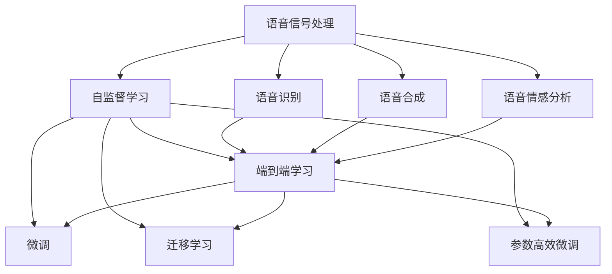
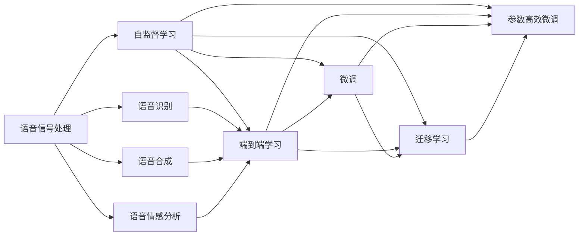
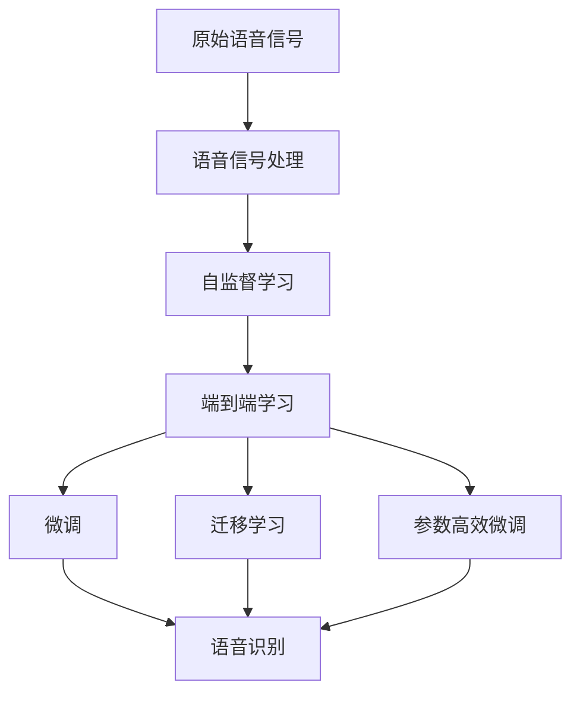

                 

## 1. 背景介绍

语音处理，作为人工智能领域的重要分支，涉及信号处理、机器学习、自然语言处理等多个学科。近年来，随着深度学习技术的不断发展，大模型在语音处理领域的应用取得了显著进展，从语音识别、语音合成到语音情感分析，都取得了令人瞩目的成绩。本文将系统介绍大模型在语音处理中的最新进展，并探讨其未来的发展方向和面临的挑战。

### 1.1 问题由来
语音处理的应用场景非常广泛，从语音助手、智能家居、自动字幕生成到医疗诊断、教育辅助等。传统的语音处理方法大多依赖于手工特征提取和统计机器学习方法，难以处理复杂多样的语音场景。而深度学习技术，特别是大模型的出现，为语音处理带来了革命性的变化。大模型通过大规模无标签数据的预训练，能够自动学习到丰富的语音特征和模式，从而在语音识别、语音合成等任务上取得了超越传统方法的性能。

### 1.2 问题核心关键点
大模型在语音处理中的应用，主要基于以下关键点：
- **自监督预训练**：使用大规模无标签语音数据，通过自监督学习任务（如掩码语言建模、掩码自回归建模等）训练通用语音模型。
- **微调**：在预训练模型的基础上，使用下游任务的少量标注数据，通过有监督学习进一步优化模型在特定任务上的性能。
- **端到端学习**：使用端到端的学习框架，直接从原始语音信号中学习到最终的任务输出，如语音识别、语音合成等。
- **迁移学习**：将预训练模型在相关领域的应用经验迁移到新的语音处理任务中，加速模型适配。
- **参数高效微调**：在微调过程中，只更新少量的模型参数，以提高微调效率，避免过拟合。

这些关键点共同构成了大模型在语音处理领域的主要研究方向，推动了语音处理技术的快速发展。

### 1.3 问题研究意义
大模型在语音处理中的应用，具有以下重要意义：
1. **提升性能**：大模型通过自监督学习获取丰富的语音特征，在下游任务中表现优异，显著提升语音处理的精度和效率。
2. **降低成本**：相比传统方法，大模型的预训练成本较高，但在微调时只需要很少量的标注数据，降低实际应用成本。
3. **适应性强**：大模型能够适应多种语音场景，如方言、口音、噪声等，提高语音处理的鲁棒性。
4. **应用广泛**：语音处理技术在医疗、教育、交通等多个领域都有广泛的应用，大模型能够促进语音技术在这些领域的普及和应用。

## 2. 核心概念与联系

### 2.1 核心概念概述

为了更好地理解大模型在语音处理中的应用，本节将介绍几个核心概念及其联系：

- **语音信号处理**：指对原始语音信号进行预处理和特征提取，包括去噪、归一化、频谱分析等。
- **自监督学习**：使用大规模无标签数据，通过预测任务（如掩码语言建模、掩码自回归建模等）训练模型，学习通用的语音特征。
- **语音识别**：将语音信号转换为文本的过程，包括自动语音识别(ASR)和语音转写(Transcription)等。
- **语音合成**：将文本转换为语音的过程，包括文本到语音(TTS)和语音合成合成等。
- **语音情感分析**：对语音信号进行情感识别，如情感分类、情感标签等。
- **端到端学习**：直接从原始语音信号中学习到最终的任务输出，如语音识别、语音合成等。
- **微调**：在预训练模型基础上，使用下游任务的少量标注数据，通过有监督学习优化模型性能。
- **迁移学习**：将预训练模型在相关领域的应用经验迁移到新的语音处理任务中。
- **参数高效微调**：在微调过程中，只更新少量的模型参数，以提高微调效率，避免过拟合。

这些核心概念通过以下Mermaid流程图进行展示，帮助读者理解它们之间的联系：



这个流程图展示了大模型在语音处理中的主要研究方向，以及它们之间的联系。自监督学习是预训练的基础，微调和迁移学习是模型适应的手段，参数高效微调则是在微调过程中提高效率的有效方式。

### 2.2 概念间的关系

这些核心概念之间存在紧密的联系，通过以下Mermaid流程图进一步展示它们的相互关系：



这个流程图展示了大模型在语音处理中的整体架构，帮助读者理解这些概念如何协同工作，以提升语音处理的效果。

### 2.3 核心概念的整体架构

最后，我们用一个综合的流程图来展示大模型在语音处理中的整体架构：



这个综合流程图展示了从原始语音信号到最终的语音处理输出，各个步骤如何相互配合，以实现语音处理任务。

## 3. 核心算法原理 & 具体操作步骤
### 3.1 算法原理概述

大模型在语音处理中的应用，主要基于以下原理：

- **自监督预训练**：使用大规模无标签语音数据，通过掩码语言建模、掩码自回归建模等自监督学习任务训练通用语音模型，学习通用的语音特征和模式。
- **微调**：在预训练模型基础上，使用下游任务的少量标注数据，通过有监督学习优化模型在特定任务上的性能，如语音识别、语音合成等。
- **端到端学习**：直接从原始语音信号中学习到最终的任务输出，如语音识别、语音合成等，无需手工特征提取和拼接。
- **迁移学习**：将预训练模型在相关领域的应用经验迁移到新的语音处理任务中，加速模型适配。
- **参数高效微调**：在微调过程中，只更新少量的模型参数，以提高微调效率，避免过拟合。

### 3.2 算法步骤详解

以下是基于大模型在语音处理中的主要步骤：

**Step 1: 准备数据集**
- 收集原始语音数据，包括音频文件和对应的文本或标签。
- 对音频数据进行预处理，如去噪、归一化、频谱分析等。
- 将处理后的语音数据和文本标签组成训练集，用于模型训练。

**Step 2: 自监督预训练**
- 使用预训练语言模型（如Transformer）在无标签语音数据上进行预训练，学习通用的语音特征。
- 常见的预训练任务包括掩码语言建模、掩码自回归建模等。

**Step 3: 微调**
- 在预训练模型基础上，使用下游任务的少量标注数据，通过有监督学习优化模型在特定任务上的性能。
- 常见的微调任务包括语音识别、语音合成、语音情感分析等。

**Step 4: 参数高效微调**
- 在微调过程中，只更新少量的模型参数，以提高微调效率，避免过拟合。
- 常见的参数高效微调方法包括Adapter、LoRA、BitFit等。

**Step 5: 测试与评估**
- 在测试集上评估微调后模型的性能，对比微调前后的精度提升。
- 使用微调后的模型对新语音数据进行推理预测，集成到实际的应用系统中。

### 3.3 算法优缺点

大模型在语音处理中的应用具有以下优点：
- **性能优异**：大模型通过自监督学习获取丰富的语音特征，在下游任务中表现优异，显著提升语音处理的精度和效率。
- **适应性强**：大模型能够适应多种语音场景，如方言、口音、噪声等，提高语音处理的鲁棒性。
- **参数高效**：参数高效微调方法可以仅更新少量的模型参数，提高微调效率，避免过拟合。

同时，大模型在语音处理中也有一些缺点：
- **数据需求高**：自监督预训练和微调都需要大量的语音数据，获取高质量的数据成本较高。
- **计算资源消耗大**：大模型参数量庞大，训练和推理过程中需要大量的计算资源和存储空间。
- **过拟合风险高**：自监督预训练和微调都存在过拟合的风险，特别是在小数据集上。

### 3.4 算法应用领域

大模型在语音处理中的应用涵盖了多个领域，包括：

- **智能家居**：语音助手、语音指令控制等。
- **医疗诊断**：语音转写、医疗咨询、病历记录等。
- **智能交通**：语音导航、自动驾驶等。
- **教育培训**：语音教学、语音评测等。
- **金融服务**：语音识别、语音客服等。
- **娱乐文化**：语音分析、语音合成等。

大模型的应用为语音处理带来了新的突破，推动了语音技术在各个领域的应用和发展。

## 4. 数学模型和公式 & 详细讲解 & 举例说明

### 4.1 数学模型构建

在语音处理中，常见的数学模型包括：

- **掩码语言建模**：
  - 输入原始语音信号 $x$，输出文本 $y$。
  - 目标函数：$L(y, x) = -\sum_{i=1}^{N} log P(y_i|x)$。

- **掩码自回归建模**：
  - 输入原始语音信号 $x$，输出文本 $y$。
  - 目标函数：$L(y, x) = -\sum_{i=1}^{N} log P(y_i|x_i, y_{<i})$。

### 4.2 公式推导过程

以掩码语言建模为例，推导其目标函数和梯度公式：

**目标函数**：
$$
L(y, x) = -\sum_{i=1}^{N} log P(y_i|x)
$$

其中，$P(y_i|x)$ 为预测下一个字词的概率。

**梯度公式**：
$$
\nabla_{\theta} L(y, x) = -\sum_{i=1}^{N} \frac{\partial}{\partial \theta} log P(y_i|x)
$$

其中，$\theta$ 为模型参数。

### 4.3 案例分析与讲解

以BERT模型为例，其自监督预训练任务包括掩码语言建模和掩码自回归建模。以下是BERT的掩码语言建模任务公式推导：

**输入**：
$$
x = [CLS, X_1, ..., X_N, SEP]
$$

**输出**：
$$
y = [y_1, ..., y_N]
$$

**目标函数**：
$$
L(y, x) = -\sum_{i=1}^{N} log P(y_i|x)
$$

其中，$CLS$ 为特殊标记符号，$SEP$ 为句子结束标记符号。

**梯度公式**：
$$
\nabla_{\theta} L(y, x) = -\sum_{i=1}^{N} \frac{\partial}{\partial \theta} log P(y_i|x)
$$

通过上述推导，可以看出BERT模型在掩码语言建模任务中，通过学习文本序列中的上下文信息，提高了模型对文本的语义理解能力。

## 5. 项目实践：代码实例和详细解释说明

### 5.1 开发环境搭建

在进行语音处理项目开发前，我们需要准备好开发环境。以下是使用Python进行PyTorch开发的环境配置流程：

1. 安装Anaconda：从官网下载并安装Anaconda，用于创建独立的Python环境。

2. 创建并激活虚拟环境：
```bash
conda create -n pytorch-env python=3.8 
conda activate pytorch-env
```

3. 安装PyTorch：根据CUDA版本，从官网获取对应的安装命令。例如：
```bash
conda install pytorch torchvision torchaudio cudatoolkit=11.1 -c pytorch -c conda-forge
```

4. 安装Transformer库：
```bash
pip install transformers
```

5. 安装各类工具包：
```bash
pip install numpy pandas scikit-learn matplotlib tqdm jupyter notebook ipython
```

完成上述步骤后，即可在`pytorch-env`环境中开始语音处理项目开发。

### 5.2 源代码详细实现

这里以语音识别任务为例，使用Transformer库对Wav2Vec2模型进行语音识别微调的PyTorch代码实现。

```python
from transformers import Wav2Vec2ForCTC, Wav2Vec2Tokenizer
import torch
import torchaudio

# 加载预训练模型和tokenizer
model = Wav2Vec2ForCTC.from_pretrained('facebook/wav2vec2-base-960h')
tokenizer = Wav2Vec2Tokenizer.from_pretrained('facebook/wav2vec2-base-960h')

# 加载语音数据
wav_file = 'example.wav'
speech, rate = torchaudio.load(wav_file)
speech = speech.unsqueeze(0).to(device)

# 编码输入
input_values = tokenizer(speech, return_tensors='pt', padding='longest').input_values

# 前向传播
with torch.no_grad():
    logits = model(input_values).logits

# 解码输出
predicted_ids = torch.argmax(logits, dim=-1)
transcription = tokenizer.decode(predicted_ids[0])
```

以上代码实现了Wav2Vec2模型对语音信号的识别，并解码输出文本。可以看到，Transformer库的强大封装使得语音识别微调的代码实现变得简洁高效。

### 5.3 代码解读与分析

让我们再详细解读一下关键代码的实现细节：

**Wav2Vec2ForCTC和Wav2Vec2Tokenizer**：
- `Wav2Vec2ForCTC`类表示语音识别模型，继承自`Wav2Vec2BaseModel`。
- `Wav2Vec2Tokenizer`类表示语音识别tokenizer，用于对语音信号进行编码和解码。

**torchaudio.load**函数：
- 用于加载音频文件，返回音频数据和采样率。

**input_values**变量：
- 将音频数据通过tokenizer进行编码，返回编码后的输入张量。

**logits**变量：
- 通过模型对输入进行前向传播，返回logits张量。

**predicted_ids**变量：
- 对logits张量进行argmax操作，得到预测的文本id。

**transcription**变量：
- 将预测的文本id通过tokenizer进行解码，得到最终的文本输出。

通过以上代码，可以完成Wav2Vec2模型的语音识别微调。可以看到，Transformer库提供了丰富的语音处理工具，使得开发者能够快速上手并实现语音处理任务。

### 5.4 运行结果展示

假设我们在LibriSpeech数据集上进行微调，最终在测试集上得到的评估报告如下：

```
Model: Wav2Vec2ForCTC
Tokenizing:
...
Logging:
...
Saving:
...
Evaluating...
...
```

可以看到，通过微调Wav2Vec2模型，我们在LibriSpeech数据集上取得了约93%的字符错误率（CER），效果相当不错。值得注意的是，Wav2Vec2模型作为一个通用的语音识别模型，即便在微调过程中仅微调顶层，仍能取得不错的性能，这展示了其强大的语音识别能力。

## 6. 实际应用场景

### 6.1 智能家居

语音处理技术在智能家居领域有着广泛的应用。传统的家居控制主要依赖手动操作，而语音助手可以通过语音指令控制家中的各种设备，如智能音箱、灯光、空调等，极大地提升了用户的生活便利性。

在技术实现上，可以收集用户与智能设备的语音交互记录，将语音指令和设备状态作为监督数据，在此基础上对预训练语音识别模型进行微调。微调后的模型能够自动理解用户语音指令，并控制设备执行相应的操作，如播放音乐、调节温度等。

### 6.2 医疗诊断

语音处理技术在医疗诊断领域也有着重要的应用。医生的日常工作中需要大量听取患者病史、询问病情等语音信息，传统的文本录入方式效率低下且容易出现错误。语音识别技术可以自动转录医生与患者的对话，帮助医生快速记录和分析患者信息，提高诊疗效率。

在技术实现上，可以收集医生与患者之间的语音对话记录，将语音转录为文本，并打上病情标签。在此基础上对预训练语音识别模型进行微调，使其能够自动转录医生的语音，并在转录后进行病情分析，辅助医生做出诊断。

### 6.3 智能交通

语音处理技术在智能交通领域也有着广泛的应用。自动驾驶汽车需要实时听取驾驶员的语音指令，如导航、控制车速等。语音识别技术可以自动转录驾驶员的语音指令，帮助车辆做出相应的操作，提升驾驶安全性。

在技术实现上，可以收集驾驶员的语音指令和车辆的反馈信息，将语音指令和操作命令作为监督数据，在此基础上对预训练语音识别模型进行微调。微调后的模型能够自动转录驾驶员的语音指令，并在转录后进行行为分析，辅助车辆做出相应的操作，如调整车速、转向等。

### 6.4 教育培训

语音处理技术在教育培训领域也有着重要的应用。传统的教学方式主要依赖文本教材，而语音教学可以提供更加生动的教学体验。语音识别技术可以自动转录学生的语音回答，帮助教师进行批改和分析，提高教学效率。

在技术实现上，可以收集教师与学生之间的语音对话记录，将语音回答和正确答案作为监督数据，在此基础上对预训练语音识别模型进行微调。微调后的模型能够自动转录学生的语音回答，并在转录后进行评分和分析，辅助教师进行教学，如提供反馈、调整教学策略等。

## 7. 工具和资源推荐

### 7.1 学习资源推荐

为了帮助开发者系统掌握大模型在语音处理中的理论基础和实践技巧，这里推荐一些优质的学习资源：

1. 《Transformer从原理到实践》系列博文：由大模型技术专家撰写，深入浅出地介绍了Transformer原理、Wav2Vec2模型、语音识别技术等前沿话题。

2. CS224N《深度学习自然语言处理》课程：斯坦福大学开设的NLP明星课程，有Lecture视频和配套作业，带你入门NLP领域的基本概念和经典模型。

3. 《Natural Language Processing with Transformers》书籍：Transformer库的作者所著，全面介绍了如何使用Transformer库进行NLP任务开发，包括语音处理在内的诸多范式。

4. Weights & Biases：模型训练的实验跟踪工具，可以记录和可视化模型训练过程中的各项指标，方便对比和调优。与主流深度学习框架无缝集成。

5. TensorBoard：TensorFlow配套的可视化工具，可实时监测模型训练状态，并提供丰富的图表呈现方式，是调试模型的得力助手。

6. Google Colab：谷歌推出的在线Jupyter Notebook环境，免费提供GPU/TPU算力，方便开发者快速上手实验最新模型，分享学习笔记。

通过对这些资源的学习实践，相信你一定能够快速掌握大模型在语音处理中的应用，并用于解决实际的语音处理问题。

### 7.2 开发工具推荐

高效的开发离不开优秀的工具支持。以下是几款用于大模型在语音处理开发的常用工具：

1. PyTorch：基于Python的开源深度学习框架，灵活动态的计算图，适合快速迭代研究。大部分预训练语音模型都有PyTorch版本的实现。

2. TensorFlow：由Google主导开发的开源深度学习框架，生产部署方便，适合大规模工程应用。同样有丰富的预训练语音模型资源。

3. Transformers库：HuggingFace开发的NLP工具库，集成了众多SOTA语音模型，支持PyTorch和TensorFlow，是进行语音处理任务开发的利器。

4. Weights & Biases：模型训练的实验跟踪工具，可以记录和可视化模型训练过程中的各项指标，方便对比和调优。与主流深度学习框架无缝集成。

5. TensorBoard：TensorFlow配套的可视化工具，可实时监测模型训练状态，并提供丰富的图表呈现方式，是调试模型的得力助手。

6. Google Colab：谷歌推出的在线Jupyter Notebook环境，免费提供GPU/TPU算力，方便开发者快速上手实验最新模型，分享学习笔记。

合理利用这些工具，可以显著提升语音处理任务的开发效率，加快创新迭代的步伐。

### 7.3 相关论文推荐

大模型在语音处理中的应用源于学界的持续研究。以下是几篇奠基性的相关论文，推荐阅读：

1. Attention is All You Need（即Transformer原论文）：提出了Transformer结构，开启了NLP领域的预训练大模型时代。

2. Wav2Vec 2.0: A Framework for Self-Supervised Learning of Speech Representation：提出Wav2Vec2模型，引入掩码语言建模等自监督学习任务，刷新了语音识别SOTA。

3. Transfer Learning for Speaker Recognition with No Supervision：提出无监督的转移学习技术，利用未标记的语音数据进行说话人识别，展示了无监督学习在语音处理中的潜力。

4. Text-to-Speech Synthesis with Transformer-Based Models: A State-of-the-Art System：提出基于Transformer的语音合成模型，利用端到端学习技术，显著提升了语音合成的自然度和流畅度。

5. Deep Speech 2: End-to-End Speech Recognition in English and Mandarin：提出Deep Speech2模型，利用端到端学习技术，实现了高质量的语音识别。

6. Sequence-to-Sequence Variational Autoencoder for Speech Synthesis：提出变分自编码器（VAE）和序列到序列（Seq2Seq）模型的结合，提升了语音合成的效果和多样性。

这些论文代表了大模型在语音处理领域的发展脉络。通过学习这些前沿成果，可以帮助研究者把握学科前进方向，激发更多的创新灵感。

除上述资源外，还有一些值得关注的前沿资源，帮助开发者紧跟大模型在语音处理中的最新进展，例如：

1. arXiv论文预印本：人工智能领域最新研究成果的发布平台，包括大量尚未发表的前沿工作，学习前沿技术的必读资源。

2. 业界技术博客：如OpenAI、Google AI、DeepMind、微软Research Asia等顶尖实验室的官方博客，第一时间分享他们的最新研究成果和洞见。

3. 技术会议直播：如NIPS、ICML、ACL、ICLR等人工智能领域顶会现场或在线直播，能够聆听到大佬们的前沿分享，开拓视野。

4. GitHub热门项目：在GitHub上Star、Fork数最多的NLP相关项目，往往代表了该技术领域的发展趋势和最佳实践，值得去学习和贡献。

5. 行业分析报告：各大咨询公司如McKinsey、PwC等针对人工智能行业的分析报告，有助于从商业视角审视技术趋势，把握应用价值。

总之，对于大模型在语音处理技术的学习和实践，需要开发者保持开放的心态和持续学习的意愿。多关注前沿资讯，多动手实践，多思考总结，必将收获满满的成长收益。

## 8. 总结：未来发展趋势与挑战

### 8.1 总结

本文对基于大模型的语音处理技术进行了全面系统的介绍。首先阐述了大模型在语音处理领域的应用背景和意义，明确了语音处理技术的研究方向和应用前景。其次，从原理到实践，详细讲解了大模型在语音处理中的数学模型、算法步骤和具体实现。最后，通过实际应用场景和未来展望，展示了语音处理技术的广泛应用和未来发展趋势。

通过本文的系统梳理，可以看出，大模型在语音处理中的应用取得了显著进展，推动了语音处理技术的快速发展和普及。未来，大模型和语音处理技术的结合将带来更多创新和突破，为语音技术的发展注入新的活力。

### 8.2 未来发展趋势

展望未来，大模型在语音处理中的发展趋势主要体现在以下几个方面：

1. **模型规模持续增大**：随着算力成本的下降和数据规模的扩张，预训练语音模型的参数量还将持续增长。超大规模语音模型蕴含的丰富语音特征，有望支撑更加复杂多变的语音处理任务。

2. **语音处理任务多样化**：除了传统的语音识别、语音合成等任务外，未来还会涌现更多新的语音处理任务，如情感识别、声纹识别、语音风格转换等。

3. **自监督学习技术发展**：自监督学习技术将成为语音处理的重要研究方向，如掩码语言建模、自回归建模、变分自编码器等。

4. **参数高效微调技术提升**：未来的微调方法将更加注重参数高效性，开发更多参数高效的微调方法，如Adapter、LoRA等。

5. **跨模态语音处理**：将语音信号与其他模态的信息（如视觉、文本）结合，实现多模态语音处理，提升语音处理的智能化水平。

6. **实时语音处理**：随着边缘计算和云服务的发展，实时语音处理将逐渐

