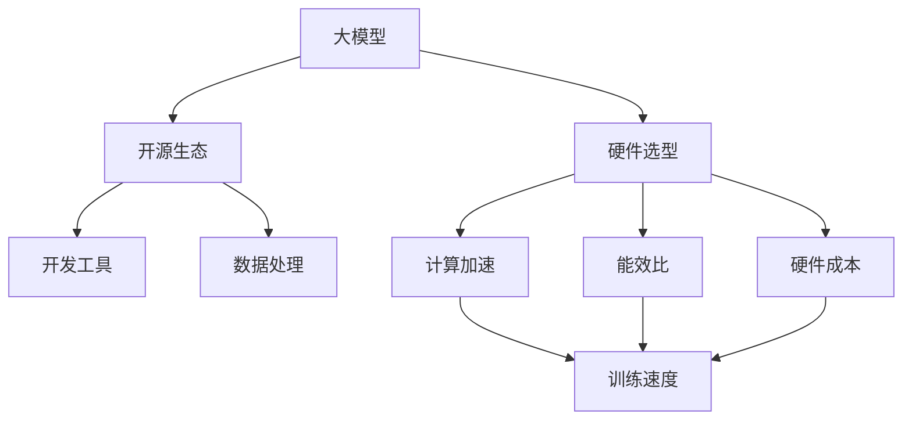

                 

# 大模型开源生态与硬件选型

大模型（Large Model）作为人工智能技术中的佼佼者，以其巨大的参数量、丰富的语言表示和强大的学习能力，在自然语言处理（NLP）、计算机视觉（CV）等众多领域取得了显著的突破。而开源生态与硬件选型作为支撑大模型发展的两个关键因素，也在不断演进中。本文将从大模型的开源生态和硬件选型两个方面进行深入探讨，帮助读者全面理解大模型的部署与优化。

## 1. 背景介绍

### 1.1 大模型的崛起
随着深度学习技术的发展，尤其是Transformer结构的出现，大模型以其庞大的参数量和强大的表示能力，成为AI领域的重要研究方向。OpenAI的GPT-3、Google的BERT、Microsoft的T5等大模型，不仅在学术界获得广泛认可，也在工业界得到广泛应用。大模型不仅在诸如问答、翻译、摘要生成等文本任务上表现出色，也在视觉、语音等多模态任务上取得显著进展。

### 1.2 开源生态的崛起
大模型的成功离不开其背后强大的开源生态系统。Google的TensorFlow、Facebook的PyTorch、Microsoft的Azure ML等平台提供了丰富的工具和资源，支持大模型的开发和部署。大模型的开源化，使得社区的力量得以充分发挥，推动了大模型技术的快速迭代和广泛应用。

### 1.3 硬件选型的重要性
硬件选型在大模型部署中起着至关重要的作用。大模型参数量大，计算需求高，传统的CPU已难以满足其需求。GPU、TPU等加速器成为大模型训练和推理的主流硬件选择。同时，硬件的选型还关系到数据中心成本、能效比、可扩展性等多个方面，需要综合考虑。

## 2. 核心概念与联系

### 2.1 核心概念概述
- **大模型**：指的是具有庞大参数量的深度学习模型，如BERT、GPT、XLNet等。
- **开源生态**：指的是围绕大模型构建的各类工具、平台和社区。
- **硬件选型**：指的是在部署大模型时，选择适合的硬件设备，如CPU、GPU、TPU等。

### 2.2 概念间的关系
大模型的成功离不开开源生态的支撑和硬件选型的保障。开源生态提供了丰富的工具和资源，帮助开发者高效构建、训练和部署大模型；硬件选型则决定了大模型在计算能力、能效比、成本等方面的表现。两者相辅相成，共同推动了大模型技术的进步与应用。

这些核心概念之间的关系可以用以下Mermaid流程图来展示：



## 3. 核心算法原理 & 具体操作步骤

### 3.1 算法原理概述
大模型的训练和推理涉及大量的参数计算和数据处理。常见的算法包括前向传播、反向传播、梯度下降等。在大模型的开源生态中，TensorFlow、PyTorch等框架提供了丰富的算法和工具支持。

### 3.2 算法步骤详解
1. **数据准备**：收集和预处理数据，包括文本数据、图像数据等。
2. **模型构建**：选择合适的模型架构，如Transformer、CNN等。
3. **训练**：在GPU、TPU等加速器上进行模型训练，调整超参数，优化损失函数。
4. **推理**：在目标硬件上对模型进行推理，输出预测结果。

### 3.3 算法优缺点
- **优点**：
  - 强大的表示能力，可以处理复杂的多模态任务。
  - 开源生态丰富，工具和资源丰富。
  - 硬件选型灵活，满足不同需求。

- **缺点**：
  - 参数量大，计算需求高。
  - 训练和推理成本高，需要强大的硬件支持。
  - 开源社区虽然强大，但涉及到的技术复杂度较高。

### 3.4 算法应用领域
大模型已经在NLP、CV、推荐系统、金融风控等多个领域得到广泛应用，并取得了显著的成效。

## 4. 数学模型和公式 & 详细讲解 & 举例说明

### 4.1 数学模型构建
大模型的训练和推理涉及大量的矩阵乘法和非线性变换。以BERT为例，其模型结构如下：

$$
M = [L, P]
$$

其中 $L$ 表示语言编码器，$P$ 表示池化层。

### 4.2 公式推导过程
以BERT为例，其前向传播公式如下：

$$
h = L \cdot x
$$

其中 $h$ 表示输出，$L$ 表示语言编码器，$x$ 表示输入。

### 4.3 案例分析与讲解
以ImageNet分类任务为例，使用大模型ResNet进行图像分类。具体步骤如下：
1. 收集ImageNet数据集。
2. 构建ResNet模型，并进行参数初始化。
3. 在GPU上进行前向传播和反向传播，更新模型参数。
4. 在验证集上进行模型评估，调整超参数。
5. 在测试集上进行最终评估，输出预测结果。

## 5. 项目实践：代码实例和详细解释说明

### 5.1 开发环境搭建
首先需要安装TensorFlow或PyTorch等深度学习框架。同时，需要选择适合的大模型和硬件设备。

### 5.2 源代码详细实现
以TensorFlow为例，代码实现如下：

```python
import tensorflow as tf
from tensorflow.keras import layers

# 构建模型
model = tf.keras.Sequential([
    layers.Embedding(vocab_size, embedding_dim, input_length=max_len),
    layers.LSTM(units=hidden_dim),
    layers.Dense(num_classes, activation='softmax')
])

# 定义损失函数
loss_fn = tf.keras.losses.CategoricalCrossentropy()

# 定义优化器
optimizer = tf.keras.optimizers.Adam(learning_rate=0.001)

# 编译模型
model.compile(optimizer=optimizer, loss=loss_fn, metrics=['accuracy'])

# 训练模型
model.fit(train_dataset, epochs=num_epochs, batch_size=batch_size)

# 评估模型
test_loss, test_acc = model.evaluate(test_dataset)

# 推理模型
predictions = model.predict(test_dataset)
```

### 5.3 代码解读与分析
代码中，首先定义了模型结构，包括嵌入层、LSTM层和输出层。然后定义了损失函数和优化器，最后编译模型并训练。训练过程中，使用了ImageNet数据集，并定义了批大小和训练轮数。训练完成后，使用测试集评估模型性能。

### 5.4 运行结果展示
在训练过程中，可以通过TensorBoard监控模型训练进度。训练完成后，可以使用TensorFlow SavedModel保存模型，方便后续部署和推理。

## 6. 实际应用场景

### 6.1 智慧医疗
在大模型开源生态的支撑下，智慧医疗系统能够利用NLP技术进行病历分析、疾病预测等。硬件选型上，可以选择GPU或TPU进行模型训练和推理。

### 6.2 金融风控
金融风控系统可以通过大模型进行欺诈检测、信用评估等。在硬件选型上，需要考虑模型的实时性和能效比。

### 6.3 自动驾驶
自动驾驶系统可以采用大模型进行图像分类、目标检测等任务。硬件选型上，需要考虑实时性和计算速度。

### 6.4 未来应用展望
未来，大模型将在更多领域得到广泛应用，如智慧城市、智能家居、娱乐等领域。同时，随着硬件技术的进步，大模型将更加高效、易用。

## 7. 工具和资源推荐

### 7.1 学习资源推荐
- TensorFlow官方文档：详细介绍了TensorFlow的使用方法和API。
- PyTorch官方文档：详细介绍了PyTorch的使用方法和API。
- Google Colab：提供了免费的GPU资源，方便开发者进行模型训练和测试。

### 7.2 开发工具推荐
- TensorFlow：强大的深度学习框架，支持GPU和TPU加速。
- PyTorch：灵活的深度学习框架，支持动态图。
- TensorBoard：用于可视化模型训练进度的工具。

### 7.3 相关论文推荐
- Attention is All You Need（Transformer原论文）。
- BERT: Pre-training of Deep Bidirectional Transformers for Language Understanding。
- ImageNet Classification with Deep Convolutional Neural Networks。

## 8. 总结：未来发展趋势与挑战

### 8.1 研究成果总结
大模型开源生态和硬件选型是推动大模型发展的关键因素。开源生态提供了丰富的工具和资源，支持大模型的开发和部署；硬件选型则决定了大模型的计算能力、能效比和成本。

### 8.2 未来发展趋势
- 开源生态将更加成熟和完善，提供更多样化的工具和资源。
- 硬件选型将更加多样化，满足不同需求。
- 大模型将在更多领域得到广泛应用，推动AI技术的进步。

### 8.3 面临的挑战
- 大模型计算需求高，需要强大的硬件支持。
- 开源社区虽然强大，但涉及到的技术复杂度较高。
- 大模型的训练和推理成本高，需要优化。

### 8.4 研究展望
未来，大模型的开源生态和硬件选型将更加多样化和智能化。同时，大模型的应用将更加广泛和深入，推动AI技术的不断进步。

## 9. 附录：常见问题与解答

**Q1: 大模型在部署时需要注意哪些问题？**

A: 大模型在部署时需要注意以下几点：
- 选择适合硬件设备，如GPU、TPU等。
- 考虑数据中心成本、能效比、可扩展性等因素。
- 使用TensorFlow SavedModel等工具保存模型，方便后续部署和推理。

**Q2: 如何优化大模型的训练和推理？**

A: 优化大模型的训练和推理需要考虑以下几个方面：
- 选择合适的模型结构和算法。
- 使用GPU或TPU等加速器进行训练和推理。
- 调整超参数，如学习率、批大小等。
- 使用数据增强、正则化等技术，避免过拟合。

**Q3: 如何选择合适的开源生态工具？**

A: 选择合适的开源生态工具需要考虑以下几点：
- 工具的功能和易用性。
- 工具的稳定性和可扩展性。
- 工具的社区支持和资源丰富程度。

**Q4: 大模型的未来发展方向是什么？**

A: 大模型的未来发展方向包括：
- 模型规模的进一步增大。
- 多模态任务的融合。
- 跨领域迁移能力的提升。
- 模型的可解释性和鲁棒性。

---

作者：禅与计算机程序设计艺术 / Zen and the Art of Computer Programming

