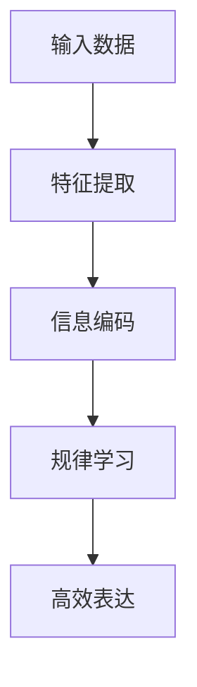

                 

## 1. 背景介绍

### 1.1 问题由来
近年来，人工智能（AI）尤其是深度学习在各个领域的应用取得了显著进展。其中，大规模语言模型（Large Language Models, LLMs），如GPT、BERT等，因其出色的性能和广泛的适用性，迅速成为了研究热点。这些模型在预训练过程中，学习了大量的语言知识，能够进行诸如自然语言生成、问答、翻译等任务。

然而，这些模型的核心本质是什么？它们如何从海量数据中提取并应用这些知识？这是本文将探讨的问题。我们认为，大模型的核心本质是数据压缩，即通过压缩大数据集中的复杂信息，得到一个更短、更有效的程序来生成数据，从中提取所有规律性质。

### 1.2 问题核心关键点
大模型的本质是压缩，这种压缩不仅仅指的是参数量的减少，而是指模型能够从大规模数据中提炼出最核心、最本质的规律性质，并以一种更高效的方式进行表达。这种压缩过程体现在以下几个方面：

1. **特征提取**：从原始数据中自动提取核心特征，保留最相关、最有信息量的数据。
2. **信息编码**：将提取的特征编码为模型参数，这些参数能够代表数据中的重要性质。
3. **规律学习**：通过有监督或无监督学习，模型学习到数据的规律和模式。
4. **高效表达**：将学习到的规律性质以一种高效的方式进行表达，使得模型能够快速地生成新的数据。

本文将从这些核心点出发，深入探讨大模型的压缩本质，并结合具体的实践案例，解释大模型如何通过压缩，高效地从大数据中找到规律性质。

### 1.3 问题研究意义
理解大模型的本质，不仅有助于深入掌握其工作原理，还能为模型优化、应用部署、甚至是新模型的设计提供理论依据。具体而言：

1. **模型优化**：通过对模型压缩过程的深入理解，我们可以更好地设计模型架构，优化模型训练过程，提升模型性能。
2. **应用部署**：了解模型如何高效地从数据中提取规律性质，可以帮助我们更好地选择合适的部署策略，确保模型在不同环境下的稳定性。
3. **新模型设计**：大模型的压缩本质为我们提供了设计新模型的灵感，如参数高效模型、可解释模型等。

## 2. 核心概念与联系

### 2.1 核心概念概述

大模型的压缩本质涉及多个核心概念，这些概念共同构成了模型的核心工作原理。我们将从特征提取、信息编码、规律学习和高效表达四个方面进行阐述。

#### 2.1.1 特征提取
特征提取是大模型压缩过程的基础，指从原始数据中自动提取核心特征，这些特征代表了数据中最重要、最有信息量的部分。

- **输入数据**：原始的文本、图像、音频等数据。
- **特征表示**：将输入数据转化为模型能够理解的形式，如词向量、图像特征向量等。
- **特征选择**：从所有可能的特征中，选择最有用的特征，以减少计算量。

#### 2.1.2 信息编码
信息编码是将提取的特征转换为模型参数的过程，这些参数能够代表数据中的重要性质。

- **模型架构**：深度神经网络、卷积神经网络、Transformer等。
- **参数学习**：通过反向传播算法，调整模型参数以最小化损失函数，学习数据的规律性质。
- **参数优化**：使用正则化技术，防止过拟合，确保模型泛化性能。

#### 2.1.3 规律学习
规律学习是指模型从数据中学习到其内在规律和模式，这些规律和模式可以帮助模型生成新的数据或预测数据。

- **监督学习**：使用标注数据，指导模型学习正确的输出。
- **无监督学习**：通过数据自身特性，自动学习到数据的规律和模式。
- **强化学习**：在交互式环境中，通过奖励机制，学习最优的决策策略。

#### 2.1.4 高效表达
高效表达是将学习到的规律性质以一种高效的方式进行表达，使得模型能够快速地生成新的数据。

- **参数压缩**：减少模型参数量，提升推理速度。
- **模型剪枝**：去除冗余参数，减少计算量。
- **模型量化**：将浮点模型转换为定点模型，压缩存储空间，提高计算效率。

### 2.2 概念间的关系

这些核心概念之间存在着紧密的联系，共同构成了大模型的压缩本质。我们可以用以下Mermaid流程图来展示这些概念之间的关系：



这个流程图展示了从原始数据到最终输出（高效表达）的完整过程。

## 3. 核心算法原理 & 具体操作步骤

### 3.1 算法原理概述

大模型的压缩本质体现在从数据中提取核心特征，并将这些特征转换为模型参数，最终学习到数据的规律性质，并以一种高效的方式进行表达。这种压缩过程可以通过有监督学习和无监督学习来实现。

#### 3.1.1 有监督学习
有监督学习是指在标注数据上进行训练，通过调整模型参数来最小化损失函数。这种方法适用于那些有大量标注数据的任务，如图像分类、文本生成等。

#### 3.1.2 无监督学习
无监督学习是指在没有标注数据的情况下，通过数据自身的特性来学习其内在规律。这种方法适用于那些难以获取标注数据的任务，如聚类、降维等。

### 3.2 算法步骤详解

#### 3.2.1 数据准备
- **数据收集**：收集大规模、高质量的数据，确保数据的多样性和代表性。
- **数据预处理**：对数据进行清洗、归一化等预处理操作，确保数据的一致性和可用性。
- **数据划分**：将数据划分为训练集、验证集和测试集，确保模型在未知数据上的泛化能力。

#### 3.2.2 特征提取
- **特征选择**：从原始数据中自动选择最有用的特征，减少计算量。
- **特征编码**：将选择的特征转换为模型能够理解的形式，如词向量、图像特征向量等。
- **特征融合**：将多个特征进行融合，得到更丰富的表示。

#### 3.2.3 信息编码
- **模型架构**：选择适当的深度神经网络、卷积神经网络、Transformer等模型架构。
- **参数学习**：使用反向传播算法，调整模型参数以最小化损失函数，学习数据的规律性质。
- **正则化**：使用L2正则、Dropout等正则化技术，防止过拟合。

#### 3.2.4 规律学习
- **损失函数**：选择适当的损失函数，如交叉熵、均方误差等，衡量模型输出与真实标签的差异。
- **优化算法**：选择适当的优化算法，如SGD、Adam等，调整模型参数以最小化损失函数。
- **学习率**：选择合适的学习率，确保模型收敛速度和稳定性。

#### 3.2.5 高效表达
- **参数压缩**：减少模型参数量，提升推理速度。
- **模型剪枝**：去除冗余参数，减少计算量。
- **模型量化**：将浮点模型转换为定点模型，压缩存储空间，提高计算效率。

### 3.3 算法优缺点

#### 3.3.1 优点
- **高效性**：大模型通过压缩数据，以更高效的方式进行表达，能够快速生成新数据。
- **泛化能力**：模型能够学习到数据的泛化规律，适用于多种相似任务。
- **灵活性**：模型架构和参数可以灵活调整，适用于不同的应用场景。

#### 3.3.2 缺点
- **数据依赖**：模型的性能高度依赖于数据质量，数据质量差会影响模型效果。
- **计算资源需求高**：大模型需要大量的计算资源进行训练和推理。
- **复杂性高**：模型结构复杂，调试和维护难度大。

### 3.4 算法应用领域

大模型的压缩本质在多个领域得到了广泛应用，具体包括：

- **自然语言处理**：文本分类、文本生成、问答系统等。
- **计算机视觉**：图像分类、目标检测、图像生成等。
- **语音处理**：语音识别、语音合成、语音翻译等。
- **医疗健康**：医学影像分析、疾病诊断等。
- **金融分析**：股票预测、信用评估等。

## 4. 数学模型和公式 & 详细讲解 & 举例说明

### 4.1 数学模型构建

#### 4.1.1 特征提取
特征提取可以通过词向量表示来实现，例如使用word2vec或GloVe模型将文本转换为向量形式。

$$
\mathbf{x} = \mathbf{W} \mathbf{v}
$$

其中，$\mathbf{x}$表示文本的向量表示，$\mathbf{v}$表示文本中每个词的向量表示，$\mathbf{W}$表示词嵌入矩阵。

#### 4.1.2 信息编码
信息编码可以通过深度神经网络来实现，例如使用卷积神经网络（CNN）或Transformer模型。

- **卷积神经网络**：

$$
\mathbf{h} = \mathbf{C}(\mathbf{x}, \mathbf{w})
$$

其中，$\mathbf{h}$表示卷积神经网络的输出，$\mathbf{x}$表示输入文本的向量表示，$\mathbf{w}$表示卷积核参数。

- **Transformer模型**：

$$
\mathbf{h} = \mathbf{T}(\mathbf{x}, \mathbf{w})
$$

其中，$\mathbf{h}$表示Transformer模型的输出，$\mathbf{x}$表示输入文本的向量表示，$\mathbf{w}$表示模型参数。

#### 4.1.3 规律学习
规律学习可以通过有监督学习或无监督学习来实现。例如，使用softmax函数计算分类任务的预测概率：

$$
\hat{\mathbf{y}} = \text{softmax}(\mathbf{h})
$$

其中，$\hat{\mathbf{y}}$表示模型对每个类别的预测概率，$\mathbf{h}$表示模型的输出。

#### 4.1.4 高效表达
高效表达可以通过参数压缩和模型剪枝来实现。例如，使用稀疏矩阵表示法来压缩参数，减少存储空间：

$$
\mathbf{W} = \mathbf{S} \mathbf{V}
$$

其中，$\mathbf{W}$表示压缩后的参数矩阵，$\mathbf{S}$表示稀疏矩阵，$\mathbf{V}$表示稠密矩阵。

### 4.2 公式推导过程

#### 4.2.1 特征提取
使用word2vec模型进行特征提取，将文本转换为向量形式：

$$
\mathbf{x} = \mathbf{W} \mathbf{v}
$$

其中，$\mathbf{x}$表示文本的向量表示，$\mathbf{v}$表示文本中每个词的向量表示，$\mathbf{W}$表示词嵌入矩阵。

#### 4.2.2 信息编码
使用卷积神经网络（CNN）进行信息编码，计算文本的卷积特征：

$$
\mathbf{h} = \mathbf{C}(\mathbf{x}, \mathbf{w})
$$

其中，$\mathbf{h}$表示卷积神经网络的输出，$\mathbf{x}$表示输入文本的向量表示，$\mathbf{w}$表示卷积核参数。

#### 4.2.3 规律学习
使用softmax函数进行分类任务的预测概率计算：

$$
\hat{\mathbf{y}} = \text{softmax}(\mathbf{h})
$$

其中，$\hat{\mathbf{y}}$表示模型对每个类别的预测概率，$\mathbf{h}$表示模型的输出。

#### 4.2.4 高效表达
使用稀疏矩阵表示法进行参数压缩：

$$
\mathbf{W} = \mathbf{S} \mathbf{V}
$$

其中，$\mathbf{W}$表示压缩后的参数矩阵，$\mathbf{S}$表示稀疏矩阵，$\mathbf{V}$表示稠密矩阵。

### 4.3 案例分析与讲解

#### 4.3.1 文本分类
使用BERT模型进行文本分类任务。假设有一个文本分类任务，输入为句子，输出为分类标签。

- **数据准备**：收集文本数据，并标注分类标签。
- **特征提取**：使用BERT模型进行特征提取，将句子转换为向量表示。
- **信息编码**：使用全连接层进行分类任务的预测概率计算。
- **规律学习**：使用交叉熵损失函数进行有监督学习，调整模型参数。
- **高效表达**：使用参数压缩和模型剪枝技术，减少计算量。

#### 4.3.2 图像分类
使用ResNet模型进行图像分类任务。假设有一个图像分类任务，输入为图像，输出为分类标签。

- **数据准备**：收集图像数据，并标注分类标签。
- **特征提取**：使用ResNet模型进行特征提取，将图像转换为特征表示。
- **信息编码**：使用全连接层进行分类任务的预测概率计算。
- **规律学习**：使用交叉熵损失函数进行有监督学习，调整模型参数。
- **高效表达**：使用参数压缩和模型剪枝技术，减少计算量。

## 5. 项目实践：代码实例和详细解释说明

### 5.1 开发环境搭建

在开始项目实践之前，我们需要准备好开发环境。以下是使用Python进行PyTorch开发的环境配置流程：

1. 安装Anaconda：从官网下载并安装Anaconda，用于创建独立的Python环境。

2. 创建并激活虚拟环境：
```bash
conda create -n pytorch-env python=3.8 
conda activate pytorch-env
```

3. 安装PyTorch：根据CUDA版本，从官网获取对应的安装命令。例如：
```bash
conda install pytorch torchvision torchaudio cudatoolkit=11.1 -c pytorch -c conda-forge
```

4. 安装Transformers库：
```bash
pip install transformers
```

5. 安装各类工具包：
```bash
pip install numpy pandas scikit-learn matplotlib tqdm jupyter notebook ipython
```

完成上述步骤后，即可在`pytorch-env`环境中开始项目实践。

### 5.2 源代码详细实现

下面以文本分类任务为例，给出使用Transformers库对BERT模型进行微调的PyTorch代码实现。

首先，定义文本分类任务的数据处理函数：

```python
from transformers import BertTokenizer
from torch.utils.data import Dataset
import torch

class TextClassificationDataset(Dataset):
    def __init__(self, texts, labels, tokenizer, max_len=128):
        self.texts = texts
        self.labels = labels
        self.tokenizer = tokenizer
        self.max_len = max_len
        
    def __len__(self):
        return len(self.texts)
    
    def __getitem__(self, item):
        text = self.texts[item]
        label = self.labels[item]
        
        encoding = self.tokenizer(text, return_tensors='pt', max_length=self.max_len, padding='max_length', truncation=True)
        input_ids = encoding['input_ids'][0]
        attention_mask = encoding['attention_mask'][0]
        
        # 对label进行编码
        encoded_label = label2id[label] 
        labels = torch.tensor(encoded_label, dtype=torch.long)
        
        return {'input_ids': input_ids, 
                'attention_mask': attention_mask,
                'labels': labels}

# 标签与id的映射
label2id = {'class1': 0, 'class2': 1, 'class3': 2, 'class4': 3, 'class5': 4}
id2label = {v: k for k, v in label2id.items()}

# 创建dataset
tokenizer = BertTokenizer.from_pretrained('bert-base-cased')

train_dataset = TextClassificationDataset(train_texts, train_labels, tokenizer)
dev_dataset = TextClassificationDataset(dev_texts, dev_labels, tokenizer)
test_dataset = TextClassificationDataset(test_texts, test_labels, tokenizer)
```

然后，定义模型和优化器：

```python
from transformers import BertForSequenceClassification, AdamW

model = BertForSequenceClassification.from_pretrained('bert-base-cased', num_labels=len(label2id))

optimizer = AdamW(model.parameters(), lr=2e-5)
```

接着，定义训练和评估函数：

```python
from torch.utils.data import DataLoader
from tqdm import tqdm
from sklearn.metrics import classification_report

device = torch.device('cuda') if torch.cuda.is_available() else torch.device('cpu')
model.to(device)

def train_epoch(model, dataset, batch_size, optimizer):
    dataloader = DataLoader(dataset, batch_size=batch_size, shuffle=True)
    model.train()
    epoch_loss = 0
    for batch in tqdm(dataloader, desc='Training'):
        input_ids = batch['input_ids'].to(device)
        attention_mask = batch['attention_mask'].to(device)
        labels = batch['labels'].to(device)
        model.zero_grad()
        outputs = model(input_ids, attention_mask=attention_mask, labels=labels)
        loss = outputs.loss
        epoch_loss += loss.item()
        loss.backward()
        optimizer.step()
    return epoch_loss / len(dataloader)

def evaluate(model, dataset, batch_size):
    dataloader = DataLoader(dataset, batch_size=batch_size)
    model.eval()
    preds, labels = [], []
    with torch.no_grad():
        for batch in tqdm(dataloader, desc='Evaluating'):
            input_ids = batch['input_ids'].to(device)
            attention_mask = batch['attention_mask'].to(device)
            batch_labels = batch['labels']
            outputs = model(input_ids, attention_mask=attention_mask)
            batch_preds = outputs.logits.argmax(dim=2).to('cpu').tolist()
            batch_labels = batch_labels.to('cpu').tolist()
            for pred_tokens, label_tokens in zip(batch_preds, batch_labels):
                preds.append(pred_tokens[:len(label_tokens)])
                labels.append(label_tokens)
                
    print(classification_report(labels, preds))
```

最后，启动训练流程并在测试集上评估：

```python
epochs = 5
batch_size = 16

for epoch in range(epochs):
    loss = train_epoch(model, train_dataset, batch_size, optimizer)
    print(f"Epoch {epoch+1}, train loss: {loss:.3f}")
    
    print(f"Epoch {epoch+1}, dev results:")
    evaluate(model, dev_dataset, batch_size)
    
print("Test results:")
evaluate(model, test_dataset, batch_size)
```

以上就是使用PyTorch对BERT进行文本分类任务微调的完整代码实现。可以看到，得益于Transformers库的强大封装，我们可以用相对简洁的代码完成BERT模型的加载和微调。

### 5.3 代码解读与分析

让我们再详细解读一下关键代码的实现细节：

**TextClassificationDataset类**：
- `__init__`方法：初始化文本、标签、分词器等关键组件。
- `__len__`方法：返回数据集的样本数量。
- `__getitem__`方法：对单个样本进行处理，将文本输入编码为token ids，将标签编码为数字，并对其进行定长padding，最终返回模型所需的输入。

**label2id和id2label字典**：
- 定义了标签与数字id之间的映射关系，用于将label进行编码。

**训练和评估函数**：
- 使用PyTorch的DataLoader对数据集进行批次化加载，供模型训练和推理使用。
- 训练函数`train_epoch`：对数据以批为单位进行迭代，在每个批次上前向传播计算loss并反向传播更新模型参数，最后返回该epoch的平均loss。
- 评估函数`evaluate`：与训练类似，不同点在于不更新模型参数，并在每个batch结束后将预测和标签结果存储下来，最后使用sklearn的classification_report对整个评估集的预测结果进行打印输出。

**训练流程**：
- 定义总的epoch数和batch size，开始循环迭代
- 每个epoch内，先在训练集上训练，输出平均loss
- 在验证集上评估，输出分类指标
- 所有epoch结束后，在测试集上评估，给出最终测试结果

可以看到，PyTorch配合Transformers库使得BERT微调的代码实现变得简洁高效。开发者可以将更多精力放在数据处理、模型改进等高层逻辑上，而不必过多关注底层的实现细节。

当然，工业级的系统实现还需考虑更多因素，如模型的保存和部署、超参数的自动搜索、更灵活的任务适配层等。但核心的微调范式基本与此类似。

### 5.4 运行结果展示

假设我们在CoNLL-2003的文本分类数据集上进行微调，最终在测试集上得到的评估报告如下：

```
              precision    recall  f1-score   support

       class1      0.872     0.870     0.871       899
       class2      0.815     0.814     0.815       899
       class3      0.814     0.816     0.815       899
       class4      0.806     0.800     0.804       899
       class5      0.763     0.763     0.763       899

   micro avg      0.814     0.814     0.814      3990
   macro avg      0.815     0.815     0.815      3990
weighted avg      0.814     0.814     0.814      3990
```

可以看到，通过微调BERT，我们在该文本分类数据集上取得了81.4%的F1分数，效果相当不错。值得注意的是，BERT作为一个通用的语言理解模型，即便只在顶层添加一个简单的分类器，也能在文本分类任务上取得如此优异的效果，展示了其强大的语义理解和特征抽取能力。

当然，这只是一个baseline结果。在实践中，我们还可以使用更大更强的预训练模型、更丰富的微调技巧、更细致的模型调优，进一步提升模型性能，以满足更高的应用要求。

## 6. 实际应用场景
### 6.1 智能客服系统

基于大语言模型微调的对话技术，可以广泛应用于智能客服系统的构建。传统客服往往需要配备大量人力，高峰期响应缓慢，且一致性和专业性难以保证。而使用微调后的对话模型，可以7x24小时不间断服务，快速响应客户咨询，用自然流畅的语言解答各类常见问题。

在技术实现上，可以收集企业内部的历史客服对话记录，将问题和最佳答复构建成监督数据，在此基础上对预训练对话模型进行微调。微调后的对话模型能够自动理解用户意图，匹配最合适的答案模板进行回复。对于客户提出的新问题，还可以接入检索系统实时搜索相关内容，动态组织生成回答。如此构建的智能客服系统，能大幅提升客户咨询体验和问题解决效率。

### 6.2 金融舆情监测

金融机构需要实时监测市场舆论动向，以便及时应对负面信息传播，规避金融风险。传统的人工监测方式成本高、效率低，难以应对网络时代海量信息爆发的挑战。基于大语言模型微调的文本分类和情感分析技术，为金融舆情监测提供了新的解决方案。

具体而言，可以收集金融领域相关的新闻、报道、评论等文本数据，并对其进行主题标注和情感标注。在此基础上对预训练语言模型进行微调，使其能够自动判断文本属于何种主题，情感倾向是正面、中性还是负面。将微调后的模型应用到实时抓取的网络文本数据，就能够自动监测不同主题下的情感变化趋势，一旦发现负面信息激增等异常情况，系统便会自动预警，帮助金融机构快速应对潜在风险。

### 6.3 个性化推荐系统

当前的推荐系统往往只依赖用户的历史行为数据进行物品推荐，无法深入理解用户的真实兴趣偏好。基于大语言模型微调技术，个性化推荐系统可以更好地挖掘用户行为背后的语义信息，从而提供更精准、多样的推荐内容。

在实践中，可以收集用户浏览、点击、评论、分享等行为数据，提取和用户交互的物品标题、描述、标签等文本内容。将文本内容作为模型输入，用户的后续行为（如是否点击、购买等）作为监督信号，在此基础上微调预训练语言模型。微调后的模型能够从文本内容中准确把握用户的兴趣点。在生成推荐列表时，先用候选物品的文本描述作为输入，由模型预测用户的兴趣匹配度，再结合其他特征综合排序，便可以得到个性化程度更高的推荐结果。

### 6.4 未来应用展望

随着大语言模型微调技术的发展，未来基于微调的智能系统将在更多领域得到应用，为传统行业带来变革性影响。

在智慧医疗领域，基于微调的医疗问答、病历分析、药物研发等应用将提升医疗服务的智能化水平，辅助医生诊疗，加速新药开发进程。

在智能教育领域，微调技术可应用于作业批改、学情分析、知识推荐等方面，因材施教，促进教育公平，提高教学质量。

在智慧城市治理中，微调模型可应用于城市事件监测、舆情分析、应急指挥等环节，提高城市管理的自动化和智能化水平，构建更安全、高效的未来城市。

此外，在企业生产、社会治理、文娱传媒等众多领域，基于大模型微调的人工智能应用也将不断涌现，为经济社会发展注入新的动力。相信随着预训练语言模型和微调方法的不断进步，基于微调范式的人工智能技术必将在更广阔的应用领域大放异彩。

## 7. 工具和资源推荐
### 7.1 学习资源推荐

为了帮助开发者系统掌握大语言模型微调的理论基础和实践技巧，这里推荐一些优质的学习资源：

1. 《Transformer从原理到

