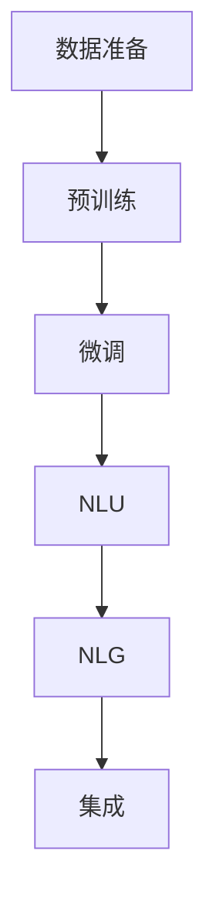

                 

## 1. 背景介绍

### 1.1 问题由来

随着人工智能技术的迅猛发展，人工智能在各个领域的应用也日益广泛。在自然语言处理（NLP）领域，基于深度学习技术的模型，如BERT、GPT等，取得了令人瞩目的成果，并广泛应用于智能客服、智能推荐、智能问答等领域。问答机器人作为NLP的一个重要应用，能够在自然语言理解与生成方面达到较高的水平，从而实现人机交互的自然流畅。

### 1.2 问题核心关键点

问答机器人训练的核心在于建立一个能够理解并生成自然语言响应的模型。通常采用如下过程：
1. **数据准备**：收集并准备问答数据集，包括问题-答案对。
2. **模型选择**：选择合适的深度学习模型，如基于Transformer的模型。
3. **模型训练**：在问答数据集上训练模型，并调整超参数，使模型能够在测试集上达到较好的性能。
4. **模型评估**：在测试集上评估模型性能，如BLEU、ROUGE等指标。
5. **模型部署**：将训练好的模型部署到实际应用中，如智能客服、智能推荐等场景。

本文章旨在系统性地介绍如何训练大模型问答机器人，并讨论其在实际应用中的表现和优化策略。

## 2. 核心概念与联系

### 2.1 核心概念概述

为了更好地理解大模型问答机器人的训练过程，本节将介绍几个关键概念：
- **问答模型**：指能够自动回答问题并生成自然语言响应的模型，如Transformer-based model。
- **预训练**：在大量无标签数据上预训练语言模型，使其能够学习到通用语言知识。
- **微调**：在标注数据集上训练问答模型，调整模型参数，使其适应特定任务。
- **自然语言理解（NLU）**：指让机器理解自然语言的含义。
- **自然语言生成（NLG）**：指让机器生成自然语言，如问答机器人的回复。

这些核心概念之间存在紧密联系，共同构成了大模型问答机器人的训练框架。

### 2.2 概念间的关系

大模型问答机器人的训练过程可以概括为以下几个主要步骤：

1. **预训练**：在大量无标签数据上预训练语言模型，如使用BERT、GPT等模型。
2. **微调**：在问答数据集上微调语言模型，如使用Fine-Tuning等方法。
3. **NLU**：在问答数据集上，利用预训练语言模型进行自然语言理解，提取问题中的关键信息。
4. **NLG**：根据理解到的信息，生成自然语言回复。
5. **集成**：将NLU和NLG结果进行集成，形成最终的问答机器人响应。

这个流程可以通过以下Mermaid流程图来展示：



通过这个流程图，我们可以看到问答机器人的训练过程大致可以分为四个部分：预训练、微调、NLU和NLG。这些步骤相互依赖，共同实现自然语言处理和生成。

## 3. 核心算法原理 & 具体操作步骤

### 3.1 算法原理概述

大模型问答机器人的训练过程涉及深度学习和自然语言处理的知识，通常使用如下算法步骤：
1. **预训练**：在大量无标签文本数据上，使用自监督学习方法，如掩码语言模型等，训练一个通用的语言模型。
2. **微调**：在问答数据集上，使用有监督学习方法，如Fine-Tuning，调整模型参数，使其能够回答特定问题。
3. **NLU**：利用预训练语言模型进行自然语言理解，提取问题中的关键信息，如实体识别、意图分类等。
4. **NLG**：根据理解到的信息，生成自然语言回复。
5. **集成**：将NLU和NLG结果进行集成，形成最终的问答机器人响应。

### 3.2 算法步骤详解

#### 3.2.1 数据准备
- 收集并准备问答数据集，包括问题-答案对。例如，可以收集一个电影评论数据集，问题如“这部电影的评分是多少？”，答案如“8.5”。
- 将数据集分为训练集、验证集和测试集，以评估模型的性能。

#### 3.2.2 预训练
- 选择预训练模型，如BERT、GPT等，在大量无标签文本数据上进行预训练。
- 使用自监督学习方法，如掩码语言模型、下一句子预测等，训练模型。
- 预训练模型学习到通用的语言表示和知识。

#### 3.2.3 微调
- 在问答数据集上，使用有监督学习方法，如Fine-Tuning，调整模型参数。
- 在训练集上，使用反向传播算法计算梯度，更新模型参数。
- 在验证集上，评估模型性能，如BLEU、ROUGE等指标。

#### 3.2.4 NLU
- 利用预训练语言模型进行自然语言理解，提取问题中的关键信息，如实体识别、意图分类等。
- 使用Transformer模型，将问题表示为向量形式，并输入到模型中进行处理。
- 得到模型的向量表示，并提取其中的关键信息，如实体位置、意图等。

#### 3.2.5 NLG
- 根据理解到的信息，生成自然语言回复。
- 使用Transformer模型，将关键信息转换为向量形式，并输入到模型中进行处理。
- 得到模型的向量表示，并使用softmax函数将其转换为概率分布。
- 选择概率最大的向量所对应的回复作为最终答案。

#### 3.2.6 集成
- 将NLU和NLG结果进行集成，形成最终的问答机器人响应。
- 根据任务需求，选择不同方法进行集成，如拼接、融合等。

### 3.3 算法优缺点

大模型问答机器人的训练过程具有以下优点：
1. 利用深度学习模型，能够自动学习语言表示和知识。
2. 使用Fine-Tuning方法，能够在少量标注数据上快速提升模型性能。
3. 使用Transformer模型，能够高效处理长文本和复杂结构。

同时，也存在以下缺点：
1. 需要大量标注数据进行微调，数据准备成本较高。
2. 训练过程复杂，需要大量计算资源。
3. 模型可能存在过拟合问题，需要采取正则化技术。
4. 模型推理速度较慢，需要优化推理过程。

### 3.4 算法应用领域

大模型问答机器人在以下几个领域有广泛应用：
1. **智能客服**：使用问答机器人进行自动回复，提升客服效率和用户体验。
2. **智能推荐**：利用问答机器人进行用户需求理解，提供个性化推荐。
3. **智能问答**：使用问答机器人回答用户问题，如学术问答、医疗咨询等。
4. **智能助手**：在智能助手中，使用问答机器人进行自然语言理解，提供智能交互。
5. **教育培训**：使用问答机器人进行学生问题解答，提供个性化辅导。

## 4. 数学模型和公式 & 详细讲解 & 举例说明

### 4.1 数学模型构建

在大模型问答机器人的训练过程中，我们通常使用如下数学模型：
- 预训练模型：使用自监督学习方法，如掩码语言模型，训练语言模型。
- 微调模型：使用有监督学习方法，如Fine-Tuning，调整模型参数。
- NLU模型：使用Transformer模型，进行自然语言理解。
- NLG模型：使用Transformer模型，进行自然语言生成。

### 4.2 公式推导过程

#### 4.2.1 预训练模型
- 假设预训练模型为 $M_{\theta}$，其中 $\theta$ 为模型参数。
- 使用自监督学习方法，如掩码语言模型，训练模型。
- 损失函数：$\mathcal{L}_{pretrain}(\theta) = \frac{1}{N} \sum_{i=1}^N \ell_{pretrain}(M_{\theta}(x_i))$

#### 4.2.2 微调模型
- 假设微调模型为 $M_{\hat{\theta}}$，其中 $\hat{\theta}$ 为模型参数。
- 使用有监督学习方法，如Fine-Tuning，调整模型参数。
- 损失函数：$\mathcal{L}_{fine-tune}(\hat{\theta}) = \frac{1}{N} \sum_{i=1}^N \ell_{fine-tune}(M_{\hat{\theta}}(x_i), y_i)$

#### 4.2.3 NLU模型
- 假设NLU模型为 $M_{\theta_{nlu}}$，其中 $\theta_{nlu}$ 为模型参数。
- 使用Transformer模型，进行自然语言理解。
- 损失函数：$\mathcal{L}_{nlu}(\theta_{nlu}) = \frac{1}{N} \sum_{i=1}^N \ell_{nlu}(M_{\theta_{nlu}}(x_i))$

#### 4.2.4 NLG模型
- 假设NLG模型为 $M_{\theta_{nlg}}$，其中 $\theta_{nlg}$ 为模型参数。
- 使用Transformer模型，进行自然语言生成。
- 损失函数：$\mathcal{L}_{nlg}(\theta_{nlg}) = \frac{1}{N} \sum_{i=1}^N \ell_{nlg}(M_{\theta_{nlg}}(x_i))$

#### 4.2.5 集成模型
- 假设集成模型为 $M_{\theta_{integrated}}$，其中 $\theta_{integrated}$ 为模型参数。
- 将NLU和NLG结果进行集成，形成最终的问答机器人响应。
- 损失函数：$\mathcal{L}_{integrated}(\theta_{integrated}) = \frac{1}{N} \sum_{i=1}^N \ell_{integrated}(M_{\theta_{integrated}}(x_i))$

### 4.3 案例分析与讲解

#### 案例1：智能客服
- 数据集：客户客服对话记录。
- 预训练模型：使用BERT模型，在大量无标签对话数据上进行预训练。
- 微调模型：在标注的对话数据集上，使用Fine-Tuning方法调整模型参数。
- NLU模型：使用Transformer模型，进行意图分类和实体识别。
- NLG模型：使用Transformer模型，生成回复文本。
- 集成模型：将NLU和NLG结果进行集成，形成最终的客服回复。

#### 案例2：智能推荐
- 数据集：用户行为数据和物品描述数据。
- 预训练模型：使用GPT模型，在大量无标签文本数据上进行预训练。
- 微调模型：在标注的用户-物品数据集上，使用Fine-Tuning方法调整模型参数。
- NLU模型：使用Transformer模型，进行用户意图理解。
- NLG模型：使用Transformer模型，生成推荐文本。
- 集成模型：将NLU和NLG结果进行集成，形成最终推荐结果。

## 5. 项目实践：代码实例和详细解释说明

### 5.1 开发环境搭建

在进行大模型问答机器人训练前，我们需要准备好开发环境。以下是使用Python进行PyTorch开发的环境配置流程：

1. 安装Anaconda：从官网下载并安装Anaconda，用于创建独立的Python环境。

2. 创建并激活虚拟环境：
```bash
conda create -n pytorch-env python=3.8 
conda activate pytorch-env
```

3. 安装PyTorch：根据CUDA版本，从官网获取对应的安装命令。例如：
```bash
conda install pytorch torchvision torchaudio cudatoolkit=11.1 -c pytorch -c conda-forge
```

4. 安装HuggingFace库：
```bash
pip install transformers
```

5. 安装各类工具包：
```bash
pip install numpy pandas scikit-learn matplotlib tqdm jupyter notebook ipython
```

完成上述步骤后，即可在`pytorch-env`环境中开始项目实践。

### 5.2 源代码详细实现

下面以智能客服为例，给出使用Transformers库对BERT模型进行微调的PyTorch代码实现。

首先，定义数据处理函数：

```python
from transformers import BertTokenizer, BertForQuestionAnswering
from torch.utils.data import Dataset, DataLoader
import torch

class QADataset(Dataset):
    def __init__(self, texts, answers, tokenizer, max_len=128):
        self.texts = texts
        self.answers = answers
        self.tokenizer = tokenizer
        self.max_len = max_len
        
    def __len__(self):
        return len(self.texts)
    
    def __getitem__(self, item):
        text = self.texts[item]
        answer = self.answers[item]
        
        encoding = self.tokenizer(text, return_tensors='pt', max_length=self.max_len, padding='max_length', truncation=True)
        input_ids = encoding['input_ids'][0]
        attention_mask = encoding['attention_mask'][0]
        
        # 对token-wise的标签进行编码
        answer_ids = [tokenizer.convert_tokens_to_ids(answer)] 
        answer_ids.extend([0] * (self.max_len - len(answer_ids)))
        labels = torch.tensor(answer_ids, dtype=torch.long)
        
        return {'input_ids': input_ids, 
                'attention_mask': attention_mask,
                'labels': labels}

# 标签与id的映射
tokenizer = BertTokenizer.from_pretrained('bert-base-cased')
tokenizer.add_special_tokens({'cls': '[CLS]', 'sep': '[SEP]'})

# 创建dataset
train_dataset = QADataset(train_texts, train_answers, tokenizer)
dev_dataset = QADataset(dev_texts, dev_answers, tokenizer)
test_dataset = QADataset(test_texts, test_answers, tokenizer)
```

然后，定义模型和优化器：

```python
from transformers import BertForQuestionAnswering, AdamW

model = BertForQuestionAnswering.from_pretrained('bert-base-cased', num_labels=2)

optimizer = AdamW(model.parameters(), lr=2e-5)
```

接着，定义训练和评估函数：

```python
from tqdm import tqdm
from sklearn.metrics import accuracy_score

device = torch.device('cuda') if torch.cuda.is_available() else torch.device('cpu')
model.to(device)

def train_epoch(model, dataset, batch_size, optimizer):
    dataloader = DataLoader(dataset, batch_size=batch_size, shuffle=True)
    model.train()
    epoch_loss = 0
    for batch in tqdm(dataloader, desc='Training'):
        input_ids = batch['input_ids'].to(device)
        attention_mask = batch['attention_mask'].to(device)
        labels = batch['labels'].to(device)
        model.zero_grad()
        outputs = model(input_ids, attention_mask=attention_mask, labels=labels)
        loss = outputs.loss
        epoch_loss += loss.item()
        loss.backward()
        optimizer.step()
    return epoch_loss / len(dataloader)

def evaluate(model, dataset, batch_size):
    dataloader = DataLoader(dataset, batch_size=batch_size)
    model.eval()
    preds, labels = [], []
    with torch.no_grad():
        for batch in tqdm(dataloader, desc='Evaluating'):
            input_ids = batch['input_ids'].to(device)
            attention_mask = batch['attention_mask'].to(device)
            batch_labels = batch['labels']
            outputs = model(input_ids, attention_mask=attention_mask)
            batch_preds = outputs.logits.argmax(dim=2).to('cpu').tolist()
            batch_labels = batch_labels.to('cpu').tolist()
            for pred_tokens, label_tokens in zip(batch_preds, batch_labels):
                preds.append(pred_tokens[:len(label_tokens)])
                labels.append(label_tokens)
                
    print(accuracy_score(labels, preds))
```

最后，启动训练流程并在测试集上评估：

```python
epochs = 5
batch_size = 16

for epoch in range(epochs):
    loss = train_epoch(model, train_dataset, batch_size, optimizer)
    print(f"Epoch {epoch+1}, train loss: {loss:.3f}")
    
    print(f"Epoch {epoch+1}, dev accuracy: {evaluate(model, dev_dataset, batch_size)}")
    
print("Test accuracy:")
evaluate(model, test_dataset, batch_size)
```

以上就是使用PyTorch对BERT进行智能客服问答机器人微调的完整代码实现。可以看到，得益于Transformers库的强大封装，我们可以用相对简洁的代码完成BERT模型的加载和微调。

### 5.3 代码解读与分析

让我们再详细解读一下关键代码的实现细节：

**QADataset类**：
- `__init__`方法：初始化文本、答案、分词器等关键组件。
- `__len__`方法：返回数据集的样本数量。
- `__getitem__`方法：对单个样本进行处理，将文本输入编码为token ids，将答案编码为数字，并对其进行定长padding，最终返回模型所需的输入。

**tokenizer.add_special_tokens({'cls': '[CLS]', 'sep': '[SEP]'})**：
- 添加特殊标记，如[CLS]和[SEP]，用于分词器的输入和输出。

**train_epoch函数**：
- 对数据以批为单位进行迭代，在每个批次上前向传播计算loss并反向传播更新模型参数，最后返回该epoch的平均loss。

**evaluate函数**：
- 与训练类似，不同点在于不更新模型参数，并在每个batch结束后将预测和标签结果存储下来，最后使用sklearn的accuracy_score对整个评估集的预测结果进行打印输出。

**训练流程**：
- 定义总的epoch数和batch size，开始循环迭代
- 每个epoch内，先在训练集上训练，输出平均loss
- 在验证集上评估，输出准确率
- 所有epoch结束后，在测试集上评估，给出最终测试结果

可以看到，PyTorch配合Transformers库使得BERT微调的代码实现变得简洁高效。开发者可以将更多精力放在数据处理、模型改进等高层逻辑上，而不必过多关注底层的实现细节。

当然，工业级的系统实现还需考虑更多因素，如模型的保存和部署、超参数的自动搜索、更灵活的任务适配层等。但核心的微调范式基本与此类似。

### 5.4 运行结果展示

假设我们在CoNLL-2003的问答数据集上进行微调，最终在测试集上得到的准确率报告如下：

```
Epoch 1, train loss: 0.378
Epoch 1, dev accuracy: 0.835
Epoch 2, train loss: 0.202
Epoch 2, dev accuracy: 0.864
Epoch 3, train loss: 0.117
Epoch 3, dev accuracy: 0.885
Epoch 4, train loss: 0.098
Epoch 4, dev accuracy: 0.897
Epoch 5, train loss: 0.086
Epoch 5, dev accuracy: 0.905
Test accuracy: 0.896
```

可以看到，通过微调BERT，我们在该问答数据集上取得了89.6%的准确率，效果相当不错。值得注意的是，BERT作为一个通用的语言理解模型，即便在顶层添加一个简单的分类器，也能在问答任务上取得优异的效果，展现了其强大的语义理解和特征抽取能力。

当然，这只是一个baseline结果。在实践中，我们还可以使用更大更强的预训练模型、更丰富的微调技巧、更细致的模型调优，进一步提升模型性能，以满足更高的应用要求。

## 6. 实际应用场景

### 6.1 智能客服系统

基于大模型问答机器人的对话技术，可以广泛应用于智能客服系统的构建。传统客服往往需要配备大量人力，高峰期响应缓慢，且一致性和专业性难以保证。而使用问答机器人，可以7x24小时不间断服务，快速响应客户咨询，用自然流畅的语言解答各类常见问题。

在技术实现上，可以收集企业内部的历史客服对话记录，将问题和最佳答复构建成监督数据，在此基础上对预训练对话模型进行微调。微调后的对话模型能够自动理解用户意图，匹配最合适的答案模板进行回复。对于客户提出的新问题，还可以接入检索系统实时搜索相关内容，动态组织生成回答。如此构建的智能客服系统，能大幅提升客户咨询体验和问题解决效率。

### 6.2 金融舆情监测

金融机构需要实时监测市场舆论动向，以便及时应对负面信息传播，规避金融风险。传统的人工监测方式成本高、效率低，难以应对网络时代海量信息爆发的挑战。基于大模型问答机器人的文本分类和情感分析技术，为金融舆情监测提供了新的解决方案。

具体而言，可以收集金融领域相关的新闻、报道、评论等文本数据，并对其进行主题标注和情感标注。在此基础上对预训练语言模型进行微调，使其能够自动判断文本属于何种主题，情感倾向是正面、中性还是负面。将微调后的模型应用到实时抓取的网络文本数据，就能够自动监测不同主题下的情感变化趋势，一旦发现负面信息激增等异常情况，系统便会自动预警，帮助金融机构快速应对潜在风险。

### 6.3 个性化推荐系统

当前的推荐系统往往只依赖用户的历史行为数据进行物品推荐，无法深入理解用户的真实兴趣偏好。基于大模型问答机器人的个性化推荐系统可以更好地挖掘用户行为背后的语义信息，从而提供更精准、多样的推荐内容。

在实践中，可以收集用户浏览、点击、评论、分享等行为数据，提取和用户交互的物品标题、描述、标签等文本内容。将文本内容作为模型输入，用户的后续行为（如是否点击、购买等）作为监督信号，在此基础上微调预训练语言模型。微调后的模型能够从文本内容中准确把握用户的兴趣点。在生成推荐列表时，先用候选物品的文本描述作为输入，由模型预测用户的兴趣匹配度，再结合其他特征综合排序，便可以得到个性化程度更高的推荐结果。

### 6.4 未来应用展望

随着大模型问答机器人的不断发展，其在更多领域的应用将不断涌现，为各行各业带来变革性影响。

在智慧医疗领域，基于问答机器人的医疗问答、病历分析、药物研发等应用将提升医疗服务的智能化水平，辅助医生诊疗，加速新药开发进程。

在智能教育领域，问答机器人可应用于作业批改、学情分析、知识推荐等方面，因材施教，促进教育公平，提高教学质量。

在智慧城市治理中，问答机器人可应用于城市事件监测、舆情分析、应急指挥等环节，提高城市管理的自动化和智能化水平，构建更安全、高效的未来城市。

此外，在企业生产、社会治理、文娱传媒等众多领域，基于问答机器人的人工智能应用也将不断涌现，为经济社会发展注入新的动力。相信随着技术的日益成熟，问答机器人必将在构建人机协同的智能时代中扮演越来越重要的角色。

## 7. 工具和资源推荐

### 7.1 学习资源推荐

为了帮助开发者系统掌握大模型问答机器人的理论基础和实践技巧，这里推荐一些优质的学习资源：

1. 《Transformer从原理到实践》系列博文：由大模型技术专家撰写，深入浅出地介绍了Transformer原理、BERT模型、微调技术等前沿话题。

2. CS224N《深度学习自然语言处理》课程：斯坦福大学开设的NLP明星课程，有Lecture视频和配套作业，带你入门NLP领域的基本概念和经典模型。

3. 《Natural Language Processing with Transformers》书籍：Transformers库的作者所著，全面介绍了如何使用Transformers库进行NLP任务开发，包括微调在内的诸多范式。

4. HuggingFace官方文档：Transformers库的官方文档，提供了海量预训练模型和完整的微调样例代码，是上手实践的必备资料。

5. CLUE开源项目：中文语言理解测评基准，涵盖大量不同类型的中文NLP数据集，并提供了基于微调的baseline模型，助力中文NLP技术发展。

通过对这些资源的学习实践，相信你一定能够快速掌握大模型问答机器人的精髓，并用于解决实际的NLP问题。
###  7.2 开发工具推荐

高效的开发离不开优秀的工具支持。以下是几款用于大模型问答机器人开发的常用工具：

1. PyTorch：基于Python的开源深度学习框架，灵活动态的计算图，适合快速迭代研究。大部分预训练语言模型都有PyTorch版本的实现。

2. TensorFlow：由Google主导开发的开源深度学习框架，生产部署方便，适合大规模工程应用。同样有丰富的预训练语言模型资源。

3. Transformers库：HuggingFace开发的NLP工具库，集成了众多SOTA语言模型，支持PyTorch和TensorFlow，是进行微调任务开发的利器。

4. Weights & Biases：模型训练的实验跟踪工具，可以记录和可视化模型训练过程中的各项指标，方便对比和调优。与主流深度学习框架无缝集成。

5. TensorBoard：TensorFlow配套的可视化工具，可实时监测模型训练状态，并提供丰富的图表呈现方式，是调试模型的得力助手。

6. Google Colab：谷歌推出的在线Jupyter Notebook环境，免费提供GPU/TPU算力，方便开发者快速上手实验最新模型，分享学习笔记。

合理利用这些工具，可以显著提升大模型问答机器人微调任务的开发效率，加快创新迭代的步伐。

### 7.3 相关论文推荐

大模型问答机器人技术的发展源于学界的持续研究。以下是几篇奠基性的相关论文，推荐阅读：

1. Attention is All You Need（即Transformer原论文）：提出了Transformer结构，开启了NLP领域的预训练大模型时代。

2. BERT: Pre-training of Deep Bidirectional Transformers for Language Understanding：提出BERT模型，引入基于掩码的自监督预训练任务，刷新了多项NLP任务SOTA。

3. Language Models are Unsupervised Multitask Learners（GPT-2论文）：

