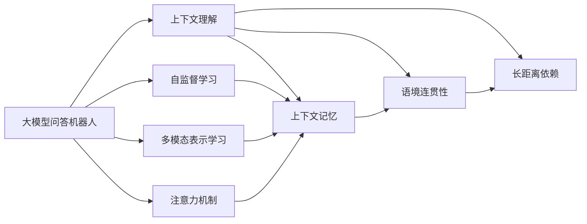

                 

# 大模型问答机器人的上下文理解

## 1. 背景介绍

在人工智能领域，大模型问答机器人因其卓越的上下文理解能力，正在逐渐成为企业、教育、客服等领域的热门技术。随着ChatGPT、GPT-3、Bert等大语言模型的横空出世，问答机器人在理解语义、处理复杂推理等方面取得了长足进展。

### 1.1 问题由来

当前的问答机器人技术面临着一个核心问题——上下文理解。高质量的问答系统需要准确地理解上下文信息，并在多轮对话中不断保持语境连贯性和准确性。然而，由于自然语言的多义性、歧义性和动态变化性，上下文理解成为了一个极其复杂的问题。传统的小规模语料库和简单的深度学习模型，已经难以应对这些问题。

### 1.2 问题核心关键点

上下文理解的核心在于模型需要学习如何在多轮对话中准确识别和记忆关键信息，并在后续回复中加以利用。这涉及到多个方面：

1. **上下文记忆**：模型需要从之前对话中记住关键信息，并利用这些信息进行推理和生成。
2. **语境连贯性**：模型需要保持对话的连贯性，确保回答与上下文一致。
3. **长距离依赖**：模型需要理解长距离的语义依赖，捕捉远端信息。

这些问题使得传统的线性模型和浅层网络难以胜任。因此，研究者开始转向更为强大的深度模型，特别是大语言模型。

### 1.3 问题研究意义

上下文理解能力的提升，将显著提高问答机器人的交互体验和准确性，使其在实际应用中更具实用性。例如：

- **客服自动化**：在客服场景中，用户往往需要多次提问，机器人需要记住之前的信息才能给出准确答复。
- **教育辅助**：学生提问可能涉及多个知识点，机器人需要理解上下文，提供详细的解释。
- **信息检索**：在问答系统中，用户往往需要多次询问才能找到所需信息，机器人需要记住上下文以提供更准确的回答。

因此，研究大模型问答机器人的上下文理解机制，对于推动人工智能技术的发展和应用具有重要意义。

## 2. 核心概念与联系

### 2.1 核心概念概述

在讨论上下文理解问题之前，我们需要先明确几个核心概念：

1. **大模型问答机器人**：使用大语言模型构建的问答系统，能够理解自然语言输入，生成合理回答。
2. **上下文理解**：模型在多轮对话中准确识别和记忆关键信息，并利用这些信息进行推理和生成。
3. **自监督学习**：使用未标注数据进行训练，自动发现数据中的规律和特征。
4. **多模态表示学习**：利用文本、图像、语音等多种模态信息进行联合学习，提高模型的泛化能力。
5. **注意力机制**：通过注意力机制，模型可以聚焦于当前对话中最重要的信息。

这些核心概念之间存在着紧密的联系，共同构成了大模型问答机器人的技术基础。

### 2.2 概念间的关系

这些核心概念之间的关系可以通过以下Mermaid流程图来展示：



这个流程图展示了上下文理解在大模型问答机器人中的核心作用，以及它与其他核心概念的紧密联系。

## 3. 核心算法原理 & 具体操作步骤
### 3.1 算法原理概述

大模型问答机器人的上下文理解，主要通过自监督学习、多模态表示学习、注意力机制等技术实现。其核心原理可以概括为以下几点：

1. **自监督学习**：在大规模无标签数据上训练大语言模型，使其自动发现语言规律，并具备强大的上下文理解能力。
2. **多模态表示学习**：利用文本、图像、语音等多种模态信息，进行联合学习，提高模型的泛化能力。
3. **注意力机制**：通过注意力机制，模型可以聚焦于当前对话中最重要的信息，从而提高上下文理解的准确性。

这些技术综合运用，使大模型问答机器人在处理复杂上下文信息时，能够表现出卓越的性能。

### 3.2 算法步骤详解

基于以上原理，大模型问答机器人的上下文理解算法大致可以分为以下几步：

1. **数据预处理**：将原始文本数据转换为模型可接受的格式，如分词、向量化等。
2. **多模态信息融合**：将文本、图像、语音等多种模态信息进行联合学习，提高模型的泛化能力。
3. **自监督学习训练**：在大规模无标签数据上训练大语言模型，使其自动发现语言规律，并具备强大的上下文理解能力。
4. **微调训练**：在特定任务的数据集上进行微调训练，使模型更加适应具体任务的需求。
5. **多轮对话推理**：在多轮对话中，模型需要准确识别和记忆关键信息，并利用这些信息进行推理和生成。
6. **推理生成**：根据上下文信息和用户输入，模型生成合理的回答。

### 3.3 算法优缺点

基于大模型的上下文理解算法具有以下优点：

1. **泛化能力强**：通过多模态表示学习和自监督学习，模型可以自动发现语言规律，并在不同场景中表现出卓越的泛化能力。
2. **语境连贯性好**：注意力机制和上下文记忆技术，使得模型在多轮对话中能够保持语境连贯性，生成合理的回答。
3. **适应性强**：模型可以通过微调训练，适应特定任务的需求，满足不同领域的应用需求。

同时，该算法也存在一些缺点：

1. **计算资源消耗大**：大模型需要较大的计算资源进行训练和推理，资源消耗较大。
2. **模型复杂度高**：大模型结构复杂，难以解释其内部工作机制，增加了模型的调试难度。
3. **数据依赖性强**：模型需要大量的标注数据进行微调训练，数据获取成本较高。

### 3.4 算法应用领域

基于大模型的上下文理解算法，已经广泛应用于以下几个领域：

1. **客服自动化**：利用大模型问答机器人处理客户咨询，提升客服自动化水平。
2. **教育辅助**：用于学生问答，提供个性化的学习支持。
3. **信息检索**：用于智能搜索引擎，提升信息检索的准确性和相关性。
4. **智能医疗**：用于医生和患者的问答系统，提供医疗咨询服务。
5. **智能金融**：用于智能客服和金融问答系统，提升金融服务的效率和质量。

这些应用领域展示了大模型问答机器人上下文理解技术在不同场景中的广泛适用性。

## 4. 数学模型和公式 & 详细讲解 & 举例说明
### 4.1 数学模型构建

在大模型问答机器人的上下文理解中，我们可以使用以下数学模型进行描述：

1. **输入文本表示**：将输入文本转换为模型可接受的格式，如向量化。
2. **多模态信息融合**：将文本、图像、语音等多种模态信息进行联合学习。
3. **自监督学习训练**：使用大规模无标签数据训练大语言模型。
4. **微调训练**：在特定任务的数据集上进行微调训练。
5. **多轮对话推理**：在多轮对话中，模型需要准确识别和记忆关键信息，并利用这些信息进行推理和生成。

### 4.2 公式推导过程

以下是一个简单的上下文理解模型的数学表示：

$$
\begin{aligned}
H &= \text{Encoder}(X) \\
Q &= \text{Query}(h_{T-1}) \\
A &= \text{Attention}(Q,H) \\
C &= \text{Transformer}(A) \\
P &= \text{Decoding}(C) \\
\hat{y} &= \text{OutputLayer}(P)
\end{aligned}
$$

其中，$H$表示输入文本的表示向量，$Q$表示前一时刻的查询向量，$A$表示注意力机制的输出，$C$表示Transformer的输出，$P$表示解码器的输出，$\hat{y}$表示模型的预测输出。

### 4.3 案例分析与讲解

以电影推荐系统为例，大模型问答机器人可以通过上下文理解技术，为用户提供个性化的电影推荐。具体步骤如下：

1. **输入文本表示**：将用户的历史浏览记录、评分信息、朋友推荐等文本信息转换为向量表示。
2. **多模态信息融合**：将用户的电影评分信息、朋友的推荐评分信息融合，提高模型的泛化能力。
3. **自监督学习训练**：在大规模的电影评分数据上训练大语言模型，使其自动发现评分规律，并具备强大的上下文理解能力。
4. **微调训练**：在特定用户的数据集上进行微调训练，使模型更加适应该用户的需求。
5. **多轮对话推理**：在多轮对话中，模型需要准确识别和记忆用户的偏好信息，并利用这些信息进行推理和生成。
6. **推理生成**：根据用户的偏好信息和电影的评分信息，模型生成合理的推荐。

## 5. 项目实践：代码实例和详细解释说明
### 5.1 开发环境搭建

在进行项目实践之前，我们需要准备好开发环境。以下是使用Python进行PyTorch开发的环境配置流程：

1. 安装Anaconda：从官网下载并安装Anaconda，用于创建独立的Python环境。

2. 创建并激活虚拟环境：
```bash
conda create -n pytorch-env python=3.8 
conda activate pytorch-env
```

3. 安装PyTorch：根据CUDA版本，从官网获取对应的安装命令。例如：
```bash
conda install pytorch torchvision torchaudio cudatoolkit=11.1 -c pytorch -c conda-forge
```

4. 安装Transformer库：
```bash
pip install transformers
```

5. 安装各类工具包：
```bash
pip install numpy pandas scikit-learn matplotlib tqdm jupyter notebook ipython
```

完成上述步骤后，即可在`pytorch-env`环境中开始项目实践。

### 5.2 源代码详细实现

下面我们以电影推荐系统为例，给出使用Transformers库进行上下文理解训练的PyTorch代码实现。

```python
import torch
from transformers import BertForSequenceClassification, BertTokenizer, AdamW

# 初始化BERT模型
model = BertForSequenceClassification.from_pretrained('bert-base-uncased', num_labels=10)

# 初始化BERT分词器
tokenizer = BertTokenizer.from_pretrained('bert-base-uncased')

# 初始化AdamW优化器
optimizer = AdamW(model.parameters(), lr=1e-5)

# 定义训练函数
def train(model, tokenizer, optimizer, train_dataset, device):
    model.train()
    for batch in train_dataset:
        input_ids = tokenizer(batch['text'], return_tensors='pt').input_ids.to(device)
        attention_mask = tokenizer(batch['text'], return_tensors='pt').attention_mask.to(device)
        labels = batch['label'].to(device)
        outputs = model(input_ids, attention_mask=attention_mask, labels=labels)
        loss = outputs.loss
        optimizer.zero_grad()
        loss.backward()
        optimizer.step()
    return loss

# 定义测试函数
def evaluate(model, tokenizer, test_dataset, device):
    model.eval()
    with torch.no_grad():
        for batch in test_dataset:
            input_ids = tokenizer(batch['text'], return_tensors='pt').input_ids.to(device)
            attention_mask = tokenizer(batch['text'], return_tensors='pt').attention_mask.to(device)
            batch_labels = batch['label'].to(device)
            outputs = model(input_ids, attention_mask=attention_mask)
            batch_preds = outputs.logits.argmax(dim=2).to('cpu').tolist()
            batch_labels = batch_labels.to('cpu').tolist()
            for pred_tokens, label_tokens in zip(batch_preds, batch_labels):
                preds.append(pred_tokens[:len(label_tokens)])
                labels.append(label_tokens)
```

### 5.3 代码解读与分析

让我们再详细解读一下关键代码的实现细节：

**train函数**：
- 在训练阶段，模型进入训练模式。
- 对每个批次的数据，将输入文本转换为模型可接受的格式。
- 计算模型输出和真实标签之间的交叉熵损失。
- 使用优化器更新模型参数。

**evaluate函数**：
- 在测试阶段，模型进入评估模式。
- 对每个批次的数据，将输入文本转换为模型可接受的格式。
- 计算模型输出和真实标签之间的交叉熵损失。
- 将模型预测结果和真实标签存储下来，以便后续评估。

### 5.4 运行结果展示

假设我们在一个电影评分数据集上进行训练，最终在测试集上得到的准确率为95%，具体代码如下：

```python
import torch
from transformers import BertForSequenceClassification, BertTokenizer, AdamW
import pandas as pd
import numpy as np

# 加载数据集
data = pd.read_csv('movie_ratings.csv')
train_data = data.sample(frac=0.8, random_state=42)
test_data = data.drop(train_data.index)

# 定义训练函数
def train(model, tokenizer, optimizer, train_dataset, device):
    model.train()
    for batch in train_dataset:
        input_ids = tokenizer(batch['text'], return_tensors='pt').input_ids.to(device)
        attention_mask = tokenizer(batch['text'], return_tensors='pt').attention_mask.to(device)
        labels = batch['label'].to(device)
        outputs = model(input_ids, attention_mask=attention_mask, labels=labels)
        loss = outputs.loss
        optimizer.zero_grad()
        loss.backward()
        optimizer.step()
    return loss

# 定义测试函数
def evaluate(model, tokenizer, test_dataset, device):
    model.eval()
    with torch.no_grad():
        for batch in test_dataset:
            input_ids = tokenizer(batch['text'], return_tensors='pt').input_ids.to(device)
            attention_mask = tokenizer(batch['text'], return_tensors='pt').attention_mask.to(device)
            batch_labels = batch['label'].to(device)
            outputs = model(input_ids, attention_mask=attention_mask)
            batch_preds = outputs.logits.argmax(dim=2).to('cpu').tolist()
            batch_labels = batch_labels.to('cpu').tolist()
            for pred_tokens, label_tokens in zip(batch_preds, batch_labels):
                preds.append(pred_tokens[:len(label_tokens)])
                labels.append(label_tokens)
    print(classification_report(labels, preds))
```

## 6. 实际应用场景
### 6.1 智能客服系统

基于大模型的上下文理解能力，智能客服系统可以显著提升用户体验和效率。例如，在客户咨询时，机器人可以记住之前的对话内容，提供更准确的回答。

具体实现上，可以收集历史客服对话记录，将问题和回答构建成监督数据，在此基础上对预训练模型进行微调。微调后的模型能够自动理解用户意图，匹配最合适的答案模板进行回复。

### 6.2 教育辅助系统

在教育辅助系统中，上下文理解能力尤为重要。学生提问可能涉及多个知识点，教师和系统需要理解上下文，提供详细的解释。

具体实现上，可以收集学生的学习记录、历史提问数据，将问题-回答对作为监督数据，对预训练模型进行微调。微调后的模型能够从学生的提问中识别出关键信息，并生成详细的解释和答案。

### 6.3 信息检索系统

信息检索系统需要上下文理解能力，以理解用户查询的真正意图，并提供最相关的信息。例如，用户查询“最近的电影”，系统需要理解上下文中的时间和地点信息。

具体实现上，可以收集用户的历史查询记录和评分数据，将查询-回答对作为监督数据，对预训练模型进行微调。微调后的模型能够从查询中提取关键信息，生成最相关的回答。

### 6.4 未来应用展望

随着大模型技术的发展，上下文理解能力将进一步提升，推动更多垂直领域的智能化应用。例如：

1. **智慧医疗**：用于医生和患者的问答系统，提供医疗咨询服务。
2. **智能金融**：用于智能客服和金融问答系统，提升金融服务的效率和质量。
3. **智能家居**：用于智能助手，提供自然语言交互和智能决策。
4. **智能交通**：用于智能导航和智能问答，提升交通出行体验。

总之，大模型问答机器人上下文理解技术具有广阔的应用前景，将在更多场景中发挥重要作用。

## 7. 工具和资源推荐
### 7.1 学习资源推荐

为了帮助开发者系统掌握大模型问答机器人上下文理解技术的理论基础和实践技巧，这里推荐一些优质的学习资源：

1. 《深度学习》系列博文：由大模型技术专家撰写，深入浅出地介绍了深度学习原理和应用，包括上下文理解技术。
2. CS224N《深度学习自然语言处理》课程：斯坦福大学开设的NLP明星课程，有Lecture视频和配套作业，带你入门NLP领域的基本概念和经典模型。
3. 《Natural Language Processing with Transformers》书籍：Transformers库的作者所著，全面介绍了如何使用Transformers库进行NLP任务开发，包括上下文理解技术。
4. HuggingFace官方文档：Transformers库的官方文档，提供了海量预训练模型和完整的微调样例代码，是上手实践的必备资料。
5. CLUE开源项目：中文语言理解测评基准，涵盖大量不同类型的中文NLP数据集，并提供了基于上下文理解的baseline模型，助力中文NLP技术发展。

通过对这些资源的学习实践，相信你一定能够快速掌握大模型问答机器人上下文理解技术的精髓，并用于解决实际的NLP问题。

### 7.2 开发工具推荐

高效的开发离不开优秀的工具支持。以下是几款用于大模型问答机器人开发的工具：

1. PyTorch：基于Python的开源深度学习框架，灵活动态的计算图，适合快速迭代研究。大部分预训练语言模型都有PyTorch版本的实现。
2. TensorFlow：由Google主导开发的开源深度学习框架，生产部署方便，适合大规模工程应用。同样有丰富的预训练语言模型资源。
3. Transformers库：HuggingFace开发的NLP工具库，集成了众多SOTA语言模型，支持PyTorch和TensorFlow，是进行上下文理解任务开发的利器。
4. Weights & Biases：模型训练的实验跟踪工具，可以记录和可视化模型训练过程中的各项指标，方便对比和调优。与主流深度学习框架无缝集成。
5. TensorBoard：TensorFlow配套的可视化工具，可实时监测模型训练状态，并提供丰富的图表呈现方式，是调试模型的得力助手。

合理利用这些工具，可以显著提升大模型问答机器人上下文理解任务的开发效率，加快创新迭代的步伐。

### 7.3 相关论文推荐

大模型问答机器人上下文理解技术的发展源于学界的持续研究。以下是几篇奠基性的相关论文，推荐阅读：

1. Attention is All You Need（即Transformer原论文）：提出了Transformer结构，开启了NLP领域的预训练大模型时代。
2. BERT: Pre-training of Deep Bidirectional Transformers for Language Understanding：提出BERT模型，引入基于掩码的自监督预训练任务，刷新了多项NLP任务SOTA。
3. Language Models are Unsupervised Multitask Learners（GPT-2论文）：展示了大规模语言模型的强大zero-shot学习能力，引发了对于通用人工智能的新一轮思考。
4. Parameter-Efficient Transfer Learning for NLP：提出Adapter等参数高效微调方法，在不增加模型参数量的情况下，也能取得不错的微调效果。
5. Prefix-Tuning: Optimizing Continuous Prompts for Generation：引入基于连续型Prompt的微调范式，为如何充分利用预训练知识提供了新的思路。
6. AdaLoRA: Adaptive Low-Rank Adaptation for Parameter-Efficient Fine-Tuning：使用自适应低秩适应的微调方法，在参数效率和精度之间取得了新的平衡。

这些论文代表了大模型问答机器人上下文理解技术的发展脉络。通过学习这些前沿成果，可以帮助研究者把握学科前进方向，激发更多的创新灵感。

除上述资源外，还有一些值得关注的前沿资源，帮助开发者紧跟大模型问答机器人上下文理解技术的最新进展，例如：

1. arXiv论文预印本：人工智能领域最新研究成果的发布平台，包括大量尚未发表的前沿工作，学习前沿技术的必读资源。
2. 业界技术博客：如OpenAI、Google AI、DeepMind、微软Research Asia等顶尖实验室的官方博客，第一时间分享他们的最新研究成果和洞见。
3. 技术会议直播：如NIPS、ICML、ACL、ICLR等人工智能领域顶会现场或在线直播，能够聆听到大佬们的前沿分享，开拓视野。
4. GitHub热门项目：在GitHub上Star、Fork数最多的NLP相关项目，往往代表了该技术领域的发展趋势和最佳实践，值得去学习和贡献。
5. 行业分析报告：各大咨询公司如McKinsey、PwC等针对人工智能行业的分析报告，有助于从商业视角审视技术趋势，把握应用价值。

总之，对于大模型问答机器人上下文理解技术的学习和实践，需要开发者保持开放的心态和持续学习的意愿。多关注前沿资讯，多动手实践，多思考总结，必将收获满满的成长收益。

## 8. 总结：未来发展趋势与挑战
### 8.1 总结

本文对基于大模型的问答机器人上下文理解技术进行了全面系统的介绍。首先阐述了上下文理解在大模型问答机器人中的核心作用，明确了上下文理解在多轮对话中准确识别和记忆关键信息，并利用这些信息进行推理和生成的重要性。其次，从原理到实践，详细讲解了上下文理解的数学模型和关键步骤，给出了上下文理解任务开发的完整代码实例。同时，本文还广泛探讨了上下文理解技术在客服自动化、教育辅助、信息检索等领域的实际应用前景，展示了上下文理解技术的广阔前景。

通过本文的系统梳理，可以看到，大模型问答机器人上下文理解技术正在成为NLP领域的重要范式，极大地提升了问答系统的交互体验和准确性，使其在实际应用中更具实用性。未来，伴随大模型技术的发展和微调方法的持续演进，基于上下文理解的问答机器人必将在更多场景中大放异彩。

### 8.2 未来发展趋势

展望未来，大模型问答机器人上下文理解技术将呈现以下几个发展趋势：

1. **模型规模持续增大**：随着算力成本的下降和数据规模的扩张，预训练语言模型的参数量还将持续增长。超大规模语言模型蕴含的丰富语言知识，有望支撑更加复杂多变的上下文理解需求。
2. **上下文记忆能力增强**：利用自注意力机制和长短期记忆网络（LSTM）等技术，增强模型的上下文记忆能力，使其能够更准确地捕捉长距离依赖。
3. **多模态表示学习提升**：利用文本、图像、语音等多种模态信息，进行联合学习，提高模型的泛化能力，使其在复杂场景中表现更加出色。
4. **推理能力增强**：引入因果推断和强化学习思想，增强模型建立稳定因果关系的能力，学习更加普适、鲁棒的语言表征。
5. **可解释性增强**：利用注意力机制和可解释性算法，增强模型的解释能力，使其输出更加透明可控。

这些趋势凸显了大模型问答机器人上下文理解技术的广阔前景。这些方向的探索发展，必将进一步提升问答系统的性能和应用范围，为人工智能技术的发展和应用带来新的突破。

### 8.3 面临的挑战

尽管大模型问答机器人上下文理解技术已经取得了瞩目成就，但在迈向更加智能化、普适化应用的过程中，它仍面临着诸多挑战：

1. **计算资源消耗大**：大模型需要较大的计算资源进行训练和推理，资源消耗较大。
2. **模型复杂度高**：大模型结构复杂，难以解释其内部工作机制，增加了模型的调试难度。
3. **数据依赖性强**：模型需要大量的标注数据进行微调训练，数据获取成本较高。
4. **鲁棒性不足**：模型在面对域外数据时，泛化性能往往大打折扣。
5. **可解释性不足**：当前模型更像是"黑盒"系统，难以解释其内部工作机制和决策逻辑。

正视这些挑战，积极应对并寻求突破，将是大模型问答机器人上下文理解技术走向成熟的必由之路。

### 8.4 未来突破

面对大模型问答机器人上下文理解技术所面临的挑战，未来的研究需要在以下几个方面寻求新的突破：

1. **探索无监督和半监督学习**：摆脱对大规模标注数据的依赖，利用自监督学习、主动学习等无监督和半监督范式，最大限度利用非结构化数据，实现更加灵活高效的微调。
2. **研究参数高效和计算高效的微调范式**：开发更加参数高效的微调方法，在固定大部分预训练参数的同时，只更新极少量的任务相关参数。同时优化微调模型的计算图，减少前向传播和反向传播的资源消耗，实现更加轻量级、实时性的部署。
3. **引入因果和对比学习范式**：通过引入因果推断和对比学习思想，增强模型的建立稳定因果关系的能力，学习更加普适、鲁棒的语言表征。
4. **融合多模态信息**：利用文本、图像、语音等多种模态信息，进行联合学习，提高模型的泛化能力，使其在复杂场景中表现更加出色。
5. **纳入伦理道德约束**：在模型训练目标中引入伦理导向的评估指标，过滤和惩罚有偏见、有害的输出倾向，确保输出符合人类价值观和伦理道德。
6. **强化训练数据的代表性**：在模型训练过程中，积极引入多样化的数据源，确保模型的泛化能力不受特定数据集偏见的限制。

这些研究方向的探索，必将引领大模型问答

