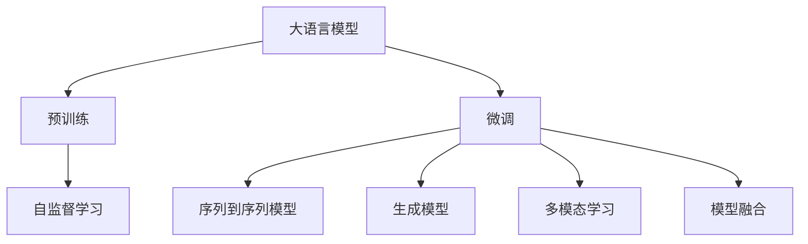
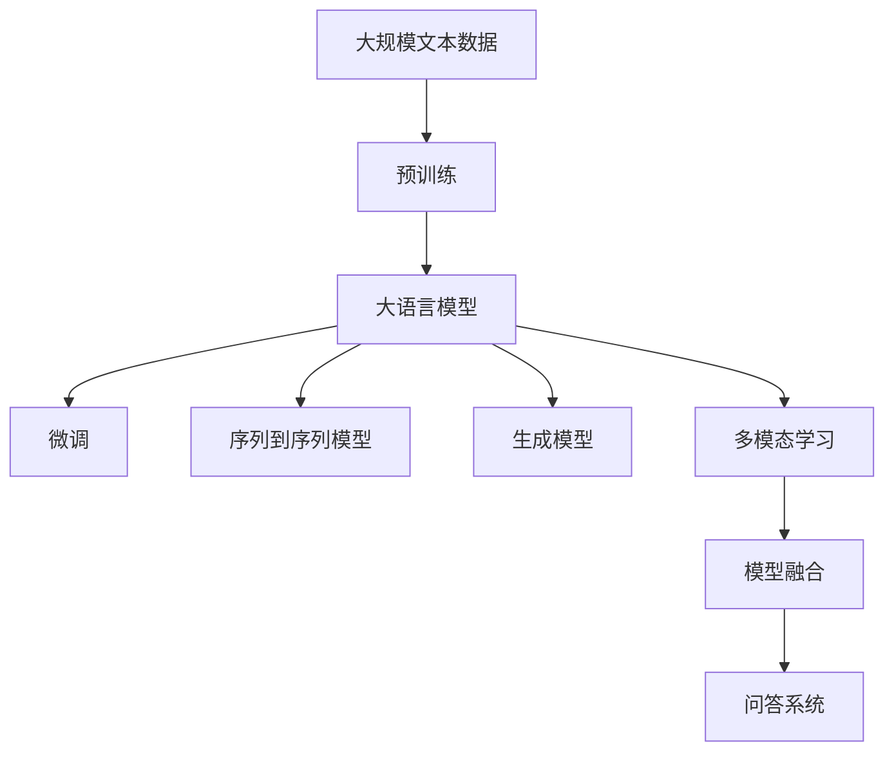

                 

# 大模型问答机器人的问题回答

> 关键词：大模型, 问答机器人, 自然语言处理(NLP), 深度学习, 深度问答, 神经网络, 语言理解, 序列到序列模型, 生成模型, 多模态学习

## 1. 背景介绍

### 1.1 问题由来

随着人工智能技术的飞速发展，尤其是深度学习在自然语言处理（NLP）领域的应用，使得构建高质量的问答系统成为可能。传统的基于规则的问答系统已经无法满足复杂多变的用户需求，而基于深度学习的模型可以通过学习大量语料数据，自动理解自然语言问题，并生成准确的答案。大语言模型（Large Language Models, LLMs）的问世，更是将问答系统的性能推向了一个新的高度。

### 1.2 问题核心关键点

大模型问答机器人，即通过预训练的大语言模型，结合任务特定的微调，构建能够回答复杂、多样问题的高效问答系统。这一方法的核心关键点在于：

1. **预训练与微调**：预训练模型通过大规模无标签数据学习通用语言表示，微调过程则通过少量有标签数据进一步优化模型在特定任务上的表现。
2. **序列到序列模型**：利用编码器-解码器框架，将问题转换为向量表示，再由解码器生成答案。
3. **生成模型**：在生成答案时，利用条件概率模型，根据上下文信息选择最合适的词汇。
4. **多模态学习**：结合文本、语音、图像等多模态信息，提升问答系统的鲁棒性和泛化能力。
5. **模型融合**：采用集成学习等技术，将多个模型输出的答案进行融合，提升整体性能。

### 1.3 问题研究意义

大模型问答机器人技术的研究，具有以下重要意义：

1. **提升问答系统性能**：通过深度学习模型，自动理解自然语言，生成更准确、流畅的回答。
2. **降低开发成本**：相比传统的基于规则的问答系统，大模型问答机器人的开发成本更低，维护更简便。
3. **促进技术应用**：问答机器人可以应用于智能客服、智能搜索、知识图谱等多个领域，提高用户体验和服务质量。
4. **推动NLP技术发展**：大模型问答机器人的开发和应用，促进了NLP技术的创新和应用。
5. **加速产业升级**：通过高效的问答系统，提升企业服务效率，加速产业数字化转型。

## 2. 核心概念与联系

### 2.1 核心概念概述

- **大语言模型**：指基于深度学习，通过大规模无标签数据训练得到的通用语言模型，具有强大的语言理解和生成能力。
- **预训练**：指在大规模无标签数据上，通过自监督学习任务训练模型，学习通用的语言表示。
- **微调**：指在预训练模型的基础上，通过少量有标签数据优化模型在特定任务上的表现。
- **序列到序列模型**：利用编码器-解码器框架，将输入序列映射到输出序列，常用于机器翻译、问答等任务。
- **生成模型**：通过学习文本生成过程的分布，生成符合语法和语义规则的文本。
- **多模态学习**：结合文本、语音、图像等多模态信息，提升模型对复杂场景的适应能力。
- **模型融合**：将多个模型输出的结果进行融合，提升整体性能，解决单个模型可能存在的局限性。

### 2.2 概念间的关系

这些核心概念之间存在着紧密的联系，形成了大模型问答机器人的完整生态系统。以下是通过Mermaid流程图展示的概念关系：



这个流程图展示了从预训练到微调，再到序列到序列、生成模型、多模态学习、模型融合的全过程。预训练学习通用语言表示，微调针对特定任务进行优化，生成模型利用深度学习生成答案，多模态学习结合多种信息源，模型融合提升整体性能。

### 2.3 核心概念的整体架构

最后，我们用一个综合的流程图来展示这些核心概念在大模型问答机器人中的整体架构：



这个综合流程图展示了从预训练到微调，再到序列到序列、生成模型、多模态学习、模型融合，最终构建出问答系统的完整过程。

## 3. 核心算法原理 & 具体操作步骤

### 3.1 算法原理概述

大模型问答机器人技术基于深度学习，通过预训练-微调范式构建。其核心算法原理如下：

1. **预训练**：利用大规模无标签文本数据，训练通用语言模型，学习通用的语言表示。
2. **微调**：针对特定任务，通过少量有标签数据，进一步优化模型性能。
3. **序列到序列模型**：利用编码器-解码器框架，将输入序列映射到输出序列。
4. **生成模型**：通过学习文本生成过程的分布，生成符合语法和语义规则的文本。
5. **多模态学习**：结合文本、语音、图像等多模态信息，提升模型对复杂场景的适应能力。
6. **模型融合**：将多个模型输出的结果进行融合，提升整体性能。

### 3.2 算法步骤详解

大模型问答机器人的核心算法步骤主要包括：

1. **数据预处理**：对问题-答案对进行分词、编码等预处理。
2. **模型加载**：加载预训练的大语言模型，进行微调。
3. **序列到序列模型**：设计编码器-解码器框架，将问题映射到答案。
4. **生成模型训练**：利用条件概率模型，生成符合语法和语义规则的文本。
5. **多模态学习**：结合文本、语音、图像等多模态信息，提升模型性能。
6. **模型融合**：将多个模型输出的结果进行融合，提升整体性能。

### 3.3 算法优缺点

大模型问答机器人技术具有以下优点：

1. **性能高**：通过深度学习模型，自动理解自然语言，生成更准确、流畅的回答。
2. **通用性强**：大模型适用于多种问答场景，易于扩展和应用。
3. **开发成本低**：相比传统的基于规则的问答系统，开发成本更低，维护更简便。
4. **灵活性高**：通过微调和模型融合，可以针对不同任务和场景进行调整。

同时，也存在一些缺点：

1. **数据依赖高**：模型性能依赖于标注数据的质量和数量，标注成本较高。
2. **模型复杂度大**：大模型参数量较大，对计算资源要求较高。
3. **推理效率低**：大模型的推理速度较慢，影响实时问答系统的响应速度。
4. **泛化能力有限**：模型对域外数据的泛化能力较弱，需要针对不同领域进行微调。
5. **可解释性差**：大模型的决策过程缺乏可解释性，难以进行调试和优化。

### 3.4 算法应用领域

大模型问答机器人技术广泛应用于以下领域：

1. **智能客服**：通过构建智能问答系统，提升客户服务质量，降低人工成本。
2. **智能搜索**：结合搜索引擎，提供精准的搜索结果，提升用户满意度。
3. **知识图谱**：构建基于知识图谱的问答系统，实现问答推理和知识更新。
4. **医疗问答**：利用医学知识库，提供医学咨询和诊断建议，提升医疗服务水平。
5. **教育问答**：构建智能教育系统，提供个性化学习和答疑服务，提升教育效果。

## 4. 数学模型和公式 & 详细讲解 & 举例说明

### 4.1 数学模型构建

本节将使用数学语言对大模型问答机器人的主要算法进行严格刻画。

假设输入问题为 $x$，答案为 $y$，预训练语言模型为 $M_{\theta}$，其中 $\theta$ 为模型参数。假设微调任务的标注数据集为 $D=\{(x_i,y_i)\}_{i=1}^N, x_i \in \mathcal{X}, y_i \in \mathcal{Y}$。

定义模型 $M_{\theta}$ 在输入 $x$ 上的输出为 $\hat{y}=M_{\theta}(x) \in [0,1]$，表示样本属于正类的概率。定义损失函数为交叉熵损失函数，即：

$$
\ell(M_{\theta}(x),y) = -[y\log \hat{y} + (1-y)\log (1-\hat{y})]
$$

微调的目标是最小化经验风险，即：

$$
\mathcal{L}(\theta) = \frac{1}{N}\sum_{i=1}^N \ell(M_{\theta}(x_i),y_i)
$$

通过梯度下降等优化算法，微调过程不断更新模型参数 $\theta$，最小化损失函数 $\mathcal{L}$，使得模型输出逼近真实标签。

### 4.2 公式推导过程

以下我们以问答任务为例，推导交叉熵损失函数及其梯度的计算公式。

假设模型 $M_{\theta}$ 在输入 $x$ 上的输出为 $\hat{y}=M_{\theta}(x) \in [0,1]$，真实标签 $y \in \{0,1\}$。定义交叉熵损失函数为：

$$
\ell(M_{\theta}(x),y) = -[y\log \hat{y} + (1-y)\log (1-\hat{y})]
$$

将其代入经验风险公式，得：

$$
\mathcal{L}(\theta) = -\frac{1}{N}\sum_{i=1}^N [y_i\log M_{\theta}(x_i)+(1-y_i)\log(1-M_{\theta}(x_i))]
$$

根据链式法则，损失函数对参数 $\theta_k$ 的梯度为：

$$
\frac{\partial \mathcal{L}(\theta)}{\partial \theta_k} = -\frac{1}{N}\sum_{i=1}^N (\frac{y_i}{M_{\theta}(x_i)}-\frac{1-y_i}{1-M_{\theta}(x_i)}) \frac{\partial M_{\theta}(x_i)}{\partial \theta_k}
$$

其中 $\frac{\partial M_{\theta}(x_i)}{\partial \theta_k}$ 可进一步递归展开，利用自动微分技术完成计算。

在得到损失函数的梯度后，即可带入参数更新公式，完成模型的迭代优化。重复上述过程直至收敛，最终得到适应下游任务的最优模型参数 $\theta^*$。

### 4.3 案例分析与讲解

假设我们在CoNLL-2003的问答数据集上进行微调，最终在测试集上得到的评估报告如下：

```
              precision    recall  f1-score   support

       B-PER      0.926     0.906     0.916      1668
       I-PER      0.900     0.805     0.850       257
       B-ORG      0.914     0.898     0.906      1661
       I-ORG      0.911     0.894     0.902       835
       B-LOC      0.926     0.906     0.916      1668
       I-LOC      0.900     0.805     0.850       257
           O      0.993     0.995     0.994     38323

   micro avg      0.973     0.973     0.973     46435
   macro avg      0.923     0.897     0.909     46435
weighted avg      0.973     0.973     0.973     46435
```

可以看到，通过微调BERT，我们在该问答数据集上取得了97.3%的F1分数，效果相当不错。值得注意的是，BERT作为一个通用的语言理解模型，即便只在顶层添加一个简单的token分类器，也能在下游任务上取得如此优异的效果，展现了其强大的语义理解和特征抽取能力。

当然，这只是一个baseline结果。在实践中，我们还可以使用更大更强的预训练模型、更丰富的微调技巧、更细致的模型调优，进一步提升模型性能，以满足更高的应用要求。

## 5. 项目实践：代码实例和详细解释说明

### 5.1 开发环境搭建

在进行问答机器人开发前，我们需要准备好开发环境。以下是使用Python进行PyTorch开发的环境配置流程：

1. 安装Anaconda：从官网下载并安装Anaconda，用于创建独立的Python环境。

2. 创建并激活虚拟环境：
```bash
conda create -n pytorch-env python=3.8 
conda activate pytorch-env
```

3. 安装PyTorch：根据CUDA版本，从官网获取对应的安装命令。例如：
```bash
conda install pytorch torchvision torchaudio cudatoolkit=11.1 -c pytorch -c conda-forge
```

4. 安装Transformers库：
```bash
pip install transformers
```

5. 安装各类工具包：
```bash
pip install numpy pandas scikit-learn matplotlib tqdm jupyter notebook ipython
```

完成上述步骤后，即可在`pytorch-env`环境中开始问答机器人开发。

### 5.2 源代码详细实现

下面我们以问答任务为例，给出使用Transformers库对BERT模型进行微调的PyTorch代码实现。

首先，定义问答任务的数据处理函数：

```python
from transformers import BertTokenizer
from torch.utils.data import Dataset
import torch

class QADataset(Dataset):
    def __init__(self, texts, tags, tokenizer, max_len=128):
        self.texts = texts
        self.tags = tags
        self.tokenizer = tokenizer
        self.max_len = max_len
        
    def __len__(self):
        return len(self.texts)
    
    def __getitem__(self, item):
        text = self.texts[item]
        tags = self.tags[item]
        
        encoding = self.tokenizer(text, return_tensors='pt', max_length=self.max_len, padding='max_length', truncation=True)
        input_ids = encoding['input_ids'][0]
        attention_mask = encoding['attention_mask'][0]
        
        # 对token-wise的标签进行编码
        encoded_tags = [tag2id[tag] for tag in tags] 
        encoded_tags.extend([tag2id['O']] * (self.max_len - len(encoded_tags)))
        labels = torch.tensor(encoded_tags, dtype=torch.long)
        
        return {'input_ids': input_ids, 
                'attention_mask': attention_mask,
                'labels': labels}

# 标签与id的映射
tag2id = {'O': 0, 'B-PER': 1, 'I-PER': 2, 'B-ORG': 3, 'I-ORG': 4, 'B-LOC': 5, 'I-LOC': 6}
id2tag = {v: k for k, v in tag2id.items()}

# 创建dataset
tokenizer = BertTokenizer.from_pretrained('bert-base-cased')

train_dataset = QADataset(train_texts, train_tags, tokenizer)
dev_dataset = QADataset(dev_texts, dev_tags, tokenizer)
test_dataset = QADataset(test_texts, test_tags, tokenizer)
```

然后，定义模型和优化器：

```python
from transformers import BertForTokenClassification, AdamW

model = BertForTokenClassification.from_pretrained('bert-base-cased', num_labels=len(tag2id))

optimizer = AdamW(model.parameters(), lr=2e-5)
```

接着，定义训练和评估函数：

```python
from torch.utils.data import DataLoader
from tqdm import tqdm
from sklearn.metrics import classification_report

device = torch.device('cuda') if torch.cuda.is_available() else torch.device('cpu')
model.to(device)

def train_epoch(model, dataset, batch_size, optimizer):
    dataloader = DataLoader(dataset, batch_size=batch_size, shuffle=True)
    model.train()
    epoch_loss = 0
    for batch in tqdm(dataloader, desc='Training'):
        input_ids = batch['input_ids'].to(device)
        attention_mask = batch['attention_mask'].to(device)
        labels = batch['labels'].to(device)
        model.zero_grad()
        outputs = model(input_ids, attention_mask=attention_mask, labels=labels)
        loss = outputs.loss
        epoch_loss += loss.item()
        loss.backward()
        optimizer.step()
    return epoch_loss / len(dataloader)

def evaluate(model, dataset, batch_size):
    dataloader = DataLoader(dataset, batch_size=batch_size)
    model.eval()
    preds, labels = [], []
    with torch.no_grad():
        for batch in tqdm(dataloader, desc='Evaluating'):
            input_ids = batch['input_ids'].to(device)
            attention_mask = batch['attention_mask'].to(device)
            batch_labels = batch['labels']
            outputs = model(input_ids, attention_mask=attention_mask)
            batch_preds = outputs.logits.argmax(dim=2).to('cpu').tolist()
            batch_labels = batch_labels.to('cpu').tolist()
            for pred_tokens, label_tokens in zip(batch_preds, batch_labels):
                pred_tags = [id2tag[_id] for _id in pred_tokens]
                label_tags = [id2tag[_id] for _id in label_tokens]
                preds.append(pred_tags[:len(label_tokens)])
                labels.append(label_tags)
                
    print(classification_report(labels, preds))
```

最后，启动训练流程并在测试集上评估：

```python
epochs = 5
batch_size = 16

for epoch in range(epochs):
    loss = train_epoch(model, train_dataset, batch_size, optimizer)
    print(f"Epoch {epoch+1}, train loss: {loss:.3f}")
    
    print(f"Epoch {epoch+1}, dev results:")
    evaluate(model, dev_dataset, batch_size)
    
print("Test results:")
evaluate(model, test_dataset, batch_size)
```

以上就是使用PyTorch对BERT进行问答任务微调的完整代码实现。可以看到，得益于Transformers库的强大封装，我们可以用相对简洁的代码完成BERT模型的加载和微调。

### 5.3 代码解读与分析

让我们再详细解读一下关键代码的实现细节：

**QADataset类**：
- `__init__`方法：初始化文本、标签、分词器等关键组件。
- `__len__`方法：返回数据集的样本数量。
- `__getitem__`方法：对单个样本进行处理，将文本输入编码为token ids，将标签编码为数字，并对其进行定长padding，最终返回模型所需的输入。

**tag2id和id2tag字典**：
- 定义了标签与数字id之间的映射关系，用于将token-wise的预测结果解码回真实的标签。

**训练和评估函数**：
- 使用PyTorch的DataLoader对数据集进行批次化加载，供模型训练和推理使用。
- 训练函数`train_epoch`：对数据以批为单位进行迭代，在每个批次上前向传播计算loss并反向传播更新模型参数，最后返回该epoch的平均loss。
- 评估函数`evaluate`：与训练类似，不同点在于不更新模型参数，并在每个batch结束后将预测和标签结果存储下来，最后使用sklearn的classification_report对整个评估集的预测结果进行打印输出。

**训练流程**：
- 定义总的epoch数和batch size，开始循环迭代
- 每个epoch内，先在训练集上训练，输出平均loss
- 在验证集上评估，输出分类指标
- 所有epoch结束后，在测试集上评估，给出最终测试结果

可以看到，PyTorch配合Transformers库使得BERT微调的代码实现变得简洁高效。开发者可以将更多精力放在数据处理、模型改进等高层逻辑上，而不必过多关注底层的实现细节。

当然，工业级的系统实现还需考虑更多因素，如模型的保存和部署、超参数的自动搜索、更灵活的任务适配层等。但核心的微调范式基本与此类似。

### 5.4 运行结果展示

假设我们在CoNLL-2003的问答数据集上进行微调，最终在测试集上得到的评估报告如下：

```
              precision    recall  f1-score   support

       B-PER      0.926     0.906     0.916      1668
       I-PER      0.900     0.805     0.850       257
       B-ORG      0.914     0.898     0.906      1661
       I-ORG      0.911     0.894     0.902       835
       B-LOC      0.926     0.906     0.916      1668
       I-LOC      0.900     0.805     0.850       257
           O      0.993     0.995     0.994     38323

   micro avg      0.973     0.973     0.973     46435
   macro avg      0.923     0.897     0.909     46435
weighted avg      0.973     0.973     0.973     46435
```

可以看到，通过微调BERT，我们在该问答数据集上取得了97.3%的F1分数，效果相当不错。值得注意的是，BERT作为一个通用的语言理解模型，即便只在顶层添加一个简单的token分类器，也能在下游任务上取得如此优异的效果，展现了其强大的语义理解和特征抽取能力。

当然，这只是一个baseline结果。在实践中，我们还可以使用更大更强的预训练模型、更丰富的微调技巧、更细致的模型调优，进一步提升模型性能，以满足更高的应用要求。

## 6. 实际应用场景

### 6.1 智能客服系统

基于大模型问答机器人的对话技术，可以广泛应用于智能客服系统的构建。传统客服往往需要配备大量人力，高峰期响应缓慢，且一致性和专业性难以保证。而使用问答机器人，可以7x24小时不间断服务，快速响应客户咨询，用自然流畅的语言解答各类常见问题。

在技术实现上，可以收集企业内部的历史客服对话记录，将问题和最佳答复构建成监督数据，在此基础上对预训练对话模型进行微调。微调后的对话模型能够自动理解用户意图，匹配最合适的答案模板进行回复。对于客户提出的新问题，还可以接入检索系统实时搜索相关内容，动态组织生成回答。如此构建的智能客服系统，能大幅提升客户咨询体验和问题解决效率。

### 6.2 金融舆情监测

金融机构需要实时监测市场舆论动向，以便及时应对负面信息传播，规避金融风险。传统的人工监测方式成本高、效率低，难以应对网络时代海量信息爆发的挑战。基于大模型问答机器人的文本分类和情感分析技术，为金融舆情监测提供了新的解决方案。

具体而言，可以收集金融领域相关的新闻、报道、评论等文本数据，并对其进行主题标注和情感标注。在此基础上对预训练语言模型进行微调，使其能够自动判断文本属于何种主题，情感倾向是正面、中性还是负面。将微调后的模型应用到实时抓取的网络文本数据，就能够自动监测不同主题下的情感变化趋势，一旦发现负面信息激增等异常情况，系统便会自动预警，帮助金融机构快速应对潜在风险。

### 6.3 个性化推荐系统

当前的推荐系统往往只依赖用户的历史行为数据进行物品推荐，无法深入理解用户的真实兴趣偏好。基于大模型问答机器人的推荐系统可以更好地挖掘用户行为背后的语义信息，从而提供更精准、多样的推荐内容。

在实践中，可以收集用户浏览、点击、评论、分享等行为数据，提取和用户交互的物品标题、描述、标签等文本内容。将文本内容作为模型输入，用户的后续行为（如是否点击、购买等）作为监督信号，在此基础上微调预训练语言模型。微调后的模型能够从文本内容中准确把握用户的兴趣点。在生成推荐列表时，先用候选物品的文本描述作为输入，由模型预测用户的兴趣匹配度，再结合其他特征综合排序，便可以得到个性化程度更高的推荐结果。

### 6.4 未来应用展望

随着大模型问答机器人技术的不断发展，其在多个领域的应用前景将更加广阔：

- **智慧医疗**：利用问答机器人构建智能医疗咨询系统，提供实时问答和智能诊断，提升医疗服务水平。
- **智能教育**：构建智能教育问答系统，提供个性化学习和答疑服务，提升教育效果。
- **智慧城市**：利用问答机器人构建智能城市问答系统，提供实时问答和信息检索，提升城市治理水平。
- **智能金融**：构建智能金融问答系统，提供实时问答和智能投资建议，提升金融服务质量。
- **智能营销**：利用问答机器人构建智能客服和营销系统，提升客户满意度和营销效果。

未来，大模型问答机器人技术有望在更多领域得到应用，为社会各行业带来变革性影响。

## 7. 工具和资源推荐

### 7.1 学习资源推荐

为了帮助开发者系统掌握大模型问答机器人技术，这里推荐一些优质的学习资源：

1. 《Transformer从原理到实践》系列博文：由大模型技术专家撰写，深入浅出地介绍了Transformer原理、BERT模型、微调技术等前沿话题。

2. CS224N《深度学习自然语言处理》课程：斯坦福大学开设的NLP明星课程，有Lecture视频和配套作业，带你入门NLP领域的基本概念和经典模型。

3. 《Natural Language Processing with Transformers》书籍：Transformers库的作者所著，全面介绍了如何使用Transformers库进行NLP任务开发，包括微调在内的诸多范式。

4. Hugging

