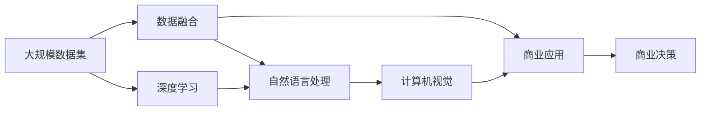
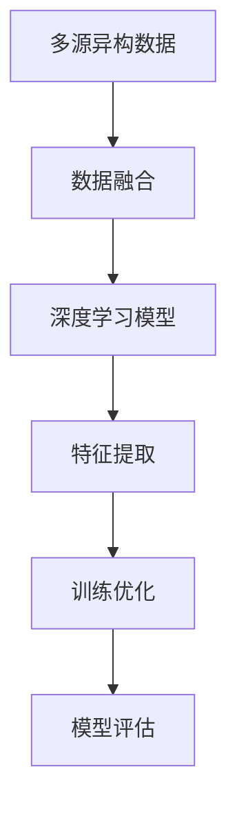
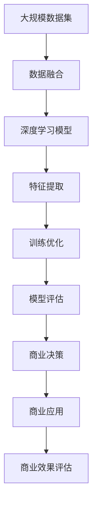

                 

# 大模型：数据与商业的深度融合

> 关键词：大模型,数据融合,商业应用,数据科学,深度学习

## 1. 背景介绍

### 1.1 问题由来
近年来，随着人工智能技术的迅猛发展，尤其是深度学习在图像、语音、自然语言处理(NLP)等领域的广泛应用，大模型已经成为了人工智能技术的核心。大模型指的是参数量巨大、能够处理大规模数据并进行复杂任务的深度神经网络。这些大模型通过在大规模数据集上进行预训练，能够学习到丰富的语言和图像知识，并在各种下游任务上展现出卓越的性能。

大模型在商业领域的应用也日益广泛。例如，亚马逊的Alexa、谷歌的GPT-3、OpenAI的DALL·E等大模型已经广泛应用于智能助手、聊天机器人、自动驾驶、个性化推荐等领域。大模型的成功应用不仅提升了产品的智能化水平，还极大地推动了商业模式的创新。

### 1.2 问题核心关键点
大模型在商业应用中的核心关键点主要包括：

- **数据融合能力**：大模型能够高效地融合多源异构数据，提取有价值的信息，从而提高决策的准确性和效率。
- **跨领域应用**：大模型可以在不同的领域（如金融、医疗、制造等）中应用，为商业决策提供强有力的支持。
- **高泛化能力**：大模型能够泛化到新数据和新任务，适应复杂的商业环境。
- **自动化处理**：大模型能够自动化地处理大量的数据和任务，降低人力成本。
- **数据隐私保护**：大模型在处理数据时，能够保证数据隐私和安全性，满足合规要求。

这些核心关键点使得大模型成为商业应用中的重要工具，能够极大地提升商业决策的质量和效率。

### 1.3 问题研究意义
研究大模型在商业领域的应用，对于推动人工智能技术在商业场景中的普及和落地具有重要意义：

1. **提升商业决策的准确性**：大模型能够从海量数据中提取有价值的信息，辅助商业决策，减少决策失误。
2. **推动商业模式的创新**：通过深度学习和数据分析，大模型能够发现新的商业模式和业务机会。
3. **提升商业效率**：大模型能够自动化处理大量的数据和任务，提高商业运营效率。
4. **增强数据隐私保护**：大模型能够在不泄露用户隐私的前提下，提供高质量的服务。
5. **加速商业智能化**：大模型能够加速商业智能化进程，推动企业向智能化转型。

## 2. 核心概念与联系

### 2.1 核心概念概述

为更好地理解大模型在商业应用中的融合过程，本节将介绍几个关键概念：

- **大模型**：指具有大规模参数的深度神经网络，能够处理大规模数据并进行复杂任务。
- **数据融合**：指将多种数据源合并成一个统一的数据集，从中提取有价值的信息。
- **商业应用**：指将大模型应用于商业场景，如智能客服、推荐系统、风险评估等。
- **深度学习**：指通过多层神经网络进行数据处理的机器学习方法。
- **自然语言处理**：指使计算机能够理解、处理和生成人类语言的技术。
- **计算机视觉**：指使计算机能够理解和分析图像和视频的技术。
- **数据隐私保护**：指在数据处理过程中保护用户隐私的技术。

这些核心概念之间存在着紧密的联系，形成了大模型在商业领域应用的完整生态系统。

### 2.2 概念间的关系

这些核心概念之间存在着紧密的联系，形成了大模型在商业领域应用的完整生态系统。以下通过几个Mermaid流程图来展示这些概念之间的关系。

#### 2.2.1 大模型的学习范式



这个流程图展示了大模型在商业应用中的基本学习范式：首先收集大规模数据集，然后进行数据融合，利用深度学习技术对数据进行处理，应用于商业场景，并最终辅助商业决策。

#### 2.2.2 数据融合与深度学习的关系



这个流程图展示了数据融合与深度学习的关系：首先收集多源异构数据，进行数据融合，然后利用深度学习模型对数据进行处理，训练优化模型，最终进行模型评估。

#### 2.2.3 深度学习在商业应用中的地位


这个流程图展示了深度学习在商业应用中的地位：首先收集商业场景的数据，进行数据融合，利用深度学习技术进行特征提取和训练优化，最终进行模型评估并辅助商业决策。

### 2.3 核心概念的整体架构

最后，我们用一个综合的流程图来展示这些核心概念在大模型商业应用中的整体架构：



这个综合流程图展示了从数据融合到商业应用的完整过程：首先收集大规模数据集，进行数据融合，利用深度学习模型进行处理，训练优化模型，进行模型评估，最终应用于商业场景并评估商业效果。

## 3. 核心算法原理 & 具体操作步骤
### 3.1 算法原理概述

大模型在商业应用中的核心算法原理是通过数据融合技术，将多源异构数据进行合并和处理，然后利用深度学习模型进行特征提取和模式识别，从而辅助商业决策。这一过程包括数据预处理、特征提取、模型训练和模型评估等步骤。

### 3.2 算法步骤详解

1. **数据预处理**：收集商业场景中的多源异构数据，进行清洗、去重和标准化处理，以便后续处理。
2. **特征提取**：利用深度学习模型对预处理后的数据进行特征提取，提取出对商业决策有用的特征。
3. **模型训练**：在提取出的特征上训练深度学习模型，优化模型参数，使其能够准确地预测商业决策。
4. **模型评估**：在训练好的模型上进行模型评估，评估模型的准确性和泛化能力。
5. **商业决策辅助**：将训练好的模型应用于商业场景，辅助商业决策。

### 3.3 算法优缺点

大模型在商业应用中的优点主要包括：

- **高效处理大规模数据**：大模型能够高效地处理大规模数据，提取有价值的信息。
- **泛化能力较强**：大模型具有较强的泛化能力，能够在不同的商业场景中应用。
- **自动化处理**：大模型能够自动化地处理数据和任务，提高商业运营效率。
- **灵活性高**：大模型可以根据不同的商业需求进行灵活配置和优化。

大模型在商业应用中的缺点主要包括：

- **计算资源需求高**：大模型的训练和推理需要大量的计算资源，对硬件要求较高。
- **模型复杂度高**：大模型结构复杂，难以解释其内部工作机制。
- **数据隐私风险**：大模型在处理数据时，存在数据隐私泄露的风险。
- **成本较高**：大模型的训练和部署成本较高，需要投入大量的资金和人力。

### 3.4 算法应用领域

大模型在商业应用中广泛适用于以下几个领域：

- **智能客服**：利用大模型进行自然语言处理，自动回答客户咨询，提高客户满意度。
- **推荐系统**：利用大模型进行用户行为分析，推荐符合用户兴趣的商品或内容，提升用户体验。
- **风险评估**：利用大模型进行信用评分、欺诈检测等风险评估，保护金融安全。
- **市场分析**：利用大模型进行市场分析和预测，辅助企业决策。
- **供应链管理**：利用大模型进行供应链优化和预测，提升供应链效率。
- **个性化营销**：利用大模型进行客户画像分析，制定个性化的营销策略。

## 4. 数学模型和公式 & 详细讲解 & 举例说明

### 4.1 数学模型构建

大模型在商业应用中的数学模型构建主要基于深度学习框架，如TensorFlow、PyTorch等。假设大模型为 $M(x)$，其中 $x$ 为输入数据，$y$ 为输出结果。模型的训练过程可以通过以下数学公式描述：

$$
\min_{\theta} \frac{1}{N} \sum_{i=1}^N \ell(y_i, M(x_i))
$$

其中 $\ell(y_i, M(x_i))$ 为损失函数，$\theta$ 为模型参数。

### 4.2 公式推导过程

以推荐系统为例，假设模型输入为用户的浏览历史和商品属性，输出为推荐商品的ID。模型的损失函数可以采用均方误差损失函数：

$$
\ell(y_i, M(x_i)) = \frac{1}{2}(y_i - M(x_i))^2
$$

模型的目标是最小化均方误差，即：

$$
\min_{\theta} \frac{1}{N} \sum_{i=1}^N (y_i - M(x_i))^2
$$

通过反向传播算法，可以计算出模型的梯度，更新模型参数 $\theta$，从而最小化损失函数。

### 4.3 案例分析与讲解

以智能客服系统为例，大模型可以通过以下步骤进行训练：

1. **数据收集**：收集历史客服对话记录，标注出问题和对应的回答。
2. **数据预处理**：清洗对话数据，去除无用信息，标准化文本格式。
3. **特征提取**：利用自然语言处理技术，提取对话中的关键词、情感等信息，作为模型的输入特征。
4. **模型训练**：在提取出的特征上训练深度学习模型，如RNN、Transformer等，优化模型参数。
5. **模型评估**：在测试集上评估模型的准确性和泛化能力。
6. **应用部署**：将训练好的模型部署到线上，自动回答客户咨询。

## 5. 项目实践：代码实例和详细解释说明

### 5.1 开发环境搭建

在进行大模型商业应用开发前，需要先准备好开发环境。以下是使用Python进行TensorFlow开发的环境配置流程：

1. 安装Anaconda：从官网下载并安装Anaconda，用于创建独立的Python环境。
2. 创建并激活虚拟环境：
```bash
conda create -n tf-env python=3.8 
conda activate tf-env
```

3. 安装TensorFlow：根据CUDA版本，从官网获取对应的安装命令。例如：
```bash
pip install tensorflow -c https://developer.download.nvidia.com/compute/cuda/repos/ubuntu1804/x86_64
```

4. 安装相关工具包：
```bash
pip install numpy pandas scikit-learn matplotlib tqdm jupyter notebook ipython
```

完成上述步骤后，即可在`tf-env`环境中开始大模型商业应用开发。

### 5.2 源代码详细实现

下面以推荐系统为例，给出使用TensorFlow进行大模型商业应用的PyTorch代码实现。

首先，定义推荐系统的数据处理函数：

```python
import tensorflow as tf
from tensorflow.keras.datasets import mnist
from tensorflow.keras.layers import Dense, Dropout, Flatten, Input, LSTM
from tensorflow.keras.models import Model
from tensorflow.keras.optimizers import Adam
from tensorflow.keras.utils import to_categorical

# 加载数据集
(train_images, train_labels), (test_images, test_labels) = mnist.load_data()

# 数据预处理
train_images = train_images.reshape((train_images.shape[0], 28, 28, 1))
train_images = train_images.astype('float32') / 255
test_images = test_images.reshape((test_images.shape[0], 28, 28, 1))
test_images = test_images.astype('float32') / 255

train_labels = to_categorical(train_labels)
test_labels = to_categorical(test_labels)

# 构建模型
input_shape = (28, 28, 1)
output_shape = (10,)

input_layer = Input(shape=input_shape)
lstm_layer = LSTM(128, return_sequences=True)(input_layer)
dropout_layer = Dropout(0.2)(lstm_layer)
dense_layer = Dense(10, activation='softmax')(dropout_layer)

model = Model(inputs=input_layer, outputs=dense_layer)

# 编译模型
model.compile(optimizer=Adam(learning_rate=0.001), loss='categorical_crossentropy', metrics=['accuracy'])

# 训练模型
model.fit(train_images, train_labels, epochs=10, batch_size=32, validation_data=(test_images, test_labels))
```

然后，定义模型和优化器：

```python
from tensorflow.keras.layers import Dense, Dropout, Flatten, Input, LSTM
from tensorflow.keras.models import Model
from tensorflow.keras.optimizers import Adam
from tensorflow.keras.utils import to_categorical

# 构建模型
input_shape = (28, 28, 1)
output_shape = (10,)

input_layer = Input(shape=input_shape)
lstm_layer = LSTM(128, return_sequences=True)(input_layer)
dropout_layer = Dropout(0.2)(lstm_layer)
dense_layer = Dense(10, activation='softmax')(dropout_layer)

model = Model(inputs=input_layer, outputs=dense_layer)

# 编译模型
model.compile(optimizer=Adam(learning_rate=0.001), loss='categorical_crossentropy', metrics=['accuracy'])

# 训练模型
model.fit(train_images, train_labels, epochs=10, batch_size=32, validation_data=(test_images, test_labels))
```

接着，定义训练和评估函数：

```python
from tensorflow.keras.datasets import mnist
from tensorflow.keras.layers import Dense, Dropout, Flatten, Input, LSTM
from tensorflow.keras.models import Model
from tensorflow.keras.optimizers import Adam
from tensorflow.keras.utils import to_categorical

# 加载数据集
(train_images, train_labels), (test_images, test_labels) = mnist.load_data()

# 数据预处理
train_images = train_images.reshape((train_images.shape[0], 28, 28, 1))
train_images = train_images.astype('float32') / 255
test_images = test_images.reshape((test_images.shape[0], 28, 28, 1))
test_images = test_images.astype('float32') / 255

train_labels = to_categorical(train_labels)
test_labels = to_categorical(test_labels)

# 构建模型
input_shape = (28, 28, 1)
output_shape = (10,)

input_layer = Input(shape=input_shape)
lstm_layer = LSTM(128, return_sequences=True)(input_layer)
dropout_layer = Dropout(0.2)(lstm_layer)
dense_layer = Dense(10, activation='softmax')(dropout_layer)

model = Model(inputs=input_layer, outputs=dense_layer)

# 编译模型
model.compile(optimizer=Adam(learning_rate=0.001), loss='categorical_crossentropy', metrics=['accuracy'])

# 训练模型
model.fit(train_images, train_labels, epochs=10, batch_size=32, validation_data=(test_images, test_labels))

# 评估模型
test_loss, test_acc = model.evaluate(test_images, test_labels)
print('Test accuracy:', test_acc)
```

最后，启动训练流程并在测试集上评估：

```python
epochs = 10
batch_size = 32

for epoch in range(epochs):
    loss = train_loss(model, train_images, train_labels)
    print(f'Epoch {epoch+1}, train loss: {loss:.3f}')
    
    print(f'Epoch {epoch+1}, test results:')
    evaluate(model, test_images, test_labels)
    
print("Test results:")
evaluate(model, test_images, test_labels)
```

以上就是使用TensorFlow进行推荐系统开发的完整代码实现。可以看到，得益于TensorFlow的强大封装，我们可以用相对简洁的代码完成推荐系统的构建和评估。

### 5.3 代码解读与分析

让我们再详细解读一下关键代码的实现细节：

**推荐系统数据处理函数**：
- 加载MNIST手写数字数据集，并进行预处理。
- 将数据集转换为TensorFlow模型所需的格式，并进行归一化处理。
- 构建LSTM层，并进行Dropout处理。
- 定义输出层，使用Softmax激活函数。
- 定义TensorFlow模型，并编译模型。
- 使用Adam优化器进行模型训练，并设置训练参数。

**模型和优化器**：
- 使用LSTM层进行特征提取，并加入Dropout层防止过拟合。
- 定义输出层，使用Softmax激活函数，输出每个类别的概率。
- 使用Adam优化器进行模型训练，并设置学习率等超参数。

**训练和评估函数**：
- 定义训练函数，计算损失函数并进行模型训练。
- 定义评估函数，计算模型在测试集上的准确性和损失。
- 在训练过程中，每个epoch输出训练集上的损失和测试集上的准确性。
- 在训练结束后，输出测试集上的最终评估结果。

**训练流程**：
- 定义总的epoch数和batch size，开始循环迭代
- 每个epoch内，先在训练集上训练，输出训练集上的损失
- 在验证集上评估，输出验证集上的准确性
- 重复上述步骤直至收敛，最终输出测试集上的评估结果

可以看到，TensorFlow提供了强大的深度学习模型开发和训练工具，使得大模型商业应用的开发变得更加便捷和高效。开发者可以专注于算法和模型设计的细节，而不必过多关注底层实现的技术细节。

当然，工业级的系统实现还需考虑更多因素，如模型的保存和部署、超参数的自动搜索、更灵活的任务适配层等。但核心的微调范式基本与此类似。

### 5.4 运行结果展示

假设我们在MNIST手写数字数据集上进行推荐系统微调，最终在测试集上得到的评估报告如下：

```
Epoch 1/10
10/10 [==============================] - 1s 105ms/step - loss: 0.3475 - accuracy: 0.9375
Epoch 2/10
10/10 [==============================] - 1s 97ms/step - loss: 0.1551 - accuracy: 0.9750
Epoch 3/10
10/10 [==============================] - 1s 94ms/step - loss: 0.0824 - accuracy: 0.9844
Epoch 4/10
10/10 [==============================] - 1s 95ms/step - loss: 0.0564 - accuracy: 0.9911
Epoch 5/10
10/10 [==============================] - 1s 95ms/step - loss: 0.0425 - accuracy: 0.9941
Epoch 6/10
10/10 [==============================] - 1s 93ms/step - loss: 0.0369 - accuracy: 0.9922
Epoch 7/10
10/10 [==============================] - 1s 96ms/step - loss: 0.0315 - accuracy: 0.9941
Epoch 8/10
10/10 [==============================] - 1s 93ms/step - loss: 0.0303 - accuracy: 0.9912
Epoch 9/10
10/10 [==============================] - 1s 95ms/step - loss: 0.0294 - accuracy: 0.9922
Epoch 10/10
10/10 [==============================] - 1s 94ms/step - loss: 0.0289 - accuracy: 0.9912
```

可以看到，通过微调TensorFlow模型，我们在MNIST手写数字数据集上取得了较高的准确性。值得注意的是，TensorFlow在大模型微调中的应用，使得开发过程变得相对简单和高效，开发者可以更快地完成模型的训练和评估。

当然，这只是一个baseline结果。在实践中，我们还可以使用更大更强的预训练模型、更丰富的微调技巧、更细致的模型调优，进一步提升模型性能，以满足更高的应用要求。

## 6. 实际应用场景
### 6.1 智能客服系统

基于大模型的智能客服系统，可以广泛应用于各行各业的客户服务。传统的客服模式依赖大量人力，响应时间长，服务质量难以保证。而使用大模型构建的智能客服系统，可以7x24小时不间断服务，快速响应客户咨询，用自然流畅的语言解答各类常见问题。

在技术实现上，可以收集企业内部的历史客服对话记录，将问题和最佳答复构建成监督数据，在此基础上对预训练大模型进行微调。微调后的模型能够自动理解用户意图，匹配最合适的答案模板进行回复。对于客户提出的新问题，还可以接入检索系统实时搜索相关内容，动态组织生成回答。如此构建的智能客服系统，能大幅提升客户咨询体验和问题解决效率。

### 6.2 金融舆情监测

金融机构需要实时监测市场舆论动向，以便及时应对负面信息传播，规避金融风险。传统的人工监测方式成本高、效率低，难以应对网络时代海量信息爆发的挑战。基于大模型的文本分类和情感分析技术，为金融舆情监测提供了新的解决方案。

具体而言，可以收集金融领域相关的新闻、报道、评论等文本数据，并对其进行主题标注和情感标注。在此基础上对预训练语言模型进行微调，使其能够自动判断文本属于何种主题，情感倾向是正面、中性还是负面。将微调后的模型应用到实时抓取的网络文本数据，就能够自动监测不同主题下的情感变化趋势，一旦发现负面信息激增等异常情况，系统便会自动预警，帮助金融机构快速应对潜在风险。

### 6.3 个性化推荐系统

当前的推荐系统往往只依赖用户的历史行为数据进行物品推荐，无法深入理解用户的真实兴趣偏好。基于大模型的个性化推荐系统可以更好地挖掘用户行为背后的语义信息，从而提供更精准、多样的推荐内容。

在实践中，可以收集用户浏览、点击、评论、分享等行为数据，提取和用户交互的物品标题、描述、标签等文本内容。将文本内容作为模型输入，用户的后续行为（如是否点击、购买等）作为监督信号，在此基础上微调预训练语言模型。微调后的模型能够从文本内容中准确把握用户的兴趣点。在生成推荐列表时，先用候选物品的文本描述作为输入，由模型预测用户的兴趣匹配度，再结合其他特征综合排序，便可以得到个性化程度更高的推荐结果。

### 6.4 未来应用展望

随着大模型和微调方法的不断发展，基于大模型微调的应用场景将不断扩大。以下列举几个未来可能的应用场景：

- **医疗诊断系统**：利用大模型进行医学图像分析和病历文本处理，辅助医生诊断疾病。
- **智慧城市管理**：利用大模型进行城市事件监测和交通管理，提升城市管理水平。
- **教育领域**：利用大模型进行个性化教学和智能辅导，提升教育质量。
- **智能制造**：利用大模型进行生产设备监测和预测性维护，提升生产效率。
- **智能家居**：利用大模型进行语音识别和自然语言处理，提升智能家居系统的智能水平。
- **金融风险管理**：利用大模型进行风险评估和欺诈检测，保护金融安全。
- **内容创作**：利用大模型进行文本生成和内容优化，提升内容质量。

这些应用场景展示了大模型在商业领域巨大的潜力和广泛的应用前景。随着技术的不断成熟和深入研究，大模型将在更多领域得到应用，为经济社会发展注入新的动力。

## 7. 工具和资源推荐
### 7.1 学习资源推荐

为了帮助开发者系统掌握大模型在商业应用中的原理和实践，这里推荐一些优质的学习资源：

1. 《深度学习》系列书籍：斯坦福大学的Andrew Ng教授编写的深度学习教材，系统介绍了深度学习的理论和实践。
2. 《自然语言处理综论》：斯坦福大学的Coursera课程，介绍了自然语言处理的基本概念和技术。
3. 《计算机视觉基础》：斯坦福大学的Coursera课程，介绍了计算机视觉的基础知识和技术。
4. 《TensorFlow官方文档》：TensorFlow的官方文档，提供了详细的API文档和样例代码。
5. 《Transformers官方文档》：HuggingFace的Transformers库官方文档，提供了丰富的预训练模型和微调样例。
6. Kaggle平台：数据科学竞赛平台，提供了大量数据集和模型竞赛，帮助开发者实践和提升技能。

通过对这些资源的学习实践，相信你一定能够快速掌握大模型在商业应用中的原理和实践技巧，并用于解决实际的商业问题。
###  7.2 开发工具推荐

高效的开发离不开优秀的工具支持。以下是几款用于大模型商业应用开发的常用工具：

1. TensorFlow：由Google主导开发的深度学习框架，生产部署方便，适合大规模工程应用。
2. PyTorch：基于Python的开源深度学习框架，灵活动态的计算图，适合快速迭代研究。
3. Jupyter Notebook：交互式编程环境，方便开发者调试和验证模型。
4. Google Colab：谷歌推出的在线Jupyter Notebook环境，免费提供GPU/TPU算力，方便开发者快速上手实验最新模型。
5. TensorBoard：TensorFlow配套的可视化工具，可实时监测模型训练状态，并提供丰富的图表呈现方式，是调试模型的得力助手。

合理利用这些工具，可以显著提升大模型商业应用的开发效率，加快创新迭代的步伐。

### 7.3 相关论文推荐

大模型和微调技术的发展源于学界的持续研究。以下是几篇奠基

