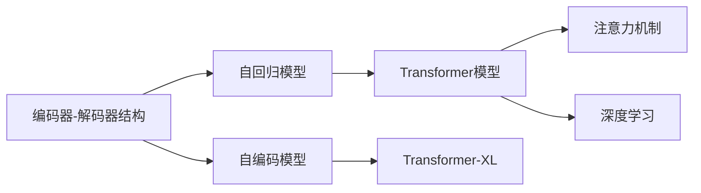
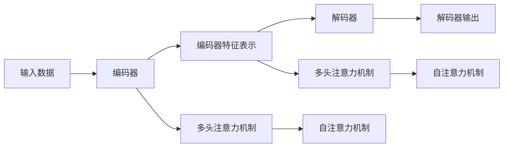
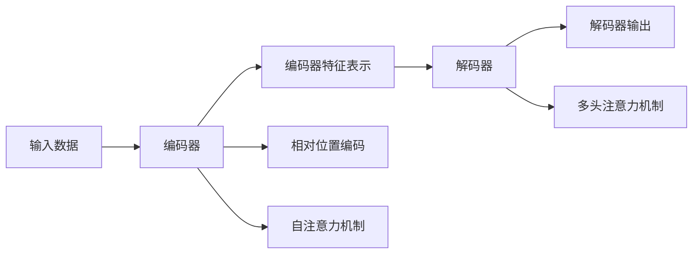
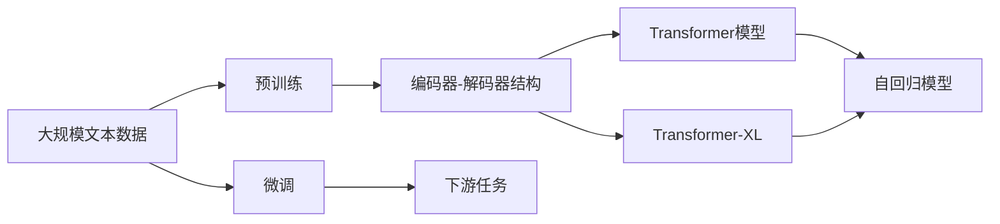

                 

# 大规模语言模型从理论到实践 编码器和解码器结构

> 关键词：大规模语言模型,编码器,解码器,自回归模型,自编码模型,Transformer模型,Transformer-XL,深度学习,NLP

## 1. 背景介绍

### 1.1 问题由来
近年来，随着深度学习技术的快速发展，尤其是自回归(如LSTM、GRU)和自编码(如VAE、GAN)模型在自然语言处理(NLP)领域取得显著进展，大规模语言模型的大规模预训练语言模型（Large Language Models, LLMs）应运而生。这些模型通过在大规模无标签文本语料上进行预训练，学习到丰富的语言知识，从而能够在特定的下游任务中取得优异的性能。

其中，以自回归模型为代表的GPT系列和以自编码模型为代表的BERT模型是最具代表性的两种预训练语言模型。前者如GPT-2、GPT-3、GPT-J等，后者如BERT、RoBERTa、XLNet等。这些模型通过在预训练过程中学习到大量的语言结构和语义信息，显著提高了后续任务的性能，尤其是在问答、摘要、翻译等任务上，效果尤为显著。

然而，尽管大规模语言模型在性能上取得了显著的进展，但其在大规模数据集上的训练成本仍然非常高昂，并且其计算复杂度也给训练带来了挑战。这使得大规模语言模型在实际应用中面临诸多限制。为了缓解这一问题，研究者提出了一种新的模型结构，即编码器-解码器结构(Encoder-Decoder Architecture)，以减少计算复杂度，并提高训练效率和模型性能。

### 1.2 问题核心关键点
编码器-解码器结构是一种常用的深度学习模型架构，广泛应用于自然语言处理(NLP)、计算机视觉(CV)和信号处理等领域。其核心思想是将输入数据分为两个部分，即编码器和解码器，分别对输入数据进行编码和解码，从而实现复杂的任务处理。

在大规模语言模型中，编码器-解码器结构具有以下特点：

1. 编码器主要负责提取输入数据的特征表示，将其转换为高维向量形式。
2. 解码器则利用编码器提取的特征向量，进行推理和生成，最终输出预测结果。
3. 编码器和解码器之间通常采用注意力机制(Attention Mechanism)进行信息交互，以提高模型的性能和灵活性。

在语言模型中，编码器通常采用自回归模型(如GPT系列)，对输入数据进行序列化的处理，并逐步推断出下一个词的概率。而解码器则采用自编码模型(如BERT系列)，对输入数据进行解码，并生成序列化的输出结果。通过将编码器和解码器结构应用于大规模语言模型中，可以显著提高模型的性能和训练效率。

### 1.3 问题研究意义
编码器-解码器结构在NLP领域的应用，为大规模语言模型的构建和优化提供了新的思路和方法。研究编码器-解码器结构在大规模语言模型中的应用，对于拓展语言模型的应用边界，提升下游任务的性能，加速NLP技术的产业化进程，具有重要意义：

1. 降低训练成本。通过编码器-解码器结构，可以显著减少大规模语言模型的训练时间，降低计算资源的需求。
2. 提高模型性能。编码器-解码器结构可以提高模型对输入数据的处理能力和泛化能力，从而提高下游任务的性能。
3. 促进技术创新。编码器-解码器结构的应用，促进了对预训练-微调模型的深入研究，催生了更多的研究方向和应用场景。
4. 加速开发进度。standing on the shoulders of giants，编码器-解码器结构的应用，可以加速NLP技术在实际应用中的落地和推广。
5. 带来技术创新。编码器-解码器结构的应用，为NLP技术带来了新的计算框架和方法，推动了技术的不断进步和迭代。

## 2. 核心概念与联系

### 2.1 核心概念概述

为更好地理解编码器-解码器结构在大规模语言模型中的应用，本节将介绍几个密切相关的核心概念：

- 编码器-解码器结构(Encoder-Decoder Architecture)：一种深度学习模型架构，广泛应用于自然语言处理(NLP)、计算机视觉(CV)和信号处理等领域。
- 自回归模型(如GPT系列)：对输入数据进行序列化的处理，逐步推断出下一个词的概率。
- 自编码模型(如BERT系列)：对输入数据进行解码，并生成序列化的输出结果。
- 注意力机制(Attention Mechanism)：用于编码器和解码器之间的信息交互，提高模型的性能和灵活性。
- Transformer模型：一种基于注意力机制的编码器-解码器结构，广泛应用于大规模语言模型的构建。
- Transformer-XL：一种改进的Transformer模型，通过引入相对位置编码和自注意力机制，进一步提升了模型性能和效率。
- 深度学习：一种通过多层次的神经网络结构，对输入数据进行学习和推理的技术。

这些核心概念之间的逻辑关系可以通过以下Mermaid流程图来展示：



这个流程图展示了大规模语言模型中的编码器-解码器结构的组成及其与其他概念之间的关系：

1. 编码器-解码器结构是深度学习模型架构的核心，用于对输入数据进行编码和解码。
2. 自回归模型和自编码模型是编码器-解码器结构中的两种重要组成部分。
3. 注意力机制是用于编码器和解码器之间的信息交互，提高模型的性能和灵活性。
4. Transformer模型和Transformer-XL是编码器-解码器结构在深度学习中的具体应用。
5. 深度学习是实现编码器-解码器结构的底层技术支持。

通过理解这些核心概念，我们可以更好地把握编码器-解码器结构在大规模语言模型中的应用，为后续深入讨论具体的模型结构和优化方法奠定基础。

### 2.2 概念间的关系

这些核心概念之间存在着紧密的联系，形成了大规模语言模型的完整的计算框架。下面通过几个Mermaid流程图来展示这些概念之间的关系。

#### 2.2.1 编码器-解码器结构的基本原理


这个流程图展示了编码器-解码器结构的基本原理：

1. 输入数据首先进入编码器，被提取为特征表示。
2. 编码器特征表示被传递到解码器，进行推理和生成。
3. 解码器的输出即为最终的预测结果。

#### 2.2.2 Transformer模型的架构



这个流程图展示了Transformer模型的基本架构：

1. 输入数据首先进入编码器，通过多头注意力机制进行信息交互。
2. 编码器特征表示被传递到解码器，通过自注意力机制进行信息交互。
3. 解码器的输出即为最终的预测结果。

#### 2.2.3 Transformer-XL的改进架构



这个流程图展示了Transformer-XL模型的基本架构：

1. 输入数据首先进入编码器，通过相对位置编码和自注意力机制进行信息交互。
2. 编码器特征表示被传递到解码器，通过多头注意力机制进行信息交互。
3. 解码器的输出即为最终的预测结果。

### 2.3 核心概念的整体架构

最后，我们用一个综合的流程图来展示这些核心概念在大规模语言模型中的整体架构：



这个综合流程图展示了从预训练到微调，再到下游任务的整体过程：

1. 大规模文本数据首先进行预训练，构建预训练模型。
2. 预训练模型经过编码器-解码器结构进行序列化的处理，得到编码器和解码器的特征表示。
3. 编码器和解码器特征表示通过Transformer模型和Transformer-XL模型进行信息交互，生成最终的预测结果。
4. 微调过程进一步优化模型在特定任务上的性能。
5. 最终，微调后的模型可以应用于各种下游任务，如问答、翻译、摘要等。

通过这些流程图，我们可以更清晰地理解编码器-解码器结构在大规模语言模型中的应用，为后续深入讨论具体的模型结构和优化方法奠定基础。

## 3. 核心算法原理 & 具体操作步骤
### 3.1 算法原理概述

编码器-解码器结构在大规模语言模型中的应用，主要通过自回归模型和自编码模型实现。其核心思想是：将输入数据分为编码器和解码器两个部分，分别进行特征提取和解码，并通过注意力机制实现信息交互，从而提高模型的性能和灵活性。

形式化地，假设输入数据为 $X=\{x_1, x_2, \ldots, x_n\}$，编码器-解码器结构可以通过如下步骤进行信息交互和处理：

1. 输入数据 $X$ 首先进入编码器，被提取为编码器特征表示 $E = \{e_1, e_2, \ldots, e_n\}$。
2. 编码器特征表示 $E$ 被传递到解码器，通过自注意力机制进行信息交互，生成解码器特征表示 $D = \{d_1, d_2, \ldots, d_n\}$。
3. 解码器特征表示 $D$ 被输入到解码器进行推理和生成，输出预测结果 $Y=\{y_1, y_2, \ldots, y_n\}$。

在具体实现中，编码器通常采用自回归模型，解码器通常采用自编码模型。同时，为了提高信息交互的效率和效果，可以引入注意力机制，使模型在处理输入数据时更加灵活和高效。

### 3.2 算法步骤详解

编码器-解码器结构在大规模语言模型中的应用，主要包括以下几个关键步骤：

**Step 1: 准备预训练模型和数据集**
- 选择合适的预训练语言模型 $M_{\theta}$ 作为初始化参数，如Transformer或Transformer-XL。
- 准备下游任务 $T$ 的标注数据集 $D=\{(x_i,y_i)\}_{i=1}^N$，划分为训练集、验证集和测试集。一般要求标注数据与预训练数据的分布不要差异过大。

**Step 2: 添加任务适配层**
- 根据任务类型，在预训练模型顶层设计合适的输出层和损失函数。
- 对于分类任务，通常在顶层添加线性分类器和交叉熵损失函数。
- 对于生成任务，通常使用语言模型的解码器输出概率分布，并以负对数似然为损失函数。

**Step 3: 设置微调超参数**
- 选择合适的优化算法及其参数，如 AdamW、SGD 等，设置学习率、批大小、迭代轮数等。
- 设置正则化技术及强度，包括权重衰减、Dropout、Early Stopping等。
- 确定冻结预训练参数的策略，如仅微调顶层，或全部参数都参与微调。

**Step 4: 执行梯度训练**
- 将训练集数据分批次输入模型，前向传播计算损失函数。
- 反向传播计算参数梯度，根据设定的优化算法和学习率更新模型参数。
- 周期性在验证集上评估模型性能，根据性能指标决定是否触发 Early Stopping。
- 重复上述步骤直到满足预设的迭代轮数或 Early Stopping 条件。

**Step 5: 测试和部署**
- 在测试集上评估微调后模型 $M_{\hat{\theta}}$ 的性能，对比微调前后的精度提升。
- 使用微调后的模型对新样本进行推理预测，集成到实际的应用系统中。
- 持续收集新的数据，定期重新微调模型，以适应数据分布的变化。

以上是编码器-解码器结构在大规模语言模型中的微调过程。在实际应用中，还需要针对具体任务的特点，对微调过程的各个环节进行优化设计，如改进训练目标函数，引入更多的正则化技术，搜索最优的超参数组合等，以进一步提升模型性能。

### 3.3 算法优缺点

编码器-解码器结构在大规模语言模型中的应用，具有以下优点：

1. 简单高效。只需准备少量标注数据，即可对预训练模型进行快速适配，获得较大的性能提升。
2. 通用适用。适用于各种NLP下游任务，包括分类、匹配、生成等，设计简单的任务适配层即可实现微调。
3. 参数高效。利用参数高效微调技术，在固定大部分预训练参数的情况下，仍可取得不错的提升。
4. 效果显著。在学术界和工业界的诸多任务上，基于编码器-解码器结构的微调方法已经刷新了最先进的性能指标。

同时，该方法也存在一定的局限性：

1. 依赖标注数据。微调的效果很大程度上取决于标注数据的质量和数量，获取高质量标注数据的成本较高。
2. 迁移能力有限。当目标任务与预训练数据的分布差异较大时，微调的性能提升有限。
3. 负面效果传递。预训练模型的固有偏见、有害信息等，可能通过微调传递到下游任务，造成负面影响。
4. 可解释性不足。微调模型的决策过程通常缺乏可解释性，难以对其推理逻辑进行分析和调试。

尽管存在这些局限性，但就目前而言，编码器-解码器结构在大规模语言模型中的应用，仍是最主流的方法之一。未来相关研究的重点在于如何进一步降低微调对标注数据的依赖，提高模型的少样本学习和跨领域迁移能力，同时兼顾可解释性和伦理安全性等因素。

### 3.4 算法应用领域

编码器-解码器结构在大规模语言模型中的应用，在NLP领域已经得到了广泛的应用，覆盖了几乎所有常见任务，例如：

- 文本分类：如情感分析、主题分类、意图识别等。通过微调使模型学习文本-标签映射。
- 命名实体识别：识别文本中的人名、地名、机构名等特定实体。通过微调使模型掌握实体边界和类型。
- 关系抽取：从文本中抽取实体之间的语义关系。通过微调使模型学习实体-关系三元组。
- 问答系统：对自然语言问题给出答案。将问题-答案对作为微调数据，训练模型学习匹配答案。
- 机器翻译：将源语言文本翻译成目标语言。通过微调使模型学习语言-语言映射。
- 文本摘要：将长文本压缩成简短摘要。将文章-摘要对作为微调数据，使模型学习抓取要点。
- 对话系统：使机器能够与人自然对话。将多轮对话历史作为上下文，微调模型进行回复生成。

除了上述这些经典任务外，编码器-解码器结构还被创新性地应用到更多场景中，如可控文本生成、常识推理、代码生成、数据增强等，为NLP技术带来了全新的突破。随着预训练模型和微调方法的不断进步，相信NLP技术将在更广阔的应用领域大放异彩。

## 4. 数学模型和公式 & 详细讲解  
### 4.1 数学模型构建

本节将使用数学语言对编码器-解码器结构在大规模语言模型中的应用进行更加严格的刻画。

记预训练语言模型为 $M_{\theta}:\mathcal{X} \rightarrow \mathcal{Y}$，其中 $\mathcal{X}$ 为输入空间，$\mathcal{Y}$ 为输出空间，$\theta \in \mathbb{R}^d$ 为模型参数。假设微调任务的训练集为 $D=\{(x_i,y_i)\}_{i=1}^N, x_i \in \mathcal{X}, y_i \in \mathcal{Y}$。

定义模型 $M_{\theta}$ 在输入数据 $X=\{x_1, x_2, \ldots, x_n\}$ 上的损失函数为 $\ell(M_{\theta}(X),Y)$，则在数据集 $D$ 上的经验风险为：

$$
\mathcal{L}(\theta) = \frac{1}{N} \sum_{i=1}^N \ell(M_{\theta}(x_i),y_i)
$$

其中，$\ell$ 为针对任务 $T$ 设计的损失函数，用于衡量模型预测输出与真实标签之间的差异。常见的损失函数包括交叉熵损失、均方误差损失等。

在编码器-解码器结构中，编码器对输入数据 $X$ 进行特征提取，生成编码器特征表示 $E = \{e_1, e_2, \ldots, e_n\}$。解码器利用编码器特征表示 $E$，进行推理和生成，输出预测结果 $Y=\{y_1, y_2, \ldots, y_n\}$。编码器和解码器的损失函数分别为：

$$
\mathcal{L}_{enc}(\theta) = \frac{1}{N} \sum_{i=1}^N \ell(E_i,y_i)
$$

$$
\mathcal{L}_{dec}(\theta) = \frac{1}{N} \sum_{i=1}^N \ell(D_i,y_i)
$$

其中，$E_i$ 和 $D_i$ 分别为编码器和解码器的特征表示，$\ell$ 为任务特定的损失函数。

通过梯度下降等优化算法，微调过程不断更新模型参数 $\theta$，最小化经验风险 $\mathcal{L}(\theta)$。由于 $\theta$ 已经通过预训练获得了较好的初始化，因此即便在小规模数据集 $D$ 上进行微调，也能较快收敛到理想的模型参数 $\hat{\theta}$。

### 4.2 公式推导过程

以下我们以二分类任务为例，推导交叉熵损失函数及其梯度的计算公式。

假设模型 $M_{\theta}$ 在输入数据 $X=\{x_1, x_2, \ldots, x_n\}$ 上的输出为 $\hat{Y}=\{\hat{y}_1, \hat{y}_2, \ldots, \hat{y}_n\}$，表示样本属于正类的概率。真实标签 $Y=\{y_1, y_2, \ldots, y_n\}$。则二分类交叉熵损失函数定义为：

$$
\ell(M_{\theta}(X),Y) = -\frac{1}{N} \sum_{i=1}^N [y_i\log \hat{y}_i + (1-y_i)\log (1-\hat{y}_i)]
$$

将其代入经验风险公式，得：

$$
\mathcal{L}(\theta) = -\frac{1}{N}\sum_{i=1}^N [y_i\log \hat{y}_i+(1-y_i)\log(1-\hat{y}_i)]
$$

根据链式法则，损失函数对参数 $\theta_k$ 的梯度为：

$$
\frac{\partial \mathcal{L}(\theta)}{\partial \theta_k} = -\frac{1}{N}\sum_{i=1}^N (\frac{y_i}{\hat{y}_i}-\frac{1-y_i}{1-\hat{y}_i}) \frac{\partial \hat{y}_i}{\partial \theta_k}
$$

其中 $\frac{\partial \hat{y}_i}{\partial \theta_k}$ 可进一步递归展开，利用自动微分技术完成计算。

在得到损失函数的梯度后，即可带入参数更新公式，完成模型的迭代优化。重复上述过程直至收敛，最终得到适应下游任务的最优模型参数 $\theta^*$。

## 5. 项目实践：代码实例和详细解释说明
### 5.1 开发环境搭建

在进行微调实践前，我们需要准备好开发环境。以下是使用Python进行PyTorch开发的环境配置流程：

1. 安装Anaconda：从官网下载并安装Anaconda，用于创建独立的Python环境。

2. 创建并激活虚拟环境：
```bash
conda create -n pytorch-env python=3.8 
conda activate pytorch-env
```

3. 安装PyTorch：根据CUDA版本，从官网获取对应的安装命令。例如：
```bash
conda install pytorch torchvision torchaudio cudatoolkit=11.1 -c pytorch -c conda-forge
```

4. 安装Transformers库：
```bash
pip install transformers
```

5. 安装各类工具包：
```bash
pip install numpy pandas scikit-learn matplotlib tqdm jupyter notebook ipython
```

完成上述步骤后，即可在`pytorch-env`环境中开始微调实践。

### 5.2 源代码详细实现

下面我以命名实体识别(NER)任务为例，给出使用Transformers库对Transformer模型进行微调的PyTorch代码实现。

首先，定义NER任务的数据处理函数：

```python
from transformers import BertTokenizer
from torch.utils.data import Dataset
import torch

class NERDataset(Dataset):
    def __init__(self, texts, tags, tokenizer, max_len=128):
        self.texts = texts
        self.tags = tags
        self.tokenizer = tokenizer
        self.max_len = max_len
        
    def __len__(self):
        return len(self.texts)
    
    def __getitem__(self, item):
        text = self.texts[item]
        tags = self.tags[item]
        
        encoding = self.tokenizer(text, return_tensors='pt', max_length=self.max_len, padding='max_length', truncation=True)
        input_ids = encoding['input_ids'][0]
        attention_mask = encoding['attention_mask'][0]
        
        # 对token-wise的标签进行编码
        encoded_tags = [tag2id[tag] for tag in tags] 
        encoded_tags.extend([tag2id['O']] * (self.max_len - len(encoded_tags)))
        labels = torch.tensor(encoded_tags, dtype=torch.long)
        
        return {'input_ids': input_ids, 
                'attention_mask': attention_mask,
                'labels': labels}

# 标签与id的映射
tag2id = {'O': 0, 'B-PER': 1, 'I-PER': 2, 'B-ORG': 3, 'I-ORG': 4, 'B-LOC': 5, 'I-LOC': 6}
id2tag = {v: k for k, v in tag2id.items()}

# 创建dataset
tokenizer = BertTokenizer.from_pretrained('bert-base-cased')

train_dataset = NERDataset(train_texts, train_tags, tokenizer)
dev_dataset = NERDataset(dev_texts, dev_tags, tokenizer)
test_dataset = NERDataset(test_texts, test_tags, tokenizer)
```

然后，定义模型和优化器：

```python
from transformers import BertForTokenClassification, AdamW

model = BertForTokenClassification.from_pretrained('bert-base-cased', num_labels=len(tag2id))

optimizer = AdamW(model.parameters(), lr=2e-5)
```

接着，定义训练和评估函数：

```python
from torch.utils.data import DataLoader
from tqdm import tqdm
from sklearn.metrics import classification_report

device = torch.device('cuda') if torch.cuda.is_available() else torch.device('cpu')
model.to(device)

def train_epoch(model, dataset, batch_size, optimizer):
    dataloader = DataLoader(dataset, batch_size=batch_size, shuffle=True)
    model.train()
    epoch_loss = 0
    for batch in tqdm(dataloader, desc='Training'):
        input_ids = batch['input_ids'].to(device)
        attention_mask = batch['attention_mask'].to(device)
        labels = batch['labels'].to(device)
        model.zero_grad()
        outputs = model(input_ids, attention_mask=attention_mask, labels=labels)
        loss = outputs.loss
        epoch_loss += loss.item()
        loss.backward()
        optimizer.step()
    return epoch_loss / len(dataloader)

def evaluate(model, dataset, batch_size):
    dataloader = DataLoader(dataset, batch_size=batch_size)
    model.eval()
    preds, labels = [], []
    with torch.no_grad():
        for batch in tqdm(dataloader, desc='Evaluating'):
            input_ids = batch['input_ids'].to(device)
            attention_mask = batch['attention_mask'].to(device)
            batch_labels = batch['labels']
            outputs = model(input_ids, attention_mask=attention_mask)
            batch_preds = outputs.logits.argmax(dim=2).to('cpu').tolist()
            batch_labels = batch_labels.to('cpu').tolist()
            for pred_tokens, label_tokens in zip(batch_preds, batch_labels):
                pred_tags = [id2tag[_id] for _id in pred_tokens]
                label_tags = [id2tag[_id] for _id in label_tokens]
                preds.append(pred_tags[:len(label_tags)])
                labels.append(label_tags)
                
    print(classification_report(labels, preds))
```

最后，启动训练流程并在测试集上评估：

```python
epochs = 5

