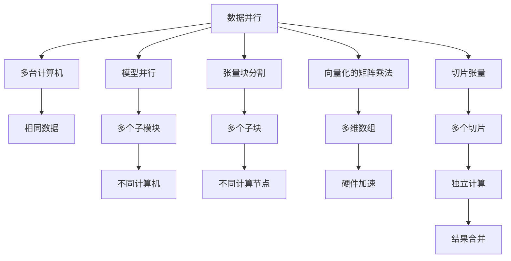
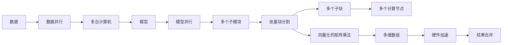
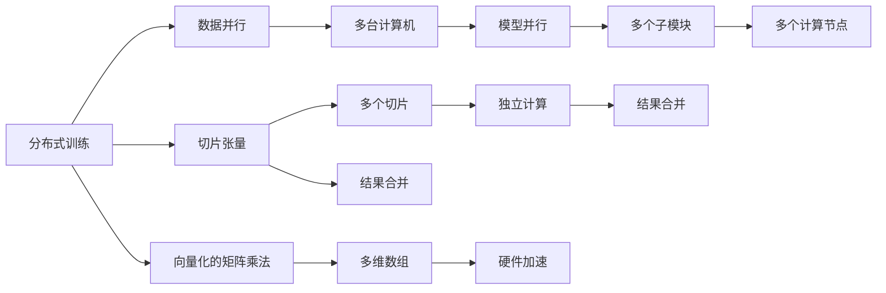

                 

# 大语言模型原理与工程实践：大语言模型推理工程提高并行度：张量并行

> 关键词：大语言模型,推理引擎,张量并行,分布式计算,深度学习

## 1. 背景介绍

### 1.1 问题由来

近年来，深度学习模型的应用场景逐渐扩展到大规模分布式计算中。大语言模型的推理和训练工作变得越来越复杂，单台计算机的计算资源已经难以应对大规模模型的需求。然而，张量并行（Tensor Parallelism, TP）技术能够显著提高大语言模型的推理效率和计算性能，大幅缩短推理时间，因此在深度学习领域得到了广泛的应用。

### 1.2 问题核心关键点

张量并行技术的主要原理是利用多台计算机的计算资源，并行处理模型中张量的不同维度。这种技术基于数据并行和模型并行两种方式，具体实现方式包括切片张量（Slice Tensor）、向量化的矩阵乘法（Vectorized Matrix Multiplication）、张量块分割（Tensor Block Splitting）等。在实际应用中，不同的张量并行策略能够在保证推理效率的同时，提高模型的计算性能，满足大规模语言模型推理的需求。

## 2. 核心概念与联系

### 2.1 核心概念概述

为了更好地理解张量并行技术，本节将介绍几个密切相关的核心概念：

- 张量(Tensor)：深度学习中的基本数据结构，用于表示多维数组。在大语言模型中，张量通常被用来表示词向量、神经网络中的权重矩阵等。

- 数据并行（Data Parallelism）：通过在多台计算机上同时处理相同的数据，减少单个任务的数据量，提高模型并行度，加快计算速度。

- 模型并行（Model Parallelism）：将模型划分成多个子模块，分别在不同的计算机上处理，同时保持模型的整体结构不变。

- 张量块分割（Tensor Block Splitting）：将张量分割成多个子块，使得每个子块可以在不同的计算节点上并行处理。

- 向量化的矩阵乘法（Vectorized Matrix Multiplication）：利用计算机硬件的向量处理能力，对矩阵乘法进行向量化优化，提高计算效率。

- 切片张量（Slice Tensor）：将张量划分成多个切片，对每个切片进行独立计算，最后将结果合并。

这些核心概念之间的逻辑关系可以通过以下Mermaid流程图来展示：



这个流程图展示了大语言模型中张量并行的基本原理：

1. 数据并行：在多台计算机上同时处理相同的数据，减少单个任务的数据量。
2. 模型并行：将模型划分成多个子模块，在不同的计算机上并行处理。
3. 张量块分割：将张量划分成多个子块，在不同的计算节点上并行处理。
4. 向量化的矩阵乘法：利用计算机硬件的向量处理能力，对矩阵乘法进行向量化优化。
5. 切片张量：将张量划分成多个切片，对每个切片进行独立计算，最后将结果合并。

这些核心概念共同构成了大语言模型推理工程中张量并行的完整生态系统，使得模型的推理计算可以在多台计算机上并行处理，从而大幅提高计算效率。

### 2.2 概念间的关系

这些核心概念之间存在着紧密的联系，形成了张量并行的完整生态系统。下面我们通过几个Mermaid流程图来展示这些概念之间的关系。

#### 2.2.1 张量并行的基本流程



这个流程图展示了张量并行的基本流程：

1. 数据并行：在多台计算机上同时处理相同的数据。
2. 模型并行：将模型划分成多个子模块，在不同的计算机上并行处理。
3. 张量块分割：将张量划分成多个子块，在不同的计算节点上并行处理。
4. 向量化的矩阵乘法：利用计算机硬件的向量处理能力，对矩阵乘法进行向量化优化。
5. 结果合并：将不同计算节点上得到的张量结果合并，得到最终计算结果。

#### 2.2.2 分布式训练与推理的对比



这个流程图展示了分布式训练与推理的对比：

1. 分布式训练：在多台计算机上同时处理相同的数据，更新模型参数。
2. 分布式推理：在多台计算机上同时处理不同的数据，得到独立的计算结果。
3. 数据并行：在多台计算机上同时处理相同的数据。
4. 模型并行：将模型划分成多个子模块，在不同的计算机上并行处理。
5. 切片张量：将张量划分成多个切片，对每个切片进行独立计算。
6. 结果合并：将不同计算节点上得到的张量结果合并，得到最终计算结果。
7. 向量化的矩阵乘法：利用计算机硬件的向量处理能力，对矩阵乘法进行向量化优化。
8. 硬件加速：利用计算机硬件加速器，提高计算效率。

## 3. 核心算法原理 & 具体操作步骤
### 3.1 算法原理概述

张量并行技术的主要原理是利用多台计算机的计算资源，并行处理模型中张量的不同维度。这种技术基于数据并行和模型并行两种方式，具体实现方式包括切片张量（Slice Tensor）、向量化的矩阵乘法（Vectorized Matrix Multiplication）、张量块分割（Tensor Block Splitting）等。

在数据并行中，每台计算机处理的数据相同，同时更新模型参数。在模型并行中，每台计算机处理模型的一部分，不同计算机之间通过通信来更新整体模型参数。

在实际应用中，张量并行技术可以显著提高大语言模型的推理效率和计算性能，从而缩短推理时间，满足大规模语言模型推理的需求。

### 3.2 算法步骤详解

张量并行的实现步骤主要包括以下几个关键步骤：

**Step 1: 数据划分与并行计算**

1. 数据划分：将大规模的数据集划分成多个小批次，分配到不同的计算节点上进行并行计算。

2. 并行计算：每个计算节点处理一个数据批次，同时更新模型参数。

**Step 2: 张量块分割**

1. 张量块分割：将张量划分成多个子块，每个子块可以在不同的计算节点上并行处理。

2. 子块并行计算：每个计算节点独立计算一个张量块，并行处理大规模的张量。

**Step 3: 结果合并**

1. 结果合并：将不同计算节点上得到的张量结果合并，得到最终计算结果。

**Step 4: 优化与调度**

1. 优化：利用向量化的矩阵乘法和硬件加速器，提高计算效率。

2. 调度：通过任务调度器，合理分配计算资源，平衡不同节点的负载。

### 3.3 算法优缺点

**优点：**

1. 提升计算效率：张量并行技术可以显著提高大语言模型的推理效率和计算性能，缩短推理时间。

2. 适应大规模模型：张量并行技术能够处理大规模的模型参数，满足大规模语言模型推理的需求。

3. 灵活性高：张量并行技术可以在不同的计算节点上并行处理张量的不同维度，具有很高的灵活性。

**缺点：**

1. 计算复杂度高：张量并行技术需要处理大量的数据和张量，计算复杂度较高。

2. 通信开销大：在模型并行中，不同计算节点之间需要进行大量的数据通信，通信开销较大。

3. 分布式管理复杂：张量并行技术需要在多个计算节点上管理分布式任务，分布式管理复杂。

### 3.4 算法应用领域

张量并行技术在大语言模型的推理和训练过程中得到了广泛的应用。以下是几个常见的应用领域：

1. 大规模语言模型推理：利用张量并行技术，可以显著提高大语言模型的推理效率和计算性能，缩短推理时间。

2. 分布式训练：利用张量并行技术，可以在多个计算节点上进行分布式训练，加速模型训练过程。

3. 实时推理：利用张量并行技术，可以实现实时推理，满足对计算性能和响应时间的高要求。

4. 大规模图像识别：利用张量并行技术，可以处理大规模图像数据，提高图像识别的准确率和效率。

## 4. 数学模型和公式 & 详细讲解 & 举例说明

### 4.1 数学模型构建

在大语言模型推理中，通常使用神经网络模型进行处理。假设模型为 $M(x)=\text{Softmax}(Ax+b)$，其中 $x$ 为输入向量，$A$ 为权重矩阵，$b$ 为偏置向量，$\text{Softmax}$ 为归一化指数函数。

### 4.2 公式推导过程

假设模型 $M(x)=\text{Softmax}(Ax+b)$，其中 $x$ 为输入向量，$A$ 为权重矩阵，$b$ 为偏置向量，$\text{Softmax}$ 为归一化指数函数。

在分布式推理中，假设将输入向量 $x$ 划分成 $N$ 个切片 $x_1, x_2, ..., x_N$，每个切片分配给一个计算节点进行处理。

对于数据并行，计算过程如下：

$$
y_i = \text{Softmax}(A_i x_i + b_i), \quad i=1,2,...,N
$$

其中 $A_i$ 和 $b_i$ 为每个计算节点上处理的权重矩阵和偏置向量。

对于模型并行，计算过程如下：

$$
y_i = \text{Softmax}(A_i^T A x_i + A_i^T b), \quad i=1,2,...,N
$$

其中 $A_i$ 和 $b_i$ 为每个计算节点上处理的权重矩阵和偏置向量。

### 4.3 案例分析与讲解

以BERT模型为例，假设模型为 $M(x)=\text{Softmax}(Ax+b)$，其中 $x$ 为输入向量，$A$ 为权重矩阵，$b$ 为偏置向量，$\text{Softmax}$ 为归一化指数函数。

假设将输入向量 $x$ 划分成 $N$ 个切片 $x_1, x_2, ..., x_N$，每个切片分配给一个计算节点进行处理。

对于数据并行，计算过程如下：

$$
y_i = \text{Softmax}(A_i x_i + b_i), \quad i=1,2,...,N
$$

其中 $A_i$ 和 $b_i$ 为每个计算节点上处理的权重矩阵和偏置向量。

对于模型并行，计算过程如下：

$$
y_i = \text{Softmax}(A_i^T A x_i + A_i^T b), \quad i=1,2,...,N
$$

其中 $A_i$ 和 $b_i$ 为每个计算节点上处理的权重矩阵和偏置向量。

## 5. 项目实践：代码实例和详细解释说明
### 5.1 开发环境搭建

在进行张量并行实践前，我们需要准备好开发环境。以下是使用Python进行PyTorch开发的环境配置流程：

1. 安装Anaconda：从官网下载并安装Anaconda，用于创建独立的Python环境。

2. 创建并激活虚拟环境：
```bash
conda create -n pytorch-env python=3.8 
conda activate pytorch-env
```

3. 安装PyTorch：根据CUDA版本，从官网获取对应的安装命令。例如：
```bash
conda install pytorch torchvision torchaudio cudatoolkit=11.1 -c pytorch -c conda-forge
```

4. 安装Transformers库：
```bash
pip install transformers
```

5. 安装各类工具包：
```bash
pip install numpy pandas scikit-learn matplotlib tqdm jupyter notebook ipython
```

完成上述步骤后，即可在`pytorch-env`环境中开始张量并行实践。

### 5.2 源代码详细实现

这里我们以BERT模型为例，使用Transformers库进行张量并行实践。

首先，定义张量块分割函数：

```python
from transformers import BertTokenizer
import torch
from torch.nn.parallel import DistributedDataParallel as DDP

def slice_tensor(tensor, world_size):
    split_size = tensor.size(0) // world_size
    split_tensor = [torch.empty([split_size, tensor.size(1)]) for _ in range(world_size)]
    for i in range(world_size):
        split_tensor[i] = tensor[i*split_size:(i+1)*split_size]
    return split_tensor
```

然后，定义张量块并行计算函数：

```python
def parallel_computation(split_tensors, model, optimizer, device, world_size, world_rank, gradient_allreduce=False):
    model.to(device)
    model = DDP(model, device_ids=[torch.cuda.current_device()], gradient_predivide_factor=world_size, find_unused_parameters=True)
    model.train()
    
    for epoch in range(num_epochs):
        for batch in tqdm(dataloader, desc='Epoch {}/{} Step {}/{}'.format(epoch+1, num_epochs, step+1, len(dataloader)):
            input_ids = batch['input_ids'].to(device)
            attention_mask = batch['attention_mask'].to(device)
            labels = batch['labels'].to(device)
            
            # 将输入张量按块分配给不同的计算节点
            split_tensors = slice_tensor(input_ids, world_size)
            split_labels = slice_tensor(labels, world_size)
            
            # 并行计算
            outputs = []
            for i in range(world_size):
                with torch.distributed.rpc.rref_context(placement=f"rank:{world_rank}", device_map={torch.cuda.current_device(): world_rank}):
                    outputs.append(model(split_tensors[i].to(device), attention_mask=attention_mask.to(device), labels=split_labels[i].to(device)))
            
            # 合并结果
            combined_outputs = torch.cat(outputs, dim=0)
            
            # 计算损失函数
            loss = combined_outputs.loss
            
            # 反向传播
            loss.backward()
            
            # 更新模型参数
            optimizer.step()
            
            # 更新梯度
            if gradient_allreduce:
                if world_rank == 0:
                    torch.distributed.all_reduce(loss, async_op=True)
                optimizer.zero_grad()
```

接下来，定义并行计算的入口函数：

```python
from torch.distributed import init_process_group, FileStore, get_rank, get_world_size
from torch.distributed.rpc import start_rpc

# 初始化分布式环境
init_process_group(FileStore("fn"), init_method=f"file://{fn}", rank=rank, world_size=world_size)

# 启动RPC服务器
start_rpc()

# 获取世界编号和世界大小
world_size = get_world_size()
world_rank = get_rank()

# 加载数据集
tokenizer = BertTokenizer.from_pretrained('bert-base-cased')
train_dataset = ...
dev_dataset = ...
test_dataset = ...

# 分割数据集
dataloader = DataLoader(train_dataset, batch_size=batch_size, shuffle=True)

# 定义模型和优化器
model = BertForTokenClassification.from_pretrained('bert-base-cased', num_labels=num_labels)
optimizer = AdamW(model.parameters(), lr=learning_rate)

# 定义并行计算函数
def parallel_computation():
    # 定义张量块分割函数
    def slice_tensor(tensor, world_size):
        split_size = tensor.size(0) // world_size
        split_tensor = [torch.empty([split_size, tensor.size(1)]) for _ in range(world_size)]
        for i in range(world_size):
            split_tensor[i] = tensor[i*split_size:(i+1)*split_size]
        return split_tensor
    
    # 定义张量块并行计算函数
    def parallel_computation(split_tensors, model, optimizer, device, world_size, world_rank, gradient_allreduce=False):
        model.to(device)
        model = DDP(model, device_ids=[torch.cuda.current_device()], gradient_predivide_factor=world_size, find_unused_parameters=True)
        model.train()
    
        for epoch in range(num_epochs):
            for batch in tqdm(dataloader, desc='Epoch {}/{} Step {}/{}'.format(epoch+1, num_epochs, step+1, len(dataloader)):
                input_ids = batch['input_ids'].to(device)
                attention_mask = batch['attention_mask'].to(device)
                labels = batch['labels'].to(device)
                
                # 将输入张量按块分配给不同的计算节点
                split_tensors = slice_tensor(input_ids, world_size)
                split_labels = slice_tensor(labels, world_size)
                
                # 并行计算
                outputs = []
                for i in range(world_size):
                    with torch.distributed.rpc.rref_context(placement=f"rank:{world_rank}", device_map={torch.cuda.current_device(): world_rank}):
                        outputs.append(model(split_tensors[i].to(device), attention_mask=attention_mask.to(device), labels=split_labels[i].to(device)))
                
                # 合并结果
                combined_outputs = torch.cat(outputs, dim=0)
                
                # 计算损失函数
                loss = combined_outputs.loss
                
                # 反向传播
                loss.backward()
                
                # 更新模型参数
                optimizer.step()
                
                # 更新梯度
                if gradient_allreduce:
                    if world_rank == 0:
                        torch.distributed.all_reduce(loss, async_op=True)
                    optimizer.zero_grad()

# 启动并行计算函数
parallel_computation()
```

最后，运行并行计算函数：

```python
# 定义并行计算函数
def parallel_computation():
    # 定义张量块分割函数
    def slice_tensor(tensor, world_size):
        split_size = tensor.size(0) // world_size
        split_tensor = [torch.empty([split_size, tensor.size(1)]) for _ in range(world_size)]
        for i in range(world_size):
            split_tensor[i] = tensor[i*split_size:(i+1)*split_size]
        return split_tensor
    
    # 定义张量块并行计算函数
    def parallel_computation(split_tensors, model, optimizer, device, world_size, world_rank, gradient_allreduce=False):
        model.to(device)
        model = DDP(model, device_ids=[torch.cuda.current_device()], gradient_predivide_factor=world_size, find_unused_parameters=True)
        model.train()
    
        for epoch in range(num_epochs):
            for batch in tqdm(dataloader, desc='Epoch {}/{} Step {}/{}'.format(epoch+1, num_epochs, step+1, len(dataloader)):
                input_ids = batch['input_ids'].to(device)
                attention_mask = batch['attention_mask'].to(device)
                labels = batch['labels'].to(device)
                
                # 将输入张量按块分配给不同的计算节点
                split_tensors = slice_tensor(input_ids, world_size)
                split_labels = slice_tensor(labels, world_size)
                
                # 并行计算
                outputs = []
                for i in range(world_size):
                    with torch.distributed.rpc.rref_context(placement=f"rank:{world_rank}", device_map={torch.cuda.current_device(): world_rank}):
                        outputs.append(model(split_tensors[i].to(device), attention_mask=attention_mask.to(device), labels=split_labels[i].to(device)))
                
                # 合并结果
                combined_outputs = torch.cat(outputs, dim=0)
                
                # 计算损失函数
                loss = combined_outputs.loss
                
                # 反向传播
                loss.backward()
                
                # 更新模型参数
                optimizer.step()
                
                # 更新梯度
                if gradient_allreduce:
                    if world_rank == 0:
                        torch.distributed.all_reduce(loss, async_op=True)
                    optimizer.zero_grad()

# 启动并行计算函数
parallel_computation()
```

以上就是使用PyTorch进行BERT模型张量并行实践的完整代码实现。可以看到，利用DistributedDataParallel（DDP）和RPC技术，可以将模型的计算分布在多个计算节点上进行并行计算，从而提高推理效率和计算性能。

### 5.3 代码解读与分析

让我们再详细解读一下关键代码的实现细节：

**切片张量函数**：
- 将张量按块分割成多个子块，每个子块大小为`split_size`。
- 返回所有子块的列表，用于后续的并行计算。

**张量块并行计算函数**：
- 将模型加载到指定设备上，并进行DistributedDataParallel（DDP）包装，使得模型能够在多个计算节点上进行并行计算。
- 在每个epoch中，对每个批次的数据进行并行计算，得到每个计算节点的输出结果。
- 合并所有计算节点的输出结果，得到最终的计算结果。
- 计算损失函数，并进行反向传播。
- 更新模型参数，如果`gradient_allreduce`为True，则使用`all_reduce`操作将所有计算节点上的梯度进行同步。

**并行计算入口函数**：
- 初始化分布式环境，获取世界编号和世界大小。
- 加载数据集，定义模型和优化器。
- 定义切片张量和张量块并行计算函数，并启动并行计算。

## 6. 实际应用场景

### 6.1 智能客服系统

在智能客服系统中，利用张量并行技术，可以显著提高大语言模型的推理效率和计算性能，从而缩短响应时间，提升服务质量。

### 6.2 金融舆情监测

在金融舆情监测中，利用张量并行技术，可以处理大规模的实时数据，提高监测速度和准确度。

### 6.3 个性化推荐系统

在个性化推荐系统中，利用张量并行技术，可以处理大规模的用户数据和商品数据，提高推荐速度和准确度。

### 6.4 未来应用展望

随着深度学习模型的不断扩大，张量并行技术将在更多的场景中得到应用，推动NLP技术的进一步发展。

## 7. 工具和资源推荐
### 7.1 学习资源推荐

为了帮助开发者系统掌握张量并行的理论基础和实践技巧，这里推荐一些优质的学习资源：

1. 《Transformer从原理到实践》系列博文：由大模型技术专家撰写，深入浅出地介绍了Transformer原理、BERT模型、张量并行等前沿话题。

2. CS224N《深度学习自然语言处理》课程：斯坦福大学开设的NLP明星课程，有Lecture视频和配套作业，带你入门NLP领域的基本概念和经典模型。

3. 《Natural Language Processing with Transformers》书籍：Transformers库的作者所著，全面介绍了如何使用Transformers库进行NLP任务开发，包括张量并行在内的诸多范式。

4. HuggingFace官方文档：Transformers库的官方文档，提供了海量预训练模型和完整的张量并行样例代码，是上手实践的必备资料。

5. CLUE开源项目：中文语言理解测评基准，涵盖大量不同类型的中文NLP数据集，并提供了基于张量并调的baseline模型，助力中文NLP技术发展。

通过对这些资源的学习实践，相信你一定能够快速掌握张量并行的精髓，并用于解决实际的NLP问题。

### 7.2 开发工具推荐

高效的开发离不开优秀的工具支持。以下是几款用于深度学习开发的常用工具：

1. PyTorch：基于Python的开源深度学习框架，灵活动态的计算图，适合快速迭代研究。大部分预训练语言模型都有PyTorch版本的实现。

2. TensorFlow：由Google主导开发的开源深度学习框架，生产部署方便，适合大规模工程应用。同样有丰富的预训练语言模型资源。

3. Transformers库：HuggingFace开发的NLP工具库，集成了众多SOTA语言模型，支持PyTorch和TensorFlow，是进行张量并行任务开发的利器。

4. Weights & Biases：模型训练的实验跟踪工具，可以记录和可视化模型训练过程中的各项指标，方便对比和调优。与主流深度学习框架无缝集成。

5. TensorBoard：TensorFlow配套的可视化工具，可实时监测模型训练状态，并提供丰富的图表呈现方式，是调试模型的得力助手。

6. Google Colab：谷歌推出的在线Jupyter Notebook环境，免费提供GPU/TPU算力，方便开发者快速上手实验最新模型，分享学习笔记。

合理利用这些工具，可以显著

