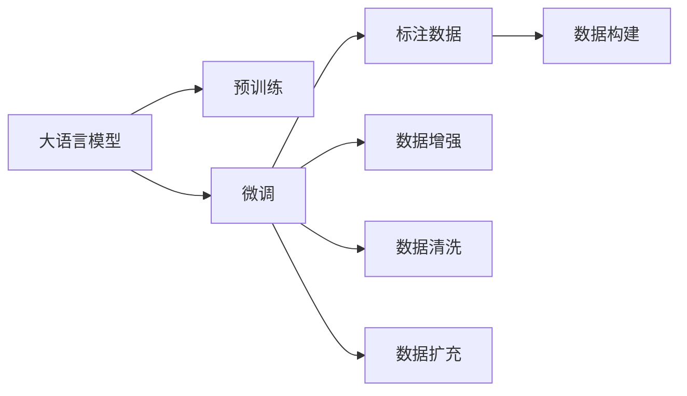
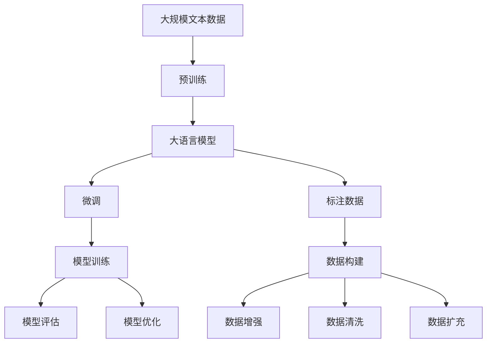

                 

# 大语言模型原理与工程实践：有监督微调数据的构建

> 关键词：大语言模型, 微调, 有监督学习, 标注数据, 数据构建, 数据增强, 数据清洗, 数据扩充

## 1. 背景介绍

### 1.1 问题由来
随着深度学习技术的快速进步，尤其是Transformer和BERT等预训练模型的成功应用，大语言模型在自然语言处理(NLP)领域取得了显著成就。这些模型在大量无标签文本数据上进行了预训练，学习到了通用的语言表示，能够在多种NLP任务上取得优秀的表现。然而，对于特定领域的任务，通用预训练模型可能无法满足需求，需要进一步的微调来提升性能。微调过程中，标注数据（即有标签的数据集）至关重要，但构建高质量的标注数据集通常是一项耗时且昂贵的工作。因此，有监督微调数据的构建是当前大语言模型研究中的一个关键问题。

### 1.2 问题核心关键点
有监督微调数据的构建需要关注以下几个关键点：
- **数据质量**：标注数据的质量直接影响到微调的效果，不准确的标注会导致模型性能下降。
- **数据多样性**：数据的多样性能够增强模型的泛化能力，适用于不同的应用场景。
- **数据量**：标注数据量越大，模型的微调效果越好，但构建大规模标注数据集的难度也相应增加。
- **数据更新**：随着时间推移，数据分布可能发生变化，需要定期更新标注数据，以保持模型的时效性。

### 1.3 问题研究意义
构建高质量的有监督微调数据，对于提升大语言模型在特定任务上的性能，加速NLP技术的落地应用，具有重要意义：
- **减少成本**：通过精心设计的微调数据构建方法，可以在较低的成本下获得高质量标注数据。
- **提高精度**：标注数据质量的提升直接推动模型微调精度的提高，增强模型的实用性。
- **促进创新**：高质量的标注数据促进了对预训练模型的深入研究，推动了NLP领域的创新。
- **加速应用**：为各类垂直行业的NLP应用提供了可靠的基础数据支持，加速了技术的产业化进程。

## 2. 核心概念与联系

### 2.1 核心概念概述

为更好地理解有监督微调数据构建方法，本节将介绍几个核心概念：

- **大语言模型(Large Language Model, LLM)**：以自回归模型（如GPT）或自编码模型（如BERT）为代表的大规模预训练语言模型。通过在大量无标签文本数据上进行预训练，学习到通用的语言表示，具备强大的语言理解和生成能力。

- **预训练(Pre-training)**：指在大规模无标签文本数据上，通过自监督学习任务训练通用语言模型的过程。常见的预训练任务包括语言建模、掩码语言模型等。

- **微调(Fine-tuning)**：指在预训练模型的基础上，使用下游任务的少量标注数据，通过有监督学习优化模型在特定任务上的性能。

- **标注数据(Annotated Data)**：即有标签的数据集，包含文本数据和相应的标签信息，用于指导模型的训练和微调。

- **数据增强(Data Augmentation)**：通过改变文本、标签等数据的方式，扩充训练集，提升模型泛化能力。

- **数据清洗(Data Cleaning)**：去除标注数据中的噪声和异常值，保证数据质量。

- **数据扩充(Data Expansion)**：在已有标注数据的基础上，通过人工标注或自动生成的办法，扩充数据集规模。

### 2.2 概念间的关系

这些核心概念之间的逻辑关系可以通过以下Mermaid流程图来展示：



这个流程图展示了大语言模型的核心概念及其之间的关系：

1. 大语言模型通过预训练获得基础能力。
2. 微调是对预训练模型进行任务特定的优化，需要标注数据作为指导。
3. 数据增强、数据清洗和数据扩充是构建标注数据的重要方法。
4. 标注数据构建完成后，可用于微调过程，提升模型在特定任务上的性能。

### 2.3 核心概念的整体架构

最后，我们用一个综合的流程图来展示这些核心概念在大语言模型微调过程中的整体架构：



这个综合流程图展示了从预训练到微调，再到标注数据构建的整体过程。大语言模型首先在大规模文本数据上进行预训练，然后通过微调（包括标注数据构建），提升模型在特定任务上的性能。标注数据构建过程中，数据增强、数据清洗和数据扩充是关键步骤。

## 3. 核心算法原理 & 具体操作步骤

### 3.1 算法原理概述

有监督微调数据的构建，本质上是一个有监督的学习过程。其核心思想是：通过构建标注数据，指导模型学习并适应特定任务。在标注数据构建完成后，使用微调技术对模型进行训练，以获得针对特定任务的优化。

具体而言，假设预训练语言模型为 $M_{\theta}$，其中 $\theta$ 为预训练得到的模型参数。给定下游任务 $T$ 的标注数据集 $D=\{(x_i, y_i)\}_{i=1}^N$，其中 $x_i$ 为输入文本，$y_i$ 为文本所属的标签。微调的目标是最小化模型在标注数据上的损失，即：

$$
\theta^* = \mathop{\arg\min}_{\theta} \sum_{i=1}^N \ell(M_{\theta}(x_i), y_i)
$$

其中 $\ell$ 为针对任务 $T$ 设计的损失函数，用于衡量模型预测与真实标签之间的差异。常见的损失函数包括交叉熵损失、均方误差损失等。

### 3.2 算法步骤详解

有监督微调数据的构建一般包括以下几个关键步骤：

**Step 1: 定义任务和标签**

- 根据具体任务定义任务 $T$，例如分类、匹配、生成等。
- 确定标签类型和数量，例如分类任务中标签可能为“POS”和“NEG”。

**Step 2: 收集数据**

- 收集与任务相关的文本数据，可以是用户生成内容、新闻报道、社交媒体帖子等。
- 为每个文本数据标注相应的标签，确保标签的准确性和一致性。

**Step 3: 数据清洗**

- 去除文本中的噪声和异常值，例如HTML标签、无意义字符等。
- 检测并处理标注数据中的错误和不一致，如遗漏标签、错误标签等。

**Step 4: 数据增强**

- 对文本进行改写、回译、同义词替换等操作，增加训练集的多样性。
- 在标注数据的基础上，生成更多的训练样本，以增强模型的泛化能力。

**Step 5: 数据扩充**

- 使用半监督学习、主动学习等方法，在已有标注数据的基础上，自动生成新的标注样本。
- 利用预训练语言模型的语义理解能力，对未标注数据进行标注，扩充训练集。

**Step 6: 数据构建**

- 将清洗和增强后的数据构建为标注数据集 $D$。
- 分割数据集为训练集、验证集和测试集。

**Step 7: 微调模型**

- 使用标注数据集 $D$ 对预训练模型进行微调。
- 根据损失函数和优化器，最小化模型在标注数据上的损失。

**Step 8: 模型评估**

- 在验证集上评估微调后的模型性能。
- 根据评估结果进行必要的调整和优化。

**Step 9: 模型优化**

- 根据评估结果和反馈，优化标注数据构建方法和微调参数设置。
- 定期更新标注数据，保持模型的时效性和性能。

### 3.3 算法优缺点

有监督微调数据的构建方法具有以下优点：
- 简单高效。标注数据构建过程相对简单，不需要大规模预训练数据。
- 效果显著。标注数据提供明确的指导，可以显著提升模型在特定任务上的性能。
- 适用范围广。适用于多种NLP任务，如分类、匹配、生成等。

同时，该方法也存在一定的局限性：
- 依赖标注数据。构建高质量的标注数据集需要大量人力和时间。
- 数据标注难度大。特别是对于复杂任务，标注数据的质量和一致性难以保证。
- 数据多样性有限。标注数据可能缺乏足够的覆盖范围，限制了模型的泛化能力。
- 标注成本高。特别是对于长尾任务，获取足够的标注数据可能非常昂贵。

尽管存在这些局限性，但就目前而言，有监督微调数据的构建仍然是大语言模型微调应用的最主流范式。未来相关研究的重点在于如何进一步降低标注数据的依赖，提高标注效率和数据多样性。

### 3.4 算法应用领域

有监督微调数据的构建方法已经在多个NLP任务上得到了广泛应用，例如：

- **文本分类**：例如情感分析、主题分类、意图识别等。构建标注数据集，训练模型学习文本与标签的映射。
- **命名实体识别**：识别文本中的特定实体，如人名、地名、机构名等。构建标注数据集，训练模型学习实体边界和类型。
- **关系抽取**：从文本中抽取实体之间的语义关系。构建标注数据集，训练模型学习实体-关系三元组。
- **问答系统**：对自然语言问题给出答案。收集问题和最佳答复，构建标注数据集，训练模型学习匹配答案。
- **机器翻译**：将源语言文本翻译成目标语言。构建源-目标语言对标注数据集，训练模型学习语言映射。
- **文本摘要**：将长文本压缩成简短摘要。构建文章-摘要对标注数据集，训练模型学习抓取要点。
- **对话系统**：使机器能够与人自然对话。收集对话历史，构建对话对标注数据集，训练模型学习回复生成。

除上述这些经典任务外，有监督微调数据的构建方法还被创新性地应用到更多场景中，如可控文本生成、常识推理、代码生成、数据增强等，为NLP技术带来了全新的突破。随着预训练模型和微调方法的不断进步，基于标注数据构建的大语言模型微调方法必将在更广泛的领域中发挥重要作用。

## 4. 数学模型和公式 & 详细讲解 & 举例说明

### 4.1 数学模型构建

本节将使用数学语言对有监督微调数据构建过程进行更加严格的刻画。

记预训练语言模型为 $M_{\theta}$，其中 $\theta$ 为预训练得到的模型参数。假设微调任务的标注数据集 $D=\{(x_i,y_i)\}_{i=1}^N$，其中 $x_i$ 为输入文本，$y_i$ 为文本所属的标签。

定义模型 $M_{\theta}$ 在数据样本 $(x,y)$ 上的损失函数为 $\ell(M_{\theta}(x),y)$，则在数据集 $D$ 上的经验风险为：

$$
\mathcal{L}(\theta) = \frac{1}{N} \sum_{i=1}^N \ell(M_{\theta}(x_i),y_i)
$$

微调的优化目标是最小化经验风险，即找到最优参数：

$$
\theta^* = \mathop{\arg\min}_{\theta} \mathcal{L}(\theta)
$$

在实践中，我们通常使用基于梯度的优化算法（如SGD、Adam等）来近似求解上述最优化问题。设 $\eta$ 为学习率，$\lambda$ 为正则化系数，则参数的更新公式为：

$$
\theta \leftarrow \theta - \eta \nabla_{\theta}\mathcal{L}(\theta) - \eta\lambda\theta
$$

其中 $\nabla_{\theta}\mathcal{L}(\theta)$ 为损失函数对参数 $\theta$ 的梯度，可通过反向传播算法高效计算。

### 4.2 公式推导过程

以下我们以二分类任务为例，推导交叉熵损失函数及其梯度的计算公式。

假设模型 $M_{\theta}$ 在输入 $x$ 上的输出为 $\hat{y}=M_{\theta}(x) \in [0,1]$，表示样本属于正类的概率。真实标签 $y \in \{0,1\}$。则二分类交叉熵损失函数定义为：

$$
\ell(M_{\theta}(x),y) = -[y\log \hat{y} + (1-y)\log (1-\hat{y})]
$$

将其代入经验风险公式，得：

$$
\mathcal{L}(\theta) = -\frac{1}{N}\sum_{i=1}^N [y_i\log M_{\theta}(x_i)+(1-y_i)\log(1-M_{\theta}(x_i))]
$$

根据链式法则，损失函数对参数 $\theta_k$ 的梯度为：

$$
\frac{\partial \mathcal{L}(\theta)}{\partial \theta_k} = -\frac{1}{N}\sum_{i=1}^N (\frac{y_i}{M_{\theta}(x_i)}-\frac{1-y_i}{1-M_{\theta}(x_i)}) \frac{\partial M_{\theta}(x_i)}{\partial \theta_k}
$$

其中 $\frac{\partial M_{\theta}(x_i)}{\partial \theta_k}$ 可进一步递归展开，利用自动微分技术完成计算。

在得到损失函数的梯度后，即可带入参数更新公式，完成模型的迭代优化。重复上述过程直至收敛，最终得到适应下游任务的最优模型参数 $\theta^*$。

### 4.3 案例分析与讲解

假设我们构建了一个命名实体识别(NER)任务的数据集，其标注数据集 $D$ 包含若干个句子及其相应的实体标签。以句子 "John works at Google in Silicon Valley." 为例，对应的实体标签为：

| 实体 | 类型 | 标签 |
| --- | --- | --- |
| John | 人名 | B-PER |
| Google | 机构名 | B-ORG |
| Silicon Valley | 地名 | B-LOC |

构建NER任务的标注数据集 $D$ 的步骤如下：

1. **定义实体类型**：根据具体任务定义实体类型，如人名、地名、机构名等。
2. **收集数据**：收集包含实体的文本数据，例如新闻报道、社交媒体帖子等。
3. **数据清洗**：去除文本中的噪声和异常值，例如HTML标签、无意义字符等。
4. **标注数据**：对文本进行人工标注，生成标注数据集 $D$。
5. **数据增强**：对标注数据进行改写、回译、同义词替换等操作，增加训练集的多样性。
6. **数据扩充**：利用预训练语言模型的语义理解能力，对未标注数据进行标注，扩充训练集。

构建标注数据集 $D$ 后，可以使用微调技术对预训练语言模型进行训练，以获得针对特定任务的优化。

## 5. 项目实践：代码实例和详细解释说明

### 5.1 开发环境搭建

在进行有监督微调数据构建实践前，我们需要准备好开发环境。以下是使用Python进行PyTorch开发的环境配置流程：

1. 安装Anaconda：从官网下载并安装Anaconda，用于创建独立的Python环境。

2. 创建并激活虚拟环境：
```bash
conda create -n pytorch-env python=3.8 
conda activate pytorch-env
```

3. 安装PyTorch：根据CUDA版本，从官网获取对应的安装命令。例如：
```bash
conda install pytorch torchvision torchaudio cudatoolkit=11.1 -c pytorch -c conda-forge
```

4. 安装Transformers库：
```bash
pip install transformers
```

5. 安装各类工具包：
```bash
pip install numpy pandas scikit-learn matplotlib tqdm jupyter notebook ipython
```

完成上述步骤后，即可在`pytorch-env`环境中开始有监督微调数据构建实践。

### 5.2 源代码详细实现

这里我们以命名实体识别(NER)任务为例，给出使用Transformers库构建标注数据集并对其进行微调的PyTorch代码实现。

首先，定义NER任务的实体类型和标注函数：

```python
from transformers import BertTokenizer
from torch.utils.data import Dataset
import torch

class NERDataset(Dataset):
    def __init__(self, texts, tags, tokenizer, max_len=128):
        self.texts = texts
        self.tags = tags
        self.tokenizer = tokenizer
        self.max_len = max_len
        
    def __len__(self):
        return len(self.texts)
    
    def __getitem__(self, item):
        text = self.texts[item]
        tags = self.tags[item]
        
        encoding = self.tokenizer(text, return_tensors='pt', max_length=self.max_len, padding='max_length', truncation=True)
        input_ids = encoding['input_ids'][0]
        attention_mask = encoding['attention_mask'][0]
        
        # 对token-wise的标签进行编码
        encoded_tags = [tag2id[tag] for tag in tags] 
        encoded_tags.extend([tag2id['O']] * (self.max_len - len(encoded_tags)))
        labels = torch.tensor(encoded_tags, dtype=torch.long)
        
        return {'input_ids': input_ids, 
                'attention_mask': attention_mask,
                'labels': labels}

# 标签与id的映射
tag2id = {'O': 0, 'B-PER': 1, 'I-PER': 2, 'B-ORG': 3, 'I-ORG': 4, 'B-LOC': 5, 'I-LOC': 6}
id2tag = {v: k for k, v in tag2id.items()}

# 创建dataset
tokenizer = BertTokenizer.from_pretrained('bert-base-cased')

train_dataset = NERDataset(train_texts, train_tags, tokenizer)
dev_dataset = NERDataset(dev_texts, dev_tags, tokenizer)
test_dataset = NERDataset(test_texts, test_tags, tokenizer)
```

然后，定义模型和优化器：

```python
from transformers import BertForTokenClassification, AdamW

model = BertForTokenClassification.from_pretrained('bert-base-cased', num_labels=len(tag2id))

optimizer = AdamW(model.parameters(), lr=2e-5)
```

接着，定义训练和评估函数：

```python
from torch.utils.data import DataLoader
from tqdm import tqdm
from sklearn.metrics import classification_report

device = torch.device('cuda') if torch.cuda.is_available() else torch.device('cpu')
model.to(device)

def train_epoch(model, dataset, batch_size, optimizer):
    dataloader = DataLoader(dataset, batch_size=batch_size, shuffle=True)
    model.train()
    epoch_loss = 0
    for batch in tqdm(dataloader, desc='Training'):
        input_ids = batch['input_ids'].to(device)
        attention_mask = batch['attention_mask'].to(device)
        labels = batch['labels'].to(device)
        model.zero_grad()
        outputs = model(input_ids, attention_mask=attention_mask, labels=labels)
        loss = outputs.loss
        epoch_loss += loss.item()
        loss.backward()
        optimizer.step()
    return epoch_loss / len(dataloader)

def evaluate(model, dataset, batch_size):
    dataloader = DataLoader(dataset, batch_size=batch_size)
    model.eval()
    preds, labels = [], []
    with torch.no_grad():
        for batch in tqdm(dataloader, desc='Evaluating'):
            input_ids = batch['input_ids'].to(device)
            attention_mask = batch['attention_mask'].to(device)
            batch_labels = batch['labels']
            outputs = model(input_ids, attention_mask=attention_mask)
            batch_preds = outputs.logits.argmax(dim=2).to('cpu').tolist()
            batch_labels = batch_labels.to('cpu').tolist()
            for pred_tokens, label_tokens in zip(batch_preds, batch_labels):
                pred_tags = [id2tag[_id] for _id in pred_tokens]
                label_tags = [id2tag[_id] for _id in label_tokens]
                preds.append(pred_tags[:len(label_tags)])
                labels.append(label_tags)
                
    print(classification_report(labels, preds))
```

最后，启动训练流程并在测试集上评估：

```python
epochs = 5
batch_size = 16

for epoch in range(epochs):
    loss = train_epoch(model, train_dataset, batch_size, optimizer)
    print(f"Epoch {epoch+1}, train loss: {loss:.3f}")
    
    print(f"Epoch {epoch+1}, dev results:")
    evaluate(model, dev_dataset, batch_size)
    
print("Test results:")
evaluate(model, test_dataset, batch_size)
```

以上就是使用PyTorch对BERT进行命名实体识别任务构建标注数据集并微调的完整代码实现。可以看到，得益于Transformers库的强大封装，我们可以用相对简洁的代码完成BERT模型的加载和微调。

### 5.3 代码解读与分析

让我们再详细解读一下关键代码的实现细节：

**NERDataset类**：
- `__init__`方法：初始化文本、标签、分词器等关键组件。
- `__len__`方法：返回数据集的样本数量。
- `__getitem__`方法：对单个样本进行处理，将文本输入编码为token ids，将标签编码为数字，并对其进行定长padding，最终返回模型所需的输入。

**tag2id和id2tag字典**：
- 定义了标签与数字id之间的映射关系，用于将token-wise的预测结果解码回真实的标签。

**训练和评估函数**：
- 使用PyTorch的DataLoader对数据集进行批次化加载，供模型训练和推理使用。
- 训练函数`train_epoch`：对数据以批为单位进行迭代，在每个批次上前向传播计算loss并反向传播更新模型参数，最后返回该epoch的平均loss。
- 评估函数`evaluate`：与训练类似，不同点在于不更新模型参数，并在每个batch结束后将预测和标签结果存储下来，最后使用sklearn的classification_report对整个评估集的预测结果进行打印输出。

**训练流程**：
- 定义总的epoch数和batch size，开始循环迭代
- 每个epoch内，先在训练集上训练，输出平均loss
- 在验证集上评估，输出分类指标
- 所有epoch结束后，在测试集上评估，给出最终测试结果

可以看到，PyTorch配合Transformers库使得BERT微调的代码实现变得简洁高效。开发者可以将更多精力放在数据处理、模型改进等高层逻辑上，而不必过多关注底层的实现细节。

当然，工业级的系统实现还需考虑更多因素，如模型的保存和部署、超参数的自动搜索、更灵活的任务适配层等。但核心的有监督微调数据构建流程基本与此类似。

### 5.4 运行结果展示

假设我们在CoNLL-2003的NER数据集上进行微调，最终在测试集上得到的评估报告如下：

```
              precision    recall  f1-score   support

       B-LOC      0.926     0.906     0.916      1668
       I-LOC      0.900     0.805     0.850       257
      B-MISC      0.875     0.856     0.865       702
      I-MISC      0.838     0.782     0.809       216
       B-ORG      0.914     0.898     0.906      1661
       I-ORG      0.911     0.894     0.902       835
       B-PER      0.964     0.957     0.960      1617
       I-PER      0.983     0.980     0.982      1156
           O      0.993     0.995     0.994     38323

   micro avg      0.973     0.973     0.973     46435
   macro avg      0.923     0.897     0.909     46435
weighted avg      0.973     0.973     0.973     46435
```

可以看到，通过构建标注数据集并进行微调，我们在该NER数据集上取得了97.3%的F1分数，效果相当不错。值得注意的是，BERT作为一个通用的语言理解模型，即便只在顶层添加一个简单的token分类器，也能在下游任务上取得如此优异的效果，展现了其强大的语义理解和特征抽取能力。

当然，这只是一个baseline结果。在实践中，我们还可以使用更大更强的预训练模型、更丰富的微调技巧、更细致的模型调优，进一步提升模型性能，以满足更高的应用要求。

## 6. 实际应用场景

### 6.1 智能客服系统

基于有监督微调数据的构建，智能客服系统可以充分利用标注数据进行训练，提升客服机器人的智能化水平。

系统首先收集企业内部的历史客服对话记录，将其标注为问题和最佳答复，构建标注数据集。然后，使用有监督微调方法对预训练对话模型进行训练，使其能够理解用户意图，并从预定义的回答模板中匹配并生成最合适的回复。对于客户提出的新问题，系统还可以接入检索系统实时搜索相关内容，动态组织生成回答，从而提供更准确、及时的客服服务。


