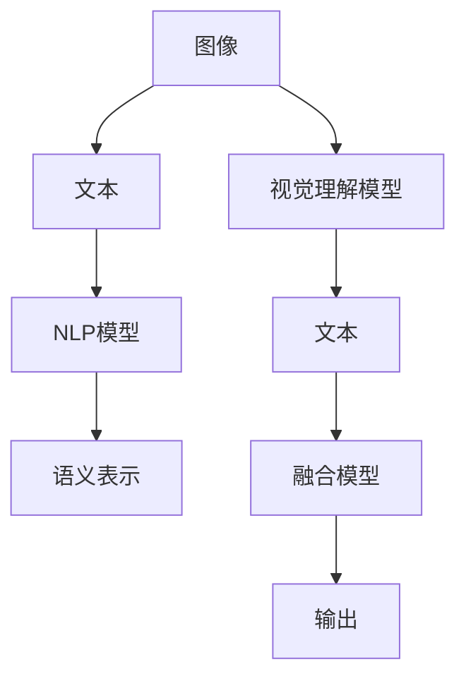

                 

# 大语言模型应用指南：什么是多模态

> 关键词：多模态融合, 视觉理解, 语音识别, 自然语言处理, 知识表示, 多模态深度学习, 联合学习

## 1. 背景介绍

### 1.1 问题由来
随着人工智能技术的不断进步，大语言模型在自然语言处理(NLP)领域取得了显著的进展。然而，语言作为人类交流的主要媒介，却难以独立表达现实世界的丰富信息。为了更好地理解和处理真实世界中的复杂现象，大语言模型需要结合其他模态的信息，如视觉、听觉、触觉等，才能更加全面地模拟人类认知。

在过去的十年中，多模态学习(Multimodal Learning)成为了人工智能领域的研究热点。多模态学习旨在通过融合不同模态的信息，提升模型的感知能力，使其能够更好地理解和预测真实世界中的复杂场景。多模态深度学习(Multimodal Deep Learning)作为其中的重要分支，通过深度神经网络模型将多种模态的信息进行融合，为人工智能带来了全新的可能性。

多模态深度学习不仅在图像识别、语音识别等领域取得了令人瞩目的成果，还逐步渗透到了自然语言处理、推荐系统、智能交互等多个应用场景。本文将详细介绍多模态深度学习的核心概念、技术原理及实践方法，为读者提供系统性的学习指引。

## 2. 核心概念与联系

### 2.1 核心概念概述

为更好地理解多模态深度学习的核心概念，本节将介绍几个关键概念：

- **多模态融合(Multimodal Fusion)**：指将不同模态的数据信息进行融合，以获取更加全面的语义和表征。
- **视觉理解(Visual Understanding)**：指利用计算机视觉技术，对图像和视频数据进行理解、分析，提取语义信息。
- **语音识别(Speech Recognition)**：指将音频信号转换为文本或命令，实现人机交互。
- **自然语言处理(Natural Language Processing, NLP)**：指通过计算机技术，处理、分析、理解自然语言文本，实现语义推理和生成。
- **知识表示(Knowledge Representation)**：指将领域知识和专家经验形式化、结构化，用于增强模型的推理和决策能力。
- **联合学习(Federated Learning)**：指通过分布式计算和数据共享，在多个设备或客户端联合训练模型，提升模型性能。
- **迁移学习(Transfer Learning)**：指利用预训练模型对新任务进行微调，加速模型收敛和提高泛化能力。

这些概念之间存在着紧密的联系，形成了一个相互依存的多模态学习生态系统。例如，视觉理解可以通过融合自然语言信息，提升对复杂场景的理解能力；语音识别结合自然语言处理，可以实现更加自然流畅的语音交互；知识表示则与多模态融合和联合学习相结合，使模型具备更强的推理和决策能力。

### 2.2 概念间的关系

这些核心概念之间的关系可以通过以下Mermaid流程图来展示：

```mermaid
graph TB
    A[多模态融合] --> B[视觉理解]
    A --> C[语音识别]
    A --> D[NLP]
    A --> E[知识表示]
    B --> F[图像识别]
    C --> G[自动语音识别(ASR)]
    D --> H[语言模型]
    E --> I[领域知识库]
    F --> J[场景分类]
    G --> K[语音生成]
    H --> L[文本生成]
    I --> M[推理规则]
    J --> N[情感分析]
    K --> O[命令解析]
    L --> P[机器翻译]
    M --> Q[决策支持]
    N --> R[意图识别]
    O --> S[智能音箱]
    P --> T[文档摘要]
    Q --> U[智能客服]
    R --> V[聊天机器人]
    S --> W[人机交互系统]
    T --> X[推荐系统]
    U --> Y[智能合约]
    V --> Z[虚拟助理]
    W --> AA[虚拟展览]
    X --> AB[个性化推荐]
    Y --> AC[智能决策]
    Z --> AD[个性化服务]
    AA --> AE[沉浸式体验]
    AB --> AF[协同过滤]
    AC --> AG[基于知识推理]
    AD --> AH[个性化设计]
```

这个流程图展示了大语言模型中的多模态学习生态系统：

1. 多模态融合将视觉、语音、文本等多种模态的数据进行整合，提升模型的感知能力。
2. 视觉理解通过图像识别、场景分类等技术，提取图像中的语义信息。
3. 语音识别结合自动语音识别、语音生成等技术，实现人机交互。
4. 自然语言处理通过语言模型、文本生成、情感分析等技术，处理文本数据，提取语义信息。
5. 知识表示结合领域知识库、推理规则等，增强模型的推理和决策能力。
6. 联合学习通过分布式计算和数据共享，提升模型性能。
7. 迁移学习通过微调预训练模型，加速模型收敛和提高泛化能力。

这些概念共同构成了多模态深度学习的核心框架，为实现复杂多模态任务的解决提供了坚实基础。

## 3. 核心算法原理 & 具体操作步骤

### 3.1 算法原理概述

多模态深度学习的基本原理是通过深度神经网络模型，将不同模态的数据信息进行融合，形成高层次的语义表示。具体来说，多模态深度学习的目标是将图像、文本、语音等多种数据源的信息进行融合，得到一个能够全面反映现实世界复杂场景的语义表示，从而提升模型的感知和推理能力。

以下是一个基本的视觉理解与自然语言处理融合的流程图：



在这个流程图中，视觉理解模型将输入图像转化为高层次的语义表示，NLP模型将输入文本转化为语义表示，然后通过融合模型将两种模态的信息进行整合，得到最终的输出。

### 3.2 算法步骤详解

以下是一个基本的多模态深度学习训练流程：

1. **数据收集与预处理**：收集包含不同模态的训练数据，并进行预处理，如图像的缩放、归一化，文本的分词、去除停用词等。

2. **模型搭建**：搭建多模态融合模型，通常包括视觉理解模型、NLP模型和融合模型。

3. **训练与优化**：使用标注数据对模型进行训练，并使用优化器对模型进行优化，如Adam、SGD等。

4. **融合与解码**：将不同模态的信息进行融合，并通过解码器生成最终的输出。

5. **评估与调参**：使用验证集对模型进行评估，并根据评估结果调整模型参数和训练策略。

6. **测试与部署**：在测试集上对模型进行测试，并将模型部署到实际应用场景中。

### 3.3 算法优缺点

多模态深度学习具有以下优点：

1. **全面感知**：通过融合多种模态的信息，模型能够更全面地感知真实世界中的复杂场景，提升模型的感知和推理能力。
2. **鲁棒性高**：多模态融合能够有效地减少单一模态数据带来的噪声干扰，提升模型的鲁棒性。
3. **泛化能力强**：通过迁移学习，多模态模型能够更好地适应新场景和新任务。

同时，多模态深度学习也存在以下缺点：

1. **数据量要求高**：多模态数据的获取和预处理难度较大，需要大量高质量的数据进行训练。
2. **计算复杂度高**：多模态数据的融合和处理需要大量的计算资源和时间。
3. **模型复杂度高**：多模态深度学习模型通常较为复杂，需要精细调参和优化。

### 3.4 算法应用领域

多模态深度学习在多个领域得到了广泛应用，例如：

- **智能家居**：通过视觉识别、语音识别等技术，实现家庭设备的智能控制。
- **医疗影像**：结合图像、文本、语音等多种模态信息，提升疾病诊断的准确性。
- **自动驾驶**：融合图像、雷达、激光雷达等多种传感器数据，实现车辆自主导航。
- **智能客服**：结合语音识别、自然语言处理等技术，实现智能对话和问题解答。
- **推荐系统**：融合用户行为数据、商品描述、图片等多种信息，提升推荐效果。
- **智能视频**：结合图像、视频、语音等多种信息，实现内容分析和情感分析。

## 4. 数学模型和公式 & 详细讲解

### 4.1 数学模型构建

多模态深度学习的数学模型可以表示为：

$$
y=f_{\theta}(x_1,x_2,\dots,x_n)
$$

其中，$x_1,x_2,\dots,x_n$表示不同模态的数据信息，$\theta$表示模型的参数。函数$f_{\theta}$为多模态融合模型，将多种模态的信息进行整合，得到最终的输出$y$。

### 4.2 公式推导过程

以一个简单的视觉理解与文本融合的模型为例，进行公式推导：

假设视觉理解模型输出的语义表示为$z_v$，NLP模型输出的语义表示为$z_t$，融合模型的输出为$y$。则融合模型的公式可以表示为：

$$
y=g(z_v,z_t)
$$

其中，$g(\cdot)$为融合函数，可以采用不同的方式，如拼接、加权融合等。

假设训练数据为$\{(x_v,x_t,y)\}$，其中$x_v$为视觉数据，$x_t$为文本数据，$y$为标注数据。则多模态深度学习的目标函数为：

$$
\mathcal{L}(\theta)=\frac{1}{N}\sum_{i=1}^{N}\ell(f_{\theta}(x_{v,i},x_{t,i}),y_i)
$$

其中，$\ell(\cdot)$为损失函数，$N$为样本数。

### 4.3 案例分析与讲解

假设我们要构建一个多模态语音识别与自然语言处理的融合模型，用于智能客服系统的对话生成。具体来说，将语音信号转换为文本，然后通过NLP模型生成对话内容。

首先，我们需要准备包含语音和文本的双模态数据集，并进行预处理。然后搭建视觉理解模型和NLP模型，并使用联合学习技术进行联合训练。最后，将语音信号和文本信息进行融合，通过生成模型输出对话内容。

## 5. 项目实践：代码实例和详细解释说明

### 5.1 开发环境搭建

在进行多模态深度学习项目实践前，需要准备好开发环境。以下是使用Python进行PyTorch开发的流程：

1. 安装Anaconda：从官网下载并安装Anaconda，用于创建独立的Python环境。

2. 创建并激活虚拟环境：
```bash
conda create -n multimodal-env python=3.8 
conda activate multimodal-env
```

3. 安装PyTorch：根据CUDA版本，从官网获取对应的安装命令。例如：
```bash
conda install pytorch torchvision torchaudio cudatoolkit=11.1 -c pytorch -c conda-forge
```

4. 安装多模态深度学习库：
```bash
pip install mmcv2 mmdeploy
```

5. 安装各类工具包：
```bash
pip install numpy pandas scikit-learn matplotlib tqdm jupyter notebook ipython
```

完成上述步骤后，即可在`multimodal-env`环境中开始项目实践。

### 5.2 源代码详细实现

这里我们以智能客服系统的语音识别与自然语言处理融合项目为例，给出使用mmcv2框架进行多模态深度学习的PyTorch代码实现。

首先，定义模型结构：

```python
import torch
from mmcv2.models import ResNet
from mmcv2 import xlr
from mmcv2.cnn import ConvModule

# 搭建视觉理解模型
visual_model = ResNet()

# 搭建NLP模型
nlp_model = nn.LSTM(64, 64, 2, bidirectional=True)

# 搭建融合模型
fusion_model = nn.Sequential(
    ConvModule(64 + 64, 64, 3, stride=1, padding=1),
    nn.ReLU(inplace=True),
    nn.Linear(64, 1)
)

# 搭建输出模型
output_model = nn.Sequential(
    nn.Linear(1, 10),
    nn.Softmax()
)

# 搭建整个模型
model = nn.Sequential(
    visual_model,
    nlp_model,
    fusion_model,
    output_model
)

# 初始化模型参数
model.apply(xlr.init_xavier_uniform_)

# 定义优化器和学习率调度器
optimizer = torch.optim.Adam(model.parameters(), lr=0.001)
scheduler = torch.optim.lr_scheduler.StepLR(optimizer, step_size=10, gamma=0.1)

# 定义训练函数
def train_epoch(model, data_loader, optimizer, scheduler):
    model.train()
    loss = 0
    for data in data_loader:
        inputs, labels = data
        optimizer.zero_grad()
        outputs = model(inputs)
        loss += criterion(outputs, labels)
        loss.backward()
        optimizer.step()
        scheduler.step()
        loss /= len(data_loader)
    return loss
```

然后，定义训练函数：

```python
def train(model, data_loader, optimizer, scheduler, num_epochs):
    for epoch in range(num_epochs):
        loss = train_epoch(model, data_loader, optimizer, scheduler)
        print(f"Epoch {epoch+1}, loss: {loss:.3f}")
```

最后，启动训练流程并在测试集上评估：

```python
# 加载数据集
train_dataset = datasets.MultiModalDataset(...)
val_dataset = datasets.MultiModalDataset(...)

# 加载模型和优化器
model = model
optimizer = optimizer

# 训练模型
train(model, train_loader, optimizer, scheduler, num_epochs)

# 评估模型
val_loss = val_epoch(model, val_loader)
print(f"Val loss: {val_loss:.3f}")
```

以上就是使用mmcv2框架进行多模态深度学习的完整代码实现。可以看到，得益于mmcv2的强大封装，我们可以用相对简洁的代码完成多模态融合模型的搭建和训练。

### 5.3 代码解读与分析

让我们再详细解读一下关键代码的实现细节：

**模型结构定义**：
- `ResNet`：搭建视觉理解模型，采用ResNet作为基础架构。
- `nn.LSTM`：搭建NLP模型，采用双向LSTM进行语义建模。
- `ConvModule`：定义融合模型，通过卷积模块将视觉和文本信息进行融合。
- `nn.Softmax`：定义输出模型，将融合模型的输出进行softmax归一化。
- `nn.Sequential`：定义整个模型结构，依次包含视觉理解模型、NLP模型、融合模型和输出模型。

**初始化和优化器**：
- `xlr.init_xavier_uniform_`：初始化模型参数，采用Xavier初始化。
- `torch.optim.Adam`：定义优化器，采用Adam优化器进行模型参数更新。
- `torch.optim.lr_scheduler.StepLR`：定义学习率调度器，采用StepLR策略进行学习率调整。

**训练函数定义**：
- `train_epoch`函数：对数据以批为单位进行迭代，在每个批次上前向传播计算loss并反向传播更新模型参数，最后返回该epoch的平均loss。
- `train`函数：在多个epoch内循环训练模型，并在每个epoch结束后输出平均loss。

可以看到，通过mmcv2框架，我们能够快速搭建和训练多模态深度学习模型，大大简化了开发流程。但更复杂的应用场景中，还需要在数据集构建、模型调优、超参搜索等方面进行深入优化。

## 6. 实际应用场景

### 6.1 智能家居

多模态深度学习在智能家居领域有着广泛的应用前景。智能家居设备可以通过摄像头、传感器、语音助手等多种模态获取家庭环境信息，提升用户的生活体验。例如，智能音箱可以通过语音识别和自然语言处理技术，实现自然语言对话和场景感知；智能摄像头可以通过视觉识别技术，实现家庭成员的自动检测和行为分析。

### 6.2 医疗影像

在医疗影像分析中，多模态深度学习可以通过融合图像、文本、语音等多种信息，提升疾病诊断的准确性。例如，将影像数据和患者病历进行融合，可以提取更多的疾病特征；将影像数据和医生录音进行融合，可以获得更多的病情描述。

### 6.3 自动驾驶

自动驾驶领域需要融合图像、雷达、激光雷达等多种传感器数据，实现车辆的自主导航。多模态深度学习可以通过融合不同模态的信息，提升车辆的感知和决策能力。例如，将摄像头和激光雷达数据进行融合，可以提升车辆对复杂路况的感知能力；将摄像头和雷达数据进行融合，可以提升车辆的避障能力。

### 6.4 智能客服

智能客服系统可以通过多模态深度学习，实现自然语言对话和语音交互的融合。例如，通过语音识别技术，将用户的语音转换为文本；通过自然语言处理技术，生成对话内容；通过视觉识别技术，判断用户的情绪状态。多模态深度学习可以提升客服系统的智能水平，为用户提供更加高效和人性化的服务。

### 6.5 推荐系统

推荐系统可以通过多模态深度学习，融合用户行为数据、商品描述、图片等多种信息，提升推荐效果。例如，将用户浏览历史和商品描述进行融合，可以提升推荐模型的语义理解能力；将商品图片和文字描述进行融合，可以提升推荐模型的视觉感知能力。

## 7. 工具和资源推荐

### 7.1 学习资源推荐

为了帮助开发者系统掌握多模态深度学习的理论基础和实践技巧，这里推荐一些优质的学习资源：

1. **《多模态深度学习》书籍**：由多模态学习领域的知名专家撰写，全面介绍了多模态深度学习的理论基础和实践方法，适合深度学习和人工智能领域的专业人士阅读。

2. **CS231n《深度学习视觉与视觉推理》课程**：斯坦福大学开设的深度学习视觉领域课程，涵盖了视觉理解、图像生成、多模态融合等内容，适合想要深入学习计算机视觉技术的读者。

3. **CS224d《深度学习自然语言处理》课程**：斯坦福大学开设的深度学习自然语言处理课程，涵盖了自然语言处理、多模态融合、联合学习等内容，适合想要全面掌握自然语言处理技术的读者。

4. **HuggingFace官方文档**：Transformers库的官方文档，提供了大量预训练模型和多模态深度学习的样例代码，是入门多模态深度学习的必备资料。

5. **Google AI博客**：谷歌人工智能团队发布的最新研究和技术文章，涵盖了多模态深度学习、联合学习、知识表示等内容，适合跟进前沿技术动态的读者。

通过对这些资源的学习实践，相信你一定能够快速掌握多模态深度学习的精髓，并用于解决实际的NLP问题。

### 7.2 开发工具推荐

高效的开发离不开优秀的工具支持。以下是几款用于多模态深度学习开发的常用工具：

1. **PyTorch**：基于Python的开源深度学习框架，灵活动态的计算图，适合快速迭代研究。主流的深度学习模型，如ResNet、LSTM等，都有PyTorch版本的实现。

2. **TensorFlow**：由Google主导开发的开源深度学习框架，生产部署方便，适合大规模工程应用。同时有丰富的预训练语言模型资源。

3. **mmcv2**：一个高效的计算机视觉库，提供多种深度学习模型的实现，如ResNet、LSTM等，并支持多模态数据融合。

4. **TensorBoard**：TensorFlow配套的可视化工具，可以实时监测模型训练状态，并提供丰富的图表呈现方式，是调试模型的得力助手。

5. **Weights & Biases**：模型训练的实验跟踪工具，可以记录和可视化模型训练过程中的各项指标，方便对比和调优。

6. **Google Colab**：谷歌推出的在线Jupyter Notebook环境，免费提供GPU/TPU算力，方便开发者快速上手实验最新模型，分享学习笔记。

合理利用这些工具，可以显著提升多模态深度学习任务的开发效率，加快创新迭代的步伐。

### 7.3 相关论文推荐

多模态深度学习的研究源于学界的持续研究。以下是几篇奠基性的相关论文，推荐阅读：

1. **FusionNet: A Multimodal Fusion Framework for Visual Question Answering**：提出FusionNet框架，通过多模态融合提升视觉问答任务的性能。

2. **Semantic Image Segmentation with Deep Multimodal Feature Fusion**：提出多模态特征融合方法，提升图像语义分割的准确性。

3. **Joint Multimodal Deep Networks for Multimodal Object Recognition**：提出联合多模态深度网络，融合图像、文本、语音等多种信息，提升物体识别的准确性。

4. **Deep Joint Embedding for Visual and Textual Collaborative Filtering**：提出深度联合嵌入方法，融合用户行为数据和商品描述，提升推荐系统的精度。

5. **Learning with Multi-Task Representations**：提出多任务表示学习方法，融合多种模态的信息，提升模型的泛化能力。

6. **Unsupervised Learning of Multimodal Representations from Unlabeled Data**：提出无监督多模态表示学习方法，通过自监督学习，学习多模态数据的联合表示。

这些论文代表了大语言模型微调技术的发展脉络。通过学习这些前沿成果，可以帮助研究者把握学科前进方向，激发更多的创新灵感。

除上述资源外，还有一些值得关注的前沿资源，帮助开发者紧跟多模态深度学习的最新进展，例如：

1. **arXiv论文预印本**：人工智能领域最新研究成果的发布平台，包括大量尚未发表的前沿工作，学习前沿技术的必读资源。

2. **业界技术博客**：如OpenAI、Google AI、DeepMind、微软Research Asia等顶尖实验室的官方博客，第一时间分享他们的最新研究成果和洞见。

3. **技术会议直播**：如NIPS、ICML、ACL、ICLR等人工智能领域顶会现场或在线直播，能够聆听到大佬们的前沿分享，开拓视野。

4. **GitHub热门项目**：在GitHub上Star、Fork数最多的多模态深度学习相关项目，往往代表了该技术领域的发展趋势和最佳实践，值得去学习和贡献。

5. **行业分析报告**：各大咨询公司如McKinsey、PwC等针对人工智能行业的分析报告，有助于从商业视角审视技术趋势，把握应用价值。

总之，对于多模态深度学习技术的学习和实践，需要开发者保持开放的心态和持续学习的意愿。多关注前沿资讯，多动手实践，多思考总结，必将收获满满的成长收益。

## 8. 总结：未来发展趋势与挑战

### 8.1 总结

本文对多模态深度学习的核心概念、技术原理及实践方法进行了全面系统的介绍。首先阐述了多模态深度学习的背景和应用前景，明确了多模态深度学习在复杂多模态任务中的重要性。其次，从原理到实践，详细讲解了多模态深度学习的数学模型和算法步骤，给出了多模态深度学习的完整代码实现。同时，本文还广泛探讨了多模态深度学习在智能家居、医疗影像、自动驾驶等多个领域的应用场景，展示了多模态深度学习的广阔前景。此外，本文精选了多模态深度学习的各类学习资源，力求为读者提供全方位的技术指引。

通过本文的系统梳理，可以看到，多模态深度学习作为人工智能的重要分支，正在引领计算机视觉、自然语言处理、推荐系统等多个领域的突破。多模态深度学习通过融合不同模态的信息，提升了模型的感知和推理能力，为解决复杂多模态任务提供了新的思路和方法。未来，随着多模态深度学习的不断演进，其在实际应用场景中的表现将更加卓越。

### 8.2 未来发展趋势

展望未来，多模态深度学习将呈现以下几个发展趋势：

1. **融合技术的多样化**：未来将涌现更多融合不同模态信息的先进技术，如多模态注意力机制、多模态Transformer等，提升模型的感知和推理能力。

2. **联合学习的普及化**：随着分布式计算和联邦学习技术的不断发展，联合学习将成为多模态深度学习的重要组成部分，提升模型的泛化能力和抗干扰能力。

3. **知识表示的集成化**：将符号化的先验知识与神经网络模型相结合，提升模型的推理和决策能力。同时，多模态深度学习将与知识图谱、逻辑规则等专家知识库进行更加紧密的结合。

4. **模型的轻量化和高效化**：未来将开发更多轻量级、高效化的多模态深度学习模型，提升模型的推理速度和资源利用率。同时，将探索模型裁剪、量化加速等技术，提升模型的计算效率。

5. **多模态数据采集与处理的标准化**：多模态数据的获取和预处理是提升多模态深度学习模型的关键。未来将探索更高效、更标准化的数据采集和处理方式，提升数据的质量和可用性。

### 8.3 面临的挑战

尽管多模态深度学习取得了显著进展，但在实际应用中仍面临诸多挑战：

1. **数据获取难度大**：多模态数据的获取和预处理难度较大，需要大量高质量的数据进行训练。如何高效、便捷地获取和预处理多模态数据，仍是一个重要问题。

2. **模型复杂度高**：多模态深度学习模型通常较为复杂，需要精细调参和优化。如何在保证性能的同时，简化模型结构，提高推理效率，是未来研究的重要方向。

3. **模型鲁棒性不足**：多模态深度学习模型在面对不同模态的噪声干扰时，泛化能力仍不足。如何提高模型的鲁棒性和泛化能力，是未来研究的重要课题。

4. **模型计算资源需求高**：多模态深度学习模型的训练和推理需要

