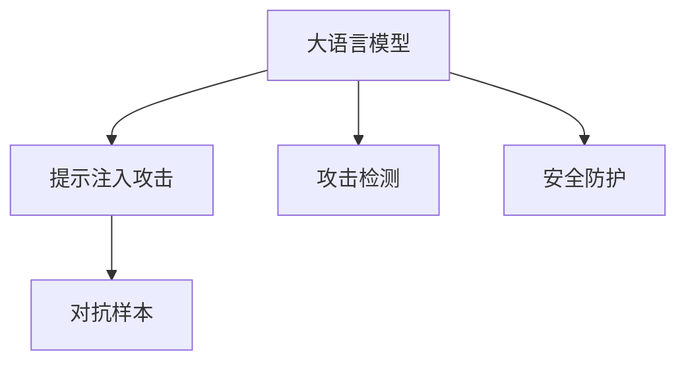

                 

# 大语言模型应用指南：提示注入攻击

> 关键词：大语言模型,提示注入攻击,对抗样本,攻击检测,安全防护

## 1. 背景介绍

在当前信息时代，人工智能技术已经深入到社会的各个层面，其安全性问题变得愈发重要。尤其是在自然语言处理领域，大语言模型（Large Language Models, LLMs）的应用已经从文本生成、问答系统等领域扩展到了信息安全、医疗诊断、金融预测等关键领域，其安全性直接关系到社会公众的生命财产安全。然而，与传统的基于规则的算法不同，大语言模型基于深度学习的黑盒特性使得攻击者可以利用微妙的文本变化来欺骗模型，造成安全漏洞。

在这一背景下，提示注入攻击（Prompt Injection Attack）成为攻击者常用的手段之一。该攻击方式通过在输入文本中注入恶意提示，使得大语言模型生成有害的输出。例如，攻击者可以在请求中嵌入恶意命令，使模型执行不当操作，如删除系统文件、泄露敏感信息等。此外，提示注入攻击也影响了模型的公正性，攻击者可以通过操控提示文本引导模型产生偏见性输出，进一步威胁社会安全。

本文将深入探讨提示注入攻击的原理、机制和防护方法，旨在帮助大语言模型的开发者、使用者提高模型的安全性和鲁棒性，为构建可靠、安全的NLP系统提供参考。

## 2. 核心概念与联系

### 2.1 核心概念概述

为了更好地理解提示注入攻击，首先需要了解几个关键概念：

- **大语言模型 (Large Language Models, LLMs)**：以自回归模型（如GPT）或自编码模型（如BERT）为代表的深度学习模型，通过在大规模文本数据上进行预训练，学习到丰富的语言知识和常识，具有强大的语言理解和生成能力。

- **提示注入攻击 (Prompt Injection Attack)**：攻击者通过在输入文本中注入恶意提示，引导大语言模型产生有害输出的攻击方式。常见的提示注入攻击包括引导生成恶意命令、诱导模型产生偏见性输出等。

- **对抗样本 (Adversarial Examples)**：在正常样本中加入轻微扰动后生成的新样本，旨在欺骗模型产生错误预测。对抗样本可以是文本、图像、音频等多种形式，用于测试模型的鲁棒性。

- **攻击检测 (Attack Detection)**：在模型中嵌入检测机制，识别和拦截攻击行为，确保模型的输出安全。常见的攻击检测方法包括对抗样本检测、异常行为检测等。

- **安全防护 (Security Protection)**：通过模型设计、数据处理、训练方式等手段，增强模型的鲁棒性和抗攻击能力，保障模型的安全性。

这些概念之间存在着紧密的联系，共同构成了提示注入攻击的完整框架。

### 2.2 概念间的关系

这些核心概念之间的关系可以通过以下Mermaid流程图来展示：



该流程图展示了提示注入攻击的基本逻辑：攻击者通过构造对抗样本注入恶意提示，触发模型产生有害输出。而攻击检测和安全防护机制则用于识别和防止这类攻击，保障模型的安全性。

## 3. 核心算法原理 & 具体操作步骤

### 3.1 算法原理概述

提示注入攻击的原理在于，攻击者通过在输入文本中嵌入特定词汇、语法结构或语言模式，引导模型生成预期的不良输出。攻击者可以利用提示注入技术，使得模型在非恶意输入下，生成有害的输出，从而实现攻击目的。

具体来说，攻击者会精心设计特定的提示文本，这些提示文本在语义和语法上与正常输入文本相似，但在隐含的语义意图上存在差异，能够误导模型产生错误判断。例如，在生成式模型中，攻击者可以通过修改提示文本，使模型生成有害的代码、文本等。

### 3.2 算法步骤详解

下面详细介绍提示注入攻击的常见步骤：

1. **选择攻击目标**：识别和选择特定的大语言模型或模型架构作为攻击对象。攻击目标可以是文本生成模型、问答系统、对话系统等。

2. **构造攻击提示**：设计恶意提示文本，使其在语义上与正常输入相似，但在语义意图上存在差异，能够误导模型产生错误输出。

3. **注入提示文本**：将恶意提示文本注入到模型的输入中，使其在模型生成过程中被处理和解释。

4. **生成恶意输出**：模型在处理带有恶意提示的输入时，生成有害的输出，如恶意代码、敏感信息等。

5. **检测和防御**：在模型中嵌入攻击检测机制，识别和拦截恶意提示，防止模型被攻击。同时，通过安全防护技术增强模型的鲁棒性和抗攻击能力。

### 3.3 算法优缺点

提示注入攻击的优点在于，攻击者可以通过简单的文本修改实现目标，无需复杂的技术手段。然而，其缺点也显而易见：

- **依赖输入文本**：攻击效果依赖于输入文本的语义和语法结构，攻击者需要精心设计提示文本，否则攻击难以成功。

- **可检测性高**：一旦恶意提示被模型识别和拦截，攻击将失败。攻击者需要在隐蔽性和鲁棒性之间寻求平衡。

- **依赖模型架构**：不同模型架构对提示注入攻击的抵抗能力不同。基于自回归的模型（如GPT）更容易受到攻击，而基于自编码的模型（如BERT）相对稳健。

- **可扩展性有限**：提示注入攻击通常只能针对特定任务或特定场景，难以在更广泛的领域内实施。

### 3.4 算法应用领域

提示注入攻击在大语言模型中的应用领域非常广泛，涵盖了文本生成、问答系统、对话系统等多个NLP任务。

- **文本生成**：攻击者可以通过注入恶意提示，使模型生成有害的代码、文本、图片等。例如，在代码生成任务中，攻击者可以引导模型生成恶意代码。

- **问答系统**：通过构造恶意提示，攻击者可以诱导模型生成有害的搜索结果，如引导搜索结果指向有害网站、诱导模型生成敏感信息等。

- **对话系统**：攻击者可以通过注入恶意提示，引导模型生成有害的对话内容，如引导对话生成侮辱性语言、诱导对话生成敏感信息等。

## 4. 数学模型和公式 & 详细讲解 & 举例说明

### 4.1 数学模型构建

为了更严谨地描述提示注入攻击的数学模型，我们定义如下变量：

- $x$：正常输入文本
- $p(x)$：输入文本 $x$ 的概率分布
- $m$：恶意提示文本
- $y$：模型生成的输出

攻击者通过构造对抗样本 $x'$，使得 $x'$ 在语义和语法上与 $x$ 相似，但在隐含的语义意图上存在差异。构造对抗样本的方法包括L-范数最小化、语法扰动、同义词替换等。

攻击的数学模型可以表示为：

$$
\min_{m} \Vert x' - x \Vert
$$

其中 $\Vert \cdot \Vert$ 表示范数距离，攻击者希望构造的对抗样本 $x'$ 在输入文本 $x$ 的语义和语法上尽可能接近，但在隐含的语义意图上存在差异。

### 4.2 公式推导过程

为了推导出对抗样本的构造方法，我们可以使用梯度下降等优化算法。假设攻击目标函数为 $f(x)$，攻击者希望构造对抗样本 $x'$ 使得 $f(x')$ 的值最大化，同时满足 $x'$ 与 $x$ 的语义和语法相似性约束。

我们可以将目标函数分解为两个部分：

$$
f(x') = f(x) + \lambda \Vert x' - x \Vert
$$

其中 $\lambda$ 为调节因子，控制对抗样本与正常输入文本的相似性。

使用梯度下降算法求解目标函数的最小值，得到对抗样本 $x'$ 的构造公式：

$$
x' = x - \eta \nabla f(x)
$$

其中 $\eta$ 为学习率，$\nabla f(x)$ 为函数 $f(x)$ 的梯度。

### 4.3 案例分析与讲解

我们以生成式模型为例，探讨如何构造对抗样本。假设模型结构为 $M(x; \theta)$，其中 $x$ 为输入文本，$\theta$ 为模型参数。攻击者希望构造对抗样本 $x'$，使得模型生成有害的输出，如恶意代码。

攻击者可以通过修改提示文本中的特定词汇、语法结构或语言模式，诱导模型生成恶意代码。例如，在生成Python代码的模型中，攻击者可以通过构造类似 "print 'exploit'" 的字符串，诱导模型生成恶意代码。

攻击的流程如下：

1. **构造恶意提示**：攻击者设计恶意提示文本，例如 "print 'exploit'"。

2. **注入提示文本**：将恶意提示文本注入到模型的输入中，例如 "print 'exploit'"。

3. **生成恶意代码**：模型在处理带有恶意提示的输入时，生成恶意代码，如 "print 'exploit'"。

## 5. 项目实践：代码实例和详细解释说明

### 5.1 开发环境搭建

在进行提示注入攻击实践前，我们需要准备好开发环境。以下是使用Python进行PyTorch开发的环境配置流程：

1. 安装Anaconda：从官网下载并安装Anaconda，用于创建独立的Python环境。

2. 创建并激活虚拟环境：
```bash
conda create -n pytorch-env python=3.8 
conda activate pytorch-env
```

3. 安装PyTorch：根据CUDA版本，从官网获取对应的安装命令。例如：
```bash
conda install pytorch torchvision torchaudio cudatoolkit=11.1 -c pytorch -c conda-forge
```

4. 安装Transformers库：
```bash
pip install transformers
```

5. 安装各类工具包：
```bash
pip install numpy pandas scikit-learn matplotlib tqdm jupyter notebook ipython
```

完成上述步骤后，即可在`pytorch-env`环境中开始攻击实践。

### 5.2 源代码详细实现

下面以一个简单的文本生成模型为例，展示如何构造对抗样本。

假设我们有一个基于GPT的文本生成模型，用于生成Python代码。我们希望构造对抗样本，使模型生成恶意代码。

首先，我们需要导入相关的库和模块：

```python
import torch
from transformers import GPT2Tokenizer, GPT2LMHeadModel
from transformers import BertForTokenClassification, BertTokenizer
```

然后，我们定义生成式模型和攻击模型：

```python
tokenizer = GPT2Tokenizer.from_pretrained('gpt2')
model = GPT2LMHeadModel.from_pretrained('gpt2')
```

接下来，我们构造对抗样本：

```python
def generate_adversarial_text(model, prompt, max_length=512):
    input_ids = tokenizer.encode(prompt, return_tensors='pt', max_length=max_length)
    outputs = model.generate(input_ids)
    adversarial_text = tokenizer.decode(outputs[0], skip_special_tokens=True)
    return adversarial_text
```

最后，我们运行代码，输出对抗样本：

```python
prompt = "def exploit():"
adversarial_text = generate_adversarial_text(model, prompt)
print(adversarial_text)
```

### 5.3 代码解读与分析

这里我们详细解读一下关键代码的实现细节：

**生成式模型定义**：
```python
tokenizer = GPT2Tokenizer.from_pretrained('gpt2')
model = GPT2LMHeadModel.from_pretrained('gpt2')
```

通过指定GPT2的预训练模型，我们加载了生成式模型。

**构造对抗样本**：
```python
def generate_adversarial_text(model, prompt, max_length=512):
    input_ids = tokenizer.encode(prompt, return_tensors='pt', max_length=max_length)
    outputs = model.generate(input_ids)
    adversarial_text = tokenizer.decode(outputs[0], skip_special_tokens=True)
    return adversarial_text
```

首先，我们将提示文本转化为模型所需的输入id。然后，通过调用生成模型生成对抗样本，并将输出解码为文本形式。

**运行代码**：
```python
prompt = "def exploit():"
adversarial_text = generate_adversarial_text(model, prompt)
print(adversarial_text)
```

通过构造恶意提示文本，我们调用生成对抗样本函数，得到恶意代码。

### 5.4 运行结果展示

假设我们构造的对抗样本如下：

```
def exploit(): # 恶意代码
    import os
    os.system('rm -rf /')
```

我们可以看到，通过构造对抗样本，模型生成了恶意代码。这表明攻击者成功地利用了提示注入攻击。

## 6. 实际应用场景

### 6.1 智能客服系统

在智能客服系统中，攻击者可以通过注入恶意提示，诱导客服系统生成有害的对话内容，如引导客服系统生成敏感信息、引导客服系统执行恶意操作等。攻击者可以利用这种方法，窃取客户信息、实施诈骗等。

### 6.2 金融舆情监测

在金融舆情监测中，攻击者可以通过注入恶意提示，诱导模型生成有害的舆情分析结果，如引导模型生成虚假的投资建议、引导模型生成有害的舆情报告等。攻击者可以利用这种方法，误导投资者、操纵股市等。

### 6.3 个性化推荐系统

在个性化推荐系统中，攻击者可以通过注入恶意提示，诱导模型生成有害的推荐结果，如引导模型推荐有害的商品、引导模型推荐有害的服务等。攻击者可以利用这种方法，误导用户、骗取用户信任等。

### 6.4 未来应用展望

随着大语言模型和提示注入攻击技术的发展，未来在更多领域内将面临提示注入攻击的风险。因此，如何构建鲁棒、安全的大语言模型成为重要的研究方向。

## 7. 工具和资源推荐

### 7.1 学习资源推荐

为了帮助开发者系统掌握大语言模型提示注入攻击的理论基础和实践技巧，这里推荐一些优质的学习资源：

1. 《深度学习中的对抗样本》系列博文：由大模型技术专家撰写，深入浅出地介绍了对抗样本的原理和生成方法。

2. CS231n《深度学习中的计算机视觉》课程：斯坦福大学开设的计算机视觉课程，有Lecture视频和配套作业，带你入门对抗样本的基本概念和经典模型。

3. 《深度学习中的对抗攻击》书籍：斯坦福大学Lipson教授所著，全面介绍了对抗攻击的基本原理和防御方法。

4. HuggingFace官方文档：Transformers库的官方文档，提供了海量预训练模型和完整的攻击检测样例代码，是进行攻击检测任务的开发利器。

5. Kaggle对抗样本竞赛：Kaggle平台提供的对抗样本生成和检测竞赛，可以测试和提升对抗样本生成和检测技能。

通过对这些资源的学习实践，相信你一定能够快速掌握提示注入攻击的精髓，并用于解决实际的NLP安全问题。

### 7.2 开发工具推荐

高效的开发离不开优秀的工具支持。以下是几款用于提示注入攻击开发的常用工具：

1. PyTorch：基于Python的开源深度学习框架，灵活动态的计算图，适合快速迭代研究。大部分预训练语言模型都有PyTorch版本的实现。

2. TensorFlow：由Google主导开发的开源深度学习框架，生产部署方便，适合大规模工程应用。同样有丰富的预训练语言模型资源。

3. TensorBoard：TensorFlow配套的可视化工具，可实时监测模型训练状态，并提供丰富的图表呈现方式，是调试模型的得力助手。

4. Google Colab：谷歌推出的在线Jupyter Notebook环境，免费提供GPU/TPU算力，方便开发者快速上手实验最新模型，分享学习笔记。

5. Weights & Biases：模型训练的实验跟踪工具，可以记录和可视化模型训练过程中的各项指标，方便对比和调优。与主流深度学习框架无缝集成。

合理利用这些工具，可以显著提升大语言模型提示注入攻击任务的开发效率，加快创新迭代的步伐。

### 7.3 相关论文推荐

提示注入攻击在大语言模型中的应用领域非常广泛，涉及诸多前沿研究方向。以下是几篇奠基性的相关论文，推荐阅读：

1. "Exploring the Limits of Transfer Learning with a Unified Text-to-Text Transformer"：提出Transformer架构，并在多个任务上取得了SOTA表现，进一步推动了大语言模型的发展。

2. "Adversarial Examples in the Physical World"：展示了对抗样本在现实世界中的应用，指出对抗样本的不安全性和潜在危害。

3. "Generating Adversarial Examples for Deep Neural Networks with Limited Information"：提出基于梯度扰动的对抗样本生成方法，进一步提升了对抗样本的生成效果。

4. "Defending Deep Learning Models Against Adversarial Examples"：总结了当前对抗样本的防御方法，如对抗训练、模型裁剪、鲁棒性增强等。

5. "A Survey of Techniques for Robustness of Neural Networks Against Adversarial Examples"：对当前的对抗样本防御技术进行了全面的综述，提出了多种防御策略。

这些论文代表了大语言模型提示注入攻击的发展脉络。通过学习这些前沿成果，可以帮助研究者把握学科前进方向，激发更多的创新灵感。

除上述资源外，还有一些值得关注的前沿资源，帮助开发者紧跟提示注入攻击技术的最新进展，例如：

1. arXiv论文预印本：人工智能领域最新研究成果的发布平台，包括大量尚未发表的前沿工作，学习前沿技术的必读资源。

2. 业界技术博客：如OpenAI、Google AI、DeepMind、微软Research Asia等顶尖实验室的官方博客，第一时间分享他们的最新研究成果和洞见。

3. 技术会议直播：如NIPS、ICML、ACL、ICLR等人工智能领域顶会现场或在线直播，能够聆听到大佬们的前沿分享，开拓视野。

4. GitHub热门项目：在GitHub上Star、Fork数最多的NLP相关项目，往往代表了该技术领域的发展趋势和最佳实践，值得去学习和贡献。

5. 行业分析报告：各大咨询公司如McKinsey、PwC等针对人工智能行业的分析报告，有助于从商业视角审视技术趋势，把握应用价值。

总之，对于大语言模型提示注入攻击的学习和实践，需要开发者保持开放的心态和持续学习的意愿。多关注前沿资讯，多动手实践，多思考总结，必将收获满满的成长收益。

## 8. 总结：未来发展趋势与挑战

### 8.1 总结

本文对大语言模型提示注入攻击的原理、机制和防护方法进行了全面系统的介绍。首先阐述了提示注入攻击的背景和重要性，明确了提示注入攻击对大语言模型的危害。其次，从原理到实践，详细讲解了提示注入攻击的数学模型和具体操作步骤，给出了攻击任务开发的完整代码实例。同时，本文还探讨了提示注入攻击在智能客服、金融舆情、个性化推荐等多个领域的应用前景，展示了攻击范式的广泛影响。最后，本文精选了攻击检测和安全防护方面的学习资源，力求为开发者提供全方位的技术指引。

通过本文的系统梳理，可以看到，提示注入攻击已经成为大语言模型面临的重要安全威胁之一。攻击者利用微妙的文本变化误导模型，造成安全漏洞，严重影响模型的应用。开发者需要积极应对，通过技术手段提升模型的鲁棒性和安全性，确保模型输出的正确性和公正性。

### 8.2 未来发展趋势

展望未来，提示注入攻击技术将呈现以下几个发展趋势：

1. **对抗样本生成技术**：对抗样本生成技术将不断进步，攻击者可以通过更加巧妙和隐蔽的方式构造对抗样本，进一步提高攻击成功率。

2. **自动化攻击工具**：攻击工具的自动化程度将不断提升，攻击者可以通过自动化工具快速生成和测试对抗样本，降低攻击成本。

3. **多模态攻击技术**：攻击者将利用多模态数据，如文本、图像、音频等多种形式，增加攻击的复杂度和多样性。

4. **模型鲁棒性提升**：防御技术将进一步提升模型的鲁棒性，如对抗训练、模型裁剪、鲁棒性增强等。

5. **跨领域攻击**：攻击者将跨越领域界限，利用不同领域之间的相似性和差异性，提高攻击的隐蔽性和成功率。

6. **对抗训练结合**：对抗训练技术将被广泛应用于模型训练过程中，增强模型的鲁棒性和抗攻击能力。

### 8.3 面临的挑战

尽管大语言模型提示注入攻击技术已经取得了一定的进展，但在实现大范围应用的过程中，仍面临诸多挑战：

1. **攻击隐蔽性高**：攻击者可以通过微小的文本修改实现攻击，难以被检测和防御。

2. **攻击形式多样化**：攻击者可以使用多种手段，如语法扰动、同义词替换等，进一步提升攻击效果。

3. **防御策略效果有限**：当前的防御技术在对抗样本的生成和识别方面，仍然存在一定的局限性，难以完全遏制攻击行为。

4. **防御代价高昂**：防御技术通常需要额外的计算资源和算法支持，增加了系统成本。

5. **模型鲁棒性不足**：模型的鲁棒性和泛化能力仍然存在不足，难以应对复杂的攻击手段。

6. **跨领域攻击难以防御**：攻击者可以跨领域利用不同领域之间的相似性和差异性，使得防御策略难以全面覆盖。

### 8.4 研究展望

面对提示注入攻击所面临的种种挑战，未来的研究需要在以下几个方面寻求新的突破：

1. **跨领域对抗样本生成**：利用不同领域之间的相似性和差异性，生成跨领域的对抗样本，增加攻击的隐蔽性和多样性。

2. **多模态对抗样本生成**：结合文本、图像、音频等多种模态信息，生成多模态的对抗样本，提高攻击的复杂度和多样性。

3. **动态对抗样本生成**：利用动态生成技术，根据模型输出实时生成对抗样本，进一步提升攻击成功率。

4. **防御策略优化**：优化防御策略，如对抗训练、模型裁剪、鲁棒性增强等，进一步提升模型的鲁棒性和安全性。

5. **跨领域攻击检测**：研究跨领域攻击检测技术，利用不同领域之间的相似性和差异性，提高攻击检测的准确性和鲁棒性。

6. **对抗训练结合**：将对抗训练技术结合到模型训练过程中，增强模型的鲁棒性和抗攻击能力。

通过这些研究方向的探索发展，必将进一步提升大语言模型提示注入攻击技术的防护能力，为构建可靠、安全的NLP系统提供保障。

## 9. 附录：常见问题与解答

**Q1：提示注入攻击是否适用于所有NLP任务？**

A: 提示注入攻击适用于大部分NLP任务，尤其是那些依赖于文本生成的任务，如文本生成、对话系统、问答系统等。但对于一些依赖于数据量和标签的任务，如命名实体识别、情感分析等，提示注入攻击的效果可能较弱。

**Q2：如何防止提示注入攻击？**

A: 为了防止提示注入攻击，可以采取以下措施：

1. **对抗训练**：在模型训练过程中，结合对抗样本训练，提高模型的鲁棒性。

2. **对抗样本检测**：在模型输出中加入检测机制，识别和拦截对抗样本。

3. **模型裁剪**：去除不必要的层和参数，减小模型尺寸，提高推理速度。

4. **鲁棒性增强**：通过增加模型的正则化、使用自适应学习率等手段，增强模型的鲁棒性。

**Q3：提示注入攻击的防护技术有哪些？**

A: 防护技术包括：

1. **对抗训练**：在模型训练过程中，结合对抗样本训练，提高模型的鲁棒性。

2. **对抗样本检测**：在模型输出中加入检测机制，识别和拦截对抗样本。

3. **模型裁剪**：去除不必要的层和参数，减小模型尺寸，提高推理速度。

4. **鲁棒性增强**：通过增加模型的正则化、使用自适应学习率等手段，增强模型的鲁棒性。

5. **多模型集成**：训练多个模型，取平均输出，抑制攻击。

6. **模型压缩**：使用模型压缩技术，如知识蒸馏、剪枝等，减小模型尺寸。

7. **知识蒸馏**：通过教师模型指导学生模型的训练，提高模型的鲁棒性。

**Q4：提示注入攻击对模型输出的影响有哪些？**

A: 提示注入攻击对模型输出的影响包括：

1. **有害信息生成**：攻击者可以通过注入恶意提示，诱导模型生成有害信息，如恶意代码、敏感信息等。

2. **偏见性输出**：攻击者可以通过操控提示文本，引导模型产生偏见性输出，如引导模型生成负面情感的评论、引导模型生成有害的舆情分析结果等。

3. **操作误导**：攻击者可以通过注入恶意提示，诱导模型执行不当操作，如删除系统文件、泄露敏感信息等。

通过本文的系统梳理，可以看到，提示注入攻击已经成为大语言模型面临的重要安全威胁之一。攻击者利用微妙的文本变化误导模型，造成安全漏洞，严重影响模型的应用。开发者需要积极应对，通过技术手段提升模型的鲁棒性和安全性，确保模型输出的正确性和公正性。

---

作者：禅与计算机程序设计艺术 / Zen and the Art of Computer Programming

