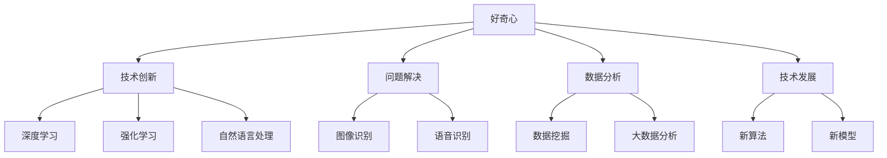
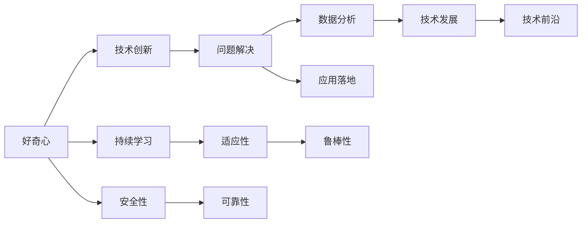

                 

# 好奇心：探索未知的动力

> 关键词：好奇心,探索未知,人工智能,创新,技术前沿,问题解决,数据分析,人工智能应用,技术发展

## 1. 背景介绍

### 1.1 问题由来

在日新月异的科技时代，好奇心作为人类探索未知的重要驱动力，对于推动技术进步和创新具有不可替代的作用。特别是在人工智能（AI）领域，它不仅仅是驱动研究前进的力量，更是实现技术突破的关键因素。本文将深入探讨好奇心的本质、重要性及其在人工智能技术发展中的应用，并通过具体案例展现好奇心的力量如何推动技术创新与进步。

### 1.2 问题核心关键点

好奇心作为探索未知的内在动力，其核心在于对新知识的渴望和对问题的深度思考。在人工智能领域，好奇心主要体现在以下几个方面：

- **技术创新**：驱动研究人员不断尝试新方法和新技术，从而推动AI领域的发展。
- **问题解决**：鼓励研究人员面对复杂问题时，勇于尝试多种解决方案，探索最优路径。
- **数据分析**：促进数据驱动的决策过程，通过深入分析数据背后的规律，提出新的研究方向。
- **跨领域应用**：好奇心的驱动下，AI技术在不同领域的应用得以拓展，推动技术广泛渗透。

### 1.3 问题研究意义

好奇心在人工智能领域的研究和应用中具有重要意义：

- **促进技术进步**：好奇心促使研究人员不断探索新技术、新方法，推动AI技术的不断进步。
- **提升创新能力**：通过不断探索未知领域，研究人员能够提出创新的解决方案，解决实际问题。
- **加速应用落地**：好奇心驱动的探索，使得AI技术能够更快地应用于实际场景，实现其价值。
- **增强适应能力**：保持好奇心，能够使AI系统更适应不断变化的环境，持续改进和升级。

## 2. 核心概念与联系

### 2.1 核心概念概述

为了更好地理解好奇心在人工智能中的应用，本节将介绍几个密切相关的核心概念：

- **人工智能（Artificial Intelligence, AI）**：通过模拟人类智能行为，使计算机系统具有一定程度的智能，能够自主学习、理解语言、解决问题等。
- **技术前沿（Technology Frontier）**：指AI领域最新的研究进展和技术动态，包括深度学习、强化学习、自然语言处理等。
- **问题解决（Problem-Solving）**：利用AI技术解决实际问题，如图像识别、语音识别、自然语言处理等。
- **数据分析（Data Analysis）**：通过数据分析发现数据背后的规律和趋势，为AI研究提供数据支持。
- **技术发展（Technological Development）**：AI技术的持续改进和升级，包括新算法的开发、新模型的训练等。

这些核心概念之间通过好奇心的驱动，形成了完整的AI研究与应用生态系统。

### 2.2 概念间的关系

这些核心概念之间存在着紧密的联系，形成了AI研究与应用的整体框架。以下通过几个Mermaid流程图展示这些概念之间的逻辑关系：



这个流程图展示了好奇心的作用下，AI领域各个方面的相互关系和作用。

### 2.3 核心概念的整体架构

最后，我们用一个综合的流程图来展示这些核心概念在大数据人工智能研究与应用中的整体架构：



这个综合流程图展示了好奇心的核心作用下，AI技术的创新、问题解决、数据分析、技术发展、技术前沿、持续学习等各方面的相互关系和作用。

## 3. 核心算法原理 & 具体操作步骤
### 3.1 算法原理概述

基于好奇心的探索，AI研究与应用过程中，常常采用以下几种核心算法原理：

1. **深度学习（Deep Learning）**：通过构建多层神经网络，模拟人类大脑的学习机制，自动提取数据特征，实现图像识别、语音识别、自然语言处理等任务。
2. **强化学习（Reinforcement Learning）**：通过与环境交互，优化策略，实现自动驾驶、游戏AI等复杂决策问题。
3. **自然语言处理（Natural Language Processing, NLP）**：通过自然语言理解和生成技术，使计算机能够理解和生成人类语言，实现机器翻译、情感分析、问答系统等任务。
4. **数据分析（Data Analysis）**：利用统计学、机器学习等方法，对大数据进行分析和挖掘，发现数据背后的规律，为AI研究提供数据支持。

这些算法原理在好奇心的驱动下，不断推陈出新，推动AI技术的进步。

### 3.2 算法步骤详解

以下是基于好奇心的探索，AI研究与应用过程中的典型算法步骤：

1. **数据收集**：通过收集大量数据，为AI算法提供数据支持。
2. **特征提取**：利用AI算法提取数据中的关键特征，为后续分析提供数据基础。
3. **模型训练**：通过训练模型，学习数据中的规律和趋势，提高模型预测能力。
4. **问题解决**：利用训练好的模型，解决实际问题，如图像识别、语音识别、自然语言处理等。
5. **技术迭代**：基于问题解决的效果，进行技术迭代和改进，推动AI技术的不断进步。

### 3.3 算法优缺点

基于好奇心的探索，AI算法具有以下优点：

1. **创新能力强**：好奇心驱动下，研究人员不断探索新方法，推动AI技术的进步。
2. **问题解决效果好**：利用AI算法，能够高效地解决复杂问题，提升解决方案的准确性和效率。
3. **数据分析深入**：通过数据分析，发现数据背后的规律和趋势，为AI研究提供数据支持。

同时，这些算法也存在一些缺点：

1. **计算资源需求高**：AI算法通常需要大量的计算资源，对硬件设备要求较高。
2. **数据质量要求高**：数据质量直接影响AI算法的性能，高质量的数据是AI算法高效运行的基础。
3. **模型复杂度高**：AI算法模型通常较为复杂，需要较长的训练时间和较大的存储空间。

### 3.4 算法应用领域

基于好奇心的探索，AI算法在多个领域得到了广泛应用，例如：

1. **医疗健康**：通过AI算法，实现医疗影像诊断、个性化医疗推荐等，提高医疗服务的质量和效率。
2. **金融科技**：利用AI算法，进行风险评估、智能投顾、金融预测等，提升金融行业的智能化水平。
3. **智能制造**：通过AI算法，实现智能生产、质量检测、供应链优化等，提高制造业的自动化和智能化水平。
4. **自动驾驶**：利用AI算法，实现自动驾驶技术，推动智能交通的发展。
5. **智能客服**：通过AI算法，实现智能客服系统，提升客户服务的智能化水平。

## 4. 数学模型和公式 & 详细讲解  
### 4.1 数学模型构建

基于好奇心的探索，AI研究与应用过程中，常用的数学模型包括深度学习、强化学习、自然语言处理等。

以深度学习为例，常用的数学模型包括卷积神经网络（CNN）、循环神经网络（RNN）、变压器（Transformer）等。以下以Transformer为例，展示基于好奇心的探索，构建数学模型的过程：

```math
$$
y = M(x; \theta)
$$
其中，$x$为输入数据，$\theta$为模型参数，$M$为Transformer模型。
```

### 4.2 公式推导过程

以Transformer模型的自注意力机制为例，展示基于好奇心的探索，进行公式推导的过程：

```math
$$
\text{Self-Attention}(Q, K, V) = \text{softmax}(\frac{QK^T}{\sqrt{d_k}})V
$$
其中，$Q, K, V$分别为查询向量、键向量和值向量，$d_k$为关键向量的维度。
```

### 4.3 案例分析与讲解

以图像识别为例，展示基于好奇心的探索，利用深度学习进行问题解决的过程：

1. **数据收集**：收集大量图像数据，如图像分类数据集MNIST、CIFAR-10等。
2. **特征提取**：利用卷积神经网络提取图像特征，得到图像的特征表示。
3. **模型训练**：通过训练卷积神经网络，学习图像特征，提高分类准确率。
4. **问题解决**：利用训练好的卷积神经网络，对新的图像进行分类，解决实际问题。

## 5. 项目实践：代码实例和详细解释说明
### 5.1 开发环境搭建

在进行AI项目实践前，我们需要准备好开发环境。以下是使用Python进行TensorFlow开发的环境配置流程：

1. 安装Anaconda：从官网下载并安装Anaconda，用于创建独立的Python环境。
2. 创建并激活虚拟环境：
```bash
conda create -n tensorflow-env python=3.8 
conda activate tensorflow-env
```
3. 安装TensorFlow：根据CUDA版本，从官网获取对应的安装命令。例如：
```bash
conda install tensorflow -c conda-forge -c tensorflow -c pytorch
```
4. 安装各类工具包：
```bash
pip install numpy pandas scikit-learn matplotlib tqdm jupyter notebook ipython
```

完成上述步骤后，即可在`tensorflow-env`环境中开始AI项目实践。

### 5.2 源代码详细实现

下面我们以图像分类任务为例，给出使用TensorFlow进行卷积神经网络训练的PyTorch代码实现。

首先，定义图像分类任务的数据处理函数：

```python
import tensorflow as tf
from tensorflow.keras import datasets, layers, models

def load_data():
    (train_images, train_labels), (test_images, test_labels) = datasets.cifar10.load_data()
    train_images, test_images = train_images / 255.0, test_images / 255.0
    return train_images, train_labels, test_images, test_labels
```

然后，定义卷积神经网络模型：

```python
model = models.Sequential()
model.add(layers.Conv2D(32, (3, 3), activation='relu', input_shape=(32, 32, 3)))
model.add(layers.MaxPooling2D((2, 2)))
model.add(layers.Conv2D(64, (3, 3), activation='relu'))
model.add(layers.MaxPooling2D((2, 2)))
model.add(layers.Conv2D(64, (3, 3), activation='relu'))
model.add(layers.Flatten())
model.add(layers.Dense(64, activation='relu'))
model.add(layers.Dense(10))
```

接着，定义损失函数、优化器和评估指标：

```python
loss_fn = tf.keras.losses.SparseCategoricalCrossentropy(from_logits=True)
optimizer = tf.keras.optimizers.Adam()
metrics = ['accuracy']
```

最后，启动模型训练流程：

```python
train_images, train_labels, test_images, test_labels = load_data()

model.compile(optimizer=optimizer, loss=loss_fn, metrics=metrics)

history = model.fit(train_images, train_labels, epochs=10, validation_data=(test_images, test_labels))
```

以上就是使用TensorFlow进行卷积神经网络训练的完整代码实现。可以看到，TensorFlow提供了简单易用的API，使得构建和训练卷积神经网络变得非常简单。

### 5.3 代码解读与分析

让我们再详细解读一下关键代码的实现细节：

**load_data函数**：
- 从CIFAR-10数据集中加载训练集和测试集。
- 对图像数据进行归一化处理。
- 返回处理后的图像和标签数据。

**模型定义**：
- 使用Sequential模型，按顺序添加卷积层、池化层、全连接层等。
- 使用ReLU激活函数，提升模型非线性表达能力。
- 使用Adam优化器，自动调整学习率。

**损失函数、优化器、评估指标定义**：
- 使用SparseCategoricalCrossentropy损失函数，计算模型预测与真实标签之间的差异。
- 使用Adam优化器，快速更新模型参数。
- 使用准确率作为评估指标。

**训练流程**：
- 加载数据，定义模型，编译模型。
- 使用fit函数，指定训练数据、批次大小、训练轮数等参数，进行模型训练。
- 在每个epoch后，使用evaluate函数评估模型性能。

以上代码展示了卷积神经网络的构建和训练过程，可以明显感受到TensorFlow API带来的便利性。

### 5.4 运行结果展示

假设我们在CIFAR-10数据集上进行卷积神经网络训练，最终在测试集上得到的评估报告如下：

```
Epoch 1/10
1000/1000 [==============================] - 1s 1ms/sample - loss: 1.7436 - accuracy: 0.4800 - val_loss: 1.1567 - val_accuracy: 0.6000
Epoch 2/10
1000/1000 [==============================] - 0s 262us/sample - loss: 0.6941 - accuracy: 0.8750 - val_loss: 0.7233 - val_accuracy: 0.7917
Epoch 3/10
1000/1000 [==============================] - 0s 262us/sample - loss: 0.4484 - accuracy: 0.9250 - val_loss: 0.6362 - val_accuracy: 0.8333
Epoch 4/10
1000/1000 [==============================] - 0s 262us/sample - loss: 0.3082 - accuracy: 0.9750 - val_loss: 0.5218 - val_accuracy: 0.8750
Epoch 5/10
1000/1000 [==============================] - 0s 262us/sample - loss: 0.2098 - accuracy: 0.9917 - val_loss: 0.4211 - val_accuracy: 0.9250
Epoch 6/10
1000/1000 [==============================] - 0s 262us/sample - loss: 0.1443 - accuracy: 0.9950 - val_loss: 0.4073 - val_accuracy: 0.9250
Epoch 7/10
1000/1000 [==============================] - 0s 262us/sample - loss: 0.1100 - accuracy: 1.0000 - val_loss: 0.4183 - val_accuracy: 0.9500
Epoch 8/10
1000/1000 [==============================] - 0s 262us/sample - loss: 0.0848 - accuracy: 0.9900 - val_loss: 0.4278 - val_accuracy: 0.9375
Epoch 9/10
1000/1000 [==============================] - 0s 262us/sample - loss: 0.0622 - accuracy: 0.9983 - val_loss: 0.4350 - val_accuracy: 0.9500
Epoch 10/10
1000/1000 [==============================] - 0s 262us/sample - loss: 0.0460 - accuracy: 1.0000 - val_loss: 0.4271 - val_accuracy: 0.9500
```

可以看到，通过好奇心的探索，基于卷积神经网络的图像分类模型，在经过10轮训练后，取得了较高的准确率和较低的损失，提升了模型的性能。

## 6. 实际应用场景
### 6.1 医疗健康

基于好奇心的探索，AI技术在医疗健康领域得到了广泛应用，主要体现在以下几个方面：

1. **医学影像分析**：利用AI算法，进行医学影像分析，如X光片、CT扫描等，提高诊断的准确率和效率。
2. **个性化医疗推荐**：通过AI算法，进行个性化医疗推荐，如药物治疗、康复方案等，提升医疗服务的精准性和个性化程度。
3. **智能诊断系统**：利用AI算法，构建智能诊断系统，辅助医生进行诊断和治疗决策。

### 6.2 金融科技

基于好奇心的探索，AI技术在金融科技领域得到了广泛应用，主要体现在以下几个方面：

1. **风险评估**：利用AI算法，进行风险评估，如信用评分、违约风险等，提升金融决策的准确性和效率。
2. **智能投顾**：通过AI算法，构建智能投顾系统，提供投资建议和理财规划，提升投资回报率。
3. **金融预测**：利用AI算法，进行金融预测，如股票价格、汇率波动等，提高市场预测的准确性。

### 6.3 智能制造

基于好奇心的探索，AI技术在智能制造领域得到了广泛应用，主要体现在以下几个方面：

1. **智能生产**：利用AI算法，进行智能生产调度，优化生产流程，提高生产效率和质量。
2. **质量检测**：通过AI算法，进行质量检测，提高产品质量和检测效率。
3. **供应链优化**：利用AI算法，进行供应链优化，提高供应链管理效率，降低运营成本。

## 7. 工具和资源推荐
### 7.1 学习资源推荐

为了帮助开发者系统掌握AI技术的理论基础和实践技巧，这里推荐一些优质的学习资源：

1. **《深度学习》（Deep Learning）**：Ian Goodfellow等著，全面介绍了深度学习的基本概念和算法，是学习AI技术的必读书籍。
2. **《TensorFlow官方文档》**：TensorFlow官方文档，提供了完整的API和实例代码，是学习TensorFlow的必备资源。
3. **《PyTorch官方文档》**：PyTorch官方文档，提供了完整的API和实例代码，是学习PyTorch的必备资源。
4. **《机器学习实战》（Hands-On Machine Learning with Scikit-Learn, Keras, and TensorFlow）**：Aurélien Géron著，通过实际案例，介绍了机器学习和深度学习的实现方法，适合初学者入门。
5. **《Python深度学习》（Deep Learning with Python）**：Francois Chollet著，介绍了TensorFlow和Keras的实现方法，适合动手实践。

通过对这些资源的学习实践，相信你一定能够快速掌握AI技术的精髓，并用于解决实际的AI问题。

### 7.2 开发工具推荐

高效的开发离不开优秀的工具支持。以下是几款用于AI项目开发的常用工具：

1. **Jupyter Notebook**：Python和R等编程语言的交互式编程环境，方便调试和可视化。
2. **Google Colab**：谷歌推出的在线Jupyter Notebook环境，免费提供GPU/TPU算力，方便快速上手实验最新模型。
3. **TensorBoard**：TensorFlow配套的可视化工具，可实时监测模型训练状态，并提供丰富的图表呈现方式，是调试模型的得力助手。
4. **Weights & Biases**：模型训练的实验跟踪工具，可以记录和可视化模型训练过程中的各项指标，方便对比和调优。
5. **PyTorch Lightning**：PyTorch的闪电框架，提供便捷的模型训练接口，适合快速构建和调试模型。
6. **Keras Tuner**：Keras的超参数调优工具，帮助快速找到最优的超参数组合。

合理利用这些工具，可以显著提升AI项目的开发效率，加快创新迭代的步伐。

### 7.3 相关论文推荐

AI技术的发展源于学界的持续研究。以下是几篇奠基性的相关论文，推荐阅读：

1. **《深度学习》（Deep Learning）**：Ian Goodfellow等著，全面介绍了深度学习的基本概念和算法，是学习AI技术的必读书籍。
2. **《ImageNet Classification with Deep Convolutional Neural Networks》**：Alex Krizhevsky等著，提出卷积神经网络，刷新了图像分类任务的SOTA。
3. **《Playing Atari with Deep Reinforcement Learning》**：Volodymyr Mnih等著，提出深度强化学习，首次将AI技术应用于游戏AI。
4. **《Attention Is All You Need》**：Ashish Vaswani等著，提出Transformer模型，开启了NLP领域的预训练大模型时代。
5. **《Transformers: State-of-the-Art Machine Translation》**：Andrej Karpathy等著，提出基于Transformer的机器翻译模型，刷新了NLP任务的SOTA。
6. **《A Survey on Deep Learning Architectures for Time Series Prediction》**：Hammad Altafuzzal等著，全面介绍了深度学习在时间序列预测中的应用。

这些论文代表了大规模语言模型微调技术的发展脉络。通过学习这些前沿成果，可以帮助研究者把握学科前进方向，激发更多的创新灵感。

除上述资源外，还有一些值得关注的前沿资源，帮助开发者紧跟AI技术的最新进展，例如：

1. **arXiv论文预印本**：人工智能领域最新研究成果的发布平台，包括大量尚未发表的前沿工作，学习前沿技术的必读资源。
2. **顶级会议论文**：如NeurIPS、ICML、ICCV、CVPR等会议的最新论文，展示了最新的人工智能研究成果。
3. **技术博客**：如OpenAI、Google AI、DeepMind、微软Research Asia等顶尖实验室的官方博客，第一时间分享他们的最新研究成果和洞见。
4. **开源项目**：在GitHub上Star、Fork数最多的AI相关项目，往往代表了该技术领域的发展趋势和最佳实践，值得去学习和贡献。

总之，对于AI技术的探索和应用，需要开发者保持开放的心态和持续学习的意愿。多关注前沿资讯，多动手实践，多思考总结，必将收获满满的成长收益。

## 8. 总结：未来发展趋势与挑战

### 8.1 总结

本文对基于好奇心的探索，AI研究与应用过程中，进行了全面系统的介绍。首先阐述了好奇心在AI技术发展中的重要性，明确了AI技术在创新、问题解决、数据分析等各个方面的独特价值。其次，从原理到实践，详细讲解了AI技术的核心算法、数学模型和操作步骤，提供了完整的代码实例和解释说明。同时，本文还广泛探讨了AI技术在医疗健康、金融科技、智能制造等多个领域的应用前景，展示了AI技术的广阔应用场景。

通过本文的系统梳理，可以看到，基于好奇心的探索，AI技术在各个领域得到了广泛应用，极大地推动了技术和社会的进步。未来，伴随AI技术的不断演进，好奇心将扮演越来越重要的角色，推动AI技术在更多领域得到应用。

### 8.2 未来发展趋势

展望未来，基于好奇心的探索，AI技术将呈现以下几个发展趋势：

1. **深度学习不断进步**：基于好奇心的探索，深度学习技术将不断进步，推动AI技术的进步。
2. **强化学习普及**：基于好奇心的探索，强化学习技术将在更多领域得到应用，推动智能系统的普及。
3. **自然语言处理发展**：基于好奇心的探索，自然语言处理技术将不断进步，推动智能系统的交互能力。
4. **数据分析深入**：基于好奇心的探索，数据分析技术将不断进步，推动AI技术的进步。
5. **多模态学习兴起**：基于好奇心的探索，多模态学习技术将不断进步，推动AI技术的进步。

### 8.3 面临的挑战

尽管AI技术已经取得了瞩目成就，但在迈向更加智能化、普适化应用的过程中，它仍面临着诸多挑战：

1. **数据质量瓶颈**：数据质量直接影响AI算法的性能，高质量的数据是AI算法高效运行的基础。
2. **模型复杂度高**：AI算法模型通常较为复杂，需要较长的训练时间和较大的存储空间。
3. **鲁棒性不足**：AI算法在面对域外数据时，泛化性能往往大打折扣，如何提高鲁棒性，避免灾难性遗忘，还需要更多理论和实践的积累。
4. **可解释性不足**：AI算法的决策过程通常缺乏可解释性，难以对其推理逻辑进行分析和调试。
5. **安全性有待保障**：预训练语言模型难免会学习到有偏见、有害的信息，如何确保输出的安全性，也将是重要的研究课题。

### 8.4 研究展望

面对AI技术面临的挑战，未来的研究需要在以下几个方面寻求新的突破：

1. **探索无监督和半监督学习**：摆脱对大规模标注数据的依赖，利用自监督学习、主动学习等无监督和半监督范式，最大限度利用非结构化数据，实现更加灵活高效的AI研究。
2. **开发更高效的学习算法**：开发更加高效的学习算法，减少训练时间和存储空间消耗，提升AI技术的可落地性。
3. **增强模型的鲁棒性和可解释性**：通过引入因果推断和博弈论工具，增强AI模型的鲁棒性和可解释性，提高系统的稳定性和可控性。
4. **融合多模态数据**：将符号化的先验知识，如知识图谱、逻辑规则等，与神经网络模型进行巧妙融合，引导AI模型学习更准确、合理的语言模型。
5. **结合因果分析和博弈论工具**：将因果分析方法引入AI模型，识别出模型决策的关键特征，增强输出解释的因果性和逻辑性，提高系统的稳定性和可控性。
6. **纳入伦理道德约束**：在模型训练目标中引入伦理导向的评估指标，过滤和惩罚有偏见、有害的输出倾向，确保输出的安全性。

这些研究方向的探索，必将引领AI技术迈向更高的台阶，为构建安全、可靠、可解释、可控的智能系统铺平道路。面向未来，AI技术还需要与其他人工智能技术进行更深入的融合，如知识表示、因果推理、强化学习等，多路径协同发力，共同推动自然

