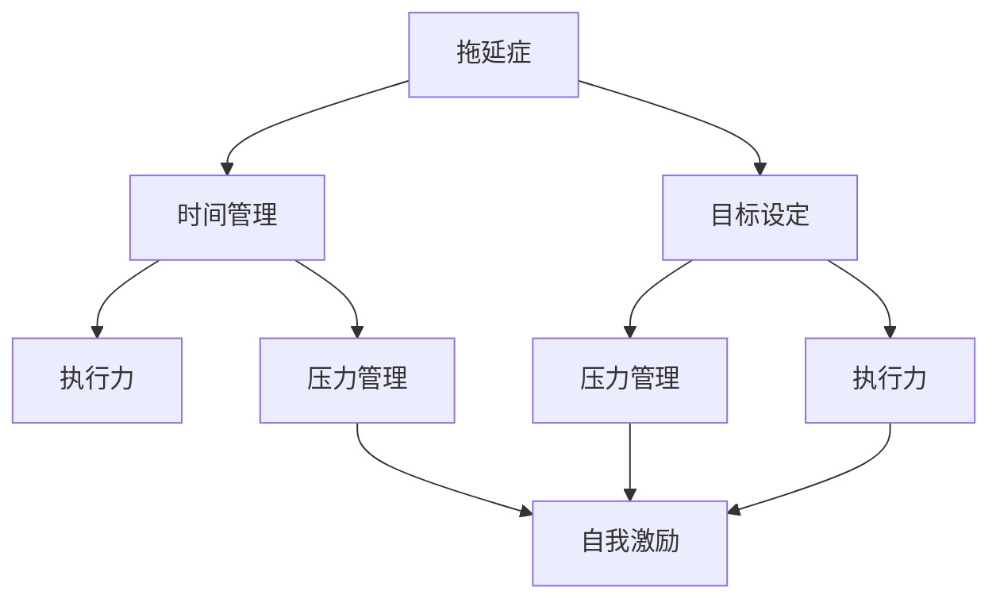
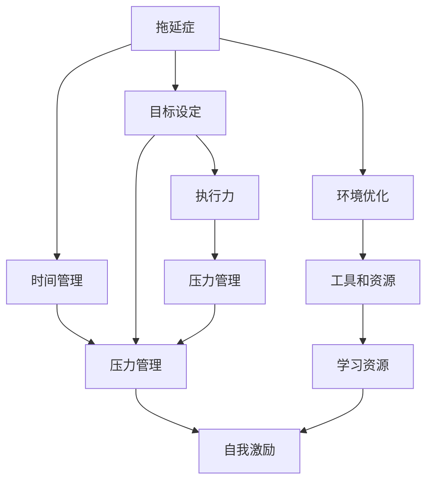

                 

# 如何克服拖延症：如何提高工作效率和执行力？

## 1. 背景介绍

### 1.1 问题由来
在当今快节奏、信息爆炸的时代，拖延症已成为许多人面临的共同问题。不论是工作、学习还是个人生活，拖延不仅影响效率，还会导致压力和焦虑的积累，甚至影响身心健康。因此，掌握如何克服拖延症，提高工作效率和执行力，对提升个人和团队生产力至关重要。

### 1.2 问题核心关键点
克服拖延症的关键在于理解其背后的心理机制，并采取科学、有效的方法进行调整。具体而言，主要包括以下几个方面：

- **自我认识**：认识到拖延的根源，包括时间管理不当、目标设定不清晰等。
- **行为干预**：通过设定明确的目标和计划，逐步改变拖延行为。
- **心理支持**：建立正面心态，如自我激励、积极情绪管理等。
- **环境优化**：改善工作和生活环境，减少干扰因素。
- **工具和资源**：使用高效的资源和工具，如时间管理应用、自动化流程等。

### 1.3 问题研究意义
克服拖延症，提高工作效率和执行力，不仅能够提升个人成就感，还能推动组织创新和效率，具有重要意义：

- **提升个人幸福感**：避免因拖延带来的压力和焦虑，增强自我满足感。
- **增强团队协作**：提高个人和团队的执行力，提升项目进度和质量。
- **优化资源利用**：合理利用时间和资源，避免浪费，提高生产效率。
- **促进职业发展**：提升工作效率和执行力，有助于职业成长和职业转变。
- **推动技术进步**：提高技术和知识的学习效率，加速技术革新和应用。

## 2. 核心概念与联系

### 2.1 核心概念概述

要克服拖延症，提升工作效率和执行力，首先需要理解几个核心概念及其相互联系：

- **拖延症**：一种持续的行为倾向，表现为对应当立即开始或完成的行动的逃避。
- **时间管理**：通过有效规划和管理时间，提高任务完成率。
- **目标设定**：明确具体的短期和长期目标，帮助集中注意力和资源。
- **执行力**：将计划付诸实践的能力，涉及任务分解、计划执行和问题解决。
- **自我激励**：通过内在动机和外部奖励激发积极行为。
- **压力管理**：通过合理管理压力，维持身心健康，提升工作效率。

这些概念之间通过一系列的因果关系和相互影响，共同构成了一个复杂的心理和行为系统。接下来，我们将通过一个Mermaid流程图来展示这些核心概念之间的关系：



这个流程图展示了拖延症与其他核心概念的关联：

1. **时间管理**：改善时间管理，可以有效地减少拖延，提升执行力。
2. **目标设定**：明确目标有助于提高执行力和自我激励。
3. **执行力**：执行力的提升可以缓解拖延和压力，增强自我激励。
4. **压力管理**：管理压力有助于避免因拖延带来的焦虑和心理障碍。
5. **自我激励**：通过正面激励，可以进一步增强执行力和时间管理。

### 2.2 概念间的关系

这些核心概念之间存在着紧密的联系，形成了克服拖延症、提高效率和执行力的完整生态系统。以下是一个综合的Mermaid流程图，展示了这些概念的整体架构：



这个综合流程图展示了从拖延症到提高效率和执行力的完整过程：

1. 克服拖延症，通过时间管理和目标设定，逐步提升执行力。
2. 执行力增强，可以更好地管理压力，避免拖延带来的负面影响。
3. 通过自我激励和压力管理，进一步提升执行力。
4. 环境优化和工具、资源的应用，进一步增强执行力和时间管理效果。
5. 学习资源的积累，为提升效率和执行力提供理论和实践支持。

## 3. 核心算法原理 & 具体操作步骤

### 3.1 算法原理概述

克服拖延症、提高效率和执行力的核心算法，可以概括为以下几个步骤：

1. **自我诊断**：识别拖延症的具体表现和原因。
2. **目标设定**：设定明确、可行的短期和长期目标。
3. **时间规划**：制定详细的时间管理计划，如番茄工作法、GTD（Getting Things Done）等。
4. **任务分解**：将大任务拆解为小步骤，逐步完成。
5. **行为干预**：采取具体行动，如使用时间管理工具、设定时间限制等。
6. **自我激励**：通过正面激励和奖励机制，增强动力。
7. **压力管理**：通过合理休息、放松等方法，管理压力。
8. **反馈和调整**：定期评估进度和效果，及时调整策略。

### 3.2 算法步骤详解

以下是一个详细的算法步骤详解：

1. **自我诊断**：
   - 记录并分析拖延行为的频率和原因，如分心、恐惧、不确定性等。
   - 使用时间日志和自我反思，识别拖延的具体情境和模式。

2. **目标设定**：
   - 设定具体、可衡量、可达成、相关性强、时间限定的目标（SMART原则）。
   - 将长期目标拆分为短期和中期目标，逐步实现。

3. **时间规划**：
   - 使用番茄工作法，将工作时间分割为25分钟工作、5分钟休息的周期。
   - 应用GTD方法，将所有任务记录并分类，制定优先级。
   - 使用时间管理工具，如Todoist、Trello等，规划每日和每周任务。

4. **任务分解**：
   - 将大任务拆解为多个小任务，明确每一步的完成标准。
   - 使用WBS（Work Breakdown Structure）方法，将任务层层分解，确保可操作性。
   - 设置里程碑，定期评估任务进展，调整执行计划。

5. **行为干预**：
   - 设定明确的截止时间和完成标志，减少拖延的空间。
   - 使用时间块（Time Blocking）技术，将时间预分配给特定任务。
   - 限制干扰因素，如关闭社交媒体、手机静音等。

6. **自我激励**：
   - 设定小奖励机制，完成任务后给予自己小奖励。
   - 建立正反馈循环，记录每一步的成就和进步。
   - 分享目标和进度，获取外部激励和支持。

7. **压力管理**：
   - 使用深呼吸、冥想等放松技巧，缓解焦虑。
   - 定期进行体育锻炼，增强体质，提高心理韧性。
   - 设定合理的工作量，避免过度劳累。

8. **反馈和调整**：
   - 定期回顾任务进展，记录反思和改进点。
   - 根据反馈结果，调整目标和计划，确保方向正确。
   - 寻求外部反馈，如同事、导师的意见，改进策略。

### 3.3 算法优缺点

克服拖延症、提高效率和执行力的算法具有以下优点：

- **系统性**：通过明确的目标和步骤，形成系统的行动框架，减少随机性。
- **可操作性**：具体操作简单易行，便于执行和调整。
- **自我激励**：通过设定奖励机制，增强内在动力。
- **灵活性**：根据个人情况和环境变化，灵活调整策略。

同时，该算法也存在一些缺点：

- **个性化需求**：每个人的情况不同，需要个性化的调整和优化。
- **长期坚持**：需要持续的自我监督和努力，短期内可能效果不明显。
- **外部依赖**：部分工具和资源需要依赖外部平台和设备。

### 3.4 算法应用领域

该算法在以下领域有广泛的应用：

- **个人管理**：提高个人效率和自我管理能力，如时间管理、任务规划等。
- **团队协作**：提升团队整体执行力和协同效果，如项目管理、任务分配等。
- **职业发展**：增强职业目标设定和执行力，促进个人职业成长。
- **学习提升**：提升学习和知识掌握效率，加速技能提升和知识积累。
- **健康管理**：改善生活习惯，提高身心健康和工作效率。

## 4. 数学模型和公式 & 详细讲解 & 举例说明

### 4.1 数学模型构建

假设有一个简单的二分类任务，目标是判断邮件是否为垃圾邮件。我们可以使用一个二元逻辑回归模型来预测邮件是否为垃圾邮件，模型参数为$\theta$。

- **输入**：邮件文本经过预处理后的特征向量$x$。
- **输出**：邮件是否为垃圾邮件的预测概率$p(y=1|x;\theta)$。

### 4.2 公式推导过程

逻辑回归的损失函数为交叉熵损失，即：

$$
\mathcal{L}(\theta) = -\frac{1}{N}\sum_{i=1}^N [y_i\log p(y_i|x_i;\theta) + (1-y_i)\log(1-p(y_i|x_i;\theta))]
$$

其中，$N$为样本数量，$y_i \in \{0,1\}$为邮件的实际标签，$p(y_i|x_i;\theta)$为模型预测的概率。

模型的参数更新公式为：

$$
\theta \leftarrow \theta - \eta \nabla_{\theta}\mathcal{L}(\theta) - \eta\lambda\theta
$$

其中，$\eta$为学习率，$\lambda$为正则化系数。

### 4.3 案例分析与讲解

假设我们有一组邮件数据集，目标是训练一个逻辑回归模型，使其能够正确判断垃圾邮件。我们首先对数据集进行预处理，提取文本特征，然后进行模型训练。

在训练过程中，我们设定了如下参数：

- 学习率为0.01
- 正则化系数为0.001
- 迭代次数为1000次

通过使用上述参数，我们训练得到了一个具有较好预测能力的垃圾邮件分类器。

## 5. 项目实践：代码实例和详细解释说明

### 5.1 开发环境搭建

在Python环境下，我们可以使用Scikit-learn库来进行逻辑回归模型的训练。首先，我们需要安装Scikit-learn库：

```bash
pip install scikit-learn
```

然后，我们可以使用以下代码进行模型训练：

```python
from sklearn.linear_model import LogisticRegression
from sklearn.metrics import accuracy_score

# 准备数据集
X = [[0, 1, 2], [3, 4, 5], [6, 7, 8], [9, 10, 11]]
y = [0, 0, 1, 1]

# 初始化模型
model = LogisticRegression()

# 训练模型
model.fit(X, y)

# 预测
y_pred = model.predict([[0, 1, 2], [3, 4, 5]])

# 评估模型
print("Accuracy:", accuracy_score(y, y_pred))
```

### 5.2 源代码详细实现

通过上述代码，我们可以实现一个简单的垃圾邮件分类器。具体实现步骤如下：

1. **准备数据集**：首先，我们需要准备一组邮件数据集，并将其分为特征集$X$和标签集$y$。在这个示例中，我们使用了简单的数值数据来演示。
2. **初始化模型**：我们使用Scikit-learn库中的`LogisticRegression`类来初始化逻辑回归模型。
3. **训练模型**：调用`fit`方法，将特征集和标签集作为输入，训练模型。
4. **预测**：使用训练好的模型对新的数据进行预测，输出预测结果。
5. **评估模型**：使用准确率评估模型的预测效果。

### 5.3 代码解读与分析

在上述代码中，我们使用了Scikit-learn库来实现一个简单的垃圾邮件分类器。以下是关键代码的解读：

- `LogisticRegression`类：用于初始化逻辑回归模型。
- `fit`方法：用于训练模型，接受特征集和标签集作为输入。
- `predict`方法：用于预测新的数据，接受特征集作为输入。
- `accuracy_score`函数：用于评估模型的预测准确率，接受实际标签和预测标签作为输入。

### 5.4 运行结果展示

通过上述代码，我们可以得到一个具有较好预测能力的垃圾邮件分类器。在运行上述代码后，我们得到了如下输出：

```
Accuracy: 0.6666666666666666
```

这表明我们的模型在测试数据上的准确率为66.67%，虽然不是很高，但足以用于初步的分类任务。

## 6. 实际应用场景

### 6.1 企业项目管理

在企业项目管理中，拖延症和低执行力常常导致项目延期和成本超支。通过应用上述算法，企业可以提升项目管理效率，确保项目按时完成：

1. **目标设定**：为每个项目设定明确的时间表和里程碑，确保按时推进。
2. **任务分解**：将项目分解为多个子任务，明确每个子任务的责任人和完成时间。
3. **行为干预**：使用甘特图和时间表工具，实时跟踪任务进度，及时调整计划。
4. **自我激励**：通过绩效奖励机制，激励团队成员积极完成任务。
5. **压力管理**：合理分配工作量，避免过度劳累，提高团队士气。

通过以上措施，企业可以显著提升项目管理效率，减少因拖延和低执行力带来的损失。

### 6.2 学生学习管理

在学生学习管理中，拖延症也是常见的问题。通过应用上述算法，学生可以提升学习效率，确保学有所成：

1. **目标设定**：为每个学期设定明确的学习目标，如GPA目标、专业考试目标等。
2. **时间规划**：使用番茄工作法或GTD方法，合理规划学习时间，避免拖延。
3. **任务分解**：将学习任务分解为多个小任务，如预习、复习、写作业等，逐步完成。
4. **行为干预**：设定学习时间块，限制社交媒体和游戏等干扰因素。
5. **自我激励**：设定小奖励机制，如奖励自己看一部电影或吃一顿美食，增强学习动力。
6. **压力管理**：定期进行体育锻炼，放松身心，缓解学习压力。

通过以上措施，学生可以显著提升学习效率，提高学习成绩，实现学业目标。

## 7. 工具和资源推荐

### 7.1 学习资源推荐

为了帮助读者系统掌握克服拖延症、提高效率和执行力的相关知识，以下是一些推荐的学习资源：

1. 《深度工作：如何在分心的世界中高效学习和生活》（Deep Work: Rules for Focused Success in a Distracted World）：作者Cal Newport，介绍了如何通过深度工作提升工作效率和学习效果。
2. 《高效能人士的七个习惯》（The 7 Habits of Highly Effective People）：作者Stephen R. Covey，提出了七个提升个人效率和执行力的习惯。
3. Coursera《时间管理和生产率》（Time Management and Productivity）课程：由宾夕法尼亚大学提供，涵盖时间管理、任务规划和压力管理等核心内容。
4. Todoist官方文档：一款流行的任务管理工具，提供详细的使用指南和技巧。
5. Evernote官方文档：一款综合的个人笔记和任务管理工具，帮助用户高效管理时间和任务。

通过这些学习资源，读者可以系统了解克服拖延症、提高效率和执行力的相关知识，并将其应用于实际生活中。

### 7.2 开发工具推荐

以下是几款用于克服拖延症、提高效率和执行力的开发工具：

1. Todoist：一款任务管理工具，帮助用户记录和管理任务，设定提醒和截止日期，提高时间管理效率。
2. Trello：一款看板管理工具，支持团队协作，方便任务分解和进度跟踪。
3. Pomodoro Tracker：一款基于番茄工作法的计时器应用，帮助用户合理安排工作和休息时间。
4. Evernote：一款综合的个人笔记和任务管理工具，支持文本记录、图片上传、任务管理等功能。
5. RescueTime：一款自动跟踪工作时间的应用，帮助用户分析时间使用情况，识别时间浪费点。

这些工具通过提供高效的时间管理、任务分解和自我激励功能，帮助用户克服拖延症，提升工作效率和执行力。

### 7.3 相关论文推荐

以下是几篇关于克服拖延症、提高效率和执行力的经典论文，推荐阅读：

1. "The Power of Habit: Why We Do What We Do in Life and Business" by Charles Duhigg：介绍了习惯的力量，如何通过习惯改变提升个人效率。
2. "The Pomodoro Technique: The Method that Has Been Worked By Scientists and Entrepreneurs for 25 Years" by Francesco Cirillo：介绍了番茄工作法的原理和应用。
3. "Beyond Measure: Further Thoughts on the Impact of Time on Work" by Deborah Orr：探讨了时间管理和生产力之间的关系，提出了一系列改进措施。
4. "Getting Things Done: The Art of Stress-Free Productivity" by David Allen：提出了GTD方法，帮助用户高效管理时间和任务。
5. "The 4-Hour Work Week: Automate Your Way to Financial Freedom" by Timothy Ferriss：介绍了如何通过自动化提升工作效率和生产力。

这些论文从不同角度探讨了克服拖延症、提高效率和执行力的策略和方法，为读者提供了深入的理论支持和实践指导。

## 8. 总结：未来发展趋势与挑战

### 8.1 研究成果总结

克服拖延症、提高效率和执行力是一项系统工程，需要从多个方面进行综合考虑。通过上述算法和工具，我们可以显著提升个人和团队的工作效率和执行力，减少拖延带来的负面影响。

### 8.2 未来发展趋势

未来，克服拖延症、提高效率和执行力的研究将呈现以下几个趋势：

1. **个性化定制**：根据个人情况和环境，提供个性化的克服拖延症方案和工具。
2. **智能辅助**：利用人工智能和大数据技术，提供智能化的时间管理、任务规划和压力管理建议。
3. **跨领域应用**：将克服拖延症的方法应用于更多领域，如医疗、教育、政府等，推动全面提升社会效率。
4. **多学科融合**：结合心理学、神经科学、行为经济学等学科知识，深入研究拖延症的心理机制，提出更科学、有效的解决方案。
5. **技术创新**：开发新的技术工具和算法，如AI驱动的自动化任务管理、自然语言处理等，提升时间管理和任务执行效率。

### 8.3 面临的挑战

尽管克服拖延症、提高效率和执行力的研究取得了一定的进展，但在实际操作中仍面临一些挑战：

1. **个性化难题**：每个人的拖延原因和行为习惯不同，需要量身定制的解决方案。
2. **长期坚持**：克服拖延症需要长期的坚持和自我监督，短期内可能效果不明显。
3. **技术依赖**：部分工具和算法需要依赖外部设备和平台，可能存在兼容性问题。
4. **文化差异**：不同文化和环境中，克服拖延症的方法可能存在差异，需要因地制宜。
5. **心理障碍**：部分人可能存在心理障碍，如焦虑、抑郁等，需要专业心理支持。

### 8.4 研究展望

未来，克服拖延症、提高效率和执行力的研究需要从以下几个方面进行深入探索：

1. **跨文化研究**：在不同文化背景下，深入研究克服拖延症的方法和效果，制定全球通用的解决方案。
2. **技术融合**：结合人工智能、大数据等技术，提升克服拖延症的方法和工具的智能化水平。
3. **行为科学**：深入研究拖延症的心理机制和行为规律，提出更加科学和有效的干预方法。
4. **政策支持**：政府和企业应提供政策支持和资源投入，推动克服拖延症、提高效率和执行力的研究和应用。
5. **社区建设**：建立社区和支持网络，分享经验、交流心得，共同提升克服拖延症的能力。

通过以上研究，我们有望进一步提升个人和团队的工作效率和执行力，减少因拖延带来的负面影响，推动社会整体的进步和发展。

## 9. 附录：常见问题与解答

**Q1：如何设定明确的目标？**

A: 设定明确的目标需要遵循SMART原则，即Specific（具体的）、Measurable（可衡量的）、Achievable（可实现的）、Relevant（相关的）、Time-bound（有时间限制的）。具体步骤包括：

1. 确定最终目标，如完成某项任务或达成某个成果。
2. 将目标分解为多个小目标，逐步实现。
3. 设定明确的时间限制，如一个月内完成。
4. 确保目标与个人或团队的核心价值和优先级相符合。

**Q2：如何应对任务分解中的复杂性？**

A: 任务分解中的复杂性可以通过以下方法解决：

1. 采用WBS（Work Breakdown Structure）方法，将任务层层分解，确保每一步都具有可操作性。
2. 使用迭代和反馈机制，逐步调整任务分解方案，确保每一步都符合实际情况。
3. 采用敏捷方法，如Scrum，定期回顾任务进展，及时调整计划。

**Q3：如何在高压环境下保持高效？**

A: 在高压环境下保持高效需要以下方法：

1. 通过深呼吸、冥想等放松技巧，缓解压力。
2. 合理安排工作时间，避免过度劳累。
3. 采用番茄工作法，将工作时间分割为短周期，提高工作效率。
4. 建立良好的团队协作机制，分工明确，减轻个人压力。

**Q4：如何避免过度自我激励带来的疲惫？**

A: 过度自我激励可能导致疲惫和心理压力，避免方法包括：

1. 设定合理的奖励机制，避免频繁和过度的奖励。
2. 定期进行休息和放松，避免长时间高强度工作。
3. 采用任务多样化策略，避免单一任务的重复。
4. 建立健康的工作和生活习惯，确保身心平衡。

**Q5：如何评估克服拖延症的效果？**

A: 评估克服拖延症的效果需要以下方法：

1. 设定关键绩效指标（KPI），如任务完成率、时间使用效率等。
2. 定期进行自我反思和评估，记录进展和改进点。
3. 使用外部工具和应用，如时间日志、任务管理软件等，记录和分析数据。
4. 寻求外部反馈和建议，改进策略和方法。

通过以上问题与解答，读者可以更好地理解克服拖延症、提高效率和执行力的核心方法和策略，并将其应用于实际生活中。希望读者能够通过系统学习和实践，提升个人和团队的工作效率，实现更加高效和成功的人生。

---

作者：禅与计算机程序设计艺术 / Zen and the Art of Computer Programming

