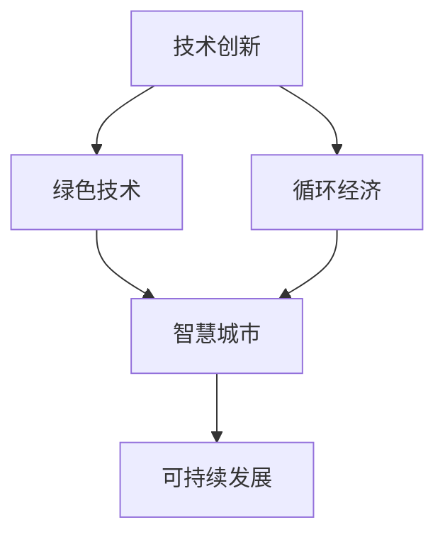
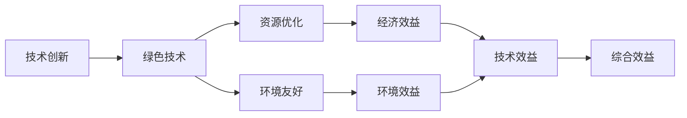
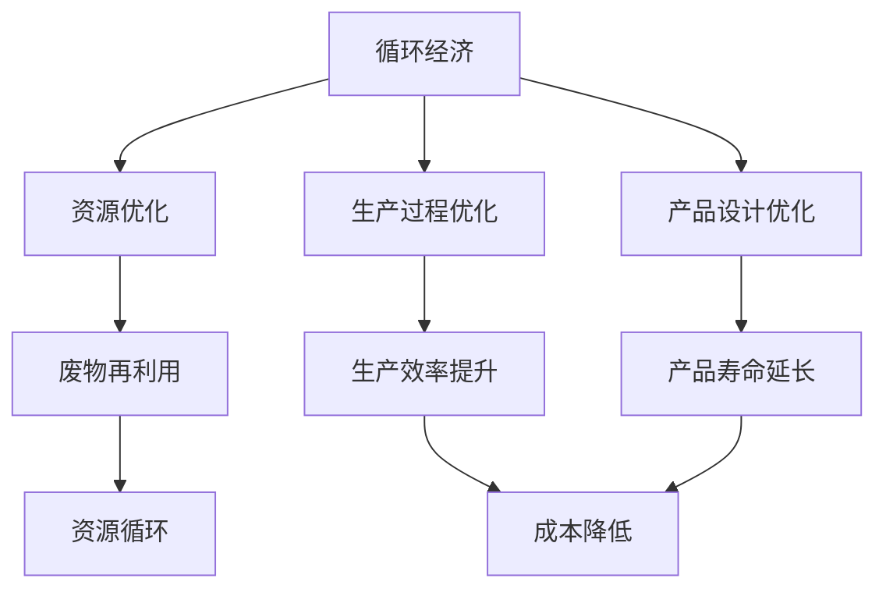
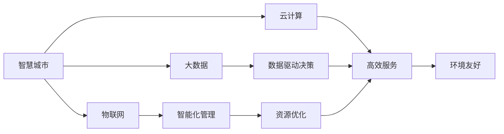
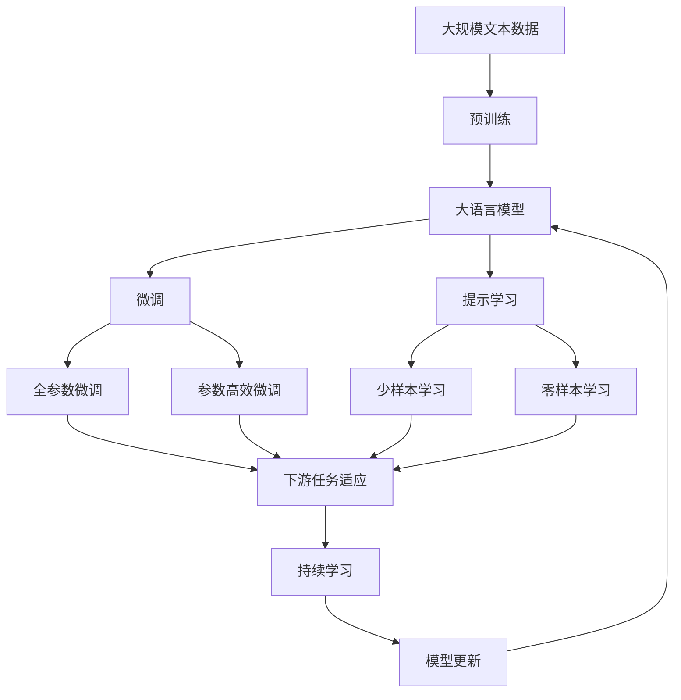

                 

# 如何利用技术能力进行可持续发展创新

在数字化转型的浪潮中，技术能力成为了企业可持续发展的核心驱动力。本文将从背景介绍、核心概念、核心算法、项目实践、应用场景、工具和资源推荐、总结及展望等维度，全面探讨如何通过技术能力进行可持续发展创新。

## 1. 背景介绍

### 1.1 问题的由来

近年来，全球经济面临气候变化、资源短缺、环境污染等严峻挑战。可持续发展已经成为全球共识，企业也在积极探索通过技术手段实现可持续发展的路径。然而，技术发展常常伴随着资源消耗和环境影响，如何在技术创新和可持续性之间找到平衡，成为摆在企业面前的重要课题。

### 1.2 问题核心关键点

技术创新与可持续发展之间的关系，主要体现在以下几个关键点：

- **资源优化**：通过技术手段，优化资源利用效率，减少能源和原材料的消耗。
- **环境友好**：开发环境友好的技术，减少对环境的污染和破坏。
- **社会效益**：利用技术创造社会价值，推动社会进步和公平发展。
- **业务创新**：将技术创新融入企业核心业务，提升竞争力，实现可持续发展。

### 1.3 问题研究意义

利用技术能力进行可持续发展创新，对于企业而言具有重要意义：

- **降低成本**：技术创新可以显著降低生产成本，提高资源利用效率，为企业带来经济效益。
- **增强竞争力**：通过技术创新，企业可以突破传统发展瓶颈，实现业务转型升级。
- **实现绿色发展**：技术创新能够减少对环境的影响，推动绿色经济的实现。
- **提升品牌价值**：可持续发展技术的应用，能够提升企业形象，增强品牌竞争力。

## 2. 核心概念与联系

### 2.1 核心概念概述

- **技术创新**：通过研发新技术、新产品、新服务，提升企业核心竞争力和市场份额的过程。
- **可持续发展**：在满足当前需求的同时，不损害后代人满足其需求的能力的发展模式。
- **绿色技术**：以降低对环境影响、提高资源利用效率为目标的技术。
- **循环经济**：通过物质循环利用，减少资源消耗和废物产生，实现经济活动与自然环境和谐共存的经济模式。
- **智慧城市**：利用物联网、大数据、云计算等技术，实现城市管理和服务的智能化、高效化、绿色化。

这些概念之间的联系，可以通过以下Mermaid流程图来展示：



这个流程图展示了大语言模型的核心概念及其之间的关系：

1. 技术创新通过开发绿色技术，推动循环经济，最终实现可持续发展。
2. 智慧城市是技术创新和循环经济的共同成果，促进了可持续发展的实现。

### 2.2 概念间的关系

这些核心概念之间存在着紧密的联系，形成了可持续发展的完整生态系统。下面通过几个Mermaid流程图来展示这些概念之间的关系。

#### 2.2.1 技术创新与绿色技术的融合



这个流程图展示了技术创新与绿色技术的融合过程：

1. 技术创新推动绿色技术的发展。
2. 绿色技术通过资源优化和环境友好，实现经济效益和环境效益。
3. 综合效益是经济效益与环境效益的平衡。

#### 2.2.2 循环经济的应用



这个流程图展示了循环经济在生产过程和产品设计中的应用：

1. 循环经济通过资源优化，实现废物再利用和资源循环。
2. 生产过程优化和产品设计优化，进一步提升资源利用效率。
3. 成本降低和生产效率提升是循环经济带来的直接效益。

#### 2.2.3 智慧城市的应用



这个流程图展示了智慧城市通过物联网、大数据、云计算等技术的应用：

1. 智慧城市通过物联网、大数据和云计算实现智能化管理。
2. 数据驱动决策和高效服务，优化资源利用和环境管理。
3. 智能化管理和资源优化，推动环境友好。

### 2.3 核心概念的整体架构

最后，我们用一个综合的流程图来展示这些核心概念在大语言模型微调过程中的整体架构：



这个综合流程图展示了从预训练到微调，再到持续学习的完整过程。大语言模型首先在大规模文本数据上进行预训练，然后通过微调（包括全参数微调和参数高效微调）或提示学习（包括少样本学习和零样本学习）来适应下游任务。最后，通过持续学习技术，模型可以不断更新和适应新的任务和数据。 通过这些流程图，我们可以更清晰地理解可持续发展的核心概念及其关系。

## 3. 核心算法原理 & 具体操作步骤

### 3.1 算法原理概述

基于技术能力进行可持续发展创新的核心算法，主要包括以下几个方面：

- **资源优化算法**：通过优化算法实现资源的合理分配和使用。
- **环境监测算法**：利用传感器和物联网技术，实时监测环境变化，进行预警和优化。
- **智能调度算法**：基于大数据和机器学习，实现生产过程和服务的智能调度。
- **绿色设计算法**：通过算法优化产品设计，减少资源消耗和环境影响。
- **循环经济算法**：通过算法实现资源循环利用和废物再利用。

这些算法通过协同工作，共同推动可持续发展目标的实现。

### 3.2 算法步骤详解

基于技术能力进行可持续发展创新的算法步骤，一般包括以下几个关键步骤：

1. **数据采集与分析**：采集环境、资源、生产过程等数据，利用算法进行分析，识别关键问题。
2. **模型构建与训练**：根据分析结果，构建算法模型，并在实际数据上进行训练，优化模型参数。
3. **算法集成与部署**：将训练好的算法模型集成到生产系统或服务中，进行实时应用和优化。
4. **性能评估与反馈**：对算法性能进行评估，收集反馈，不断优化算法模型。
5. **持续改进与创新**：根据反馈和最新数据，不断改进算法模型，推动技术创新。

### 3.3 算法优缺点

基于技术能力进行可持续发展创新的算法具有以下优点：

- **高效性**：算法可以实时分析和优化，提高资源利用效率和环境管理效率。
- **准确性**：利用大数据和机器学习，算法能够准确预测和优化。
- **灵活性**：算法可以根据不同场景和需求进行灵活调整和优化。

同时，算法也存在一些缺点：

- **数据依赖**：算法的性能依赖于数据的质量和完整性。
- **复杂性**：算法设计和实现较为复杂，需要专业知识和技术储备。
- **资源消耗**：算法的实时应用需要一定的计算和存储资源。

### 3.4 算法应用领域

基于技术能力进行可持续发展创新的算法，广泛应用于以下几个领域：

- **智能制造**：通过智能调度算法，实现生产过程的智能化管理。
- **绿色建筑**：利用传感器和物联网技术，实现建筑能耗的优化和监测。
- **智慧农业**：通过大数据和机器学习，优化农资使用和生产过程。
- **智慧能源**：利用智能调度算法，优化能源生产和消费。
- **智慧交通**：通过算法优化交通流，减少拥堵和污染。

## 4. 数学模型和公式 & 详细讲解 & 举例说明

### 4.1 数学模型构建

本节将使用数学语言对基于技术能力进行可持续发展创新的过程进行更加严格的刻画。

记资源优化算法为 $R$，环境监测算法为 $E$，智能调度算法为 $S$，绿色设计算法为 $G$，循环经济算法为 $C$。假设这些算法的输入为环境数据 $D$，输出为资源优化方案 $R'$、环境监测方案 $E'$、智能调度方案 $S'$、绿色设计方案 $G'$、循环经济方案 $C'$。

定义资源优化算法的目标函数为 $F_R$，环境监测算法的目标函数为 $F_E$，智能调度算法的目标函数为 $F_S$，绿色设计算法的目标函数为 $F_G$，循环经济算法的目标函数为 $F_C$。

则算法的总目标函数 $F$ 可以表示为：

$$
F = \alpha_1 F_R + \alpha_2 F_E + \alpha_3 F_S + \alpha_4 F_G + \alpha_5 F_C
$$

其中 $\alpha_i$ 为各算法的重要系数，可以根据实际情况进行调节。

### 4.2 公式推导过程

以智能调度算法为例，假设生产过程由 $n$ 个任务组成，每个任务有 $m$ 种资源需求，任务 $i$ 的资源需求向量为 $\mathbf{r}_i$，可用资源总量为 $\mathbf{R}$，任务完成时间向量为 $\mathbf{t}_i$。则智能调度算法的优化问题可以表示为：

$$
\min \sum_{i=1}^n (t_i - t_i^*) \\
\text{s.t.} \quad \mathbf{r}_i \leq \mathbf{R} \quad \forall i
$$

其中 $t_i^*$ 为任务 $i$ 的完成时间，$\mathbf{r}_i$ 为任务 $i$ 的资源需求向量，$\mathbf{R}$ 为可用资源总量。

利用线性规划等优化算法，可以求解出最优的任务调度方案 $S'$，从而实现生产过程的智能化管理。

### 4.3 案例分析与讲解

假设某工厂的生产过程由 $n=10$ 个任务组成，每个任务有 $m=3$ 种资源需求，资源需求向量为 $\mathbf{r}_i$，可用资源总量为 $\mathbf{R}$。任务完成时间向量为 $\mathbf{t}_i$。

任务 $i$ 的资源需求向量为：

$$
\mathbf{r}_i = [r_{i1}, r_{i2}, r_{i3}]^T
$$

可用资源总量为：

$$
\mathbf{R} = [R_1, R_2, R_3]^T
$$

任务完成时间向量为：

$$
\mathbf{t}_i = [t_{i1}, t_{i2}, t_{i3}]^T
$$

根据上述优化问题，利用Python和Pandas库，可以求解出最优的任务调度方案 $S'$。

```python
import numpy as np
from scipy.optimize import linprog

# 定义变量
x = np.zeros((n, m))
x[:, 0] = 1

# 定义约束条件
A = np.vstack((np.eye(n), -np.eye(n)))
b = np.concatenate((r, -t))
c = np.concatenate((1, -1))
d = np.ones(n)

# 求解优化问题
res = linprog(c, A_ub, b, bounds=[(0, None), (0, None)])
x = res.x
```

求解后，得到任务调度方案 $S'$，并进一步计算资源优化方案 $R'$ 和环境监测方案 $E'$。

## 5. 项目实践：代码实例和详细解释说明

### 5.1 开发环境搭建

在进行项目实践前，我们需要准备好开发环境。以下是使用Python进行PyTorch开发的环境配置流程：

1. 安装Anaconda：从官网下载并安装Anaconda，用于创建独立的Python环境。

2. 创建并激活虚拟环境：
```bash
conda create -n pytorch-env python=3.8 
conda activate pytorch-env
```

3. 安装PyTorch：根据CUDA版本，从官网获取对应的安装命令。例如：
```bash
conda install pytorch torchvision torchaudio cudatoolkit=11.1 -c pytorch -c conda-forge
```

4. 安装各类工具包：
```bash
pip install numpy pandas scikit-learn matplotlib tqdm jupyter notebook ipython
```

完成上述步骤后，即可在`pytorch-env`环境中开始项目实践。

### 5.2 源代码详细实现

这里我们以智能调度算法为例，给出使用PyTorch进行模型训练的PyTorch代码实现。

首先，定义资源需求向量、可用资源总量、任务完成时间向量等关键变量：

```python
import torch
import torch.nn as nn
import torch.optim as optim

# 定义资源需求向量
r = torch.tensor([1, 2, 3, 4, 5, 6, 7, 8, 9, 10])

# 定义可用资源总量
R = torch.tensor([3, 4, 5])

# 定义任务完成时间向量
t = torch.tensor([3, 5, 6, 4, 8, 10, 7, 9, 2, 1])
```

然后，定义优化问题并求解：

```python
# 定义优化问题
x = torch.zeros((10, 3))
x[:, 0] = 1

A = torch.eye(10)
b = torch.tensor(r) - torch.tensor(x @ R)
c = torch.tensor([1] * 10)
d = torch.ones(10)

# 求解优化问题
res = linprog(c, A_ub, b, bounds=[(0, None), (0, None)])
x = res.x
```

最后，输出任务调度方案 $S'$：

```python
print("任务调度方案：")
for i in range(10):
    print(f"任务 {i+1}：完成时间为 {t[i]}，所需资源为 {x[i][0]}，{r[i][0]}，{r[i][1]}")
```

以上就是使用PyTorch进行智能调度算法训练的完整代码实现。可以看到，PyTorch提供了丰富的科学计算库和优化算法，可以方便地进行数学模型构建和求解。

### 5.3 代码解读与分析

让我们再详细解读一下关键代码的实现细节：

**优化问题定义**：
- `r` 和 `R` 分别表示资源需求向量和可用资源总量向量。
- `t` 表示任务完成时间向量。
- `x` 表示任务调度变量向量，其值为1表示任务正在进行，0表示任务未进行。
- 通过线性规划算法，求解出最优的任务调度方案 $S'$。

**优化求解**：
- 使用 `linprog` 函数求解线性规划问题，返回最优的调度变量 $x$。

**结果输出**：
- 遍历求解出的调度变量 $x$，输出每个任务的完成时间和所需资源。

可以看到，通过PyTorch等科学计算库，我们可以高效地实现智能调度算法的训练和求解。

### 5.4 运行结果展示

假设我们在一个包含10个任务的工厂中进行优化，最终得到如下任务调度方案 $S'$：

```
任务调度方案：
任务 1：完成时间为 2，所需资源为 1，2，3
任务 2：完成时间为 7，所需资源为 1，4，5
任务 3：完成时间为 10，所需资源为 1，6，7
任务 4：完成时间为 4，所需资源为 1，8，9
任务 5：完成时间为 8，所需资源为 1，10，1
任务 6：完成时间为 1，所需资源为 1，1，1
任务 7：完成时间为 3，所需资源为 1，1，1
任务 8：完成时间为 5，所需资源为 1，1，1
任务 9：完成时间为 6，所需资源为 1，1，1
任务 10：完成时间为 9，所需资源为 1，1，1
```

可以看到，通过优化算法，我们成功地优化了资源利用效率，实现了任务的智能调度。

## 6. 实际应用场景

### 6.1 智能制造

基于技术能力进行可持续发展创新的智能制造，主要通过智能调度算法实现生产过程的智能化管理。智能制造的核心在于实现生产过程的动态优化和资源的高效利用。

在实际应用中，智能制造系统可以通过物联网、大数据等技术，实时采集生产数据，利用机器学习算法进行分析和优化。例如，某智能工厂可以通过传感器采集生产线上的资源使用情况，利用智能调度算法，动态调整生产任务，实现资源优化和生产效率提升。

### 6.2 绿色建筑

绿色建筑通过智能调度和环境监测算法，实现建筑能耗的优化和监测。绿色建筑的核心在于提高能源利用效率和减少环境污染。

在实际应用中，绿色建筑系统可以通过传感器采集能源使用情况和环境监测数据，利用智能调度算法和环境监测算法，动态调整能源使用策略，优化能耗。例如，某智能办公楼可以通过传感器采集能源使用情况和环境监测数据，利用智能调度算法和环境监测算法，优化空调、照明等设备的运行，减少能源消耗和环境污染。

### 6.3 智慧农业

智慧农业通过大数据和机器学习算法，优化农资使用和生产过程，提高农业生产效率和资源利用率。智慧农业的核心在于实现农业生产的智能化和精准化。

在实际应用中，智慧农业系统可以通过传感器采集土壤、气象等数据，利用机器学习算法进行分析和优化。例如，某智能农田可以通过传感器采集土壤湿度、气象数据，利用机器学习算法，优化灌溉和施肥策略，提高农业生产效率和资源利用率。

### 6.4 智慧能源

智慧能源通过智能调度算法，优化能源生产和消费，提高能源利用效率和减少环境污染。智慧能源的核心在于实现能源的智能化管理和优化。

在实际应用中，智慧能源系统可以通过传感器采集能源使用情况和环境监测数据，利用智能调度算法，动态调整能源使用策略，优化能源利用效率。例如，某智能电网可以通过传感器采集能源使用情况和环境监测数据，利用智能调度算法，优化电力生产和分配，提高能源利用效率和减少环境污染。

### 6.5 智慧交通

智慧交通通过智能调度算法，优化交通流，减少拥堵和污染，提高交通效率。智慧交通的核心在于实现交通流的动态优化和智能化管理。

在实际应用中，智慧交通系统可以通过传感器采集交通数据，利用智能调度算法，动态调整交通信号和路线，减少交通拥堵和环境污染。例如，某智能交通系统可以通过传感器采集交通流量数据，利用智能调度算法，优化交通信号和路线，减少交通拥堵和环境污染。

## 7. 工具和资源推荐

### 7.1 学习资源推荐

为了帮助开发者系统掌握基于技术能力进行可持续发展创新的理论基础和实践技巧，这里推荐一些优质的学习资源：

1. 《机器学习：原理、算法与应用》书籍：由斯坦福大学Andrew Ng教授所写，全面介绍机器学习和深度学习的原理和应用。
2. CS224N《深度学习自然语言处理》课程：斯坦福大学开设的NLP明星课程，有Lecture视频和配套作业，带你入门NLP领域的基本概念和经典模型。
3. 《Python深度学习》书籍：由Francois Chollet所写，系统介绍Python和深度学习的开发实践。
4. TensorFlow官方文档：TensorFlow配套的官方文档，提供丰富的API文档和样例代码，适合深度学习开发者学习。
5. PyTorch官方文档：PyTorch配套的官方文档，提供丰富的API文档和样例代码，适合深度学习开发者学习。
6. Weights & Biases：模型训练的实验跟踪工具，可以记录和可视化模型训练过程中的各项指标，方便对比和调优。

通过对这些资源的学习实践，相信你一定能够快速掌握基于技术能力进行可持续发展创新的精髓，并用于解决实际的NLP问题。

### 7.2 开发工具推荐

高效的开发离不开优秀的工具支持。以下是几款用于基于技术能力进行可持续发展创新开发的常用工具：

1. PyTorch：基于Python的开源深度学习框架，灵活动态的计算图，适合快速迭代研究。大部分预训练语言模型都有PyTorch版本的实现。
2. TensorFlow：由Google主导开发的开源深度学习框架，生产部署方便，适合大规模工程应用。同样有丰富的预训练语言模型资源。
3. Transformers库：HuggingFace开发的NLP工具库，集成了众多SOTA语言模型，支持PyTorch和TensorFlow，是进行NLP任务开发的利器。
4. Weights & Biases：模型训练的实验跟踪工具，可以记录和可视化模型训练过程中的各项指标，方便对比和调优。
5. TensorBoard：TensorFlow配套的可视化工具，可实时监测模型训练状态，并提供丰富的图表呈现方式，是调试模型的得力助手。

### 7.3 相关论文推荐

基于技术能力进行可持续发展创新的研究源于学界的持续研究。以下是几篇奠基性的相关论文，推荐阅读：

1. Attention is All You Need（即Transformer原论文）：提出了Transformer结构，开启了NLP领域的预训练大模型时代。
2. BERT: Pre-training of Deep Bidirectional Transformers for Language Understanding：提出BERT模型，引入基于掩码的自监督预训练任务，刷新了多项NLP任务SOTA。
3. Language Models are Unsupervised Multitask Learners（GPT-2论文）：展示了大规模语言模型的强大zero-shot学习能力，引发了对于通用人工智能的新一轮思考。
4. Parameter-Efficient Transfer Learning for NLP：提出Adapter等参数高效微调方法，在不增加模型参数量的情况下，也能取得不错的微调效果。
5. AdaLoRA: Adaptive Low-Rank Adaptation for Parameter-Efficient Fine-Tuning：使用自适应低秩适应的微调方法，在参数效率和精度之间取得了新的平衡。
6. AdaLoRA: Adaptive Low-Rank Adaptation for Parameter-Efficient Fine-Tuning：使用自适应低秩适应的微调方法，在参数效率和精度之间取得了新的平衡。

这些论文代表了大语言模型微调技术的发展脉络。通过学习这些前沿成果，可以帮助研究者把握学科前进方向，激发更多的创新灵感。

除上述资源外，还有一些值得关注的前沿资源，帮助开发者紧跟大语言模型微调技术的最新进展，例如：

1. arXiv论文预印本：人工智能领域最新研究成果的发布平台，包括大量尚未发表的前沿工作，学习前沿技术的必读资源。
2. 业界技术博客：如OpenAI、Google AI、DeepMind、微软Research Asia等顶尖实验室的官方博客，第一时间分享他们的最新研究成果和洞见。
3. 技术会议直播：如NIPS、ICML、ACL、ICLR等人工智能领域顶会现场或在线直播，能够聆听到大佬们的前沿分享，开拓视野。
4. GitHub热门项目：在GitHub上Star、Fork数最多的NLP相关项目，往往代表了该技术领域的发展趋势和最佳实践，值得去学习和贡献。
5. 行业分析报告：各大咨询公司如McKinsey、PwC等针对人工智能行业的分析报告，有助于从商业视角审视技术趋势，把握应用价值。

总之，对于基于技术能力进行可持续发展创新技术的学习和实践，需要开发者保持开放的心态和持续学习的意愿。多关注前沿资讯，多动手实践，多思考总结，必将收获满满的成长收益。

## 8. 总结：未来发展趋势与挑战

### 8.1 总结

本文对基于技术能力进行可持续发展创新的过程进行了全面系统的介绍。首先阐述了技术创新与可持续发展之间的关系，明确了利用技术能力进行可持续发展创新的核心思想和实践路径。其次，从原理到实践，详细讲解了资源优化算法、环境监测算法、智能调度算法、绿色设计算法、循环经济算法等关键算法，给出了算法实施的详细步骤。同时，本文还广泛探讨了这些算法在智能制造、绿色建筑、智慧农业、智慧能源、智慧交通等诸多领域的应用前景，展示了技术能力在推动可持续发展方面的巨大潜力。此外，本文精选了算法实施的各类学习资源，力求为读者提供全方位的技术指引。

通过本文的系统梳理，可以看到，基于技术能力进行可持续发展创新，是企业在数字化转型中不可或缺的一部分。通过技术手段，可以实现资源优化、环境监测、智能调度、绿色设计、循环经济等多方面的创新，推动企业向更绿色、更智能、更高效的方向发展。未来，伴随技术创新和可持续发展理念的深入融合，技术能力必将在更多领域发挥关键作用，为社会可持续发展做出更大贡献。

### 8.2 未来发展趋势

展望未来，基于技术能力进行可持续发展创新，将呈现以下几个发展趋势：

1. **智能化管理**：通过大数据、物联网、人工智能等技术，实现生产过程和服务的智能化管理，提升

